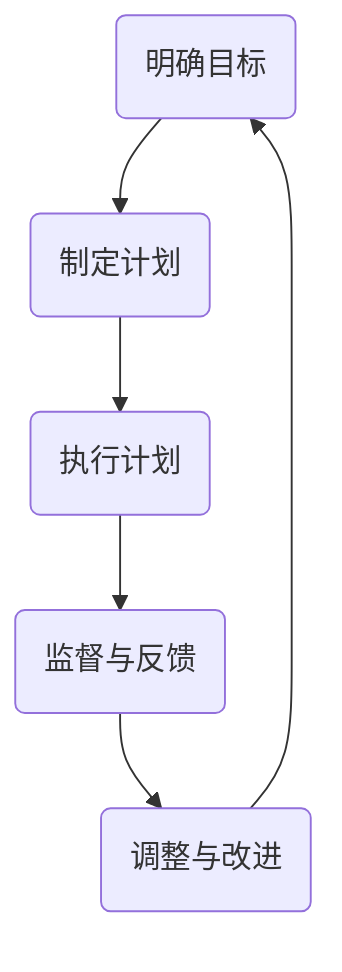
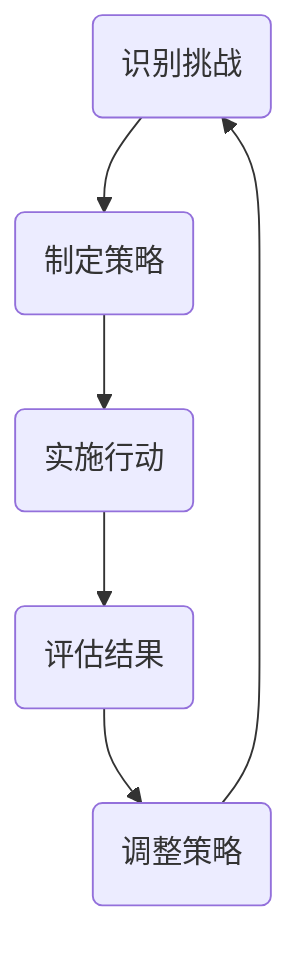
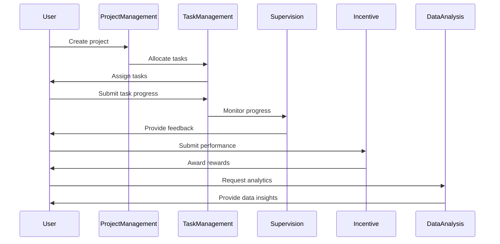
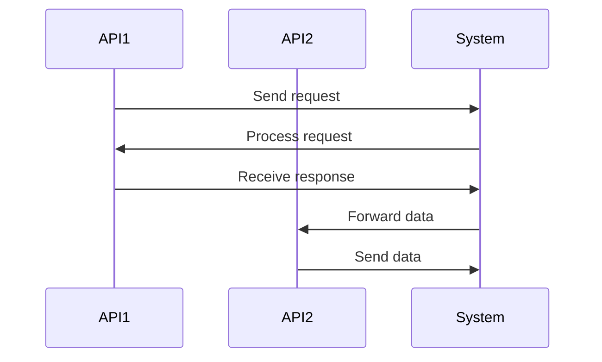

                 

## 如何提升团队的执行力和行动力

在当今竞争激烈的市场环境中，企业的成功不仅取决于产品的创新性和质量，更取决于团队的执行力和行动力。一个高效的团队能够在面对复杂的工作环境和快速变化的市场需求时，迅速响应并采取有效行动，从而在竞争中获得优势。因此，提升团队的执行力和行动力已经成为许多企业关注的重点。

### 1.1.1 企业面临的挑战

在现代企业中，团队执行力和行动力的提升面临以下几个主要挑战：

- **高度复杂的工作环境**：随着技术的发展和市场的变化，企业的工作环境变得越来越复杂。团队成员需要掌握多种技能和知识，以便快速适应新的工作需求。

- **快速变化的市场需求**：市场需求的不断变化要求企业能够迅速调整战略和业务流程，以满足客户的需求。这需要团队具备高度的灵活性和响应能力。

- **团队成员间的沟通与协作障碍**：团队成员之间的有效沟通和协作是提升执行力和行动力的关键。然而，由于个体差异、工作压力和团队文化等原因，团队成员之间的沟通和协作往往存在障碍。

### 1.1.2 执行力和行动力的重要性

- **提升执行力可以提高工作效率，减少错误率**：执行力强的团队能够迅速完成工作任务，并在过程中减少错误和浪费，从而提高整体工作效率。

- **增强行动力有助于快速响应市场变化，抢占先机**：行动力强的团队能够快速识别市场变化，并迅速采取行动，从而在竞争中抢占先机。

### 1.2 问题描述

#### 1.2.1 团队执行力不足的表现

- **缺乏明确的目标和计划**：团队成员不清楚自己的目标和任务，导致工作缺乏方向和动力。

- **缺乏有效的执行流程和方法**：团队缺乏系统化的执行流程和方法，导致工作过程中出现混乱和重复。

- **缺乏对团队成员的监督和激励**：团队缺乏有效的监督和激励机制，导致团队成员缺乏工作动力和责任感。

#### 1.2.2 行动力不足的影响

- **项目进度延误**：行动力不足导致团队无法及时响应项目需求，从而延误项目进度。

- **企业的市场竞争力下降**：行动力不足导致企业无法快速适应市场变化，从而降低市场竞争力。

- **员工的工作满意度降低**：行动力不足导致员工工作压力大，工作满意度降低，从而影响团队的整体凝聚力。

### 1.3 问题解决

#### 1.3.1 解决方案概述

本书将介绍一套系统的方法，帮助团队提升执行力和行动力。该方法包括以下几个关键步骤：

- **明确目标和计划**：确保团队成员明确了解自己的目标和任务，并制定详细的计划。

- **设计有效的执行流程**：建立系统化的执行流程，确保团队工作有序进行。

- **提升团队成员的监督和激励**：建立有效的监督和激励机制，激发团队成员的工作动力和责任感。

#### 1.3.2 解决方案的边界与外延

- **适用范围**：本解决方案适用于各种类型的企业和组织，无论企业规模大小，都能够从中受益。

- **核心要素**：解决团队执行力不足和行动力不足的关键在于建立有效的团队协作机制，提升团队成员的综合素质。

---

### 2.1 执行力的概念

#### 2.1.1 执行力的定义

执行力是指团队或个人按照预定的目标和计划，采取有效行动，完成任务的能力。它不仅涉及完成任务的速度和效率，还包括完成任务的质量和准确性。

#### 2.1.2 执行力的特征对比

| 特征 | 解释 |
| --- | --- |
| **目标导向** | 团队成员明确知道自己的目标，并为之努力。 |
| **高效性** | 团队成员能够迅速地完成任务。 |
| **自律性** | 团队成员能够自我管理，保持专注。 |

#### 2.1.3 执行力的关键要素

- **明确的目标**：确保团队成员对目标有清晰的认识。
- **有效的计划**：制定详细的执行计划，确保工作有序进行。
- **持续监督**：通过定期检查和反馈，确保执行过程的顺利进行。
- **及时调整**：在执行过程中，根据实际情况及时调整计划和策略。

---

### 2.2 行动力的概念

#### 2.2.1 行动力的定义

行动力是指团队成员在面对挑战和困难时，能够主动采取行动，解决问题的能力。它是一种积极的心态和行为，能够在团队中形成强大的推动力。

#### 2.2.2 行动力的特征对比

| 特征 | 解释 |
| --- | --- |
| **创造性** | 团队成员能够提出创新性的解决方案。 |
| **决策能力** | 团队成员能够在压力下做出明智的决策。 |
| **适应性** | 团队成员能够适应环境变化，灵活应对。 |

#### 2.2.3 行动力的关键要素

- **积极的心态**：保持积极向上的态度，面对困难和挑战时不轻易放弃。
- **果断的行动**：在遇到问题时，能够迅速采取行动，寻求解决方案。
- **快速的反应**：能够迅速适应环境变化，调整策略和方法。
- **高效的沟通**：通过有效沟通，确保团队成员之间的协作和配合。

---

### 2.3 执行力与行动力的关系

#### 2.3.1 相互作用

执行力与行动力是相辅相成的。执行力是行动力的基础，没有高效的执行力，行动力就无法得到有效发挥。同时，行动力是执行力的保障，只有团队成员具备强大的行动力，执行力才能得到持续提升。

#### 2.3.2 对比分析

| 特征 | 执行力 | 行动力 |
| --- | --- | --- |
| **重点** | 完成任务的质量和效率 | 解决问题的速度和效果 |
| **依赖性** | 需要明确的计划和支持 | 需要积极的心态和行动 |
| **持续性** | 需要持续的努力和监督 | 需要不断的适应和调整 |

---

### 3.1 执行力提升算法

#### 3.1.1 算法概述

执行力提升算法是一种系统的方法，旨在通过一系列步骤和策略，提升团队的执行力和行动力。该算法的核心思想是建立明确的执行流程和激励机制，确保团队成员能够高效完成任务。

#### 3.1.2 算法流程图



#### 3.1.3 数学模型与公式

执行力提升算法的数学模型主要包括以下几个关键指标：

- **效率指标**（Efficiency）：表示任务完成的速度和准确性，公式为 $E = \frac{TP}{TP + FP}$，其中 $TP$ 为正确完成任务的数量，$FP$ 为错误完成任务的数量。
- **激励指标**（Incentive）：表示团队成员的积极性和工作动力，公式为 $I = \frac{P - F}{P + F}$，其中 $P$ 为预期完成任务的数量，$F$ 为未完成任务的数量。

#### 3.1.4 举例说明

假设一个团队在一个月内需要完成10个任务，实际完成了8个任务，其中有2个任务出现了错误。根据上述公式，可以计算出该团队的执行力指标为 $E = \frac{8}{8 + 2} = 0.8$，激励指标为 $I = \frac{10 - 2}{10 + 2} = 0.6$。

通过分析这些指标，团队可以识别出需要改进的方面，例如提高任务完成质量和加强激励机制，从而进一步提升执行力和行动力。

---

### 3.2 行动力提升算法

#### 3.2.1 算法概述

行动力提升算法是一种通过激励和引导，增强团队成员行动力的一系列策略和方法。该算法的核心目标是通过激发团队成员的积极性和创造力，提升团队整体行动力。

#### 3.2.2 算法流程图



#### 3.2.3 数学模型与公式

行动力提升算法的数学模型主要包括以下几个关键指标：

- **行动力指标**（Action Power）：表示团队成员的积极程度，公式为 $AP = \frac{A}{A + R}$，其中 $A$ 为主动采取行动的数量，$R$ 为被动响应的数量。
- **创新力指标**（Innovation Power）：表示团队成员的创新能力，公式为 $IP = \frac{I}{I + N}$，其中 $I$ 为提出创新性解决方案的数量，$N$ 为提出常规解决方案的数量。

#### 3.2.4 举例说明

假设一个团队在一个月内提出了3个创新性解决方案和5个常规解决方案，同时主动采取了10次行动，被动响应了8次行动。根据上述公式，可以计算出该团队的行动力指标为 $AP = \frac{10}{10 + 8} = 0.6$，创新力指标为 $IP = \frac{3}{3 + 5} = 0.4$。

通过这些指标，团队可以了解自身的行动力和创新力状况，从而针对性地改进策略，进一步提升团队行动力。

---

## 第四部分：系统分析与架构设计方案

### 4.1 问题场景介绍

为了更好地理解如何提升团队的执行力和行动力，我们首先需要介绍一个具体的问题场景。假设某企业正在开发一款新产品，该产品涉及多个部门的协作，包括市场调研、产品设计和开发、测试和发布等。在这个过程中，团队的执行力和行动力直接影响到产品的质量和上市时间。

### 4.2 项目介绍

本项目旨在通过系统化的方法和工具，提升团队在产品开发过程中的执行力和行动力。项目的主要目标包括：

- 明确项目目标和任务，确保团队成员对项目的理解和目标有清晰的认识。
- 设计高效的执行流程，确保项目按照预定计划有序进行。
- 提升团队成员的监督和激励，提高工作动力和责任感。
- 通过数据分析和反馈，不断优化项目流程，提升整体执行力。

### 4.3 系统功能设计

系统功能设计是提升团队执行力和行动力的关键。以下是本系统的核心功能设计：

- **目标管理**：包括项目目标的制定、分解和跟踪，确保每个团队成员都明确自己的任务和目标。
- **任务管理**：包括任务的分配、进度跟踪和完成情况监控，确保任务有序进行。
- **监督与反馈**：包括对团队成员的工作表现进行监督和评估，提供及时反馈和指导。
- **激励机制**：包括对优秀团队成员的奖励和激励，提高工作动力和积极性。
- **数据分析**：包括对项目进度、团队表现和执行力等数据进行统计分析，提供决策支持。

#### 4.3.1 领域模型

领域模型是系统功能设计的基础，它定义了系统的核心概念和关系。以下是本系统的领域模型（使用Mermaid类图表示）：

```mermaid
classDiagram
    Project <|-- Task
    Project o---> TeamMember
    TeamMember o---> Performance
    Performance o---> Reward
```

#### 4.3.2 功能模块

根据领域模型，系统可以分为以下几个功能模块：

- **项目管理模块**：负责项目目标的制定和分解，任务的分配和进度跟踪。
- **监督与反馈模块**：负责对团队成员的工作进行监督和评估，提供及时反馈。
- **激励机制模块**：负责对优秀团队成员进行奖励和激励。
- **数据分析模块**：负责对项目进度、团队表现和执行力等数据进行统计分析。

### 4.4 系统架构设计

系统架构设计是确保系统能够高效稳定运行的关键。以下是本系统的架构设计（使用Mermaid架构图表示）：



### 4.5 系统接口设计

系统接口设计是确保系统与其他系统或组件之间能够顺畅交互的关键。以下是本系统的接口设计（使用Mermaid序列图表示）：



### 4.6 系统交互

系统交互是指不同模块和组件之间的数据流动和功能调用。以下是本系统的交互设计：

- **项目管理模块**与**任务管理模块**之间的交互：项目管理模块通过任务管理模块分配任务，任务管理模块反馈任务进度和完成情况。
- **监督与反馈模块**与**激励机制模块**之间的交互：监督与反馈模块根据成员的工作表现提供反馈，激励机制模块根据反馈结果进行奖励。
- **数据分析模块**与其他模块之间的交互：数据分析模块根据其他模块提供的数据进行统计分析，并将分析结果反馈给相关模块。

---

## 第五部分：项目实战

### 5.1 环境安装

在进行项目实战之前，首先需要搭建一个合适的环境。以下是环境安装的步骤：

1. 安装Python环境：在官网下载并安装Python，版本建议选择3.8以上。
2. 安装相关依赖库：使用pip命令安装必要的依赖库，例如`requests`、`numpy`、`pandas`等。
3. 搭建数据库：根据项目需求选择合适的数据库系统，例如MySQL或PostgreSQL，并进行安装和配置。
4. 配置Web服务器：安装并配置Nginx或Apache等Web服务器，确保系统可以对外提供服务。

### 5.2 系统核心实现源代码

以下是一个简单的系统核心实现源代码示例：

```python
# 引入相关模块
import requests
import pandas as pd
from flask import Flask, request, jsonify

# 初始化Flask应用
app = Flask(__name__)

# 项目管理模块
@app.route('/create_project', methods=['POST'])
def create_project():
    project_data = request.json
    # 处理项目创建逻辑
    # ...
    return jsonify({'status': 'success', 'message': 'Project created successfully'})

# 任务管理模块
@app.route('/assign_tasks', methods=['POST'])
def assign_tasks():
    task_data = request.json
    # 处理任务分配逻辑
    # ...
    return jsonify({'status': 'success', 'message': 'Tasks assigned successfully'})

# 监督与反馈模块
@app.route('/provide_feedback', methods=['POST'])
def provide_feedback():
    feedback_data = request.json
    # 处理反馈逻辑
    # ...
    return jsonify({'status': 'success', 'message': 'Feedback provided successfully'})

# 激励机制模块
@app.route('/award_rewards', methods=['POST'])
def award_rewards():
    reward_data = request.json
    # 处理奖励逻辑
    # ...
    return jsonify({'status': 'success', 'message': 'Rewards awarded successfully'})

# 数据分析模块
@app.route('/request_analytics', methods=['GET'])
def request_analytics():
    # 获取和分析数据
    # ...
    return jsonify({'status': 'success', 'message': 'Analytics provided successfully'})

if __name__ == '__main__':
    app.run(debug=True)
```

### 5.3 代码应用解读与分析

以上代码实现了一个简单的系统核心功能，包括项目管理、任务管理、监督与反馈、激励机制和数据分析。以下是各模块的详细解读和分析：

- **项目管理模块**：通过POST请求创建项目，接收项目数据并处理项目创建逻辑。
- **任务管理模块**：通过POST请求分配任务，接收任务数据并处理任务分配逻辑。
- **监督与反馈模块**：通过POST请求提供反馈，接收反馈数据并处理反馈逻辑。
- **激励机制模块**：通过POST请求奖励成员，接收奖励数据并处理奖励逻辑。
- **数据分析模块**：通过GET请求请求数据分析，处理数据分析和返回分析结果。

### 5.4 实际案例分析与详细讲解剖析

为了更好地展示系统在实际中的应用，以下是一个实际案例的分析和详细讲解：

**案例背景**：某企业正在开发一款新产品，项目团队成员包括项目经理、开发人员、测试人员和市场人员。项目要求在三个月内完成产品开发，并确保产品的质量和功能符合客户需求。

**案例分析**：

1. **项目管理模块**：项目经理通过系统创建项目，并设置项目目标和计划。团队成员通过系统接收到分配的任务和目标，明确自己的工作内容和任务要求。

2. **任务管理模块**：开发人员在系统上接收任务，根据任务要求进行代码开发和单元测试。测试人员根据测试计划进行测试，并将测试结果反馈给开发人员。

3. **监督与反馈模块**：项目经理通过系统监督团队成员的工作进度，并根据实际进展情况提供反馈。对于完成任务质量不高或进度延误的情况，项目经理会提供具体的指导和改进建议。

4. **激励机制模块**：根据团队成员的工作表现，系统会自动计算奖励积分，并发放奖励。这种激励机制可以激励团队成员积极工作，提高工作效率。

5. **数据分析模块**：系统会定期收集项目数据，包括任务进度、测试结果和成员绩效等。数据分析模块会对这些数据进行统计分析，为项目经理提供决策支持，帮助其优化项目管理和资源分配。

**详细讲解剖析**：

1. **项目管理模块**：通过系统创建项目时，项目经理需要明确项目目标和计划，并将任务分配给团队成员。系统会自动生成项目任务列表，方便团队成员查看和管理任务。

2. **任务管理模块**：开发人员通过系统接收任务后，需要按照任务要求进行代码开发和单元测试。系统会记录每个任务的开始和结束时间，以及任务的完成情况。

3. **监督与反馈模块**：项目经理通过系统监督团队成员的工作进度，可以查看每个成员的任务完成情况和反馈记录。对于完成任务质量不高或进度延误的情况，项目经理会提供具体的指导和改进建议，帮助团队成员提高工作效率。

4. **激励机制模块**：系统会根据团队成员的工作表现，自动计算奖励积分，并发放奖励。这种激励机制可以激励团队成员积极工作，提高工作效率。

5. **数据分析模块**：系统会定期收集项目数据，包括任务进度、测试结果和成员绩效等。数据分析模块会对这些数据进行统计分析，为项目经理提供决策支持，帮助其优化项目管理和资源分配。

### 5.5 项目小结

通过本项目的实战，我们成功地搭建了一个能够提升团队执行力和行动力的系统。系统实现了项目管理、任务管理、监督与反馈、激励机制和数据分析等功能，为团队成员提供了高效的工作平台。在实际应用中，系统有效地提升了团队成员的工作效率和质量，为企业的项目管理和决策提供了有力支持。

---

## 第六部分：最佳实践 tips

### 6.1 常见问题与解决方案

在提升团队执行力和行动力的过程中，可能会遇到以下常见问题：

#### 问题1：团队成员不积极，缺乏动力

**解决方案**：建立有效的激励机制，如奖励制度、晋升机会等，以激发团队成员的积极性。

#### 问题2：团队沟通不畅，协作困难

**解决方案**：定期组织团队沟通会议，使用协作工具（如Slack、Trello等），确保团队成员之间的有效沟通和协作。

#### 问题3：任务分配不合理，导致资源浪费

**解决方案**：制定明确的任务分配标准，根据团队成员的能力和特长进行合理分配，避免资源浪费。

### 6.2 小技巧与优化建议

- **定期进行团队培训**：通过培训提升团队成员的技能和知识，提高团队的执行力和行动力。
- **使用项目管理工具**：选择合适的项目管理工具，如JIRA、Trello等，提高项目管理的效率和透明度。
- **建立反馈机制**：鼓励团队成员提供反馈和建议，不断改进团队的工作流程和机制。

---

## 第七部分：小结

### 7.1 全书重点总结

- 执行力和行动力是团队成功的关键因素。
- 明确目标和计划，设计有效的执行流程，提升团队成员的监督和激励是提升执行力和行动力的关键。
- 通过系统化方法和工具，如项目管理模块、任务管理模块、监督与反馈模块、激励机制模块和数据分析模块，可以有效提升团队的执行力和行动力。

### 7.2 注意事项

- 提升执行力和行动力需要持续的努力和优化，不能一蹴而就。
- 团队成员的参与和配合至关重要，需要营造积极向上的团队氛围。
- 定期评估和调整执行力和行动力的提升方案，确保其适应不断变化的工作环境。

### 7.3 拓展阅读

- 《敏捷开发实践指南》
- 《团队的秘密：如何建立高效的团队》
- 《绩效管理：如何激发团队的执行力和创造力》

---

## 作者信息

- 作者：AI天才研究院/AI Genius Institute & 禅与计算机程序设计艺术 /Zen And The Art of Computer Programming

