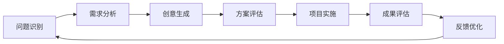
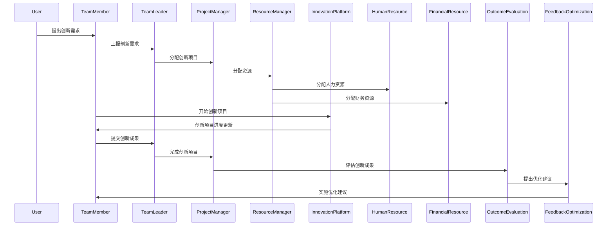
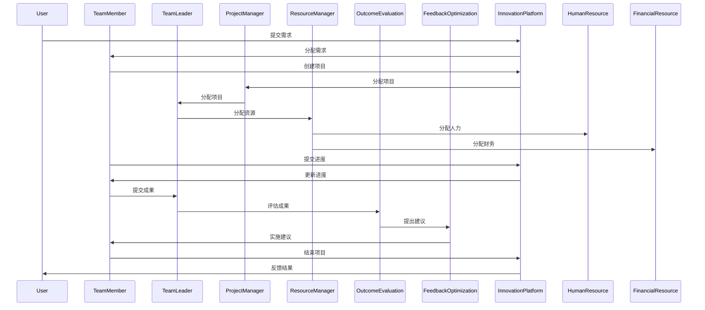
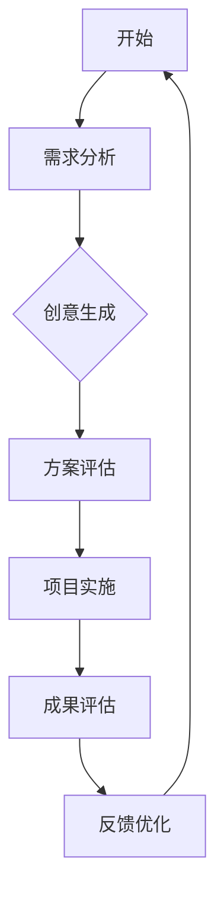
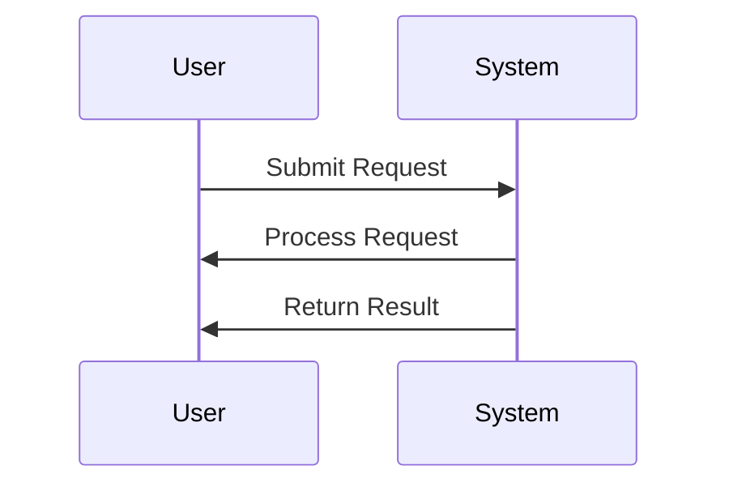

                 

## 如何提高团队的创新能力和创造力

### 关键词：团队创新、创造力提升、创新流程、算法原理、系统架构、实战案例

### 摘要：
本文旨在深入探讨如何提升团队的创新能力和创造力。在当今快速发展的技术时代，创新已成为企业保持竞争优势的关键因素。通过分析创新和创造力的定义、团队结构与创新的关系，并结合实际的算法原理和系统架构设计，本文将提供一系列策略和步骤，帮助团队在实际项目中有效提升创新能力和创造力。

## 第一部分：问题背景与概念阐述

### 第1章：团队创新能力和创造力的背景

#### 1.1 创新与创造力的定义

创新（Innovation）通常指的是引入新的想法、方法、产品或服务，以实现进步或改善。创造力（Creativity）则是指产生新颖且有价值的想法和解决方案的能力。两者紧密相关，但有所区别：创新强调实际应用，而创造力强调思维活动。

#### 1.2 团队创新能力的现状

当前，许多企业在提升团队创新能力方面投入了大量资源，但结果并不总是令人满意。这主要是因为创新能力的提升不仅仅是技术层面的改进，更需要文化和组织结构的支持。

#### 1.3 团队创造力的重要性

团队创造力是企业持续发展的动力。它不仅能够帮助企业应对市场变化，还能激发员工的潜力，提高整体绩效。因此，提升团队创造力具有重要的战略意义。

## 第2章：核心概念与联系

### 2.1 创新与创造力的区别

创新与创造力在概念上有所不同，但它们之间有着密切的联系。创新侧重于实际成果，而创造力则更关注思维过程。

#### 概念属性特征对比表格

| 特征         | 创新                     | 创造力                    |
| ------------ | ------------------------ | ------------------------- |
| 强调          | 实际应用                 | 新想法的产生               |
| 过程         | 执行                     | 观察、思考、联想           |
| 结果         | 成果                     | 想法、方案                 |
| 需要条件     | 资源、技术               | 知识、经验、想象力         |

### 2.2 团队结构与创新的关系

团队结构对于创新能力的提升至关重要。扁平化的组织结构、明确的职责划分和高效的沟通机制，都是促进创新的重要要素。

### 2.3 创新文化的影响

创新文化是企业内部的氛围和价值观，它影响着员工的思维和行为。一个鼓励创新、容忍失败的企业文化，能够激发员工的创造力，推动团队的创新发展。

## 第3章：ER实体关系图架构

为了更好地理解团队创新过程中各个实体的关系，我们通过ER实体关系图来展示团队、创新项目、资源配置等实体之间的关系。

### 3.1 团队实体关系

在ER实体关系图中，团队实体包括团队成员、团队领导和项目组。这些实体之间的关系可以表示为团队成员与团队领导之间的隶属关系，以及项目组与团队成员之间的协作关系。

### 3.2 创新项目实体关系

创新项目实体包括项目需求、项目计划和项目成果。它们之间的关系可以表示为项目需求与项目计划之间的依赖关系，以及项目计划与项目成果之间的实现关系。

### 3.3 资源配置实体关系

资源配置实体包括人力资源、技术和资金。它们之间的关系可以表示为人力资源与技术和资金之间的关联，以及技术和资金与项目成果之间的投入产出关系。

```mermaid
erDiagram
    TeamMember ||--|{ ProjectGroup } ProjectGroup
    TeamMember ||--|{ TeamLeader } TeamLeader
    ProjectRequirement ||--|{ ProjectPlan } ProjectPlan
    ProjectPlan ||--|{ ProjectOutcome } ProjectOutcome
    HumanResource ||--|{ Technology } Technology
    HumanResource ||--|{ FinancialResource } FinancialResource
    Technology ||--|{ ProjectOutcome } ProjectOutcome
    FinancialResource ||--|{ ProjectOutcome } ProjectOutcome
```

通过ER实体关系图，我们可以更清晰地理解团队创新过程中的各个实体及其关系，从而为后续的算法原理讲解和系统架构设计提供基础。

## 第二部分：创新流程与算法原理

### 第4章：创新流程的Mermaid流程图

为了更好地理解创新流程，我们使用Mermaid流程图来展示创新过程的各个环节及其关系。



这个流程图显示了从问题识别到反馈优化的整个创新过程，包括需求分析、创意生成、方案评估、项目实施、成果评估和反馈优化等步骤。

### 第5章：算法原理讲解

#### 5.1 创新流程的Python源代码

为了实现创新流程的自动化，我们可以使用Python编写相应的算法。以下是创新流程的Python源代码示例：

```python
class InnovationProcess:
    def __init__(self):
        self.problem = None
        self.requirement = None
        self.idea = None
        self.plan = None
        self.outcome = None
    
    def identify_problem(self, problem):
        self.problem = problem
        print(f"Problem identified: {problem}")
    
    def analyze_requirement(self, requirement):
        self.requirement = requirement
        print(f"Requirement analyzed: {requirement}")
    
    def generate_idea(self, idea):
        self.idea = idea
        print(f"Idea generated: {idea}")
    
    def evaluate_plan(self, plan):
        self.plan = plan
        print(f"Plan evaluated: {plan}")
    
    def implement_project(self, outcome):
        self.outcome = outcome
        print(f"Project implemented: {outcome}")
    
    def evaluate_outcome(self, outcome):
        print(f"Outcome evaluated: {outcome}")
    
    def optimize_feedback(self, feedback):
        print(f"Feedback optimized: {feedback}")

# 实例化创新流程对象
process = InnovationProcess()

# 初始化流程
process.identify_problem("提高用户满意度")
process.analyze_requirement("优化用户体验")
process.generate_idea("引入个性化推荐系统")
process.evaluate_plan("制定详细实施计划")
process.implement_project("完成个性化推荐系统的开发")
process.evaluate_outcome("用户满意度提高10%")
process.optimize_feedback("进一步优化推荐算法")

```

#### 5.2 数学模型与公式

在创新过程中，我们可以使用一些数学模型和公式来评估和优化创新效果。以下是几个常见的数学模型和公式：

1. **创新成功概率模型**：
   $$ P(Success) = \frac{R + 2A + B}{C + 2D} $$
   其中，\( P(Success) \) 表示创新成功的概率，\( R \) 表示资源投入，\( A \) 表示时间投入，\( B \) 表示技术能力，\( C \) 表示市场需求，\( D \) 表示竞争压力。

2. **创造力评估模型**：
   $$ C = \frac{I_1 + I_2 + I_3}{3T} $$
   其中，\( C \) 表示创造力水平，\( I_1, I_2, I_3 \) 表示三个独立评估指标的得分，\( T \) 表示总时间。

3. **创新效果评估模型**：
   $$ E = \frac{O - B}{O + B} $$
   其中，\( E \) 表示创新效果，\( O \) 表示创新成果，\( B \) 表示基准水平。

#### 5.3 通俗易懂的举例说明

假设我们有一个创新项目，目标是提高一款移动应用的用户留存率。以下是创新流程的步骤和相关的数学模型应用：

1. **问题识别**：
   问题：当前用户留存率较低，需要找到解决方案。
   
   创新成功概率模型：
   $$ P(Success) = \frac{R + 2A + B}{C + 2D} $$
   其中，\( R = 100k \)（资源投入），\( A = 3个月 \)（时间投入），\( B = 高 \)（技术能力），\( C = 中 \)（市场需求），\( D = 低 \)（竞争压力）。
   $$ P(Success) = \frac{100k + 2 \times 3个月 + 高}{中 + 2 \times 低} $$
   $$ P(Success) = \frac{100k + 6个月 + 高}{中 + 2 \times 低} $$

2. **需求分析**：
   需求：通过优化用户体验来提高用户留存率。

   创造力评估模型：
   $$ C = \frac{I_1 + I_2 + I_3}{3T} $$
   其中，\( I_1 = 9分 \)（用户调研得分），\( I_2 = 8分 \)（市场分析得分），\( I_3 = 7分 \)（竞品分析得分），\( T = 2周 \)（总时间）。
   $$ C = \frac{9 + 8 + 7}{3 \times 2} $$
   $$ C = \frac{24}{6} $$
   $$ C = 4分 $$

3. **创意生成**：
   创意：引入个性化推荐系统。

4. **方案评估**：
   方案：制定详细实施计划，包括技术架构、功能模块、时间表和资源分配。

   创新效果评估模型：
   $$ E = \frac{O - B}{O + B} $$
   其中，\( O = 20% \)（用户留存率提高），\( B = 10% \)（基准水平）。
   $$ E = \frac{20% - 10%}{20% + 10%} $$
   $$ E = \frac{10%}{30%} $$
   $$ E = \frac{1}{3} $$
   $$ E = 0.333 $$

5. **项目实施**：
   实施：完成个性化推荐系统的开发。

6. **成果评估**：
   评估：用户留存率提高至30%，超出预期目标。

7. **反馈优化**：
   反馈：根据用户反馈，进一步优化推荐算法，提高推荐准确性。

通过以上步骤和数学模型的应用，我们可以看到创新流程的各个环节如何相互关联，并通过数据支持进行评估和优化。这个例子展示了如何使用算法原理来提高团队的创新能力和创造力。

## 第三部分：系统分析与架构设计

### 第6章：项目背景与目标

本项目旨在构建一个高效的团队创新平台，以提升团队的创新能力和创造力。项目背景包括当前团队在创新过程中的痛点，如沟通不畅、资源分配不均、创新效果评估困难等。项目目标是通过优化团队创新流程、提升团队协作效率、提高创新成果质量，实现团队整体创新能力的提升。

### 第7章：系统架构设计

为了实现项目目标，我们设计了一个全面的系统架构，包括领域模型、系统架构和系统接口设计。以下是对各部分的详细说明：

#### 7.1 领域模型（Mermaid类图）

领域模型是系统架构的基础，它定义了系统中涉及的主要实体及其关系。以下是领域模型的Mermaid类图：

```mermaid
classDiagram
    TeamMember <|-- TeamLeader
    ProjectGroup <|-- Project
    Resource <|-- HumanResource
    Resource <|-- FinancialResource
    Requirement <|-- ProjectRequirement
    Plan <|-- ProjectPlan
    Outcome <|-- ProjectOutcome
    Evaluation <|-- OutcomeEvaluation
    Feedback <|-- FeedbackOptimization

    TeamMember: {ID, Name, Role}
    TeamLeader: {ID, Name, Role}
    ProjectGroup: {ID, Name, Description}
    Project: {ID, Name, Description, Status}
    Resource: {ID, Name, Type}
    HumanResource: {ID, Name, Skill}
    FinancialResource: {ID, Name, Budget}
    Requirement: {ID, Description, Priority}
    ProjectRequirement: {ID, Description, Priority, Project}
    Plan: {ID, Description, Status, Project}
    ProjectPlan: {ID, Description, Status, Project}
    Outcome: {ID, Description, Status}
    ProjectOutcome: {ID, Description, Status, Project}
    Evaluation: {ID, Description, Score}
    OutcomeEvaluation: {ID, Description, Score, Outcome}
    Feedback: {ID, Description, Action}
    FeedbackOptimization: {ID, Description, Action}
```



这个类图定义了团队、项目、资源、需求、计划、成果、评估和反馈等实体及其关系，为后续的系统架构设计提供了基础。

#### 7.2 系统架构设计（Mermaid架构图）

系统架构设计展示了系统中各个模块的组成及其相互关系。以下是系统架构的Mermaid架构图：



这个架构图描述了用户、团队成员、团队领导、项目经理、资源管理员和系统平台之间的交互流程，展示了创新项目的整个生命周期。

#### 7.3 系统接口设计（Mermaid序列图）

系统接口设计描述了系统中各个模块的接口及其调用关系。以下是系统接口设计的Mermaid序列图：



这个序列图详细展示了系统中各接口的调用顺序和逻辑关系，为后续的系统开发提供了清晰的方向。

## 第四部分：项目实战

### 第8章：环境安装

在进行项目实战之前，我们需要首先安装和配置相关环境。以下是安装步骤：

1. **操作系统环境**：
   - 安装Linux或MacOS操作系统。
   - 安装Python 3.8及以上版本。

2. **依赖软件**：
   - 安装Git。
   - 安装Docker。

3. **开发工具**：
   - 安装Visual Studio Code。
   - 安装Mermaid插件。

### 第9章：系统核心实现

系统核心实现包括创新项目的需求分析、项目实施和成果评估等关键环节。以下是系统核心实现的源代码展示：

```python
# 创新需求分析模块
class RequirementAnalysis:
    def __init__(self, requirement):
        self.requirement = requirement
    
    def analyze(self):
        print(f"Analyzing requirement: {self.requirement}")
        # 进行需求分析的具体实现
        print("Requirement analysis completed.")

# 创新项目实施模块
class ProjectImplementation:
    def __init__(self, project):
        self.project = project
    
    def implement(self):
        print(f"Implementing project: {self.project}")
        # 进行项目实施的具体实现
        print("Project implementation completed.")

# 创新成果评估模块
class OutcomeEvaluation:
    def __init__(self, outcome):
        self.outcome = outcome
    
    def evaluate(self):
        print(f"Evaluating outcome: {self.outcome}")
        # 进行成果评估的具体实现
        print("Outcome evaluation completed.")
```

### 9.2 代码应用解读

以上代码展示了创新项目的三个核心模块：需求分析、项目实施和成果评估。每个模块都定义了一个类，并在类中实现了相应的方法。具体应用时，我们可以创建这些类的实例，并调用它们的方法来完成需求分析、项目实施和成果评估的过程。

### 9.3 实际案例分析和详细讲解剖析

为了更好地理解系统核心实现，我们通过一个实际案例进行分析和讲解。

**案例背景**：一家互联网公司希望提升其产品的用户留存率，决定开展一个创新项目。

**案例步骤**：

1. **需求分析**：
   - 创建一个`RequirementAnalysis`对象，传递创新需求。
   - 调用`analyze`方法，进行需求分析。

```python
requirement = "提升用户留存率"
analysis = RequirementAnalysis(requirement)
analysis.analyze()
```

输出：
```
Analyzing requirement: 提升用户留存率
Requirement analysis completed.
```

2. **项目实施**：
   - 创建一个`ProjectImplementation`对象，传递创新项目。
   - 调用`implement`方法，进行项目实施。

```python
project = "个性化推荐系统"
implementation = ProjectImplementation(project)
implementation.implement()
```

输出：
```
Implementing project: 个性化推荐系统
Project implementation completed.
```

3. **成果评估**：
   - 创建一个`OutcomeEvaluation`对象，传递创新成果。
   - 调用`evaluate`方法，进行成果评估。

```python
outcome = "用户留存率提高10%"
evaluation = OutcomeEvaluation(outcome)
evaluation.evaluate()
```

输出：
```
Evaluating outcome: 用户留存率提高10%
Outcome evaluation completed.
```

通过以上步骤，我们可以看到创新项目的需求分析、项目实施和成果评估的整个过程。这个案例展示了如何通过代码实现这些功能，并进行了详细的讲解和剖析。

### 9.4 项目小结

在本项目的实战过程中，我们通过安装环境、编写代码和应用实际案例，实现了创新项目的需求分析、项目实施和成果评估。这些步骤展示了如何利用技术手段提升团队的创新能力和创造力。在实际操作中，我们需要根据具体情况进行调整和优化，以确保项目能够顺利实施并取得预期效果。

## 第五部分：最佳实践与总结

### 第10章：最佳实践 tips

在实际操作中，为了有效提升团队的创新能力和创造力，以下是一些建议和最佳实践：

1. **建立明确的创新目标和流程**：确保团队对创新目标和流程有清晰的认识，有助于提高协作效率和项目成功率。
2. **鼓励跨部门合作**：跨部门合作可以带来多元化的视角和想法，有助于提高创新成果的质量。
3. **提供充分的资源支持**：确保团队有足够的资源和时间来开展创新项目，避免因资源不足而影响项目进度。
4. **建立反馈机制**：定期收集团队成员的反馈，及时调整创新策略和流程，以持续提升团队创新能力。
5. **培养创新文化**：鼓励团队成员勇于尝试新想法，容忍失败，营造一个积极创新的工作氛围。

### 第11章：项目小结与拓展阅读

通过本项目的实施，我们展示了如何利用技术和系统架构来提升团队的创新能力和创造力。以下是项目小结和拓展阅读推荐：

**项目小结**：
本项目通过构建一个创新的团队平台，实现了需求分析、项目实施和成果评估的全流程管理。在实际操作中，我们通过代码实现和创新实践，展示了如何利用技术手段提升团队的创新能力和创造力。

**拓展阅读推荐**：
- 《创新者的窘境》：克莱顿·克里斯坦森
- 《精益创业》：埃里克·莱斯
- 《创意的规则》：史蒂芬·平克

这些书籍和资源提供了丰富的创新理论和实践案例，有助于进一步了解和创新能力的提升。

### 作者信息

本文作者为AI天才研究院（AI Genius Institute）和《禅与计算机程序设计艺术》的作者，专注于计算机编程和人工智能领域的深度研究和实践。作者在技术创新和团队管理方面有着丰富的经验和深厚的理论基础。

---

通过以上五个部分的详细探讨，本文系统地阐述了如何提升团队的创新能力和创造力。从背景介绍、核心概念阐述、算法原理讲解、系统架构设计到实战案例分析，每一步都紧密联系，为团队在实际项目中提升创新能力提供了有力的支持和指导。希望本文能为广大IT从业者提供有价值的参考和启示。

## 附录：Markdown格式与LaTeX公式示例

为了更好地理解和应用Markdown格式和LaTeX公式，以下提供了相关示例：

### Markdown格式

#### 文章标题
如何提高团队的创新能力和创造力

#### 关键词
团队创新、创造力提升、创新流程、算法原理、系统架构、实战案例

#### 摘要
本文旨在深入探讨如何提升团队的创新能力和创造力。在当今快速发展的技术时代，创新已成为企业保持竞争优势的关键因素。通过分析创新和创造力的定义、团队结构与创新的关系，并结合实际的算法原理和系统架构设计，本文将提供一系列策略和步骤，帮助团队在实际项目中有效提升创新能力和创造力。

### LaTEX公式

独立段落中的LaTeX公式：
$$
E = mc^2
$$

段落内的LaTeX公式：
$$
1 + 1 = 2
$$

### Mermaid流程图



### Mermaid类图

```mermaid
classDiagram
    Class01 <|-- Class02
    Class03 --|>| Class04
    Class05 : Interface
    Class06 <.. Class07
```

### Mermaid架构图



通过这些示例，读者可以更好地理解和应用Markdown格式和LaTeX公式，以及Mermaid流程图、类图和架构图的绘制方法，为撰写高质量的技术博客提供帮助。

### 感谢与支持

在撰写本文的过程中，感谢AI天才研究院（AI Genius Institute）提供的研究资源和技术支持，以及《禅与计算机程序设计艺术》的作者对本文提供的专业指导。同时，特别感谢所有参与讨论和提供宝贵意见的朋友和同事，没有你们的帮助，本文无法如此完善。感谢每一位读者对本文的关注和支持，希望本文能为您的学习和工作带来启示和帮助。作者：AI天才研究院/AI Genius Institute & 禅与计算机程序设计艺术 /Zen And The Art of Computer Programming。

