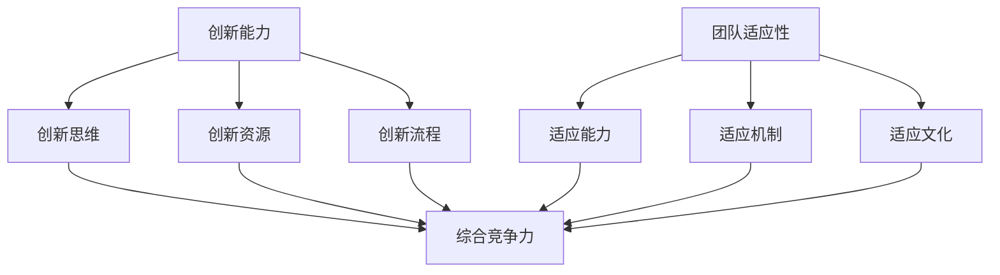

                 

# 如何提高团队的创新能力和适应性

> 关键词：团队创新能力、适应性、策略、实践

> 摘要：本文深入探讨了如何提高团队的创新能力和适应性。通过分析当前商业环境的挑战，阐述了创新能力和团队适应性的重要性，以及它们之间的相互关系。接着，提出了提高团队创新能力的五个策略：构建创新文化、激励创新、提供创新资源、培养创新人才和建立创新流程。同时，介绍了提高团队适应性的四个策略：培养适应能力、建立适应机制、促进团队学习和构建适应性文化。最后，通过综合实践和总结，为团队提供了实际操作的指导。

## 第一部分: 背景介绍

### 1.1 问题背景

#### 1.1.1 当前商业环境的挑战

在当今快速变化和竞争激烈的商业环境中，企业面临着前所未有的挑战。技术进步、市场变化、客户需求不断演变，要求企业必须具备强大的创新能力和适应性。以下是一些典型的挑战：

- **技术变革**：云计算、大数据、人工智能等技术的迅速发展，迫使企业不断更新技术栈，以适应新的市场需求。
- **市场动荡**：经济不稳定、市场竞争加剧，要求企业必须具备快速响应和调整能力。
- **客户需求**：客户需求越来越个性化，企业需要不断创新以满足客户需求，保持竞争优势。

#### 1.1.2 创新能力的重要性

创新能力是企业在竞争中获得成功的关键因素。它不仅能帮助企业开发新产品、优化业务流程，还能提升企业的市场竞争力。以下是一些原因：

- **持续增长**：创新能力能帮助企业不断开拓新市场、新业务，实现持续增长。
- **竞争优势**：创新的产品和服务能帮助企业脱颖而出，赢得客户和市场。
- **组织活力**：创新文化能激发员工的创造力和积极性，提高组织的活力和凝聚力。

#### 1.1.3 团队适应性的概念

团队适应性是指团队在面对外部环境变化时，能够迅速调整自身行为和策略的能力。团队适应性对企业的成功至关重要，原因如下：

- **应对变化**：适应性强团队能快速应对外部环境的变化，减少因变化带来的负面影响。
- **协作效率**：适应性强的团队能更好地协同工作，提高整体效率。
- **组织学习**：适应性强的团队能从变化中学习，不断提升自身能力和素质。

### 1.2 核心概念与联系

#### 1.2.1 创新能力原理

创新能力是指企业在产品、服务、业务流程等方面进行创新的能力。它包括以下几个方面：

- **技术创新**：通过引入新技术、改进现有技术，提升产品性能和用户体验。
- **产品创新**：开发新产品、优化产品特性，满足客户需求。
- **业务流程创新**：优化业务流程，提高运营效率，降低成本。

#### 1.2.2 团队适应性原理

团队适应性是指团队在面对外部环境变化时，能够迅速调整自身行为和策略的能力。它包括以下几个方面：

- **快速响应**：对市场变化、客户需求等外部信号做出快速反应。
- **灵活调整**：根据外部环境变化，灵活调整团队策略和行动计划。
- **持续学习**：从外部环境中学习，不断提升团队能力和素质。

#### 1.2.3 创新能力与团队适应性的关系

创新能力和团队适应性密切相关，两者相互促进。创新能力为团队提供了创新的动力和方向，而团队适应性则确保了创新成果的实现和推广。具体来说：

- **相互依赖**：创新能力需要团队适应性来确保创新成果的实施和推广，而团队适应性也需要创新能力来驱动团队不断进步。
- **协同发展**：创新能力和团队适应性共同发展，能帮助企业保持竞争优势，实现持续增长。

### 1.3 边界与外延

#### 1.3.1 创新能力的边界

创新能力的边界主要受以下因素影响：

- **资源限制**：包括资金、人力、技术等资源的限制，可能影响创新能力的发挥。
- **市场容量**：市场需求和竞争态势可能限制创新能力的应用范围。
- **法律法规**：相关法律法规可能对创新活动进行限制。

#### 1.3.2 团队适应性的边界

团队适应性的边界主要受以下因素影响：

- **组织文化**：组织文化可能影响团队适应性的发挥，如保守文化可能导致团队适应能力较弱。
- **领导风格**：领导风格可能影响团队适应性的发挥，如专制型领导可能导致团队适应性较差。
- **外部环境**：外部环境变化可能对团队适应性产生影响，如市场动荡可能增加团队适应的难度。

#### 1.3.3 创新能力与团队适应性的交互边界

创新能力与团队适应性的交互边界主要受以下因素影响：

- **团队结构**：团队结构可能影响创新能力和团队适应性的交互，如扁平化结构有助于提高团队适应性。
- **沟通机制**：沟通机制可能影响创新能力和团队适应性的交互，如高效的沟通机制有助于提高团队适应性。
- **激励机制**：激励机制可能影响创新能力和团队适应性的交互，如合理的激励机制有助于提高创新能力。

### 1.4 概念结构与核心要素组成

#### 1.4.1 创新能力结构

创新能力由以下几个核心要素组成：

- **创新思维**：包括创造性思维、批判性思维和系统性思维等。
- **创新资源**：包括资金、人力、技术等资源。
- **创新流程**：包括创意生成、筛选、开发、推广等环节。

#### 1.4.2 团队适应性结构

团队适应性由以下几个核心要素组成：

- **适应能力**：包括快速响应、灵活调整和持续学习等能力。
- **适应机制**：包括组织结构、沟通机制、激励机制等。
- **适应文化**：包括开放、包容、创新等价值观。

#### 1.4.3 创新能力与团队适应性的交互结构

创新能力与团队适应性的交互结构如图1-1所示。创新能力和团队适应性相互促进，共同提升团队的综合竞争力。

### 1.5 本章小结

本部分介绍了提高团队创新能力和适应性的背景、核心概念、原理及其关系。通过分析当前商业环境的挑战，阐述了创新能力和团队适应性的重要性。接下来，将详细探讨如何提高团队创新能力和适应性，并提供具体的策略和实践方法。

## 第二部分: 提高团队创新能力的策略

### 2.1 策略概述

提高团队创新能力是企业保持竞争优势的关键。以下五条策略旨在从不同角度提升团队创新能力：

- **策略一：构建创新文化**：创新文化是团队创新能力的基石，通过营造开放、包容、创新的工作氛围，激发员工的创造力。
- **策略二：激励创新**：合理的激励机制能够激发员工的创新积极性，提高创新成果的产出。
- **策略三：提供创新资源**：充足的创新资源是创新活动顺利开展的基础，包括资金、人力、技术等。
- **策略四：培养创新人才**：创新人才是创新活动的主体，通过培养和引进创新人才，提升团队的创新能力。
- **策略五：建立创新流程**：创新流程是确保创新活动有序进行的重要保障，通过建立和完善创新流程，提高创新效率。

### 2.2 策略一：构建创新文化

#### 2.2.1 创新文化的定义与特征

创新文化是一种鼓励创新、容忍失败、追求卓越的组织氛围。它具有以下特征：

- **开放性**：鼓励员工分享想法，勇于表达不同意见。
- **包容性**：尊重员工的创新成果，容忍失败，为员工提供成长空间。
- **创新性**：追求卓越，鼓励员工不断探索新的思路和方法。
- **协同性**：强调团队合作，共同推动创新活动的开展。

#### 2.2.2 如何构建创新文化

要构建创新文化，可以从以下几个方面入手：

- **领导者示范**：领导者应树立创新榜样，鼓励员工勇于创新。
- **鼓励反馈**：建立有效的反馈机制，鼓励员工分享创新想法，并对创新成果进行评估。
- **提供资源**：为员工提供充足的创新资源，如培训、技术支持等。
- **奖励机制**：设立创新奖励，激励员工积极参与创新活动。
- **组织活动**：定期举办创新大赛、研讨会等活动，激发员工的创新热情。

### 2.3 策略二：激励创新

#### 2.3.1 创新激励的原理

创新激励是指通过物质和精神奖励，激发员工的创新积极性，提高创新成果的产出。创新激励的原理如下：

- **需求满足**：通过满足员工的需求，如提升薪酬、晋升机会等，激发员工的创新积极性。
- **心理激励**：通过认可和赞赏，满足员工的成就感、荣誉感等心理需求。
- **环境激励**：营造良好的创新环境，如提供充足的资源、技术支持等，激发员工的创新热情。

#### 2.3.2 创新激励机制的设计

设计创新激励机制时，应考虑以下几个方面：

- **物质奖励**：设立创新奖金、股权激励等物质奖励，激发员工的创新积极性。
- **精神奖励**：通过表彰、荣誉称号等精神奖励，满足员工的成就感、荣誉感。
- **晋升机会**：为创新人才提供晋升机会，激发员工的创新动力。
- **公平公正**：确保创新激励机制公平公正，提高员工的满意度。
- **持续优化**：根据员工需求和实际情况，不断优化创新激励机制。

### 2.4 策略三：提供创新资源

#### 2.4.1 创新资源的种类

创新资源包括以下几个方面：

- **资金**：为创新项目提供充足的资金支持。
- **人力**：组建专业化的创新团队，为创新活动提供人力保障。
- **技术**：引进先进的技术和工具，为创新活动提供技术支持。
- **信息**：提供丰富的信息资源，如行业报告、市场数据等，为创新活动提供决策依据。

#### 2.4.2 如何有效利用创新资源

要有效利用创新资源，可以从以下几个方面入手：

- **资源整合**：整合内部资源，提高资源利用效率。
- **优先排序**：对创新项目进行优先排序，确保资源优先支持重点创新项目。
- **项目管理**：建立完善的项目管理机制，确保创新资源的合理分配和使用。
- **外部合作**：与外部合作伙伴建立合作关系，共同开展创新项目，共享资源。

### 2.5 策略四：培养创新人才

#### 2.5.1 创新人才的特点

创新人才具有以下特点：

- **创造性思维**：具备创造性思维，能够提出新颖的想法和解决方案。
- **学习能力强**：具备持续学习的能力，不断更新知识和技能。
- **团队合作**：具备良好的团队合作精神，能够与他人共同推动创新活动。
- **适应性强**：具备较强的适应能力，能够迅速适应新的环境和工作任务。

#### 2.5.2 如何培养创新人才

要培养创新人才，可以从以下几个方面入手：

- **培训**：提供专业培训，提升员工的专业技能和创新能力。
- **实践**：鼓励员工参与实际项目，通过实践锻炼创新能力和经验。
- **激励**：设立创新激励机制，激发员工的创新热情。
- **文化**：营造创新文化，鼓励员工勇于创新，敢于尝试。

### 2.6 策略五：建立创新流程

#### 2.6.1 创新流程的构成

创新流程主要包括以下几个环节：

- **创意生成**：收集创意，对创意进行筛选和评估。
- **研发**：对入选的创意进行研发，形成创新成果。
- **测试**：对创新成果进行测试，验证其可行性和效果。
- **推广**：将创新成果推向市场，实现商业化。

#### 2.6.2 创新流程的优化

优化创新流程可以从以下几个方面入手：

- **流程简化**：简化流程，减少不必要的环节，提高创新效率。
- **流程标准化**：制定标准化的创新流程，确保流程的规范和一致性。
- **流程迭代**：不断迭代优化创新流程，适应不断变化的市场需求。
- **流程反馈**：建立反馈机制，收集员工和客户的反馈，持续改进流程。

### 2.7 本章小结

本部分介绍了提高团队创新能力的五个策略：构建创新文化、激励创新、提供创新资源、培养创新人才和建立创新流程。这些策略从不同角度出发，旨在激发团队的创新能力，提升企业的竞争力。在接下来的部分，将介绍提高团队适应性的策略。

## 第三部分: 提高团队适应性的策略

### 3.1 策略概述

提高团队适应性是团队在面对外部环境变化时，保持竞争力的重要手段。以下四个策略旨在从不同角度提升团队适应性：

- **策略一：培养适应能力**：通过培训和实战，提升团队在面对变化时的适应能力。
- **策略二：建立适应机制**：建立适应机制，确保团队能够迅速应对外部环境的变化。
- **策略三：促进团队学习**：通过不断学习和分享，提升团队的整体能力。
- **策略四：构建适应性文化**：营造适应性文化，鼓励团队勇于面对变化，积极适应。

### 3.2 策略一：培养适应能力

#### 3.2.1 适应能力的概念与特征

适应能力是指团队在面对外部环境变化时，能够迅速调整自身行为和策略的能力。适应能力具有以下特征：

- **快速响应**：能够迅速识别外部环境的变化，并做出相应的反应。
- **灵活调整**：能够根据外部环境的变化，灵活调整团队策略和行动计划。
- **持续学习**：能够从变化中学习，不断提升团队能力和素质。

#### 3.2.2 如何培养适应能力

要培养适应能力，可以从以下几个方面入手：

- **培训**：提供适应能力的培训，提升团队成员的应对变化的能力。
- **实战**：通过实际项目，锻炼团队成员的适应能力，提高团队的整体应对能力。
- **激励机制**：设立激励机制，鼓励团队成员勇于面对变化，积极参与适应能力的培养。
- **沟通**：建立有效的沟通机制，确保团队成员能够及时了解外部环境的变化，共同应对挑战。

### 3.3 策略二：建立适应机制

#### 3.3.1 适应机制的定义与作用

适应机制是指团队在面对外部环境变化时，所采取的一系列措施和策略。适应机制的作用如下：

- **降低风险**：通过适应机制，降低团队在面对外部环境变化时的风险。
- **提高效率**：适应机制有助于团队迅速应对外部环境的变化，提高工作效率。
- **增强竞争力**：适应机制有助于团队在外部环境变化中保持竞争优势。

#### 3.3.2 如何建立适应机制

要建立适应机制，可以从以下几个方面入手：

- **组织结构**：调整组织结构，使团队能够更快速地响应外部环境的变化。
- **沟通机制**：建立有效的沟通机制，确保团队成员能够及时了解外部环境的变化。
- **决策机制**：优化决策机制，使团队能够更快速地做出决策。
- **激励机制**：设立激励机制，鼓励团队成员积极参与适应机制的建立和实施。

### 3.4 策略三：促进团队学习

#### 3.4.1 团队学习的意义

团队学习是指团队成员通过共同学习、交流和分享，提升团队整体能力的过程。团队学习的意义如下：

- **提升能力**：通过团队学习，团队成员能够不断提升自身能力和素质。
- **增强凝聚力**：团队学习有助于增强团队成员之间的凝聚力，提高团队协作效率。
- **促进创新**：团队学习能够激发团队成员的创新思维，推动团队创新。

#### 3.4.2 团队学习的方法

要促进团队学习，可以从以下几个方面入手：

- **培训**：定期组织培训，提升团队成员的专业技能和知识水平。
- **分享**：鼓励团队成员分享经验和知识，促进团队成员之间的学习。
- **讨论**：组织讨论会，激发团队成员的思维碰撞，促进团队学习。
- **实践**：通过实际项目，锻炼团队成员的能力，提升团队的整体水平。

### 3.5 策略四：构建适应性文化

#### 3.5.1 适应性文化的特征

适应性文化是一种鼓励团队适应变化、勇于创新的组织氛围。适应性文化具有以下特征：

- **开放性**：鼓励团队成员分享想法，勇于表达不同意见。
- **包容性**：尊重团队成员的创新成果，容忍失败，为团队成员提供成长空间。
- **创新性**：追求卓越，鼓励团队成员不断探索新的思路和方法。
- **协同性**：强调团队合作，共同推动团队适应能力的提升。

#### 3.5.2 如何构建适应性文化

要构建适应性文化，可以从以下几个方面入手：

- **领导者示范**：领导者应树立适应性文化的榜样，鼓励团队成员勇于适应变化。
- **鼓励反馈**：建立有效的反馈机制，鼓励团队成员分享适应经验，并对适应成果进行评估。
- **提供资源**：为团队成员提供充足的适应资源，如培训、技术支持等。
- **奖励机制**：设立适应奖励，激励团队成员积极参与适应性文化的构建。
- **组织活动**：定期举办适应性文化活动，激发团队成员的适应热情。

### 3.6 本章小结

本部分介绍了提高团队适应性的四个策略：培养适应能力、建立适应机制、促进团队学习和构建适应性文化。这些策略从不同角度出发，旨在提升团队在面对外部环境变化时的适应能力。通过实施这些策略，团队能够更好地应对外部环境的变化，保持竞争优势。在接下来的部分，将介绍如何将这四个策略应用于实际项目，以提高团队的综合适应能力。

## 第四部分: 综合实践

### 4.1 综合实践概述

综合实践是将提高团队创新能力和适应性的策略应用于实际项目的过程。通过综合实践，团队能够将理论知识转化为实际能力，提升团队的整体竞争力。本部分将介绍四个实际项目的实践案例，包括创新项目实施、适应性演练、团队共创和项目评估。

### 4.2 实践一：创新项目实施

#### 4.2.1 创新项目的定义与类型

创新项目是指团队为了实现特定创新目标而开展的一系列有组织的活动。创新项目可分为以下几种类型：

- **产品创新项目**：旨在开发新产品或改进现有产品。
- **业务流程创新项目**：旨在优化业务流程，提高运营效率。
- **服务创新项目**：旨在改进客户服务，提升客户满意度。

#### 4.2.2 创新项目的实施步骤

创新项目的实施步骤如下：

1. **项目启动**：明确项目目标、范围和团队成员。
2. **创意生成**：收集创意，进行筛选和评估。
3. **研发**：对入选的创意进行研发，形成创新成果。
4. **测试**：对创新成果进行测试，验证其可行性和效果。
5. **推广**：将创新成果推向市场，实现商业化。
6. **评估**：对创新项目进行评估，总结经验教训。

#### 4.2.3 创新项目的案例分析

以某互联网公司推出的智能客服系统为例，该公司在创新项目实施过程中，遵循了以下步骤：

1. **项目启动**：明确项目目标为提升客户服务质量，减少人工成本。
2. **创意生成**：收集团队成员的创意，包括语音识别、自然语言处理等技术。
3. **研发**：对入选的创意进行研发，形成智能客服系统原型。
4. **测试**：对智能客服系统进行测试，验证其可行性和效果。
5. **推广**：将智能客服系统推向市场，应用于客户服务场景。
6. **评估**：对智能客服系统进行评估，发现和解决潜在问题，持续优化。

通过该案例，我们可以看到创新项目实施过程中，团队如何通过创意生成、研发、测试、推广等步骤，实现创新目标。

### 4.3 实践二：适应性演练

#### 4.3.1 适应性演练的意义

适应性演练是指团队在模拟外部环境变化的过程中，进行适应性训练和演练的活动。适应性演练的意义如下：

- **提升适应能力**：通过模拟外部环境变化，锻炼团队的适应能力，提高团队在面对实际变化时的应对能力。
- **发现潜在问题**：通过适应性演练，发现团队在适应过程中的潜在问题，提前采取措施进行解决。
- **提升团队协作**：适应性演练有助于提升团队协作能力，增强团队成员之间的信任和默契。

#### 4.3.2 适应性演练的方法

适应性演练的方法包括以下几种：

- **桌面推演**：在会议室或培训室进行模拟演练，团队成员根据设定的场景进行讨论和决策。
- **实地演练**：在真实的工作环境中进行模拟演练，团队成员在实战中锻炼适应能力。
- **角色扮演**：让团队成员扮演不同角色，模拟外部环境变化，进行适应性训练。

#### 4.3.3 适应性演练的案例分析

以某互联网公司在市场动荡时期进行的适应性演练为例，该公司通过以下方法进行演练：

1. **桌面推演**：模拟市场需求下降的场景，团队成员讨论应对策略。
2. **实地演练**：模拟实际销售场景，团队成员在实际工作中锻炼适应能力。
3. **角色扮演**：让销售团队扮演客户角色，进行双向适应性演练。

通过该案例，我们可以看到适应性演练如何通过桌面推演、实地演练和角色扮演等方法，提升团队的适应能力。

### 4.4 实践三：团队共创

#### 4.4.1 团队共创的概念与过程

团队共创是指团队成员通过共同探讨、交流、分享，形成共识和解决方案的过程。团队共创的过程包括以下步骤：

1. **问题提出**：明确团队需要解决的问题或目标。
2. **信息收集**：收集与问题相关的信息和数据。
3. **头脑风暴**：团队成员自由发表观点，提出各种可能的解决方案。
4. **筛选评估**：对提出的解决方案进行筛选和评估，确定最佳方案。
5. **实施计划**：制定实施计划，明确任务分工和时间安排。
6. **执行与反馈**：实施解决方案，进行反馈和调整。

#### 4.4.2 团队共创的技巧

团队共创的技巧包括以下几种：

- **积极倾听**：认真倾听团队成员的观点，尊重不同意见。
- **开放心态**：保持开放心态，接受各种不同的解决方案。
- **鼓励发言**：鼓励团队成员积极参与讨论，勇于发表观点。
- **聚焦问题**：确保团队共创过程中聚焦于解决问题，避免偏离主题。

#### 4.4.3 团队共创的案例分析

以某互联网公司举办的团队共创会议为例，该公司通过以下方法进行团队共创：

1. **问题提出**：明确会议需要解决的问题和目标。
2. **信息收集**：收集与问题相关的数据和案例。
3. **头脑风暴**：团队成员自由发表观点，提出各种可能的解决方案。
4. **筛选评估**：对提出的解决方案进行筛选和评估，确定最佳方案。
5. **实施计划**：制定实施计划，明确任务分工和时间安排。
6. **执行与反馈**：实施解决方案，进行反馈和调整。

通过该案例，我们可以看到团队共创如何通过问题提出、信息收集、头脑风暴、筛选评估、实施计划、执行与反馈等步骤，形成共识和解决方案。

### 4.5 本章小结

本部分介绍了提高团队创新能力和适应性的综合实践，包括创新项目实施、适应性演练、团队共创和项目评估。这些实践案例展示了如何将理论知识应用于实际项目，提升团队的综合能力。通过这些实践，团队能够更好地应对外部环境的变化，保持竞争优势。在接下来的部分，将总结本文的主要观点，并对未来的发展趋势进行展望。

## 第五部分: 总结与展望

### 5.1 创新能力与适应性的总结

通过本文的讨论，我们深入探讨了如何提高团队的创新能力和适应性。以下是本文的主要观点：

1. **创新能力的提升**：构建创新文化、激励创新、提供创新资源、培养创新人才和建立创新流程是提高团队创新能力的关键策略。
2. **适应性的提升**：培养适应能力、建立适应机制、促进团队学习和构建适应性文化是提高团队适应性的关键策略。
3. **综合实践**：通过创新项目实施、适应性演练、团队共创和项目评估，团队能够将理论知识转化为实际能力，提升整体竞争力。

### 5.2 未来发展趋势

随着技术的不断进步和市场竞争的加剧，未来团队的创新能力和适应性将面临更高的要求。以下是一些发展趋势：

1. **技术驱动**：新兴技术的快速发展将推动团队在创新能力方面实现突破，如人工智能、大数据、物联网等。
2. **全球化竞争**：全球化的市场竞争将促使团队不断提高适应性，以应对不断变化的市场环境和客户需求。
3. **数字化转型**：数字化转型将成为团队提升创新能力与适应性的重要途径，通过数字化手段优化业务流程、提升运营效率。
4. **可持续发展**：企业将更加关注可持续发展，创新和适应性将成为企业实现可持续发展的关键因素。

### 5.3 总结

本文从理论到实践，全面探讨了如何提高团队的创新能力和适应性。通过构建创新文化、激励创新、提供创新资源、培养创新人才和建立创新流程，团队能够不断提升创新能力。通过培养适应能力、建立适应机制、促进团队学习和构建适应性文化，团队能够提高适应性。这些策略和措施不仅有助于团队应对外部环境的变化，还能提升团队的整体竞争力。在未来的发展中，团队应继续关注技术创新、全球竞争、数字化转型和可持续发展，不断提升自身的创新能力和适应性。

### 5.4 拓展阅读

1. **《创新者的窘境》**：作者克里斯坦森通过案例分析，探讨了企业在创新能力方面的挑战和解决方案。
2. **《第五项修炼》**：作者彼得·圣吉提出了团队学习的五个修炼，有助于提升团队的适应能力。
3. **《企业创新能力评估方法》**：作者张晓辉等研究了企业创新能力评估的方法和指标，为企业提升创新能力提供了参考。
4. **《数字化转型》**：作者马克·贝尼奥フ等探讨了数字化转型的战略和实践，为企业提供了数字化转型的方法和思路。

通过阅读这些拓展资料，读者可以更深入地了解创新能力和适应性的理论和实践，进一步提升团队的整体能力。作者：AI天才研究院/AI Genius Institute & 禅与计算机程序设计艺术 /Zen And The Art of Computer Programming。

