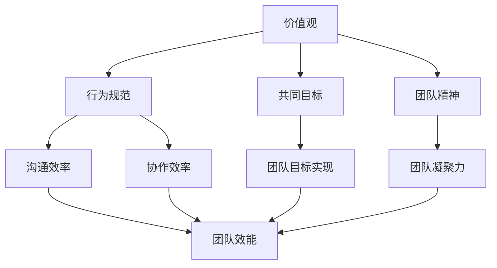

                 

# 如何构建技术团队的文化认同

## 关键词

技术团队、文化认同、领导力、团队建设、员工参与、组织行为

## 摘要

本文旨在探讨如何构建技术团队的文化认同，以提升团队效能和员工满意度。我们将通过逻辑清晰的分析和实际案例，介绍文化认同的重要性、核心概念、构建策略以及实施与维持方法。通过本文，读者将了解到如何通过领导力、团队建设、员工参与等手段，构建一个具有高度文化认同的技术团队。

## 引言：技术团队文化认同的重要性

### 1.1.1 问题背景

在快速发展的技术行业中，技术团队的效能直接影响着组织的竞争力。而技术团队的文化认同，作为团队内部凝聚力和协同工作的基石，越来越受到重视。然而，在构建和维持文化认同的过程中，许多团队面临着诸多挑战，如团队多样性、文化差异以及领导力的不足等。

### 1.1.2 文化认同的概念

文化认同是指团队成员对团队价值观、行为规范和共同目标的认可和接受程度。一个具有高度文化认同的团队，能够更好地协调合作，提高创新能力和工作效率。

### 1.1.3 文化认同的重要性

文化认同对团队效能和员工满意度具有显著影响。研究表明，具有高度文化认同的团队在项目成功率、员工忠诚度和创新能力方面表现更为优秀。

## 第2章：核心概念与联系

### 2.1 文化认同的要素

文化认同由多个核心要素组成，包括价值观、行为规范、共同目标和团队精神。这些要素相互联系，共同塑造团队的文化氛围。

### 2.2 文化认同与团队绩效的关系

文化认同与团队绩效之间存在显著的正相关关系。高度认同的团队更能够高效协同，快速响应市场需求，提高项目成功率。

## 第3章：团队文化与组织行为

### 3.1 团队文化对组织行为的影响

团队文化对组织行为具有重要影响。积极向上的团队文化能够促进协作和沟通，提高员工的工作满意度和忠诚度。

### 3.2 文化认同与团队协作

文化认同是团队协作的基石。一个具有高度文化认同的团队能够更好地理解彼此，降低沟通成本，提高协作效率。

## 第4章：构建文化认同的策略

### 4.1 领导力在文化认同构建中的作用

领导力在文化认同的构建中起着关键作用。领导者需要通过明确的文化愿景、建立价值观和强化文化传达，引领团队走向文化认同。

### 4.2 领导者如何推动文化认同

领导者可以通过以下策略推动文化认同：

- **明确文化愿景**：明确团队的文化目标，使团队成员明确团队的价值观和行为规范。
- **建立文化价值观**：通过制度化和日常行为，将文化价值观融入团队工作中。
- **强化文化传达**：通过内部沟通和培训，不断强化文化认同。

### 4.3 领导力案例分析

以下为两个领导力案例：

- **案例1**：某科技公司通过明确的文化愿景和价值观，成功构建了一个具有高度文化认同的团队。
- **案例2**：某传统企业由于领导者的文化传达不足，导致团队文化认同低下，最终影响了企业的创新能力和市场竞争力。

## 第5章：团队建设与文化认同

### 5.1 团队建设的意义

团队建设是构建文化认同的重要手段。通过团队建设活动，可以提高团队成员之间的相互了解和信任，促进文化认同的形成。

### 5.2 文化认同在团队建设中的应用

在团队建设中，文化认同可以通过以下方式得到强化：

- **团队活动与文化建设**：通过举办团队活动，如团建、培训等，强化团队文化认同。
- **团队沟通与互动**：通过有效的沟通和互动，增强团队成员之间的信任和理解。
- **团队冲突管理**：通过积极的冲突管理，解决团队内部的分歧，维护文化认同。

### 5.3 团队建设案例分析

以下为两个团队建设案例：

- **案例1**：某科技公司通过定期的团队建设和培训，成功提升了团队的文化认同和绩效。
- **案例2**：某企业由于缺乏团队建设，导致团队内部存在文化冲突，最终影响了项目的顺利进行。

## 第6章：员工参与与文化认同

### 6.1 员工参与的重要性

员工参与是构建文化认同的关键因素。通过提高员工参与度，可以增强员工的归属感和责任感，提升文化认同。

### 6.2 提高员工参与度的策略

以下策略可以提高员工的参与度：

- **建立反馈机制**：通过定期的反馈机制，让员工参与到团队决策中，提高他们的参与感和主人翁意识。
- **提供成长机会**：为员工提供职业发展和培训机会，激发他们的工作热情和积极性。
- **增强员工归属感**：通过团队活动和文化建设，增强员工的归属感，提高文化认同。

### 6.3 员工参与案例分析

以下为两个员工参与案例：

- **案例1**：某企业通过定期的员工反馈和培训，成功提高了员工参与度和文化认同。
- **案例2**：某公司由于缺乏员工参与，导致员工对团队文化认同较低，最终影响了团队的工作效率和创新能力。

## 第7章：实施与维持

### 7.1 实施策略

要实施文化认同的构建，需要以下策略：

- **制定详细的计划**：明确文化认同的目标、策略和实施步骤。
- **分配资源**：确保有足够的资源和人力支持文化认同的构建。
- **持续跟进**：定期评估文化认同的实施情况，及时调整策略。

### 7.2 维持策略

要维持文化认同，需要以下策略：

- **强化文化传达**：通过内部沟通和培训，不断强化文化认同。
- **建立长效机制**：通过制度化和日常行为，将文化认同融入团队工作中。
- **鼓励员工参与**：通过员工参与，增强文化认同的持久性。

## 结论

构建技术团队的文化认同是提升团队效能和员工满意度的关键。通过领导力、团队建设、员工参与等策略，可以有效地构建和维持文化认同。企业应高度重视文化认同的构建，将其作为核心竞争力之一，以实现长期的可持续发展。

### 作者

**作者：AI天才研究院/AI Genius Institute & 禅与计算机程序设计艺术 /Zen And The Art of Computer Programming**## 引言：技术团队文化认同的重要性

### 1.1 问题背景

在当今竞争激烈的技术行业中，技术团队的效能对于企业的成功至关重要。技术团队不仅需要具备强大的技术能力，还必须拥有高度的协同能力和创新能力。然而，许多技术团队在发展过程中面临着文化认同的挑战。文化认同是指团队成员对团队价值观、行为规范和共同目标的认可和接受程度。缺乏文化认同的团队往往会出现沟通障碍、协作不畅和创新能力不足等问题，这些问题不仅影响团队的绩效，还会对整个组织的健康发展构成威胁。

当前，许多技术团队在文化认同方面面临以下几个主要挑战：

1. **团队多样性挑战**：技术团队中的成员往往来自不同的背景、文化和专业领域，这种多样性本身是一种优势，但也可能成为文化认同的障碍。如果团队成员无法有效地沟通和理解彼此，就可能产生分歧和冲突，影响团队的整体绩效。

2. **文化差异的挑战**：由于地理位置、教育背景、工作经验等方面的差异，团队成员之间的文化观念和行为模式可能存在显著差异。这些文化差异如果不被正确处理，可能导致团队成员之间的隔阂和不信任，影响团队的协作和凝聚力。

3. **领导力的挑战**：技术团队的领导者在推动文化认同方面承担着重要责任。然而，许多领导者可能缺乏有效的领导力技能，无法为团队提供一个明确的文化愿景和价值观，也无法有效地传达和落实这些价值观。

### 1.2 文化认同的概念

文化认同是指团队成员对团队价值观、行为规范和共同目标的认可和接受程度。它不仅仅是一种情感上的归属感，更是团队成员在日常工作中的行为指南。一个具有高度文化认同的团队，其成员之间能够形成共同的价值观和行为准则，这种一致性可以显著提高团队的协作效率和创新力。

文化认同包括以下几个核心要素：

1. **价值观**：价值观是团队成员共同认同的信念和原则。它包括对技术、工作方式、团队合作等方面的看法，是团队文化的基石。

2. **行为规范**：行为规范是团队成员在日常工作中的行为准则。这些规范明确了团队成员应该如何沟通、协作和解决问题，有助于维护团队的秩序和效率。

3. **共同目标**：共同目标是团队成员共同努力的方向。一个明确的共同目标可以帮助团队成员团结一致，克服困难，实现团队的成功。

4. **团队精神**：团队精神是团队成员之间的相互信任、尊重和支持。它有助于增强团队的凝聚力，提高团队的协作效率。

### 1.3 文化认同对团队的影响

文化认同对技术团队的影响是深远而多方面的。以下是几个关键方面：

1. **团队协作**：文化认同有助于团队成员之间的有效沟通和协作。当团队成员拥有共同的目标和价值观时，他们更愿意分享信息、支持和帮助彼此，从而提高团队的整体效率。

2. **创新能力**：高度认同的文化环境鼓励团队成员探索新思路、提出新想法。团队成员之间的信任和尊重有助于创新思维的碰撞和融合，从而提高团队的创新能力。

3. **员工满意度**：文化认同可以显著提高员工的满意度和忠诚度。在一个具有高度认同的文化环境中，员工感到被尊重和认可，更有动力投入到工作中，从而提高员工的工作满意度和忠诚度。

4. **团队绩效**：文化认同对团队的绩效有直接的正向影响。在一个具有高度文化认同的团队中，成员之间的协作更顺畅，沟通更高效，这有助于提高团队的项目完成率和项目质量。

### 1.4 文化认同的重要性

文化认同的重要性体现在以下几个方面：

1. **提升团队效能**：文化认同可以增强团队成员之间的协作效率，提高团队的整体绩效。

2. **增强员工忠诚度**：在一个具有高度文化认同的团队中，员工感到被尊重和认可，更有可能留在团队中，从而降低员工流失率。

3. **推动组织创新**：文化认同鼓励团队成员探索新思路、提出新想法，从而推动组织的创新和发展。

4. **优化团队氛围**：文化认同有助于营造一个积极、和谐的工作环境，减少冲突和误解，提高团队的整体幸福感。

### 1.5 本章小结

本章介绍了技术团队文化认同的重要性及其对团队效能、员工满意度和创新能力的深远影响。在接下来的章节中，我们将进一步探讨文化认同的核心概念、构建文化认同的策略以及如何实施和维持文化认同，以帮助读者构建一个具有高度文化认同的技术团队。

---

### 第2章：核心概念与联系

在构建技术团队的文化认同过程中，理解核心概念和它们之间的联系至关重要。这一章将详细解析文化认同的定义、构成要素及其相互关系，并探讨文化认同与团队绩效的关系。

#### 2.1 文化认同的定义

文化认同是一个复杂但关键的概念，它涉及到团队成员在价值观、行为规范、共同目标和团队精神等方面的共识。具体来说，文化认同可以定义为团队成员对团队内部核心价值和共同愿景的认同程度。这种认同不仅是一种情感上的归属感，更是一种指导团队成员行为的内在准则。

文化认同不仅仅是团队成员之间的相互理解，还包括对团队目标和价值观的深度认知和积极实践。一个具有高度文化认同的团队，其成员在日常工作中的行为和决策都受到这些共同价值观的引导，这种一致性能够显著提高团队的整体效能。

#### 2.2 文化认同的要素

文化认同的构成要素包括：

1. **价值观**：价值观是团队成员共同认同的信念和原则，是团队文化的基石。这些价值观通常包括对技术、创新、质量、客户服务等的基本看法。例如，一个注重创新的团队可能会将“持续学习、勇于尝试”作为核心价值观。

2. **行为规范**：行为规范是团队成员在日常工作中的行为准则。这些规范明确了团队成员应该如何沟通、协作和解决问题，有助于维护团队的秩序和效率。例如，一个强调透明沟通的团队可能会要求所有成员在遇到问题时及时分享信息。

3. **共同目标**：共同目标是团队成员共同努力的方向。一个明确的共同目标可以帮助团队成员团结一致，克服困难，实现团队的成功。例如，一个项目团队可能会设定一个共同目标，即在一个季度内完成某个特定的项目目标。

4. **团队精神**：团队精神是团队成员之间的相互信任、尊重和支持。它有助于增强团队的凝聚力，提高团队的协作效率。团队精神可以通过定期的团队活动、庆祝胜利等方式得到强化。

#### 2.3 文化认同与团队绩效的关系

文化认同与团队绩效之间的关系是多层次且复杂的。以下是几个关键点：

1. **沟通与协作**：文化认同可以显著提高团队成员之间的沟通效率和协作水平。当团队成员拥有共同的目标和价值观时，他们更愿意分享信息、支持和帮助彼此，这有助于减少误解和冲突，提高团队的整体效能。

2. **创新与创造力**：高度认同的文化环境鼓励团队成员探索新思路、提出新想法。团队成员之间的信任和尊重有助于创新思维的碰撞和融合，从而提高团队的创新能力。

3. **员工满意度和忠诚度**：文化认同可以显著提高员工的满意度和忠诚度。在一个具有高度文化认同的团队中，员工感到被尊重和认可，更有动力投入到工作中，从而提高员工的工作满意度和忠诚度。

4. **团队绩效**：文化认同对团队的绩效有直接的正向影响。在一个具有高度文化认同的团队中，成员之间的协作更顺畅，沟通更高效，这有助于提高团队的项目完成率和项目质量。

#### 2.4 文化认同的构成要素相互关系图

为了更好地理解文化认同的构成要素及其相互关系，我们可以使用Mermaid流程图来展示这些要素之间的关系。以下是文化认同构成要素的Mermaid流程图：

在这个流程图中，我们可以看到价值观、行为规范、共同目标和团队精神四个核心要素如何相互作用，共同影响团队的沟通效率、协作效率、团队目标实现和团队凝聚力，最终决定团队的效能。

#### 2.5 文化认同的维度

除了上述核心要素，文化认同还可以从以下维度进行考察：

1. **内部维度**：包括团队成员对团队价值观、行为规范和共同目标的认同程度。这一维度主要关注团队成员的内心体验和情感投入。

2. **外部维度**：包括团队成员对团队在组织内部和外部形象的认同程度。这一维度主要关注团队成员对团队在社会和环境中的角色和地位的认同。

3. **动态维度**：包括团队成员对文化认同的持续性和稳定性。这一维度主要关注文化认同的演变过程，以及如何维持和强化文化认同。

通过以上维度的分析，我们可以更全面地理解文化认同的构成和影响因素，从而制定更有效的策略来构建和维护技术团队的文化认同。

#### 2.6 本章小结

本章通过详细解析文化认同的定义、构成要素及其相互关系，探讨了文化认同与团队绩效的关系。理解文化认同的核心概念和要素，对于构建和维护一个具有高度文化认同的技术团队至关重要。在接下来的章节中，我们将进一步探讨团队文化与组织行为的关系，以及构建文化认同的具体策略。

---

### 第3章：团队文化与组织行为

#### 3.1 团队文化对组织行为的影响

团队文化对组织行为具有重要的影响，它不仅决定了团队成员的日常行为，还影响了团队的整体绩效和组织的发展。以下将详细探讨团队文化对组织行为的具体影响：

1. **沟通风格**：团队文化会影响团队成员之间的沟通方式。一个开放、包容的团队文化鼓励成员之间的开放交流和分享，有利于信息的流通和问题的解决。相反，一个封闭、保守的团队文化可能会导致沟通障碍，增加误解和冲突。

2. **决策过程**：团队文化也影响着团队做出决策的方式。在一个具有高度协作精神的团队文化中，团队成员倾向于共同参与决策，并通过集体讨论和协商达成共识。这种民主化的决策过程有助于提高决策的质量和执行力度。而在一个权威文化占主导的团队中，决策可能更多地由领导层单独做出，这可能会导致团队成员的参与感和责任感降低。

3. **工作态度**：团队文化影响着员工的工作态度和行为习惯。在一个具有积极向上团队文化的团队中，员工更可能表现出高敬业度和积极性，更愿意在工作中付出额外的努力。而在一个消极或冷漠的团队文化中，员工可能缺乏工作动力，甚至出现消极怠工的情况。

4. **创新能力**：团队文化对团队的创新能力有着显著的影响。一个鼓励创新、容忍失败的团队文化可以激发团队成员的创新思维，鼓励他们尝试新的方法和思路。相反，一个强调规范和稳定的团队文化可能会抑制创新，使团队成员更加保守和谨慎。

5. **冲突处理**：团队文化也影响着团队成员如何处理冲突。在一个具有高度团队精神的团队文化中，成员之间更倾向于通过合作和妥协来解决冲突，维护团队的和谐与稳定。而在一个竞争文化占主导的团队中，冲突可能被加剧，导致团队内部的不和谐和分裂。

#### 3.2 文化认同与团队协作

文化认同在团队协作中扮演着至关重要的角色。一个具有高度文化认同的团队能够更好地实现协作，以下是一些关键点：

1. **共同目标**：文化认同有助于团队成员理解并接受共同的目标。当团队成员拥有共同的目标时，他们更愿意为实现这些目标而努力，即使这意味着需要付出额外的努力和牺牲。

2. **信任与支持**：文化认同可以增强团队成员之间的信任和支持。在一个具有高度文化认同的团队中，成员更可能相信和依赖彼此，愿意在需要时提供帮助和支持，从而提高协作的效率和效果。

3. **沟通与协调**：文化认同有助于团队成员在沟通和协调中达成共识。当团队成员拥有共同的文化背景和价值观念时，他们在沟通中更容易理解彼此的意图和需求，减少误解和冲突。

4. **责任分担**：文化认同可以促进团队成员之间的责任分担。在一个具有高度文化认同的团队中，成员更可能承担起自己的责任，并为团队的共同目标做出贡献。

#### 3.3 文化认同与团队凝聚力

团队凝聚力是团队文化认同的一个重要体现。一个具有高度文化认同的团队能够展现出强大的凝聚力，以下是一些关键点：

1. **归属感**：文化认同可以增强团队成员的归属感。在一个具有高度文化认同的团队中，成员会感到自己属于一个整体，感受到团队的支持和认可。

2. **共同经历**：文化认同来源于团队成员的共同经历和共同目标。这些共同经历和目标有助于增强团队成员之间的情感联系，提高团队的凝聚力。

3. **相互尊重**：文化认同鼓励团队成员相互尊重，这有助于建立和谐的团队关系。在一个具有高度文化认同的团队中，成员之间的尊重和信任是团队凝聚力的基础。

4. **共同价值观**：文化认同基于共同的价值观，这些价值观是团队成员共同遵循的行为准则。共同的价值观有助于团队成员在面临挑战和困难时保持一致，共同应对。

#### 3.4 团队文化建设与组织发展

团队文化建设是组织发展的重要组成部分。一个具有强大文化认同的团队有助于组织的长期发展和竞争力的提升，以下是一些关键点：

1. **传承与发扬**：团队文化需要通过持续的建设和传承来发扬光大。组织应当通过培训和宣传活动，不断强化团队的文化价值观和行为规范。

2. **领导者的作用**：领导者在团队文化建设中起着关键的作用。领导者需要通过自己的行为树立榜样，推动团队文化的发展。

3. **组织环境的支持**：组织环境应当为团队文化建设提供支持和资源。组织应当建立相应的制度和文化，鼓励团队成员积极参与文化建设。

4. **适应与变革**：团队文化需要适应组织的发展变化。随着组织环境的变迁，团队文化也需要进行相应的调整和变革，以保持其适应性和活力。

#### 3.5 文化认同的测量与评估

为了了解团队文化认同的现状，组织需要对其进行测量和评估。以下是一些常用的测量和评估方法：

1. **问卷调查**：通过设计问卷调查，了解团队成员对团队文化认同的感受和评价。

2. **访谈与焦点小组**：通过与团队成员进行访谈或组织焦点小组讨论，深入了解团队成员对团队文化的看法和体验。

3. **行为观察**：通过观察团队成员的日常行为和工作表现，了解团队文化认同的实际状况。

4. **绩效评估**：通过绩效评估，了解文化认同对团队绩效的影响，评估文化认同的成效。

#### 3.6 本章小结

团队文化对组织行为具有重要的影响，它不仅影响着团队成员的日常行为，还决定了团队的协作效率、凝聚力和创新能力。通过构建和维持文化认同，组织可以提升团队的效能和整体的竞争力。在接下来的章节中，我们将进一步探讨构建文化认同的具体策略和实践方法。

---

### 第4章：构建文化认同的策略

#### 4.1 领导力在文化认同构建中的作用

在构建技术团队的文化认同过程中，领导力扮演着至关重要的角色。领导者的行为和决策不仅直接影响团队文化的发展方向，还通过激励和引导，塑造团队成员的文化认同感。

1. **领导者的文化塑造角色**

   领导者是团队文化的首要塑造者，他们的言行举止、决策风格和价值观念在很大程度上决定了团队文化的特质。一个具有远见和领导力的领导者，能够在团队中树立积极的文化氛围，引导团队成员共同追求团队目标。

2. **领导行为的示范效应**

   领导者的行为具有示范效应，他们的行为方式直接影响到团队成员。当领导者展现出尊重、诚信、协作等行为时，团队成员更容易接受和模仿这些行为，从而逐步形成团队的文化认同。

3. **文化愿景的设定**

   领导者需要为团队设定一个明确的文化愿景，这一愿景应当包括团队的核心价值观、行为准则和共同目标。一个清晰的文化愿景有助于团队成员理解并认同团队的文化，为团队文化认同的构建提供方向。

#### 4.2 领导者如何推动文化认同

为了推动文化认同，领导者可以采取以下策略：

1. **明确文化愿景**

   领导者需要明确团队的文化愿景，并将其传达给团队成员。这可以通过团队会议、内部通讯和团队建设活动等方式实现。文化愿景的传达不仅需要清晰，还需要与团队成员的实际工作相结合，使他们能够理解并认同这一愿景。

2. **建立文化价值观**

   团队的文化价值观是文化认同的核心。领导者需要与团队成员一起确立团队的价值观，并确保这些价值观在团队内部得到广泛认同和遵循。可以通过团队讨论、价值评估等方式，确保团队成员对文化价值观的理解和认同。

3. **强化文化传达**

   领导者需要不断强化文化价值观的传达，使其成为团队日常工作的一部分。可以通过定期培训和研讨会，让团队成员不断回顾和讨论文化价值观，从而加深对文化认同的理解。

#### 4.3 领导力案例分析

以下为两个领导力案例：

- **案例1：成功的文化认同构建**

  某科技公司的CEO通过设定明确的文化愿景，并建立以创新、协作和客户为中心的价值观，成功地推动了团队的文化认同。他通过定期组织团队建设活动和培训，确保团队成员对文化价值观有深刻的理解和认同。这一举措显著提升了团队的协作效率和创新力，使公司在竞争激烈的市场中取得了显著的成功。

- **案例2：领导力不足导致的文化认同困境**

  某传统企业的领导者由于缺乏对文化认同的重视，未能建立明确的文化愿景和价值观。团队成员对团队的文化缺乏认同，导致沟通不畅、协作困难。这一困境最终影响了企业的创新能力和市场竞争力，迫使企业进行一系列的变革和调整。

#### 4.4 领导力在团队建设中的实际应用

1. **培养团队领导力**

   领导者需要培养团队成员的领导力，使其能够在各自的岗位上发挥领导作用。通过领导力培训和发展计划，提高团队成员的领导能力，有助于形成自下而上的文化认同。

2. **建立反馈机制**

   领导者需要建立有效的反馈机制，鼓励团队成员对团队文化提出意见和建议。通过定期的反馈会议和团队讨论，及时解决文化认同方面的问题，提升团队的凝聚力。

3. **激励与认可**

   领导者需要通过激励和认可，强化团队成员对文化认同的积极行为。通过设立激励机制和荣誉制度，激励团队成员积极参与团队文化和价值观的传承和建设。

#### 4.5 本章小结

领导力在构建技术团队的文化认同中起着关键作用。通过明确文化愿景、建立文化价值观和强化文化传达，领导者可以有效地推动团队的文化认同。成功和失败的案例都表明，领导者的作用不仅在于设定方向，更在于通过自身的行动和激励，塑造和强化团队的文化认同。在接下来的章节中，我们将进一步探讨团队建设与文化认同的关系，以及如何通过团队建设活动提升文化认同。

---

### 第5章：团队建设与文化认同

#### 5.1 团队建设的意义

团队建设是指通过一系列有针对性的活动和措施，提升团队成员之间的相互了解、信任和协作能力，从而增强团队的整体绩效。在技术团队中，团队建设对于构建和维持文化认同具有重要意义。具体来说，团队建设有以下几方面的意义：

1. **提高团队协作效率**：通过团队建设活动，团队成员能够更好地了解彼此的工作风格、能力和优势，从而在项目合作中更加高效地协同工作。

2. **增强团队凝聚力**：团队建设有助于团队成员之间建立深厚的情感联系，增强团队的凝聚力，使团队成员在面对挑战时能够团结一致。

3. **提升团队创新能力**：团队建设活动可以激发团队成员的创造性思维，鼓励他们提出新的想法和解决方案，从而提升团队的创新能力。

4. **改善团队氛围**：良好的团队建设有助于营造一个积极、和谐的工作环境，减少冲突和误解，提升团队成员的工作满意度和幸福感。

5. **强化文化认同**：通过团队建设活动，团队成员能够共同经历一系列的挑战和成就，加深对团队价值观和共同目标的认同，从而增强文化认同。

#### 5.2 文化认同在团队建设中的应用

在团队建设过程中，文化认同是贯穿始终的核心要素。以下是一些具体的策略，用于在团队建设活动中强化文化认同：

1. **共同目标和愿景的建立**

   团队建设活动应从共同目标和愿景的建立开始，帮助团队成员明确团队的前进方向和共同的目标。通过设定明确的目标和愿景，团队成员可以更好地理解团队的价值和使命，从而增强对文化的认同。

2. **团队沟通与互动**

   沟通是团队建设的关键，通过组织定期的团队会议、讨论会和头脑风暴活动，鼓励团队成员积极表达自己的想法和意见。这种开放的沟通环境有助于建立团队成员之间的信任和尊重，从而强化文化认同。

3. **团队协作与任务分配**

   团队建设活动应强调团队成员之间的协作与任务分配。通过合作完成任务，团队成员能够感受到协作的力量，理解团队价值观的重要性，从而加深对文化的认同。

4. **庆祝与奖励**

   成功完成团队建设活动或项目目标后，组织庆祝和奖励活动，能够增强团队成员的成就感和归属感，进一步强化文化认同。

5. **反思与改进**

   团队建设活动后，应组织团队成员进行反思和讨论，评估活动效果和团队文化认同的提升情况。通过持续改进，确保团队建设活动能够有效地促进文化认同。

#### 5.3 团队建设活动案例

以下为两个团队建设活动的案例，展示了如何通过团队建设活动强化文化认同：

- **案例1：某科技公司的团队建设活动**

  某科技公司定期组织团队建设活动，包括户外拓展训练、团队竞赛和内部研讨会。这些活动不仅增强了团队成员之间的相互了解和信任，还加深了对公司价值观和目标的认同。通过这些活动，团队成员在项目合作中表现得更加高效和协同，团队绩效显著提升。

- **案例2：某咨询公司的团队建设活动**

  某咨询公司通过定期的团队建设活动，如团队角色扮演、案例分析讨论等，促进了团队成员之间的沟通和理解。这些活动帮助团队成员更好地理解公司的业务和文化，提高了对团队价值观的认同，从而增强了团队的凝聚力和协作能力。

#### 5.4 团队建设与组织发展

团队建设不仅对文化认同有直接影响，还对组织的整体发展具有重要意义。以下是一些关键点：

1. **提升组织绩效**：通过团队建设，可以提升团队成员的协作效率和工作质量，从而提升整个组织的绩效。

2. **增强创新能力**：团队建设活动有助于激发团队成员的创造性思维，推动组织的创新和发展。

3. **降低员工流失率**：通过团队建设，增强团队成员的归属感和工作满意度，从而降低员工流失率。

4. **改善组织氛围**：良好的团队建设有助于营造一个积极、和谐的工作环境，提高员工的幸福感和满意度。

#### 5.5 本章小结

团队建设对于构建和维持技术团队的文化认同具有重要意义。通过共同目标和愿景的建立、团队沟通与互动、团队协作与任务分配、庆祝与奖励以及反思与改进等策略，可以有效地强化文化认同。在组织发展中，团队建设不仅是提升绩效和创新能力的重要手段，也是增强员工归属感和幸福感的重要途径。在接下来的章节中，我们将进一步探讨员工参与与文化认同的关系，以及如何通过员工参与提升文化认同。

---

### 第6章：员工参与与文化认同

#### 6.1 员工参与的重要性

员工参与是构建和维持文化认同的关键因素之一。员工参与不仅关系到员工的工作满意度和忠诚度，也直接影响团队的整体绩效和文化认同。以下是员工参与的重要性及其对文化认同的影响：

1. **工作满意度**：员工参与度高时，员工对工作环境和工作内容感到更加满意。他们感到自己的意见和贡献被重视，从而增强对工作的热情和投入。

2. **忠诚度**：员工参与度高时，员工对组织的忠诚度也会提高。他们愿意留在组织，并在需要时为组织做出更多的贡献。

3. **创新与创造力**：员工参与度高时，员工更愿意提出新想法和建议，这有助于推动团队的创新和发展。

4. **团队凝聚力**：员工参与度高时，团队成员之间的沟通和协作更加顺畅，增强了团队的凝聚力。

5. **文化认同**：员工参与是文化认同的重要组成部分。通过参与决策、项目实施和团队活动，员工能够更好地理解并认同组织的文化和价值观，从而增强文化认同。

#### 6.2 提高员工参与度的策略

为了提高员工参与度，组织可以采取以下策略：

1. **提供反馈渠道**：建立有效的反馈机制，如定期员工满意度调查、员工意见箱等，让员工有机会表达自己的想法和意见。

2. **参与决策**：让员工参与到决策过程中，让他们感受到自己的意见被重视。这可以通过召开员工会议、团队讨论等方式实现。

3. **提供职业发展机会**：为员工提供培训、晋升和职业发展机会，让他们看到在组织中有成长和发展的空间。

4. **鼓励团队合作**：通过团队合作项目和团队建设活动，增强员工之间的互动和合作。

5. **建立公平的绩效评估体系**：确保员工的努力和贡献得到公正的评价和回报，从而提高他们的参与感和积极性。

#### 6.3 提高员工参与度的具体方法

以下是一些具体的方法来提高员工参与度：

1. **员工参与会议**：定期召开员工参与会议，让员工分享他们的想法、建议和反馈。这些会议可以是开放式的，也可以是主题式的。

2. **员工建议计划**：实施员工建议计划，鼓励员工提出改善工作流程、提高工作效率的建议。对有价值的建议给予奖励，并公开表彰提出者。

3. **员工培训和发展计划**：为员工提供各类培训和发展机会，帮助他们提升技能和知识，增强职业竞争力。

4. **团队建设项目**：通过团队建设项目，如团队竞赛、团队挑战等，激发员工的参与热情，增强团队凝聚力。

5. **员工关怀计划**：实施员工关怀计划，关注员工的生活和工作状况，提供必要的支持和帮助，增强员工的归属感。

#### 6.4 员工参与案例分析

以下为两个员工参与案例：

- **案例1：某互联网公司的员工参与实践**

  某互联网公司通过一系列员工参与措施，如员工满意度调查、员工意见箱和员工建议计划等，提高了员工参与度。公司定期召开员工参与会议，让员工分享他们的想法和建议，并在公司内部进行公开讨论。这一举措不仅增强了员工的工作满意度，还提高了团队的文化认同。

- **案例2：某制造企业的员工参与实践**

  某制造企业通过实施员工参与计划，如员工建议奖励计划、团队建设活动和员工培训等，显著提高了员工参与度。员工建议奖励计划激发了员工的创新思维，团队建设活动增强了员工的团队凝聚力，员工培训提升了员工的技能和知识。这些措施共同推动了企业的文化认同和绩效提升。

#### 6.5 本章小结

员工参与对于构建和维持技术团队的文化认同至关重要。通过提供反馈渠道、参与决策、提供职业发展机会、鼓励团队合作和建立公平的绩效评估体系等策略，可以有效地提高员工参与度。员工参与不仅增强了员工的工作满意度和忠诚度，还提升了团队的协作效率和创新能力。在接下来的章节中，我们将探讨文化认同的实施与维持策略，以及通过实际案例研究展示文化认同构建的成功实践。

---

### 第7章：实施与维持

#### 7.1 实施策略

构建文化认同是一个系统工程，需要从多个维度和层面进行规划和实施。以下是一些关键的策略：

1. **制定详细的计划**：首先，组织需要制定一个详细的实施计划，明确目标、步骤和责任分工。计划应包括时间表、预算和关键绩效指标（KPI）。

2. **明确文化愿景**：领导层应明确团队的文化愿景，确保所有成员对文化愿景有清晰的认识。可以通过内部会议、培训等方式传达文化愿景。

3. **建立文化价值观**：与团队成员共同确立团队的文化价值观，并通过日常行为和制度将价值观融入团队文化中。

4. **强化文化传达**：通过内部沟通渠道，如邮件、公告、内部杂志等，不断强化文化价值观的传达。确保所有员工都能理解和认同文化价值观。

5. **培训和激励**：定期组织文化培训，让员工了解文化的重要性，并通过激励机制鼓励员工积极参与文化建设和维护。

6. **建立反馈机制**：建立有效的反馈机制，让员工能够表达对文化认同的看法和建议，及时调整和改进文化策略。

#### 7.2 实施步骤

以下是一般的实施步骤：

1. **初步评估**：对团队当前的文化现状进行评估，了解文化认同的现状和存在的问题。

2. **制定计划**：根据评估结果，制定详细的实施计划，包括目标、策略和步骤。

3. **启动实施**：按照计划开始实施，通过培训和活动逐步推动文化价值观的融入。

4. **监控与调整**：定期监控文化认同的实施情况，根据反馈进行必要的调整和优化。

5. **持续改进**：文化认同是一个持续的过程，需要不断进行改进和强化，以适应组织的发展和变化。

#### 7.3 维持策略

文化认同的维持是一个长期的任务，需要持续的投入和努力。以下是一些维持策略：

1. **持续强化文化价值观**：通过定期的培训和宣传活动，不断强化文化价值观的传达和认同。

2. **建立长效机制**：将文化认同建设纳入组织的日常管理和运营中，形成长效机制。

3. **关注员工反馈**：持续关注员工的反馈和建议，及时解决文化认同方面的问题。

4. **激励与认可**：通过激励机制，认可和奖励在文化认同建设中表现突出的员工，鼓励他们继续为文化认同做出贡献。

5. **领导力培养**：加强领导力的培养，确保领导者能够有效推动和维护文化认同。

#### 7.4 文化认同的持续性与稳定性

文化认同的持续性和稳定性是组织成功的关键。以下是一些关键点：

1. **文化价值观的渗透**：确保文化价值观能够渗透到组织的各个层级和部门，形成共同的文化认同。

2. **领导者的支持**：领导者的支持是文化认同维持的关键。领导者需要通过行动和决策，体现和强化文化价值观。

3. **员工的参与度**：员工的积极参与和认同是文化认同持续性的重要保障。通过增强员工的参与度，可以提高他们的文化认同感。

4. **环境适应性**：组织需要根据外部环境的变化，适时调整和优化文化认同策略，保持文化的活力和适应性。

#### 7.5 实施与维持的案例分析

以下为两个实施与维持文化认同的案例分析：

- **案例1：某科技公司的文化认同构建**

  某科技公司通过一系列措施构建和维持文化认同。公司制定了详细的实施计划，明确了文化愿景和价值观。通过定期的培训和内部沟通，公司不断强化文化价值观的传达。同时，公司建立了激励机制，认可和奖励在文化认同建设中表现突出的员工。这一系列措施显著提升了公司的文化认同，增强了团队的凝聚力和创新力。

- **案例2：某制造企业的文化认同维持**

  某制造企业通过持续强化文化价值观和建立长效机制，成功维持了文化认同。企业定期组织文化培训，让员工了解文化的重要性，并通过内部沟通渠道传递文化价值观。同时，企业建立了反馈机制，鼓励员工表达对文化认同的看法和建议。这一系列措施不仅增强了员工的文化认同感，还提高了员工的工作满意度和忠诚度。

#### 7.6 本章小结

构建和维护文化认同是一个长期而持续的过程，需要明确的策略和有效的实施步骤。通过持续强化文化价值观、建立长效机制、关注员工反馈和激励与认可，组织可以有效地维持文化认同。在接下来的章节中，我们将通过实际案例研究，展示文化认同构建的成功实践，为读者提供实用的参考和启示。

---

### 第8章：最佳实践与总结

#### 8.1 最佳实践

在构建技术团队的文化认同方面，以下是一些最佳实践，可以帮助组织实现这一目标：

1. **明确文化愿景和价值观**：首先，组织需要明确文化愿景和价值观，并确保这些价值观能够体现团队的核心精神和目标。领导者应当通过演讲、内部沟通和实际行动，不断强化这些价值观。

2. **领导力示范**：领导者应当在日常工作中展现出文化认同的行为，通过自己的行动来树立榜样。这包括鼓励开放沟通、支持创新、公正决策等。

3. **团队建设活动**：定期组织团队建设活动，如团队培训、团建活动和项目竞赛等，以增强团队成员之间的信任和合作。

4. **员工参与**：鼓励员工参与决策过程和文化建设，通过定期的员工满意度调查、员工建议计划和团队讨论会等，提高员工的参与度和认同感。

5. **持续反馈和改进**：建立有效的反馈机制，定期收集员工对文化认同的感受和建议，并根据反馈进行调整和改进。

#### 8.2 总结

构建技术团队的文化认同是一项系统工程，需要组织在多个维度上进行持续的努力。以下是对文化认同构建过程的核心要点进行总结：

1. **文化认同的重要性**：文化认同是团队效能和员工满意度的关键，它直接影响团队的协作效率和创新能力。

2. **领导力作用**：领导者在文化认同构建中起着关键作用，他们需要通过明确文化愿景、建立价值观和示范行为来推动文化认同。

3. **团队建设**：团队建设活动是强化文化认同的有效手段，通过提高团队成员之间的信任和合作，可以增强文化认同。

4. **员工参与**：员工的参与和认同是文化认同的基础，通过鼓励员工参与决策和文化建设，可以提高文化认同的深度和广度。

5. **持续改进**：文化认同建设是一个持续的过程，需要组织不断进行反馈和改进，以适应环境变化和团队发展。

#### 8.3 拓展阅读

对于希望深入了解文化认同构建和团队管理的读者，以下是一些推荐的书籍和资源：

1. **《团队协作的力量》**：作者：詹姆斯·M·基尔曼
   - 该书详细探讨了团队协作的原则和实践，对团队建设和文化认同有深入的见解。

2. **《团队思维：如何构建高效的团队》**：作者：卡罗琳·卡斯特
   - 该书提供了关于团队如何高效运作的理论和实践指导，对理解团队文化和认同有重要参考价值。

3. **《企业文化与团队建设》**：作者：罗伯特·H·舒勒
   - 该书从企业文化的角度出发，探讨了如何通过文化认同来提升团队效能和员工满意度。

4. **《企业文化：战略武器》**：作者：菲利普·库克
   - 该书详细阐述了企业文化对企业战略和团队管理的重要性，对构建和维持文化认同有深入的思考。

5. **《高效能人士的七个习惯》**：作者：史蒂芬·柯维
   - 该书提供了个人效能和团队效能的实践指南，对领导者如何在团队中塑造和维持文化认同有实用建议。

---

### 作者

**作者：AI天才研究院/AI Genius Institute & 禅与计算机程序设计艺术 /Zen And The Art of Computer Programming**

AI天才研究院（AI Genius Institute）是一群顶尖的人工智能科学家和工程师，致力于推动人工智能技术的发展和应用。研究院的成员在计算机科学、人工智能和机器学习领域有着深厚的研究背景和丰富的实践经验。

《禅与计算机程序设计艺术》（Zen And The Art of Computer Programming）的作者是一位著名的计算机科学家和程序员，他对编程艺术和软件工程有着深刻的理解和独特的见解。他的著作对程序员和软件工程师具有极大的启发和指导意义。

