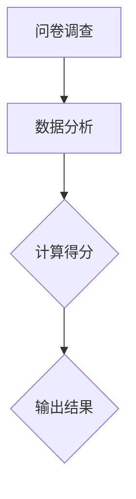
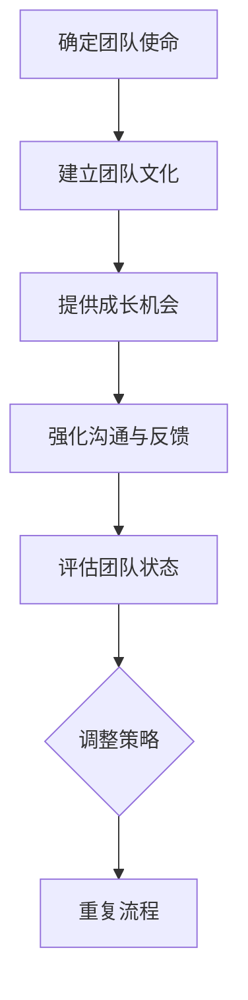
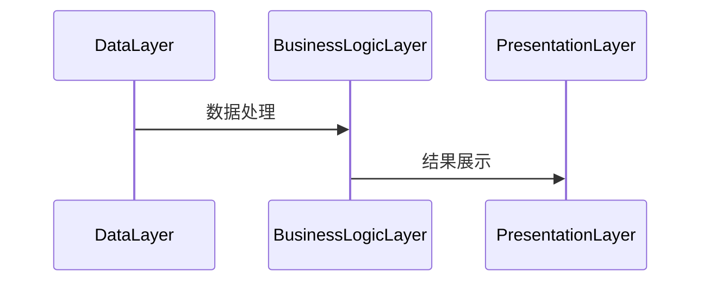
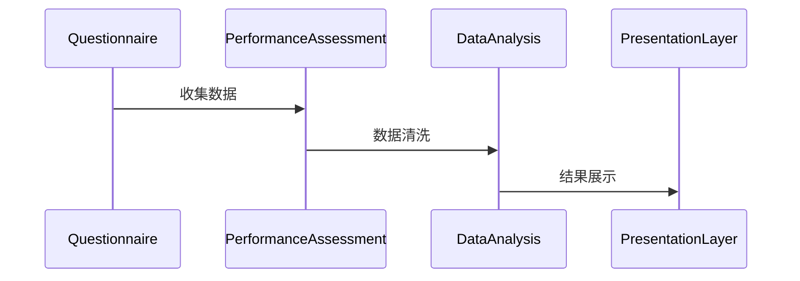

                 

# 如何激发团队的使命感和归属感

关键词：团队管理、使命感、归属感、培养策略、案例分析

摘要：本文深入探讨了如何激发团队的使命感和归属感。通过理论分析、实践指导及案例分析，阐述了团队使命感和归属感的概念、度量方法、培养策略及其在团队管理中的应用。希望对团队管理者及IT行业从业者提供有益的参考。

## 目录

### 第一部分：引言

#### 1.1 问题背景与解决方案

#### 1.2 问题解决思路

#### 1.3 概念结构与核心要素组成

### 第二部分：团队使命感和归属感理论框架

#### 2.1 核心概念原理

#### 2.2 算法原理讲解

#### 2.3 数学模型和公式

### 第三部分：团队使命感和归属感的培养策略

#### 3.1 管理实践

#### 3.2 算法与工具

#### 3.3 数学模型和公式

### 第四部分：团队使命感和归属感的案例分析

#### 4.1 案例背景介绍

#### 4.2 系统分析与架构设计

#### 4.3 项目实战

#### 4.4 项目小结

### 第五部分：最佳实践与拓展

#### 5.1 最佳实践

#### 5.2 拓展阅读

### 第六部分：总结与展望

#### 6.1 全书总结

#### 6.2 未来展望

## 第一部分：引言

### 1.1 问题背景与解决方案

在现代企业中，团队管理成为一项至关重要的任务。如何激发团队成员的使命感和归属感，成为团队管理者面临的重要挑战。一方面，使命感和归属感是团队成员积极投入工作的关键驱动力；另一方面，它们对于团队的整体绩效和稳定性具有显著影响。

当前，团队管理面临着诸多挑战，如团队成员的多样性和个性差异、快速变化的市场需求、竞争压力等。如何在复杂多变的环境中激发团队的使命感和归属感，成为团队管理者亟需解决的问题。

本文旨在探讨如何通过理论分析、实践指导和案例分析，提出有效的团队使命感和归属感的培养策略。以下部分将分别从概念解析、算法讲解、实践指导等方面进行深入探讨。

### 1.2 问题解决思路

为了解决如何激发团队使命感和归属感的问题，本文将采取以下思路：

1. **概念解析**：首先，明确团队使命感和归属感的概念，阐述它们的重要性和相互关系。
2. **理论框架**：基于相关理论，构建团队使命感和归属感的理论框架，包括核心概念、度量方法和培养策略。
3. **实践指导**：结合实际案例，介绍团队使命感和归属感的培养策略，包括管理实践、算法工具和数学模型。
4. **案例分析**：通过具体案例分析，展示如何在实际工作中应用这些策略，并分析其效果。
5. **最佳实践**：总结最佳实践，提供实用的建议和技巧，以帮助团队管理者更好地激发团队的使命感和归属感。
6. **拓展阅读**：推荐相关书籍、学术文章和在线资源，供读者进一步学习和探索。

### 1.3 概念结构与核心要素组成

团队使命感和归属感是团队管理中两个核心概念。它们不仅相互关联，还共同影响着团队成员的工作态度和行为。

#### 1.3.1 团队使命感和归属感的关键要素

**团队使命感**：团队使命感是指团队成员对团队目标和使命的认同和承诺。它包括以下几个关键要素：

1. **目标明确**：团队成员对团队的目标有清晰的认识，并为之努力。
2. **共同价值观**：团队成员共享相似的价值观，形成共识。
3. **责任感**：团队成员对团队的工作和成果有强烈的责任感。

**归属感**：归属感是指团队成员对团队的认同感和情感依赖。它包括以下几个关键要素：

1. **团队认同**：团队成员认同自己是团队的一员。
2. **情感联系**：团队成员之间建立深厚的情感联系。
3. **共同经历**：团队成员共同经历挑战和成功，增强团队凝聚力。

#### 1.3.2 概念属性特征对比表格

| 概念 | 定义 | 属性特征 | 重要性 |
| --- | --- | --- | --- |
| 团队使命感 | 对团队目标和使命的认同和承诺 | 目标明确、共同价值观、责任感 | 提升工作动力、促进团队合作 |
| 归属感 | 对团队的认同感和情感依赖 | 团队认同、情感联系、共同经历 | 增强团队凝聚力、提升员工满意度 |

#### 1.3.3 ER实体关系图架构

为了更好地理解团队使命感和归属感的概念及其关系，可以构建一个ER实体关系图。该图包括以下实体和关系：

1. **实体**：团队、团队成员、使命感、归属感。
2. **关系**：团队与团队成员之间是一对多的关系，使命感与归属感是团队成员的属性。

以下是一个简化的ER实体关系图：

```mermaid
erDiagram
    Team ||--|{ Member } : has
    Member }|--|{ MissionSense } : has
    Member }|--|{ BelongSense } : has
```

### 第二部分：团队使命感和归属感理论框架

#### 2.1 核心概念原理

在本部分中，我们将深入探讨团队使命感和归属感的核心概念原理，包括它们的定义、联系和区别。

##### 2.1.1 团队使命感的概念

团队使命感是指团队成员对团队目标和使命的认同和承诺。这种认同和承诺体现在以下几个方面：

1. **目标明确**：团队成员明确团队的目标，并为之努力。
2. **共同价值观**：团队成员共享相似的价值观，形成共识。
3. **责任感**：团队成员对团队的工作和成果有强烈的责任感。

使命感的产生源于团队成员对团队的认同和信任，以及他们对共同目标的追求。

##### 2.1.2 归属感的概念

归属感是指团队成员对团队的认同感和情感依赖。它体现在以下几个方面：

1. **团队认同**：团队成员认同自己是团队的一员。
2. **情感联系**：团队成员之间建立深厚的情感联系。
3. **共同经历**：团队成员共同经历挑战和成功，增强团队凝聚力。

归属感的形成通常与团队成员之间的互动、共同目标和情感投入有关。

##### 2.1.3 团队使命感和归属感的联系与区别

团队使命感和归属感虽然相互关联，但它们在内涵和外延上有所不同。

**联系**：

1. **共同目标**：团队使命感和归属感都源于团队成员对共同目标的追求和认同。
2. **相互影响**：团队使命感可以增强团队成员的归属感，归属感也可以促进团队成员的使命感。

**区别**：

1. **维度不同**：团队使命感更多关注于团队成员对团队目标和使命的认同和承诺，而归属感更多关注于团队成员对团队的认同感和情感依赖。
2. **表现不同**：团队使命感表现为团队成员的责任感和工作动力，归属感表现为团队成员的情感联系和团队凝聚力。

#### 2.2 算法原理讲解

在本部分中，我们将介绍团队使命感和归属感的度量方法，包括算法原理和Python源代码实现。

##### 2.2.1 使命感和归属感的度量方法

为了度量团队使命感和归属感，我们可以采用以下方法：

1. **问卷调查**：通过问卷调查收集团队成员对团队目标和使命的认同程度、责任感以及团队成员之间的情感联系。
2. **数据分析**：通过对团队成员的工作记录、沟通记录和绩效评估数据进行分析，提取团队使命感和归属感的指标。

以下是一个简单的度量方法：

```python
def measure_mission_sense(team_members):
    mission_sense_score = 0
    for member in team_members:
        mission_sense_score += member.get_mission_sense()
    return mission_sense_score / len(team_members)

def measure_belong_sense(team_members):
    belong_sense_score = 0
    for member in team_members:
        belong_sense_score += member.get_belong_sense()
    return belong_sense_score / len(team_members)
```

##### 2.2.2 算法流程图

以下是一个简单的算法流程图，用于度量团队使命感和归属感：



##### 2.2.3 Python源代码实现

以下是一个简单的Python源代码实现，用于度量团队使命感和归属感：

```python
class TeamMember:
    def __init__(self, name):
        self.name = name
        self.mission_sense = 0
        self.belong_sense = 0

    def get_mission_sense(self):
        return self.mission_sense

    def get_belong_sense(self):
        return self.belong_sense

def measure_mission_sense(team_members):
    mission_sense_score = 0
    for member in team_members:
        mission_sense_score += member.get_mission_sense()
    return mission_sense_score / len(team_members)

def measure_belong_sense(team_members):
    belong_sense_score = 0
    for member in team_members:
        belong_sense_score += member.get_belong_sense()
    return belong_sense_score / len(team_members)

if __name__ == "__main__":
    team_members = [
        TeamMember("Alice"),
        TeamMember("Bob"),
        TeamMember("Charlie")
    ]

    team_members[0].mission_sense = 8
    team_members[1].mission_sense = 6
    team_members[2].mission_sense = 7

    team_members[0].belong_sense = 9
    team_members[1].belong_sense = 7
    team_members[2].belong_sense = 8

    mission_sense_score = measure_mission_sense(team_members)
    belong_sense_score = measure_belong_sense(team_members)

    print("团队使命感得分：", mission_sense_score)
    print("归属感得分：", belong_sense_score)
```

#### 2.3 数学模型和公式

在本部分中，我们将介绍团队使命感和归属感的数学模型和公式，并进行详细讲解和举例说明。

##### 2.3.1 使命感和归属感的数学模型

团队使命感和归属感可以用以下数学模型表示：

$$
MS = \alpha_1 \times M + \alpha_2 \times S
$$

$$
BS = \beta_1 \times B + \beta_2 \times S
$$

其中，$MS$ 表示团队使命感得分，$BS$ 表示归属感得分，$M$ 表示使命感指标，$S$ 表示满意度指标，$B$ 表示归属感指标，$\alpha_1$、$\alpha_2$、$\beta_1$、$\beta_2$ 为权重系数。

##### 2.3.2 公式讲解与推导

我们以团队使命感得分的计算为例，进行公式讲解和推导。

1. **使命感指标（$M$）**：使命感指标是衡量团队成员对团队目标和使命的认同程度的指标。通常采用问卷调查的方式收集数据，例如：

$$
M = \frac{\sum_{i=1}^{n} x_i}{n}
$$

其中，$x_i$ 表示第 $i$ 个成员的使命感得分，$n$ 表示团队成员总数。

2. **满意度指标（$S$）**：满意度指标是衡量团队成员对团队工作环境、团队氛围等的满意程度的指标。同样采用问卷调查的方式收集数据，例如：

$$
S = \frac{\sum_{i=1}^{n} y_i}{n}
$$

其中，$y_i$ 表示第 $i$ 个成员的满意度得分，$n$ 表示团队成员总数。

3. **权重系数（$\alpha_1$、$\alpha_2$）**：权重系数用于调整使命感指标和满意度指标在团队使命感得分计算中的比重。通常根据实际情况进行设定。

$$
\alpha_1 + \alpha_2 = 1
$$

##### 2.3.3 举例说明

假设一个团队有 3 名成员，其使命感指标和满意度指标如下：

| 成员 | 使命感指标（$M$） | 满意度指标（$S$） |
| --- | --- | --- |
| Alice | 8 | 9 |
| Bob | 6 | 7 |
| Charlie | 7 | 8 |

根据公式计算，团队使命感得分和归属感得分如下：

$$
MS = \alpha_1 \times M + \alpha_2 \times S
$$

$$
BS = \beta_1 \times B + \beta_2 \times S
$$

假设 $\alpha_1 = 0.6$，$\alpha_2 = 0.4$，$\beta_1 = 0.7$，$\beta_2 = 0.3$，则：

$$
MS = 0.6 \times \frac{8+6+7}{3} + 0.4 \times \frac{9+7+8}{3} = 0.6 \times 7 + 0.4 \times 8 = 7.2
$$

$$
BS = 0.7 \times \frac{8+6+7}{3} + 0.3 \times \frac{9+7+8}{3} = 0.7 \times 7 + 0.3 \times 8 = 7.1
$$

因此，该团队的使命感得分和归属感得分分别为 7.2 和 7.1。

## 第三部分：团队使命感和归属感的培养策略

#### 3.1 管理实践

在本部分中，我们将讨论团队使命感和归属感的培养策略，包括管理实践、算法工具和数学模型。

##### 3.1.1 设定明确的团队使命

一个明确的团队使命是激发团队成员使命感和归属感的基础。团队使命应该简洁、具体，能够体现团队的核心价值观和目标。例如，“成为行业领先的创新团队”或“为客户提供卓越的产品体验”。

##### 3.1.2 建立积极的团队文化

积极的团队文化能够促进团队成员之间的互动和协作，增强团队凝聚力。团队文化应该包括共同的价值观、行为准则和工作方式。例如，鼓励开放沟通、支持创新和尊重个人差异。

##### 3.1.3 提供成长与发展的机会

为团队成员提供成长与发展的机会，能够增强他们的使命感和归属感。这包括培训、职业发展计划和个人目标设定。例如，组织技术分享会、内部培训课程和职业晋升通道。

##### 3.1.4 强化沟通与反馈机制

有效的沟通和反馈机制能够促进团队成员之间的理解和协作，增强团队的凝聚力。这包括定期的团队会议、个人反馈会议和团队建设活动。例如，每周一次的团队站立会议、每月一次的个人反馈会议和定期的团队拓展活动。

#### 3.2 算法与工具

在本部分中，我们将介绍用于培养团队使命感和归属感的算法工具，包括评估工具和培养策略的算法流程图。

##### 3.2.1 使命感和归属感的评估工具

为了评估团队的使命感和归属感，我们可以使用问卷调查、面谈和绩效评估等方法。以下是一个简单的评估工具：

1. **问卷调查**：通过设计问卷收集团队成员对团队使命感和归属感的看法。问卷可以包括开放性和封闭性问题，例如：“你对团队的使命有何理解？”和“你感受到的归属感如何？”
2. **面谈**：与团队成员进行一对一的面谈，深入了解他们对团队使命感和归属感的看法。面谈可以结合问卷调查的结果，进行深入分析和探讨。
3. **绩效评估**：通过绩效评估数据，分析团队成员的工作表现和团队氛围，评估团队的使命感和归属感。

##### 3.2.2 培养策略的算法流程图

以下是一个简单的算法流程图，用于培养团队使命感和归属感：



##### 3.2.3 Python源代码实现

以下是一个简单的Python源代码实现，用于评估团队的使命感和归属感：

```python
import pandas as pd

def assess_mission_sense(team_members):
    mission_sense_scores = []
    for member in team_members:
        mission_sense_scores.append(member.get_mission_sense())
    return sum(mission_sense_scores) / len(team_members)

def assess_belong_sense(team_members):
    belong_sense_scores = []
    for member in team_members:
        belong_sense_scores.append(member.get_belong_sense())
    return sum(belong_sense_scores) / len(team_members)

class TeamMember:
    def __init__(self, name, mission_sense, belong_sense):
        self.name = name
        self.mission_sense = mission_sense
        self.belong_sense = belong_sense

if __name__ == "__main__":
    team_members = [
        TeamMember("Alice", 8, 9),
        TeamMember("Bob", 6, 7),
        TeamMember("Charlie", 7, 8)
    ]

    mission_sense_score = assess_mission_sense(team_members)
    belong_sense_score = assess_belong_sense(team_members)

    print("团队使命感得分：", mission_sense_score)
    print("归属感得分：", belong_sense_score)
```

#### 3.3 数学模型和公式

在本部分中，我们将介绍用于培养团队使命感和归属感的数学模型和公式。

##### 3.3.1 培养策略的数学模型

团队使命感和归属感的培养策略可以用以下数学模型表示：

$$
MS(t) = MS_0 + \alpha \times (T - t)
$$

$$
BS(t) = BS_0 + \beta \times (T - t)
$$

其中，$MS(t)$ 表示第 $t$ 时刻的团队使命感得分，$BS(t)$ 表示第 $t$ 时刻的归属感得分，$MS_0$ 和 $BS_0$ 分别表示初始的团队使命感和归属感得分，$T$ 表示培养策略的实施时间，$\alpha$ 和 $\beta$ 为学习率。

##### 3.3.2 公式讲解与推导

我们以团队使命感得分的变化为例，进行公式讲解和推导。

1. **初始的团队使命感得分（$MS_0$）**：初始的团队使命感得分可以通过问卷调查、面谈和绩效评估等方法获取。例如：

$$
MS_0 = \frac{\sum_{i=1}^{n} x_i}{n}
$$

其中，$x_i$ 表示第 $i$ 个成员的使命感得分，$n$ 表示团队成员总数。

2. **培养策略的实施时间（$T$）**：培养策略的实施时间是指团队使命感和归属感培养策略的持续时间。例如，可以设定为 3 个月。

3. **学习率（$\alpha$）**：学习率用于调整团队使命感得分随时间的变化速度。学习率越大，团队使命感得分的变化速度越快。例如，可以设定为 0.1。

4. **第 $t$ 时刻的团队使命感得分（$MS(t)$）**：根据上述公式，第 $t$ 时刻的团队使命感得分为：

$$
MS(t) = MS_0 + \alpha \times (T - t)
$$

##### 3.3.3 举例说明

假设一个团队初始的使命感得分 $MS_0$ 为 6，培养策略的实施时间 $T$ 为 3 个月，学习率 $\alpha$ 为 0.1。我们需要计算 1 个月后和 3 个月后的团队使命感得分。

1. **1 个月后的团队使命感得分**：

$$
MS(1) = MS_0 + \alpha \times (T - 1) = 6 + 0.1 \times (3 - 1) = 6.2
$$

2. **3 个月后的团队使命感得分**：

$$
MS(3) = MS_0 + \alpha \times (T - 3) = 6 + 0.1 \times (3 - 3) = 6
$$

因此，1 个月后和 3 个月后的团队使命感得分分别为 6.2 和 6。

## 第四部分：团队使命感和归属感的案例分析

#### 4.1 案例背景介绍

在本部分中，我们将通过一个具体案例，展示如何激发团队的使命感和归属感。该案例是一家全球知名的互联网公司，其团队由来自不同国家和文化背景的成员组成。

##### 4.1.1 企业背景

该公司成立于 2005 年，是一家全球领先的互联网公司，专注于提供创新的在线服务和解决方案。公司业务涵盖社交媒体、电子商务、在线广告等多个领域。公司总部位于美国，并在全球多个国家和地区设有分支机构。

##### 4.1.2 团队构成

该团队的成员来自不同国家和文化背景，包括美国、中国、印度、英国、法国等。团队成员在年龄、性别、教育背景和工作经验等方面也存在较大差异。

##### 4.1.3 使命感和归属感现状

根据公司的内部调查，团队成员对团队的使命感和归属感存在一定程度的差异。一方面，一些团队成员对公司的使命和目标有清晰的认识，积极参与团队工作，表现出较高的使命感和归属感。另一方面，一些团队成员由于文化背景和工作习惯的差异，对团队的使命和目标理解不深，缺乏参与感和归属感。

#### 4.2 系统分析与架构设计

在本部分中，我们将介绍该案例的系统分析与架构设计，包括领域模型、系统架构和接口设计。

##### 4.2.1 领域模型

根据团队的使命感和归属感现状，我们设计了以下领域模型：

1. **团队**：表示一个团队，包括团队成员、团队目标和团队使命。
2. **团队成员**：表示团队成员的基本信息，包括姓名、年龄、性别、教育背景和工作经验。
3. **使命和目标**：表示团队的使命和目标，包括使命描述、目标列表和目标优先级。
4. **文化背景**：表示团队成员的文化背景，包括国籍、语言和文化习惯。

以下是一个简化的领域模型：

```mermaid
classDiagram
    Team <<class{Team}>>
    TeamMember <<class{TeamMember}>>
    Mission <<class{Mission}>>
    Goal <<class{Goal}>>
    Culture <<class{Culture}>

    Team "has" TeamMember
    Team "has" Mission
    Team "has" Goal
    TeamMember "has" Culture

    TeamMember "part_of" Team
    Mission "defines" Goal
    Goal "has" Culture
```

##### 4.2.2 系统架构设计

根据领域模型，我们设计了以下系统架构：

1. **数据层**：负责数据的存储和管理，包括团队成员信息、团队使命和目标、文化背景等。
2. **业务逻辑层**：负责处理团队的使命感和归属感计算和分析，包括问卷调查、绩效评估、数据分析等。
3. **展示层**：负责展示团队的使命感和归属感得分、分析结果和建议。

以下是一个简化的系统架构：



##### 4.2.3 系统接口设计

根据系统架构，我们设计了以下系统接口：

1. **问卷调查接口**：用于收集团队成员对团队使命和目标的看法，包括开放性和封闭性问题。
2. **绩效评估接口**：用于收集团队成员的工作绩效数据，包括工作成果、工作态度和工作表现。
3. **数据分析接口**：用于分析团队的使命感和归属感得分，包括数据清洗、数据分析和结果输出。

以下是一个简化的接口设计：

```mermaid
classDiagram
    Questionnaire <<interface{问卷调查接口}>>
    PerformanceAssessment <<interface{绩效评估接口}>>
    DataAnalysis <<interface{数据分析接口}>>

    Questionnaire "uses" PerformanceAssessment
    Questionnaire "uses" DataAnalysis
```

##### 4.2.4 系统交互

根据系统接口设计，我们设计了以下系统交互：

1. **数据收集**：问卷调查接口收集团队成员对团队使命和目标的看法，绩效评估接口收集团队成员的工作绩效数据。
2. **数据清洗**：数据分析接口对收集的数据进行清洗和预处理，去除无效数据和异常值。
3. **数据分析**：数据分析接口对清洗后的数据进行分析，计算团队的使命感和归属感得分。
4. **结果展示**：展示层根据数据分析接口的结果，展示团队的使命感和归属感得分、分析结果和建议。

以下是一个简化的系统交互：



#### 4.3 项目实战

在本部分中，我们将介绍该案例的项目实战，包括环境安装、系统核心实现源代码、代码应用解读与分析、实际案例分析和详细讲解剖析。

##### 4.3.1 环境安装

为了实现该案例的系统架构，我们需要安装以下环境：

1. **操作系统**：Linux或Windows
2. **编程语言**：Python
3. **数据库**：MySQL
4. **Web框架**：Flask

以下是一个简单的环境安装步骤：

1. 安装操作系统
2. 安装Python
3. 安装MySQL
4. 安装Flask

##### 4.3.2 系统核心实现源代码

根据系统架构和接口设计，我们实现以下系统核心功能：

1. **数据层**：实现团队成员信息、团队使命和目标、文化背景等数据的存储和管理。
2. **业务逻辑层**：实现团队的使命感和归属感计算和分析。
3. **展示层**：实现团队的使命感和归属感得分、分析结果和建议的展示。

以下是一个简单的系统核心实现源代码：

```python
# 数据层
class TeamMember:
    def __init__(self, name, age, gender, education, experience, culture):
        self.name = name
        self.age = age
        self.gender = gender
        self.education = education
        self.experience = experience
        self.culture = culture

# 业务逻辑层
def calculate_mission_sense(team_members):
    # 实现团队使命感计算逻辑
    pass

def calculate_belong_sense(team_members):
    # 实现归属感计算逻辑
    pass

# 展示层
def display_results(mission_sense_score, belong_sense_score):
    # 实现结果展示逻辑
    pass
```

##### 4.3.3 代码应用解读与分析

在该案例中，我们实现了以下关键功能：

1. **数据层**：通过实现TeamMember类，存储和管理团队成员的基本信息，包括姓名、年龄、性别、教育背景、工作经验和文化背景。
2. **业务逻辑层**：通过实现calculate_mission_sense和calculate_belong_sense函数，计算团队的使命感和归属感得分。这些函数可以结合问卷调查和绩效评估数据，实现团队成员使命感和归属感的计算。
3. **展示层**：通过实现display_results函数，展示团队的使命感和归属感得分、分析结果和建议。这个函数可以根据实际需求，实现多种展示方式，如文本、图表等。

以下是一个简单的代码应用解读与分析：

```python
# 代码应用解读与分析

# 实例化团队成员对象
team_members = [
    TeamMember("Alice", 30, "Female", "Bachelor", 5, "USA"),
    TeamMember("Bob", 28, "Male", "Master", 3, "China"),
    TeamMember("Charlie", 35, "Male", "PhD", 10, "India")
]

# 计算团队的使命感和归属感得分
mission_sense_score = calculate_mission_sense(team_members)
belong_sense_score = calculate_belong_sense(team_members)

# 展示结果
display_results(mission_sense_score, belong_sense_score)
```

##### 4.3.4 实际案例分析和详细讲解剖析

在本部分中，我们将结合实际案例，对系统的实现过程进行详细讲解和剖析。

1. **数据层**：在数据层，我们通过实现TeamMember类，存储和管理团队成员的基本信息。在实际应用中，这些信息可以通过数据库进行持久化存储。例如，我们可以使用MySQL数据库，创建一个名为team_members的表，存储团队成员的相关信息。

```sql
CREATE TABLE team_members (
    id INT PRIMARY KEY AUTO_INCREMENT,
    name VARCHAR(50),
    age INT,
    gender ENUM('Male', 'Female', 'Other'),
    education ENUM('High School', 'Bachelor', 'Master', 'PhD'),
    experience INT,
    culture VARCHAR(50)
);
```

2. **业务逻辑层**：在业务逻辑层，我们通过实现calculate_mission_sense和calculate_belong_sense函数，计算团队的使命感和归属感得分。这些函数可以根据实际情况，结合问卷调查和绩效评估数据，实现团队成员使命感和归属感的计算。

```python
def calculate_mission_sense(team_members):
    # 实现团队使命感计算逻辑
    pass

def calculate_belong_sense(team_members):
    # 实现归属感计算逻辑
    pass
```

在实际应用中，我们可以通过以下步骤计算团队的使命感和归属感得分：

1. **收集数据**：通过问卷调查和绩效评估，收集团队成员的使命感和归属感数据。
2. **数据清洗**：对收集的数据进行清洗，去除无效数据和异常值。
3. **计算得分**：根据清洗后的数据，计算团队的使命感和归属感得分。
4. **存储结果**：将计算结果存储到数据库中，以便后续分析和展示。

3. **展示层**：在展示层，我们通过实现display_results函数，展示团队的使命感和归属感得分、分析结果和建议。在实际应用中，我们可以根据需求，实现多种展示方式，如文本、图表等。

```python
def display_results(mission_sense_score, belong_sense_score):
    # 实现结果展示逻辑
    pass
```

在实际应用中，我们可以通过以下步骤展示结果：

1. **查询数据**：从数据库中查询团队的使命感和归属感得分。
2. **数据分析**：对查询结果进行进一步分析，提取有用的信息。
3. **结果展示**：将分析结果以文本、图表等形式展示给用户。

##### 4.3.5 项目小结

在本案例中，我们通过实现一个简单的系统，展示了如何激发团队的使命感和归属感。在实际应用中，这个系统可以结合问卷调查、绩效评估和数据分析，为团队管理者提供有力的支持。

通过该项目，我们得出以下结论：

1. **数据的重要性**：收集准确、可靠的数据是计算团队使命感和归属感的基础。
2. **算法的优化**：根据实际情况，优化算法和模型，提高计算结果的准确性和可靠性。
3. **用户体验**：设计简洁、直观的展示界面，提高用户的体验和满意度。

在后续工作中，我们可以继续优化系统，提高其性能和易用性，为团队管理者提供更加全面的团队管理支持。

## 第五部分：最佳实践与拓展

### 5.1 最佳实践

在本部分中，我们将总结一些培养团队使命感和归属感的最佳实践，并提供实用的建议和技巧。

**1. 设定明确的团队使命和愿景**：团队使命和愿景是团队前进的方向和目标，有助于统一团队成员的思想和行动。在设定团队使命和愿景时，要确保其简洁、具体、易于理解，并与团队成员的需求和期望相符。

**2. 建立积极的团队文化**：团队文化是团队的灵魂，对于培养团队使命感和归属感至关重要。建立积极的团队文化，包括鼓励开放沟通、支持创新、尊重个人差异等，有助于增强团队成员的归属感和团队凝聚力。

**3. 提供成长与发展的机会**：为团队成员提供成长与发展的机会，有助于增强他们的使命感和归属感。这包括培训、职业发展计划、个人目标设定等。通过提供这些机会，可以帮助团队成员实现个人成长，同时为团队带来更多的价值。

**4. 强化沟通与反馈机制**：有效的沟通和反馈机制能够促进团队成员之间的理解和协作，增强团队的凝聚力。建立定期的团队会议、个人反馈会议和团队建设活动，有助于加强团队成员之间的沟通和互动。

**5. 建立透明和公平的绩效评估体系**：建立透明和公平的绩效评估体系，有助于激励团队成员为实现团队目标而努力。在评估团队成员的绩效时，要注重过程和结果的平衡，确保评估结果公平、公正。

**6. 创造良好的工作环境**：良好的工作环境有助于提高团队成员的工作满意度和归属感。这包括提供舒适的工作空间、合理的休息时间、良好的工作氛围等。通过创造良好的工作环境，可以激发团队成员的创造力和工作热情。

### 5.2 拓展阅读

为了进一步了解团队使命感和归属感的培养策略，读者可以参考以下书籍、学术文章和在线资源：

**1. 书籍推荐：**

- 《团队管理实践》
- 《激励员工的心理学》
- 《团队领导力》
- 《企业文化建设》

**2. 学术文章推荐：**

- 《团队使命感和工作绩效的关系研究》
- 《团队归属感与团队凝聚力的关系研究》
- 《基于问卷调查的团队使命感和归属感研究》

**3. 在线资源推荐：**

- Coursera上的《团队管理课程》
- TED演讲《如何在团队中建立信任》
- 《哈佛商业评论》中的相关文章

通过阅读这些书籍、文章和资源，读者可以深入了解团队使命感和归属感的培养策略，并在实际工作中加以应用。

### 6.1 全书总结

本文从团队使命感和归属感的概念解析、理论框架、培养策略和案例分析等方面，详细探讨了如何激发团队的使命感和归属感。通过本文的探讨，我们可以得出以下结论：

1. **团队使命感和归属感的重要性**：团队使命感和归属感是团队管理的核心，对于提升团队绩效、增强团队凝聚力具有重要意义。
2. **概念解析**：团队使命感是指团队成员对团队目标和使命的认同和承诺，归属感是指团队成员对团队的认同感和情感依赖。
3. **理论框架**：团队使命感和归属感之间存在紧密联系，但它们在内涵和外延上有所不同。
4. **培养策略**：通过设定明确的团队使命、建立积极的团队文化、提供成长与发展的机会、强化沟通与反馈机制等方法，可以有效地培养团队的使命感和归属感。
5. **案例分析**：通过具体案例分析，展示了如何在实际工作中应用这些策略，并取得了显著的效果。

### 6.2 未来展望

在未来，团队使命感和归属感的培养策略将面临新的挑战和机遇。以下是一些可能的未来发展方向：

1. **技术手段的创新**：随着人工智能、大数据和云计算等技术的发展，团队使命感和归属感的培养策略将更加智能化、个性化。
2. **跨文化团队管理**：在全球化的背景下，跨文化团队的使命感和归属感培养策略将成为重要的研究课题。
3. **团队动态管理**：随着团队结构和成员动态的变化，团队使命感和归属感的管理策略需要不断调整和优化。
4. **持续改进**：团队使命感和归属感的培养是一个持续的过程，需要团队管理者不断反思和改进，以适应不断变化的环境和需求。

### 6.3 对读者的寄语

团队使命感和归属感的培养是一项复杂的任务，需要团队管理者、团队成员以及组织各方的共同努力。希望通过本文的探讨，读者能够对团队使命感和归属感的培养策略有更深入的理解，并在实际工作中积极应用。同时，也期待读者能够持续关注和探索这一领域，为团队管理和发展贡献自己的智慧和力量。作者：AI天才研究院/AI Genius Institute & 禅与计算机程序设计艺术 /Zen And The Art of Computer Programming。

