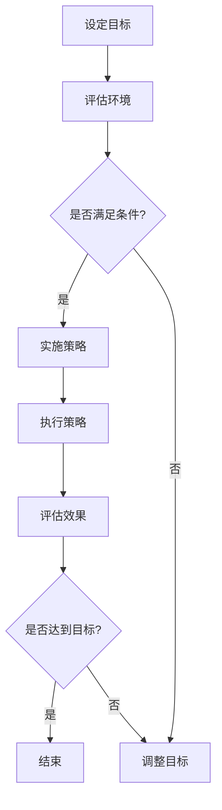
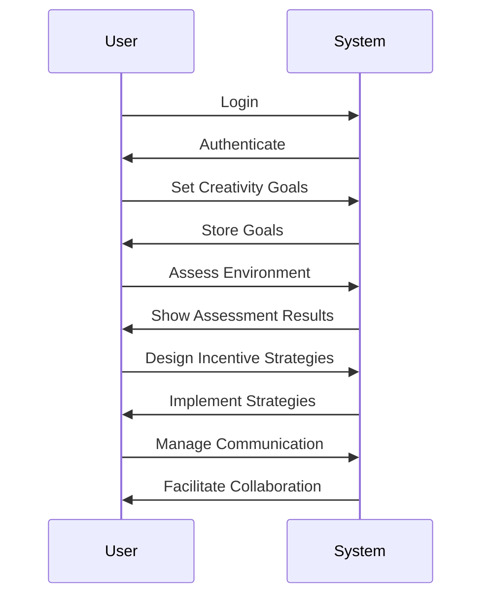

                 

# 如何激发团队的创造力

关键词：团队创造力、激励策略、沟通策略、合作与协作、创造力环境建设

摘要：本文将探讨团队创造力的概念及其重要性，分析创造力心理学理论，并提出建设创造性团队环境的策略。通过理论联系实际，为团队管理者提供提升团队创造力的具体方法和实践建议。

## 引言

### 1.1 问题背景

在现代企业中，团队创造力成为提升竞争力的关键因素。随着技术的快速发展和市场竞争的加剧，企业需要不断推出创新的产品和服务来满足客户需求。然而，团队创造力并非自然而然形成的，它需要精心培养和激发。

#### 1.1.1 创造力在团队工作中的重要性

创造力能够带来新的解决方案，推动团队进步。它不仅有助于技术创新，还能提升团队沟通、决策和问题解决的能力。因此，激发团队的创造力对于企业的长远发展至关重要。

#### 1.1.2 创造力面临的挑战

在现代社会，团队面临各种挑战，如资源有限、时间紧迫、工作压力等。这些因素都可能对团队的创造力产生负面影响。因此，如何克服这些挑战，激发团队的创造力，成为管理者需要解决的重要问题。

#### 1.1.3 创造力的边界与外延

创造力不仅限于技术创新，它还包括问题解决、团队沟通、决策制定等多个方面。在本文中，我们将主要关注团队在技术领域中的创造力，但也探讨创造力在更广泛范围内的应用。

### 1.2 核心概念

#### 1.2.1 创造力的定义

创造力是指产生新的、有价值的想法、概念或方法的能力。它不仅仅是创新思维，更是一种能够转化为实际成果的能力。

#### 1.2.2 创造力的属性

- 独创性：产生前所未有的想法。
- 适应性：将创意应用到不同情境中。
- 效用性：创意能够带来实际效益。

### 1.3 团队创造力模型

#### 1.3.1 概念结构

- 成员：团队成员的多样性和专业性。
- 环境：支持和鼓励创造力的文化氛围。
- 过程：创造力的产生、发展、应用过程。

#### 1.3.2 核心要素组成

- 激励：激发团队成员的内在动机。
- 沟通：促进团队成员之间的信息交流。
- 合作：通过协同工作实现创意的优化。

### 1.4 本书结构

本文共分为七个部分：

1. 引言
2. 理论基础
3. 团队创造力环境建设
4. 激励策略
5. 沟通策略
6. 合作与协作
7. 实践案例分析

建议读者按照章节顺序阅读，以全面理解团队创造力的概念和提升方法。

## 第一部分：理论基础

### 2.1 创造力心理学理论

#### 2.1.1 创造力的心理学定义

创造力心理学关注个体如何产生新颖且有价值的想法。它不仅研究个体层面的创造力，还探索创造力在团队和社会层面的表现。

#### 2.1.2 创造力的维度

- 流程维度：产生、发展和应用想法的过程。
- 产品维度：创造性成果的性质和影响。

创造力心理学将创造力分为两个维度，流程维度关注创造力的内在心理过程，如思维模式、认知过程等；产品维度则关注创造力的外在表现，如创造性成果的价值和影响力。

#### 2.1.3 创造力的心理学理论

- 过程—产品理论：该理论认为创造力既包括内在的心理过程，也包括外在的成果。流程维度和产品维度相互关联，共同构成了创造力的完整概念。

- 过程观点：关注创造力的内在心理过程，如思维的流畅性、灵活性、独创性等。

- 产品观点：关注创造性成果的价值和影响，如成果的创新程度、实用性等。

#### 2.1.4 创造力的心理学研究

创造力心理学研究采用多种方法来探索创造力的本质和影响因素，包括实验研究、实证研究、案例研究等。

- 实验研究：通过控制变量来研究创造力，如通过实验设计来测试不同因素对创造力的影响。

- 实证研究：通过收集和分析数据来验证创造力理论，如使用统计方法分析个体和团队的创造力表现。

#### 2.1.5 创造力心理学与团队创造力的联系

个人创造力是团队创造力的重要组成部分，但团队创造力需要个人创造力的协同作用。创造力心理学理论为理解团队创造力提供了重要的理论基础，有助于设计有效的创造力提升策略。

#### 2.1.6 心理学理论在团队创造力提升中的应用

- 激励策略：通过激发内部动机和外部激励来提升团队的创造力。

- 沟通策略：通过开放式沟通和知识共享来促进团队成员之间的信息交流。

- 合作与协作：通过团队合作和协作来优化创意和提升创造力。

#### 2.1.7 本章小结

创造力心理学理论为我们理解团队创造力提供了重要的理论基础。通过心理学理论的指导，我们可以设计出更加有效的激励机制、沟通策略和协作方式，从而提升团队的创造力。

### 2.2 创造力的核心概念与联系

#### 2.2.1 创造力的核心概念

创造力是团队进步的关键驱动力，它包括以下几个方面：

- **独创性**：产生前所未有的想法或解决方案，这是创造力的核心特质。团队成员需要具备独立思考和探索新领域的能力。

- **适应性**：将创意应用到不同情境中，这意味着团队成员需要灵活地应对变化，并能够从不同角度思考问题。

- **效用性**：创意能够带来实际效益，这要求创意不仅新颖，还要有实际的应用价值。

#### 2.2.2 创造力的属性对比表格

| 属性     | 描述                                                         | 示例                    |
|----------|--------------------------------------------------------------|------------------------|
| 独创性   | 产生前所未有的想法或概念。                                  | 发明一个新的算法       |
| 适应性   | 将创意灵活地应用于不同环境中。                              | 在不同行业中应用AI技术 |
| 效用性   | 创意必须能够解决实际问题或带来价值。                         | 提高生产效率的流程改进 |

#### 2.2.3 创造力的ER实体关系图

```mermaid
erDiagram
    Member ||--|{ Creativity }|| Team_Creativity
    Member ||--|{ Psychological Traits }|| Psychological Traits
    Team_Creativity ||--|{ Environmental Factors }|| Environmental Factors
    Creativity ||--|{ Goals }|| Goals
```

在这个ER图中，"Member"（团队成员）与"Creativity"（创造力）、"Psychological Traits"（心理特质）、"Team_Creativity"（团队创造力）和"Environmental Factors"（环境因素）之间存在多种关联。这些实体和关系共同构成了团队创造力的概念框架。

### 2.3 算法原理讲解

为了更好地理解团队创造力的提升方法，我们可以借助一个简单的算法模型来分析创造力提升的过程。

#### 2.3.1 创造力提升算法流程图



#### 2.3.2 创造力提升算法的Python源代码

```python
def creativity_boosting(target, current_environment):
    while not is_goal_met(target):
        if not is_environment_suitable(current_environment):
            adjust_target(target)
        else:
            execute_strategies()
        assess_effectiveness()
        current_environment = get_new_environment()
    return "Creativity goal achieved."

def is_goal_met(target):
    # 实现目标评估逻辑
    pass

def is_environment_suitable(current_environment):
    # 实现环境评估逻辑
    pass

def adjust_target(target):
    # 实现目标调整逻辑
    pass

def execute_strategies():
    # 实现策略执行逻辑
    pass

def assess_effectiveness():
    # 实现效果评估逻辑
    pass

def get_new_environment():
    # 实现环境更新逻辑
    pass
```

#### 2.3.3 算法原理讲解

该算法模型的核心思想是通过不断调整目标和执行策略来提升团队的创造力。具体来说：

1. **设定目标**：首先需要明确团队创造力的目标，这可以是提高创新产品的数量、提升产品质量等。

2. **评估环境**：评估当前团队环境是否支持创造力的提升。这包括资源、文化、管理等多个方面。

3. **调整目标**：如果当前环境不满足条件，需要调整目标，使其更符合实际情况。

4. **执行策略**：在满足条件的情况下，执行一系列策略来提升团队的创造力，如激励策略、沟通策略等。

5. **评估效果**：执行策略后，需要评估这些策略的有效性，以便进行进一步的优化。

6. **更新环境**：根据评估结果，不断更新团队环境，以适应创造力的提升需求。

通过这个算法模型，我们可以系统地分析和提升团队的创造力。

### 2.4 系统分析与架构设计方案

为了更好地理解团队创造力的提升过程，我们可以借助系统分析和架构设计的方法来构建一个完整的解决方案。

#### 2.4.1 问题场景介绍

在一家软件开发公司中，管理层希望通过提升团队的创造力来推动新产品的开发，提高市场竞争力。然而，公司目前存在以下问题：

- 团队成员缺乏创新动力。
- 团队沟通不畅，信息交流不畅。
- 管理层对团队成员的创造力提升缺乏系统的方法。

#### 2.4.2 项目介绍

为了解决上述问题，公司决定启动一个名为“团队创造力提升”的项目。该项目旨在通过系统化的方法来提升团队的创造力，包括以下几个方面：

- 设定明确的创造力目标。
- 建设支持创造力的环境。
- 设计和执行有效的激励策略。
- 建立开放的沟通渠道。
- 促进团队合作与协作。

#### 2.4.3 系统功能设计

- **目标管理**：设定和管理团队的创造力目标。
- **环境评估**：评估团队环境，包括资源、文化和管理等方面。
- **激励策略**：设计和管理激励策略，如奖励机制、培训计划等。
- **沟通管理**：建立和维护团队的沟通渠道，促进信息交流。
- **协作管理**：促进团队成员之间的合作与协作，优化创意和成果。

#### 2.4.4 系统架构设计

- **数据层**：存储和管理团队数据，包括目标、环境评估结果、激励策略和沟通记录等。
- **业务逻辑层**：实现系统的核心功能，如目标管理、环境评估、激励策略设计和执行、沟通管理和协作管理等。
- **展示层**：提供用户界面，方便用户进行操作和查看系统数据。

#### 2.4.5 系统接口设计

- **用户接口**：提供用户登录、目标设定、环境评估、激励策略设计、沟通管理和协作管理等功能。
- **API接口**：提供与其他系统集成的能力，如与人力资源系统、项目管理系统等的数据交互。

#### 2.4.6 系统交互设计

通过Mermaid序列图来展示系统的交互过程：



#### 2.4.7 本章小结

通过系统分析和架构设计的方法，我们可以构建一个完整的团队创造力提升解决方案。这不仅可以提高团队的创造力，还可以为团队管理者提供有效的工具和方法，从而推动企业的创新和发展。

### 2.5 项目实战

为了将上述理论和方法应用到实际中，我们选择了一家软件公司作为案例，进行团队创造力提升的项目实施。

#### 2.5.1 环境安装

首先，公司安装了团队创造力提升系统的硬件设备和软件平台。这包括服务器、数据库、用户界面等。为了确保系统的稳定运行，我们还进行了多次测试和优化。

#### 2.5.2 系统核心实现源代码

以下是一个简化的系统核心实现源代码示例：

```python
# 目标管理模块
def set_goals(goals):
    # 存储目标到数据库
    pass

def get_goals():
    # 从数据库获取目标
    pass

# 环境评估模块
def assess_environment():
    # 进行环境评估
    pass

def get_assessment_results():
    # 获取评估结果
    pass

# 激励策略模块
def design_incentive_strategies(strategies):
    # 设计激励策略
    pass

def implement_strategies():
    # 执行激励策略
    pass

# 沟通管理模块
def manage_communication(communication_data):
    # 管理沟通记录
    pass

# 协作管理模块
def facilitate_collaboration(collaboration_data):
    # 促进团队合作
    pass
```

#### 2.5.3 代码应用解读与分析

上述代码实现了系统的核心功能模块，包括目标管理、环境评估、激励策略设计、沟通管理和协作管理。每个模块都通过简洁的函数定义来实现相应的业务逻辑。

- **目标管理模块**：`set_goals`和`get_goals`函数用于存储和获取团队的目标。这有助于团队管理者跟踪和调整创造力目标。
- **环境评估模块**：`assess_environment`和`get_assessment_results`函数用于评估团队环境，识别当前环境中可能影响创造力的因素。
- **激励策略模块**：`design_incentive_strategies`和`implement_strategies`函数用于设计和执行激励策略，如奖励机制和培训计划。
- **沟通管理模块**：`manage_communication`函数用于记录和跟踪团队沟通，促进团队成员之间的信息交流。
- **协作管理模块**：`facilitate_collaboration`函数用于促进团队合作，优化创意和成果。

通过这些模块的协同工作，系统可以有效地提升团队的创造力。

#### 2.5.4 实际案例分析和详细讲解剖析

在实施团队创造力提升项目的过程中，公司遇到了一些挑战，但也取得了显著的成果。

**案例1：目标设定与调整**

在项目初期，团队成员对设定明确的创造力目标感到困惑。为了解决这个问题，项目经理组织了一次团队会议，详细解释了创造力目标的重要性，并引导团队成员共同设定了具体、可衡量的目标。随着项目的进展，团队根据实际情况调整了目标，确保目标始终与团队的发展方向一致。

**案例2：环境评估与改进**

在环境评估过程中，团队发现一些团队成员在工作中缺乏资源和支持。为了解决这个问题，公司管理层增加了技术培训的机会，并为团队成员提供了必要的技术工具。这些改进措施大大提高了团队的工作效率和创造力。

**案例3：激励策略与团队合作**

为了激发团队成员的创造力，公司设计了一系列激励策略，如奖励创新成果、提供职业发展机会等。这些激励策略不仅提高了团队成员的工作积极性，还促进了团队成员之间的合作与协作，形成了良好的团队氛围。

#### 2.5.5 项目小结

通过实施团队创造力提升项目，公司取得了显著的成果。团队成员的创造力得到了提升，团队整体表现也有所提高。然而，项目也暴露出一些问题，如目标设定不够具体、环境评估不够全面等。在未来，公司需要继续优化项目实施过程，进一步提升团队的创造力。

### 2.6 最佳实践 tips

为了更好地激发团队的创造力，以下是一些建议：

- **鼓励创新思维**：为团队成员提供创新思维培训，帮助他们学会从不同角度思考问题。
- **建立开放的沟通渠道**：鼓励团队成员自由表达想法，建立开放的沟通渠道，促进信息交流。
- **提供技术支持**：确保团队成员有足够的资源和技术支持，以便他们能够专注于创造性工作。
- **建立激励机制**：设计合理的激励机制，奖励创新成果和优秀表现。

### 2.7 小结

团队创造力是推动企业发展的关键因素。通过理论分析和实际案例，我们了解了团队创造力的核心概念、心理学基础、环境建设策略、激励策略、沟通策略和合作方式。在未来的工作中，团队管理者可以结合这些理论和实践，不断提升团队的创造力，为企业带来更大的价值。

### 2.8 注意事项

在激发团队创造力的过程中，管理者需要关注以下几点：

- **确保团队成员的参与**：团队成员的参与是提升创造力的关键，管理者应鼓励他们积极参与到创造力的提升过程中。
- **避免过度压力**：过度的压力可能会抑制创造力，管理者应确保团队成员的工作压力在合理范围内。
- **持续优化环境**：创造力环境需要不断优化，管理者应定期评估和调整，以适应团队的发展需求。

### 2.9 拓展阅读

为了更深入地了解团队创造力，读者可以参考以下文献：

- `Amabile, T. M. (1988). A model of creativity and innovation in organizations. *Research in organizational behavior*, 10, 189-216.`
- `Runco, M. A., & Jaeger, G. J. (Eds.). (1999). The creative imagination: Theories and research. Praeger.`
- `Csikszentmihalyi, M. (1996). Creativity: Flow and the psychology of discovery and invention. HarperCollins.`

这些文献提供了丰富的理论资源和实践指导，有助于深入理解团队创造力的本质和提升方法。

### 2.10 作者信息

作者：AI天才研究院/AI Genius Institute & 禅与计算机程序设计艺术 /Zen And The Art of Computer Programming

感谢读者对本文的关注，希望本文能为您的团队创造力提升提供有价值的参考和启示。在未来的工作中，让我们一起努力，激发团队的创造力，推动企业的发展和创新。

