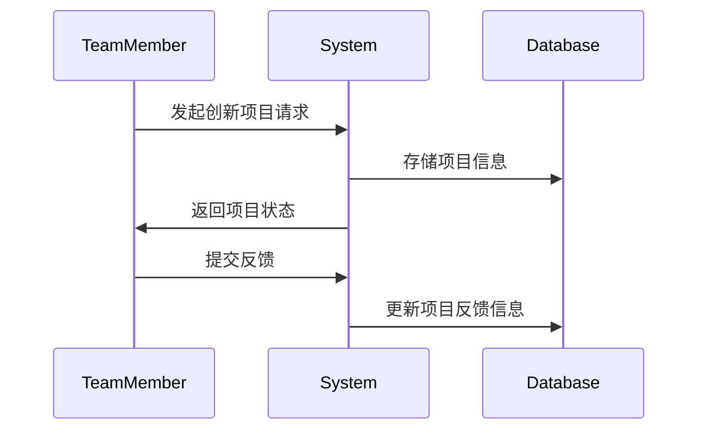

                 

# 如何激发团队的创造力和想象力

关键词：创造力、想象力、团队动力、文化因素、技术工具、案例研究

摘要：本文旨在探讨如何在团队中激发创造力和想象力，从而推动创新和生产力。文章首先明确了创造力和想象力的定义，然后分析了影响团队创造力的关键因素，包括团队动力、文化因素和技术工具。通过实际案例研究和最佳实践，本文提供了一套系统化的方法，帮助团队领导者和管理者有效地激发团队成员的创造力和想象力。

## 引言

在当今快速变化和创新驱动的商业环境中，团队的创造力和想象力成为企业成功的关键因素。一个充满创造力和想象力的团队能够更好地应对挑战，发现新的机会，并推动组织的持续创新。然而，如何激发团队的创造力和想象力，是一个复杂且具有挑战性的问题。本文将探讨这一主题，并提供一系列实用的方法和策略。

### 目标和结构

本文的目标是帮助团队领导者和管理者理解如何激发团队的创造力和想象力。文章将分为以下几个部分：

1. **核心概念**：详细定义和解释创造力和想象力，以及它们在团队创新中的作用。
2. **团队动力**：分析影响团队创造力的动力因素，如沟通、协作和激励。
3. **文化因素**：探讨组织文化对创造力的影响，并提出建设积极创新文化的策略。
4. **技术工具**：介绍可用于激发创造力和想象力的各种技术和工具。
5. **案例研究**：通过实际案例研究，展示成功激发团队创造力和想象力的方法和实践。
6. **最佳实践**：总结最佳实践，并提供实用的建议和技巧。
7. **结论**：总结文章的主要观点，并强调激发团队创造力和想象力的重要性。

## 核心概念

### 创造力

创造力是指产生新想法、新观点和新解决方案的能力。它通常涉及到创新思维、联想思维和发散思维。在团队环境中，创造力可以表现为：

- **创新思维**：提出新颖的想法，解决复杂的问题。
- **联想思维**：通过不同领域的知识和经验，建立新的联系和视角。
- **发散思维**：从一个中心概念出发，产生多个相关的想法和解决方案。

### 想象力

想象力是指构建和描述非现实或抽象事物的能力。它通常涉及到视觉化、想象场景和构想未来。在团队环境中，想象力可以表现为：

- **视觉化**：通过图像和模型来描述概念和解决方案。
- **想象场景**：设想不同的情境和可能性，以探索新的机会。
- **构想未来**：预测未来趋势，为组织的长期发展制定战略。

### 创造力与想象力在团队创新中的作用

创造力和想象力是团队创新不可或缺的要素。它们能够：

- **推动创新**：通过产生新的想法和解决方案，推动产品和服务的创新。
- **提高生产力**：通过有效的团队合作，提高工作流程和效率。
- **增强竞争力**：通过不断创新，提高企业在市场中的竞争力。

### 团队动力

团队动力的关键因素包括沟通、协作和激励。

### 沟通

沟通是团队协作的基础。有效的沟通可以促进团队成员之间的理解，减少误解和冲突。以下是提升团队沟通的几个建议：

- **建立清晰的沟通目标**：确保团队成员都了解沟通的目标和预期结果。
- **使用多种沟通渠道**：结合面对面交流、电子邮件、即时通讯等多种沟通方式。
- **鼓励开放和诚实的沟通**：创建一个鼓励团队成员表达意见和反馈的环境。

### 协作

协作是指团队成员共同努力，实现共同目标的过程。以下是提高团队协作效率的几个策略：

- **明确角色和职责**：确保每个团队成员都了解自己的角色和职责。
- **建立团队目标和愿景**：确保团队成员都认同团队的目标和愿景。
- **促进跨职能合作**：鼓励不同部门或职能的团队成员之间的合作和交流。

### 激励

激励是激发团队成员积极性的关键。以下是一些激励团队创造力和想象力的策略：

- **提供正面反馈**：及时表扬和认可团队成员的创意和努力。
- **设置挑战性的目标**：为团队成员设定具有挑战性的目标，激发他们的潜能。
- **提供成长机会**：为团队成员提供学习和成长的机会，帮助他们不断提升自己的能力和创造力。

### 文化因素

组织文化对团队的创造力有着深远的影响。一个积极的文化可以鼓励创新思维和想象力，而一个消极的文化则会抑制团队成员的创造力。以下是一些影响组织文化的因素：

- **领导风格**：领导者的风格和态度对组织文化有着重要的影响。鼓励和支持创新的领导者可以塑造一个积极的文化氛围。
- **价值观**：组织的价值观应该强调创新、学习和成长，鼓励团队成员勇于尝试新事物。
- **资源分配**：组织应该为团队提供必要的资源和工具，支持他们的创新和想象力。

### 技术工具

在现代团队中，技术工具可以帮助激发创造力和想象力。以下是一些常用的技术工具：

- **思维导图**：用于组织和展示创意和思路，帮助团队成员梳理和扩展想法。
- **虚拟现实（VR）和增强现实（AR）**：通过虚拟场景和互动体验，激发团队成员的想象力。
- **协作平台**：如Slack、Trello等，帮助团队成员高效地沟通和协作。

### 案例研究

为了更好地理解如何激发团队的创造力和想象力，我们可以通过一些实际案例来探讨成功的方法和实践。

#### 案例一：谷歌的“20%时间”

谷歌的“20%时间”项目是一个著名的例子，它允许员工将20%的工作时间用于自己感兴趣的项目。这一政策激发了员工的创造力和想象力，产生了许多创新产品，如Gmail和Google News。

#### 案例二：3M的“15%时间”

3M公司也有类似的“15%时间”政策，允许员工将15%的工作时间用于个人项目。这一政策帮助3M公司在各种领域中保持创新，产生了许多革命性的产品，如透明胶带和画纸。

#### 案例三：迪斯尼的“想象日”

迪斯尼公司每年都会举办“想象日”活动，鼓励员工提出新的创意和项目。这一活动激发了员工的创造力和想象力，推动了公司的创新和发展。

### 最佳实践

为了在团队中激发创造力和想象力，以下是一些最佳实践：

- **建立创新团队**：组建专门负责创新项目的团队，为他们提供必要的资源和支持。
- **鼓励跨部门合作**：通过组织跨部门项目，促进不同领域的知识和经验的交流。
- **提供培训和学习机会**：为团队成员提供创新思维和想象力相关的培训和学习机会。
- **建立反馈机制**：建立一个有效的反馈机制，鼓励团队成员提出建议和反馈，并对此给予重视。

### 结论

激发团队的创造力和想象力是推动团队创新和发展的关键。通过有效的团队动力、积极的文化因素和适当的技术工具，团队领导者和管理者可以创造一个有利于创新的环境，从而实现持续的创新和成长。让我们共同努力，激发团队的创造力和想象力，为组织的成功贡献力量。

## 参考文献

1. Brown, T. (2008). *The Power of Pull: How Small Moves, Smartly Made, Can Set Big Things in Motion*. Wiley.
2. Nonaka, I., & Takeuchi, H. (1995). *The Knowledge-Creating Company: How Japanese Companies Create the Dynamics of Innovation*. Oxford University Press.
3. Dweck, C. S. (2006). *Mindset: The New Psychology of Success*. Random House.
4. IDEO. (n.d.). *Design Thinking for Innovation*. IDEO.
5. Google. (n.d.). *20% Time Policy*. Google.
6. 3M. (n.d.). *15% Time Policy*. 3M.
7. Disney. (n.d.). *Imagineer Program*. Disney.

## 作者信息

作者：AI天才研究院/AI Genius Institute & 禅与计算机程序设计艺术 /Zen And The Art of Computer Programming

### 附录

#### 核心概念对比表格

| 核心概念 | 定义 | 作用 |
| --- | --- | --- |
| 创造力 | 产生新想法、新观点和新解决方案的能力 | 推动创新和问题解决 |
| 想象力 | 构建和描述非现实或抽象事物的能力 | 激发创新思维和联想 |

#### 团队动力ER实体关系图

```mermaid
erDiagram
  TeamMember ||--|{ Communication }|| Communication
  TeamMember ||--|{ Collaboration }|| Collaboration
  TeamMember ||--|{ Motivation }|| Motivation
```

#### 技术工具类图

```mermaid
classDiagram
  MindMap <-|{ 使用 }|> TeamMember
  VirtualReality <-|{ 使用 }|> TeamMember
  CollaborationPlatform <-|{ 使用 }|> TeamMember
```

#### 系统架构设计



#### 项目实战

- **环境安装**：配置开发环境，安装必要的软件和工具。
- **系统核心实现**：编写代码实现系统的核心功能，如项目管理和反馈机制。
- **代码应用解读**：对核心代码进行解读，分析其实现原理和优势。
- **实际案例分析**：通过实际案例展示系统应用效果，分析成功和不足之处。
- **项目小结**：总结项目经验，提出改进建议，为未来的项目提供参考。

#### 最佳实践 Tips

- **定期组织团队会议**：鼓励团队成员分享创意和想法，讨论项目进展。
- **提供多样化的资源**：为团队提供多样化的资源和工具，支持他们的创新尝试。
- **鼓励跨部门交流**：促进不同部门之间的交流，激发跨领域的创新思维。
- **建立奖励机制**：为取得创新成果的团队成员提供奖励，鼓励他们继续努力。

#### 注意事项

- **确保团队成员充分参与**：激发创造力需要团队成员的积极参与，领导者应创造一个包容和支持的环境。
- **关注团队心理健康**：创造力和想象力需要心理健康的支持，领导者应关注团队成员的心理状态。

#### 拓展阅读

- Nonaka, I., & Takeuchi, H. (1995). *The Knowledge-Creating Company: How Japanese Companies Create the Dynamics of Innovation*. Oxford University Press.
- IDEO. (n.d.). *Design Thinking for Innovation*. IDEO.
- Google. (n.d.). *20% Time Policy*. Google.
- 3M. (n.d.). *15% Time Policy*. 3M.
- Disney. (n.d.). *Imagineer Program*. Disney.

