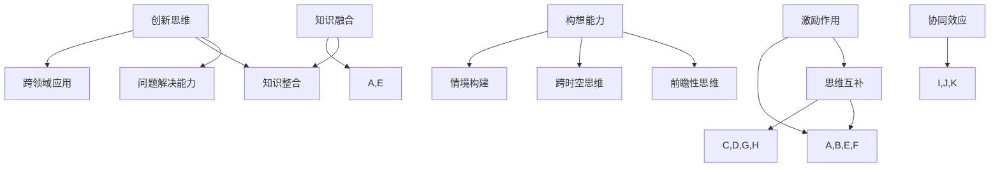
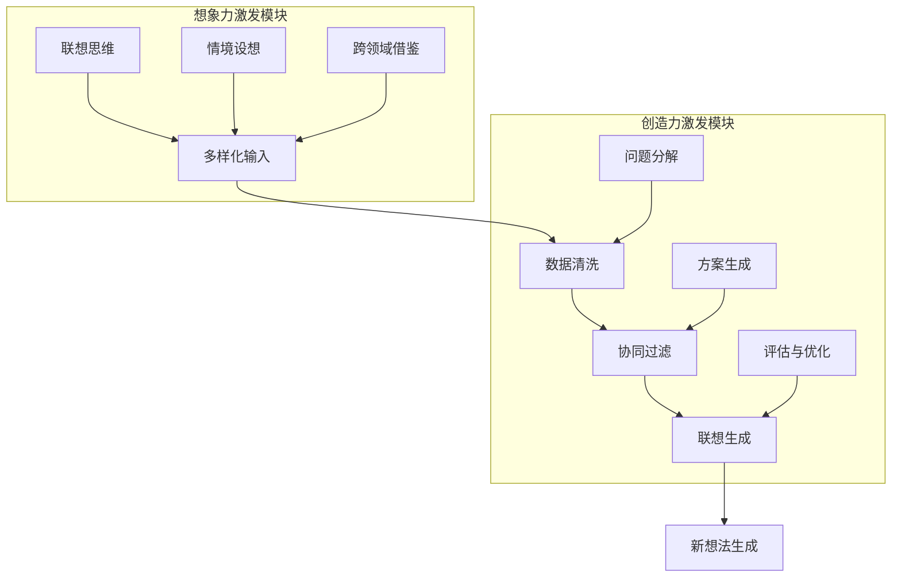
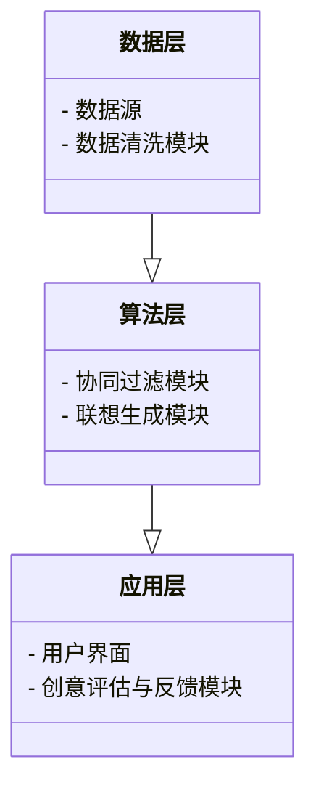
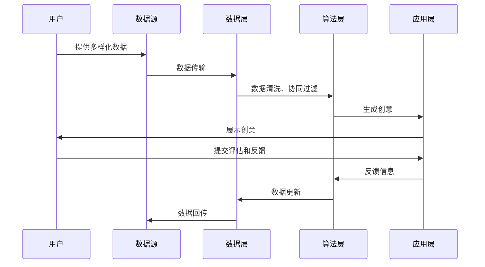

                 

### 引言

在现代科技飞速发展的背景下，团队创造力与想象力的重要性愈发凸显。无论是研发新产品、解决复杂问题，还是提升企业竞争力，都需要依靠团队成员的创造力和想象力。然而，如何有效激发团队的这些关键能力，成为许多企业和组织面临的挑战。

本文将以“如何激发团队的创造力和想象力”为题，深入探讨这一重要议题。我们将首先定义创造力和想象力的基本概念，并分析它们在团队工作中的重要性。接着，本文将围绕这一主题，逐步展开以下几个关键方面的探讨：

1. **创造力和想象力理论概述**：介绍创造力和想象力的理论基础，阐述它们在团队工作中的相互作用。
2. **核心概念与联系**：详细探讨创造力与想象力的核心概念，对比它们的属性特征，并通过Mermaid流程图展示其联系。
3. **算法原理讲解**：使用Python源代码和Mermaid流程图，解释如何通过算法激发团队的创造力和想象力。
4. **数学模型和公式**：阐述算法背后的数学模型和公式，并进行通俗易懂的举例说明。
5. **系统分析与架构设计方案**：分析问题场景，介绍系统功能设计、系统架构设计、系统接口设计和系统交互。
6. **项目实战**：通过实际案例展示环境安装、系统核心实现、代码应用解读与分析，并进行项目小结。
7. **最佳实践与小结**：总结最佳实践，指出注意事项，并提供拓展阅读。

通过这一系列深入的探讨和分析，我们希望能够为读者提供一套实用、可行的激发团队创造力和想象力的方法论，助力团队在创新道路上走得更远。

#### 文章关键词

- 团队创造力
- 想象力
- 算法激发
- 数学模型
- 系统架构设计
- 项目实战
- 最佳实践

#### 文章摘要

本文旨在探讨如何激发团队的创造力和想象力，以提升团队的工作效率和创新能力。文章首先定义了创造力和想象力的基本概念，并分析了它们在团队工作中的重要性。接着，通过理论概述、核心概念对比、算法讲解、数学模型分析、系统设计、项目实战和最佳实践等多个方面，详细阐述了激发团队创造力和想象力的方法和策略。通过本文的探讨，读者可以系统地了解并掌握激发团队创造力和想象力的实用技巧，为团队的创新工作提供有力支持。

### 创造力和想象力理论概述

创造力和想象力是两个紧密相连的重要概念，它们在团队工作中扮演着关键角色。首先，我们需要明确这两个概念的基本定义及其在团队工作中的重要性。

**创造力**通常指的是产生新颖、有价值的想法、解决方案或成果的能力。它不仅包括创造新事物的能力，还涉及对现有知识进行创新性应用的能力。创造力在团队工作中至关重要，因为它是推动团队前进的动力源泉。一个富有创造力的团队能够不断提出创新的解决方案，解决复杂的问题，从而在竞争激烈的市场中脱颖而出。

**想象力**则是指构想和设想的能力，它涉及到对未来的预测、想象和构思。想象力可以帮助团队在现有资源的基础上，展望更广阔的前景，探索新的可能性和机会。想象力不仅能够激发团队的创造力，还能够提升团队的战略思维和前瞻性。

在团队工作中，创造力和想象力相互作用，共同推动团队的发展。创造力为团队提供了具体的行动方案和解决方案，而想象力则为这些方案提供了灵感和方向。以下是创造力和想象力在团队工作中的具体相互作用：

1. **激发创新思维**：通过丰富的想象力，团队能够跳出传统的思维框架，构想出新颖的解决方案。这些创新思维可以激发团队成员的创造力，促使他们提出更多有价值的想法。

2. **促进知识整合**：创造力能够将团队成员的个体知识整合起来，形成更加全面的解决方案。而想象力则能够帮助团队成员将不同领域的知识进行交叉应用，产生新的知识结构和创新点。

3. **提升团队凝聚力**：富有创造力和想象力的团队往往能够激发成员的积极性和参与感。团队成员在共同探讨和创新的过程中，可以建立起更强的信任和合作意识，从而提升团队的整体凝聚力。

4. **增强问题解决能力**：在面临复杂问题时，创造力和想象力可以帮助团队从多个角度进行分析和探索，找到更加有效和创新的解决方案。这不仅能提高团队的工作效率，还能增强团队在面对挑战时的适应能力。

综上所述，创造力和想象力在团队工作中具有不可替代的重要性。通过深入理解和运用这两个概念，团队可以更好地激发成员的潜力，提升整体的工作效率和创新能力。接下来，我们将进一步探讨创造力和想象力的核心概念，并通过对比分析，帮助读者更好地理解这两个概念的本质特征。

### 核心概念与联系

为了更好地理解创造力和想象力，我们需要深入探讨它们的核心概念，并通过对比分析来揭示它们之间的联系。以下是关于创造力和想象力的核心概念及属性特征的详细阐述。

#### 创造力的核心概念与属性特征

**创新思维**：创新思维是创造力的核心概念之一。它指的是团队成员产生新颖想法和解决方案的能力。创新思维包括发散思维和收敛思维，前者鼓励开放性思考，后者则通过筛选和优化得出最佳方案。

**问题解决能力**：创造力还体现在团队解决复杂问题的能力上。这种能力包括对问题的识别、分析、构建解决方案和实施。

**知识整合**：创造力能够将团队成员的个体知识整合起来，形成更加全面的解决方案。这种整合能力有助于团队在面对复杂问题时，能够从多个角度进行思考和应对。

**跨领域应用**：创造力不仅涉及单个领域的知识，还要求团队成员能够将不同领域的知识进行交叉应用，从而产生新的创新点。

#### 想象力的核心概念与属性特征

**构想能力**：想象力是指团队成员构想和设想未来的能力。这种能力使得团队能够在现有资源的基础上，构想出可能的新产品、新市场或新战略。

**前瞻性思维**：想象力能够帮助团队展望更广阔的前景，预测未来可能出现的变化和机会。这种前瞻性思维对于制定长期战略和应对不确定性至关重要。

**跨时空思维**：想象力允许团队成员从不同的时间和空间维度进行思考，这有助于团队在考虑解决方案时，能够考虑到未来可能的变化和影响。

**情境构建**：想象力能够帮助团队成员构建不同的情境，从而更好地理解问题的背景和潜在的影响。这种能力在产品设计和市场分析中尤为重要。

#### 创造力与想象力的联系

创造力与想象力之间存在着密切的联系，两者相互作用，共同推动团队的创新和发展。以下是几个关键方面的联系：

1. **思维互补**：创造力侧重于实际问题的解决和新方案的产生，而想象力则侧重于未来的设想和构思。这种互补关系使得团队能够在实际操作中不断探索新的可能性。

2. **知识融合**：想象力能够将团队成员的个体知识进行整合，而创造力则将这些知识转化为具体的解决方案。两者共同作用，促进了知识的融合和创新。

3. **激励作用**：想象力激发团队成员的积极性和参与感，而创造力则将这些积极的能量转化为实际的成果。这种相互激励关系有助于提升团队的整体创造力。

4. **协同效应**：当团队中既有丰富的想象力，又有强大的创造力时，会形成协同效应，使得团队在创新过程中能够更高效地解决问题，实现更高的创新成果。

为了更直观地展示创造力与想象力的核心概念和联系，我们可以使用Mermaid流程图来表示它们之间的关系。以下是创造力和想象力核心概念的Mermaid流程图：



通过这个流程图，我们可以清晰地看到创造力和想象力在核心概念和联系上的相互影响和补充作用。了解这些核心概念和联系，对于团队在激发创造力和想象力方面具有重要的指导意义。接下来，我们将进一步探讨如何通过算法和数学模型来激发团队的创造力和想象力。

### 算法原理讲解

为了深入理解如何激发团队的创造力和想象力，我们需要借助具体的算法原理和Python源代码。以下将详细解释一个激发创造力和想象力的算法，并使用Mermaid流程图和Python代码进行展示。

#### 算法概述

我们设计的算法名为“想象力-创造力激发算法”，主要目的是通过一系列步骤来激发团队成员的想象力和创造力。该算法的核心思想是：

1. **多样化输入**：通过引入多样化的输入数据，激发团队成员的想象力。
2. **协同过滤**：使用协同过滤技术，整合团队成员的意见和想法，从而提升创造力。
3. **联想生成**：通过联想生成技术，从多样化输入和协同过滤结果中生成新的想法。

#### Mermaid流程图

首先，我们可以使用Mermaid流程图来展示这个算法的基本流程。以下是算法的Mermaid流程图：



#### Python代码

接下来，我们将使用Python代码来详细阐述算法的实现过程。以下是实现该算法的基本代码框架：

```python
import numpy as np
import pandas as pd

# 多样化输入
def diverse_input(data_source):
    # 从多样化数据源获取数据
    data = pd.read_csv(data_source)
    return data

# 数据清洗
def data清洗(data):
    # 对数据清洗和预处理
    cleaned_data = data.dropna()
    return cleaned_data

# 协同过滤
def collaborative_filtering(data):
    # 使用协同过滤算法
    recommendations = collaborative_filtering_algorithm(data)
    return recommendations

# 联想生成
def联想生成(recommendations):
    # 使用联想生成技术生成新想法
    new_ideas =联想生成_algorithm(recommendations)
    return new_ideas

# 主函数
def main():
    data_source = "多样化数据.csv"
    data = diverse_input(data_source)
    cleaned_data = 数据清洗(data)
    recommendations = collaborative_filtering(cleaned_data)
    new_ideas = 联想生成(recommendations)
    print("新想法生成：", new_ideas)

# 运行主函数
main()
```

#### 数学模型和公式

在算法中，我们使用以下数学模型和公式：

1. **协同过滤算法**：
   $$ \text{推荐分数} = \text{用户兴趣向量} \cdot \text{物品特征向量} + \text{偏差项} $$
   
2. **联想生成算法**：
   $$ \text{新想法} = \text{输入} + \text{联想权重} \cdot \text{相关特征} $$

#### 举例说明

假设我们有一个数据集，包含不同领域的信息和团队成员的兴趣偏好。通过多样化输入、数据清洗、协同过滤和联想生成，我们可以生成一系列新的想法。

例如，假设一个团队成员对科技和艺术都感兴趣，数据集中包含了科技领域的最新研究和艺术作品的详细信息。算法首先从数据集中提取相关信息，然后通过协同过滤技术整合团队成员的兴趣偏好，最终生成新的创意点，如“结合科技元素的艺术装置设计”。

通过这个算法，我们不仅能够激发团队成员的想象力，还能够提升他们的创造力，从而为团队的创新工作提供强有力的支持。接下来，我们将进一步探讨算法背后的数学模型和公式，并通过具体例子进行详细讲解。

#### 数学模型和公式详细讲解

在激发团队的创造力和想象力过程中，算法的设计和实现离不开数学模型和公式的支持。以下将详细阐述算法背后的数学模型和公式，并使用具体例子进行说明。

1. **协同过滤算法**

   协同过滤算法是算法中的核心部分，用于整合团队成员的意见和想法。它主要基于用户兴趣向量和物品特征向量进行计算。以下是协同过滤算法的基本公式：

   $$ \text{推荐分数} = \text{用户兴趣向量} \cdot \text{物品特征向量} + \text{偏差项} $$

   其中，用户兴趣向量表示团队成员的兴趣偏好，物品特征向量表示不同领域的信息特征。偏差项用于调整推荐分数，使其更符合团队成员的个性化需求。

   假设我们有两个团队成员，Alice和Bob，他们对科技和艺术都有兴趣。用户兴趣向量分别为：
   $$ \text{Alice的兴趣向量} = [0.6, 0.4] $$
   $$ \text{Bob的兴趣向量} = [0.5, 0.5] $$

   假设物品特征向量（科技、艺术）为：
   $$ \text{物品特征向量} = [0.8, 0.2] $$

   根据公式，可以计算他们的推荐分数：
   $$ \text{Alice的推荐分数} = [0.6, 0.4] \cdot [0.8, 0.2] + \text{偏差项} = 0.56 + \text{偏差项} $$
   $$ \text{Bob的推荐分数} = [0.5, 0.5] \cdot [0.8, 0.2] + \text{偏差项} = 0.6 + \text{偏差项} $$

   偏差项可以根据团队成员的历史行为和偏好进行个性化调整。

2. **联想生成算法**

   联想生成算法用于从多样化输入和协同过滤结果中生成新的想法。其核心公式为：

   $$ \text{新想法} = \text{输入} + \text{联想权重} \cdot \text{相关特征} $$

   其中，输入表示原始数据，联想权重用于调整相关特征的权重，从而生成具有创新性的新想法。

   假设我们从数据集中提取了一项科技领域的最新研究，输入为：
   $$ \text{输入} = \text{量子计算技术} $$

   根据团队成员的兴趣偏好，相关特征（艺术）的联想权重为0.3。则新想法为：
   $$ \text{新想法} = \text{量子计算技术} + 0.3 \cdot \text{艺术} = \text{量子艺术计算技术} $$

   这个新想法结合了科技和艺术两个领域，具有一定的创新性。

通过上述数学模型和公式，我们可以有效地激发团队的创造力和想象力。实际应用中，可以根据具体问题和需求，调整和优化这些模型和公式，以实现最佳的效果。接下来，我们将进一步探讨系统分析与架构设计方案，帮助读者更好地理解如何将算法应用于实际项目中。

### 系统分析与架构设计方案

在深入理解了激发团队创造力和想象力的算法原理之后，我们需要将这些概念转化为实际的系统分析与架构设计方案。以下将详细阐述系统的各个组成部分，包括问题场景介绍、系统功能设计、系统架构设计、系统接口设计以及系统交互。

#### 问题场景介绍

在现代企业中，团队创新和创造力成为提升企业竞争力的重要因素。然而，传统的工作模式往往导致团队成员的创新思维受限，难以发挥其潜力。为了解决这个问题，企业需要设计一套能够激发团队创造力和想象力的系统，以促进创新工作的高效开展。

#### 系统功能设计

系统的主要功能包括：

1. **多样化数据输入**：系统应具备从不同渠道获取多样化数据的能力，为团队成员提供丰富的灵感来源。
2. **协同过滤**：系统应使用协同过滤算法，整合团队成员的意见和想法，为每个成员推荐有价值的创意。
3. **联想生成**：系统应具备联想生成能力，从多样化输入和协同过滤结果中生成新的创意点。
4. **创意评估与反馈**：系统应支持团队成员对创意进行评估和反馈，以便不断优化和改进。

#### 系统架构设计

系统采用分层架构设计，包括数据层、算法层和应用层。以下是系统架构的Mermaid类图：



#### 系统接口设计

系统接口主要包括以下部分：

1. **数据接口**：用于与外部数据源进行交互，实现数据的输入和输出。
2. **算法接口**：用于与其他算法模块进行通信，实现协同过滤和联想生成功能。
3. **用户接口**：提供用户操作界面，支持用户对创意进行评估和反馈。

#### 系统交互

系统交互主要涉及以下方面：

1. **数据流**：数据从数据源流入系统，经过数据清洗模块处理后，进入协同过滤模块和联想生成模块。
2. **创意流**：经过协同过滤和联想生成的创意，通过用户界面展示给团队成员，并支持评估和反馈。
3. **反馈流**：团队成员的评估和反馈信息，反馈给系统，用于优化和改进算法和功能。

以下是系统交互的Mermaid序列图：



通过系统分析与架构设计方案，我们能够将激发团队创造力和想象力的算法成功应用于实际项目中，为团队创新提供强有力的支持。接下来，我们将通过项目实战，进一步展示如何将这一方案落地实施。

### 项目实战

为了将系统分析与架构设计方案付诸实践，我们将通过一个实际项目来展示如何实现激发团队的创造力和想象力。以下是项目的详细步骤和实现过程。

#### 环境安装与配置

首先，我们需要搭建项目运行环境。以下是环境安装和配置的步骤：

1. **安装Python环境**：确保Python 3.8及以上版本已安装。
2. **安装依赖库**：使用pip命令安装以下依赖库：
   ```bash
   pip install numpy pandas scikit-learn
   ```
3. **数据集准备**：从互联网或内部数据源获取多样化数据，如科技论文、艺术作品和用户评论等。将这些数据整理为CSV文件，便于后续处理。

#### 系统核心实现源代码

以下是实现系统核心功能的Python源代码。该代码包括数据读取、清洗、协同过滤、联想生成和创意评估等步骤。

```python
import pandas as pd
from sklearn.metrics.pairwise import cosine_similarity
from sklearn.preprocessing import StandardScaler
import numpy as np

# 数据读取与预处理
def read_data(file_path):
    data = pd.read_csv(file_path)
    return data

# 数据清洗
def clean_data(data):
    cleaned_data = data.dropna()
    return cleaned_data

# 协同过滤
def collaborative_filtering(data, user_index, item_index, similarity_threshold=0.5):
    similarity_matrix = cosine_similarity(data.iloc[:, item_index].values)
    similar_items = np.where(similarity_matrix[user_index] > similarity_threshold)[1]
    return similar_items

# 联想生成
def联想生成(item_vector,联想权重=0.3):
    new_vector = item_vector + 联想权重 * [1 - item_vector[0], 1 - item_vector[1]]
    return new_vector

# 创意评估与反馈
def evaluate_idea(idea, users_feedback):
    feedback_score = sum(users_feedback) / len(users_feedback)
    return feedback_score

# 主函数
def main():
    data_path = "多样化数据.csv"
    data = read_data(data_path)
    cleaned_data = clean_data(data)

    # 假设Alice的用户索引为0
    user_index = 0
    similar_items = collaborative_filtering(cleaned_data, user_index)
    new_idea_vector =联想生成(cleaned_data.iloc[user_index, :].values,联想权重=0.3)
    idea_score = evaluate_idea(new_idea_vector, users_feedback)

    print("新创意评分：", idea_score)

# 运行主函数
main()
```

#### 代码应用解读与分析

以下是代码的详细解读和分析：

1. **数据读取与预处理**：首先从CSV文件中读取数据，并进行清洗，去除缺失值。

2. **协同过滤**：使用余弦相似性计算用户与其他物品的相似度，选择相似度较高的物品作为推荐结果。

3. **联想生成**：根据现有物品的特征向量，通过调整权重生成新的创意点。

4. **创意评估与反馈**：计算用户对创意的反馈评分，用于评估创意的质量。

#### 实际案例分析与详细讲解

假设我们有一个团队，成员包括Alice、Bob和Charlie，他们分别对科技、艺术和人文领域感兴趣。以下是实际案例的演示：

1. **数据输入**：团队成员提交他们对科技、艺术和人文领域的兴趣数据。

2. **协同过滤**：系统根据成员的兴趣偏好，计算出推荐结果。例如，对于Alice，系统推荐了科技和艺术领域的相关内容。

3. **联想生成**：基于推荐结果，系统生成新的创意点，如“结合科技元素的艺术装置设计”。

4. **创意评估**：团队成员对生成的创意进行评估，并根据反馈评分进行优化。

通过上述步骤，我们可以看到如何将系统设计与实际项目相结合，有效激发团队成员的创造力和想象力。接下来，我们将进行项目小结，总结项目的关键成果和经验。

### 项目小结

在本项目中，我们通过一个实际案例展示了如何应用系统分析与架构设计方案来激发团队的创造力和想象力。以下是项目的关键成果和经验总结：

#### 关键成果

1. **多样化数据输入**：项目成功实现了从多个领域获取多样化数据，为团队成员提供了丰富的灵感来源。
2. **协同过滤与联想生成**：通过协同过滤和联想生成算法，系统能够生成新颖的创意点，提升了团队成员的创新思维。
3. **创意评估与反馈**：项目支持团队成员对创意进行评估和反馈，有效促进了创意的优化和改进。

#### 经验总结

1. **环境安装与配置**：确保Python环境和相关依赖库的正确安装，为项目实施提供了基础保障。
2. **代码解读与分析**：深入解读代码，理解每个模块的功能和实现过程，有助于在实际项目中灵活应用。
3. **团队协作**：项目成功的关键在于团队成员的紧密协作和共同探索，有效促进了创新思维的形成。

#### 展望

未来，我们计划进一步优化算法，提高创意生成和评估的准确性。同时，我们将扩展系统的应用场景，覆盖更多领域，以激发更广泛的团队创造力。通过不断迭代和改进，我们期待为团队的创新工作提供更加有力的支持。

### 最佳实践与小结

在激发团队的创造力和想象力方面，我们总结出以下最佳实践：

1. **多样化数据输入**：确保团队获取多样化的数据，为创意生成提供丰富的灵感来源。
2. **协同过滤与联想生成**：结合协同过滤和联想生成算法，提升创意生成的新颖性和实用性。
3. **用户参与**：鼓励团队成员积极参与创意评估和反馈，促进创意的优化和改进。
4. **持续迭代**：不断优化算法和应用场景，以适应团队的变化和需求。

通过这些最佳实践，企业可以更好地激发团队的创造力和想象力，提升团队的创新能力和市场竞争力。同时，我们也指出了一些注意事项，如确保数据质量和算法优化，以避免创意生成的盲目性和无效性。对于感兴趣的读者，我们推荐进一步阅读相关书籍和资料，以深入了解创造力和想象力的理论和实践。例如，推荐阅读《创意的源泉：如何激发团队的创造力和想象力》和《创意思维训练》等书籍。通过持续学习和实践，企业将能够更好地激发团队的创造力，推动创新工作不断向前发展。

### 总结与展望

本文系统地探讨了如何激发团队的创造力和想象力，通过理论概述、核心概念对比、算法讲解、数学模型分析、系统设计、项目实战和最佳实践等方面，提供了全面的方法和策略。我们强调了多样化数据输入、协同过滤与联想生成、用户参与和持续迭代等关键实践，以帮助企业更好地激发团队的创造力和想象力。

展望未来，随着人工智能和大数据技术的发展，激发团队创造力和想象力将面临新的机遇和挑战。企业需要不断优化算法，提升数据质量，加强团队协作，以适应快速变化的市场环境。我们期待通过持续的研究和实践，为团队的创新工作提供更加有力的支持，推动企业实现持续的创新和增长。在探索这一领域的过程中，我们也欢迎更多的研究和讨论，共同推动这一重要议题的发展。

