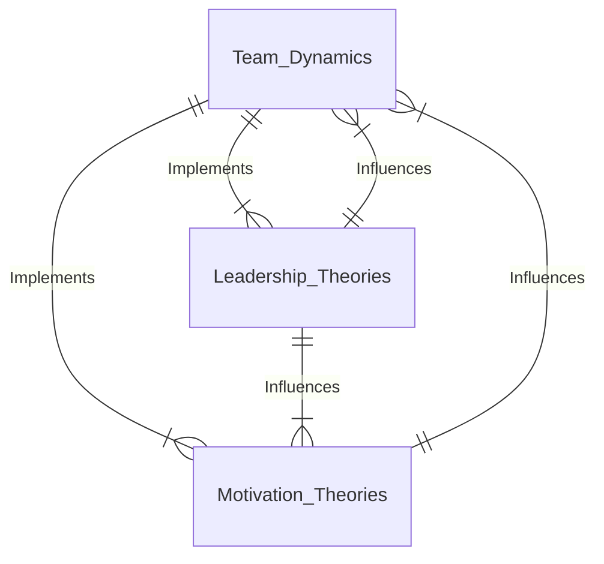

                 

### 引言：团队管理的艺术与科学

在现代企业环境中，团队管理成为了企业成功的关键因素之一。随着组织结构日益复杂和全球化趋势的加强，领导者们需要掌握如何有效地管理团队，以提升团队整体绩效。然而，团队管理不仅仅是简单的任务分配和绩效监控，它更是一门融合了艺术与科学的综合性技能。

本文将深入探讨团队管理的各个方面，从基础概念到高级策略，提供一套系统的团队管理指南。我们将首先介绍团队管理的基本概念，包括团队的定义、团队管理的重要性以及团队管理的基本模型和框架。接着，我们将深入分析团队管理的关键技能，如沟通与协作、领导风格与技能、团队建设与发展、绩效管理、员工激励以及应对团队挑战的策略。

本文将按照以下结构和逻辑展开：

1. **基本概念与框架**：介绍团队管理的基础知识，包括团队的定义、团队管理的重要性以及团队管理的基本模型和框架。
2. **关键技能**：详细探讨沟通与协作、领导风格与技能、团队建设与发展、绩效管理、员工激励等关键技能，并提供实际案例和应用策略。
3. **应对挑战**：讨论团队管理中可能遇到的各种挑战，包括冲突、变化管理、团队规模调整等，并提供解决方案和应对策略。
4. **最佳实践**：总结团队管理的最佳实践，提供实用的建议和技巧，帮助领导者更有效地管理团队。

通过本文的阅读，您将获得全面的团队管理知识和实用的管理技巧，帮助您提升团队绩效，实现组织目标。接下来，我们将详细探讨团队管理的核心概念和框架。

### 基本概念与框架：团队的定义与管理的重要性

**团队的定义**

团队是由一组相互依赖、共同工作的个体组成的集合，他们为了实现共同的目标而协同合作。团队中的每个成员都有自己的角色和责任，他们通过沟通和协作来共同完成任务。团队不同于简单的集合或群体，它具有以下特征：

- **目标导向**：团队具有明确的目标，成员们共同努力，为实现这些目标而工作。
- **相互依赖**：团队成员之间相互依赖，他们的工作成果需要相互配合才能实现整体目标。
- **共享责任**：团队成员共同承担团队的责任和任务，而不是单打独斗。
- **相互沟通**：团队成员之间保持开放的沟通，通过交流信息、共享知识和经验来提高工作效率。
- **协作**：团队成员通过协作和合作来共同完成任务，而不是各自为战。

**团队管理的重要性**

团队管理在组织成功中扮演着至关重要的角色。有效的团队管理不仅可以提高团队的工作效率，还可以增强团队的合作精神和创新能力，从而实现组织的目标。以下是团队管理的重要性：

1. **提高工作效率**：通过合理分配任务和资源，团队管理可以帮助团队成员更高效地工作，减少冗余和重复劳动，提高整体工作效率。
2. **增强团队合作**：有效的团队管理可以促进团队成员之间的沟通与合作，建立良好的团队关系，提高团队的整体凝聚力。
3. **激发创新能力**：在良好的团队管理下，团队成员更容易分享自己的想法和观点，这有助于激发创新思维和创造力，推动组织的发展。
4. **实现组织目标**：团队管理确保团队的工作与组织的战略目标保持一致，通过协调和整合团队资源，实现组织的目标和愿景。
5. **提高员工满意度**：有效的团队管理可以提高员工的工作满意度和职业成就感，减少员工流失，提升组织的稳定性和持续性。

**团队管理的基本模型和框架**

团队管理并不是一项单一的任务，它涉及多个方面和多个阶段。以下是团队管理的基本模型和框架：

1. **团队形成阶段**：在这一阶段，团队成员开始组建，角色和职责分配，团队目标和愿景明确。有效的团队管理需要确保团队成员之间建立良好的沟通和信任，以便后续工作的顺利进行。
   
2. **团队发展阶段**：在这一阶段，团队开始进入正式运作状态。团队成员之间的合作和沟通逐渐增多，团队逐渐形成统一的团队文化。团队管理需要关注团队成员的能力提升和团队结构的优化，以应对外部环境的变化。

3. **团队成熟阶段**：在这一阶段，团队已经形成高度的合作和协同能力，能够高效地完成复杂的任务。团队管理需要保持对团队的持续关注，通过培训和发展来保持团队的活力和创新能力。

4. **团队解散阶段**：在某些情况下，团队可能会解散，如项目结束或组织结构调整。团队管理需要确保在团队解散前完成所有未完成的任务，并为团队成员提供合适的职业发展机会。

**总结**

团队管理是一门融合了艺术与科学的综合性技能。通过明确团队的定义、理解团队管理的重要性以及掌握团队管理的基本模型和框架，领导者可以更有效地管理团队，提高团队绩效，实现组织目标。在接下来的部分中，我们将深入探讨团队管理中的核心概念和技能，帮助领导者更好地应对团队管理的挑战。

### 核心概念与联系：团队管理中的关键理论

在团队管理中，理解并应用一些核心理论和模型是非常重要的。这些理论为团队管理提供了科学的指导，帮助领导者更好地理解和应对团队中的复杂问题。以下是一些关键的团队管理理论，包括团队动态、领导理论和激励理论，以及它们之间的相互关系。

**团队动态**

团队动态是指团队内部成员之间的相互作用和相互影响。了解团队动态可以帮助领导者识别团队中的潜在问题和挑战，并采取适当的措施来解决这些问题。

1. **角色与职责**：团队成员在团队中扮演不同的角色，如领导者、协调者、执行者等。明确每个成员的职责和角色有助于提高团队的工作效率。

2. **沟通与互动**：团队成员之间的有效沟通是团队成功的关键。良好的沟通可以减少误解和冲突，增强团队合作。

3. **冲突管理**：团队中难免会出现冲突，冲突管理策略可以帮助团队领导者处理和解决这些冲突，维护团队的和谐。

4. **团队文化**：团队文化是指团队成员共同认可和遵循的价值观和行为准则。积极健康的团队文化可以增强团队的凝聚力和工作效率。

**领导理论**

领导理论研究了领导者的行为、风格和技能，以及这些因素如何影响团队的表现。以下是一些重要的领导理论：

1. **特质理论**：特质理论认为领导者具有一些固有的特质和能力，如自信、决断力、沟通能力等。领导者通过这些特质来影响和激励团队成员。

2. **行为理论**：行为理论关注领导者的具体行为和领导风格，如民主型、专制型、参与型等。不同的领导风格会对团队产生不同的影响。

3. **情境理论**：情境理论认为领导者的行为应该根据具体情境和环境进行调整。领导者需要灵活运用不同的领导风格，以适应团队的不同需求和挑战。

**激励理论**

激励理论研究了如何激发和维持团队成员的工作动机和积极性。以下是几种重要的激励理论：

1. **马斯洛需求层次理论**：马斯洛需求层次理论认为人的需求分为生理需求、安全需求、社交需求、尊重需求和自我实现需求。领导者可以通过满足员工的不同需求来提高他们的工作动力。

2. **赫茨伯格双因素理论**：赫茨伯格双因素理论将激励因素（如成就、认可等）和保健因素（如薪酬、工作环境等）分开。激励因素可以激发员工的内在动机，而保健因素可以防止员工的不满意。

3. **期望理论**：期望理论认为员工的工作动机取决于他们对工作结果和回报的期望。领导者可以通过设定清晰的目标和提供合理的回报来激励员工。

**核心概念属性特征对比表格**

为了更好地理解这些理论，我们可以通过一个对比表格来展示它们的核心概念和特征：

| 理论名称 | 核心概念 | 特征 |
| --- | --- | --- |
| 团队动态 | 团队内部成员的相互作用和影响 | 角色与职责、沟通与互动、冲突管理、团队文化 |
| 领导理论 | 领导者的行为和风格 | 特质理论、行为理论、情境理论 |
| 激励理论 | 激发和维持员工的工作动机 | 马斯洛需求层次理论、赫茨伯格双因素理论、期望理论 |

**ER实体关系图架构**

为了更清晰地展示这些理论之间的相互关系，我们可以使用ER（Entity-Relationship）实体关系图来描述。以下是ER实体关系图的Markdown格式示例：

**总结**

通过理解团队动态、领导理论和激励理论，领导者可以更全面地把握团队管理的复杂性，并采取适当的策略来提升团队绩效。这些理论不仅提供了理论指导，还可以通过实际案例和应用来验证其效果。在接下来的部分中，我们将深入探讨团队管理中的具体技能，帮助领导者更有效地应对团队管理的挑战。

### 团队管理中的具体技能：沟通与协作

有效的沟通和协作是团队管理中至关重要的一环，它们不仅直接影响团队的工作效率，还关系到团队的凝聚力和整体绩效。在本节中，我们将详细探讨沟通和协作的具体技能，包括有效的沟通策略、如何构建协作环境以及冲突的解决和调解方法。

#### 1. 有效沟通策略

**1.1 明确沟通目标**

在沟通之前，明确沟通的目标是非常重要的。领导者需要确定沟通的目的、内容以及期望的反馈。通过设定明确的沟通目标，可以确保团队成员在沟通过程中保持一致的方向。

**1.2 选择适当的沟通方式**

不同的沟通情境需要选择不同的沟通方式。口头沟通适用于需要即时反馈的情况，如团队会议；书面沟通适用于需要记录和参考的情况，如电子邮件；非语言沟通则可以通过肢体语言和面部表情来传达情感和意图。

**1.3 倾听和反馈**

倾听是有效沟通的重要组成部分。领导者不仅需要听取团队成员的意见和反馈，还需要给予充分的反馈，以确保信息的正确理解和接受。通过积极倾听，领导者可以更好地了解团队成员的需求和问题，从而提供更有针对性的支持。

**1.4 保持透明和开放**

透明和开放的沟通环境有助于建立信任和信任。领导者应避免隐瞒信息或误导团队成员，而是应该坦诚地分享信息和决策过程，以增强团队成员的参与感和归属感。

#### 2. 建立协作环境

**2.1 分配明确的角色和职责**

在团队中，每个成员都应该明确自己的角色和职责。通过合理的角色分配，可以避免职责重叠和任务混淆，提高团队的工作效率。

**2.2 促进知识和资源共享**

共享知识和资源是协作环境的关键。领导者可以鼓励团队成员分享他们的经验和知识，通过建立共享平台或定期召开知识分享会议，来促进团队内部的知识流动。

**2.3 建立协作工具和流程**

有效的协作工具和流程可以帮助团队成员更高效地协同工作。例如，使用项目管理工具来跟踪任务进度，使用协作平台来共享文档和资料，使用即时通讯工具来保持沟通畅通。

#### 3. 冲突的解决和调解

**3.1 识别冲突类型**

冲突可以分为任务冲突、关系冲突和过程冲突。了解冲突的类型有助于领导者采取更有效的解决策略。

**3.2 建立冲突解决机制**

领导者应建立一个明确的冲突解决机制，包括冲突报告、调解和仲裁程序。通过建立机制，可以确保冲突得到及时和有效的处理，避免冲突升级。

**3.3 采用调解方法**

调解是一种通过中立的第三方来帮助冲突双方达成共识的方法。领导者可以作为调解者，或邀请外部调解专家来处理冲突。

**3.4 培养冲突管理能力**

领导者应培养团队成员的冲突管理能力，包括识别冲突、沟通解决和协商谈判等。通过培训和教育，可以提高团队整体的处理冲突的能力。

**案例与实际应用**

例如，在一个软件开发团队中，领导者在项目启动阶段明确每个成员的角色和职责，并通过定期召开团队会议来促进沟通和知识分享。当项目进度出现问题时，领导者及时召开冲突调解会议，通过讨论和协商找到解决方案。这种高效的沟通和协作机制，不仅提高了项目的完成质量，还增强了团队的凝聚力。

**总结**

有效的沟通和协作是团队管理中不可或缺的技能。通过明确沟通目标、选择适当的沟通方式、倾听和反馈、保持透明和开放，领导者可以建立良好的沟通环境。同时，通过明确角色和职责、促进知识和资源共享、建立协作工具和流程，可以构建高效的协作环境。面对冲突，领导者应采用调解方法，并培养团队成员的冲突管理能力。通过这些具体的技能和实践，领导者可以更有效地管理团队，提升团队的整体绩效。

### 领导风格与技能：塑造团队成功的关键

领导风格和技能在团队管理中扮演着至关重要的角色。不同的领导风格会影响团队成员的工作态度、合作效率以及整体团队的文化氛围。在本节中，我们将探讨不同的领导风格，分析其优缺点，并介绍如何发展有效的领导技能。

#### 1. 领导风格的类型

**1.1 指导型领导**

指导型领导风格以任务为导向，领导者详细规定团队成员的任务和行动步骤。这种风格有助于确保团队按计划顺利进行，但可能导致团队成员缺乏自主性和创造力。

**优点**：结构清晰，任务执行高效。
**缺点**：抑制了团队成员的创造力和自主性。

**1.2 支持型领导**

支持型领导风格关注团队成员的需求和感受，提供情感支持和资源。这种风格有助于提高团队成员的满意度和工作动机，但可能会导致任务执行的效率降低。

**优点**：增强团队成员的满意度和工作动机。
**缺点**：可能忽视任务的重要性和紧迫性。

**1.3 参与型领导**

参与型领导风格鼓励团队成员参与决策过程，共同制定目标和计划。这种风格有助于提高团队成员的参与感和责任感，但可能需要更多的时间和资源来达成共识。

**优点**：增强团队成员的参与感和责任感。
**缺点**：决策过程可能较长，效率较低。

**1.4 指导-支持型领导**

指导-支持型领导风格结合了指导型和支持型领导的特点，根据不同情境灵活调整领导风格。这种风格有助于在任务执行和团队支持之间取得平衡。

**优点**：灵活适应不同情境，提高团队的整体绩效。
**缺点**：领导者需要具备较高的情境适应能力。

**1.5 领导-参与型领导**

领导-参与型领导风格强调领导者与团队成员之间的合作和共同决策。这种风格有助于培养团队的领导能力和创新能力，但需要领导者具备较强的沟通和协调能力。

**优点**：培养团队的领导能力和创新能力。
**缺点**：对领导者的能力要求较高。

#### 2. 发展领导技能

**2.1 自我认知**

有效的领导者首先需要了解自己的优势和不足。通过自我反思和评估，领导者可以识别需要提升的领域，并制定个人发展计划。

**2.2 沟通能力**

沟通能力是领导者的核心技能之一。领导者需要具备清晰、准确的沟通能力，以确保信息的有效传递和理解。

**2.3 情绪智力**

情绪智力包括自我管理、自我激励、同理心和社交技能。领导者需要具备高情绪智力，以更好地理解和应对团队成员的情绪和需求。

**2.4 决策能力**

领导者需要具备良好的决策能力，能够在复杂和不确定的环境中做出明智的决策。通过收集信息、分析风险和制定应对策略，领导者可以提高决策的质量和效率。

**2.5 团队管理能力**

领导者需要具备团队管理能力，包括团队建设、绩效管理和冲突解决等。通过培养团队精神和协作能力，领导者可以提升团队的整体绩效。

#### 3. 领导风格的实际应用

**案例：某技术公司的转型**

在某技术公司的一次重大转型中，领导者采用了参与型领导风格。领导者与团队成员共同制定了转型目标，并通过定期的会议和讨论，确保团队成员参与决策过程。这种参与型领导风格不仅提高了团队成员的参与感和责任感，还促进了团队的创新能力。在转型过程中，团队成功地推出了多个创新产品，取得了显著的市场成功。

**总结**

不同的领导风格适用于不同的情境和团队。指导型领导风格适合任务明确、要求高效执行的情况；支持型领导风格适合团队需要情感支持和资源的情况；参与型领导风格适合需要团队共同参与决策的情况。领导者需要根据具体情况灵活调整领导风格，并不断提升自身的领导技能。通过理解不同的领导风格和发展有效的领导技能，领导者可以更有效地塑造团队的成功。

### 团队建设与发展：提升团队绩效的长期策略

团队建设与发展是团队管理中不可或缺的一部分，它关乎团队的整体绩效和长期成功。一个有效的团队不仅需要明确的领导和有效的沟通，还需要持续的建设和发展。在本节中，我们将探讨团队建设与发展的关键策略，包括如何构建高绩效团队、团队发展阶段以及培训和发展计划的制定。

#### 1. 构建高绩效团队

构建高绩效团队是团队管理中的首要任务。高绩效团队具有以下几个特征：

**1.1 明确的目标**

高绩效团队具有清晰、可衡量的目标。这些目标不仅激励团队成员努力工作，还可以作为团队评估和改进的基准。

**1.2 共同的价值观**

共同的价值观是团队凝聚力的基础。团队成员应该共享一套核心价值观，这有助于建立团队文化，促进协作和合作。

**1.3 明确的角色和职责**

每个团队成员都应该明确自己的角色和职责，这有助于避免职责重叠和任务混淆，提高工作效率。

**1.4 高度的信任和沟通**

信任和沟通是团队成功的关键。团队成员之间应该建立高度的信任，通过开放和坦诚的沟通来解决问题和冲突。

**1.5 自我管理和自我驱动**

高绩效团队中的成员通常具有自我管理和自我驱动的能力，他们能够在没有外部监督的情况下高效地完成任务。

#### 2. 团队发展阶段

团队发展通常经历以下几个阶段：

**2.1 形成阶段**

在形成阶段，团队成员开始了解彼此，建立初步的信任和关系。这个阶段的关键任务是明确团队目标和角色，建立基本的沟通机制。

**2.2 稳定阶段**

在稳定阶段，团队成员之间的信任和协作逐渐增强，团队开始进入高效的工作状态。这个阶段的关键任务是优化工作流程，提高工作效率。

**2.3 成熟阶段**

在成熟阶段，团队已经形成高度的协作和创新能力，能够高效地应对复杂任务和挑战。这个阶段的关键任务是保持团队的活力和创新能力，通过培训和激励机制来持续发展。

**2.4 解散阶段**

在解散阶段，团队完成特定任务或项目后解散。这个阶段的关键任务是确保团队成员的顺利过渡，为他们提供职业发展机会和支持。

#### 3. 培训和发展计划

为了保持团队的活力和竞争力，制定和实施有效的培训和发展计划至关重要。

**3.1 培训需求分析**

在制定培训计划之前，领导者需要分析团队成员的培训需求。通过调查问卷、绩效评估等方式，了解团队成员在技能、知识和态度方面的需求。

**3.2 培训内容设计**

培训内容应根据团队成员的需求设计，包括技能培训、知识更新、团队协作技巧等。例如，对于技术团队，可以提供最新的技术培训，而对于管理团队，可以提供领导力和决策能力的培训。

**3.3 培训实施策略**

培训的实施策略包括内部培训和外部培训。内部培训可以由团队成员或内部专家进行，外部培训可以邀请行业专家或培训机构进行。此外，在线学习平台和虚拟培训也是一种有效的培训方式。

**3.4 发展计划**

发展计划不仅包括培训，还包括职业发展规划和晋升机制。通过设立明确的职业发展路径和晋升标准，可以激励团队成员不断提升自身能力，为团队的发展贡献力量。

**实际案例与应用**

例如，某国际知名咨询公司通过实施全面的培训和发展计划，成功打造了一支高绩效团队。公司每年定期举办技术论坛和领导力培训班，鼓励团队成员分享经验和学习新技能。同时，公司设立了一系列职业发展路径，为团队成员提供了明确的职业规划和晋升机会。这些措施不仅提升了团队成员的专业能力，还增强了团队的凝聚力和竞争力。

**总结**

团队建设与发展是团队管理中的长期策略，通过构建高绩效团队、经历团队发展阶段以及实施有效的培训和发展计划，领导者可以持续提升团队的绩效和竞争力。通过不断建设和发展的团队，组织可以更好地应对市场变化和挑战，实现长期成功。

### 绩效管理：确保团队高效运作的机制

绩效管理是团队管理中不可或缺的一环，它不仅关系到团队成员的职业发展和满意度，还直接影响团队的整体绩效和组织的成功。有效的绩效管理机制可以帮助领导者了解团队成员的表现，提供有针对性的反馈和改进建议，从而推动团队高效运作。以下将详细探讨绩效管理的核心要素，包括设定目标、绩效评估和反馈、以及改进计划。

#### 1. 设定目标

设定明确、具体、可衡量的目标是绩效管理的第一步。目标设定应遵循SMART原则，即目标应具有明确性（Specific）、可衡量性（Measurable）、可实现性（Achievable）、相关性（Relevant）和时限性（Time-bound）。

**1.1 目标设定的步骤**

- **确定团队目标**：首先，领导者需要与团队成员共同确定团队的整体目标，确保这些目标与组织的战略和愿景保持一致。
- **分解目标**：将团队目标分解为具体的个人目标，确保每个团队成员都清楚自己的职责和任务。
- **讨论和确认**：与团队成员讨论个人目标，确保他们理解并认同这些目标，并在必要时进行调整。

**1.2 目标设定的影响**

- **明确职责**：通过设定明确的个人目标，可以避免职责不清和任务重叠，提高工作效率。
- **激励员工**：明确的个人目标可以激励员工为实现这些目标而努力，提高工作动力。
- **绩效评估的基准**：明确的个人目标为后续的绩效评估提供了客观的基准，有助于公平、公正地评估员工的表现。

#### 2. 绩效评估和反馈

绩效评估是绩效管理的重要环节，通过定期评估团队成员的表现，领导者可以及时了解团队的工作进度和质量，提供有针对性的反馈和指导。

**2.1 绩效评估的方法**

- **定期评估**：定期进行绩效评估，如季度评估或年度评估，以确保团队成员的工作表现得到持续关注。
- **多维度评估**：绩效评估应涵盖多个维度，包括工作成果、工作效率、团队合作、创新能力等，以全面评估团队成员的表现。
- **360度反馈**：通过收集团队成员、同事和上级的反馈，进行360度评估，以获得更全面的绩效评估结果。

**2.2 绩效评估的影响**

- **激励和认可**：通过绩效评估，可以及时激励表现优秀的团队成员，并给予认可和奖励，增强他们的工作动力。
- **问题识别**：绩效评估可以帮助识别团队成员的不足之处，为后续的改进提供方向。
- **职业发展**：通过绩效评估，可以了解团队成员的职业发展和潜力，为他们提供合适的职业发展机会。

#### 3. 改进计划

绩效管理的最终目标是不断改进和提高团队的工作效率和绩效。通过制定和实施改进计划，可以确保团队成员在绩效评估中发现的问题得到及时解决。

**3.1 改进计划的步骤**

- **问题识别**：在绩效评估过程中，识别团队成员存在的具体问题和挑战。
- **原因分析**：分析问题产生的原因，确定需要改进的方面。
- **制定改进措施**：根据问题原因，制定具体的改进措施，如培训、技能提升、流程优化等。
- **实施和监控**：实施改进措施，并定期监控改进效果，确保问题得到有效解决。

**3.2 改进计划的影响**

- **提升绩效**：通过改进计划，可以解决团队成员在工作中的问题，提高整体绩效。
- **促进学习**：改进计划为团队成员提供了学习和成长的机会，提高了他们的专业能力和工作效率。
- **增强团队凝聚力**：通过共同解决问题和改进工作，可以增强团队成员之间的信任和合作，提高团队凝聚力。

#### 4. 实际应用

例如，某科技公司在实施绩效管理时，首先明确公司的年度目标和各部门的具体目标。在季度评估中，公司采用多维度评估方法，从工作成果、团队合作、创新能力等方面评估员工的表现。对于评估中识别的问题，公司制定了详细的改进计划，包括提供技术培训、优化工作流程、安排跨部门交流等。通过这些措施，公司的整体绩效显著提升，员工的工作满意度也得到提高。

**总结**

绩效管理是确保团队高效运作的重要机制，通过设定目标、进行绩效评估和反馈、以及制定改进计划，领导者可以不断提升团队的工作效率和绩效。有效的绩效管理不仅能够激励和认可团队成员，还能帮助他们不断成长和提升，为组织的长期成功奠定基础。

### 激励与员工参与：提升团队动力与绩效的关键

在团队管理中，激励员工和提升员工参与度是提升团队动力与绩效的重要手段。有效的激励机制和参与策略不仅可以激发员工的工作热情，还能提高团队的协作效率和创新能力。以下将详细探讨员工激励理论、参与度提升策略以及实际应用案例。

#### 1. 员工激励理论

了解员工激励理论有助于领导者制定科学、有效的激励机制。以下是一些重要的激励理论：

**1.1 马斯洛需求层次理论**

马斯洛需求层次理论认为人的需求分为五个层次：生理需求、安全需求、社交需求、尊重需求和自我实现需求。领导者应根据员工的不同需求层次，提供相应的激励措施。

- **生理需求**：提供合理的薪酬和福利，确保员工的基本生活需求得到满足。
- **安全需求**：通过提供稳定的工作环境和职业安全感，满足员工的安全需求。
- **社交需求**：鼓励员工参与团队合作和社交活动，增强团队凝聚力和归属感。
- **尊重需求**：通过认可员工的贡献和提供职业发展机会，满足员工的尊重需求。
- **自我实现需求**：提供挑战性任务和个人发展机会，激发员工的自我实现需求。

**1.2 赫茨伯格双因素理论**

赫茨伯格双因素理论将激励因素（如成就、认可等）和保健因素（如薪酬、工作环境等）分开。激励因素可以激发员工的内在动机，而保健因素可以防止员工的不满意。

- **激励因素**：通过提供成就感、认可和职业发展机会，激发员工的内在动机。
- **保健因素**：通过提供合理的薪酬、良好的工作环境和稳定的工作条件，防止员工的不满意。

**1.3 期望理论**

期望理论认为员工的工作动机取决于他们对工作结果和回报的期望。领导者可以通过设定清晰的目标和提供合理的回报，来提高员工的工作动机。

- **期望值**：员工对达成工作目标的概率的估计。
- **激励值**：员工对达成目标后获得的回报的估计。
- **总动机**：期望值和激励值的乘积。

#### 2. 提升参与度策略

提升员工的参与度是提高团队绩效的重要途径。以下是一些有效的策略：

**2.1 参与式决策**

鼓励员工参与决策过程，可以增强他们的责任感和参与感。领导者可以通过团队会议、调查问卷等方式，收集员工的意见和建议，确保他们在决策中有发言权。

**2.2 项目责任制**

明确每个团队成员在项目中的角色和责任，可以增强他们的责任感和参与度。通过设定明确的项目目标和里程碑，员工可以更好地理解自己的工作对项目成功的重要性。

**2.3 沟通与反馈**

保持开放、透明的沟通环境，可以增强员工的参与感。领导者应定期与团队成员沟通，了解他们的工作进展和需求，提供及时的反馈和指导。

**2.4 跨部门合作**

鼓励跨部门合作，可以促进不同部门之间的知识共享和协作，提高团队的整体绩效。通过组织跨部门项目或工作坊，可以增强员工的合作精神和参与度。

#### 3. 实际应用案例

例如，某知名互联网公司通过实施员工激励和参与度提升策略，显著提升了团队绩效和员工满意度。公司定期举办员工满意度调查，了解员工的需求和建议，并制定相应的改进措施。公司还推行了“项目责任制”，明确每个团队成员在项目中的角色和责任，提高了他们的责任感和参与度。此外，公司定期组织团队建设活动，如团建旅行、运动会等，增强了员工的团队合作精神和凝聚力。通过这些措施，公司的整体绩效和员工满意度显著提升。

**总结**

有效的员工激励和参与度提升策略是提高团队绩效的关键。通过理解员工激励理论和应用参与度提升策略，领导者可以激发员工的工作热情和参与度，提高团队的整体绩效和创新能力。在实际应用中，领导者应根据具体情境和员工需求，灵活调整激励和参与策略，以实现最佳效果。

### 应对团队管理中的挑战

在团队管理过程中，领导者不可避免地会遇到各种挑战。这些挑战可能包括冲突、变化管理、团队规模调整等。有效应对这些挑战，不仅关系到团队的整体绩效，还影响团队的稳定性和可持续发展。以下将详细探讨这些常见挑战及其应对策略。

#### 1. 冲突

冲突是团队管理中常见的问题，可能源于任务分配、角色冲突、个人价值观差异等方面。有效的冲突管理是确保团队和谐与高效的关键。

**1.1 识别冲突类型**

冲突可以分为任务冲突、关系冲突和过程冲突。任务冲突主要涉及工作内容和任务分配；关系冲突则源于团队成员之间的个人关系；过程冲突涉及工作流程和方法。

**1.2 冲突管理策略**

- **预防策略**：通过明确团队目标和角色分工，减少任务冲突；建立良好的沟通机制，增强团队成员之间的信任和理解，减少关系冲突。
- **应对策略**：对于任务冲突，可以采取分工调整、任务重分配等方法；对于关系冲突，可以采用调解和沟通技巧，帮助团队成员找到共同点；对于过程冲突，可以优化工作流程，制定明确的操作规范。

**1.3 实际案例**

例如，在一个研发团队中，由于任务分配不均，出现了明显的任务冲突。领导者通过与团队成员进行一对一沟通，了解了每个人的工作负荷和技能特长，最终调整了任务分配，并设立了明确的工作目标和进度追踪机制。通过这些措施，团队的任务冲突得到了有效解决，工作氛围也明显改善。

#### 2. 变化管理

在快速变化的市场环境中，团队管理需要具备应对变化的能力。变化管理涉及组织结构调整、流程优化、技术升级等方面。

**2.1 变化管理策略**

- **明确变化目标**：在实施变化前，领导者需要明确变化的目标和预期效果，确保团队成员理解变化的重要性和必要性。
- **沟通与宣传**：通过有效的沟通和宣传，让团队成员了解变化的背景、原因和影响，减少因信息不对称而产生的焦虑和抵触情绪。
- **培训与支持**：为团队成员提供必要的培训和支持，帮助他们适应新的工作流程和技术，确保变化顺利实施。

**2.2 实际案例**

例如，某公司决定实施新的项目管理工具以提高工作效率。在变化实施前，公司组织了多次培训课程，帮助团队成员熟悉新工具的使用。同时，公司还设立了支持团队，解决团队成员在使用过程中遇到的问题。通过这些措施，新工具的引入得到了团队成员的广泛认可，工作效率显著提升。

#### 3. 团队规模调整

团队规模调整可能源于业务发展需求、人员流动等原因。适当的团队规模调整有助于优化资源配置，提高团队效率。

**3.1 规模调整策略**

- **需求分析**：在调整团队规模前，领导者需要分析业务需求和团队现状，确保调整方案合理、可行。
- **人员配置**：根据业务需求和团队现状，合理配置人员，确保关键岗位有足够的支持。
- **沟通与支持**：在规模调整过程中，与团队成员保持良好的沟通，了解他们的意见和建议，提供必要的支持和帮助。

**3.2 实际案例**

例如，某公司在业务拓展阶段，决定扩大研发团队规模。在调整过程中，公司进行了详细的需求分析，明确了新团队成员的技能要求和岗位配置。同时，公司通过内部招聘和外部招聘相结合的方式，快速补充了所需人才。在规模调整过程中，公司还设立了专门的团队支持部门，帮助新成员快速融入团队，提高工作效率。

#### 4. 总结

团队管理中的挑战多种多样，领导者需要具备应对这些挑战的能力。通过有效的冲突管理策略、变化管理策略和团队规模调整策略，领导者可以确保团队在变化中保持稳定和高效。在实际应用中，领导者应根据具体情况灵活调整策略，确保团队在面临挑战时能够迅速适应，实现持续发展。

### 最佳实践与技巧：团队管理中的成功策略

在团队管理中，领导者需要掌握一系列最佳实践和技巧，以确保团队的高效运作和持续发展。以下是一些实用的团队管理策略和技巧，包括目标设定、时间管理、资源分配、团队激励等，帮助领导者更有效地管理团队。

#### 1. 明确目标

明确的团队目标是团队管理的基础。领导者需要确保团队目标清晰、具体、可衡量，并与组织的战略目标保持一致。

**实践技巧**：

- **使用SMART原则**：确保目标具有明确性、可衡量性、可实现性、相关性和时限性。
- **定期回顾和调整**：定期与团队成员回顾目标完成情况，根据实际情况调整目标。

#### 2. 时间管理

有效的时间管理可以确保团队任务按时完成，提高工作效率。

**实践技巧**：

- **制定工作计划**：为每个任务分配具体的时间，并设定优先级。
- **使用时间跟踪工具**：如Trello、JIRA等，帮助团队监控任务进度和时间使用。

#### 3. 资源分配

合理分配资源是确保团队任务顺利完成的必要条件。

**实践技巧**：

- **需求分析**：在任务分配前，分析任务的需求和团队成员的技能特长。
- **资源优化**：确保关键任务有足够的资源支持，避免资源浪费。

#### 4. 团队激励

激励团队成员是提高团队绩效和员工满意度的重要手段。

**实践技巧**：

- **认可与奖励**：定期对表现优秀的团队成员进行认可和奖励，增强他们的工作动力。
- **职业发展**：为团队成员提供职业发展机会和培训，帮助他们实现个人和职业成长。

#### 5. 沟通与反馈

良好的沟通和及时的反馈是确保团队协作和问题解决的关键。

**实践技巧**：

- **建立沟通机制**：定期召开团队会议，确保信息畅通和团队协作。
- **及时反馈**：对团队成员的工作表现给予及时的反馈，帮助他们改进和提高。

#### 6. 持续改进

持续改进是团队管理中的核心，通过不断优化流程和策略，提高团队的整体绩效。

**实践技巧**：

- **定期评估**：定期对团队的工作流程和策略进行评估，识别改进机会。
- **鼓励创新**：鼓励团队成员提出创新的想法和建议，推动团队不断进步。

#### 7. 领导力提升

领导者的领导力直接影响团队的表现和氛围。

**实践技巧**：

- **自我提升**：领导者需要不断学习和提升自身的领导力，以更好地指导和管理团队。
- **培养团队领导力**：鼓励团队成员参与领导力培训，提高他们的领导能力和责任感。

#### 8. 灵活应变

在快速变化的环境中，领导者需要具备灵活应变的能力。

**实践技巧**：

- **适应变化**：及时适应外部环境的变化，调整团队策略和计划。
- **培养团队适应力**：通过培训和实践，提高团队成员的适应能力和应变能力。

### 总结

通过掌握这些最佳实践和技巧，领导者可以更有效地管理团队，提高团队绩效和员工满意度。在实际应用中，领导者应根据团队的实际情况和需求，灵活调整策略，确保团队在变化中保持稳定和高效。

### 小结与展望

通过对团队管理的深入探讨，我们了解了团队管理的基本概念、核心技能和应对挑战的策略。团队管理不仅是一门艺术，也是一门科学，它涉及沟通、协作、领导、激励等多个方面。有效的团队管理能够提升团队的整体绩效，增强团队的凝聚力和创新能力，从而实现组织的目标。

在本篇技术博客中，我们首先介绍了团队管理的基本概念和框架，包括团队的定义、重要性以及管理模型。接着，我们详细分析了团队管理中的核心技能，如沟通与协作、领导风格与技能、团队建设与发展、绩效管理、员工激励等。最后，我们探讨了团队管理中可能遇到的挑战，并提供了具体的应对策略和最佳实践。

展望未来，随着技术的发展和市场的变化，团队管理将面临新的机遇和挑战。领导者需要不断学习和适应，掌握新的管理理论和工具，以提高团队的整体绩效。同时，团队管理也将更加注重个性化和灵活性，以更好地适应不同的团队和组织环境。

在此，我们鼓励读者继续关注团队管理的研究和实践，不断提升自身的管理能力。通过不断学习和实践，您将成为更出色的团队领导者，为团队和组织的发展贡献力量。

### 作者信息

作者：AI天才研究院/AI Genius Institute & 禅与计算机程序设计艺术 /Zen And The Art of Computer Programming

AI天才研究院（AI Genius Institute）是全球领先的AI研究与培训机构，致力于推动人工智能领域的前沿研究和技术创新。研究院汇聚了世界顶级的人工智能专家、程序员和软件架构师，他们不仅在学术界有着卓越的成就，还在工业界拥有丰富的实践经验。

《禅与计算机程序设计艺术》（Zen And The Art of Computer Programming）是由AI天才研究院创始人之一编写的一本经典计算机编程和人工智能领域的畅销书。该书以深厚的计算机科学理论基础和独特的禅宗思想相结合，为读者提供了一种全新的编程和解决问题的视角。这本书不仅受到了计算机科学爱好者的广泛推崇，也为AI领域的专业人士提供了宝贵的启示。

作为AI天才研究院的一员，作者在计算机编程、人工智能、团队管理等领域有着深厚的研究和实践经验。他以其独特的思考方式和深刻的洞察力，撰写了多篇高影响力的技术博客和学术论文，为全球科技界贡献了许多创新和智慧。在本文中，作者结合了他在团队管理领域的丰富经验，为广大读者提供了一套系统的团队管理指南，旨在帮助领导者提升团队绩效，实现组织目标。

