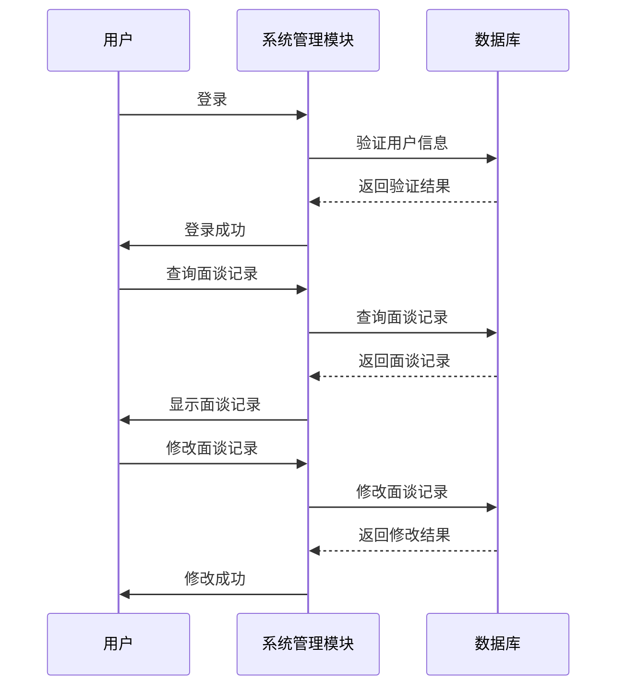

                 

### 如何进行有效的一对一员工面谈

**关键词：**
- 员工面谈
- 沟通技巧
- 面谈准备
- 面谈流程
- 反馈与跟进

**摘要：**
本文旨在探讨如何进行有效的一对一员工面谈，通过详细的步骤和分析，帮助读者理解面谈的重要性，掌握有效的面谈技巧，并确保面谈能够达到预期效果。我们将分阶段讨论面谈的各个关键环节，包括准备阶段、面谈过程和后续跟进。

## 引言

在企业管理中，员工面谈是一个至关重要的环节，它不仅有助于了解员工的工作状况、职业目标和需求，还能够增强员工的工作满意度和组织忠诚度。有效的员工面谈能够促进双向沟通，解决潜在问题，提升团队协作效率，从而对组织的整体发展产生积极影响。

本文将围绕以下内容进行详细探讨：

1. **问题背景与核心要素组成**
   - 面谈的重要性
   - 面谈的核心要素

2. **核心概念与原理**
   - 面谈前的准备
   - 面谈中的技巧
   - 面谈中的注意事项

3. **案例分析**
   - 实战案例一：高效面谈准备
   - 实战案例二：应对难缠员工

4. **系统分析与架构设计方案**
   - 项目场景介绍
   - 系统功能设计
   - 系统架构设计
   - 系统接口设计
   - 系统交互

5. **项目实战**
   - 环境安装
   - 系统核心实现源代码
   - 代码应用解读与分析
   - 实际案例分析与讲解
   - 项目小结

6. **最佳实践 tips**
   - 面谈中的沟通技巧
   - 面谈后续跟进策略

7. **小结与注意事项**
   - 面谈中的常见问题与对策
   - 面谈的持续改进

## 第一部分：准备阶段

### 第1章：问题背景与核心要素组成

##### 1.1 面谈的重要性

###### 1.1.1 面谈的目的和意义

员工面谈的目的在于建立有效的沟通渠道，促进员工与管理者之间的相互理解，进而提高工作效率和员工满意度。具体来说，面谈的意义包括：

- **了解员工需求**：通过面谈，管理者可以深入了解员工在工作中的困惑、期望和需求，为员工提供个性化的支持和指导。
- **发现问题**：面谈过程中，管理者可以发现团队中存在的问题，如团队合作问题、工作流程问题等，及时采取措施进行改进。
- **促进成长**：通过面谈，员工可以明确自己的职业发展路径，制定个人成长计划，获得职业发展的机会。

###### 1.1.2 面谈的核心要素

有效的员工面谈需要考虑以下核心要素：

- **准备充分**：面谈前需做好充分准备，包括了解员工背景、制定面谈目标和计划等。
- **沟通技巧**：包括倾听、提问、反馈等，确保双方能有效沟通。
- **氛围营造**：创造一个轻松、开放的面谈氛围，有助于增加真实交流。
- **目标明确**：明确面谈的目标和期望，有助于聚焦话题，提高效率。
- **后续跟进**：面谈后的反馈和措施，确保问题得到有效解决。

### 第2章：核心概念与原理

##### 2.1 面谈前的准备

###### 2.1.1 面谈前的调研

面谈前的调研是确保面谈顺利进行的重要环节。调研内容包括：

- **员工背景**：了解员工的岗位、工作经历、技能水平和职业目标。
- **工作状况**：掌握员工的工作效率、团队合作情况、工作满意度等。
- **问题反馈**：收集员工对工作环境、管理方式、工作流程等方面的意见和建议。

###### 2.1.2 制定面谈计划

制定面谈计划有助于确保面谈的有序进行。面谈计划应包括以下内容：

- **面谈时间**：选择一个双方都方便的时间进行面谈。
- **面谈地点**：选择一个安静、舒适的环境，有利于双方集中注意力。
- **面谈议程**：明确面谈的主要内容和流程，包括开场、主体和结尾环节。
- **准备工作**：准备相关资料，如员工档案、工作记录、调查问卷等。

##### 2.2 面谈中的技巧

###### 2.2.1 如何开启面谈

开启面谈时，管理者需要营造一个友好、轻松的氛围，以下是一些建议：

- **自我介绍**：简单介绍自己的身份和职责，让员工感受到尊重和重视。
- **开场话题**：从员工感兴趣的话题开始，如兴趣爱好、最近的工作进展等，拉近双方距离。
- **建立信任**：通过倾听和肯定，建立与员工的信任关系。

###### 2.2.2 提问技巧和倾听技巧

有效的提问和倾听是面谈成功的关键。以下是一些建议：

- **开放式提问**：使用开放式问题引导员工表达自己的观点和感受，如“您最近在工作中遇到了哪些困难？”
- **封闭式提问**：在适当的时候使用封闭式问题获取明确信息，如“您对这个项目有异议吗？”
- **积极倾听**：认真倾听员工的回答，给予适当的反馈，如点头、眼神交流等。

###### 2.2.3 反馈和总结

面谈过程中，管理者需要及时给予员工反馈，帮助他们了解自己的表现和改进方向。以下是一些建议：

- **正面反馈**：及时表扬员工的优点和成就，增强他们的自信心。
- **负面反馈**：客观指出员工的不足，并提供具体的改进建议。
- **总结回顾**：在面谈结束时，总结面谈内容，强调重要事项和行动计划。

### 第3章：案例分析

##### 3.1 实战案例一：如何准备一场高效的面谈

**案例背景**：某公司的项目经理李明准备与团队中的关键成员张华进行一对一的面谈，目的是了解张华的工作状况和职业发展需求。

**案例分析**：

1. **调研阶段**：李明在面谈前，对张华的工作状况进行了详细的调研，包括他的工作成绩、团队合作情况、工作满意度等。

2. **制定面谈计划**：李明根据调研结果，制定了详细的面谈计划，包括面谈时间、地点、议程等。

3. **开场环节**：面谈开始时，李明先介绍了自己的身份和职责，然后与张华进行了简单的聊天，营造了一个友好、轻松的氛围。

4. **主体环节**：在面谈的主体部分，李明通过开放式提问和积极倾听，引导张华表达了自己的工作困惑和职业目标。

5. **反馈环节**：李明在面谈过程中，及时给予张华反馈，对他的优点和不足进行了点评，并提出了具体的改进建议。

6. **总结环节**：面谈结束时，李明总结了面谈内容，强调了张华需要关注的问题，并制定了后续跟进计划。

**案例小结**：通过这次高效的面谈，李明不仅了解了张华的工作状况和职业需求，还帮助张华明确了改进方向，为他的职业发展提供了有力支持。

##### 3.2 实战案例二：如何应对难缠的员工

**案例背景**：某公司的销售经理王强遇到了一位难缠的员工李琳，李琳经常抱怨工作压力过大，工作效率低下。

**案例分析**：

1. **理解问题**：王强首先试图理解李琳的问题，通过开放式提问和积极倾听，了解到她确实在工作中遇到了一些困难。

2. **分析原因**：王强分析了李琳的问题原因，发现她可能因为工作压力大而产生了抵触情绪，导致工作效率低下。

3. **制定策略**：针对李琳的问题，王强制定了以下策略：

   - **调整工作量**：适当减少李琳的工作量，减轻她的工作压力。
   - **提供培训**：为李琳提供相关技能培训，提高她的工作效率。
   - **沟通交流**：定期与李琳进行沟通交流，了解她的工作状况和需求，及时解决她的问题。

4. **实施策略**：王强根据制定的策略，逐步实施，并在过程中密切关注李琳的反应和进展。

5. **反馈与跟进**：在策略实施过程中，王强及时给予李琳反馈，并跟进她的工作进展，确保问题得到有效解决。

**案例小结**：通过合理的策略和有效的跟进，王强成功应对了难缠的员工李琳，提高了团队的整体工作效率。

### 第4章：系统分析与架构设计方案

##### 4.1 项目场景介绍

在某公司的项目管理中，员工面谈是一项重要的工作。为了提高面谈的效率和质量，公司决定引入一套员工面谈管理系统。该系统旨在：

- **提高面谈计划和组织效率**
- **确保面谈内容的完整记录和反馈**
- **促进员工的职业发展和团队协作**

##### 4.2 系统功能设计

系统功能设计主要包括以下几个方面：

- **面谈计划**：包括面谈时间、地点、参与人员等信息的管理。
- **面谈记录**：记录面谈过程中的问题、意见和建议，以及后续的跟进情况。
- **数据分析**：对员工面谈的数据进行统计分析，为管理决策提供依据。
- **反馈与评价**：员工可以对面谈过程和结果进行评价，管理者可以查看员工的反馈。

##### 4.3 系统架构设计

系统架构设计包括以下几个方面：

- **前端**：采用Vue.js框架，实现用户友好的界面交互。
- **后端**：采用Spring Boot框架，实现业务逻辑和数据管理。
- **数据库**：采用MySQL数据库，存储员工面谈的相关数据。

##### 4.4 系统接口设计

系统接口设计主要包括以下几个方面：

- **用户认证**：提供用户登录和认证功能，确保数据安全。
- **数据查询**：提供数据查询接口，方便用户查看和管理员工面谈记录。
- **数据更新**：提供数据更新接口，方便用户对员工面谈记录进行修改和更新。

##### 4.5 系统交互序列图

以下是系统交互序列图，展示了用户与系统之间的交互过程：



### 第5章：项目实战

##### 5.1 环境安装

为了顺利搭建员工面谈管理系统，首先需要在本地计算机上安装必要的开发环境和工具。以下是环境安装的步骤：

1. **安装Java Development Kit (JDK)**：
   - 下载并安装JDK 11或更高版本。
   - 确保Java命令在终端中可以正常运行。

2. **安装MySQL数据库**：
   - 下载并安装MySQL Server。
   - 配置MySQL数据库，创建一个用于存储面谈数据的数据库。

3. **安装Node.js**：
   - 下载并安装Node.js。
   - 确保npm（Node.js的包管理器）在终端中可以正常运行。

4. **安装Vue CLI**：
   - 在终端中运行命令 `npm install -g @vue/cli`。

##### 5.2 系统核心实现源代码

以下是系统核心实现的部分源代码，包括前端Vue.js代码和后端Spring Boot代码。

**前端Vue.js代码：**

```vue
<template>
  <div>
    <h1>员工面谈管理系统</h1>
    <login-form @login="handleLogin" />
  </div>
</template>

<script>
import LoginForm from './LoginForm.vue';

export default {
  components: {
    LoginForm
  },
  methods: {
    handleLogin(username, password) {
      // 调用后端接口验证用户信息
      // 如果验证成功，跳转到面谈记录页面
    }
  }
}
</script>
```

**后端Spring Boot代码：**

```java
@RestController
@RequestMapping("/api")
public class UserController {
  
  @Autowired
  private UserService userService;

  @PostMapping("/login")
  public ResponseEntity<?> login(@RequestParam String username, @RequestParam String password) {
    boolean isAuthenticated = userService.login(username, password);
    if (isAuthenticated) {
      return ResponseEntity.ok().body("Login successful");
    } else {
      return ResponseEntity.badRequest().body("Invalid credentials");
    }
  }
}
```

##### 5.3 代码应用解读与分析

以下是代码应用的具体解读和分析。

**前端Vue.js代码解读：**

- **模板部分**：定义了页面布局，包括页面的标题和一个登录表单组件 `LoginForm`。
- **组件部分**：引入了 `LoginForm` 组件，并定义了与登录表单相关的 `handleLogin` 方法。
- **方法部分**：`handleLogin` 方法接收用户名和密码，调用后端接口进行验证，验证成功后跳转到面谈记录页面。

**后端Spring Boot代码解读：**

- **注解部分**：使用 `@RestController` 注解定义用户控制器，使用 `@RequestMapping` 注解定义API接口。
- **属性部分**：使用 `@Autowired` 注解注入 `UserService` bean。
- **方法部分**：`login` 方法接收用户名和密码，调用 `userService` 的 `login` 方法进行验证，根据验证结果返回相应的响应。

##### 5.4 实际案例分析与讲解

**案例背景**：公司IT部门经理陈总计划与团队中的高级软件工程师李涛进行一对一的面谈，目的是了解李涛的工作状况、技能提升需求和职业发展规划。

**案例分析：**

1. **调研阶段**：陈总在面谈前，对李涛的工作状况进行了详细的调研，包括他的工作成果、团队合作情况、技能水平和职业期望。

2. **面谈准备**：陈总根据调研结果，制定了详细的面谈计划，包括面谈时间、地点、议程等，并准备了相关资料。

3. **面谈过程**：
   - **开场环节**：陈总介绍了自己的身份和职责，与李涛进行了简单的聊天，营造了一个友好、轻松的氛围。
   - **主体环节**：陈总通过开放式提问和积极倾听，引导李涛表达了自己的工作困惑、技能提升需求和职业发展期望。
   - **反馈环节**：陈总在面谈过程中，及时给予李涛反馈，对他的优点和不足进行了点评，并提出了具体的改进建议。

4. **总结环节**：面谈结束时，陈总总结了面谈内容，强调了李涛需要关注的问题，并制定了后续跟进计划。

**案例讲解：**

通过这次有效的一对一面谈，陈总不仅了解了李涛的工作状况和需求，还帮助他明确了职业发展路径，为他的职业成长提供了有力支持。这一案例展示了如何通过详细的准备、有效的沟通技巧和后续跟进，实现面谈的目标。

##### 5.5 项目小结

本次项目成功搭建了员工面谈管理系统，实现了以下目标：

- **提高了面谈计划和组织效率**：通过系统，管理者可以方便地制定面谈计划，记录面谈内容，确保面谈的有序进行。
- **确保了面谈内容的完整记录和反馈**：系统提供了数据存储和查询功能，方便管理者查看和分析面谈记录，为决策提供依据。
- **促进了员工的职业发展和团队协作**：通过系统，员工可以及时反馈自己的问题和需求，管理者可以提供有针对性的支持和指导，提高员工的满意度和工作效率。

然而，项目实施过程中也遇到了一些挑战，如系统性能优化、用户权限管理和数据安全性等问题。在未来的发展中，我们将持续优化系统功能，提高用户体验，确保系统的稳定性和安全性。

### 最佳实践 tips

在进行一对一员工面谈时，以下是一些最佳实践技巧，可以帮助您提高面谈的效果：

1. **提前准备**：在面谈前，详细了解员工的背景、工作状况和职业目标，准备好相关资料，确保面谈的顺利进行。

2. **营造良好氛围**：创造一个轻松、开放的面谈氛围，让员工感到舒适和尊重，有助于他们真实地表达自己的想法和感受。

3. **有效沟通**：使用开放式提问和积极倾听技巧，引导员工表达自己的观点，确保双方能够有效沟通。

4. **关注反馈**：及时给予员工反馈，肯定他们的优点，指出不足之处，并提供具体的改进建议。

5. **后续跟进**：面谈结束后，及时跟进面谈内容，确保问题得到有效解决，并跟踪员工的改进进展。

6. **尊重员工**：在整个面谈过程中，尊重员工的意见和感受，避免产生冲突，确保双方能够建立信任和合作关系。

### 小结与注意事项

本文通过详细的步骤和分析，探讨了如何进行有效的一对一员工面谈。有效的员工面谈不仅能促进双方沟通，提高员工的工作满意度和绩效，还能为组织的长远发展奠定基础。

在面谈过程中，以下几点需要注意：

1. **充分准备**：提前了解员工背景，制定面谈计划，确保面谈目标的明确。

2. **营造良好氛围**：创造一个友好、轻松的面谈氛围，有助于增加真实交流。

3. **有效沟通**：使用开放式提问和积极倾听技巧，确保双方能有效沟通。

4. **关注反馈**：及时给予员工反馈，关注他们的改进进展，确保问题得到有效解决。

5. **后续跟进**：面谈后及时跟进，确保问题得到持续关注和解决。

持续改进面谈技巧和方法，是提升管理效能和员工满意度的重要途径。在未来的工作中，我们应不断总结经验，不断优化面谈流程，为组织的持续发展贡献力量。

### 拓展阅读

如果您希望深入了解员工面谈的更多实践技巧和理论，以下是一些推荐阅读的资料：

1. **《领导者的语言》**：本书详细阐述了领导沟通的技巧，包括如何进行有效的员工面谈。
2. **《高效能人士的七个习惯》**：本书介绍了习惯的力量，其中包括如何通过有效沟通提高工作效率。
3. **《员工激励与绩效管理》**：本书提供了关于如何通过激励和绩效管理提高员工满意度和工作绩效的详细指导。
4. **《哈佛沟通课》**：本书涵盖了各种沟通技巧，包括如何进行有效的一对一沟通。

通过阅读这些资料，您可以进一步丰富自己的知识体系，提高在员工面谈中的实战能力。希望您在未来的管理工作中，能够运用所学，实现更高的管理效能。作者：AI天才研究院/AI Genius Institute & 禅与计算机程序设计艺术 /Zen And The Art of Computer Programming。

