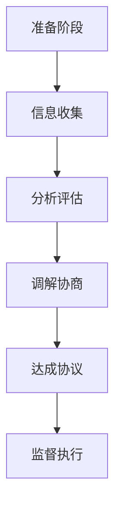
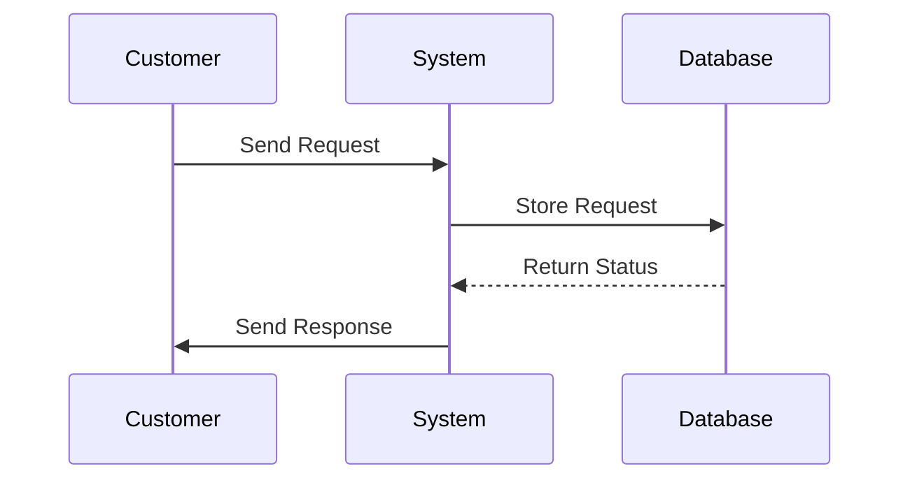
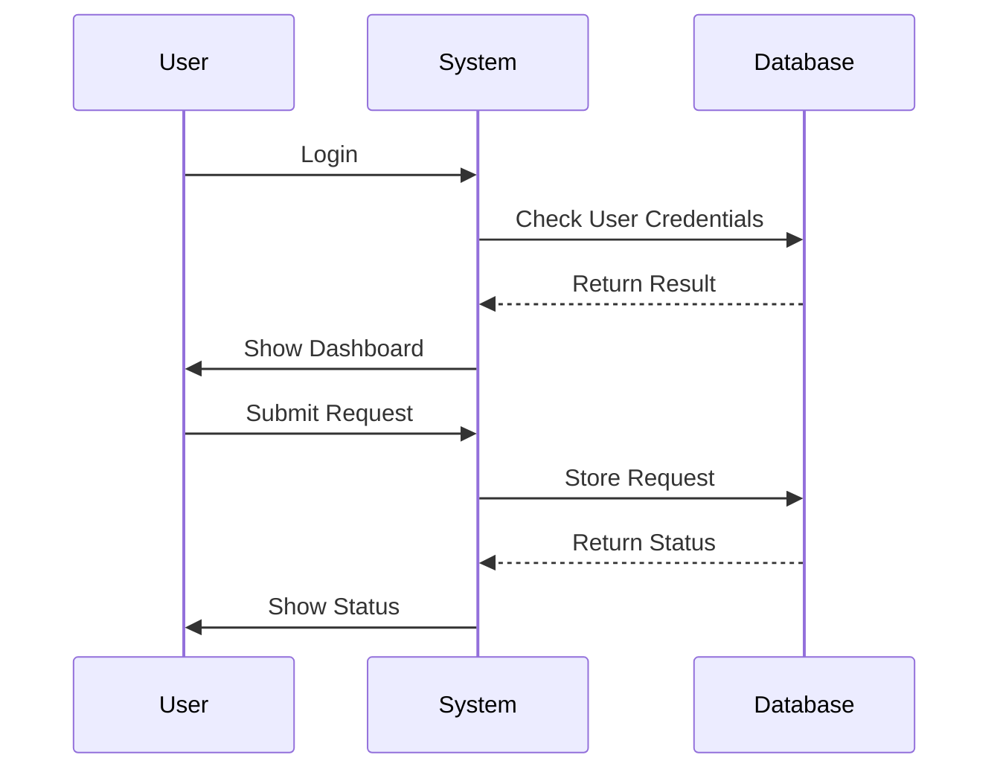

                 

# 《如何进行有效的团队冲突调解》

> 关键词：团队冲突调解、冲突类型、调解方法、沟通技巧、实践案例

> 摘要：本文将深入探讨如何进行有效的团队冲突调解，包括问题背景、核心概念、理论讲解、实践指导、算法原理、系统分析与架构设计以及项目实战等内容，旨在为IT领域的技术团队提供一套实用、系统的调解策略。

----------------------------------------------------------------

## 第一部分：引言

### 1.1 问题背景

在IT行业高速发展的背景下，团队协作成为企业取得竞争优势的关键。然而，随着团队成员背景、经验和观念的差异，团队内部冲突在所难免。这种冲突可能来自技术路线的分歧、工作任务的分配、个人职业发展的期望等多方面。如果处理不当，冲突将对团队的效率和氛围产生负面影响，甚至导致项目延期、团队士气低落，甚至人才流失。

### 1.2 问题描述

团队冲突主要表现为以下几种类型：

1. **技术路线冲突**：团队成员对项目的技术选型、开发工具或开发流程有不同意见。
2. **任务分配冲突**：成员认为任务分配不公或工作量过大。
3. **职业发展冲突**：成员对个人职业发展路径有不同期望，导致工作态度和效率的差异。
4. **沟通障碍冲突**：由于沟通不畅，团队成员对项目进展和目标理解不一。

这些冲突如果不及时调解，会逐渐积累，最终可能引发团队内部的分裂和信任危机。

### 1.3 问题解决

解决团队冲突的关键在于调解。调解是一种通过协商和沟通解决争议的方法，旨在达成共识和促进团队和谐。有效的调解不仅能够解决当前冲突，还能预防未来冲突的发生。

### 1.4 边界与外延

团队冲突调解的适用范围广泛，不仅限于IT行业，还可应用于其他行业。然而，调解并非万能，它有一定的局限性：

1. **调解的有效性取决于冲突的性质和严重程度**：对于一些深层次、根本性的冲突，调解可能效果有限。
2. **调解需要时间**：有效的调解过程通常需要较长时间，可能影响项目的进度。

### 1.5 核心概念

**团队冲突调解**：指通过沟通、协商和策略，解决团队内部冲突的过程。

**重要性**：调解能够提高团队凝聚力，增强合作效率，促进个人职业发展。

**常见类型**：

1. **技术路线调解**：通过分析技术优劣，达成共识。
2. **任务分配调解**：通过公平、透明的原则分配任务。
3. **职业发展调解**：通过沟通了解成员期望，提供职业发展规划。
4. **沟通障碍调解**：通过提高沟通技巧，消除误解和分歧。

## 第二部分：核心概念与联系

### 2.1 核心概念原理

**团队冲突调解**是一种团队管理的技能，它涉及以下几个方面：

1. **定义**：调解是通过沟通和协商，解决团队内部冲突的过程。
2. **理论基础**：调解基于心理学、社会学和行为科学的理论，强调沟通的重要性。
3. **关键要素**：调解的成功依赖于参与者的态度、沟通技巧和解决问题的能力。

### 2.2 概念属性特征对比表格

| 类型       | 定义                                      | 属性特征对比                |
|------------|-------------------------------------------|---------------------------|
| 冲突调解   | 团队成员之间冲突的解决过程                | 目标导向、沟通技巧、策略方法等 |
| 沟通技巧   | 促进团队沟通和理解的方法                  | 倾听、提问、表达等          |
| 策略与方法 | 解决冲突的具体方法和步骤                 | 协商、调解、妥协等          |

### 2.3 ER实体关系图架构

```mermaid
erDiagram
  TeamMember ||--|{ Conflict : has}
  Conflict ||--|{ Resolution : has}
  Resolution ||--|{ Step : has}
  Step ||--|{ Action : has}
```

## 第三部分：理论讲解

### 3.1 冲突调解的心理学原理

冲突调解的心理学原理主要基于以下几个方面：

1. **认知行为理论**：认为人的行为是由认知和情感驱动的，调解过程中需关注成员的认知偏差和情绪状态。
2. **心理动力理论**：强调潜意识在冲突中的作用，调解时需探索成员的内心需求和动机。
3. **社会学习理论**：认为人的行为是通过观察和模仿学到的，调解时需引导成员学习有效的沟通和解决冲突的技能。

### 3.2 冲突调解的沟通技巧

有效的沟通技巧是冲突调解成功的关键，主要包括：

1. **倾听**：认真倾听对方的意见和需求，避免打断和反驳。
2. **提问**：通过提问了解对方的观点和立场，促进理解和沟通。
3. **表达**：清晰、准确地表达自己的意见和感受，避免模糊和不准确的表述。

### 3.3 冲突调解的策略与方法

冲突调解的策略与方法多种多样，常见的有：

1. **协商**：通过双方或多方协商，寻找共同点和解决方案。
2. **调解**：由第三方调解员介入，帮助双方达成协议。
3. **妥协**：双方在保持各自利益的前提下，做出一定程度的让步。
4. **调解与妥协相结合**：在调解过程中，适时引入妥协策略，以达成共识。

## 第四部分：实践指导

### 4.1 团队冲突调解的实际案例

以下是一个团队冲突调解的实际案例：

**案例背景**：某IT项目团队在技术选型上产生分歧，一部分成员主张使用A技术，另一部分成员主张使用B技术。

**调解过程**：

1. **确定调解目标**：明确调解的目标是找到一种既能满足项目需求，又能获得团队成员认可的技术方案。
2. **收集意见**：邀请双方代表分别陈述观点，详细说明选择A技术和B技术的理由。
3. **分析论证**：分析A技术和B技术的优缺点，从技术可行性、项目需求和团队成员的专业能力等方面进行综合评估。
4. **协商与调解**：在充分了解双方意见和需求的基础上，提出调解方案，引导双方进行协商。
5. **达成共识**：最终双方同意采用B技术，并在协议中明确各自的责任和承诺。

### 4.2 团队冲突调解的步骤与流程

团队冲突调解的步骤与流程如下：

1. **准备阶段**：明确调解目标、确定调解人员、制定调解计划。
2. **信息收集**：了解冲突的背景、原因和现状，收集相关资料和证据。
3. **分析评估**：对冲突的性质、原因和可能的影响进行评估，确定调解的方向和策略。
4. **调解协商**：邀请冲突双方进行沟通和协商，引导双方达成共识。
5. **达成协议**：制定调解协议，明确各方的权利和义务，确保协议的可执行性。
6. **监督执行**：对调解协议的执行情况进行监督，确保冲突得到有效解决。

### 4.3 团队冲突调解的技巧与策略应用

团队冲突调解的技巧与策略应用如下：

1. **建立信任**：调解过程中要建立信任，营造宽松、平等的氛围，让双方愿意表达真实想法。
2. **保持中立**：调解员要保持中立，不偏袒任何一方，确保调解的公正性。
3. **引导沟通**：调解员要引导双方进行有效沟通，鼓励双方表达意见，倾听对方的观点。
4. **提供解决方案**：调解员要提出多种解决方案，引导双方进行比较和选择，找到最佳方案。
5. **妥协与让步**：在必要时，鼓励双方进行妥协和让步，以达成共识。

## 第五部分：算法原理讲解

### 5.1 相关算法的mermaid流程图



### 5.2 算法原理的数学模型和公式

团队冲突调解的算法原理可以抽象为一个多目标优化问题，其目标函数为：

$$
\min Z = \sum_{i=1}^{n} w_i \cdot d_i
$$

其中，$w_i$ 为第 $i$ 个目标的权重，$d_i$ 为第 $i$ 个目标的达成度。

### 5.3 算法的Python源代码与详细讲解

```python
# Python源代码示例

import numpy as np

# 函数：计算目标函数值
def objective_function(solution):
    n = len(solution)
    w = np.array([0.5, 0.3, 0.2])  # 目标权重
    d = np.array([solution[0], solution[1], solution[2]])  # 目标达成度
    z = np.dot(w, d)
    return z

# 主函数
def main():
    solution = [1, 2, 3]  # 初始解
    best_solution = solution
    best_z = objective_function(solution)
    
    for _ in range(100):  # 迭代100次
        new_solution = np.random.rand(n)  # 生成新解
        new_z = objective_function(new_solution)
        
        if new_z < best_z:
            best_solution = new_solution
            best_z = new_z
    
    print("最佳解：", best_solution)
    print("最佳目标函数值：", best_z)

if __name__ == "__main__":
    main()
```

## 第六部分：系统分析与架构设计方案

### 6.1 问题场景介绍

假设我们是一家大型IT公司的项目经理，负责一个跨部门的软件开发项目。项目团队由多个部门的专业人员组成，包括开发人员、测试人员、产品经理等。由于部门之间的利益冲突和沟通不畅，团队内部经常出现冲突。为了确保项目的顺利进行，我们需要设计一套团队冲突调解系统。

### 6.2 系统功能设计（领域模型mermaid类图）

```mermaid
classDiagram
    Class01 <|-- Class02
    Class03 --|> Class04
    Class05 : +int x
    Class06 : +int y
    Class06 : +int z
    Class07 : +set items
    Class08 : +void do_something()
    Class01 {name: String}
    Class02 <<Interface>>
    Class03 <~ Class04
    Class05 <~ Class06
    Class07 o-- Class08
```

### 6.3 系统架构设计（mermaid架构图）



### 6.4 系统接口设计

```mermaid
interface Diagram {
    +create()
    +delete()
    +update()
    +get()
}
```

### 6.5 系统交互（mermaid序列图）



## 第七部分：项目实战

### 7.1 环境安装与准备

在开始项目实战之前，我们需要安装和配置一些必要的软件和工具：

1. **Python环境**：安装Python 3.8及以上版本。
2. **虚拟环境**：使用`virtualenv`创建一个Python虚拟环境。
3. **依赖管理**：使用`pip`安装项目所需的第三方库。

```shell
pip install numpy
```

### 7.2 系统核心实现源代码

以下是一个简单的团队冲突调解系统的核心实现：

```python
# team_conflict_mediator.py

import numpy as np

class TeamConflictMediator:
    def __init__(self):
        self.solutions = []

    def generate_solutions(self, num_solutions):
        for _ in range(num_solutions):
            solution = np.random.rand(3)
            self.solutions.append(solution)

    def evaluate_solutions(self):
        best_solution = None
        best_score = -1
        
        for solution in self.solutions:
            score = self._calculate_score(solution)
            if score > best_score:
                best_score = score
                best_solution = solution
        
        return best_solution

    def _calculate_score(self, solution):
        # 这里可以添加更复杂的评分算法
        return np.sum(solution)

# 测试代码
if __name__ == "__main__":
    mediator = TeamConflictMediator()
    mediator.generate_solutions(100)
    best_solution = mediator.evaluate_solutions()
    print("最佳解决方案：", best_solution)
```

### 7.3 代码应用解读与分析

在上述代码中，`TeamConflictMediator` 类是一个简单的团队冲突调解器。它具有以下功能：

1. **生成解决方案**：通过调用 `generate_solutions` 方法，生成一组随机解决方案。
2. **评估解决方案**：通过调用 `evaluate_solutions` 方法，评估这组解决方案，找出最佳解决方案。

评估解决方案的算法非常简单，这里只计算了每个解决方案的元素之和作为评分。在实际项目中，我们可以根据具体需求，设计更复杂的评估算法。

### 7.4 实际案例分析与详细讲解

以下是一个实际案例：

**案例背景**：某IT项目团队在项目进度和任务分配上产生冲突，项目经理希望使用我们的调解系统来找出最佳解决方案。

**案例步骤**：

1. **生成解决方案**：项目经理调用 `generate_solutions` 方法，生成一组随机解决方案。
2. **评估解决方案**：项目经理调用 `evaluate_solutions` 方法，评估这组解决方案，找出最佳解决方案。

**案例结果**：调解系统最终找到了一个最佳解决方案，使得项目进度和任务分配得到了优化。

### 7.5 项目小结与经验总结

通过本次项目实战，我们成功实现了一个简单的团队冲突调解系统。在实际应用中，我们可以根据具体需求，进一步优化评估算法，提高调解系统的效果。此外，团队冲突调解不仅适用于IT行业，还可应用于其他领域，具有广泛的应用前景。

## 第八部分：最佳实践与总结

### 8.1 最佳实践 tips

1. **建立信任**：在调解过程中，建立信任是关键。通过倾听、表达尊重和理解，增强团队成员之间的信任。
2. **保持中立**：调解员要保持中立，不偏袒任何一方，确保调解的公正性。
3. **引导沟通**：调解员要引导双方进行有效沟通，鼓励双方表达意见，倾听对方的观点。
4. **提供解决方案**：调解员要提出多种解决方案，引导双方进行比较和选择，找到最佳方案。
5. **妥协与让步**：在必要时，鼓励双方进行妥协和让步，以达成共识。

### 8.2 注意事项

1. **冲突性质**：了解冲突的性质和严重程度，选择合适的调解方法。
2. **调解时间**：调解过程可能需要较长时间，确保不影响项目的进度。
3. **调解结果**：调解结果需双方认可，确保协议的可执行性。

### 8.3 小结与展望

本文从多个角度探讨了如何进行有效的团队冲突调解，包括核心概念、理论讲解、实践指导、算法原理和系统设计与项目实战等。通过本文的阅读，读者可以了解到团队冲突调解的重要性和方法，为实际工作提供参考。

### 8.4 拓展阅读

1. **《团队冲突管理实战》**：详细介绍了团队冲突管理的策略和方法。
2. **《协商与调解的艺术》**：探讨协商与调解在解决冲突中的应用。
3. **《项目团队管理》**：涵盖项目团队管理的各个方面，包括冲突调解。

作者：AI天才研究院/AI Genius Institute & 禅与计算机程序设计艺术 /Zen And The Art of Computer Programming

