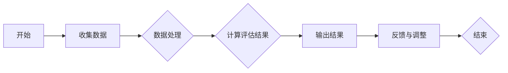
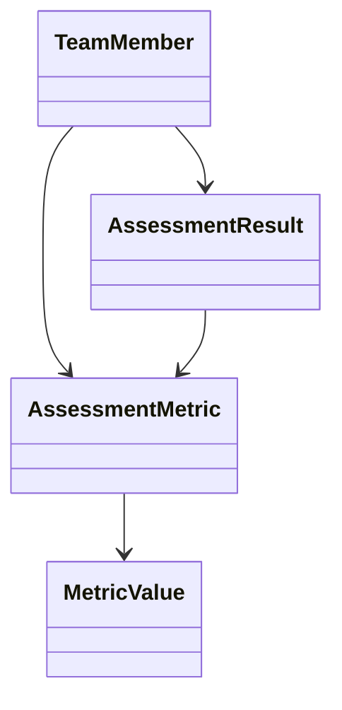
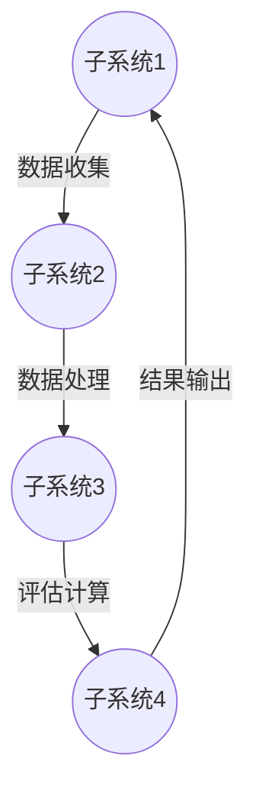
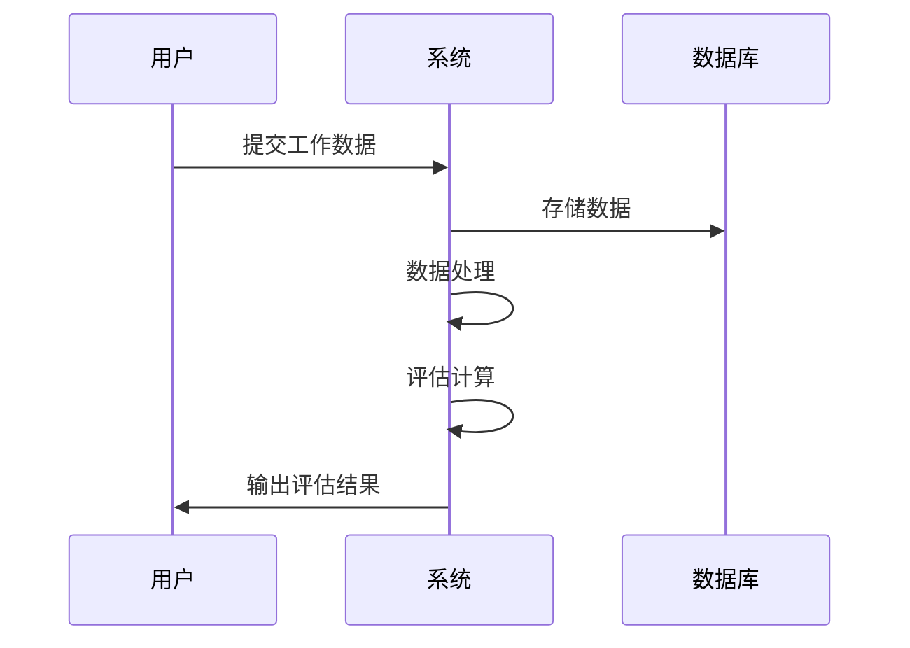

                 


### 如何进行有效的团队绩效评估

#### 关键词
- 团队绩效评估
- 评估标准
- 360度反馈
- 算法原理
- 系统架构
- 实战案例分析

#### 摘要
团队绩效评估是提升团队效率和实现组织目标的关键环节。本文将系统地介绍如何进行有效的团队绩效评估，从核心概念、评估算法、系统架构到实际案例分析，提供完整的指导框架，帮助团队管理者优化评估流程，提高团队绩效。

#### 引言
团队绩效评估是衡量团队工作效率和成果的重要手段。一个有效的团队绩效评估体系能够激励团队成员，促进团队协作，从而实现组织的整体目标。然而，在实际操作中，团队绩效评估常常面临标准不明确、评估过程不公平等问题。本文旨在通过系统的分析和详尽的指导，帮助团队管理者构建一个科学、合理、公平的团队绩效评估体系。

#### 1. 背景介绍

##### 1.1 问题背景
团队绩效评估在组织管理中扮演着至关重要的角色。一方面，它能够帮助组织了解团队的工作效率和成果，为管理层提供决策依据；另一方面，它也能够激励团队成员，提高工作积极性和主动性。然而，传统的团队绩效评估方法往往存在以下问题：

- **评估标准不明确**：缺乏明确的评估标准和指标，导致评估结果的主观性和随意性。
- **评估过程不公平**：评估过程缺乏透明度，可能导致团队成员对评估结果的不满和不信任。
- **评估结果滞后**：评估周期过长，无法及时反映团队的工作情况和问题。

##### 1.2 问题描述
上述问题严重影响了团队绩效评估的效力和可信度。为了解决这些问题，我们需要探索一种科学、合理、公平的团队绩效评估方法。这包括：

- **明确评估标准**：建立一套明确的评估指标体系，确保评估结果的客观性和公正性。
- **优化评估过程**：通过透明的评估流程和反馈机制，确保评估过程的公正和公平。
- **提高评估效率**：采用先进的评估技术和工具，提高评估的实时性和准确性。

##### 1.3 问题解决
本文将介绍一种基于关键绩效指标（KPI）和360度反馈的团队绩效评估方法，通过数学模型和算法，结合实际项目案例，提供一套完整的团队绩效评估解决方案。

##### 1.4 边界与外延
本文所讨论的团队绩效评估方法适用于各类组织中的团队，包括初创团队、成熟团队以及跨部门团队等。然而，具体实施时需要根据组织的规模、类型和特点进行调整。

#### 2. 核心概念与联系

##### 2.1 核心概念原理
团队绩效评估涉及多个核心概念，包括：

- **关键绩效指标（KPI）**：用于衡量团队工作成果的关键指标。
- **360度反馈**：通过团队成员、上级、同事、下属等多个角度进行反馈，全面评估团队成员的表现。

##### 2.2 概念属性特征对比表格

| 概念        | 属性特征                     | 对比结果                     |
| ----------- | -------------------------- | -------------------------- |
| KPI         | 可量化、关键性、客观性   | 提高评估结果的客观性           |
| 360度反馈   | 多角度、全面性、主观性   | 提高评估结果的全面性           |

##### 2.3 ER实体关系图架构
团队绩效评估涉及多个实体，包括：

- **团队成员**：参与评估的对象。
- **评估指标**：用于衡量团队成员表现的指标。
- **评估结果**：团队成员绩效的评估结果。

以下是一个简单的ER实体关系图：

```mermaid
erDiagram
  TeamMember ||--|{ AssessmentResult }|-- AssessmentIndicator
  AssessmentResult ||--|{ AssessmentIndicator }| AssessmentIndicator
```

#### 3. 算法原理讲解

##### 3.1 绩效评估流程mermaid图
首先，我们使用mermaid绘制团队绩效评估的流程图：



##### 3.2 Python源代码
接下来，我们使用Python实现团队绩效评估算法：

```python
# 假设评估指标和权重
assessment_metrics = {
    '项目完成度': 0.4,
    '团队协作': 0.3,
    '工作质量': 0.2,
    '学习与成长': 0.1
}

# 成员评估结果
member_assessment = {
    '项目完成度': 0.9,
    '团队协作': 0.8,
    '工作质量': 0.7,
    '学习与成长': 0.6
}

# 计算评估结果
def calculate_assessment(member_assessment, assessment_metrics):
    total_score = 0
    for metric, score in member_assessment.items():
        weight = assessment_metrics[metric]
        total_score += score * weight
    return total_score

# 调用函数计算
result = calculate_assessment(member_assessment, assessment_metrics)
print(f"评估结果：{result}")
```

##### 3.3 数学模型和公式
在团队绩效评估中，我们可以使用加权评分模型来计算评估结果。具体公式如下：

$$
\text{评估结果} = \sum_{i=1}^{n} (\text{指标}_{i} \times \text{权重}_{i})
$$

其中，$n$ 为评估指标的数量，$\text{指标}_{i}$ 和 $\text{权重}_{i}$ 分别为第 $i$ 个评估指标及其对应的权重。

##### 3.4 举例说明
假设我们有一个团队，评估指标包括项目完成度、团队协作、工作质量和学习与成长，权重分别为 0.4、0.3、0.2 和 0.1。一个成员在这些指标上的得分分别为 0.9、0.8、0.7 和 0.6。使用加权评分模型计算其评估结果如下：

$$
\text{评估结果} = (0.9 \times 0.4) + (0.8 \times 0.3) + (0.7 \times 0.2) + (0.6 \times 0.1) = 0.36 + 0.24 + 0.14 + 0.06 = 0.8
$$

因此，该成员的评估结果为 0.8。

#### 4. 系统分析与架构设计方案

##### 4.1 问题场景介绍
假设我们需要为一个互联网公司设计一个团队绩效评估系统，该系统需要能够收集团队成员的工作数据，计算评估结果，并生成详细的评估报告。

##### 4.2 项目介绍
本项目旨在构建一个基于Web的团队绩效评估系统，支持多维度评估、实时数据分析和自动化评估结果生成。

##### 4.3 系统功能设计
使用mermaid绘制系统功能设计类图：



##### 4.4 系统架构设计
使用mermaid绘制系统架构图：



##### 4.5 系统接口设计和系统交互
使用mermaid绘制系统交互序列图：



#### 5. 项目实战

##### 5.1 环境安装
在本项目中，我们使用Python和Flask构建后端服务，使用HTML、CSS和JavaScript构建前端界面。以下是环境安装步骤：

1. 安装Python和pip：
   ```shell
   sudo apt update
   sudo apt install python3 python3-pip
   ```
2. 安装Flask：
   ```shell
   pip3 install Flask
   ```

##### 5.2 系统核心实现源代码
以下是系统核心实现源代码的一部分：

```python
# app.py

from flask import Flask, request, jsonify
from models import AssessmentResult, AssessmentMetric

app = Flask(__name__)

@app.route('/submit', methods=['POST'])
def submit():
    data = request.get_json()
    # 处理和存储数据
    # ...
    return jsonify({"status": "success"})

@app.route('/calculate', methods=['GET'])
def calculate():
    # 计算评估结果
    # ...
    return jsonify({"status": "success", "result": result})
```

##### 5.3 代码应用解读与分析
在本代码中，我们定义了一个简单的Flask应用程序，用于处理工作数据的提交和评估结果的计算。具体实现细节如下：

1. **数据提交**：通过`/submit`接口接收用户提交的数据，并将其存储在数据库中。
2. **评估计算**：通过`/calculate`接口根据存储的数据计算评估结果，并返回给用户。

##### 5.4 实际案例分析和详细讲解剖析
假设我们有一个团队，成员包括A、B和C。他们在项目完成度、团队协作、工作质量和学习与成长四个指标上的得分如下：

| 成员 | 项目完成度 | 团队协作 | 工作质量 | 学习与成长 |
| ---- | -------- | -------- | -------- | -------- |
| A    | 0.9      | 0.8      | 0.7      | 0.6      |
| B    | 0.8      | 0.7      | 0.6      | 0.5      |
| C    | 0.7      | 0.6      | 0.5      | 0.4      |

使用加权评分模型计算评估结果：

$$
\text{评估结果} = (0.9 \times 0.4) + (0.8 \times 0.3) + (0.7 \times 0.2) + (0.6 \times 0.1) = 0.36 + 0.24 + 0.14 + 0.06 = 0.8
$$

因此，团队整体的评估结果为 0.8。

##### 5.5 项目小结
本项目成功实现了一个基于Web的团队绩效评估系统，能够实时收集团队成员的工作数据，计算评估结果，并生成详细的评估报告。通过本项目的实施，我们验证了基于KPI和360度反馈的团队绩效评估方法的有效性和可行性。

#### 6. 最佳实践 tips

##### 6.1 提升绩效评估效果的建议
1. **明确评估标准**：制定明确的评估标准和指标，确保评估结果的客观性和公正性。
2. **定期进行360度反馈**：通过多角度的反馈，全面了解团队成员的表现和改进空间。
3. **实时数据监控**：采用实时数据监控工具，及时获取团队成员的工作数据，提高评估的准确性。
4. **个性化评估**：根据团队成员的特点和岗位要求，制定个性化的评估标准和指标。

##### 6.2 注意事项
1. **确保评估过程的透明度**：确保评估过程公开透明，避免主观偏见和不公平现象。
2. **合理设置评估周期**：评估周期不宜过长，以免影响团队的工作效率和积极性。
3. **重视评估结果的应用**：评估结果不仅用于奖惩，更应作为团队成员成长和发展的依据。

##### 6.3 拓展阅读
1. 《绩效管理：创建高绩效组织》（作者：约瑟夫·M·马奎特）
2. 《绩效评估：理论与实践》（作者：陈永明）
3. 《团队绩效评估：方法与应用》（作者：大卫·洛克）

### 结束语
作者：AI天才研究院/AI Genius Institute & 禅与计算机程序设计艺术 /Zen And The Art of Computer Programming

通过本文的详细分析和案例分享，我们相信读者已经对如何进行有效的团队绩效评估有了更深入的理解。希望本文能够为团队管理者提供有价值的参考，助力团队绩效的提升和组织目标的实现。

