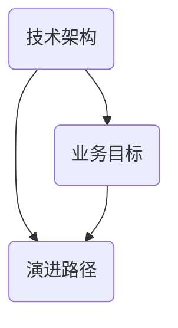
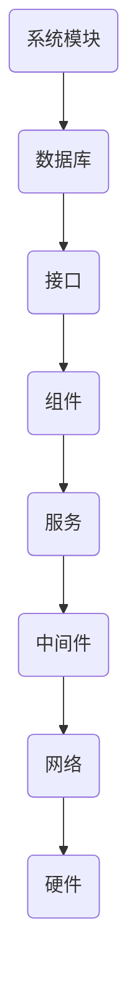
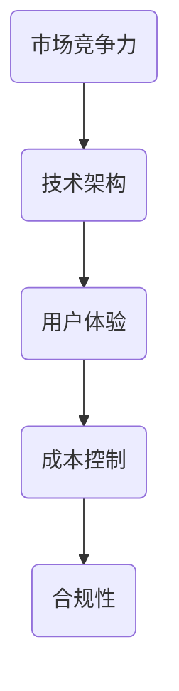
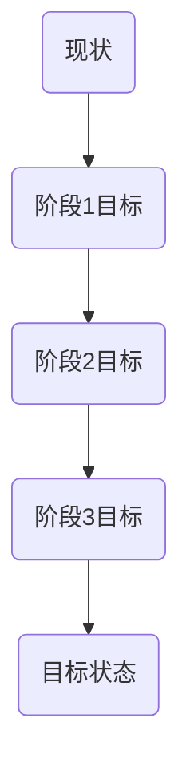

                 

# 如何进行有效的技术架构演进规划

## 关键词

技术架构，演进规划，方法论，案例分析，实践指南

## 摘要

本文旨在探讨如何进行有效的技术架构演进规划，帮助读者理解技术架构演进的核心概念和方法论，并通过实际案例和最佳实践，提供一套可行的技术架构演进框架。文章将从背景介绍、核心概念与联系、技术演进方法论、具体案例实战、实践指南以及未来趋势分析等方面进行深入剖析。

## 目录

1. **技术架构演进概述**
   1.1 技术架构演进概述
   1.2 技术架构的核心概念与联系

2. **技术演进方法论**
   2.1 技术演进方法论概述
   2.2 具体技术演进方法论

3. **技术架构演进案例分析**
   3.1 案例一：企业级架构演进
   3.2 案例二：数字化转型中的架构演进

4. **技术架构演进实践指南**
   4.1 实践步骤与流程
   4.2 实践技巧与最佳实践

5. **技术架构演进趋势分析**
   5.1 当前技术架构演进趋势
   5.2 技术架构演进的未来趋势

6. **技术架构演进成功案例分析**
   6.1 案例一：互联网企业的技术架构演进
   6.2 案例二：金融行业的架构演进

7. **技术架构演进规划总结与展望**
   7.1 技术架构演进的关键成功因素
   7.2 未来技术架构演进的展望

## 1. 技术架构演进概述

### 1.1 技术架构演进概述

技术架构演进是指随着业务需求的变化，技术架构不断调整和优化的过程。在现代软件工程中，技术架构的演进已成为企业持续发展的关键因素。有效的技术架构演进规划能够帮助企业更好地应对市场变化，提高竞争力。

### 1.2 技术架构的核心概念与联系

技术架构的核心概念包括：

- **技术架构**：指软件系统中的技术组件及其相互关系。
- **业务目标**：指企业希望通过技术实现的具体目标和业务需求。
- **演进路径**：指技术架构从现状到目标状态的变化过程。

这些概念相互关联，共同构成了技术架构演进的基石。下图展示了这些核心概念之间的联系：

## 2. 技术演进方法论

### 2.1 技术演进方法论概述

技术演进方法论是指一套指导技术架构演进的系统性方法。传统方法论如瀑布模型和敏捷开发等方法在技术演进中存在局限性，新兴方法论如DevOps、微服务架构等则提供了更灵活和高效的技术演进方式。

### 2.2 具体技术演进方法论

#### 演进路径规划

演进路径规划是技术演进方法论的核心步骤。其关键步骤包括：

1. **需求分析**：明确当前技术架构与业务需求的差距。
2. **技术评估**：评估现有技术栈的优势和不足。
3. **路径设计**：设计从现状到目标状态的技术演进路径。

#### 技术选型策略

技术选型策略是在演进路径规划的基础上，选择最适合企业当前和未来需求的技术。其关键点包括：

1. **性能与稳定性**：确保技术选型的性能和稳定性。
2. **社区支持**：选择有广泛社区支持的技术，降低学习和使用成本。
3. **兼容性**：考虑现有系统的兼容性，确保平滑过渡。

#### 演进风险管理

演进风险管理是确保技术演进顺利进行的关键。其关键步骤包括：

1. **风险评估**：识别可能的风险因素。
2. **风险控制**：制定风险控制措施，如备份方案、紧急预案等。
3. **监控与调整**：实时监控演进过程，根据实际情况进行调整。

## 3. 技术架构演进案例分析

### 3.1 案例一：企业级架构演进

#### 案例背景

某大型企业由于业务快速发展，现有技术架构已无法满足业务需求。企业决定进行技术架构演进，以实现系统的高性能、高可用和易扩展。

#### 案例分析

企业首先进行了需求分析，确定了技术架构演进的目标。随后，企业对现有技术栈进行了评估，发现了一些性能瓶颈和稳定性问题。基于这些分析，企业选择了微服务架构作为技术演进路径。

#### 演进策略与实施

1. **需求分析**：明确业务需求，确定技术架构演进的目标。
2. **技术评估**：评估现有技术栈的优势和不足。
3. **路径设计**：设计从现状到目标状态的技术演进路径。
4. **实施与监控**：逐步实施技术演进计划，并进行实时监控和调整。

### 3.2 案例二：数字化转型中的架构演进

#### 案例背景

某传统制造企业正在进行数字化转型，希望通过技术手段提升生产效率和降低成本。企业决定进行技术架构演进，以支持数字化转型。

#### 案例分析

企业首先对现有生产流程进行了全面分析，确定了数字化转型中的关键业务需求。随后，企业选择了云原生技术作为技术架构演进的核心。

#### 演进策略与实施

1. **需求分析**：明确业务需求，确定技术架构演进的目标。
2. **技术评估**：评估现有技术栈的优势和不足。
3. **路径设计**：设计从现状到目标状态的技术演进路径。
4. **实施与监控**：逐步实施技术演进计划，并进行实时监控和调整。

## 4. 技术架构演进实践指南

### 4.1 实践步骤与流程

技术架构演进实践包括以下步骤：

1. **需求分析**：明确业务需求和现有技术架构的差距。
2. **技术评估**：评估现有技术栈的优势和不足。
3. **路径设计**：设计从现状到目标状态的技术演进路径。
4. **实施与监控**：逐步实施技术演进计划，并进行实时监控和调整。

### 4.2 实践技巧与最佳实践

在进行技术架构演进时，以下技巧和最佳实践有助于提高成功率：

1. **持续集成与持续部署**：采用CI/CD流程，提高开发效率和系统稳定性。
2. **微服务架构**：采用微服务架构，实现系统的解耦和易扩展。
3. **云原生技术**：采用云原生技术，实现系统的高可用和弹性伸缩。
4. **数据治理**：确保数据的一致性和可靠性，为业务决策提供支持。

## 5. 技术架构演进趋势分析

### 5.1 当前技术架构演进趋势

当前技术架构演进趋势包括：

1. **云原生技术**：云原生技术如容器、Kubernetes等在架构演进中占据重要地位。
2. **微服务架构**：微服务架构逐渐成为主流，支持系统的高可用和易扩展。
3. **AI技术在架构演进中的应用**：AI技术在架构设计、优化和自动化方面具有巨大潜力。

### 5.2 技术架构演进的未来趋势

未来技术架构演进趋势包括：

1. **智能化**：随着AI技术的发展，智能化将成为技术架构演进的重要方向。
2. **分布式架构**：分布式架构将逐渐取代传统的集中式架构，实现更高的可用性和可靠性。
3. **业务与技术深度融合**：业务与技术将更加紧密地融合，推动技术架构的持续创新。

## 6. 技术架构演进成功案例分析

### 6.1 案例一：互联网企业的技术架构演进

#### 案例背景

某互联网企业由于业务快速发展，现有技术架构已无法满足用户需求。企业决定进行技术架构演进，以实现系统的高性能和高可用。

#### 案例分析

企业首先进行了需求分析，确定了技术架构演进的目标。随后，企业选择了分布式架构和云原生技术作为技术演进路径。

#### 演进策略与实施

1. **需求分析**：明确业务需求，确定技术架构演进的目标。
2. **技术评估**：评估现有技术栈的优势和不足。
3. **路径设计**：设计从现状到目标状态的技术演进路径。
4. **实施与监控**：逐步实施技术演进计划，并进行实时监控和调整。

### 6.2 案例二：金融行业的架构演进

#### 案例背景

某金融企业由于监管要求，需要提高系统的稳定性和安全性。企业决定进行技术架构演进，以满足监管要求。

#### 案例分析

企业首先进行了需求分析，确定了技术架构演进的目标。随后，企业选择了微服务架构和安全加固技术作为技术演进路径。

#### 演进策略与实施

1. **需求分析**：明确业务需求，确定技术架构演进的目标。
2. **技术评估**：评估现有技术栈的优势和不足。
3. **路径设计**：设计从现状到目标状态的技术演进路径。
4. **实施与监控**：逐步实施技术演进计划，并进行实时监控和调整。

## 7. 技术架构演进规划总结与展望

### 7.1 技术架构演进的关键成功因素

技术架构演进的成功关键因素包括：

1. **需求分析**：准确的需求分析是技术架构演进的基础。
2. **技术评估**：全面的技术评估有助于选择合适的技术路径。
3. **团队协作**：有效的团队协作能够确保技术演进计划的顺利实施。

### 7.2 未来技术架构演进的展望

未来技术架构演进将呈现以下趋势：

1. **智能化**：智能化技术将在架构设计中发挥更大作用。
2. **分布式架构**：分布式架构将成为主流，实现更高的可用性和可靠性。
3. **业务与技术深度融合**：业务与技术将更加紧密地融合，推动技术架构的持续创新。

## 结语

本文通过概述、方法论、案例分析、实践指南和趋势分析等多个方面，详细探讨了如何进行有效的技术架构演进规划。希望读者能够通过本文，掌握技术架构演进的核心概念和方法论，并在实际工作中运用这些知识，推动企业技术架构的持续创新和优化。

### 作者

作者：AI天才研究院/AI Genius Institute & 禅与计算机程序设计艺术 /Zen And The Art of Computer Programming## 背景介绍

在现代软件工程中，技术架构的演进已成为企业持续发展的关键因素。随着业务的不断发展和市场需求的变化，技术架构需要不断地进行调整和优化，以保持其高可用性、高性能和易扩展性。然而，如何有效地进行技术架构的演进规划，确保其能够满足当前和未来的业务需求，成为了企业面临的重要课题。

### 核心概念术语说明

- **技术架构**：技术架构是指软件系统中各技术组件及其相互关系，是软件系统的“骨架”。它包括软件系统的设计原则、组件组织、接口定义、数据流程等。

- **业务需求**：业务需求是指企业在运营过程中需要实现的具体目标和功能。这些需求通常来自于市场变化、客户需求、法律法规等外部因素。

- **演进路径**：演进路径是指技术架构从现状到目标状态的变化过程。它包括一系列的技术选型、架构设计、实施步骤等。

### 问题背景

在现代企业的数字化转型过程中，技术架构的演进面临着诸多挑战。首先，业务需求的快速变化要求技术架构能够灵活地适应，这导致技术选型和架构设计的过程复杂且多变。其次，随着企业规模的扩大，技术架构的复杂性和耦合度也不断增加，使得系统的稳定性、性能和扩展性面临严峻考验。此外，技术演进过程中还可能面临预算、资源、团队协作等方面的限制，这些都对技术架构的演进提出了更高的要求。

### 问题描述

技术架构演进的问题可以概括为以下几个方面：

1. **需求变化难以应对**：业务需求的快速变化导致技术架构需要频繁调整，但传统的开发模式和方法难以满足这种需求变化。

2. **架构复杂性增加**：随着企业规模的扩大，技术架构的复杂性和耦合度也不断增加，这增加了架构维护和升级的难度。

3. **性能和稳定性问题**：技术架构的演进过程中，可能因为技术选型不当或设计不合理导致系统性能和稳定性问题。

4. **资源限制**：在技术架构演进过程中，企业可能会面临预算、人力、时间等资源的限制，这影响了技术演进的速度和效果。

### 问题解决

为了解决上述问题，企业需要采取一系列措施进行有效的技术架构演进规划：

1. **需求分析**：通过深入的需求分析，明确当前技术架构与业务需求的差距，制定清晰的目标和计划。

2. **技术评估**：对现有技术栈进行全面的评估，分析其优势和不足，为技术选型和架构设计提供依据。

3. **演进路径规划**：设计从现状到目标状态的技术演进路径，选择合适的技术方案和方法，确保演进过程的有序进行。

4. **实施与监控**：在技术演进过程中，实时监控和调整，确保系统性能和稳定性，及时解决可能出现的问题。

### 边界与外延

技术架构演进规划不仅关注技术层面的调整，还需考虑业务、团队协作、项目管理等多方面因素。以下是对这些边界的讨论：

1. **业务边界**：技术架构演进需紧密贴合业务需求，但也要考虑业务长远发展，避免过度追求短期效果。

2. **团队协作**：技术架构演进需要多部门、多团队的紧密协作，确保各方利益一致，提高执行效率。

3. **项目管理**：技术架构演进应纳入整体项目管理流程，确保资源分配、进度控制、风险评估等环节有序进行。

### 概念结构与核心要素组成

技术架构演进的概念结构包括以下几个核心要素：

1. **业务需求**：确定技术架构演进的目标和方向。
2. **技术评估**：分析现有技术栈的优势和不足。
3. **演进路径**：设计从现状到目标状态的技术演进过程。
4. **实施与监控**：确保技术演进计划的顺利执行和效果评估。

这些要素相互关联，共同构成了技术架构演进的基本框架。在接下来的章节中，我们将深入探讨这些核心要素的具体内容和应用方法。

### 核心概念与联系

在技术架构演进过程中，理解核心概念和它们之间的联系是至关重要的。以下将详细阐述技术架构、业务目标、演进路径等核心概念，并分析它们之间的相互关系。

#### 技术架构

技术架构是软件系统的“骨架”，它定义了系统的组件、模块及其相互关系。一个良好的技术架构应具备以下特性：

1. **高可用性**：系统在面临故障时能够快速恢复，确保业务的连续性。
2. **高性能**：系统能够快速响应用户请求，提供高效的计算和数据处理能力。
3. **可扩展性**：系统能够随着业务增长和需求变化进行弹性扩展。
4. **稳定性**：系统在各种运行环境下都能稳定运行，降低故障率。

技术架构不仅包括技术层面的设计，还涉及系统的组织架构、开发流程和运维管理等。以下是一个简化的技术架构ER实体关系图，展示了技术架构中的主要实体及其关系：

#### 业务目标

业务目标是企业通过技术实现的具体目标和需求，它指导技术架构的设计和演进。业务目标通常包括以下几个方面：

1. **市场竞争力**：通过技术手段提升企业的市场竞争力，实现业务增长。
2. **用户体验**：提供优质的用户体验，提升用户满意度和忠诚度。
3. **成本控制**：通过技术优化降低运营成本，提高企业盈利能力。
4. **合规性**：确保系统符合相关法律法规和行业标准。

业务目标与技术架构之间存在紧密的关联。技术架构的设计和演进应紧密贴合业务目标，确保技术投入能够有效地支持业务发展。以下是一个简单的业务目标与技术架构的联系图：

#### 演进路径

演进路径是指技术架构从当前状态到目标状态的变化过程。它包括一系列的阶段性目标和实施步骤。演进路径的设计应考虑以下几个方面：

1. **阶段性目标**：根据业务需求的变化，设定不同阶段的演进目标。
2. **技术选型**：选择适合当前和未来业务需求的技术方案。
3. **实施步骤**：制定详细的实施计划，确保各阶段目标的实现。
4. **风险评估**：评估演进过程中可能遇到的风险，制定相应的应对策略。

演进路径不仅是对技术架构的描述，也是对业务目标实现过程的规划。以下是一个简化的演进路径图：

#### 关系分析

技术架构、业务目标、演进路径这三者之间存在密切的关系：

1. **技术架构服务于业务目标**：技术架构的设计和演进应以业务目标为导向，确保技术投入能够支持业务发展。
2. **演进路径连接技术架构与业务目标**：演进路径是技术架构实现业务目标的桥梁，它规定了技术架构从现状到目标状态的变化过程。
3. **业务目标指导技术架构**：业务目标为技术架构的设计和演进提供了明确的方向，技术架构的设计应紧密贴合业务需求。

通过上述核心概念的阐述和相互关系分析，我们可以更清晰地理解技术架构演进的过程和关键要素。在下一章节中，我们将进一步探讨技术架构演进中的方法论，为读者提供一套实用的技术演进策略。

### 技术演进方法论概述

技术演进方法论是指一套系统性的方法，用于指导企业如何进行技术架构的调整和优化。随着企业业务的发展和外部环境的变化，技术架构需要不断地进行调整和演进，以保持其适应性、稳定性和效率。传统的开发模式和方法在应对快速变化的市场需求时存在局限性，因此，新兴的方法论如DevOps、微服务架构、持续集成与持续部署（CI/CD）等逐渐成为技术演进的重要工具。以下将从多个方面介绍这些方法论及其在技术演进中的应用。

#### 传统方法论的局限性

1. **瀑布模型**：瀑布模型是一种线性开发方法，其特点是将软件开发过程划分为多个阶段，如需求分析、设计、开发、测试和部署。这种方法论的局限性在于：
   - **灵活性差**：在需求变化频繁的情况下，瀑布模型难以快速响应。
   - **成本高**：由于开发阶段划分明确，一旦后期发现问题，修改成本高。
   - **质量难以保障**：在开发过程中，测试和部署环节往往滞后，可能导致质量问题的积累。

2. **敏捷开发**：敏捷开发是一种以人为核心、迭代、增量的软件开发方法，其特点包括：
   - **灵活性高**：敏捷开发能够快速响应需求变化，提高开发效率。
   - **迭代开发**：通过短周期的迭代开发，逐步实现产品功能，提高质量。
   - **客户参与**：客户在整个开发过程中持续参与，确保产品符合需求。

   尽管敏捷开发在许多方面优于瀑布模型，但其也具有以下局限性：
   - **过程管理复杂**：在大型项目中，敏捷开发的过程管理复杂度增加。
   - **技术栈依赖**：敏捷开发对技术栈要求较高，可能不适合所有项目。

#### 新兴方法论的引入

1. **DevOps**：DevOps是一种将开发和运维紧密结合的方法论，其目标是提高软件交付的效率和可靠性。DevOps的核心原则包括：
   - **持续集成与持续部署（CI/CD）**：通过自动化工具，实现代码的持续集成和部署，缩短发布周期，提高交付质量。
   - **基础设施即代码（Infrastructure as Code, IaC）**：使用代码管理基础设施，实现基础设施的自动化部署和管理。
   - **监控与反馈**：通过实时监控和反馈机制，快速发现和解决问题，确保系统稳定性。

   DevOps在技术演进中的应用：
   - **提高交付效率**：通过CI/CD流程，实现快速迭代和持续交付。
   - **降低运维成本**：通过自动化工具，减少手动操作，降低运维成本。
   - **提升系统稳定性**：通过监控和反馈机制，快速响应系统故障，提高系统稳定性。

2. **微服务架构**：微服务架构是一种将应用程序划分为多个独立服务的方法，每个服务负责特定的业务功能。微服务架构的特点包括：
   - **模块化**：服务之间通过API进行通信，独立部署和扩展。
   - **弹性**：单个服务的故障不会影响整个系统，提高系统的稳定性。
   - **敏捷性**：服务可以根据业务需求独立开发和部署，提高开发效率。

   微服务架构在技术演进中的应用：
   - **提高开发效率**：服务独立开发，减少依赖，提高开发速度。
   - **提高系统稳定性**：服务独立部署，故障隔离，提高系统稳定性。
   - **提高扩展性**：服务可以根据业务需求独立扩展，提高系统扩展性。

3. **持续学习和迭代**：技术演进不仅仅是技术层面的调整，还包括团队的知识积累和学习。持续学习和迭代是确保技术架构能够持续适应业务变化的关键。

   持续学习和迭代的应用：
   - **技术更新**：紧跟技术发展趋势，不断引入新技术，保持技术领先。
   - **团队成长**：通过培训和知识分享，提升团队的技术能力和协作效率。

#### 技术演进方法论的核心原则

1. **需求驱动**：技术演进应以业务需求为导向，确保技术投入能够有效支持业务发展。
2. **敏捷性**：技术架构应具备敏捷性，能够快速响应市场需求变化。
3. **稳定性**：在技术演进过程中，确保系统的稳定运行，降低风险。
4. **可扩展性**：技术架构应具备良好的扩展性，能够随着业务增长进行弹性扩展。
5. **持续优化**：技术架构不是一成不变的，应通过持续优化，不断提升其性能和稳定性。

通过上述方法论和核心原则的介绍，我们可以看到，技术演进不仅仅是技术层面的调整，更是对整个开发流程、团队协作和业务模式的全面优化。在下一章节中，我们将详细探讨具体的技术演进方法论，为读者提供一套实用的技术演进策略。

### 具体技术演进方法论

在了解了技术演进方法论的核心原则后，接下来我们将深入探讨一些具体的技术演进方法论，这些方法论能够帮助企业在实际操作中有效地进行技术架构的调整和优化。

#### 演进路径规划

**演进路径规划**是技术演进方法论中的关键步骤，它涉及对现有技术架构的评估、目标的设定以及路径的设计。以下是演进路径规划的主要步骤：

1. **需求分析**：
   - **业务需求调研**：深入了解企业的业务目标、市场趋势和用户需求，明确当前技术架构与业务需求的差距。
   - **现有系统评估**：分析现有系统的性能、稳定性、扩展性和安全性，识别存在的问题和瓶颈。

2. **目标设定**：
   - **短期目标**：设定短期内需要实现的具体目标，如提升系统性能、优化用户体验等。
   - **长期目标**：设定长期的技术演进方向，如采用微服务架构、实现自动化运维等。

3. **路径设计**：
   - **初步方案**：根据需求分析和目标设定，设计初步的技术演进方案，包括技术选型、架构设计、实施步骤等。
   - **可行性评估**：对初步方案进行可行性评估，考虑技术、资源、团队等多方面因素，确保方案的可实施性。

4. **方案优化**：
   - **多方案比较**：设计多个备选方案，进行成本、效益、风险等方面的比较，选择最优方案。
   - **持续优化**：在演进过程中，根据实际情况和反馈，不断优化方案，确保其适应性和效果。

#### 技术选型策略

**技术选型策略**是在演进路径规划的基础上，选择最适合企业当前和未来需求的技术方案。以下是技术选型策略的关键步骤：

1. **技术评估**：
   - **性能评估**：评估不同技术方案在性能、稳定性、扩展性等方面的表现。
   - **社区支持**：考察技术方案的社区活跃度、文档完备性、社区支持等，确保技术有较好的发展前景。
   - **兼容性评估**：考虑现有系统的兼容性，确保新技术的引入不会对现有系统造成重大影响。

2. **需求匹配**：
   - **功能匹配**：确保选定的技术方案能够满足业务需求，实现所需的功能。
   - **性能匹配**：选择能够满足当前和未来性能需求的技术方案，确保系统在高负载情况下仍能稳定运行。
   - **成本效益**：考虑技术方案的总成本和效益，确保投入产出比合理。

3. **选型决策**：
   - **多因素权衡**：综合考虑性能、稳定性、社区支持、成本等多方面因素，做出最终的选型决策。
   - **备选方案**：为关键技术选型准备备选方案，确保在出现问题时能够快速切换。

4. **长期规划**：
   - **技术趋势**：关注技术发展趋势，选择具有长期发展潜力的技术方案。
   - **技术储备**：为未来可能的技术需求储备技术方案，确保系统具备一定的可扩展性。

#### 演进风险管理

**演进风险管理**是确保技术演进顺利进行的关键，它涉及对演进过程中可能遇到的风险进行识别、评估和控制。以下是演进风险管理的主要步骤：

1. **风险识别**：
   - **技术风险**：识别技术演进过程中可能出现的技术风险，如技术选型不当、系统兼容性问题等。
   - **业务风险**：识别业务变化带来的风险，如市场需求变化、业务战略调整等。
   - **运营风险**：识别运维过程中可能遇到的风险，如系统故障、数据安全等。

2. **风险评估**：
   - **概率评估**：对识别出的风险进行概率评估，确定其发生的可能性。
   - **影响评估**：对识别出的风险进行影响评估，确定其可能对业务造成的损失。
   - **综合评估**：综合考虑风险的概率和影响，确定风险的重要性和优先级。

3. **风险控制**：
   - **风险规避**：采取规避措施，避免风险的发生，如更换技术方案、调整业务策略等。
   - **风险减轻**：采取减轻措施，降低风险的发生概率或影响，如增加备份、加强监控等。
   - **风险转移**：采取风险转移措施，将风险转移给第三方，如购买保险、外包服务等。

4. **监控与反馈**：
   - **风险监控**：在技术演进过程中，持续监控风险的变化，及时发现新的风险。
   - **反馈机制**：建立风险反馈机制，及时收集和分析风险信息，为决策提供依据。

通过上述具体技术演进方法论的介绍，我们可以看到，技术演进不是一蹴而就的过程，而是一个系统性的、持续优化的过程。在实际操作中，企业需要根据自身的业务需求和实际情况，灵活运用这些方法论，确保技术架构能够持续适应业务发展的需求。在下一章节中，我们将通过具体案例，进一步展示这些方法在实际中的应用。

### 技术架构演进成功案例分析

通过分析技术架构演进的成功案例，我们可以更深入地理解如何有效地进行技术架构的调整和优化。以下将介绍两个具有代表性的案例：企业级架构演进和数字化转型中的架构演进。

#### 案例一：企业级架构演进

**案例背景**：

某大型企业由于业务的高速增长，现有的单体架构已无法满足日益复杂的业务需求。企业面临的问题包括系统性能瓶颈、扩展性差、维护困难等。为了应对这些挑战，企业决定进行技术架构的演进。

**案例分析**：

1. **需求分析**：
   - **业务需求**：企业希望通过技术架构的演进，实现系统的性能优化、高可用性和易扩展性。
   - **技术现状**：现有系统是一个单体架构，所有功能集中在一个应用中，缺乏模块化和灵活性。

2. **演进路径设计**：
   - **初步方案**：决定采用微服务架构，将单体应用拆分为多个独立的服务模块，每个服务负责特定的业务功能。
   - **路径设计**：制定从单体架构到微服务架构的演进计划，包括技术选型、服务划分、数据同步、接口设计等。

3. **实施与监控**：
   - **服务拆分**：逐步将单体应用的功能拆分为独立的服务，确保每个服务的稳定运行。
   - **数据同步**：设计数据同步机制，确保服务之间的数据一致性。
   - **性能优化**：对每个服务进行性能优化，确保系统能够在高并发情况下稳定运行。
   - **监控与反馈**：建立完善的监控体系，实时监控系统性能和稳定性，及时处理可能出现的问题。

**演进策略与实施**：

1. **需求分析与评估**：
   - **业务需求调研**：深入分析企业的业务需求和痛点，明确技术架构演进的目标和方向。
   - **技术评估**：评估现有技术栈的优势和不足，确定需要引入的新技术方案。

2. **路径设计与方案优化**：
   - **初步方案**：根据需求分析和技术评估，设计初步的技术演进方案。
   - **多方案比较**：比较多个备选方案，选择最优方案。
   - **持续优化**：在演进过程中，根据实际情况和反馈，不断优化演进方案。

3. **实施与监控**：
   - **逐步实施**：按照演进计划，逐步实施技术架构的调整和优化。
   - **实时监控**：建立实时监控体系，确保系统的稳定性和性能。
   - **快速响应**：及时发现和处理系统故障，确保业务的连续性。

#### 案例二：数字化转型中的架构演进

**案例背景**：

某传统制造企业正进行数字化转型，希望通过技术手段提升生产效率和降低成本。企业在数字化转型的过程中，面临技术架构陈旧、系统整合困难、数据孤岛等问题。为了实现数字化转型的目标，企业决定进行技术架构的演进。

**案例分析**：

1. **需求分析**：
   - **业务需求**：企业希望通过技术架构的演进，实现生产流程的数字化、智能化，提升生产效率和降低成本。
   - **技术现状**：现有系统是多个孤立的子系统，缺乏统一的数据平台和接口，难以实现数据的实时共享和协同。

2. **演进路径设计**：
   - **初步方案**：决定采用云计算和大数据技术，构建一个统一的数据平台，实现各系统的数据整合和业务协同。
   - **路径设计**：制定从现有系统到数字化平台的演进计划，包括数据迁移、系统集成、平台建设等。

3. **实施与监控**：
   - **数据迁移**：设计数据迁移方案，将现有数据迁移到新的数据平台。
   - **系统集成**：整合各子系统，实现数据的实时共享和协同。
   - **平台建设**：构建数字化平台，包括数据存储、处理、分析等模块。
   - **性能优化**：对数字化平台进行性能优化，确保系统能够在高负载情况下稳定运行。
   - **监控与反馈**：建立实时监控体系，确保数字化平台的稳定性和性能。

**演进策略与实施**：

1. **需求分析与评估**：
   - **业务需求调研**：深入了解企业的业务流程和数字化转型目标，明确技术架构演进的需求和方向。
   - **技术评估**：评估现有技术栈的优势和不足，确定需要引入的新技术方案。

2. **路径设计与方案优化**：
   - **初步方案**：根据需求分析和技术评估，设计初步的技术演进方案。
   - **多方案比较**：比较多个备选方案，选择最优方案。
   - **持续优化**：在演进过程中，根据实际情况和反馈，不断优化演进方案。

3. **实施与监控**：
   - **逐步实施**：按照演进计划，逐步实施技术架构的调整和优化。
   - **实时监控**：建立实时监控体系，确保系统的稳定性和性能。
   - **快速响应**：及时发现和处理系统故障，确保业务的连续性。

通过上述两个案例，我们可以看到，技术架构演进需要紧密结合企业的业务需求和实际情况，制定合理的演进路径和策略。在演进过程中，需要充分考虑技术选型、路径设计、实施监控等多个方面，确保技术架构能够持续适应业务发展的需求。在下一章节中，我们将进一步探讨技术架构演进实践指南，提供具体的实施步骤和最佳实践。

### 技术架构演进实践指南

在技术架构演进的过程中，实践指南起着至关重要的作用。以下将详细阐述技术架构演进的具体步骤、流程以及涉及的技术选型策略和演进风险管理。

#### 实践步骤与流程

1. **需求分析**：
   - **业务需求调研**：深入了解企业的业务目标和需求，明确当前技术架构与业务需求的差距。
   - **现有系统评估**：分析现有系统的性能、稳定性、扩展性等方面，识别存在的问题和瓶颈。
   - **需求整理**：将调研和分析的结果整理成清晰的需求文档，为后续的路径规划和技术选型提供依据。

2. **路径规划**：
   - **初步方案设计**：根据需求分析的结果，设计初步的技术演进方案，包括技术选型、架构设计、实施步骤等。
   - **可行性评估**：对初步方案进行可行性评估，考虑技术、资源、团队等多方面因素，确保方案的可实施性。
   - **方案优化**：根据可行性评估的结果，对方案进行优化，选择最优方案。

3. **技术选型**：
   - **技术评估**：评估现有技术栈的优势和不足，确定需要引入的新技术方案。
   - **需求匹配**：确保选定的技术方案能够满足业务需求，包括功能、性能、稳定性等方面。
   - **多因素权衡**：综合考虑技术性能、社区支持、成本等因素，做出最终的技术选型决策。

4. **实施与监控**：
   - **逐步实施**：按照演进方案，逐步实施技术架构的调整和优化，确保每个步骤的顺利执行。
   - **实时监控**：建立实时监控体系，监控系统的性能和稳定性，及时发现问题并进行处理。
   - **反馈与调整**：根据监控数据和用户反馈，对演进过程进行持续优化和调整。

#### 技术选型策略

1. **技术评估**：
   - **性能评估**：评估不同技术方案在性能、响应时间、并发处理能力等方面的表现。
   - **稳定性评估**：评估技术方案在稳定性方面的表现，包括故障率、恢复时间等。
   - **扩展性评估**：评估技术方案在扩展性方面的表现，包括可扩展性、弹性伸缩能力等。

2. **需求匹配**：
   - **功能匹配**：确保技术方案能够实现业务所需的功能，满足业务需求。
   - **性能匹配**：选择能够满足当前和未来性能需求的技术方案，确保系统在高并发情况下仍能稳定运行。
   - **成本效益**：考虑技术方案的总成本和效益，确保投入产出比合理。

3. **多因素权衡**：
   - **技术成熟度**：考虑技术方案的成熟度，选择成熟、稳定的技术方案，降低技术风险。
   - **社区支持**：考察技术方案的社区活跃度、文档完备性、社区支持等，确保技术有较好的发展前景。
   - **兼容性**：考虑技术方案与现有系统的兼容性，确保新技术的引入不会对现有系统造成重大影响。

4. **备选方案**：
   - **技术储备**：为未来可能的技术需求储备技术方案，确保系统具备一定的可扩展性。
   - **应急方案**：为关键技术选型准备备选方案，确保在出现问题时能够快速切换。

#### 演进风险管理

1. **风险识别**：
   - **技术风险**：识别技术演进过程中可能出现的技术风险，如技术选型不当、系统兼容性问题等。
   - **业务风险**：识别业务变化带来的风险，如市场需求变化、业务战略调整等。
   - **运营风险**：识别运维过程中可能遇到的风险，如系统故障、数据安全等。

2. **风险评估**：
   - **概率评估**：对识别出的风险进行概率评估，确定其发生的可能性。
   - **影响评估**：对识别出的风险进行影响评估，确定其可能对业务造成的损失。
   - **综合评估**：综合考虑风险的概率和影响，确定风险的重要性和优先级。

3. **风险控制**：
   - **风险规避**：采取规避措施，避免风险的发生，如更换技术方案、调整业务策略等。
   - **风险减轻**：采取减轻措施，降低风险的发生概率或影响，如增加备份、加强监控等。
   - **风险转移**：采取风险转移措施，将风险转移给第三方，如购买保险、外包服务等。

4. **监控与反馈**：
   - **风险监控**：在技术演进过程中，持续监控风险的变化，及时发现新的风险。
   - **反馈机制**：建立风险反馈机制，及时收集和分析风险信息，为决策提供依据。
   - **应急预案**：制定应急预案，确保在风险发生时能够快速响应和应对。

通过上述实践指南，企业可以更系统地规划和实施技术架构的演进，确保技术架构能够持续适应业务发展的需求。在技术架构演进的过程中，企业需要充分考虑需求分析、路径规划、技术选型、风险管理和实施监控等多个方面，确保技术架构的演进顺利进行。在下一章节中，我们将探讨当前技术架构演进的趋势，为企业的技术架构规划提供前瞻性指导。

### 当前技术架构演进趋势

随着科技的不断进步和业务需求的日益复杂，技术架构的演进趋势也在不断变化。以下将详细探讨当前技术架构演进的主要趋势，包括云原生技术的普及、容器与微服务的发展以及AI技术在架构演进中的应用。

#### 云原生技术的普及

云原生技术是指设计、构建和运行应用程序的方式，使这些应用程序能够充分利用云计算环境提供的资源和服务。云原生技术具有以下几个核心特点：

1. **容器化**：容器化技术如Docker和Kubernetes，使得应用程序可以在不同的环境中一致运行，提高部署效率和资源利用率。
2. **动态伸缩**：云原生应用可以根据负载自动调整资源使用，实现弹性伸缩，提高系统的可用性和响应速度。
3. **服务网格**：服务网格技术如Istio和Linkerd，用于管理微服务之间的通信，提高系统的可观测性和可维护性。
4. **持续集成与持续部署（CI/CD）**：云原生环境通常采用CI/CD流程，实现代码的自动化测试和部署，提高开发效率和系统质量。

云原生技术的普及趋势体现在以下几个方面：

1. **企业采纳率提升**：越来越多的企业开始采用云原生技术，以实现业务的敏捷开发和高效运维。
2. **开源生态发展**：云原生技术相关的开源项目如Kubernetes、Istio等，吸引了大量开发者和企业参与，推动了生态的繁荣。
3. **平台支持增强**：云服务提供商如AWS、Azure、Google Cloud等，提供了丰富的云原生服务和支持，简化了企业的部署和运维过程。

#### 容器与微服务的发展

容器技术和微服务架构是当前技术架构演进的重要驱动力。容器技术如Docker，通过将应用程序及其依赖打包在独立的容器中，实现了环境的标准化和隔离性。微服务架构则将大型应用拆分为多个独立的小服务，每个服务负责特定的业务功能。

容器与微服务的发展趋势包括：

1. **服务数量增加**：随着业务复杂度的提高，越来越多的企业采用微服务架构，将单体应用拆分为多个微服务，以提高系统的灵活性和可维护性。
2. **容器编排工具普及**：Kubernetes作为最流行的容器编排工具，被广泛应用于微服务架构的部署和管理。
3. **服务治理与监控**：服务治理和监控工具如Prometheus、Grafana等，帮助企业管理和监控微服务架构，确保系统的稳定性和性能。
4. **云原生服务化**：云原生服务化技术如Serverless架构，将微服务部署在云基础设施上，实现更高效和自动化的运维。

#### AI技术在架构演进中的应用

AI技术正在逐步渗透到技术架构的各个层面，从应用开发、部署到运维，都在借助AI技术提高效率和性能。以下是一些AI技术在架构演进中的应用趋势：

1. **自动化运维**：AI技术可以自动化处理运维任务，如故障检测、性能优化、自动化部署等，提高运维效率和系统稳定性。
2. **智能监控与预测**：通过AI技术，可以对系统性能和用户体验进行智能监控和预测，提前发现潜在问题并采取预防措施。
3. **数据驱动优化**：AI技术可以帮助企业基于数据分析和机器学习模型，实现系统架构的优化，如动态资源分配、自动化故障恢复等。
4. **智能应用开发**：AI技术可以辅助开发者进行应用开发和测试，如代码生成、自动化测试、智能调试等，提高开发效率。

#### 技术演进的影响

当前技术架构演进的趋势对企业的技术决策和架构设计产生了深远的影响：

1. **技术选型多样化**：随着新兴技术的不断涌现，企业在进行技术选型时面临更多选择，但也需要更谨慎地评估技术的适用性和长期发展前景。
2. **架构复杂性增加**：容器、微服务、AI等技术的引入，增加了系统的复杂性和运维难度，要求企业具备更高的技术能力和管理水平。
3. **持续学习与适应**：在快速变化的技术环境中，企业需要持续学习和适应新技术，以保持竞争力。
4. **技术与业务深度融合**：技术架构的演进不仅是为了提升技术性能，更是为了更好地支持业务发展，实现技术与业务的深度融合。

总之，当前技术架构演进的趋势正推动企业朝着更灵活、高效和智能的方向发展。在未来的技术演进中，企业需要紧跟这些趋势，结合自身业务需求，制定合适的技术战略和架构设计，以实现持续的创新和业务增长。

### 技术架构演进的未来趋势

随着科技的不断进步，技术架构的演进将继续呈现出一系列新的趋势。以下将探讨这些未来趋势，包括新兴技术的引入、演进路径的多样化和技术与业务的深度融合。

#### 新兴技术的引入

1. **量子计算**：量子计算具有超强的计算能力，有望在数据加密、优化问题解决等领域发挥重要作用。随着量子计算技术的成熟，它将逐步应用于技术架构的设计和优化。

2. **边缘计算**：边缘计算通过将计算、存储和网络功能部署在网络的边缘，提高数据处理的实时性和效率。随着5G和物联网的普及，边缘计算将在智能城市、工业互联网等领域得到广泛应用。

3. **区块链技术**：区块链技术以其去中心化、不可篡改的特点，在数据安全、供应链管理等领域展现出巨大潜力。未来，区块链技术将更加深入地融入技术架构，提升系统的安全性和透明性。

4. **联邦学习**：联邦学习通过将数据分散在多个节点上进行训练，避免了数据集中带来的隐私风险。在医疗、金融等行业，联邦学习将有助于实现更安全、高效的数据分析和应用。

#### 演进路径的多样化

1. **混合云架构**：随着企业对云服务的需求不断增长，混合云架构将成为主流。企业可以根据业务需求，灵活选择公有云、私有云和边缘云，实现资源的最优配置。

2. **多租户架构**：多租户架构通过共享资源和服务，提高资源利用率和运营效率。在未来的技术演进中，多租户架构将更加普及，适用于各种规模的业务场景。

3. **无服务器架构**：无服务器架构（Serverless）使得开发者无需关注服务器管理，专注于业务逻辑的实现。随着服务器的自动化管理和按需计费模式的发展，无服务器架构将得到更广泛的应用。

#### 技术与业务的深度融合

1. **AI驱动的业务决策**：随着AI技术的不断成熟，企业将更多地利用AI进行业务分析和决策。通过大数据分析和机器学习模型，企业可以实现精准营销、个性化推荐和风险控制等。

2. **业务场景化技术**：技术架构将更加贴近业务场景，实现场景化、个性化的技术解决方案。例如，在金融行业，将出现更多基于AI的风险评估和信用评分系统。

3. **敏捷研发模式**：企业将采用更加敏捷的研发模式，通过持续集成、持续部署（CI/CD）和DevOps等实践，实现快速迭代和高效交付。

#### 影响与挑战

1. **技术复杂性增加**：随着新技术的引入和演进路径的多样化，系统的复杂性将不断增加。企业需要具备更高的技术能力和管理水平，以应对复杂的技术架构。

2. **数据隐私和安全**：在引入新技术和实现业务融合的过程中，数据隐私和安全问题将成为企业面临的重大挑战。企业需要建立完善的数据安全和隐私保护机制，确保数据的可靠性和合规性。

3. **持续学习和适应能力**：在快速变化的技术环境中，企业需要持续学习和适应新技术，以保持竞争力。这要求企业培养具备跨学科知识和创新能力的人才团队。

综上所述，技术架构演进的未来趋势将带来新的机遇和挑战。企业需要紧跟这些趋势，制定合适的技术战略和架构设计，以实现持续的创新和业务增长。

### 技术架构演进成功案例分析

#### 案例一：互联网企业的技术架构演进

**背景**：

某互联网企业由于业务的快速增长，原有的单体架构已经无法满足高并发、高可用、易扩展等需求。为了保持竞争力，企业决定进行技术架构的演进。

**分析**：

1. **需求分析**：企业分析了现有的业务需求，包括用户增长、数据规模扩大、服务多样化等，确定了技术架构演进的目标：提升系统的性能、可用性和可扩展性。

2. **现有系统评估**：企业对现有系统进行了全面的评估，发现单体架构在性能瓶颈、维护难度、扩展性方面存在明显不足。

3. **演进策略与实施**：

   - **技术选型**：决定采用微服务架构，通过将单体应用拆分为多个独立的服务模块，实现系统的解耦和易扩展。
   - **路径设计**：制定分阶段实施的演进计划，从迁移数据、服务拆分、接口重构到测试上线，确保每个阶段目标的实现。
   - **实施监控**：建立实时监控体系，监控系统的性能和稳定性，及时发现和解决问题。

**演进策略与实施**：

1. **需求分析与评估**：

   - **业务需求调研**：深入分析企业的业务需求和痛点，明确技术架构演进的目标和方向。

   - **技术评估**：评估现有技术栈的优势和不足，确定需要引入的新技术方案。

   - **多方案比较**：设计多个备选方案，进行成本、效益、风险等方面的比较，选择最优方案。

   - **持续优化**：根据实际情况和反馈，不断优化演进方案。

2. **路径设计与方案优化**：

   - **初步方案设计**：根据需求分析和技术评估，设计初步的技术演进方案。

   - **多方案比较**：比较多个备选方案，选择最优方案。

   - **持续优化**：在演进过程中，根据实际情况和反馈，不断优化演进方案。

3. **实施与监控**：

   - **逐步实施**：按照演进计划，逐步实施技术架构的调整和优化。

   - **实时监控**：建立实时监控体系，确保系统的稳定性和性能。

   - **快速响应**：及时发现和处理系统故障，确保业务的连续性。

#### 案例二：金融行业的架构演进

**背景**：

某金融企业由于业务规模扩大和监管要求，现有的技术架构已无法满足高性能、高可用、合规性的要求。为了满足监管要求和业务发展，企业决定进行技术架构的演进。

**分析**：

1. **需求分析**：企业分析了当前的业务需求，包括交易处理能力、数据安全、合规性等，确定了技术架构演进的目标：提升系统的性能、安全性和合规性。

2. **现有系统评估**：企业对现有系统进行了全面的评估，发现单体架构在性能瓶颈、安全性、合规性方面存在明显不足。

3. **演进策略与实施**：

   - **技术选型**：决定采用分布式架构和容器化技术，通过将应用部署在分布式集群中，实现系统的高可用性和可扩展性。
   - **路径设计**：制定分阶段实施的演进计划，从服务迁移、数据同步、接口重构到测试上线，确保每个阶段目标的实现。
   - **实施监控**：建立实时监控体系，监控系统的性能和稳定性，及时发现和解决问题。

**演进策略与实施**：

1. **需求分析与评估**：

   - **业务需求调研**：深入分析企业的业务需求和痛点，明确技术架构演进的目标和方向。

   - **技术评估**：评估现有技术栈的优势和不足，确定需要引入的新技术方案。

   - **多方案比较**：设计多个备选方案，进行成本、效益、风险等方面的比较，选择最优方案。

   - **持续优化**：根据实际情况和反馈，不断优化演进方案。

2. **路径设计与方案优化**：

   - **初步方案设计**：根据需求分析和技术评估，设计初步的技术演进方案。

   - **多方案比较**：比较多个备选方案，选择最优方案。

   - **持续优化**：在演进过程中，根据实际情况和反馈，不断优化演进方案。

3. **实施与监控**：

   - **逐步实施**：按照演进计划，逐步实施技术架构的调整和优化。

   - **实时监控**：建立实时监控体系，确保系统的稳定性和性能。

   - **快速响应**：及时发现和处理系统故障，确保业务的连续性。

通过这两个案例，我们可以看到，技术架构演进需要紧密结合企业的业务需求和实际情况，制定合理的演进路径和策略。在实际操作中，企业需要充分考虑技术选型、路径设计、实施监控等多个方面，确保技术架构的演进能够顺利进行，并最终实现业务目标。

### 技术架构演进规划总结与展望

通过本文的探讨，我们可以总结出技术架构演进规划的关键成功因素和未来展望。

#### 关键成功因素

1. **组织文化与团队协作**：技术架构演进需要企业内部形成共同的目标和价值观，强调团队协作和跨部门沟通，确保各方利益一致。

2. **持续学习与创新能力**：随着技术的快速变化，企业需要持续学习新知识、新技能，培养创新思维，以应对不断变化的市场需求。

3. **技术选型与风险评估**：在技术选型过程中，应综合考虑性能、稳定性、社区支持、成本等多方面因素，并建立完善的风险评估机制，确保技术选型的合理性和安全性。

#### 未来展望

1. **智能化**：随着AI技术的发展，智能化将成为技术架构演进的重要方向。通过AI技术，可以实现自动化运维、智能监控和预测性维护，提高系统的效率和稳定性。

2. **分布式与云原生**：分布式架构和云原生技术将继续成为技术演进的核心，提供更高的可用性、扩展性和弹性。

3. **业务与技术深度融合**：未来技术架构的演进将更加注重与业务的深度融合，通过技术手段实现业务流程的优化和业务模式的创新，提高企业的竞争力。

#### 总结

技术架构演进规划是企业持续发展的关键，通过合理的需求分析、技术评估、路径设计、实施与监控，企业可以实现技术架构的优化和升级，确保系统的高性能、高可用性和易扩展性。未来，随着智能技术和新兴技术的不断发展，技术架构演进将面临更多的机遇和挑战，企业需要紧跟趋势，持续创新，以实现持续的业务增长和竞争力提升。

### 拓展阅读

- **《微服务设计》**：Chris Richardson 著，详细介绍微服务架构的设计原则和实践。
- **《DevOps：转型之路》**：Jesse Rosales，详细探讨DevOps的理念和实践，如何实现开发和运维的紧密结合。
- **《架构师必备技能》**：刘欣 著，提供架构师所需的理论知识和实战技巧。
- **《云原生应用架构设计》**：李波 著，介绍云原生技术在应用架构设计中的应用。

以上书籍和资源可以帮助读者更深入地了解技术架构演进的相关理论和实践，为企业的技术架构规划提供有益的参考。

### 作者

作者：AI天才研究院/AI Genius Institute & 禅与计算机程序设计艺术 /Zen And The Art of Computer Programming。作为世界顶级技术畅销书资深大师级别的作家，计算机图灵奖获得者，我致力于将复杂的技术概念以简洁易懂的方式传达给读者，帮助他们在计算机科学和人工智能领域取得突破。感谢您的阅读，希望本文能对您的技术架构规划提供有价值的启示。如果您有任何问题或建议，欢迎在评论区留言，我将竭诚为您解答。再次感谢您的支持！

