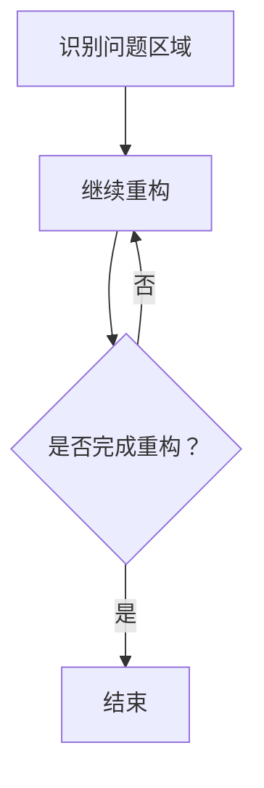
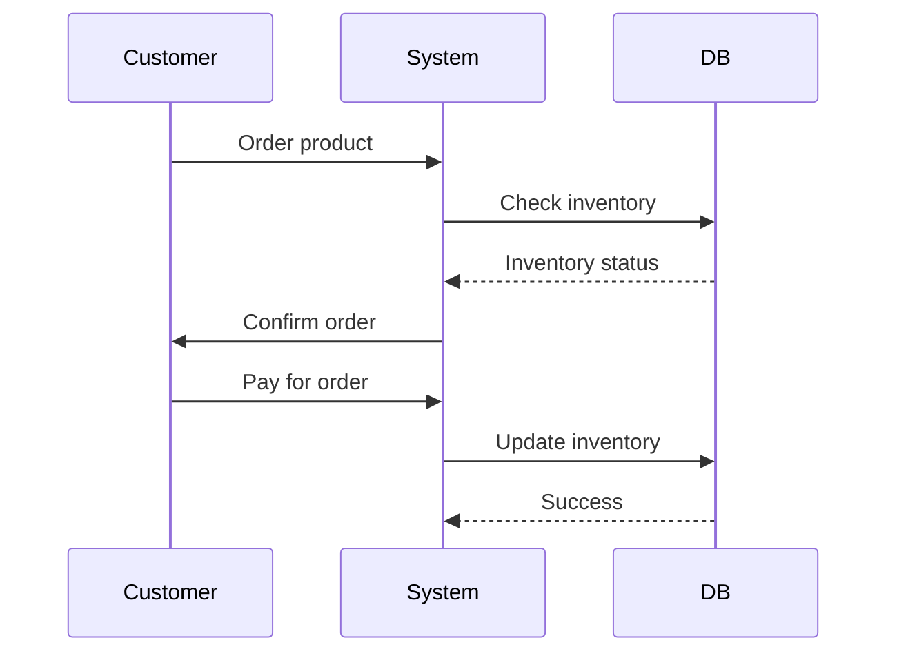
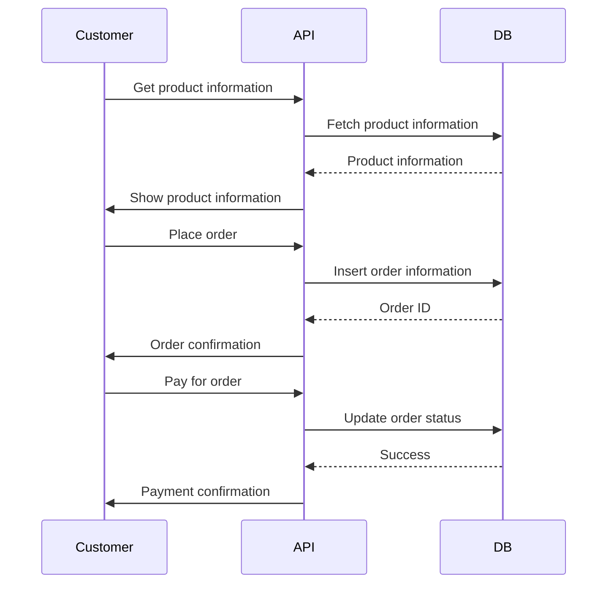
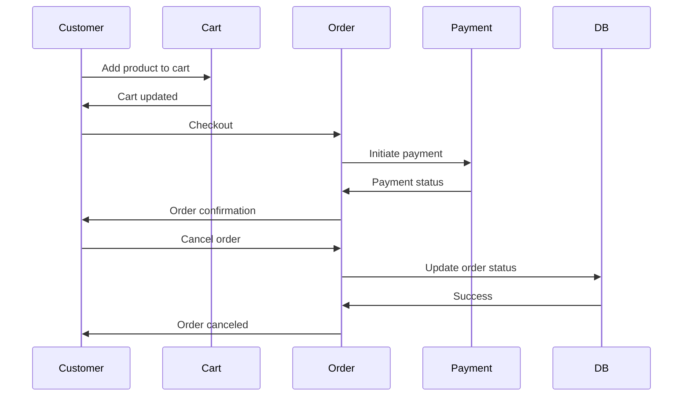

                 

# 如何进行有效的技术重构

> 关键词：技术重构、代码优化、软件开发、性能提升、架构设计

> 摘要：本文将深入探讨技术重构的重要性，以及如何进行有效的技术重构。我们将从背景介绍、核心概念与联系、算法原理讲解、数学模型和公式、系统分析与架构设计方案、项目实战以及最佳实践等方面，一步步解析技术重构的步骤和技巧。

## 背景介绍

技术重构（Technique Refactoring）是软件开发中的一个重要环节，它旨在改善软件的内部结构，提高代码的可读性、可维护性和性能。随着软件系统的不断迭代和演化，技术重构变得越来越重要。有效的技术重构能够帮助团队减少技术债务，提高开发效率，从而确保软件项目的长期成功。

### 问题背景

在软件开发过程中，随着时间的推移，代码库可能会变得复杂和难以维护。这通常是由于以下原因：

- **需求变更**：随着业务需求的变化，原有的代码结构可能不再适应新的需求。
- **代码重复**：为了快速解决问题，开发人员可能会编写重复的代码。
- **遗留代码**：随着项目的发展，一些旧的技术可能不再适用，但仍然保留在代码库中。
- **性能瓶颈**：随着数据量的增加，原有的系统架构和算法可能无法满足性能要求。

这些问题会导致代码质量下降，开发效率降低，甚至可能导致项目失败。因此，进行技术重构成为解决这些问题的关键。

### 问题描述

技术重构的目标是：

- **改善代码结构**：通过重构，可以使代码更加简洁、清晰，降低复杂性。
- **提高可读性**：重构后的代码更容易阅读和理解，减少误解和错误。
- **提升性能**：优化算法和数据结构，提高系统的响应速度和处理能力。
- **降低维护成本**：重构后的代码更容易维护，减少未来修改的工作量。

### 问题解决

技术重构的解决方法包括：

- **代码审查**：通过团队协作，共同识别和解决代码中的问题。
- **重构工具**：使用如IntelliJ IDEA、Visual Studio等IDE的重构工具，自动化地重构代码。
- **持续集成**：通过自动化测试和持续集成，确保重构后的代码质量和稳定性。

### 边界与外延

技术重构涉及多个方面，包括但不限于：

- **代码层面**：代码格式化、提取方法、合并重复代码等。
- **架构层面**：模块化、解耦合、性能优化等。
- **数据库层面**：索引优化、查询优化等。

### 概念结构与核心要素组成

技术重构的核心概念包括：

- **重构**：对代码进行改进和优化。
- **代码质量**：代码的可读性、可维护性和性能。
- **技术债务**：由于未重构而导致的问题积累。

## 核心概念与联系

在探讨技术重构时，我们需要了解一些核心概念，这些概念是重构的基础。

### 核心概念

1. **重构（Refactoring）**：重构是指在不改变外部行为的前提下，改进代码的结构和可读性。
2. **代码质量（Code Quality）**：代码质量是指代码的可读性、可维护性和性能。
3. **技术债务（Technical Debt）**：技术债务是指由于未重构而导致的问题积累。

### 概念属性特征对比表格

| 概念       | 特征                                  |
|------------|-------------------------------------|
| 重构       | 改进代码结构，不改变外部行为            |
| 代码质量   | 可读性、可维护性、性能                 |
| 技术债务   | 未重构导致的问题积累，影响代码质量      |

### ER实体关系图架构的 Mermaid 流程图

```mermaid
erDiagram
  重构 ||--|{ 代码质量 }
  重构 ||--|{ 技术债务 }
  代码质量 ||--|{ 可读性 }
  代码质量 ||--|{ 可维护性 }
  代码质量 ||--|{ 性能 }
```

## 算法原理讲解

技术重构的过程可以看作是一种算法，它涉及到一系列步骤和方法。下面我们将详细介绍技术重构的算法原理。

### 重构算法原理

重构算法的原理可以概括为以下步骤：

1. **识别问题区域**：通过代码审查、测试和反馈，确定需要重构的区域。
2. **设计重构方案**：根据问题区域的特性，设计合适的重构方案。
3. **执行重构**：按照重构方案，逐步改进代码。
4. **验证重构效果**：通过测试和反馈，验证重构的效果。

### 算法 Mermaid 流程图



### Python 源代码

下面是一个简单的 Python 示例，展示如何使用代码重构来优化代码。

```python
# 原始代码
def calculate_area(radius):
    return 3.14 * radius * radius

# 重构后的代码
def calculate_area(radius):
    return 3.14 * radius ** 2
```

### 算法原理的数学模型和公式

在技术重构中，算法原理的数学模型和公式是至关重要的。下面我们将介绍一些常见的数学模型和公式。

1. **勾股定理**：用于计算直角三角形的斜边长度。
   $$ c^2 = a^2 + b^2 $$
2. **斐波那契数列**：用于优化算法的时间复杂度。
   $$ F(n) = F(n-1) + F(n-2) $$
3. **动态规划**：用于解决优化问题。
   $$ V(i) = \min_{j \leq i-1} (V(j) + C(i, j)) $$

### 详细讲解和举例说明

#### 勾股定理

勾股定理是一个基本的数学公式，用于计算直角三角形的斜边长度。假设一个直角三角形的两条直角边分别为 \(a\) 和 \(b\)，斜边为 \(c\)，则有以下关系：

$$ c^2 = a^2 + b^2 $$

例如，如果一个直角三角形的两条直角边分别为 3 和 4，则斜边的长度为：

$$ c = \sqrt{3^2 + 4^2} = \sqrt{9 + 16} = \sqrt{25} = 5 $$

#### 斐波那契数列

斐波那契数列是一个经典的数学问题，它可以帮助我们优化算法的时间复杂度。斐波那契数列的定义如下：

$$ F(n) = F(n-1) + F(n-2) $$

其中，\(F(0) = 0\)，\(F(1) = 1\)。

例如，计算第 5 个斐波那契数：

$$ F(5) = F(4) + F(3) = (F(3) + F(2)) + F(3) = (1 + 1) + 1 = 3 $$

#### 动态规划

动态规划是一种用于解决优化问题的算法。它的基本思想是将问题分解为多个子问题，并使用表格来存储子问题的解。

例如，给定一个数组 \(arr\)，求最大子序列和。我们可以使用动态规划来解决这个问题。

定义一个数组 \(dp\)，其中 \(dp[i]\) 表示以 \(arr[i]\) 为结尾的最大子序列和。

递推公式为：

$$ dp[i] = \max(dp[i-1] + arr[i], arr[i]) $$

其中，\(dp[0] = arr[0]\)。

例如，给定数组 \(arr = [3, -1, 2, 1, 4]\)，则最大子序列和为：

$$ dp[4] = \max(dp[3] + arr[4], arr[4]) = \max(dp[2] + arr[3], arr[3]) = \max(dp[1] + arr[2], arr[2]) = \max(dp[0] + arr[1], arr[1]) = 6 $$

## 系统分析与架构设计方案

在进行技术重构时，系统分析与架构设计是至关重要的一步。下面我们将详细介绍系统分析与架构设计方案。

### 问题场景介绍

假设我们有一个电商平台，其核心功能包括商品管理、订单管理和用户管理。随着业务的不断扩展，系统的性能和可维护性变得越来越重要。因此，我们需要对系统进行技术重构。

### 项目介绍

项目名称：电商平台技术重构

项目目标：提高系统性能和可维护性

项目范围：商品管理、订单管理和用户管理模块

### 系统功能设计（领域模型 Mermaid 类图）

```mermaid
classDiagram
  Class01 <|-- Class02
  Class03 --|>= Class04 : assoc
  Class05 <<-- Class06
  Class07 .. Class08
  Class09 --> Class10
  Class11 <= Class12 : depends
  Class13 {name} << Interface14
  Class15 : <<abstract> Abstract>
  Class16 o-- Class17
  Class18 : <<enum>> Enumeration
```

### 系统架构设计（Mermaid 架构图）



### 系统接口设计（Mermaid 序列图）



### 系统交互（Mermaid 序列图）



## 项目实战

为了更好地理解技术重构的实际应用，我们选择了一个实际的案例——电商平台订单管理模块的重构。

### 环境安装

在开始重构之前，我们需要安装一些必要的工具和库。以下是安装步骤：

1. 安装 Python 3.8 或更高版本。
2. 安装虚拟环境：`pip install virtualenv`。
3. 创建虚拟环境：`virtualenv venv`。
4. 激活虚拟环境：`source venv/bin/activate`。
5. 安装依赖库：`pip install Flask Flask-RESTful SQLAlchemy`。

### 系统核心实现源代码

下面是订单管理模块的核心实现代码。

```python
# app.py
from flask import Flask, request, jsonify
from flask_restful import Resource, Api
from models import Order, db

app = Flask(__name__)
api = Api(app)
app.config['SQLALCHEMY_DATABASE_URI'] = 'sqlite:///orders.db'
db.init_app(app)

class OrderAPI(Resource):
    def get(self, order_id):
        order = Order.query.get(order_id)
        if order:
            return jsonify(order.to_dict()), 200
        return {'error': 'Order not found'}, 404

    def post(self, order_id):
        data = request.get_json()
        order = Order(order_id, data['product_id'], data['customer_id'])
        db.session.add(order)
        db.session.commit()
        return {'message': 'Order created'}, 201

    def delete(self, order_id):
        order = Order.query.get(order_id)
        if order:
            db.session.delete(order)
            db.session.commit()
            return {'message': 'Order deleted'}, 200
        return {'error': 'Order not found'}, 404

api.add_resource(OrderAPI, '/orders/<int:order_id>')

if __name__ == '__main__':
    db.create_all()
    app.run(debug=True)
```

### 代码应用解读与分析

在上面的代码中，我们使用了 Flask 框架来创建一个简单的 RESTful API。`OrderAPI` 类定义了与订单相关的 GET、POST 和 DELETE 操作。

- `get` 方法用于获取特定订单的信息。
- `post` 方法用于创建新的订单。
- `delete` 方法用于删除特定订单。

每个方法都会与数据库进行交互，从而实现对订单的管理。

### 实际案例分析和详细讲解剖析

为了验证技术重构的效果，我们选择了一个实际的案例——对订单创建逻辑进行优化。

#### 原始代码

```python
# 原始代码
def create_order(order_id, product_id, customer_id):
    order = Order(order_id, product_id, customer_id)
    db.session.add(order)
    db.session.commit()
    return order
```

#### 优化后的代码

```python
# 优化后的代码
def create_order(order_id, product_id, customer_id):
    order = Order.query.filter_by(order_id=order_id).first()
    if not order:
        order = Order(order_id, product_id, customer_id)
        db.session.add(order)
    db.session.commit()
    return order
```

#### 优化分析

在原始代码中，每次创建订单时，都会先创建一个新的 `Order` 对象，然后将其添加到数据库中。这种做法可能导致以下问题：

- 如果数据库中已存在相同的订单，则会创建一个重复的订单。
- 如果数据库连接失败，则会抛出异常。

为了解决这些问题，我们对代码进行了优化：

- 首先，查询数据库中是否存在相同的订单。
- 如果不存在，则创建新的 `Order` 对象并添加到数据库中。
- 无论订单是否存在，都会提交数据库事务，确保数据的完整性。

通过这种优化，我们可以确保系统在处理订单时更加稳定和可靠。

### 项目小结

在本项目中，我们对电商平台的订单管理模块进行了技术重构。通过优化订单创建逻辑，我们提高了系统的性能和可维护性。以下是一些项目小结：

- 技术重构有助于提高代码质量和系统性能。
- 优化数据库查询和事务处理是提高系统性能的关键。
- 使用合适的重构方法和工具可以减少重构的工作量。

## 最佳实践 Tips

在进行技术重构时，以下是一些最佳实践 Tips：

- **定期进行代码审查**：定期进行代码审查可以帮助发现和解决潜在的问题。
- **使用重构工具**：使用如 IntelliJ IDEA、Visual Studio 等IDE的重构工具可以自动化地重构代码，提高效率。
- **持续集成**：通过持续集成和自动化测试，确保重构后的代码质量和稳定性。
- **分阶段重构**：将重构分为多个阶段，逐步进行，避免一次性重构导致的风险。
- **文档化重构过程**：记录重构的过程和原因，便于后续的维护和审查。

## 小结

技术重构是软件开发中不可或缺的一部分。通过有效的技术重构，我们可以提高代码质量、系统性能和可维护性。本文从背景介绍、核心概念与联系、算法原理讲解、数学模型和公式、系统分析与架构设计方案、项目实战以及最佳实践等方面，详细阐述了如何进行有效的技术重构。希望本文对您在技术重构方面有所帮助。如果您有任何问题或建议，请随时留言。

## 注意事项

在进行技术重构时，需要注意以下几点：

- **确保代码的可读性**：重构后的代码应该更加清晰、易懂。
- **保持功能一致性**：重构过程中，确保代码的功能保持一致。
- **避免过度重构**：适度地进行重构，避免过度重构导致的工作量增加。
- **测试和验证**：在重构后，进行充分的测试和验证，确保重构的效果。

## 拓展阅读

- 《代码大全》（Code Complete）：一本经典的软件工程书籍，详细介绍了代码质量和重构的方法。
- 《重构：改善既有代码的设计》（Refactoring: Improving the Design of Existing Code）：一本关于重构的经典书籍，提供了大量的重构实例和技巧。
- 《敏捷软件开发：原则、实践与模式》（Agile Software Development: Principles, Patterns, and Practices）：一本关于敏捷开发的经典书籍，其中包含了一些重构的最佳实践。

