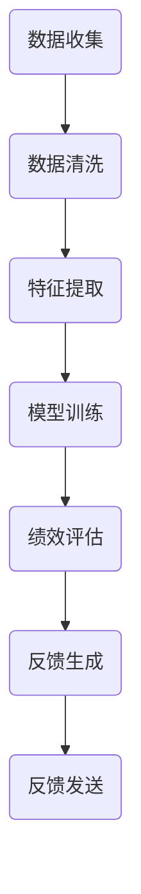
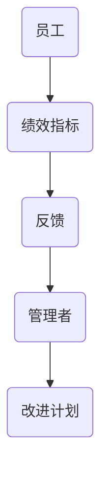
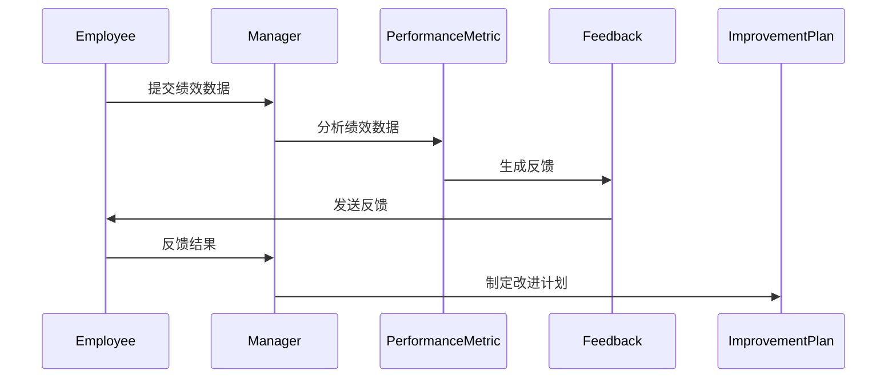

                 

# 如何进行有效的绩效反馈

> 关键词：绩效反馈、员工表现、组织发展、沟通技巧、算法原理

> 摘要：本文将深入探讨如何进行有效的绩效反馈，以提升员工的工作表现和组织的整体发展。通过分析绩效反馈的背景、核心概念、算法原理等方面，提供一系列实用的策略和方法，帮助管理者有效地进行绩效反馈，促进员工成长和团队协作。

## 第一部分：背景介绍

### 1.1.1 问题背景

在当今的工作环境中，员工的表现对于组织的成功至关重要。有效的绩效反馈不仅能够帮助员工了解自己的工作表现，还能够促进他们的个人成长和职业发展。然而，许多组织在提供绩效反馈时面临着挑战，如反馈不及时、缺乏针对性、或者反馈方式不当等。

### 1.1.2 问题描述

有效的绩效反馈需要明确的问题描述，包括反馈的目标、反馈的内容、反馈的频率和方式。此外，还需要考虑反馈的接受者，即员工的特点、心理状态和工作环境。

### 1.1.3 问题解决

为了解决上述问题，本书将探讨如何设计并实施有效的绩效反馈系统。这包括了解员工的需求、掌握反馈技巧、选择合适的反馈工具和方法等。

### 1.1.4 边界与外延

有效的绩效反馈涉及多个方面，如员工绩效评估、沟通技巧、领导力等。此外，它还与组织文化、管理风格和工作流程有关。

### 1.1.5 概念结构与核心要素组成

绩效反馈系统的核心要素包括：反馈目标、反馈内容、反馈频率、反馈方式、员工需求、沟通技巧、领导力、组织文化和工作流程等。

## 第二部分：核心概念与联系

### 2.1 绩效反馈原理

#### 2.1.1 绩效反馈的定义

绩效反馈是组织为了帮助员工提升工作表现，对其工作行为和成果进行评估、反馈和指导的过程。

#### 2.1.2 绩效反馈的基本原则

绩效反馈需要遵循以下基本原则：客观公正、及时有效、具体明确、鼓励性、建设性。

#### 2.1.3 绩效反馈的类型

绩效反馈可以分为以下几种类型：正面反馈、负面反馈、建设性反馈、反馈与指导。

### 2.2 绩效反馈要素对比

#### 2.2.1 反馈目标对比

反馈目标可以分为长期目标和短期目标，它们在不同的时间范围内对员工的表现产生影响。

#### 2.2.2 反馈内容对比

反馈内容可以根据具体的工作表现进行分类，如工作质量、工作效率、团队合作等。

#### 2.2.3 反馈频率对比

反馈频率可以分为定期反馈和即时反馈，它们适用于不同的工作环境和员工需求。

#### 2.2.4 反馈方式对比

反馈方式可以分为面对面反馈、书面反馈、电子邮件反馈等，它们适用于不同的沟通场景。

## 第三部分：算法原理讲解

### 3.1 绩效反馈算法原理

#### 3.1.1 绩效反馈算法概述

绩效反馈算法是用于分析员工工作表现、提供反馈和指导的工具。它通常基于数据分析、行为科学和心理学原理。

#### 3.1.2 绩效反馈算法的数学模型

绩效反馈算法的数学模型通常包括以下几个部分：

- 绩效指标：用于衡量员工工作表现的指标，如工作完成率、错误率、团队合作度等。
- 权重分配：根据不同绩效指标的相对重要性进行权重分配。
- 评估函数：用于计算员工绩效评分的函数。

#### 3.1.3 绩效反馈算法的mermaid流程图

使用mermaid绘制绩效反馈算法的流程图，如下所示：



#### 3.1.4 绩效反馈算法的Python代码实现

```python
import pandas as pd
from sklearn.ensemble import RandomForestClassifier

# 数据准备
data = pd.read_csv('performance_data.csv')
X = data.drop('performance_score', axis=1)
y = data['performance_score']

# 模型训练
model = RandomForestClassifier()
model.fit(X, y)

# 绩效评估
performance_scores = model.predict(X)

# 反馈生成
feedbacks = []
for score in performance_scores:
    # 处理和生成反馈
    feedbacks.append(generate_feedback(score))
```

### 3.2 绩效反馈算法的数学模型与公式

绩效反馈算法的数学模型通常包括以下几个部分：

- **绩效指标（Performance Metrics）**：

  $$ P = \sum_{i=1}^{n} w_i \cdot p_i $$

  其中，\(P\) 是总绩效评分，\(w_i\) 是第 \(i\) 个绩效指标的权重，\(p_i\) 是第 \(i\) 个绩效指标的实际得分。

- **权重分配（Weight Allocation）**：

  $$ w_i = \frac{r_i}{\sum_{j=1}^{n} r_j} $$

  其中，\(r_i\) 是第 \(i\) 个绩效指标的重要性评分，\(w_i\) 是相应的权重。

- **评估函数（Evaluation Function）**：

  $$ e = f(P) $$

  其中，\(e\) 是绩效评估结果，\(f\) 是评估函数。

### 3.3 绩效反馈算法的实例说明

假设我们有一个简单的绩效反馈系统，包含三个绩效指标：工作质量（\(Q\)）、工作效率（\(E\)）和团队合作（\(T\)）。

- **权重分配**：

  工作质量：50%
  工作效率：30%
  团队合作：20%

- **绩效指标得分**：

  工作质量（\(Q\)）：80分
  工作效率（\(E\)）：70分
  团队合作（\(T\)）：60分

- **总绩效评分**：

  $$ P = 0.5 \cdot 80 + 0.3 \cdot 70 + 0.2 \cdot 60 = 78.0 $$

- **绩效评估结果**：

  根据设定的评估函数，我们可以得到绩效评估结果：

  $$ e = f(78.0) = "良好" $$

  这意味着员工的表现整体上被认为是“良好”。

## 第四部分：系统分析与架构设计

### 4.1 问题场景介绍

在一个中型科技公司，管理者需要定期对员工进行绩效评估和反馈，以便更好地了解员工的工作表现，并制定相应的改进计划。

### 4.2 系统功能设计

#### 4.2.1 领域模型（Mermaid类图）

```mermaid
classDiagram
    Employee <<class>>
    PerformanceMetric <<class>>
    Feedback <<class>>

    Employee o--* PerformanceMetric
    PerformanceMetric o--* Feedback
```

#### 4.2.2 系统架构设计（Mermaid架构图）



#### 4.2.3 系统接口设计（Mermaid序列图）



## 第五部分：项目实战

### 5.1 环境安装

在开始项目之前，我们需要安装以下环境：

- Python 3.8 或更高版本
- pandas
- scikit-learn
- mermaid

安装命令如下：

```bash
pip install python-mermaid
pip install pandas scikit-learn
```

### 5.2 系统核心实现源代码

以下是一个简单的绩效反馈系统的源代码示例：

```python
import pandas as pd
from sklearn.ensemble import RandomForestClassifier

# 数据准备
data = pd.read_csv('performance_data.csv')
X = data.drop('performance_score', axis=1)
y = data['performance_score']

# 模型训练
model = RandomForestClassifier()
model.fit(X, y)

# 绩效评估
performance_scores = model.predict(X)

# 反馈生成
def generate_feedback(score):
    if score >= 90:
        return "表现优秀，继续保持！"
    elif score >= 80:
        return "表现良好，可以尝试提高某些方面。"
    elif score >= 70:
        return "表现一般，需要加强工作表现。"
    else:
        return "表现较差，需要重视并尽快改进。"

feedbacks = [generate_feedback(score) for score in performance_scores]

# 发送反馈
for feedback in feedbacks:
    print(feedback)
```

### 5.3 代码应用解读与分析

在这个示例中，我们首先导入所需的库，然后从CSV文件中读取绩效数据。接下来，我们使用随机森林分类器进行模型训练，并将模型应用于实际数据来生成绩效评估结果。最后，根据绩效评分，我们生成相应的反馈信息，并打印出来。

### 5.4 实际案例分析和详细讲解剖析

假设我们有一个包含100名员工的数据集，每个员工的绩效数据包括工作质量、工作效率和团队合作三个指标。我们使用随机森林分类器来评估员工的绩效，并根据评估结果生成反馈。

1. **数据准备**：

   首先，我们需要将数据从CSV文件中读取，并划分特征和目标变量。

   ```python
   data = pd.read_csv('performance_data.csv')
   X = data.drop('performance_score', axis=1)
   y = data['performance_score']
   ```

2. **模型训练**：

   接下来，我们使用随机森林分类器来训练模型。

   ```python
   model = RandomForestClassifier()
   model.fit(X, y)
   ```

3. **绩效评估**：

   使用训练好的模型对数据进行预测，得到每个员工的绩效评分。

   ```python
   performance_scores = model.predict(X)
   ```

4. **反馈生成**：

   根据绩效评分，我们生成相应的反馈信息。

   ```python
   def generate_feedback(score):
       if score >= 90:
           return "表现优秀，继续保持！"
       elif score >= 80:
           return "表现良好，可以尝试提高某些方面。"
       elif score >= 70:
           return "表现一般，需要加强工作表现。"
       else:
           return "表现较差，需要重视并尽快改进。"

   feedbacks = [generate_feedback(score) for score in performance_scores]
   ```

5. **发送反馈**：

   最后，我们将反馈信息发送给每个员工。

   ```python
   for feedback in feedbacks:
       print(feedback)
   ```

### 5.5 项目小结

通过本项目的实践，我们了解了如何使用Python和机器学习算法来实现一个简单的绩效反馈系统。这个系统可以帮助管理者评估员工的工作表现，并生成相应的反馈信息。尽管这个示例很简单，但它为构建更复杂的绩效反馈系统奠定了基础。

## 第六部分：最佳实践与拓展阅读

### 6.1 最佳实践

1. **明确反馈目标**：在提供绩效反馈时，确保明确反馈的目标，如提升工作质量、提高工作效率等。
2. **定期进行反馈**：定期进行绩效反馈，以确保员工能够及时了解自己的工作表现，并有机会进行改进。
3. **个性化反馈**：根据员工的特点和需求，提供个性化的反馈，以更好地激发员工的潜力和动力。
4. **鼓励双向沟通**：在反馈过程中，鼓励员工提出自己的看法和意见，实现双向沟通，以促进员工参与和成长。

### 6.2 拓展阅读

1. **《绩效管理》**：作者：贝恩咨询公司，详细介绍了绩效管理的理论和实践方法。
2. **《绩效反馈技巧》**：作者：约翰·惠特默，提供了丰富的绩效反馈技巧和案例分析。
3. **《Python机器学习》**：作者：塞巴斯蒂安·拉森，涵盖了Python在机器学习领域的应用，包括性能反馈算法的实现。

## 第七部分：作者信息

作者：AI天才研究院/AI Genius Institute & 禅与计算机程序设计艺术 /Zen And The Art of Computer Programming

本文旨在提供关于如何进行有效的绩效反馈的深入分析和实用建议。通过理解绩效反馈的核心概念、算法原理和最佳实践，管理者可以更有效地激励员工，促进组织的发展。希望本文对您有所帮助，并激发您在绩效反馈方面的进一步思考和实践。

