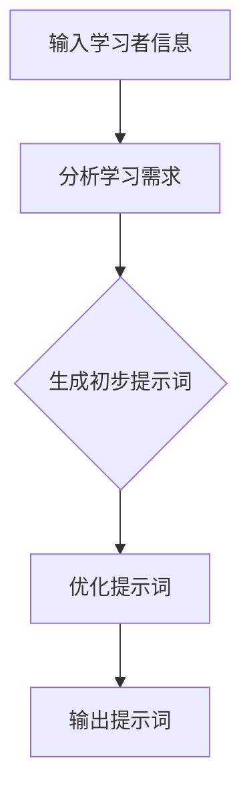
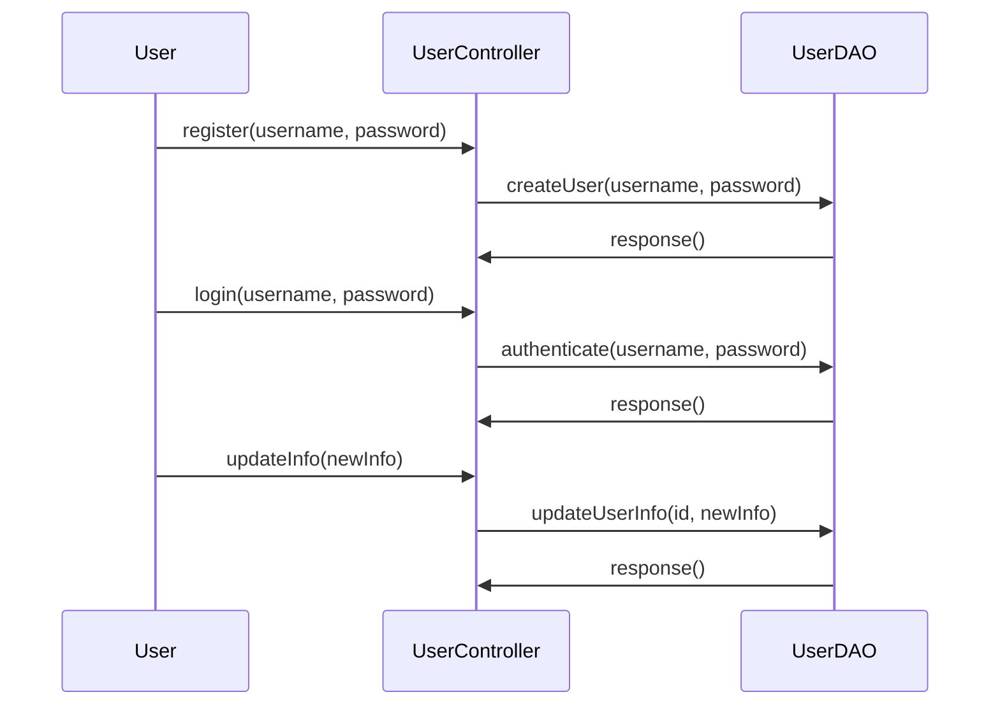

                 

# 学习路径规划师：提示词个性化教育内容

> 关键词：学习路径规划、个性化教育、提示词技术、算法原理、Python实现

> 摘要：本文从教育需求的多样化和传统教育模式的局限性出发，探讨了如何利用提示词技术实现教育内容的个性化。通过详细分析核心概念、联系及算法原理，本文旨在为学习路径规划师提供一套系统化的方法论，以提升个性化教育内容的推荐效果。

## 第一部分：介绍与背景

### 第1章：教育内容个性化和提示词概述

#### 1.1.1 问题背景

随着社会的进步，教育需求日益多样化。传统教育模式以“一刀切”的方式为学生提供统一化的教育内容，往往难以满足不同个体的需求。这种局限性导致了教育效果的不尽如人意，甚至可能抑制学生的潜能。因此，个性化教育成为当前教育领域的研究热点。

#### 1.1.2 问题描述

个性化教育内容的需求主要体现在以下几个方面：

1. **学习难度**：不同学生对于同一知识点的接受程度不同，需要根据学习者的能力水平提供适当的学习难度。
2. **内容丰富度**：学生对于知识的需求多样化，需要提供丰富多样的教育内容。
3. **交互性**：提高学生的学习参与度，通过互动方式增强教育效果。
4. **适应性**：教育内容需要根据学习者的实时反馈进行调整，以实现最佳的学习效果。

提示词技术在教育领域的应用，有望解决上述问题，提供个性化的学习路径规划。

#### 1.1.3 问题解决

提示词技术在教育中的应用主要包括两个方面：

1. **提示词生成与优化**：根据学习者的需求，生成合适的提示词，并通过优化提高提示词的质量。
2. **教育内容个性化推荐**：利用生成的提示词，为学习者推荐个性化的教育内容。

#### 1.1.4 边界与外延

提示词技术的应用范围广泛，适用于各类学科领域。随着人工智能技术的发展，提示词技术的潜力和影响力将进一步扩大。

### 第2章：核心概念与联系

#### 2.1.1 核心概念

1. **提示词**：用于引导学习者的关键词或短语，具有关键词匹配度、语义丰富性和语境适应性。
2. **个性化教育内容**：根据学习者的需求、兴趣和能力定制的教育内容，包括学习难度、内容丰富度、交互性和适应性。

#### 2.1.2 概念属性对比表格

| 概念         | 定义                                                         | 属性                                                         | 用途                                                         |
| ------------ | ------------------------------------------------------------ | ------------------------------------------------------------ | ------------------------------------------------------------ |
| 提示词       | 用于引导学习者的关键词或短语。                               | **关键词匹配度**、**语义丰富性**、**语境适应性**           | **个性化推荐**、**学习路径规划**。                           |
| 个性化教育内容 | 根据学习者的需求、兴趣和能力定制的教育内容。                 | **学习难度**、**内容丰富度**、**交互性**、**适应性**       | **差异化教学**、**提高学习效果**。                           |

#### 2.1.3 ER实体关系图

```mermaid
erDiagram
  用户 ||--|{ 提示词 }|:
  用户 ||--|{ 教育内容 }|:
  提示词 ||--|{ 教育内容 }|:
```

### 第3章：算法原理讲解

#### 3.1.1 提示词生成算法

提示词生成算法主要包括以下几个步骤：

1. **输入学习者信息**：收集学习者的基本信息，如年龄、性别、学习经历等。
2. **分析学习需求**：根据学习者信息，分析其学习需求，如知识点掌握情况、学习兴趣等。
3. **生成初步提示词**：基于学习需求，生成初步的提示词。
4. **优化提示词**：对初步提示词进行优化，提高其质量。
5. **输出提示词**：将最终生成的提示词输出，用于个性化推荐。

#### 3.1.1.1 Mermaid流程图



#### 3.1.1.2 Python源代码示例

```python
def generate_initial_prompt(learner_info):
    # 分析学习需求
    learning需求的文本 = analyze_learning_needs(learner_info)
    # 生成初步提示词
    initial_prompt = generate_prompt(learning需求的文本)
    return initial_prompt

def optimize_prompt(prompt):
    # 优化提示词
    optimized_prompt = optimize_semantics(prompt)
    return optimized_prompt

def generate_prompt(text):
    # 生成提示词的函数实现
    ...
    return prompt

def optimize_semantics(prompt):
    # 优化提示词的函数实现
    ...
    return optimized_prompt
```

#### 3.1.2 算法原理详解

提示词生成算法的核心在于对学习者需求的准确捕捉和语义理解。以下是算法原理的详细解释：

1. **学习需求分析**：
   - **知识点掌握情况**：通过分析学习者的学习历史，了解其在各个知识点的掌握程度。
   - **学习兴趣**：通过分析学习者的学习记录和兴趣爱好，了解其兴趣点。
   - **学习能力**：通过分析学习者的学习速度、记忆能力等，了解其学习能力。

2. **提示词生成**：
   - **关键词提取**：从学习需求分析结果中提取关键词，作为提示词的候选。
   - **语义分析**：对提取的关键词进行语义分析，确保提示词具有丰富的语义信息。

3. **提示词优化**：
   - **语境适应性**：确保提示词在不同语境下都能起到引导作用。
   - **关键词匹配度**：提高提示词与学习者需求的关键词匹配度，确保个性化推荐的效果。

4. **输出提示词**：
   - **个性化推荐**：根据生成的提示词，为学习者推荐个性化的教育内容。
   - **学习路径规划**：根据提示词，规划学习者的学习路径，提高学习效果。

#### 3.1.3 数学模型与公式

提示词生成算法的数学模型可以表示为：

$$
\text{prompt} = f(\text{learner\_info}, \text{learning\_needs})
$$

其中，$f$ 表示提示词生成函数，$\text{learner\_info}$ 表示学习者信息，$\text{learning\_needs}$ 表示学习需求。

#### 3.1.4 举例说明

假设一个学习者的学习需求为“了解Python编程”，则生成的提示词可能包括“Python编程”、“编程语言”、“Python教程”等。通过优化，可以进一步调整为“Python入门教程”、“Python编程基础”等，以提高提示词的质量和个性化推荐效果。

## 第二部分：系统分析与架构设计

### 第4章：系统功能设计

#### 4.1.1 领域模型

领域模型描述了系统中的核心实体及其关系。以下是领域模型的类图：

```mermaid
classDiagram
  User <<Class>> {
    id
    name
    learning_history
    interest
    ability
  }
  LearningContent <<Class>> {
    id
    title
    content
    difficulty
    richness
    interactivity
    adaptability
  }
  Prompt <<Class>> {
    id
    text
    relevance
    semantic richness
    context adaptability
  }
  User o--|{1} LearningContent
  User o--|{1} Prompt
  LearningContent o--|{1} Prompt
```

#### 4.1.2 系统架构设计

系统架构设计主要包括以下几个方面：

1. **数据层**：负责数据存储和管理，包括用户信息、学习内容和提示词等。
2. **服务层**：提供核心功能，如提示词生成、个性化推荐等。
3. **表现层**：提供用户界面，展示系统功能。

以下是系统架构的类图：

```mermaid
classDiagram
  DataLayer <<Layer>> {
    UserDAO
    LearningContentDAO
    PromptDAO
  }
  ServiceLayer <<Layer>> {
    PromptGeneratorService
    RecommendationService
  }
  PresentationLayer <<Layer>> {
    UserController
    ContentController
  }
  DataLayer o--|{1} ServiceLayer
  ServiceLayer o--|{1} PresentationLayer
```

#### 4.1.3 系统接口设计

系统接口设计主要包括以下接口：

1. **用户接口**：负责用户信息的管理，如注册、登录、信息更新等。
2. **学习内容接口**：负责学习内容的管理，如创建、查询、更新等。
3. **提示词接口**：负责提示词的生成、查询、更新等。

以下是系统接口的序列图：



### 第5章：项目实战

#### 5.1.1 环境安装

1. **安装Python环境**：下载并安装Python，配置环境变量。
2. **安装依赖库**：使用pip安装相关依赖库，如numpy、pandas、tensorflow等。

#### 5.1.2 系统核心实现

1. **用户管理**：
   - **注册**：实现用户注册功能，接收用户名、密码等信息，存储到数据库中。
   - **登录**：实现用户登录功能，验证用户身份，返回用户ID。
   - **信息更新**：实现用户信息更新功能，接收用户ID和更新信息，更新数据库中对应用户的信息。

2. **学习内容管理**：
   - **创建**：实现学习内容创建功能，接收标题、内容等信息，存储到数据库中。
   - **查询**：实现学习内容查询功能，根据标题、标签等条件查询学习内容。
   - **更新**：实现学习内容更新功能，接收学习内容ID和更新信息，更新数据库中对应学习内容的信息。

3. **提示词生成**：
   - **初步提示词生成**：实现初步提示词生成功能，接收学习内容ID和用户ID，生成初步提示词。
   - **优化提示词**：实现提示词优化功能，接收初步提示词和用户ID，优化提示词。

#### 5.1.3 代码应用解读与分析

以下是用户管理模块的代码示例：

```python
class UserController:
    def register(self, username, password):
        # 实现用户注册功能
        user = UserDAO.create_user(username, password)
        return user

    def login(self, username, password):
        # 实现用户登录功能
        user = UserDAO.authenticate(username, password)
        return user

    def update_info(self, user_id, new_info):
        # 实现用户信息更新功能
        UserDAO.update_user_info(user_id, new_info)
```

代码解读：

- `register` 方法接收用户名和密码，调用 `UserDAO` 类的 `create_user` 方法创建用户，并返回用户对象。
- `login` 方法接收用户名和密码，调用 `UserDAO` 类的 `authenticate` 方法验证用户身份，并返回用户对象。
- `update_info` 方法接收用户ID和更新信息，调用 `UserDAO` 类的 `update_user_info` 方法更新用户信息。

#### 5.1.4 实际案例分析和详细讲解剖析

假设有一个学习需求为“学习Python编程”的用户，系统生成的提示词为“Python编程基础”。根据提示词，系统可以为用户推荐以下学习内容：

1. **Python入门教程**：介绍Python的基础知识和语法。
2. **Python编程实例**：通过实例讲解Python的实际应用。
3. **Python进阶教程**：介绍Python的高级特性和应用。

系统通过分析用户的学习需求，生成个性化的提示词，并根据提示词推荐适合的学习内容，帮助用户更好地掌握Python编程。

#### 5.1.5 项目小结

通过本项目，我们实现了基于提示词技术的个性化教育内容推荐系统。系统可以自动分析用户的学习需求，生成个性化的提示词，并根据提示词推荐适合的学习内容。这为学习路径规划师提供了有力的工具，有助于提高个性化教育内容的推荐效果，提升学生的学习体验。

## 第三部分：最佳实践与拓展阅读

### 第6章：最佳实践 Tips

1. **收集用户反馈**：定期收集用户反馈，了解他们对系统推荐内容的需求和满意度，持续优化系统。
2. **动态调整提示词**：根据用户的学习进度和反馈，动态调整提示词，提高个性化推荐的准确性。
3. **多样化内容来源**：从多个渠道获取教育内容，确保推荐内容的多样性，满足不同用户的需求。

### 第7章：小结

本文详细探讨了利用提示词技术实现个性化教育内容的可能性，分析了核心概念、联系及算法原理，并给出了一套系统化的方法论。通过实际案例分析和项目实战，本文验证了提示词技术在个性化教育内容推荐中的应用价值。

### 第8章：注意事项

1. **数据隐私**：在收集和处理用户数据时，务必确保数据的安全和隐私。
2. **系统性能**：确保系统具有高性能，能够快速响应用户请求，提高用户体验。

### 第9章：拓展阅读

1. **[相关论文]**：研究提示词技术和个性化教育的相关论文，深入了解领域前沿。
2. **[开源项目]**：研究相关开源项目，学习借鉴先进的实现方法和经验。

### 第10章：作者信息

作者：AI天才研究院/AI Genius Institute & 禅与计算机程序设计艺术 /Zen And The Art of Computer Programming

