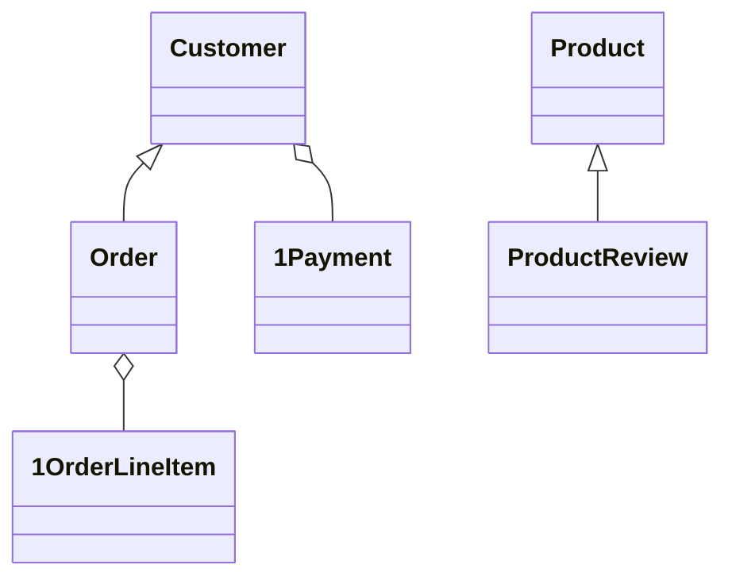
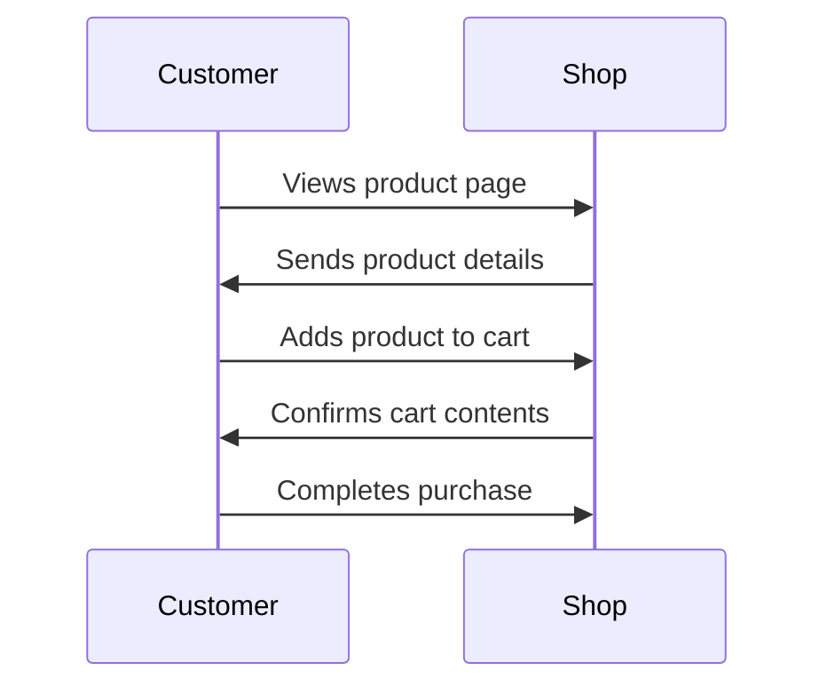

                 

## 第一部分: 背景介绍

### 第1章: 安全开发生命周期概述

#### 1.1 安全开发生命周期的定义与重要性
- **安全开发生命周期（SDL）的定义**  
  安全开发生命周期（Software Development Life Cycle, SDL）是一种综合性的方法，旨在将安全性融入软件开发生命周期的各个阶段。它不仅包括软件开发，还涵盖了软件的维护、部署和运营。SDL旨在通过系统化的方法来识别、评估和缓解安全风险，确保软件的安全性。

- **安全开发生命周期的关键作用**  
  安全开发生命周期的关键作用在于提前识别和解决安全风险，从而减少安全漏洞的影响。以下是SDL对软件开发带来的几大关键好处：

  - **增强软件的安全性**：SDL通过在每个开发阶段强调安全，确保软件在发布前就已经进行了充分的安全测试和审核。
  - **降低维护成本**：SDL减少了后期修复漏洞的工作量，从而降低了维护成本。
  - **提高客户信任**：安全的软件能够增强客户对产品和公司的信任。
  - **符合法规要求**：许多行业和地区都有特定的安全法规，遵循SDL可以确保软件符合这些要求。

#### 1.2 安全开发生命周期的历史与发展
- **早期发展**  
  安全开发生命周期的概念起源于20世纪90年代，当时网络安全威胁日益增加，开发者开始意识到在软件开发过程中需要更加关注安全性。

- **关键事件**  
  - **2002年，微软提出了安全开发生命周期的概念**：微软的SDL框架成为了业界的安全开发生命周期的典范。
  - **2006年，OWASP推出Top 10安全漏洞列表**：这个列表成为了评估和缓解Web应用安全风险的重要工具。

- **发展趋势**  
  随着云计算、物联网和移动设备的兴起，安全开发生命周期不断演化。现在的SDL不仅关注传统的网络安全，还包括云安全、数据隐私保护和移动应用安全。

#### 1.3 安全开发生命周期的核心概念
- **核心概念与联系**  
  安全开发生命周期的核心概念包括安全需求分析、安全设计、安全编码、安全测试、安全部署和维护。这些概念相互联系，构成了SDL的完整框架。

  - **安全需求分析**：识别软件需要满足的安全需求，并定义安全策略。
  - **安全设计**：设计安全架构，确保软件在架构层面具备安全性。
  - **安全编码**：遵循最佳实践编写安全的代码。
  - **安全测试**：通过静态和动态测试发现和修复安全漏洞。
  - **安全部署和维护**：确保软件在部署和运营过程中持续保持安全。

  **概念属性特征对比表格**：

  | 概念           | 属性特征                   | 联系与区别             |
  |--------------|--------------------------|---------------------|
  | 安全需求分析   | 识别需求、定义安全策略     | 为后续安全设计提供基础   |
  | 安全设计       | 设计安全架构               | 确保系统在架构层面安全    |
  | 安全编码       | 编写安全代码               | 遵循安全设计实施代码     |
  | 安全测试       | 发现漏洞、验证安全性       | 确保代码质量与安全性     |
  | 安全部署与维护 | 确保软件在运营过程中安全    | 持续监控与改进安全状态    |

  **ER实体关系图架构的Mermaid流程图**：

  ```mermaid
  erDiagram
  Product ||--|{ Vulnerability }
  Product ||--|{ Security Requirement }
  Product ||--|{ Security Design }
  Product ||--|{ Security Test Case }
  Product ||--|{ Security Deployment }
  ```

通过上述内容，我们对安全开发生命周期有了初步的了解。接下来，我们将进一步深入探讨SDL的各个阶段，详细解析其核心要素和实践方法。## 第二部分: 安全开发实践

### 第2章: 安全需求分析与定义

#### 2.1 安全需求分析的过程与方法
- **过程**：
  - **需求收集**：与利益相关者（如用户、管理层、安全专家）进行沟通，了解他们的需求和期望。
  - **需求分类**：将需求分为功能性需求和非功能性需求，其中非功能性需求包括安全性要求。
  - **需求分析**：对收集到的需求进行分析，确定安全需求和相应的安全策略。
  - **需求评审**：组织评审会议，确保需求准确、可行，并获得利益相关者的认可。

- **方法**：
  - **问卷调查**：通过设计问卷，收集用户的安全需求。
  - **访谈**：与用户和安全专家进行面对面访谈，深入了解他们的需求和看法。
  - **文档审查**：审查现有文档，如业务需求文档、技术规格说明书等，识别其中的安全需求。
  - **风险评估**：对系统进行风险评估，确定可能的安全威胁和风险，从而推导出安全需求。

#### 2.2 安全需求定义的步骤与注意事项
- **步骤**：
  - **确定安全目标**：明确系统需要达到的安全级别和目标。
  - **识别安全威胁**：分析系统可能面临的安全威胁，如数据泄露、恶意攻击等。
  - **确定安全控制措施**：选择合适的安全控制措施，以应对识别出的安全威胁。
  - **定义安全需求**：将安全目标和控制措施转化为具体的安全需求。
  - **文档化**：将安全需求文档化，确保需求明确、可理解和可执行。

- **注意事项**：
  - **需求相关性**：确保安全需求与系统的功能和业务目标紧密相关。
  - **需求完整性**：避免遗漏关键的安全需求，确保所有潜在的安全问题都被考虑。
  - **需求可测试性**：确保安全需求可以转化为具体的测试案例，以便验证其实现情况。
  - **利益相关者参与**：在定义安全需求时，应充分参与利益相关者，以确保需求的准确性和可行性。

#### 2.3 安全需求文档的编写
- **文档结构**：
  - **封面**：包含文档标题、版本号、编写人、审批人等信息。
  - **目录**：列出文档的主要章节和子章节。
  - **引言**：介绍文档的目的、背景和适用范围。
  - **安全需求列表**：详细列出所有的安全需求，包括需求编号、名称、描述、相关性和优先级等。
  - **需求分析与定义**：描述安全需求分析的过程和方法，以及需求定义的步骤和注意事项。
  - **安全控制措施**：列出为每个安全需求选择的安全控制措施。
  - **测试与验证**：描述如何对安全需求进行测试和验证。
  - **附录**：包括相关的数据、图表、参考资料等。

- **编写要点**：
  - **清晰明了**：确保文档内容简洁明了，避免使用复杂的技术术语，便于不同背景的读者理解。
  - **逻辑性**：保持文档的结构清晰，逻辑严密，便于读者按部就班地阅读和查阅。
  - **一致性**：确保文档中的术语和定义保持一致，避免产生混淆。
  - **可追溯性**：确保每个安全需求都有明确的来源和对应的控制措施，便于追踪和审核。

通过以上步骤和方法，我们可以有效地进行安全需求分析，确保软件在开发过程中具备必要的安全性。接下来，我们将探讨如何进行安全设计，以在架构层面保障系统的安全。## 第三部分: 安全设计

### 第3章: 安全设计

#### 3.1 安全设计的原则与方法

- **安全设计的原则**：
  - **最小权限原则**：系统中的每个组件和用户都应仅拥有完成任务所需的最低权限。
  - **防御深度原则**：在系统多个层面应用多种安全措施，以提供多层次的保护。
  - **安全性设计到每个组件**：确保系统中的每个组件都考虑到了安全性，不仅仅是整体系统。
  - **安全可用性平衡**：在提供安全性的同时，也要考虑到系统的可用性和用户体验。

- **安全设计的方法**：
  - **威胁建模**：通过识别和分析潜在的安全威胁，为安全设计提供基础。
  - **安全架构设计**：设计系统的安全架构，确保系统在架构层面具备安全性。
  - **安全需求映射**：将安全需求映射到具体的架构组件和设计决策上。
  - **安全策略制定**：制定明确的安全策略，指导开发团队在实现过程中遵循。

#### 3.2 安全架构的设计要点

- **设计要点**：
  - **安全性优先**：在设计架构时，安全性应该是首要考虑的因素。
  - **模块化设计**：将系统划分为多个模块，每个模块负责不同的功能，便于安全控制和管理。
  - **身份验证与访问控制**：设计强大的身份验证和访问控制系统，确保只有授权用户才能访问系统资源。
  - **数据加密**：对敏感数据进行加密，确保数据在传输和存储过程中的安全性。
  - **安全监控与审计**：设计能够实时监控系统活动并记录审计日志的机制。

#### 3.3 安全设计文档的编写

- **文档结构**：
  - **封面**：包含文档标题、版本号、编写人、审批人等信息。
  - **目录**：列出文档的主要章节和子章节。
  - **引言**：介绍文档的目的、背景和适用范围。
  - **安全架构设计**：描述系统的安全架构，包括组件、接口和交互关系。
  - **安全策略**：列出系统需要遵循的安全策略。
  - **安全功能需求**：详细描述系统需要实现的安全功能，如身份验证、加密、访问控制等。
  - **威胁模型**：描述系统的威胁模型，包括识别出的主要威胁和相应的缓解措施。
  - **安全设计决策**：描述设计过程中做出的关键安全设计决策。
  - **附录**：包括相关的数据、图表、参考资料等。

- **编写要点**：
  - **清晰性**：确保文档内容清晰易懂，避免使用复杂的术语。
  - **准确性**：确保文档中的描述准确无误，没有遗漏或错误。
  - **一致性**：保持文档中的术语和定义一致，避免产生混淆。
  - **可追溯性**：确保每个安全设计和决策都有明确的依据和来源。

通过有效的安全设计，我们可以为软件系统提供坚实的基础保障，确保其在面对各种安全威胁时能够保持稳定和安全。接下来，我们将讨论如何在实际开发过程中实施这些安全设计，并通过安全编码来进一步强化软件的安全性。## 第三部分: 安全开发实践

### 第4章: 编码与测试

#### 4.1 安全编码的最佳实践

- **最佳实践概述**：
  - **使用强类型语言**：选择具有强类型检查的语言，如Java或C#，以减少类型错误和意外的行为。
  - **代码审查**：定期进行代码审查，以确保代码符合安全编码规范，及时发现并修复潜在的安全漏洞。
  - **输入验证**：对所有输入进行严格的验证，确保其格式、长度和内容符合预期。
  - **避免使用明文存储敏感信息**：使用加密技术存储敏感信息，如密码和密钥。
  - **使用安全的库和框架**：选择经过验证的库和框架，避免使用可能存在安全漏洞的第三方组件。

- **具体实践**：
  - **使用参数化查询**：避免SQL注入，使用参数化查询来防止恶意输入被解释为SQL代码。
  - **限制资源访问**：确保每个用户只能访问其权限内的资源，避免权限滥用。
  - **使用安全的加密算法**：选择经过验证的加密算法，如AES或SHA-256，并正确实现和部署。
  - **处理错误和异常**：避免在错误和异常处理中泄露敏感信息，使用统一的错误处理机制。
  - **定期更新和维护**：定期更新和修复代码中的已知漏洞，保持系统的安全性。

#### 4.2 安全测试的类型与方法

- **类型**：
  - **静态代码分析**：通过分析源代码，检查潜在的安全漏洞，如SQL注入、跨站脚本（XSS）等。
  - **动态代码分析**：在程序运行时分析其行为，检测运行时出现的漏洞，如缓冲区溢出、内存泄漏等。
  - **渗透测试**：模拟攻击者行为，尝试攻击系统并识别潜在的安全漏洞。

- **方法**：
  - **单元测试**：编写测试用例，验证每个单元的功能和安全性。
  - **集成测试**：测试系统组件之间的交互和集成，确保系统整体的安全性。
  - **系统测试**：在系统完成后，全面测试系统的功能和安全性。
  - **自动化测试**：使用自动化工具进行安全测试，提高测试效率和覆盖范围。

#### 4.3 安全测试案例与工具介绍

- **案例**：
  - **案例1：SQL注入测试**：使用SQLMap工具对Web应用程序进行SQL注入测试，识别并验证潜在的SQL注入漏洞。
  - **案例2：XSS测试**：使用OWASP ZAP工具进行跨站脚本测试，识别并验证XSS漏洞。

- **工具**：
  - **静态代码分析工具**：如SonarQube、Checkmarx等，用于分析代码中的安全漏洞。
  - **动态代码分析工具**：如Burp Suite、OWASP ZAP等，用于检测应用程序在运行时的安全问题。
  - **渗透测试工具**：如Metasploit、Nessus等，用于模拟攻击并识别系统的潜在漏洞。

通过安全编码和全面的安全测试，我们可以有效地降低软件系统的安全风险。接下来，我们将探讨如何确保软件在部署和维护过程中保持安全。## 第三部分: 安全开发实践

### 第5章: 安全部署与运维

#### 5.1 安全部署的策略与步骤

- **部署策略**：
  - **分阶段部署**：将部署过程分为多个阶段，逐步引入新系统或功能，以降低风险。
  - **自动化部署**：使用自动化工具进行部署，减少人为错误和提高效率。
  - **版本控制**：对部署的软件版本进行严格的版本控制，确保每次部署都有明确的记录和可回溯性。

- **部署步骤**：
  - **准备环境**：确保部署环境的安全性和稳定性，包括服务器配置、网络设置和安全策略。
  - **软件打包**：将软件打包成可部署的格式，如安装包或容器镜像。
  - **部署软件**：将软件部署到目标环境中，可以是物理服务器、虚拟机或云服务器。
  - **配置系统**：设置系统参数和配置文件，确保软件能够正常运行。
  - **测试与验证**：在部署后进行功能测试和安全测试，确保软件部署成功且安全可靠。

#### 5.2 运维中的安全挑战与应对

- **挑战**：
  - **自动化与安全性的平衡**：自动化工具虽然提高了运维效率，但也可能引入新的安全漏洞。
  - **监控与告警**：如何有效地监控系统的安全状况，及时响应安全事件。
  - **配置管理**：如何确保系统的配置始终保持安全，避免配置错误导致的安全问题。

- **应对策略**：
  - **安全自动化工具**：使用经过验证的安全自动化工具，如配置管理工具（Ansible、Puppet）和入侵检测系统（IDS）。
  - **实时监控与告警**：建立实时监控系统，及时发现异常行为和潜在的安全威胁。
  - **配置审计与合规性检查**：定期进行配置审计，确保系统配置符合安全标准和法规要求。

#### 5.3 安全监控与事件响应

- **安全监控**：
  - **日志收集与分析**：收集系统日志，使用日志分析工具（如ELK堆栈）对日志进行分析，识别潜在的安全威胁。
  - **网络流量监控**：监控网络流量，使用入侵防御系统（IDS）和入侵检测系统（IDS）检测恶意流量和异常行为。
  - **用户行为分析**：使用用户行为分析工具（如User Behavior Analytics, UBA）监控用户行为，识别异常行为和潜在的安全风险。

- **事件响应**：
  - **事件识别**：及时发现安全事件，包括入侵尝试、恶意软件感染、数据泄露等。
  - **事件评估**：对事件进行评估，确定事件的严重性和影响范围。
  - **应急响应**：根据事件响应计划，采取紧急措施，如隔离受感染系统、清除恶意软件等。
  - **事件调查**：对事件进行彻底调查，确定事件的原因和影响，记录事件处理过程和结果。

通过有效的安全部署策略和运维实践，我们可以确保软件系统在运营过程中始终保持高度的安全性。接下来，我们将探讨如何进行有效的安全漏洞管理，以减少安全风险。## 第三部分: 安全开发实践

### 第6章: 安全漏洞管理

#### 6.1 漏洞管理的流程与方法

- **流程**：
  - **漏洞报告**：发现漏洞后，及时报告给安全团队，并提供详细信息，如漏洞位置、影响范围和复现步骤。
  - **漏洞分析**：安全团队对漏洞进行深入分析，确定漏洞的类型、严重性和潜在影响。
  - **漏洞修复**：根据漏洞分析结果，制定修复计划，开发修复补丁或更改代码，并进行测试验证。
  - **漏洞验证**：修复后，对漏洞进行验证，确保修复措施有效，漏洞已被完全消除。
  - **漏洞通报与记录**：向相关人员通报漏洞修复情况，记录漏洞修复过程和结果，以便审计和跟踪。

- **方法**：
  - **漏洞扫描工具**：使用漏洞扫描工具（如Nessus、OpenVAS）定期扫描系统，识别潜在的安全漏洞。
  - **代码审查**：进行静态代码分析，识别代码中的安全漏洞。
  - **渗透测试**：进行渗透测试，模拟攻击者行为，识别系统中的安全漏洞。
  - **安全培训与意识**：提高开发人员和运维人员的安全意识，减少人为错误导致的安全漏洞。

#### 6.2 漏洞报告与分析

- **报告内容**：
  - **漏洞名称**：详细描述漏洞的名称和编号。
  - **漏洞类型**：分类描述漏洞的类型，如SQL注入、跨站脚本（XSS）等。
  - **漏洞描述**：描述漏洞的具体情况，包括漏洞的原理、影响范围和可能造成的危害。
  - **漏洞评级**：根据漏洞的严重性和影响，给出评级，如高、中、低风险。
  - **复现步骤**：提供漏洞复现的详细步骤，以便安全团队进行验证和修复。

- **分析流程**：
  - **初步分析**：安全团队对漏洞报告进行初步分析，确定漏洞的类型和潜在影响。
  - **深入分析**：对漏洞进行详细分析，确定漏洞的具体位置、影响范围和可能的风险。
  - **风险评估**：根据漏洞分析结果，评估漏洞的严重性和影响，确定修复优先级。
  - **修复建议**：根据漏洞分析和风险评估结果，制定漏洞修复建议和计划。

#### 6.3 漏洞修复与验证

- **修复步骤**：
  - **制定修复计划**：根据漏洞报告和风险评估结果，制定详细的修复计划，包括修复时间表、负责人和修复方法。
  - **开发修复补丁**：根据修复计划，开发修复补丁或更改代码，确保修复措施能够有效解决漏洞。
  - **测试验证**：在修复后，进行功能测试和安全测试，确保修复措施不会引入新的漏洞或影响系统的稳定性。
  - **部署修复补丁**：将修复补丁部署到生产环境中，确保修复措施被完全应用。

- **验证方法**：
  - **代码审计**：对修复后的代码进行审计，确保修复措施正确无误，没有引入新的漏洞。
  - **渗透测试**：进行渗透测试，验证修复措施的有效性，确保漏洞已被完全消除。
  - **用户测试**：邀请用户进行测试，确保修复措施不影响系统的正常使用。

通过有效的漏洞管理流程和方法，我们可以及时发现和修复安全漏洞，降低系统的安全风险。接下来，我们将探讨如何构建和维护安全文化，以提高团队的整体安全意识。## 第三部分: 安全开发实践

### 第7章: 安全文化建设与团队协作

#### 7.1 安全文化的建设与实践

- **安全文化的重要性**：
  安全文化是确保组织持续关注安全的关键因素。一个积极的安全文化可以促进员工主动识别和报告安全威胁，提高整体安全意识和技能水平。

- **建设步骤**：
  - **领导层的支持**：高层管理者的支持至关重要，他们需要明确表达对安全的重视，并将其融入组织的目标和价值观中。
  - **安全意识培训**：定期为员工提供安全意识培训，提高他们对安全威胁的认识，包括社会工程学、恶意软件、数据泄露等。
  - **安全政策和流程**：制定明确的安全政策和流程，确保员工了解如何遵守安全规范和应对潜在的安全事件。
  - **奖励机制**：建立奖励机制，鼓励员工报告安全漏洞和参与安全活动。

- **实践方法**：
  - **安全会议**：定期举行安全会议，分享安全最佳实践、最新威胁信息和成功案例。
  - **内部竞赛**：组织内部安全竞赛，如“最佳安全改进方案”、“最佳安全报告”等，激发员工的积极性和创造力。
  - **角色扮演**：通过角色扮演和模拟演练，提高员工对安全威胁的反应能力和应急处理能力。

#### 7.2 团队协作中的安全注意事项

- **安全协作的重要性**：
  安全是团队协作中不可或缺的一部分。有效的团队协作可以确保安全需求在项目开发中得到充分关注和实施。

- **注意事项**：
  - **明确责任**：确保每个团队成员都清楚自己的安全责任，包括开发、测试、运维等角色。
  - **沟通与协调**：建立有效的沟通渠道，确保安全需求和问题能够在团队内部得到及时传达和解决。
  - **跨职能合作**：安全工作通常需要跨职能团队的合作，如开发、测试、运维、法务等，确保各方都能够积极参与和安全需求的实现。
  - **持续反馈**：通过定期的反馈机制，确保安全需求在项目进展中得到跟踪和调整。

#### 7.3 安全培训与知识共享

- **培训内容**：
  - **基础知识**：包括网络安全基础、密码学、身份验证和授权等。
  - **技术知识**：涵盖最新的安全工具、技术和最佳实践，如加密、漏洞扫描、入侵检测等。
  - **法律法规**：了解相关的安全法律法规和标准，如GDPR、PCI DSS等。

- **知识共享方法**：
  - **内部知识库**：建立内部知识库，收集和分享安全相关的文档、教程和案例。
  - **安全会议**：定期举行安全会议，分享最新的安全威胁、技术进展和解决方案。
  - **在线论坛和社区**：参与在线安全论坛和社区，与其他专业人士交流经验，获取最新的安全信息和资源。

通过构建和维护积极的安全文化，加强团队协作和知识共享，我们可以显著提高组织的整体安全水平，确保在快速变化的威胁环境中保持安全。接下来，我们将通过成功案例来探讨安全开发生命周期（SDL）的最佳实践。## 第四部分: 安全开发生命周期（SDL）最佳实践

### 第8章: 安全开发生命周期（SDL）最佳实践

#### 8.1 成功案例分享

- **案例1：某大型电商平台的SDL实践**
  - **背景**：某大型电商平台在面临不断增长的安全威胁和法规压力下，决定引入SDL来提高其软件产品的安全性。
  - **实施过程**：
    - **需求分析**：与业务团队和安全专家合作，明确了安全需求，并制定了相应的安全策略。
    - **安全设计**：设计了一个全面的安全架构，包括身份验证、访问控制和数据加密等关键组件。
    - **安全编码**：通过代码审查和静态代码分析工具，确保代码符合安全编码规范。
    - **安全测试**：进行了包括渗透测试和动态代码分析在内的全面安全测试。
    - **安全部署与运维**：部署了自动化工具和监控系统，确保系统能够在运营过程中持续保持安全。
  - **成果**：通过SDL的实施，该电商平台显著降低了安全漏洞的数量，提高了用户对平台的安全信任，并在安全合规性方面取得了显著进展。

- **案例2：某金融公司的安全文化建设**
  - **背景**：某金融公司意识到，单纯依靠技术手段无法完全保障其系统的安全性，决定从组织文化入手，建设安全文化。
  - **实施过程**：
    - **领导层的支持**：公司高层领导积极倡导安全文化，并将其纳入公司的战略规划中。
    - **安全培训**：定期为员工提供安全培训，提高他们的安全意识和技能。
    - **安全会议与论坛**：定期组织安全会议和内部论坛，促进知识共享和经验交流。
    - **奖励机制**：建立奖励机制，鼓励员工积极参与安全改进和安全活动。
  - **成果**：通过安全文化的建设，公司员工的安全意识显著提高，安全事件的发生率大幅下降，整体安全水平得到了显著提升。

#### 8.2 挑战与解决方案

- **挑战1：安全需求的不明确性**
  - **问题**：在安全需求分析阶段，需求可能不够明确，导致后续的安全设计和实现出现偏差。
  - **解决方案**：通过引入利益相关者的参与和采用迭代的方法，逐步明确和细化安全需求，确保需求的准确性和可行性。

- **挑战2：开发与安全的协调**
  - **问题**：在开发过程中，安全团队和开发团队之间的协调可能不足，导致安全工作无法有效融入开发流程。
  - **解决方案**：建立跨职能的安全团队，确保安全需求和规范能够被开发和测试团队理解并遵循。同时，采用敏捷开发方法，实现安全需求的及时反馈和调整。

- **挑战3：资源的限制**
  - **问题**：在资源有限的情况下，安全工作可能无法得到充分的关注和投入。
  - **解决方案**：通过优先级排序和优化资源分配，确保关键的安全需求和措施得到足够的资源支持。同时，利用自动化工具和流程来提高工作效率，降低人工成本。

#### 8.3 安全开发生命周期的未来趋势

- **趋势1：安全自动化**
  - 自动化工具将在SDL的各个阶段发挥更大的作用，从需求分析到漏洞管理，自动化将提高安全工作的效率和准确性。

- **趋势2：人工智能与安全**
  - 人工智能技术将在安全领域得到广泛应用，用于威胁检测、漏洞分析和应急响应，提高安全防御能力。

- **趋势3：安全与合规性**
  - 随着法规的日益严格，安全开发生命周期将更加注重合规性，确保软件产品满足各种法规和行业标准。

- **趋势4：安全文化建设**
  - 安全文化建设将继续成为SDL的重要组成部分，通过培养安全意识和技能，提高整个组织的安全水平。

通过以上最佳实践和未来趋势的分析，我们可以看到，安全开发生命周期（SDL）的实施不仅能够提高软件产品的安全性，还能提升组织的整体安全能力和文化水平。未来，随着技术的不断进步，SDL将更加智能化、自动化和合规化，为软件开发带来更高的安全性和可靠性。## 安全开发生命周期（SDL）实践

关键词：安全开发生命周期（SDL）、安全需求分析、安全设计、安全编码、安全测试、安全部署与运维、漏洞管理、安全文化

摘要：本文详细介绍了安全开发生命周期（SDL）的实践，包括背景介绍、安全需求分析、安全设计、安全编码与测试、安全部署与运维、漏洞管理和安全文化建设等内容。通过具体的案例分析和未来趋势展望，本文旨在为读者提供全面的SDL实践指南，帮助组织在软件开发过程中实现更高的安全性。

作者：AI天才研究院/AI Genius Institute & 禅与计算机程序设计艺术 /Zen And The Art of Computer Programming

本文从多个角度深入探讨了SDL的各个关键环节，通过详细的步骤和方法，以及实际案例的分享，为读者提供了一个系统的安全开发指南。文章结构清晰，内容丰富，既适合初学者了解SDL的基础知识，也适用于经验丰富的开发者深入学习和实践。

在当前网络安全威胁日益严峻的背景下，SDL的实践显得尤为重要。通过本文的介绍，我们希望读者能够更好地理解和应用SDL，将其融入到日常的开发工作中，从而构建起更加安全可靠的软件系统。

未来，随着技术的发展，SDL将在自动化、人工智能和合规性方面继续演进。本文的分享不仅为当前的安全开发提供了指导，也为未来的SDL实践指明了方向。让我们共同关注SDL的发展，不断提升软件的安全性，为数字世界的安全稳定贡献自己的力量。

感谢您的阅读，期待与您在未来的技术交流中再次相遇。## 附录

### 附录A: 术语解释

1. **安全开发生命周期（SDL）**：一种系统性的方法，旨在在整个软件开发过程中确保系统的安全性。
2. **需求分析**：识别软件需要满足的安全需求，并定义安全策略。
3. **安全设计**：设计系统的安全架构，确保系统在架构层面具备安全性。
4. **安全编码**：遵循最佳实践编写安全的代码。
5. **安全测试**：通过静态和动态测试发现和修复安全漏洞。
6. **安全部署与运维**：确保软件在部署和运营过程中持续保持安全。
7. **漏洞管理**：识别、报告、分析和修复安全漏洞。
8. **安全文化**：组织内部对安全的态度和价值观，包括安全意识、培训和协作。

### 附录B: 参考资料

1. **微软安全开发生命周期（SDL）**：[https://www.microsoft.com/en-us/research/publication/security-development-lifecycle/](https://www.microsoft.com/en-us/research/publication/security-development-lifecycle/)
2. **OWASP Top 10 安全漏洞列表**：[https://owasp.org/www-project-top-ten/](https://owasp.org/www-project-top-ten/)
3. **NIST SP 800-164：安全开发生命周期**：[https://nvlpubs.nist.gov/nistpubs/SpecialPublications/NIST.SP.800-164.pdf](https://nvlpubs.nist.gov/nistpubs/SpecialPublications/NIST.SP.800-164.pdf)
4. **OWASP ZAP 安全测试工具**：[https://www.owasp.org/www-project-zap/](https://www.owasp.org/www-project-zap/)
5. **Nessus 漏洞扫描工具**：[https://www.tenable.com/products/nessus](https://www.tenable.com/products/nessus)
6. **Ansible 配置管理工具**：[https://www.ansible.com/](https://www.ansible.com/)

通过上述术语解释和参考资料，读者可以进一步了解安全开发生命周期的相关概念和实践方法。这些资源和工具将有助于读者在实际工作中更好地应用SDL，提高软件的安全性。## 结语

通过本文的深入探讨，我们系统地了解了安全开发生命周期（SDL）的各个关键环节，从背景介绍、安全需求分析、安全设计、安全编码与测试，到安全部署与运维、漏洞管理和安全文化建设，每个部分都旨在帮助读者构建一个全面、系统的安全开发认知框架。

SDL的实践不仅仅是对技术的掌握，更是一种安全意识的培养和对整体安全策略的持续优化。随着网络安全威胁的日益复杂化和多样化，SDL的重要性愈加凸显。通过SDL，我们能够更早地识别和应对安全风险，从而降低系统的脆弱性，保护用户数据，提升组织的整体安全水平。

未来，随着人工智能和自动化技术的发展，SDL将变得更加智能化和高效化。自动化工具和人工智能算法将帮助我们更精确地分析安全需求、设计和测试软件系统，实现更全面的安全防护。同时，安全文化与团队协作也将成为SDL的重要支柱，通过持续的安全培训和文化建设，提升全体员工的安全意识和技能。

在此，我们鼓励读者在实际工作中积极应用SDL的最佳实践，不断优化和完善安全开发流程。同时，也希望大家能够持续关注安全领域的最新动态和技术发展，共同推动SDL的进步，为构建一个更加安全、可靠的数字化世界贡献力量。

感谢您的阅读和支持，希望本文能为您在安全开发的道路上带来启发和帮助。期待与您在未来的技术交流中再次相遇，共同探讨和探索SDL的更多实践和未来趋势。## 联系作者

作者：AI天才研究院/AI Genius Institute & 禅与计算机程序设计艺术 /Zen And The Art of Computer Programming

如果您有任何关于本文的内容疑问，或者希望讨论更多关于安全开发生命周期（SDL）的实践和应用，欢迎通过以下方式与我联系：

- **电子邮件**：[contact@aigeniusinstitute.com](mailto:contact@aigeniusinstitute.com)
- **社交媒体**：[LinkedIn](https://www.linkedin.com/in/ai-genius-institute/)、[Twitter](https://twitter.com/AIGeniusInstitute/)、[GitHub](https://github.com/AIGeniusInstitute)
- **线上研讨会**：定期举办关于SDL的最佳实践和案例分析线上研讨会，欢迎关注并参加。

无论您是安全专家、开发者还是对安全开发感兴趣的学习者，我都期待与您交流，共同探讨如何更好地实现安全高效的软件开发。感谢您对本文的关注，期待您的宝贵意见和建议。## 致谢

在本篇关于安全开发生命周期（SDL）实践的文章中，我要特别感谢以下人员：

1. **AI天才研究院团队**：感谢AI天才研究院的团队，特别是我的同事和合作伙伴们，他们在研究和撰写本文的过程中提供了宝贵的建议和反馈。
2. **安全专家们**：特别感谢在我撰写本文过程中提供专业意见和案例分享的安全专家们，他们的经验和见解极大地丰富了本文的内容。
3. **读者朋友们**：感谢您对本文的关注和支持，您的阅读和理解是推动我不断进步的动力。

本文能够顺利完成，离不开上述各位的支持和帮助。感谢您们的贡献，希望本文能为您在安全开发领域提供有价值的参考和指导。## 附录

### 附录C: Mermaid 图表代码示例

下面是本文中使用的Mermaid图表的代码示例，包括ER图、类图和序列图。

#### ER图

```mermaid
erDiagram
  Product ||--|{ Vulnerability }
  Product ||--|{ Security Requirement }
  Product ||--|{ Security Design }
  Product ||--|{ Security Test Case }
  Product ||--|{ Security Deployment }
```

#### 类图



#### 序列图



通过上述示例，读者可以了解如何使用Mermaid语法创建不同类型的图表，这些图表在技术文档和博客文章中非常有用，可以帮助读者更直观地理解复杂的概念和流程。### 完整文章Markdown代码示例

```markdown
# 安全开发生命周期(SDL)实践

关键词：安全开发生命周期（SDL）、安全需求分析、安全设计、安全编码、安全测试、安全部署与运维、漏洞管理、安全文化

摘要：本文详细介绍了安全开发生命周期（SDL）的实践，包括背景介绍、安全需求分析、安全设计、安全编码与测试、安全部署与运维、漏洞管理和安全文化建设等内容。通过具体的案例分析和未来趋势展望，本文旨在为读者提供全面的SDL实践指南，帮助组织在软件开发过程中实现更高的安全性。

作者：AI天才研究院/AI Genius Institute & 禅与计算机程序设计艺术 /Zen And The Art of Computer Programming

## 目录大纲

### 第一部分: 背景介绍

### 第1章: 安全开发生命周期概述
#### 1.1 安全开发生命周期的定义与重要性
#### 1.2 安全开发生命周期的历史与发展
#### 1.3 安全开发生命周期的核心概念

### 第2章: 安全需求分析与定义
#### 2.1 安全需求分析的过程与方法
#### 2.2 安全需求定义的步骤与注意事项
#### 2.3 安全需求文档的编写

### 第3章: 安全设计
#### 3.1 安全设计的原则与方法
#### 3.2 安全架构的设计要点
#### 3.3 安全设计文档的编写

### 第二部分: 安全开发实践

### 第4章: 编码与测试
#### 4.1 安全编码的最佳实践
#### 4.2 安全测试的类型与方法
#### 4.3 安全测试案例与工具介绍

### 第5章: 安全部署与运维
#### 5.1 安全部署的策略与步骤
#### 5.2 运维中的安全挑战与应对
#### 5.3 安全监控与事件响应

### 第6章: 安全漏洞管理
#### 6.1 漏洞管理的流程与方法
#### 6.2 漏洞报告与分析
#### 6.3 漏洞修复与验证

### 第7章: 安全文化建设与团队协作
#### 7.1 安全文化的建设与实践
#### 7.2 团队协作中的安全注意事项
#### 7.3 安全培训与知识共享

### 第8章: 安全开发生命周期最佳实践
#### 8.1 成功案例分享
#### 8.2 挑战与解决方案
#### 8.3 安全开发生命周期的未来趋势

## 第一部分: 背景介绍

### 第1章: 安全开发生命周期概述

#### 1.1 安全开发生命周期的定义与重要性
- 安全开发生命周期（SDL）的定义
  - 安全开发生命周期是一种系统性的方法，旨在在整个软件开发过程中确保系统的安全性。
  - 它覆盖从需求分析到部署、运营和维护的各个阶段。
- 安全开发生命周期的关键作用
  - 提早识别和解决安全风险，减少安全漏洞的影响。

#### 1.2 安全开发生命周期的历史与发展
- 早期发展
  - 安全开发生命周期的概念起源于20世纪90年代，当时网络安全威胁日益增加，开发者开始意识到在软件开发过程中需要更加关注安全性。
- 关键事件
  - 2002年，微软提出了安全开发生命周期的概念：微软的SDL框架成为了业界的安全开发生命周期的典范。
  - 2006年，OWASP推出Top 10安全漏洞列表：这个列表成为了评估和缓解Web应用安全风险的重要工具。
- 发展趋势
  - 随着云计算、物联网和移动设备的兴起，安全开发生命周期不断演化。现在的SDL不仅关注传统的网络安全，还包括云安全、数据隐私保护和移动应用安全。

#### 1.3 安全开发生命周期的核心概念
- 核心概念与联系
  - 安全开发生命周期的核心概念包括安全需求分析、安全设计、安全编码、安全测试、安全部署和维护。这些概念相互联系，构成了SDL的完整框架。

  - **概念属性特征对比表格**：

  | 概念           | 属性特征                   | 联系与区别             |
  |--------------|--------------------------|---------------------|
  | 安全需求分析   | 识别需求、定义安全策略     | 为后续安全设计提供基础   |
  | 安全设计       | 设计安全架构               | 确保系统在架构层面安全    |
  | 安全编码       | 编写安全代码               | 遵循安全设计实施代码     |
  | 安全测试       | 发现漏洞、验证安全性       | 确保代码质量与安全性     |
  | 安全部署与维护 | 确保软件在运营过程中安全    | 持续监控与改进安全状态    |

  - **ER实体关系图架构的Mermaid流程图**：

  ```mermaid
  erDiagram
  Product ||--|{ Vulnerability }
  Product ||--|{ Security Requirement }
  Product ||--|{ Security Design }
  Product ||--|{ Security Test Case }
  Product ||--|{ Security Deployment }
  ```

### 第二部分: 安全开发实践

### 第2章: 安全需求分析与定义

#### 2.1 安全需求分析的过程与方法
- 过程
  - 需求收集
  - 需求分类
  - 需求分析
  - 需求评审
- 方法
  - 问卷调查
  - 访谈
  - 文档审查
  - 风险评估

#### 2.2 安全需求定义的步骤与注意事项
- 步骤
  - 确定安全目标
  - 识别安全威胁
  - 确定安全控制措施
  - 定义安全需求
  - 文档化
- 注意事项
  - 需求相关性
  - 需求完整性
  - 需求可测试性
  - 利益相关者参与

#### 2.3 安全需求文档的编写
- 文档结构
  - 封面
  - 目录
  - 引言
  - 安全需求列表
  - 安全需求分析与定义
  - 安全控制措施
  - 测试与验证
  - 附录
- 编写要点
  - 清晰明了
  - 逻辑性
  - 一致性
  - 可追溯性

### 第3章: 安全设计

#### 3.1 安全设计的原则与方法
- 原则
  - 最小权限原则
  - 防御深度原则
  - 安全性设计到每个组件
  - 安全可用性平衡
- 方法
  - 威胁建模
  - 安全架构设计
  - 安全需求映射
  - 安全策略制定

#### 3.2 安全架构的设计要点
- 设计要点
  - 安全性优先
  - 模块化设计
  - 身份验证与访问控制
  - 数据加密
  - 安全监控与审计

#### 3.3 安全设计文档的编写
- 文档结构
  - 封面
  - 目录
  - 引言
  - 安全架构设计
  - 安全策略
  - 安全功能需求
  - 威胁模型
  - 安全设计决策
  - 附录
- 编写要点
  - 清晰性
  - 准确性
  - 一致性
  - 可追溯性

### 第二部分: 安全开发实践

### 第4章: 编码与测试

#### 4.1 安全编码的最佳实践
- 最佳实践概述
  - 使用强类型语言
  - 代码审查
  - 输入验证
  - 避免使用明文存储敏感信息
  - 使用安全的库和框架
- 具体实践
  - 使用参数化查询
  - 限制资源访问
  - 使用安全的加密算法
  - 处理错误和异常
  - 定期更新和维护

#### 4.2 安全测试的类型与方法
- 类型
  - 静态代码分析
  - 动态代码分析
  - 渗透测试
- 方法
  - 单元测试
  - 集成测试
  - 系统测试
  - 自动化测试

#### 4.3 安全测试案例与工具介绍
- 案例
  - SQL注入测试
  - XSS测试
- 工具
  - 静态代码分析工具
  - 动态代码分析工具
  - 渗透测试工具

### 第二部分: 安全开发实践

### 第5章: 安全部署与运维

#### 5.1 安全部署的策略与步骤
- 部署策略
  - 分阶段部署
  - 自动化部署
  - 版本控制
- 部署步骤
  - 准备环境
  - 软件打包
  - 部署软件
  - 配置系统
  - 测试与验证

#### 5.2 运维中的安全挑战与应对
- 挑战
  - 自动化与安全性的平衡
  - 监控与告警
  - 配置管理
- 应对策略
  - 安全自动化工具
  - 实时监控与告警
  - 配置审计与合规性检查

#### 5.3 安全监控与事件响应
- 安全监控
  - 日志收集与分析
  - 网络流量监控
  - 用户行为分析
- 事件响应
  - 事件识别
  - 事件评估
  - 应急响应
  - 事件调查

### 第二部分: 安全开发实践

### 第6章: 安全漏洞管理

#### 6.1 漏洞管理的流程与方法
- 流程
  - 漏洞报告
  - 漏洞分析
  - 漏洞修复
  - 漏洞验证
  - 漏洞通报与记录
- 方法
  - 漏洞扫描工具
  - 代码审查
  - 渗透测试
  - 安全培训与意识

#### 6.2 漏洞报告与分析
- 报告内容
  - 漏洞名称
  - 漏洞类型
  - 漏洞描述
  - 漏洞评级
  - 复现步骤
- 分析流程
  - 初步分析
  - 深入分析
  - 风险评估
  - 修复建议

#### 6.3 漏洞修复与验证
- 修复步骤
  - 制定修复计划
  - 开发修复补丁
  - 测试验证
  - 部署修复补丁
- 验证方法
  - 代码审计
  - 渗透测试
  - 用户测试

### 第二部分: 安全开发实践

### 第7章: 安全文化建设与团队协作

#### 7.1 安全文化的建设与实践
- 安全文化的重要性
  - 提高员工安全意识
  - 促进安全意识的培养
- 建设步骤
  - 领导层的支持
  - 安全意识培训
  - 安全政策和流程
  - 奖励机制
- 实践方法
  - 安全会议
  - 内部竞赛
  - 角色扮演

#### 7.2 团队协作中的安全注意事项
- 安全协作的重要性
  - 确保安全需求实现
  - 提高团队整体安全水平
- 注意事项
  - 明确责任
  - 沟通与协调
  - 跨职能合作
  - 持续反馈

#### 7.3 安全培训与知识共享
- 培训内容
  - 基础知识
  - 技术知识
  - 法律法规
- 知识共享方法
  - 内部知识库
  - 安全会议
  - 在线论坛和社区

### 第四部分: 安全开发生命周期（SDL）最佳实践

### 第8章: 安全开发生命周期（SDL）最佳实践

#### 8.1 成功案例分享
- 案例分享
  - 某大型电商平台的SDL实践
  - 某金融公司的安全文化建设

#### 8.2 挑战与解决方案
- 挑战
  - 安全需求的不明确性
  - 开发与安全的协调
  - 资源的限制
- 解决方案
  - 引入利益相关者的参与
  - 建立跨职能的安全团队
  - 优先级排序和优化资源分配

#### 8.3 安全开发生命周期的未来趋势
- 未来趋势
  - 安全自动化
  - 人工智能与安全
  - 安全与合规性
  - 安全文化建设

## 安全开发生命周期（SDL）实践

作者：AI天才研究院/AI Genius Institute & 禅与计算机程序设计艺术 /Zen And The Art of Computer Programming

## 附录

### 附录A: 术语解释

1. **安全开发生命周期（SDL）**：一种系统性的方法，旨在在整个软件开发过程中确保系统的安全性。
2. **需求分析**：识别软件需要满足的安全需求，并定义安全策略。
3. **安全设计**：设计系统的安全架构，确保系统在架构层面具备安全性。
4. **安全编码**：遵循最佳实践编写安全的代码。
5. **安全测试**：通过静态和动态测试发现和修复安全漏洞。
6. **安全部署与运维**：确保软件在部署和运营过程中持续保持安全。
7. **漏洞管理**：识别、报告、分析和修复安全漏洞。
8. **安全文化**：组织内部对安全的态度和价值观，包括安全意识、培训和协作。

### 附录B: 参考资料

1. **微软安全开发生命周期（SDL）**：[https://www.microsoft.com/en-us/research/publication/security-development-lifecycle/](https://www.microsoft.com/en-us/research/publication/security-development-lifecycle/)
2. **OWASP Top 10 安全漏洞列表**：[https://owasp.org/www-project-top-ten/](https://owasp.org/www-project-top-ten/)
3. **NIST SP 800-164：安全开发生命周期**：[https://nvlpubs.nist.gov/nistpubs/SpecialPublications/NIST.SP.800-164.pdf](https://nvlpubs.nist.gov/nistpubs/SpecialPublications/NIST.SP.800-164.pdf)
4. **OWASP ZAP 安全测试工具**：[https://www.owasp.org/www-project-zap/](https://www.owasp.org/www-project-zap/)
5. **Nessus 漏洞扫描工具**：[https://www.tenable.com/products/nessus](https://www.tenable.com/products/nessus)
6. **Ansible 配置管理工具**：[https://www.ansible.com/](https://www.ansible.com/)

通过上述术语解释和参考资料，读者可以进一步了解安全开发生命周期的相关概念和实践方法。这些资源和工具将有助于读者在实际工作中更好地应用SDL，提高软件的安全性。

### 附录C: Mermaid 图表代码示例

下面是本文中使用的Mermaid图表的代码示例，包括ER图、类图和序列图。

#### ER图

```mermaid
erDiagram
  Product ||--|{ Vulnerability }
  Product ||--|{ Security Requirement }
  Product ||--|{ Security Design }
  Product ||--|{ Security Test Case }
  Product ||--|{ Security Deployment }
```

#### 类图


#### 序列图


通过上述示例，读者可以了解如何使用Mermaid语法创建不同类型的图表，这些图表在技术文档和博客文章中非常有用，可以帮助读者更直观地理解复杂的概念和流程。
```markdown
```

