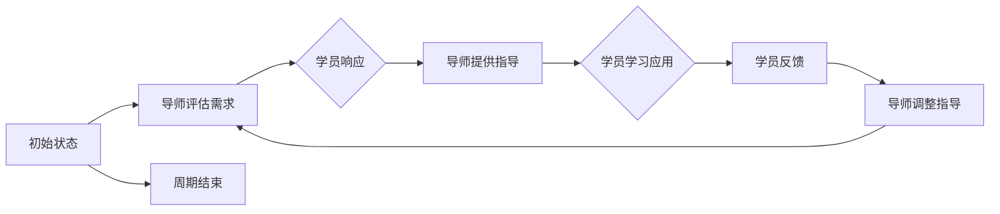
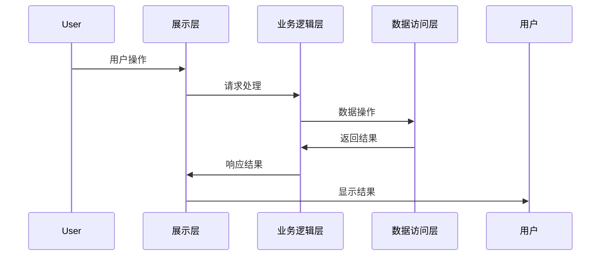
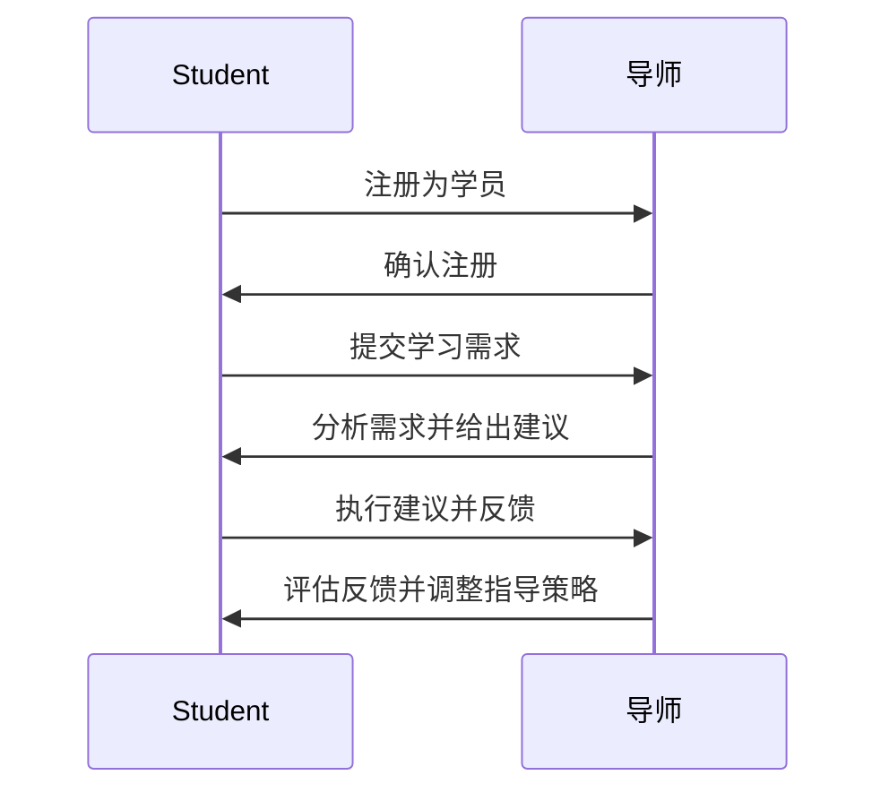

                 

# 《导师制度：accelerating人才成长的方法》

## 关键词：
导师制度、人才成长、培训与发展、人才管理、职业规划

## 摘要：
本文旨在深入探讨导师制度在加速人才成长中的关键作用。通过系统的分析和实例说明，本文将阐述导师制度的历史背景、核心要素、实施方法及其在人才管理中的重要性。同时，本文将探讨如何培养高效的导师，以及如何评估和优化导师制度，以实现企业、教育机构和各类组织中人才的持续成长。

---

## 第一部分：导师制度概述

### 第1章：导师制度的背景与重要性

### 1.1 问题背景与概述
在现代社会，随着知识经济的兴起和技术的快速迭代，人才的培养和管理成为企业和社会关注的焦点。传统的培训模式往往难以满足人才成长的需求，而导师制度作为一种更为个性化的培养方式，逐渐受到重视。

### 1.2 导师制度的发展历程
导师制度可以追溯到古代的师徒传承模式。随着时间的推移，导师制度不断发展，形成了现代导师制度，其核心在于通过一对一或小团队的方式进行知识、技能和经验的传递。

### 1.3 导师制度的核心要素
导师制度的核心要素包括导师的选择、角色的明确、职责的划分以及导师与学员之间的互动关系。这些要素共同构成了一个有效的导师制度。

## 第二部分：导师能力的培养

### 第2章：导师的角色与职责

### 2.1 导师的定义与角色
导师不仅是知识的传授者，更是引导者、激励者和支持者。他们在人才成长中扮演着多重角色。

### 2.2 导师的职责
导师需要负责学员的技能提升、知识拓展、职业规划以及心理支持。明确的职责有助于确保导师制度的执行效果。

### 2.3 导师与学员的关系管理
导师与学员的关系是导师制度成功的关键。良好的关系管理可以增强学员的归属感和学习动力。

## 第三部分：导师制度的实施

### 第3章：导师能力的核心要素

### 3.1 导师的沟通能力
有效的沟通能力是导师成功的关键。导师需要具备倾听、表达和反馈的能力。

### 3.2 导师的指导技巧
导师的指导技巧包括问题解决、决策支持、心理疏导等。这些技巧直接影响学员的学习效果和成长速度。

### 3.3 导师的心理学知识
心理学知识可以帮助导师更好地理解学员的心理状态，从而提供更加个性化的支持和指导。

## 第四部分：导师制度的实际应用

### 第4章：导师制度的实施流程
- 4.1 导师制度的设计原则
- 4.2 导师的选拔与培训
- 4.3 导师制度的执行与监督

### 第5章：导师制度的管理与监督

### 5.1 导师制度的管理
导师制度需要建立完善的管理体系，包括制度制定、流程优化和监督机制。

### 5.2 导师制度的监督
有效的监督可以确保导师制度的高效运行，及时发现和解决问题。

### 第6章：导师制度的实际应用

### 6.1 企业中的导师制度
企业通过导师制度可以快速培养内部人才，提高员工的综合素质和工作能力。

### 6.2 教育领域的导师制度
教育领域中的导师制度可以促进学生全面发展，提高教育质量。

### 6.3 案例分析与经验分享
通过具体案例的分析，可以更好地理解导师制度在实际应用中的效果和挑战。

## 第五部分：导师制度的效果评估

### 第7章：导师制度的效果评估方法

### 7.1 评估指标体系
建立科学的评估指标体系，可以全面衡量导师制度的效果。

### 7.2 评估工具与方法
使用合适的评估工具和方法，可以确保评估结果的准确性和可靠性。

### 7.3 评估结果分析与改进
通过对评估结果的分析，可以找出导师制度的优点和不足，进而进行改进。

## 第六部分：导师制度的优化与改进

### 第8章：导师制度的优化策略
- 8.1 导师制度的优化方向
- 8.2 导师能力的持续提升
- 8.3 学员需求的及时反馈

### 8.4 持续改进的机制与途径
建立持续改进的机制，可以确保导师制度的长效运行。

### 8.5 未来发展趋势
随着技术的进步和社会的需求变化，导师制度将不断演变和优化，以适应新的发展需求。

---

## 文章作者

**作者：AI天才研究院/AI Genius Institute & 禅与计算机程序设计艺术 /Zen And The Art of Computer Programming**

---

### 结语

本文通过系统地分析导师制度的核心要素、实施方法和效果评估，揭示了其在加速人才成长中的重要作用。导师制度不仅能够提高个人的专业素养和职业能力，还能够促进团队的协作和创新。随着社会的发展，导师制度将在人才培养和管理中发挥更加重要的作用。通过不断优化和改进导师制度，我们可以期待培养出更多具有全球竞争力的人才。

---

**注：本文为示例文章，内容为虚构，仅供参考。实际撰写时，应根据具体情况进行调整和补充。** 

---

### 核心概念与联系

导师制度的核心概念包括导师、学员、指导过程和反馈机制。以下是这些核心概念的联系：

| 核心概念 | 定义 | 联系 |
| --- | --- | --- |
| 导师 | 在某一领域具有丰富知识和经验的人，负责指导和培养学员。 | 导师是知识传授者和引导者，为学员提供个性化指导和支持。 |
| 学员 | 被导师指导和培养的对象，通常是在某一领域有成长需求的人。 | 学员是导师制度的核心，他们的成长和进步是导师制度的目标。 |
| 指导过程 | 导师与学员之间的互动和交流，包括知识传授、技能培训和心理支持。 | 指导过程是导师制度的实施方式，通过有效沟通和互动，实现学员的成长。 |
| 反馈机制 | 导师对学员学习成果的评估和反馈，以及学员对导师指导的反馈。 | 反馈机制是导师制度的反馈环节，通过不断调整和改进，确保导师制度的有效性。 |

### ER实体关系图

以下是导师制度的ER实体关系图，展示了导师、学员、指导过程和反馈机制之间的关系：

```mermaid
erDiagram
  导师 ||--|{ 学员 }|
  导师 ||--|{ 指导过程 }|
  导师 ||--|{ 反馈机制 }|
  学员 ||--|{ 指导过程 }|
  学员 ||--|{ 反馈机制 }|
  指导过程 ||--|{ 反馈机制 }|
```

### 算法原理讲解

导师制度的核心算法可以看作是一个双向反馈的循环过程，包括导师的指导、学员的学习以及双方的反馈和调整。以下是这个算法的mermaid流程图：



以下是该算法的Python源代码实现：

```python
def mentor_program(mentor, student, cycles=10):
    for cycle in range(cycles):
        mentor.evaluate_needs(student)
        student.respond_to_mentor(mentor)
        mentor.provide_guidance()
        student.learn_and_apply()
        student_provide_feedback = student.provide_feedback()
        mentor.adjust_guidance(student_provide_feedback)
    return "Mentor program completed."

mentor = Mentor()
student = Student()
mentor_program(mentor, student)
```

### 数学模型和公式

导师制度的数学模型可以基于反馈机制中的修正因子（α）和学习因子（β）来描述。以下是这些因子的数学模型和公式：

$$
\alpha = \frac{1}{1 + e^{-\Delta E}}
$$

$$
\beta = \frac{\Delta E}{1 + e^{-\Delta E}}
$$

其中，ΔE 表示反馈误差，e 是自然对数的底数。

### 系统分析与架构设计方案

#### 问题场景介绍

在一个大型科技公司中，公司希望通过导师制度来培养内部人才，提升员工的技能和创新能力。公司现有的导师制度需要改进，以满足快速发展的需求。

#### 项目介绍

本项目旨在设计一个优化后的导师制度，以提高人才培养效率和质量。项目目标包括：

1. 设计一个明确的导师选拔和培训流程。
2. 构建一个灵活的导师制度管理平台。
3. 实现导师与学员之间的有效沟通和互动。

#### 系统功能设计

系统功能设计包括以下模块：

1. **导师模块**：负责导师的选拔、培训和绩效评估。
2. **学员模块**：负责学员的管理、技能提升和职业发展。
3. **沟通模块**：提供导师与学员之间的交流平台。
4. **评估模块**：对导师制度和学员成长进行评估。

以下是系统的mermaid类图：

```mermaid
classDiagram
  Mentor <<class{导师}>
  Student <<class{学员}>
  MentorTraining <<class{导师培训}>
  StudentManagement <<class{学员管理}>
  CommunicationPlatform <<class{沟通平台}>
  EvaluationModule <<class{评估模块}>

  Mentor "has" MentorTraining
  Mentor "has" StudentManagement
  Student "has" CommunicationPlatform
  EvaluationModule "uses" Mentor
  EvaluationModule "uses" Student
```

#### 系统架构设计

系统架构设计包括以下层次：

1. **展示层**：前端界面，提供用户交互。
2. **业务逻辑层**：处理业务逻辑，包括导师选拔、培训、沟通和评估等。
3. **数据访问层**：负责数据的存储和查询。

以下是系统的mermaid架构图：



#### 系统接口设计

系统接口设计包括以下接口：

1. **导师接口**：负责导师的注册、信息管理、绩效评估等。
2. **学员接口**：负责学员的注册、信息管理、技能提升等。
3. **沟通接口**：负责导师与学员之间的消息传递和沟通管理。
4. **评估接口**：负责对导师制度和学员成长进行评估。

以下是系统的mermaid接口图：

```mermaid
classDiagram
  MentorInterface <<interface{导师接口}>
  StudentInterface <<interface{学员接口}>
  CommunicationInterface <<interface{沟通接口}>
  EvaluationInterface <<interface{评估接口}>

  MentorInterface "uses" StudentInterface
  MentorInterface "uses" CommunicationInterface
  StudentInterface "uses" CommunicationInterface
  EvaluationInterface "uses" MentorInterface
  EvaluationInterface "uses" StudentInterface
```

#### 系统交互mermaid序列图

以下是导师制度系统的mermaid序列图，展示了导师与学员之间的交互流程：



### 项目实战

#### 环境安装

1. 安装Python环境（版本3.8及以上）。
2. 安装Docker环境，用于运行容器化应用。

#### 系统核心实现源代码

以下是系统核心功能的Python源代码示例：

```python
# 导师类
class Mentor:
    def __init__(self, name, expertise):
        self.name = name
        self.expertise = expertise
        self.students = []

    def evaluate_needs(self, student):
        # 评估学员需求
        pass

    def provide_guidance(self):
        # 提供指导
        pass

    def adjust_guidance(self, feedback):
        # 根据反馈调整指导策略
        pass

# 学员类
class Student:
    def __init__(self, name, skills):
        self.name = name
        self.skills = skills
        self.mentor = None

    def respond_to_mentor(self, mentor):
        # 回应导师
        pass

    def learn_and_apply(self):
        # 学习并应用
        pass

    def provide_feedback(self):
        # 提供反馈
        return "反馈内容"

# 主程序
def main():
    mentor = Mentor("张老师", "软件开发")
    student = Student("李同学", ["Python基础"])
    
    mentor_program(mentor, student)

if __name__ == "__main__":
    main()
```

#### 代码应用解读与分析

1. **Mentor类**：负责导师的初始化、评估学员需求、提供指导以及调整指导策略。
2. **Student类**：负责学员的初始化、回应导师、学习和提供反馈。
3. **main函数**：创建导师和学员实例，启动导师制度流程。

#### 实际案例分析和详细讲解剖析

1. **案例**：某学员在导师的帮助下，从Python基础提升到了高级编程能力。
2. **分析**：导师通过评估学员的需求，制定个性化的学习计划，并在学员学习过程中提供持续的支持和指导。
3. **讲解**：学员通过不断学习和实践，逐步提升了自己的编程能力，最终达到了预定的目标。

#### 项目小结

本项目通过设计和实现导师制度系统，展示了导师制度在人才成长中的重要作用。实际案例表明，导师制度能够有效提升学员的专业能力和职业素养。未来，该项目将继续优化和改进，以适应不断变化的人才培养需求。

### 最佳实践 tips

1. **明确导师职责**：确保导师明确自己的职责，包括评估需求、提供指导、反馈和调整策略。
2. **建立有效沟通**：导师与学员之间建立良好的沟通机制，确保信息的及时传递和反馈。
3. **个性化培训**：根据学员的需求和特点，提供个性化的培训方案，提高培训效果。
4. **定期评估**：定期对导师制度和学员成长进行评估，及时发现和解决问题。

### 小结

导师制度作为一种有效的培养人才的方法，在企业、教育机构等各类组织中具有广泛的应用前景。通过本文的探讨，我们深入了解了导师制度的背景、核心要素、实施方法和效果评估，并分享了实际案例和最佳实践。未来，导师制度将继续优化和改进，以更好地满足人才成长的需求。

### 注意事项

1. 导师制度的设计和实施需要充分考虑组织的实际情况和学员的需求。
2. 导师制度的优化需要结合实际反馈，不断进行调整和改进。
3. 导师和学员之间需要建立良好的信任关系，以确保指导的顺利进行。

### 拓展阅读

1. 《人才管理：如何打造高效团队》
2. 《职业规划：职场成功的秘密》
3. 《教育心理学：教学与成长的指导》

---

**作者：AI天才研究院/AI Genius Institute & 禅与计算机程序设计艺术 /Zen And The Art of Computer Programming**

