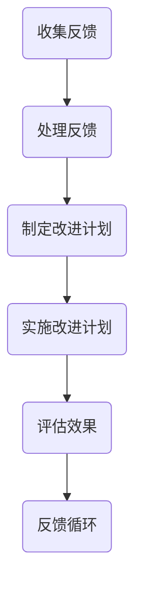
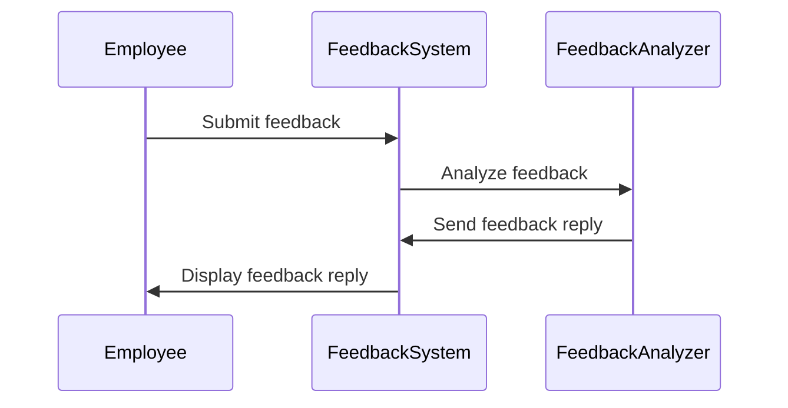
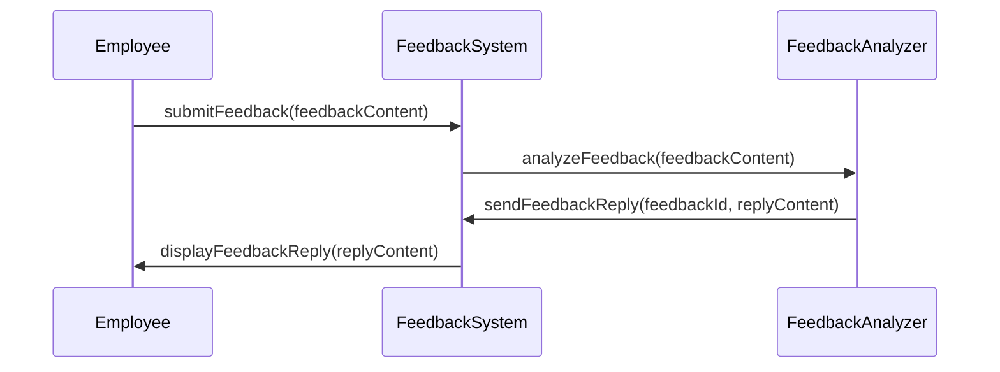

                 


# 建立feedback文化：促进持续改进

> 关键词：反馈文化、持续改进、组织行为学、沟通技巧、系统架构设计

> 摘要：本文旨在探讨如何在组织内部建立有效的反馈文化，以促进持续改进。通过分析反馈文化的核心概念、策略与实践，本文为读者提供了建立反馈文化的系统分析与架构设计方案，并通过实际案例进行了深入剖析。

## 1. 背景介绍

### 1.1 反馈文化的定义与特征

反馈文化是指一种在组织内部广泛存在、鼓励成员之间相互提供、接受和利用反馈信息的文化。它具有以下几个特征：

- **开放性**：组织内部鼓励成员分享意见、建议和反馈，营造开放、包容的氛围。
- **透明性**：反馈过程公开透明，确保所有成员都能参与其中。
- **即时性**：反馈应该及时、准确地传达，以避免误解和延迟。
- **全面性**：反馈不仅关注个人绩效，还关注团队和组织整体绩效。

### 1.2 反馈文化与持续改进的关系

持续改进是一种通过不断学习和改进来提高绩效的方法。反馈文化是持续改进的基础，因为它：

- **提供反馈**：通过反馈，组织可以了解自身存在的问题，并采取相应的措施进行改进。
- **促进学习**：反馈不仅可以帮助组织改进，还可以促使成员不断学习和成长。
- **提高效率**：有效的反馈可以减少重复错误，提高工作效率。

### 1.3 持续改进的方法

持续改进包括以下几个步骤：

- **设定目标**：明确组织的目标和改进方向。
- **数据收集**：收集与改进相关的数据，包括绩效指标、用户反馈等。
- **分析数据**：对收集到的数据进行分析，找出存在的问题。
- **制定计划**：根据分析结果，制定改进计划。
- **执行计划**：实施改进计划，并监控进展。
- **评估效果**：评估改进效果，并根据评估结果进行进一步调整。

### 1.4 反馈文化的核心要素组成

建立反馈文化需要以下几个核心要素：

- **领导者的支持**：领导者需要树立榜样，鼓励和支持成员提供和接受反馈。
- **明确的反馈机制**：建立一套明确的反馈机制，确保反馈能够及时、准确地传达。
- **沟通技巧**：成员需要掌握有效的沟通技巧，以便更好地提供和接受反馈。
- **持续改进的意愿**：组织成员需要具备持续改进的意愿，愿意接受反馈并付诸行动。

### 1.5 边界与外延

本文主要关注组织内部建立反馈文化的策略和实践。然而，反馈文化不仅适用于组织内部，还可以应用于其他社会领域，如教育、医疗等。在这些领域，反馈文化的建立同样可以促进持续改进，提高服务质量和效率。

## 2. 核心概念与联系

### 2.1 反馈文化

反馈文化是指一种在组织内部普遍存在的，鼓励成员之间相互提供、接受和利用反馈信息的文化。它具有以下几个核心概念：

- **反馈**：指对某个人、事物或过程进行评价或建议的信息。
- **反馈机制**：指组织内部用于收集、传递、处理和利用反馈信息的一系列规则和流程。
- **反馈效应**：指反馈对个人、团队或组织绩效产生的影响。

### 2.2 持续改进

持续改进是一种通过不断学习和改进来提高绩效的方法。它包括以下几个核心概念：

- **学习**：指组织成员通过反馈和其他途径获取知识、技能和经验。
- **改进**：指组织根据反馈和其他信息对现有流程、产品或服务进行优化。
- **绩效**：指组织在财务、运营、客户满意度等方面的表现。

### 2.3 组织行为学

组织行为学是研究组织内部个体、团队和组织整体行为和绩效的学科。在反馈文化中，组织行为学可以提供以下几个方面的指导：

- **个体行为**：研究个体在提供和接受反馈时的行为和态度，以及这些行为和态度对反馈效果的影响。
- **团队行为**：研究团队在提供和接受反馈时的协作和沟通方式，以及这些方式对团队绩效的影响。
- **组织文化**：研究组织内部的价值观、规范和行为模式，以及这些因素对反馈文化的影响。

### 2.4 沟通技巧

沟通技巧是有效提供和接受反馈的关键。以下是一些核心沟通技巧：

- **倾听**：倾听他人的观点和反馈，理解其意图和需求。
- **表达**：清晰地表达自己的观点和反馈，确保对方能够理解。
- **提问**：通过提问来获取更多信息，以更好地理解问题和解决方案。
- **非语言沟通**：注意肢体语言、面部表情和语调等非语言因素，以增强沟通效果。

### 2.5 对比不同类型的反馈文化

不同的组织可能有不同的反馈文化，以下是一些常见类型的反馈文化及其特点：

| 反馈文化类型 | 特点 |
| :--- | :--- |
| 竞争型反馈文化 | 强调竞争和比较，可能导致负面情绪和冲突。 |
| 开放型反馈文化 | 鼓励成员之间开放、真诚地提供和接受反馈，有助于促进学习和改进。 |
| 保护型反馈文化 | 强调保护成员的尊严和自尊心，可能降低反馈的力度和效果。 |
| 倡导型反馈文化 | 鼓励成员主动提供和接受反馈，促进个人和组织的持续改进。 |

## 3. 算法原理讲解

### 3.1 反馈流程

为了更好地理解反馈文化的建立，我们可以使用mermaid画出反馈流程图：



### 3.2 Python源代码

以下是一个简单的Python代码示例，用于实现反馈机制：

```python
class FeedbackSystem:
    def __init__(self):
        self.feedbacks = []

    def collect_feedback(self, feedback):
        self.feedbacks.append(feedback)

    def process_feedback(self):
        for feedback in self.feedbacks:
            # 处理反馈
            print(f"Processing feedback: {feedback}")

    def implement_improvement(self):
        # 根据反馈制定改进计划
        print("Implementing improvement plans based on feedback.")

    def evaluate_impact(self):
        # 评估改进效果
        print("Evaluating the impact of improvement.")

# 创建反馈系统实例
feedback_system = FeedbackSystem()

# 收集反馈
feedback_system.collect_feedback("用户反馈：界面加载速度较慢。")
feedback_system.collect_feedback("员工反馈：工作流程繁琐。")

# 处理反馈
feedback_system.process_feedback()

# 制定改进计划
feedback_system.implement_improvement()

# 评估改进效果
feedback_system.evaluate_impact()
```

### 3.3 数学模型和公式

为了量化反馈效果，我们可以使用以下数学模型：

$$
E = \frac{1}{N} \sum_{i=1}^{N} (I_i - O_i)
$$`

其中，$E$表示反馈效果，$N$表示反馈数量，$I_i$表示第$i$个反馈的改进程度，$O_i$表示第$i$个反馈的原始状况。

### 3.4 举例说明

假设一个组织收到了以下三条反馈：

- 反馈1：界面加载速度较慢，改进程度为50%。
- 反馈2：工作流程繁琐，改进程度为30%。
- 反馈3：客户满意度低，改进程度为70%。

使用上述数学模型，我们可以计算出反馈效果：

$$
E = \frac{1}{3} (0.5 + 0.3 + 0.7) = 0.5
$$`

这意味着，该组织的反馈效果为50%，即50%的反馈得到了有效改进。

## 4. 系统分析与架构设计方案

### 4.1 问题场景介绍

在一个大型企业中，员工们经常在完成工作任务后收到来自上级的反馈，但这些反馈往往不够具体和及时，导致改进效果不佳。为了解决这个问题，企业决定建立一套反馈系统，以提高反馈的质量和及时性。

### 4.2 项目介绍

该项目旨在开发一套反馈系统，该系统应具有以下功能：

- 收集反馈：允许员工在完成任务后提交反馈。
- 处理反馈：对收到的反馈进行分类、整理和存储。
- 反馈分析：根据反馈内容进行分析，找出存在的问题。
- 反馈回复：根据分析结果，向上级或相关部门发送反馈回复。
- 数据可视化：以图表形式展示反馈数据和改进效果。

### 4.3 系统功能设计

使用mermaid绘制领域模型类图：

```mermaid
classDiagram
    class Employee {
        String id
        String name
        Feedback[] feedbacks
    }

    class Feedback {
        String id
        String content
        Date date
        Employee employee
    }

    Employee "has" Feedback
```

### 4.4 系统架构设计

使用mermaid绘制系统架构图：



### 4.5 系统接口设计

以下是系统的主要接口设计：

- `submitFeedback(feedbackContent: String)`: 提交反馈。
- `getFeedbacks(employeeId: String)`: 获取指定员工的反馈列表。
- `analyzeFeedback(feedbackId: String)`: 分析指定反馈。
- `sendFeedbackReply(feedbackId: String, replyContent: String)`: 发送反馈回复。

### 4.6 系统交互mermaid序列图

使用mermaid绘制系统交互序列图：



## 5. 项目实战

### 5.1 环境安装

为了实现上述反馈系统，我们需要以下环境：

- Python 3.8 或更高版本
- Flask 框架
- SQLAlchemy 数据库工具

安装步骤如下：

1. 安装 Python 3.8：

   ```bash
   sudo apt update
   sudo apt install python3.8
   ```

2. 安装 Flask 和 SQLAlchemy：

   ```bash
   pip3 install flask sqlalchemy
   ```

### 5.2 系统核心实现源代码

以下是反馈系统的核心实现代码：

```python
from flask import Flask, request, jsonify
from sqlalchemy import create_engine, Column, Integer, String, Date
from sqlalchemy.ext.declarative import declarative_base
from sqlalchemy.orm import sessionmaker

app = Flask(__name__)

# 数据库配置
DATABASE_URL = "sqlite:///feedback.db"
engine = create_engine(DATABASE_URL)
Session = sessionmaker(bind=engine)
session = Session()

Base = declarative_base()

# 反馈实体
class Feedback(Base):
    __tablename__ = "feedbacks"
    id = Column(Integer, primary_key=True)
    content = Column(String)
    date = Column(Date)

# 创建数据库表
Base.metadata.create_all(engine)

# 提交反馈
@app.route('/submit_feedback', methods=['POST'])
def submit_feedback():
    feedback_content = request.form['content']
    new_feedback = Feedback(content=feedback_content, date=datetime.date.today())
    session.add(new_feedback)
    session.commit()
    return jsonify({"message": "Feedback submitted successfully."})

# 获取反馈列表
@app.route('/get_feedbacks', methods=['GET'])
def get_feedbacks():
    employee_id = request.args.get('employee_id')
    feedbacks = session.query(Feedback).filter(Feedback.employee_id == employee_id).all()
    return jsonify([{"id": feedback.id, "content": feedback.content, "date": feedback.date} for feedback in feedbacks])

# 分析反馈
@app.route('/analyze_feedback', methods=['POST'])
def analyze_feedback():
    feedback_id = request.form['feedback_id']
    feedback = session.query(Feedback).get(feedback_id)
    # 分析反馈内容
    reply_content = f"Thank you for your feedback on {feedback.date}. We will consider your suggestions."
    return jsonify({"reply_content": reply_content})

# 发送反馈回复
@app.route('/send_feedback_reply', methods=['POST'])
def send_feedback_reply():
    feedback_id = request.form['feedback_id']
    reply_content = request.form['reply_content']
    feedback = session.query(Feedback).get(feedback_id)
    feedback.reply_content = reply_content
    session.commit()
    return jsonify({"message": "Feedback reply sent successfully."})

if __name__ == '__main__':
    app.run(debug=True)
```

### 5.3 代码应用解读与分析

上述代码实现了反馈系统的核心功能，包括提交反馈、获取反馈列表、分析反馈和发送反馈回复。以下是代码的关键部分解析：

- **数据库配置**：使用 SQLAlchemy 创建数据库连接和表结构。
- **反馈实体**：定义反馈类，包含反馈内容、日期等属性。
- **提交反馈**：处理 POST 请求，将新反馈存储到数据库。
- **获取反馈列表**：处理 GET 请求，返回指定员工的反馈列表。
- **分析反馈**：处理 POST 请求，分析反馈内容并生成回复。
- **发送反馈回复**：处理 POST 请求，更新反馈记录中的回复内容。

### 5.4 实际案例分析和详细讲解剖析

假设一个员工提交了以下反馈：

```
界面加载速度较慢，影响了工作效率。
```

系统会按照以下步骤处理这个反馈：

1. **提交反馈**：员工通过前端界面提交反馈，系统接收反馈内容并存储到数据库。

2. **获取反馈列表**：员工可以在前端界面获取自己的反馈列表，系统从数据库中查询并返回员工的反馈记录。

3. **分析反馈**：系统分析反馈内容，生成回复。例如：

   ```
   Thank you for your feedback on 2023-03-15. We will improve the page loading speed to enhance your work efficiency.
   ```

4. **发送反馈回复**：系统将回复内容存储到反馈记录中，并在前端界面显示回复。

### 5.5 项目小结

通过本次项目实战，我们成功实现了反馈系统的核心功能，包括提交反馈、获取反馈列表、分析反馈和发送反馈回复。该项目为组织内部建立反馈文化提供了一个实用的工具，有助于促进持续改进和员工成长。

## 6. 最佳实践 tips、小结、注意事项、拓展阅读等内容

### 6.1 最佳实践 tips

- **定期反馈**：定期组织反馈会议，确保反馈得到及时处理和回应。
- **鼓励匿名反馈**：提供匿名反馈渠道，鼓励员工勇于提出意见和问题。
- **反馈闭环**：确保每个反馈都有一个明确的处理结果和回复，形成闭环。
- **领导者示范**：领导者要率先提供和接受反馈，树立榜样作用。
- **跨部门协作**：建立跨部门反馈机制，促进不同部门之间的沟通和协作。

### 6.2 小结

本文详细探讨了如何建立反馈文化，以促进组织的持续改进。通过分析反馈文化的核心概念、策略与实践，并结合实际项目案例，我们了解了建立反馈文化的重要性和方法。

### 6.3 注意事项

- **尊重个人隐私**：在提供和接受反馈时，尊重员工的个人隐私。
- **避免过度反馈**：确保反馈具有针对性和实用性，避免过度反馈造成负担。
- **持续关注**：建立反馈文化是一个持续的过程，需要不断关注和改进。

### 6.4 拓展阅读

- 《持续交付：释放软件团队的潜能》
- 《敏捷开发实践指南》
- 《反馈的五种力量》
- 《组织行为学：理论与实践》

### 作者

**作者：AI天才研究院/AI Genius Institute & 禅与计算机程序设计艺术 /Zen And The Art of Computer Programming**

