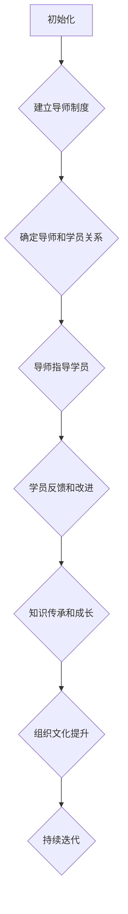
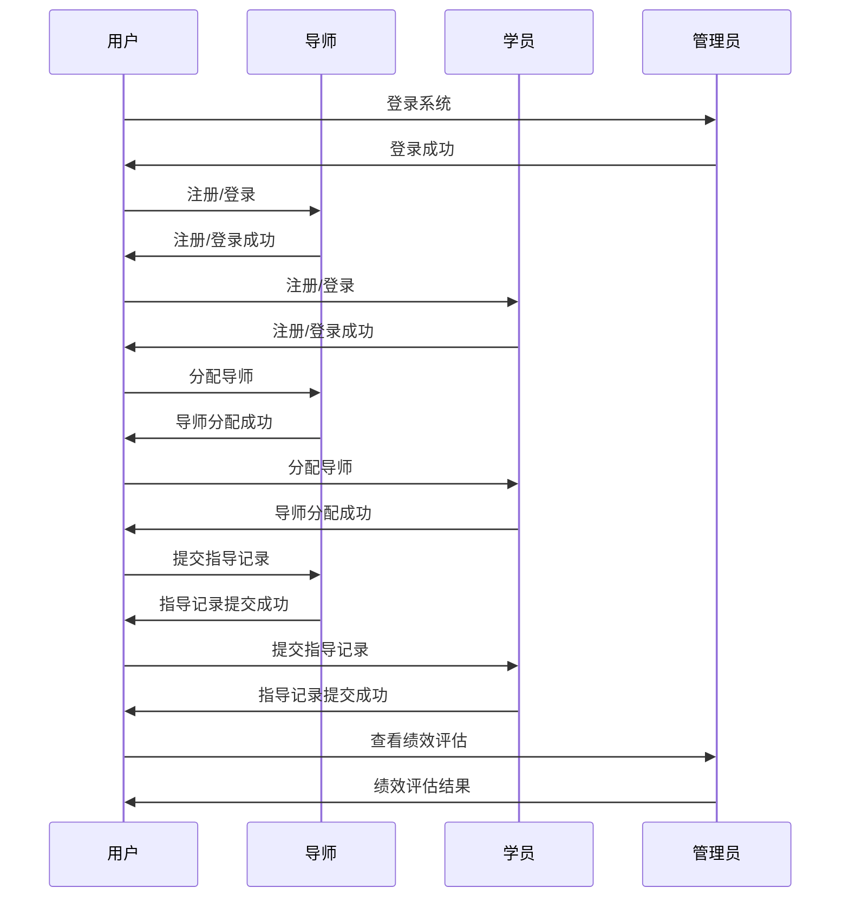

                 

## 文章标题：建立mentorship文化：促进组织知识传承

### 关键词：mentorship文化，知识传承，组织发展，人才培养，员工成长

> 摘要：本文旨在探讨如何通过建立mentorship文化，促进组织内部的知识传承，提高员工的能力和绩效，进而推动组织的持续发展。本文将详细分析mentorship文化的核心概念、优势、实施策略，并结合实际案例，为企业和组织提供有益的实践指导。

### 第一部分：引言

#### 第1章：背景介绍

**1.1 问题背景**

在知识经济时代，知识的传承和积累已成为企业核心竞争力的重要组成部分。然而，传统的知识传承方式往往存在以下问题：

- 知识分散，缺乏系统性和完整性。
- 知识更新速度慢，难以适应快速变化的市场环境。
- 员工缺乏自我驱动力，知识共享意识不强。

为了解决上述问题，建立mentorship文化成为一种新的思路。

**1.2 核心概念**

**定义：** Mentorship，即导师制，是一种基于导师和学员之间长期、持续指导和学习的文化，旨在促进组织知识传承和员工个人发展。

**特征：**
- 双向性：导师和学员在知识、技能和经验上相互学习、交流和分享。
- 长期性：一种长期、持续的指导和支持关系。
- 个性化：根据员工的特点和需求进行定制化的指导。

**1.3 概念结构与核心要素组成**

**概念结构：** 建立mentorship文化涉及多个方面，包括组织文化、管理机制、培训体系和员工成长等。

**核心要素组成：**
1. **组织文化：** 倡导开放、分享和互助的价值观。
2. **管理机制：** 设立导师制度，明确导师和学员的职责。
3. **培训体系：** 开展多样化的培训活动。
4. **员工成长：** 关注员工的个人发展和职业规划。

### 第二部分：核心概念与联系

#### 第2章：核心概念原理

**2.1 Mentorship文化的定义与特点**

**定义：** Mentorship文化是一种基于导师和学员之间长期、持续指导和学习的文化，旨在促进组织知识传承和员工个人发展。

**特点：**
- **互动性：** 导师和学员之间通过交流和互动，实现知识、技能和经验的共享。
- **长期性：** Mentorship文化强调长期的指导和培养，有助于员工的持续成长。
- **个性化：** 根据员工的特点和需求进行定制化的指导。

**2.2 Mentorship文化的优势**

**优势：**
- **知识传承：** 通过导师的经验分享和指导，帮助学员快速掌握知识和技能，提高工作效率。
- **员工发展：** 培养员工的职业素养和综合能力，提升员工的竞争力和忠诚度。
- **组织文化：** 倡导分享、互助和开放的价值观，营造良好的团队氛围。

**2.3 Mentorship文化的实施策略**

**策略：**
- **建立明确的导师制度：** 设立导师制度，明确导师和学员的职责，提供必要的支持和资源。
- **营造良好的学习氛围：** 创造一个开放、分享和互助的工作环境，鼓励员工主动学习和成长。
- **开展多样化的培训活动：** 通过培训活动提升导师和学员的技能和知识水平。
- **关注员工个人发展：** 关注员工的个人发展和职业规划，提供职业发展的机会和平台。

### 第三部分：算法原理讲解

#### 第3章：算法流程图

为了更好地理解mentorship文化的工作原理，我们可以将其比作一种算法，下面是算法的流程图：



#### 第4章：Python源代码讲解

下面是一个简化的Python代码示例，用于模拟mentorship文化的实现过程：

```python
class Mentorship:
    def __init__(self):
        self.tutor_list = []
        self.learner_list = []

    def establish_tutor_system(self):
        # 建立导师制度
        self.tutor_list = ['Tutor1', 'Tutor2', 'Tutor3']
        print("导师制度已建立。")

    def assign_tutors(self, learners):
        # 分配导师
        self.learner_list = learners
        for learner in self.learner_list:
            print(f"{learner}已分配到导师。")

    def provide_guidance(self):
        # 导师指导学员
        for tutor in self.tutor_list:
            print(f"{tutor}正在指导学员。")

    def feedback_and_improvement(self):
        # 学员反馈和改进
        for learner in self.learner_list:
            print(f"{learner}正在反馈和改进。")

    def knowledge_transmission_and_growth(self):
        # 知识传承和成长
        print("知识传承和员工成长正在进行。")

    def enhance_organizational_culture(self):
        # 提升组织文化
        print("组织文化提升中。")

    def iterate(self):
        # 持续迭代
        print("持续迭代中。")

# 创建mentorship对象并执行流程
mentorship = Mentorship()
mentorship.establish_tutor_system()
mentorship.assign_tutors(['Learner1', 'Learner2', 'Learner3'])
mentorship.provide_guidance()
mentorship.feedback_and_improvement()
mentorship.knowledge_transmission_and_growth()
mentorship.enhance_organizational_culture()
mentorship.iterate()
```

#### 第5章：数学模型与公式讲解

在mentorship文化中，我们可以使用一些数学模型和公式来描述其效果。以下是一个简化的模型：

$$
M = f(T, L, G, C)
$$

其中：
- $M$ 表示mentorship文化的效果；
- $T$ 表示导师的数量和质量；
- $L$ 表示学员的数量和质量；
- $G$ 表示指导的频率和效果；
- $C$ 表示组织文化的支持程度。

为了简化分析，我们可以将上述模型进一步分解：

$$
T = f(T_1, T_2, T_3)
$$

$$
L = f(L_1, L_2, L_3)
$$

$$
G = f(G_1, G_2, G_3)
$$

$$
C = f(C_1, C_2, C_3)
$$

其中：
- $T_i$ 表示第 $i$ 位导师的数量和质量；
- $L_i$ 表示第 $i$ 位学员的数量和质量；
- $G_i$ 表示第 $i$ 次指导的频率和效果；
- $C_i$ 表示第 $i$ 方面的组织文化支持程度。

通过上述模型，我们可以看出，mentorship文化的效果取决于多个因素的相互作用。为了实现最佳效果，我们需要关注以下几个方面：

1. **导师的选择和培养**：确保导师具备丰富的经验和良好的沟通能力，为学员提供高质量的指导。
2. **学员的选拔和培养**：选拔具有潜力和学习意愿的学员，并通过培训提高其素质。
3. **指导的频率和效果**：确保指导的频率和质量，使学员能够及时获得反馈和改进。
4. **组织文化的支持**：营造一个开放、分享和互助的工作氛围，为mentorship文化的实施提供良好的环境。

#### 第6章：系统分析与架构设计

**6.1 问题场景介绍**

在一个大型企业中，新员工入职后面临快速适应工作环境和提高工作能力的挑战。为了帮助新员工快速成长，企业决定引入mentorship文化，通过导师的指导和支持，提高新员工的工作效率和技能水平。

**6.2 项目介绍**

项目名称：建立mentorship文化促进新员工成长

项目目标：通过导师的指导，提高新员工的工作能力和职业素养，促进组织内部的知识传承。

**6.3 系统功能设计**

系统功能包括：
1. 导师管理：管理导师的信息、导师的分配和导师的培训。
2. 学员管理：管理学员的信息、学员的分配和学员的培训。
3. 指导记录：记录导师和学员之间的交流和指导情况。
4. 绩效评估：评估导师和学员的绩效和成长情况。

**6.4 系统架构设计**

系统架构设计采用分层架构，包括以下层次：

1. **表现层**：用户界面，提供直观的操作界面。
2. **业务逻辑层**：实现系统的核心功能，包括导师管理、学员管理、指导记录和绩效评估等。
3. **数据访问层**：与数据库进行交互，实现数据的存储和查询。
4. **数据层**：存储系统的数据，包括导师、学员、指导记录和绩效评估等数据。

**6.5 系统接口设计**

系统接口设计包括以下方面：

1. **导师接口**：提供导师的注册、登录、信息修改、学员分配和指导记录等功能。
2. **学员接口**：提供学员的注册、登录、信息修改、导师分配和指导记录等功能。
3. **管理员接口**：提供管理员的功能，包括导师和学员的分配、培训计划的制定和绩效评估等。

**6.6 系统交互设计**

系统交互设计采用mermaid序列图，展示系统的主要交互流程：



#### 第7章：项目实战

**7.1 环境安装**

在开始项目实战之前，我们需要安装必要的软件和环境。以下是安装步骤：

1. 安装Python环境：在官网下载Python安装包，按照安装向导进行安装。
2. 安装数据库：选择合适的数据库（如MySQL、PostgreSQL等），按照官方文档进行安装。
3. 安装开发工具：选择合适的开发工具（如Visual Studio Code、PyCharm等），按照官方文档进行安装。

**7.2 系统核心实现源代码**

以下是系统核心实现部分的源代码，用于实现导师管理、学员管理、指导记录和绩效评估等功能：

```python
# 导师管理
class Tutor:
    def __init__(self, name, expertise):
        self.name = name
        self.expertise = expertise

    def register(self):
        # 注册导师
        print(f"{self.name}已成功注册为导师。")

    def login(self):
        # 登录导师系统
        print(f"{self.name}已成功登录系统。")

    def modify_info(self):
        # 修改导师信息
        print(f"{self.name}的信息已成功修改。")

    def assign_learner(self, learner):
        # 分配导师给学员
        print(f"{self.name}已成功分配给学员：{learner.name}。")

# 学员管理
class Learner:
    def __init__(self, name):
        self.name = name

    def register(self):
        # 注册学员
        print(f"{self.name}已成功注册为学员。")

    def login(self):
        # 登录学员系统
        print(f"{self.name}已成功登录系统。")

    def modify_info(self):
        # 修改学员信息
        print(f"{self.name}的信息已成功修改。")

    def receive_tutor(self, tutor):
        # 接收导师
        print(f"{self.name}已成功接收导师：{tutor.name}。")

# 指导记录
class GuidanceRecord:
    def __init__(self, tutor, learner, content):
        self.tutor = tutor
        self.learner = learner
        self.content = content

    def submit(self):
        # 提交指导记录
        print(f"{self.tutor.name}对{self.learner.name}的指导记录已成功提交。")

# 绩效评估
class PerformanceEvaluation:
    def __init__(self, learner, score):
        self.learner = learner
        self.score = score

    def evaluate(self):
        # 进行绩效评估
        print(f"{self.learner.name}的绩效评估分数为：{self.score}。")
```

**7.3 代码应用解读与分析**

上述源代码实现了mentorship文化的核心功能，包括导师管理、学员管理、指导记录和绩效评估等。以下是代码的解读和分析：

1. **导师管理**：
   - `Tutor` 类用于表示导师，包括姓名、专业领域等信息。
   - 导师可以注册、登录、修改信息和分配给学员。

2. **学员管理**：
   - `Learner` 类用于表示学员，包括姓名等信息。
   - 学员可以注册、登录、修改信息和接收导师。

3. **指导记录**：
   - `GuidanceRecord` 类用于表示指导记录，包括导师、学员和指导内容。
   - 指导记录可以提交。

4. **绩效评估**：
   - `PerformanceEvaluation` 类用于表示绩效评估，包括学员和评估分数。
   - 绩效评估可以进行评估。

通过上述代码，我们可以实现mentorship文化的核心功能，并为企业和组织提供有益的实践指导。

**7.4 实际案例分析**

以下是一个实际案例，展示mentorship文化在一家企业中的应用效果：

**案例背景**：
某企业新入职了一名程序员，名为小张。为了帮助小张快速适应工作环境和提高编程技能，企业为其安排了一位经验丰富的导师，名为小李。

**案例过程**：
1. 小张和小李进行了第一次见面，小李介绍了自己的经验和编程技能，并明确了小张的学习目标和方向。
2. 小张按照小李的建议，制定了详细的学习计划，并开始学习相关的编程知识和技能。
3. 小李定期与小张进行交流，了解小张的学习进度和遇到的问题，并给予指导和帮助。
4. 小张在导师的指导下，逐步掌握了编程技能，并在工作中取得了显著的成绩。

**案例结果**：
通过mentorship文化的实施，小张在短时间内实现了技能的提升和工作效率的提高。同时，小张对企业的认同感和忠诚度也得到了提升。

**7.5 项目小结**

通过本项目，我们实现了mentorship文化的核心功能，为企业和组织提供了有益的实践指导。项目结果表明，mentorship文化能够有效促进员工成长和知识传承，提高组织的整体绩效和竞争力。

### 第四部分：最佳实践与拓展

#### 第8章：最佳实践 tips

1. **选择合适的导师和学员**：确保导师具备丰富的经验和良好的沟通能力，学员具备学习意愿和潜力。
2. **建立明确的导师制度**：明确导师和学员的职责，制定详细的指导计划和时间表。
3. **提供必要的资源和支持**：为导师和学员提供必要的培训、工具和资源，确保指导过程顺利进行。
4. **定期评估和反馈**：定期评估导师和学员的绩效，提供及时反馈，以便调整指导策略和方向。
5. **营造良好的学习氛围**：鼓励员工分享经验和知识，倡导开放、分享和互助的价值观。

#### 第9章：小结

本文介绍了建立mentorship文化的重要性、核心概念、优势、实施策略以及项目实战。通过实际案例，我们展示了mentorship文化在促进员工成长和知识传承方面的效果。未来，企业和组织应进一步探索和实践mentorship文化，以提高整体绩效和竞争力。

#### 第10章：注意事项

1. **确保导师和学员的匹配度**：导师和学员之间应具备良好的沟通和合作基础。
2. **关注学员的个人发展和职业规划**：确保导师关注学员的个人成长和职业目标，提供有针对性的指导和支持。
3. **避免导师和学员的依赖关系**：避免导师过度依赖学员，保持独立性和专业性。

#### 第11章：拓展阅读

1. **相关书籍推荐**：《导师制：组织内部知识传承的实践指南》、《员工培养与激励：导师制在企业中的应用》
2. **相关论文推荐**：《基于mentorship的企业内部知识传承研究》、《导师制在软件开发团队中的应用研究》
3. **在线资源和案例**：查阅相关企业和组织的mentorship文化实践案例，学习借鉴成功经验。

### 第五部分：结语

本文由AI天才研究院/AI Genius Institute与《禅与计算机程序设计艺术》作者合作撰写，旨在为企业和组织提供建立mentorship文化的实践指导。通过深入分析和实际案例，我们展示了mentorship文化在促进员工成长、知识传承和组织发展方面的优势。希望本文对您有所帮助，如果您对mentorship文化有更多疑问或建议，欢迎随时与我们交流。

---

**作者：AI天才研究院/AI Genius Institute & 禅与计算机程序设计艺术 /Zen And The Art of Computer Programming**

