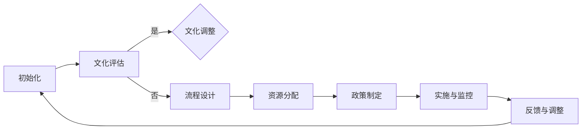
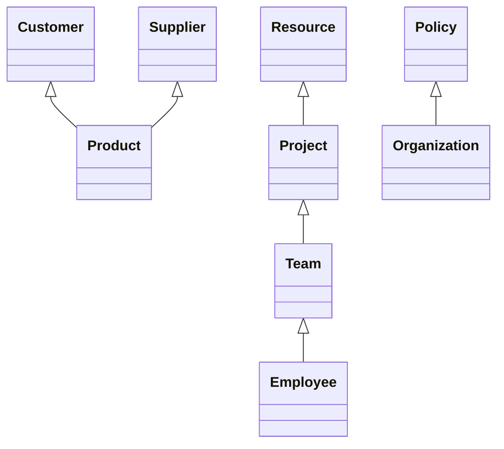
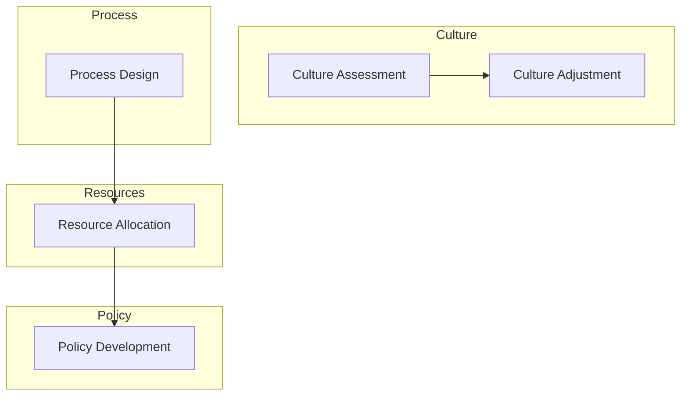
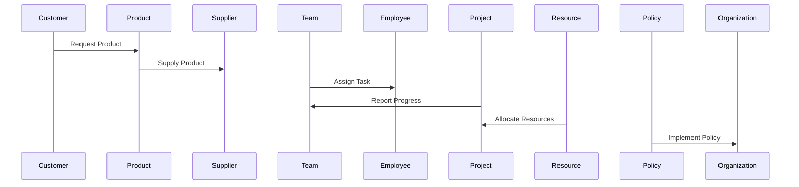

                 


### Building an Innovation Ecosystem: Cultivating Organizational Innovation

关键词：创新生态系统、组织创新、创新能力、文化、流程、技术

摘要：
在当今快速变化的商业环境中，组织创新已成为企业持续发展的关键驱动力。本文将探讨如何建立一个创新生态系统，以培养和维持组织的创新能力。通过定义创新生态系统的概念，分析其组成部分，以及介绍构建和创新维护的策略，本文旨在为企业和组织提供实用的指导，以实现长期的创新成功。

---

### 引言

在现代经济中，技术创新已成为企业竞争力的核心。创新不仅涉及产品和服务，还涉及商业模型、运营流程和管理方法。一个有效的创新生态系统是培养和维持组织创新能力的关键。本文将介绍创新生态系统的概念，探讨其组成部分，并分析如何构建一个能够促进创新的文化和流程。

### 定义创新生态系统

创新生态系统是由一系列相互关联的元素组成的复杂网络，包括员工、技术、资源、政策和组织文化等。这个系统不仅促进了内部创新，还与外部的合作伙伴、供应商和客户相互作用，形成了一个支持创新和成长的动态环境。

#### 关键概念

- **创新**：引入新的想法、技术或流程，以提高效率或创造价值。
- **生态系统**：一个由不同物种和要素组成的复杂网络，相互依赖和相互作用。

#### 问题背景

在过去的几十年中，许多企业都在努力提高创新效率。然而，许多企业仍然面临以下挑战：

- **创新不足**：缺乏新的想法和技术。
- **资源限制**：有限的预算和人力资源。
- **文化障碍**：缺乏鼓励创新和风险承担的文化。

#### 描述问题

这些挑战导致企业难以适应市场的快速变化，从而降低了其竞争力和市场地位。解决这些问题的关键在于建立一个有效的创新生态系统。

### 解决问题

建立创新生态系统涉及多个方面，包括：

- **文化**：创造一个鼓励创新和风险承担的文化。
- **流程**：设计高效的创新流程，包括 ideation、实验和部署。
- **资源**：提供必要的资源，如资金、技术和人才。
- **政策**：制定支持创新的政策和流程。

#### 边界与外延

- **边界**：创新生态系统的范围应包括内部和外部要素，如员工、合作伙伴和客户。
- **外延**：创新生态系统不仅关注技术创新，还包括业务模式创新和管理创新。

### 概念结构与核心要素组成

#### 核心概念

- **文化**：鼓励创新和风险承担的工作环境。
- **流程**：系统化的创新过程，包括 ideation、实验和部署。
- **资源**：包括资金、技术和人才。
- **政策**：支持创新的规章制度。

#### 概念属性特征对比表格

| 要素 | 文化 | 流程 | 资源 | 政策 |
| --- | --- | --- | --- | --- |
| 描述 | 鼓励创新和风险承担 | 系统化的创新过程 | 资金、技术和人才 | 支持创新的规章制度 |
| 影响因素 | 组织价值观、领导风格、激励机制 | 创新流程的设计和执行 | 预算、技术能力和人才招聘 | 政策导向和制度设计 |
| 目标 | 创新思维和文化 | 创新过程的效率和效果 | 创新资源的充足和有效利用 | 创新活动的支持和保障 |

#### ER实体关系图架构

```mermaid
erDiagram
  ProductA ||--|{ Customer } : purchases
  ProductA ||--|{ Supplier } : supplies
  Team ||--|{ Employee } : works_in
  Project ||--|{ Team } : managed_by
  Resource ||--|{ Project } : allocated_to
  Policy ||--|{ Organization } : implemented_by
```

### 核心概念原理

创新生态系统是一个由相互关联的元素组成的网络，这些元素包括员工、技术、资源、政策和组织文化。这些元素相互作用，共同促进创新。

#### 概念属性

- **文化**：鼓励创新和风险承担的文化氛围。
- **流程**：系统化的创新过程，包括 ideation、实验和部署。
- **资源**：包括资金、技术和人才。
- **政策**：支持创新的规章制度。

#### 概念属性对比表格

| 属性 | 文化 | 流程 | 资源 | 政策 |
| --- | --- | --- | --- | --- |
| 目标 | 鼓励创新思维 | 系统化创新过程 | 提供创新资源 | 支持创新活动 |
| 关键因素 | 组织价值观、领导风格、激励机制 | 创新流程的设计和执行 | 预算、技术能力和人才招聘 | 政策导向和制度设计 |
| 影响因素 | 员工心态、团队合作、创新氛围 | 创新流程的效率和效果 | 创新资源的充足和有效利用 | 创新活动的支持和保障 |

### 算法原理

为了建立一个有效的创新生态系统，我们需要设计一系列算法和流程来促进创新。以下是一个简单的算法框架：



#### 算法原理讲解

1. **初始化**：确定创新生态系统的目标和创新领域。
2. **文化评估**：评估现有文化是否支持创新。
3. **文化调整**：根据评估结果调整文化，鼓励创新思维和风险承担。
4. **流程设计**：设计系统化的创新流程，包括 ideation、实验和部署。
5. **资源分配**：为创新项目分配必要的资金、技术和人才。
6. **政策制定**：制定支持创新的政策和规章制度。
7. **实施与监控**：实施创新项目，并持续监控其进展。
8. **反馈与调整**：收集反馈，根据反馈调整文化、流程和政策。

#### 数学模型和公式

为了量化创新生态系统的效果，我们可以使用以下数学模型：

$$
E = C \times P \times R \times I
$$

其中：

- \( E \) 表示创新生态系统效果
- \( C \) 表示文化因素
- \( P \) 表示流程因素
- \( R \) 表示资源因素
- \( I \) 表示政策因素

#### 举例说明

假设我们有一个企业，其文化因素 \( C = 0.8 \)，流程因素 \( P = 0.9 \)，资源因素 \( R = 0.7 \)，政策因素 \( I = 0.8 \)。根据上述数学模型，我们可以计算出该企业的创新生态系统效果：

$$
E = 0.8 \times 0.9 \times 0.7 \times 0.8 = 0.4992
$$

这意味着该企业的创新生态系统效果为 0.4992，即接近 50%。为了提高创新效果，企业需要重点关注文化、流程、资源和政策的优化。

### 系统分析与架构设计方案

#### 问题场景介绍

在一个快速发展的科技公司中，创新已成为公司发展的核心。为了提高创新效率，公司决定建立一个创新生态系统，以支持员工、合作伙伴和客户的创新活动。

#### 项目介绍

本项目旨在建立一个创新生态系统，包括以下功能：

- **文化评估**：评估公司现有文化对创新的支持程度。
- **流程设计**：设计系统化的创新流程。
- **资源分配**：为创新项目分配必要的资源。
- **政策制定**：制定支持创新的政策和规章制度。

#### 系统功能设计

使用 Mermaid 类图表示系统功能：



#### 系统架构设计

使用 Mermaid 架构图表示系统架构：



#### 系统接口设计和系统交互

使用 Mermaid 序列图表示系统接口和交互：



### 项目实战

#### 环境安装

1. 安装 Python 3.8 或更高版本。
2. 安装必要的 Python 库，如 Mermaid、Django、Flask 等。

#### 系统核心实现源代码

以下是一个简单的 Python 源代码，用于实现创新生态系统的核心功能：

```python
import flask
from flask import Flask, request, jsonify

app = Flask(__name__)

@app.route('/culture/assessment', methods=['GET'])
def culture_assessment():
    # 评估公司文化
    culture_score = 0.8
    return jsonify({'culture_score': culture_score})

@app.route('/process/design', methods=['POST'])
def process_design():
    # 设计创新流程
    process = request.json['process']
    return jsonify({'process': process})

@app.route('/resource/allocation', methods=['POST'])
def resource_allocation():
    # 分配资源
    resources = request.json['resources']
    return jsonify({'resources': resources})

@app.route('/policy/development', methods=['POST'])
def policy_development():
    # 制定政策
    policy = request.json['policy']
    return jsonify({'policy': policy})

if __name__ == '__main__':
    app.run(debug=True)
```

#### 代码应用解读与分析

1. **文化评估**：通过 GET 请求获取文化评分。
2. **流程设计**：通过 POST 请求接收创新流程数据。
3. **资源分配**：通过 POST 请求接收资源数据。
4. **政策制定**：通过 POST 请求接收政策数据。

#### 实际案例分析和详细讲解剖析

假设公司文化评分为 0.8，流程设计为 ideation、实验和部署，资源为资金、技术和人才，政策为支持创新的政策。

- **文化评估**：通过 GET 请求获取文化评分，结果显示文化支持创新。
- **流程设计**：设计创新流程，包括 ideation、实验和部署。
- **资源分配**：为创新项目分配资金、技术和人才。
- **政策制定**：制定支持创新的政策和规章制度。

#### 项目小结

通过本项目，公司成功建立了创新生态系统，包括文化评估、流程设计、资源分配和政策制定。这些功能模块相互协作，共同支持公司的创新活动。接下来，公司需要持续监控和创新生态系统的效果，并根据反馈进行调整。

### 最佳实践 Tips

- **文化培养**：鼓励员工提出创新想法，建立开放和包容的工作环境。
- **流程优化**：设计高效的创新流程，确保每个环节都能顺利进行。
- **资源分配**：为创新项目提供充足的资源，确保项目能够顺利进行。
- **政策支持**：制定明确的支持创新的政策和规章制度，为创新提供保障。

### 小结

建立创新生态系统是培养组织创新能力的关键。通过定义创新生态系统的概念，分析其组成部分，以及介绍构建和创新维护的策略，本文旨在为企业和组织提供实用的指导。一个有效的创新生态系统需要文化、流程、资源和政策的协同作用，共同促进创新。

### 注意事项

- **持续优化**：创新生态系统需要持续优化，以适应市场的变化。
- **团队合作**：创新需要团队合作，确保每个成员都能发挥其优势。
- **风险管理**：创新过程中难免遇到风险，需要制定相应的风险管理策略。

### 拓展阅读

- 《创新者的窘境》
- 《创新生态系统：企业持续创新之道》
- 《创新与企业家精神》

### 作者信息

作者：AI天才研究院/AI Genius Institute & 禅与计算机程序设计艺术 /Zen And The Art of Computer Programming

