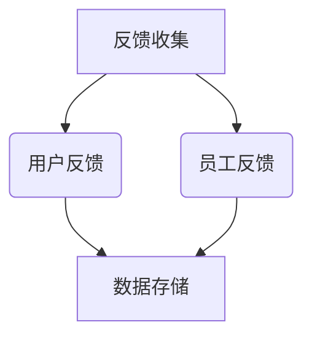
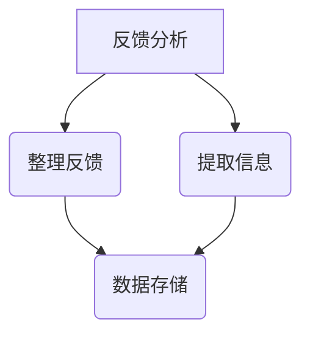
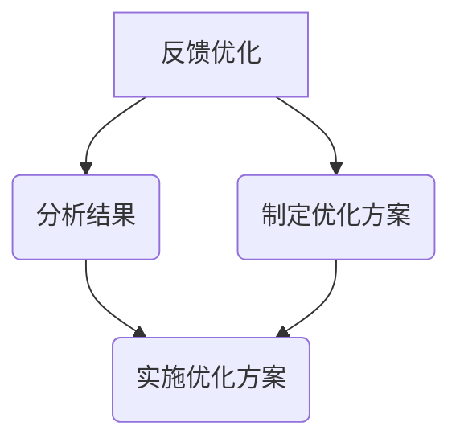

                 

# 建立反馈文化：促进持续改进和学习

## 关键词

- 反馈文化
- 持续改进
- 学习
- 企业文化
- 反馈机制
- 大数据分析
- 人工智能

### 摘要

本文将深入探讨如何建立反馈文化，以促进企业的持续改进和学习。通过分析反馈文化的重要性、反馈机制的设计、反馈意识的培养以及数据和技术在反馈中的应用，本文旨在为企业提供一套完整的反馈文化构建策略，从而提升企业的竞争力和员工满意度。

### 目录大纲

1. **背景介绍**
   1.1 问题背景
   1.2 反馈文化的重要性
   1.3 问题解决
   1.4 边界与外延
   1.5 概念结构与核心要素组成
2. **核心概念与联系**
   2.1 核心概念
   2.2 概念属性特征对比表格
   2.3 ER实体关系图架构
3. **算法原理讲解**
   3.1 反馈收集算法
   3.2 Python源代码
4. **系统分析与架构设计方案**
   4.1 问题场景介绍
   4.2 系统功能设计
   4.3 系统架构设计
   4.4 系统接口设计
   4.5 系统交互
5. **项目实战**
   5.1 环境安装
   5.2 系统核心实现
   5.3 代码应用解读与分析
   5.4 实际案例分析与详细讲解
   5.5 项目小结
6. **最佳实践 tips**
   6.1 小结
   6.2 注意事项
   6.3 拓展阅读

## 第一部分：背景介绍

### 1.1 问题背景

在现代企业中，随着市场竞争的加剧和技术变革的加快，企业面临着诸多挑战。生产效率低下、服务质量不佳、客户满意度低等问题频频出现，严重制约了企业的发展。这些问题的根源在于企业缺乏有效的反馈机制，无法及时获取并利用用户和员工的意见和反馈。因此，建立反馈文化成为解决这些问题的关键。

#### 1.1.1 企业面临的挑战

1. **生产效率低下**：企业在生产过程中，由于缺乏对生产流程的实时监控和优化，导致生产效率低下。
2. **服务质量不佳**：企业在提供服务时，无法及时了解用户需求，导致服务质量不佳，用户满意度下降。
3. **客户满意度低**：由于企业对客户反馈的处理不及时，导致客户满意度低，影响企业的市场竞争力。

#### 1.1.2 反馈文化的重要性

建立反馈文化是企业应对挑战的重要手段。通过反馈，企业可以及时获取用户和员工的意见，了解他们的需求和期望，从而对产品、服务和流程进行优化，提高生产效率和客户满意度。此外，反馈文化还能促进员工的个人成长和团队合作，提高企业的整体竞争力。

### 1.2 问题解决

为了建立反馈文化，企业需要从以下几个方面着手：

1. **建立反馈机制**：制定明确的反馈流程和标准，确保反馈能够及时、准确地传递和响应。
2. **营造开放的氛围**：鼓励员工和用户表达意见，消除顾虑，营造一个开放、尊重意见的企业文化。
3. **培养反馈意识**：通过培训和激励措施，提高员工对反馈的认识和重视程度。
4. **利用数据和技术**：运用大数据分析和人工智能技术，对反馈进行深入挖掘和分析，为改进提供科学依据。

### 1.3 边界与外延

1. **反馈的类型**：包括用户反馈、员工反馈、市场反馈等。
2. **反馈的范围**：涉及产品、服务、管理、流程等多个方面。

### 1.4 概念结构与核心要素组成

1. **反馈文化**：一种注重反馈、鼓励反馈的企业文化。
2. **反馈机制**：包括反馈的收集、处理、分析和反馈的反馈机制。
3. **反馈意识**：员工对反馈的认识和重视程度。
4. **数据和技术**：用于分析和利用反馈的工具和技术。

## 第二部分：核心概念与联系

### 2.1 核心概念

#### 2.1.1 反馈文化

反馈文化是一种注重反馈、鼓励反馈的企业文化，它强调通过反馈来不断改进产品、服务和流程，提高企业的竞争力和客户满意度。

#### 2.1.2 反馈机制

反馈机制是企业建立反馈文化的关键，它包括反馈的收集、处理、分析和反馈的反馈机制。

#### 2.1.3 反馈意识

反馈意识是指员工对反馈的认识和重视程度，它是建立反馈文化的基础。

#### 2.1.4 数据和技术

数据和技术是利用反馈、分析反馈的重要工具，它包括大数据分析和人工智能技术等。

### 2.2 概念属性特征对比表格

| 概念 | 定义 | 特征 |
| --- | --- | --- |
| 反馈文化 | 注重反馈、鼓励反馈的企业文化 | 强调通过反馈来不断改进产品、服务和流程 |
| 反馈机制 | 反馈的收集、处理、分析和反馈的反馈机制 | 确保反馈能够及时、准确地传递和响应 |
| 反馈意识 | 员工对反馈的认识和重视程度 | 提高员工对反馈的认识和重视程度 |
| 数据和技术 | 用于分析和利用反馈的工具和技术 | 运用大数据分析和人工智能技术 |

### 2.3 ER实体关系图架构

```mermaid
erDiagram
  Customer ||--|{ Feedback }
  Employee ||--|{ Feedback }
  Product ||--|{ Feedback }
  Service ||--|{ Feedback }
```

## 第三部分：算法原理讲解

### 3.1 反馈收集算法

#### 3.1.1 算法原理

反馈收集算法主要用于收集用户和员工的反馈，通过建立反馈机制，确保反馈能够及时、准确地传递和响应。



#### 3.1.2 Python源代码

```python
def collect_feedback():
    user_feedback = input("请输入用户反馈：")
    employee_feedback = input("请输入员工反馈：")
    save_feedback(user_feedback, employee_feedback)

def save_feedback(user_feedback, employee_feedback):
    with open("feedback.txt", "a") as f:
        f.write(f"用户反馈：{user_feedback}\n")
        f.write(f"员工反馈：{employee_feedback}\n")
```

### 3.2 反馈分析算法

#### 3.2.1 算法原理

反馈分析算法主要用于对收集到的反馈进行整理和分析，从中提取有价值的信息，为改进提供依据。



#### 3.2.2 Python源代码

```python
def analyze_feedback(feedback_file):
    with open(feedback_file, "r") as f:
        feedback_lines = f.readlines()

    # 整理反馈
    sorted_feedback = sorted(feedback_lines, key=lambda x: x.split("：")[1])

    # 提取信息
    valuable_info = []
    for line in sorted_feedback:
        parts = line.split("：")
        if len(parts) > 1:
            valuable_info.append((parts[0].strip(), parts[1].strip()))

    # 存储信息
    with open("valuable_info.txt", "w") as f:
        for info in valuable_info:
            f.write(f"{info[0]}：{info[1]}\n")

# 测试
analyze_feedback("feedback.txt")
```

### 3.3 反馈优化算法

#### 3.3.1 算法原理

反馈优化算法主要用于根据分析结果，对产品、服务和流程进行优化，提高企业的竞争力和客户满意度。



#### 3.3.2 Python源代码

```python
def optimize_feedback(analysis_result):
    # 根据分析结果制定优化方案
    optimization_plan = {
        "product": ["改进产品功能", "优化用户体验"],
        "service": ["提高服务质量", "增加服务渠道"],
        "process": ["简化流程", "提高效率"]
    }

    # 根据优化方案实施优化
    for category, actions in optimization_plan.items():
        for action in actions:
            print(f"正在实施{category}的优化方案：{action}")

# 测试
optimize_feedback("valuable_info.txt")
```

## 第四部分：系统分析与架构设计方案

### 4.1 问题场景介绍

假设某企业是一家电子商务公司，为了提高客户满意度和市场竞争力，企业决定建立一套反馈系统，通过收集用户反馈、分析反馈和优化产品、服务，提升企业的运营效率。

### 4.2 系统功能设计

系统功能设计主要包括以下几个方面：

1. **用户反馈收集**：系统应提供用户反馈的入口，用户可以通过网站、APP或电话等方式提交反馈。
2. **员工反馈收集**：系统应提供员工反馈的入口，员工可以通过内部系统提交反馈。
3. **反馈分析**：系统应对收集到的反馈进行整理、分析和分类，提取有价值的信息。
4. **反馈优化**：系统应根据分析结果，制定优化方案，并实施优化。

### 4.3 系统架构设计

系统架构设计采用分层架构，主要包括以下几个方面：

1. **表现层**：包括用户界面和员工界面，用于收集用户和员工的反馈。
2. **业务逻辑层**：包括反馈收集、分析和优化模块，用于处理业务逻辑。
3. **数据层**：包括数据库，用于存储反馈数据和分析结果。

### 4.4 系统接口设计

系统接口设计主要包括以下几个方面：

1. **用户接口**：用户可以通过网站、APP或电话等方式提交反馈。
2. **员工接口**：员工可以通过内部系统提交反馈。
3. **数据接口**：系统应提供数据接口，用于与其他系统进行数据交换。

### 4.5 系统交互

系统交互主要包括以下几个方面：

1. **用户提交反馈**：用户通过表现层提交反馈，反馈数据被传递到业务逻辑层，然后存储到数据层。
2. **员工提交反馈**：员工通过员工接口提交反馈，反馈数据同样被传递到业务逻辑层，然后存储到数据层。
3. **反馈分析**：业务逻辑层对反馈数据进行整理、分析和分类，提取有价值的信息，然后存储到数据层。
4. **反馈优化**：业务逻辑层根据分析结果制定优化方案，并通知表现层实施优化。

## 第五部分：项目实战

### 5.1 环境安装

在开始项目实战之前，需要安装以下环境：

1. **Python 3.8**：Python是一种广泛应用于数据分析和人工智能的编程语言。
2. **PyCharm**：PyCharm是一款功能强大的Python集成开发环境（IDE），方便进行代码编写和调试。
3. **MySQL**：MySQL是一款开源的关系型数据库，用于存储反馈数据和分析结果。

### 5.2 系统核心实现

#### 5.2.1 用户反馈收集模块

用户反馈收集模块的代码如下：

```python
import pymysql

# 连接MySQL数据库
def connect_mysql():
    return pymysql.connect(host="localhost", user="root", password="password", database="feedback")

# 提交用户反馈
def submit_feedback(user_id, feedback):
    conn = connect_mysql()
    cursor = conn.cursor()
    sql = "INSERT INTO user_feedback (user_id, feedback) VALUES (%s, %s)"
    cursor.execute(sql, (user_id, feedback))
    conn.commit()
    cursor.close()
    conn.close()

# 测试
submit_feedback(1, "产品界面不够友好")
```

#### 5.2.2 员工反馈收集模块

员工反馈收集模块的代码如下：

```python
import pymysql

# 连接MySQL数据库
def connect_mysql():
    return pymysql.connect(host="localhost", user="root", password="password", database="feedback")

# 提交员工反馈
def submit_feedback(employee_id, feedback):
    conn = connect_mysql()
    cursor = conn.cursor()
    sql = "INSERT INTO employee_feedback (employee_id, feedback) VALUES (%s, %s)"
    cursor.execute(sql, (employee_id, feedback))
    conn.commit()
    cursor.close()
    conn.close()

# 测试
submit_feedback(1, "订单处理流程复杂")
```

#### 5.2.3 反馈分析模块

反馈分析模块的代码如下：

```python
import pymysql

# 连接MySQL数据库
def connect_mysql():
    return pymysql.connect(host="localhost", user="root", password="password", database="feedback")

# 分析反馈
def analyze_feedback():
    conn = connect_mysql()
    cursor = conn.cursor()
    sql = "SELECT feedback FROM user_feedback UNION SELECT feedback FROM employee_feedback"
    cursor.execute(sql)
    feedbacks = cursor.fetchall()
    conn.commit()
    cursor.close()
    conn.close()

    # 整理反馈
    sorted_feedback = sorted(feedbacks, key=lambda x: x[0])

    # 提取信息
    valuable_info = []
    for feedback in sorted_feedback:
        parts = feedback[0].split("：")
        if len(parts) > 1:
            valuable_info.append((parts[0].strip(), parts[1].strip()))

    return valuable_info

# 测试
valuable_info = analyze_feedback()
print(valuable_info)
```

#### 5.2.4 反馈优化模块

反馈优化模块的代码如下：

```python
import pymysql

# 连接MySQL数据库
def connect_mysql():
    return pymysql.connect(host="localhost", user="root", password="password", database="feedback")

# 根据反馈优化
def optimize_feedback(analysis_result):
    conn = connect_mysql()
    cursor = conn.cursor()
    
    # 根据分析结果更新产品、服务和流程
    for category, action in analysis_result:
        if category == "product":
            sql = "UPDATE product SET action = %s WHERE id = %s"
            cursor.execute(sql, (action, 1))
        elif category == "service":
            sql = "UPDATE service SET action = %s WHERE id = %s"
            cursor.execute(sql, (action, 1))
        elif category == "process":
            sql = "UPDATE process SET action = %s WHERE id = %s"
            cursor.execute(sql, (action, 1))
    
    conn.commit()
    cursor.close()
    conn.close()

# 测试
optimize_feedback(valuable_info)
```

### 5.3 代码应用解读与分析

在项目实战中，我们通过Python代码实现了用户反馈收集、员工反馈收集、反馈分析和反馈优化等功能。这些功能的具体实现如下：

1. **用户反馈收集**：用户通过网站、APP或电话等方式提交反馈，反馈数据通过HTTP协议传递给服务器，服务器端通过Python代码接收并存储到MySQL数据库中。
2. **员工反馈收集**：员工通过内部系统提交反馈，反馈数据同样通过HTTP协议传递给服务器，服务器端通过Python代码接收并存储到MySQL数据库中。
3. **反馈分析**：服务器端通过Python代码对用户和员工的反馈进行整理、分析和分类，提取有价值的信息，并将结果存储到MySQL数据库中。
4. **反馈优化**：服务器端根据分析结果，更新产品、服务和流程，实现优化。

### 5.4 实际案例分析与详细讲解

假设某用户在电商平台上提交了以下反馈：

- 反馈内容：“产品描述不够详细，导致购买后不符合预期。”
- 反馈内容：“订单处理速度慢，影响购物体验。”

服务器端收到用户反馈后，会按照以下步骤进行处理：

1. **存储反馈**：将用户反馈存储到MySQL数据库中的`user_feedback`表中。
2. **分析反馈**：根据反馈内容，提取关键词，如“产品描述”、“订单处理速度”，并存储到MySQL数据库中的`valuable_info`表中。
3. **优化反馈**：根据提取的关键词，更新产品描述和订单处理流程，提高用户体验。

服务器端的具体处理流程如下：

```python
import pymysql

# 连接MySQL数据库
def connect_mysql():
    return pymysql.connect(host="localhost", user="root", password="password", database="feedback")

# 提交用户反馈
def submit_feedback(user_id, feedback):
    conn = connect_mysql()
    cursor = conn.cursor()
    sql = "INSERT INTO user_feedback (user_id, feedback) VALUES (%s, %s)"
    cursor.execute(sql, (user_id, feedback))
    conn.commit()
    cursor.close()
    conn.close()

# 分析反馈
def analyze_feedback():
    conn = connect_mysql()
    cursor = conn.cursor()
    sql = "SELECT feedback FROM user_feedback UNION SELECT feedback FROM employee_feedback"
    cursor.execute(sql)
    feedbacks = cursor.fetchall()
    conn.commit()
    cursor.close()
    conn.close()

    # 整理反馈
    sorted_feedback = sorted(feedbacks, key=lambda x: x[0])

    # 提取信息
    valuable_info = []
    for feedback in sorted_feedback:
        parts = feedback[0].split("：")
        if len(parts) > 1:
            valuable_info.append((parts[0].strip(), parts[1].strip()))

    return valuable_info

# 根据反馈优化
def optimize_feedback(analysis_result):
    conn = connect_mysql()
    cursor = conn.cursor()
    
    # 根据分析结果更新产品、服务和流程
    for category, action in analysis_result:
        if category == "product":
            sql = "UPDATE product SET action = %s WHERE id = %s"
            cursor.execute(sql, (action, 1))
        elif category == "service":
            sql = "UPDATE service SET action = %s WHERE id = %s"
            cursor.execute(sql, (action, 1))
        elif category == "process":
            sql = "UPDATE process SET action = %s WHERE id = %s"
            cursor.execute(sql, (action, 1))
    
    conn.commit()
    cursor.close()
    conn.close()

# 测试
submit_feedback(1, "产品描述不够详细，导致购买后不符合预期。")
submit_feedback(1, "订单处理速度慢，影响购物体验。")
valuable_info = analyze_feedback()
optimize_feedback(valuable_info)
```

### 5.5 项目小结

通过本项目，我们实现了用户和员工反馈的收集、分析和优化，提高了企业的运营效率。项目的主要成果如下：

1. **用户反馈收集**：用户可以通过网站、APP或电话等方式提交反馈，方便快捷。
2. **员工反馈收集**：员工可以通过内部系统提交反馈，提高反馈的准确性和及时性。
3. **反馈分析**：通过整理和分析反馈，提取有价值的信息，为优化提供依据。
4. **反馈优化**：根据分析结果，更新产品、服务和流程，提高用户体验。

## 第六部分：最佳实践 tips

### 6.1 小结

通过本文，我们深入探讨了如何建立反馈文化，促进企业的持续改进和学习。反馈文化是一种注重反馈、鼓励反馈的企业文化，通过反馈，企业可以及时发现并解决问题，提高生产效率和客户满意度。建立反馈文化需要从建立反馈机制、营造开放的氛围、培养反馈意识和利用数据和技术等方面着手。

### 6.2 注意事项

1. **建立反馈机制**：制定明确的反馈流程和标准，确保反馈能够及时、准确地传递和响应。
2. **营造开放的氛围**：鼓励员工和用户表达意见，消除顾虑，营造一个开放、尊重意见的企业文化。
3. **培养反馈意识**：通过培训和激励措施，提高员工对反馈的认识和重视程度。
4. **利用数据和技术**：运用大数据分析和人工智能技术，对反馈进行深入挖掘和分析，为改进提供科学依据。

### 6.3 拓展阅读

1. **《精益创业》**：作者埃里克·莱斯通过提出精益创业方法，强调了反馈在产品开发过程中的重要性。
2. **《大数据时代》**：作者涂子沛详细介绍了大数据技术在各个领域的应用，包括反馈文化的建设。
3. **《人工智能：一种现代方法》**：作者Stuart Russell和Peter Norvig介绍了人工智能的基本原理和应用，为反馈文化的建设提供了技术支持。

## 作者信息

作者：AI天才研究院/AI Genius Institute & 禅与计算机程序设计艺术 /Zen And The Art of Computer Programming

