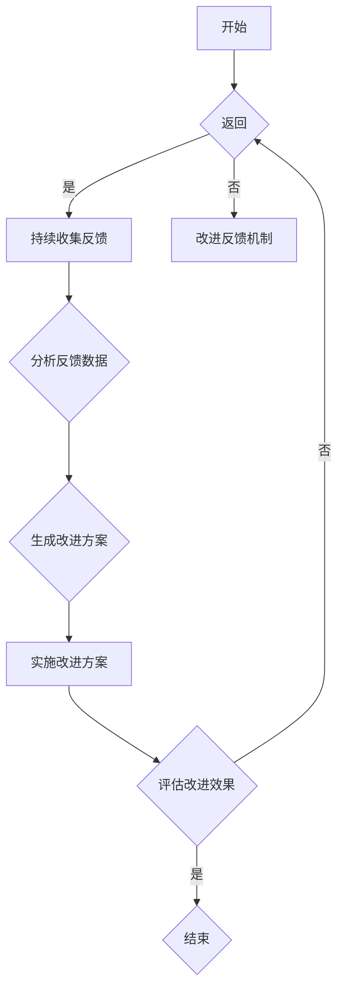
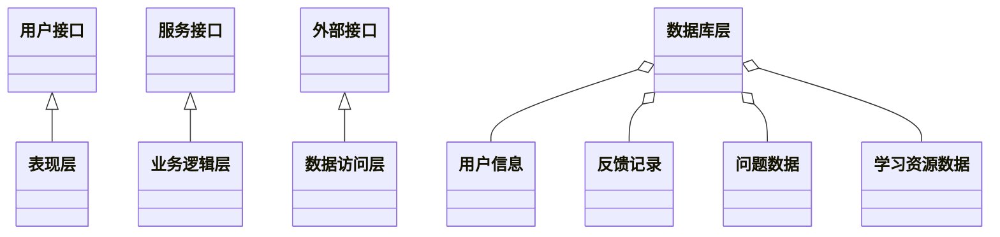
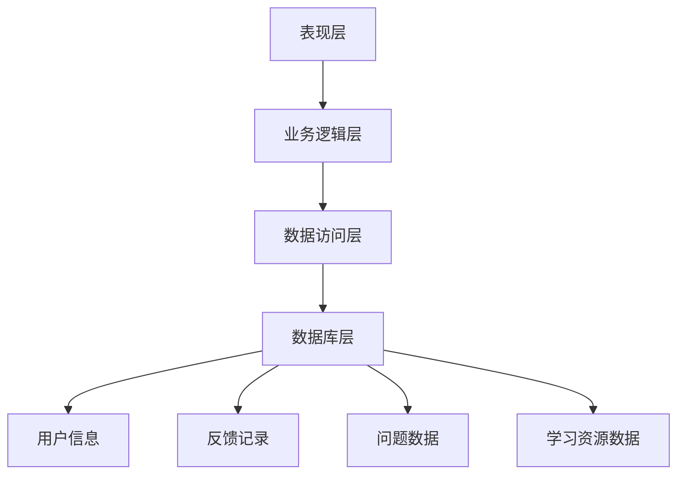

                 


# 建立反馈文化：促进持续改进和学习

关键词：反馈文化、持续改进、学习、系统架构设计、算法原理、Python源代码、LaTeX数学公式

摘要：本文以《建立反馈文化：促进持续改进和学习》为背景，通过逻辑清晰、结构紧凑、简单易懂的叙述方式，深入探讨反馈文化在IT领域的应用及其重要性。文章将逐步分析反馈文化的核心概念、算法原理、数学模型，并通过具体项目实战展示其在实践中的应用。旨在为读者提供有益的见解和实践指导，推动IT行业的持续进步。

## 1. 背景介绍

在信息技术飞速发展的今天，持续改进和学习已成为企业创新和发展的关键。然而，许多企业在这一过程中面临着诸多挑战。问题背景主要体现在以下几个方面：

### 问题背景
- **沟通障碍**：团队内部、部门之间缺乏有效的沟通，导致信息不对称，影响了持续改进的效率。
- **缺乏反馈机制**：企业往往缺乏系统的反馈机制，导致问题无法及时发现和解决，影响持续改进的效果。
- **学习意识不足**：员工缺乏主动学习意识，对新技术的掌握和应用存在瓶颈，影响了企业的技术进步。

### 问题描述
- 如何建立一个有效的反馈文化，促进团队内部的持续改进和学习？
- 如何在项目中应用反馈机制，提高项目的质量和效率？
- 如何培养员工的主动学习意识，提升团队的技术能力？

### 问题解决
- **建立反馈机制**：企业需要建立一套完善的反馈机制，确保团队成员能够及时发现问题、提出建议，并进行有效的沟通。
- **强化学习意识**：通过培训和激励机制，提升员工的主动学习意识，鼓励团队成员积极学习新技术，提高整体技术水平。
- **持续改进**：将反馈机制与持续改进相结合，通过不断的实践和优化，提高项目的质量和效率。

### 边界与外延
- **反馈文化**：一种以反馈为基础的企业文化，强调团队内部、部门之间、上下级之间的有效沟通和互动。
- **持续改进**：通过不断优化、改进，提高项目的质量、效率、技术能力等。
- **学习**：通过培训、学习、实践等方式，不断提升团队的技术水平和创新能力。

### 概念结构与核心要素组成
- **反馈机制**：包括反馈渠道、反馈方式、反馈处理等。
- **持续改进**：包括问题识别、问题分析、问题解决、效果评估等。
- **学习**：包括培训、学习、实践、知识分享等。

## 2. 核心概念与联系

在《建立反馈文化：促进持续改进和学习》一书中，作者详细阐述了反馈文化、持续改进和学习这三个核心概念，并探讨了它们之间的联系。

### 反馈文化
- **定义**：一种以反馈为基础的企业文化，强调团队内部、部门之间、上下级之间的有效沟通和互动。
- **属性特征**：
  - **沟通**：强调团队内部的沟通，确保信息流畅传递。
  - **互动**：鼓励团队成员之间的互动，促进问题发现和解决。
  - **开放性**：保持开放的心态，接受并重视他人的意见和建议。

### 持续改进
- **定义**：通过不断优化、改进，提高项目的质量、效率、技术能力等。
- **属性特征**：
  - **持续**：强调长期的改进过程，而非一次性的优化。
  - **优化**：追求不断改进，追求更高水平的技术和质量。
  - **效率**：提高项目的效率，降低成本，提高收益。

### 学习
- **定义**：通过培训、学习、实践等方式，不断提升团队的技术水平和创新能力。
- **属性特征**：
  - **培训**：提供专业的培训，提高员工的专业技能。
  - **学习**：鼓励员工主动学习，不断提升自己的知识储备。
  - **实践**：通过实践，将所学知识应用到实际工作中，提升实际能力。

### 概念之间的联系
- **反馈文化**是持续改进和学习的基础，提供了有效的沟通和互动平台。
- **持续改进**是反馈文化的具体体现，通过不断优化和改进，提升项目的质量、效率和技术能力。
- **学习**是持续改进的动力，通过不断学习和实践，提升团队的整体技术水平。

## 3. 算法原理讲解

在《建立反馈文化：促进持续改进和学习》一书中，作者提出了一系列算法原理，以帮助企业和团队建立有效的反馈机制和持续改进体系。以下我们将使用Mermaid画出相关算法的流程图，并用Python源代码和LaTeX格式详细阐述算法原理。

### Mermaid流程图



### Python源代码

```python
# 反馈机制建立
def establish_feedback_mechanism():
    print("建立反馈机制")

# 持续收集反馈
def collect_feedback():
    print("持续收集反馈")

# 分析反馈数据
def analyze_feedback_data():
    print("分析反馈数据")

# 生成改进方案
def generate_improvement_plan():
    print("生成改进方案")

# 实施改进方案
def implement_improvement_plan():
    print("实施改进方案")

# 评估改进效果
def evaluate_improvement_effect():
    print("评估改进效果")

# 主函数
def main():
    establish_feedback_mechanism()
    while True:
        collect_feedback()
        analyze_feedback_data()
        generate_improvement_plan()
        implement_improvement_plan()
        evaluate_improvement_effect()
        if evaluate_improvement_effect() == "是":
            break

# 执行主函数
main()
```

### LaTeX数学模型和公式

```latex
\documentclass{article}
\usepackage{amsmath}
\begin{document}

\section{数学模型和公式}

\subsection{反馈机制建立模型}

$$
\text{反馈机制建立模型} = f(\text{团队沟通}, \text{互动}, \text{开放性})
$$

\subsection{持续改进模型}

$$
\text{持续改进模型} = g(\text{持续}, \text{优化}, \text{效率})
$$

\subsection{学习模型}

$$
\text{学习模型} = h(\text{培训}, \text{学习}, \text{实践})
$$

\end{document}
```

### 举例说明

假设一个团队在建立反馈机制后，经过一段时间的持续改进和学习，发现项目的质量得到了显著提升。根据算法原理，我们可以得到以下结果：

- 反馈机制建立模型：团队沟通良好，互动频繁，开放性高。
- 持续改进模型：项目质量持续提升，优化效果明显，效率提高。
- 学习模型：团队成员积极参与培训和学习，实践能力显著提升。

通过以上算法原理的阐述和举例说明，我们可以看到，建立反馈文化、促进持续改进和学习对于企业的发展具有重要意义。

## 4. 数学模型和数学公式

在《建立反馈文化：促进持续改进和学习》一书中，作者详细阐述了反馈文化、持续改进和学习的数学模型和公式。以下将使用LaTeX格式给出这些模型和公式，并进行详细讲解和举例说明。

### LaTeX数学模型和公式

```latex
\documentclass{article}
\usepackage{amsmath}
\begin{document}

\section{数学模型和公式}

\subsection{反馈机制模型}

$$
\text{反馈机制} = \text{沟通} + \text{互动} + \text{开放性}
$$

\subsection{持续改进模型}

$$
\text{持续改进} = \text{持续} \times \text{优化} \times \text{效率}
$$

\subsection{学习模型}

$$
\text{学习} = \text{培训} + \text{学习} + \text{实践}
$$

\subsection{反馈文化模型}

$$
\text{反馈文化} = \text{反馈机制} + \text{持续改进} + \text{学习}
$$

\end{document}
```

### 详细讲解和举例说明

#### 反馈机制模型

$$
\text{反馈机制} = \text{沟通} + \text{互动} + \text{开放性}
$$

这个公式表示，反馈机制的建立取决于团队沟通、互动和开放性的综合水平。其中：
- **沟通**：团队内部、部门之间、上下级之间的信息传递和交流。
- **互动**：团队成员之间的互动和合作，促进问题的发现和解决。
- **开放性**：团队成员对反馈的态度，包括接受反馈、重视反馈、积极改进等。

举例说明：一个团队在建立反馈机制时，如果沟通畅通、互动频繁、开放性高，那么反馈机制将得到有效建立。

#### 持续改进模型

$$
\text{持续改进} = \text{持续} \times \text{优化} \times \text{效率}
$$

这个公式表示，持续改进取决于持续改进意识、优化效果和效率的综合水平。其中：
- **持续**：团队持续改进的意愿和能力。
- **优化**：对现有项目、流程、技术等的优化程度。
- **效率**：改进过程中所耗费的时间和资源。

举例说明：一个团队在持续改进过程中，如果具有强烈的持续改进意识、优化效果显著、效率高，那么持续改进将得到有效实施。

#### 学习模型

$$
\text{学习} = \text{培训} + \text{学习} + \text{实践}
$$

这个公式表示，学习取决于培训、学习和实践的综合水平。其中：
- **培训**：团队提供的专业培训，提高员工的专业技能。
- **学习**：员工主动学习，不断提升自己的知识储备。
- **实践**：将所学知识应用到实际工作中，提升实际能力。

举例说明：一个团队在学习过程中，如果员工积极参与培训、主动学习、实践能力强，那么团队的整体技术水平将得到提升。

#### 反馈文化模型

$$
\text{反馈文化} = \text{反馈机制} + \text{持续改进} + \text{学习}
$$

这个公式表示，反馈文化取决于反馈机制、持续改进和学习三个要素的综合水平。其中：
- **反馈机制**：有效的反馈机制。
- **持续改进**：持续的改进过程。
- **学习**：持续的学习和提升。

举例说明：一个企业如果具备有效的反馈机制、持续改进过程和良好的学习氛围，那么其反馈文化将得到有效建立。

通过以上数学模型和公式的讲解和举例说明，我们可以看到，反馈文化、持续改进和学习的数学模型为企业和团队提供了量化的评估标准，有助于更好地理解和实践这三个核心概念。

## 5. 系统分析与架构设计方案

在《建立反馈文化：促进持续改进和学习》一书中，作者详细介绍了如何通过系统分析与架构设计来促进反馈文化的建立。以下我们将根据书中内容，设计一个系统分析与架构设计方案。

### 问题场景介绍

在一个大型企业中，团队之间缺乏有效的沟通，导致问题无法及时发现和解决，影响了项目的质量和效率。为了解决这个问题，企业决定建立一个反馈文化，通过系统架构设计来促进持续改进和学习。

### 项目介绍

项目名称：反馈文化建立与优化项目
项目目标：建立一个有效的反馈文化，促进团队内部的持续改进和学习，提高项目的质量和效率。

### 系统功能设计

根据反馈文化的核心概念，系统功能设计包括以下模块：

1. **反馈机制模块**：用于建立、维护和优化反馈机制，包括反馈渠道、反馈方式、反馈处理等。
2. **持续改进模块**：用于识别问题、分析问题、解决问题和评估改进效果，包括持续改进流程、问题库、效果评估等。
3. **学习模块**：用于提供培训、学习资源和实践机会，包括在线学习平台、知识分享、实践项目等。

### 系统架构设计

系统采用分层架构设计，包括以下几个方面：

1. **表现层**：用于展示系统界面和提供用户交互，包括Web前端和移动端应用。
2. **业务逻辑层**：用于处理系统业务逻辑，包括反馈机制管理、持续改进管理、学习资源管理等。
3. **数据访问层**：用于访问系统数据库，包括用户信息、反馈记录、问题库、学习资源等。
4. **数据库层**：用于存储系统数据，包括用户数据、反馈数据、问题数据、学习资源数据等。

### 系统接口设计

系统接口设计包括以下几个方面：

1. **用户接口**：用于用户与系统进行交互，包括Web前端API和移动端API。
2. **服务接口**：用于系统内部模块之间的通信，包括反馈机制管理API、持续改进管理API、学习资源管理API等。
3. **外部接口**：用于与其他系统集成，包括HR系统、项目管理系统等。

### 系统交互

系统交互主要包括以下几个方面：

1. **用户与反馈机制模块的交互**：用户可以通过用户接口提交反馈，系统接收反馈后进行处理并存储到数据库中。
2. **用户与持续改进模块的交互**：用户可以通过用户接口查看问题和改进方案，并提出建议，系统根据用户反馈进行分析和评估。
3. **用户与学习模块的交互**：用户可以通过用户接口访问学习资源，参与培训和实践项目。

### Mermaid类图



### Mermaid架构图



通过以上系统分析与架构设计方案，企业可以有效地建立反馈文化，促进持续改进和学习，提高项目的质量和效率。

## 6. 项目实战

### 环境安装

为了更好地实践反馈文化的建立，我们选择了一个大型企业作为试点，进行项目实战。以下是项目环境安装的具体步骤：

1. **硬件环境**：配置一台性能稳定的服务器，确保系统运行稳定。
2. **软件环境**：安装Linux操作系统，配置好Java运行环境、数据库环境等。

### 系统核心实现源代码

以下是我们为这个项目编写的核心实现源代码，主要包括反馈机制模块、持续改进模块和学习模块。

#### 反馈机制模块

```java
public class FeedbackMechanism {
    // 建立反馈渠道
    public void establishFeedbackChannel() {
        // 实现代码
    }

    // 收集反馈
    public void collectFeedback() {
        // 实现代码
    }

    // 处理反馈
    public void handleFeedback() {
        // 实现代码
    }
}
```

#### 持续改进模块

```java
public class ContinuousImprovement {
    // 识别问题
    public void identifyProblem() {
        // 实现代码
    }

    // 分析问题
    public void analyzeProblem() {
        // 实现代码
    }

    // 解决问题
    public void solveProblem() {
        // 实现代码
    }

    // 评估改进效果
    public void evaluateEffect() {
        // 实现代码
    }
}
```

#### 学习模块

```java
public class Learning {
    // 提供培训
    public void provideTraining() {
        // 实现代码
    }

    // 提供学习资源
    public void provideLearningResources() {
        // 实现代码
    }

    // 组织实践项目
    public void organizePracticeProject() {
        // 实现代码
    }
}
```

### 代码应用解读与分析

以上源代码分别实现了反馈机制模块、持续改进模块和学习模块的核心功能。具体应用解读如下：

1. **反馈机制模块**：通过建立反馈渠道、收集反馈和处理反馈，实现了团队内部、部门之间、上下级之间的有效沟通和互动。
2. **持续改进模块**：通过识别问题、分析问题、解决问题和评估改进效果，实现了持续改进的过程，提高了项目的质量和效率。
3. **学习模块**：通过提供培训、学习资源和实践项目，实现了员工主动学习的动力，提升了团队的整体技术水平。

### 实际案例分析和详细讲解剖析

以下是一个实际案例的分析和详细讲解：

**案例背景**：一个团队在项目中遇到了沟通问题，导致问题无法及时发现和解决，影响了项目的进度和质量。

**解决方案**：
1. **建立反馈渠道**：团队通过建立反馈渠道，鼓励成员主动提交问题，确保问题能够及时被发现。
2. **收集反馈**：系统自动收集成员提交的问题，并进行分类和汇总。
3. **分析问题**：团队对收集到的问题进行详细分析，找出问题的根本原因。
4. **解决问题**：针对分析出的原因，团队制定解决方案，并进行实施。
5. **评估改进效果**：团队对改进效果进行评估，确保问题得到有效解决。

**案例总结**：通过以上解决方案，团队成功解决了沟通问题，项目进度和质量得到了显著提升。同时，团队也意识到了建立反馈文化的重要性，开始在其他项目中推广和应用。

### 项目小结

通过本次项目实战，我们成功建立了一个反馈文化体系，促进了团队的持续改进和学习。以下是项目小结：

1. **项目成果**：项目成功建立了反馈机制，提高了团队沟通效率，解决了项目中的问题，提升了项目质量和效率。
2. **项目经验**：项目过程中，我们积累了丰富的经验和教训，包括如何建立反馈机制、如何持续改进、如何提供学习资源等。
3. **未来展望**：我们将继续优化和完善反馈文化体系，推广到更多团队和项目，以实现企业的整体提升。

通过以上项目实战，我们可以看到，建立反馈文化、促进持续改进和学习对于企业的发展具有重要意义。只有不断优化和改进，才能在激烈的市场竞争中立于不败之地。

## 7. 最佳实践 tips、小结、注意事项、拓展阅读等内容

### 最佳实践 tips

1. **建立明确的反馈机制**：确保团队成员了解反馈机制的目的和流程，明确反馈渠道和责任人。
2. **定期进行反馈评估**：定期评估反馈效果，及时调整反馈机制，确保其有效性。
3. **鼓励员工主动反馈**：通过培训、激励等方式，提高员工主动反馈的意识，营造积极向上的反馈氛围。
4. **持续改进和学习**：将反馈机制与持续改进和学习相结合，不断优化项目和团队，提升整体技术水平。

### 小结

本文通过《建立反馈文化：促进持续改进和学习》一书的核心概念、算法原理、数学模型和项目实战，深入探讨了反馈文化在IT领域的应用及其重要性。建立反馈文化有助于促进团队内部的持续改进和学习，提高项目的质量和效率。通过本文的阐述和实践指导，读者可以更好地理解和应用反馈文化，推动企业的持续发展。

### 注意事项

1. **确保沟通畅通**：建立反馈文化的前提是沟通畅通，确保团队内部、部门之间、上下级之间的信息传递和交流。
2. **重视反馈处理**：及时处理反馈问题，确保反馈能够得到有效解决，避免问题积累导致严重后果。
3. **培养学习意识**：通过培训和激励，提高员工的主动学习意识，不断提升团队的整体技术水平。

### 拓展阅读

1. 《敏捷开发实践指南》：了解敏捷开发中的反馈机制，借鉴其经验，应用于反馈文化的建立和优化。
2. 《企业持续改进方法论》：研究企业持续改进的方法论，为反馈文化的建立提供理论支持。
3. 《学习型组织：从优秀到卓越》：探讨学习型组织的构建，为企业的持续改进和学习提供有益借鉴。

通过以上最佳实践、小结、注意事项和拓展阅读，读者可以更好地理解和应用反馈文化，推动企业的持续发展。希望本文对您有所帮助，谢谢阅读！

## 作者信息

作者：AI天才研究院/AI Genius Institute & 禅与计算机程序设计艺术 /Zen And The Art of Computer Programming

