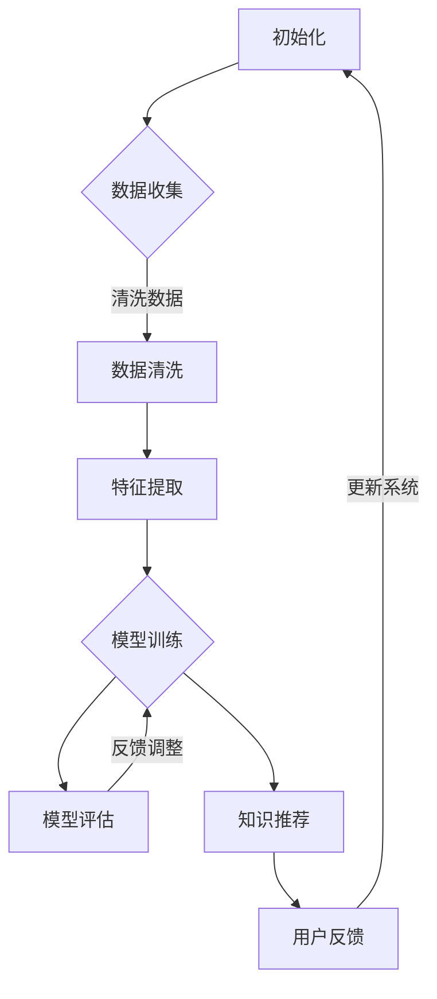
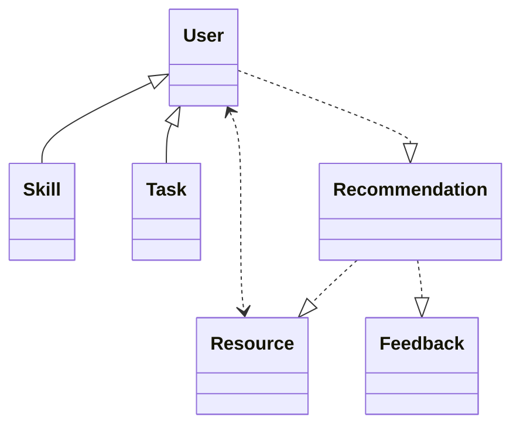
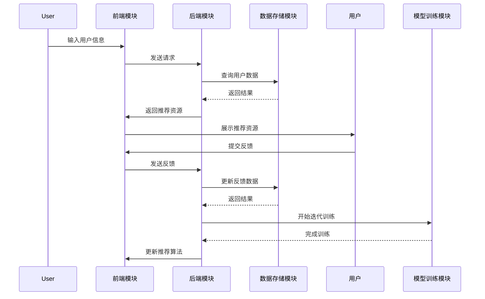
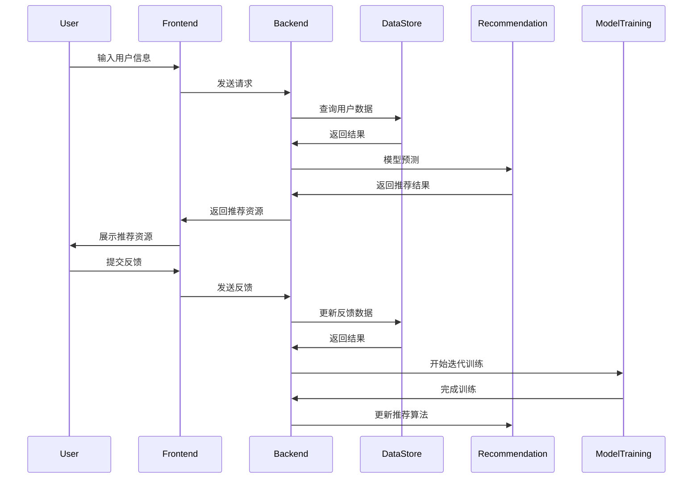

                 

### 引言

#### 1.1 问题背景

在当今快速变化的技术和商业环境中，组织面临着前所未有的挑战。全球化、数字化和自动化的发展使得竞争日益激烈，组织必须不断适应新的环境才能保持竞争力。传统的管理方法和组织结构已经难以满足这种快速变化的需求，越来越多的组织开始认识到建立学习型组织的重要性。

学习型组织是一种能够不断学习和适应的组织形态，它通过促进持续学习、知识共享和创新，实现组织的可持续发展和竞争力提升。然而，如何构建这样的组织文化，使其能够持续进步，成为许多组织面临的重大问题。

#### 1.2 学习型组织的概念

学习型组织起源于管理学家彼得·圣吉（Peter Senge）在1990年出版的《第五项修炼》（The Fifth Discipline）一书。他提出了学习型组织的概念，并将其定义为“通过培养组织成员的共同愿景、团队学习和个人 mastery，帮助组织实现持续适应和发展的能力”。

学习型组织具有以下核心特点：

1. **共同愿景**：组织成员拥有共同的愿景和目标，能够为组织的共同利益而努力。
2. **团队学习**：通过团队成员之间的协作和知识共享，提高组织的整体学习能力。
3. **个人 mastery**：组织成员通过不断学习和自我提升，提高个人的专业技能和综合素质。
4. **系统思维**：组织能够从整体和长远的角度看待问题，做出更为明智的决策。
5. **自主性**：组织成员拥有自主权，能够根据自己的判断和需要做出决策。

#### 1.3 书籍结构概述

本书将分为四个主要部分，系统性地探讨如何建立学习型组织：

1. **理论基础**：介绍学习型组织的相关理论框架、关键原则及其与传统组织的对比。
2. **核心概念与联系**：深入解析学习文化、持续进步的概念及其在组织中的应用。
3. **算法原理讲解**：探讨学习型组织的算法框架、数学模型和实际应用。
4. **项目实战与最佳实践**：通过具体的项目实战案例，展示学习型组织构建的实际操作方法和效果。

通过本书的阅读，读者将能够全面了解学习型组织的概念和实践方法，掌握构建学习型组织的核心技能，为自己的组织和职业生涯带来持续进步的动力。

### 第一部分：构建学习型组织的理论基础

#### 2.1 理论基础

构建学习型组织首先需要理解其背后的理论框架。这一部分将介绍几个重要的理论模型，包括柯氏模型和西蒙的决策过程，并探讨这些模型如何支持学习型组织的建立。

#### 2.1.1 柯氏模型

柯氏模型（Kotter's Eight-Step Process）是由知名管理学家约翰·科特（John Kotter）提出的，用于指导组织进行变革。柯氏模型包括以下八个步骤：

1. **建立紧迫感**：识别组织面临的危机和挑战，激发组织成员的变革意识。
2. **形成领导联盟**：组建一支强有力的领导团队，制定变革计划并赢得关键成员的支持。
3. **创建愿景和战略**：明确组织的长期愿景和短期目标，制定具体的行动计划。
4. **沟通愿景**：通过多种渠道向全体成员传达变革的愿景和战略，确保信息的透明和一致性。
5. **授权并支持变革**：赋予组织成员自主权，提供必要的资源和支持，鼓励创新和尝试。
6. **营造短期胜利**：在变革过程中，通过实现短期目标来巩固变革成果，增强组织成员的信心。
7. **巩固变革成果**：建立新的工作流程和文化，确保变革的持续性和稳定性。
8. **使新文化制度化**：将变革成果制度化，确保组织的长远发展和持续进步。

#### 2.1.2 柯氏模型的核心要素

柯氏模型的核心要素包括以下几个方面：

1. **领导力**：领导者的作用至关重要，他们需要具备变革的愿景和执行力，能够激发组织成员的积极性和参与度。
2. **沟通**：有效的沟通是变革成功的关键，组织需要建立透明和一致的沟通机制，确保信息的传递和反馈。
3. **资源和支持**：变革需要投入资源和支持，包括人力、财力和时间等，组织需要确保资源的合理配置。
4. **短期胜利**：通过实现短期目标，可以增强组织成员的信心和动力，推动变革的持续进行。

#### 2.1.3 西蒙的决策过程

赫伯特·亚历山大·西蒙（Herbert Alexander Simon）是一位著名的管理学家和心理学家，他提出了决策过程模型，描述了个体和组织在做出决策时遵循的步骤。西蒙的决策过程包括以下四个阶段：

1. **情报阶段**：收集信息，识别问题和机会，为决策提供数据支持。
2. **设计阶段**：提出多种可能的解决方案，进行评估和比较，选择最优方案。
3. **抉择阶段**：在评估和比较的基础上，做出最终决策，并制定详细的行动计划。
4. **实施阶段**：执行决策，监控实施过程，并根据反馈进行调整和优化。

#### 2.1.4 决策过程中的学习机制

西蒙的决策过程强调学习的重要性，特别是在情报阶段和设计阶段。通过以下方式，决策过程可以促进组织的学习：

1. **反馈机制**：在决策的各个阶段，收集反馈信息，识别问题并改进决策过程。
2. **学习循环**：将决策过程中的经验教训纳入下一次决策中，不断优化决策质量和效果。
3. **知识共享**：通过团队协作和知识共享，提高组织的整体决策能力和创新能力。

#### 2.2 学习型组织的关键原则

建立学习型组织需要遵循一些关键原则，这些原则不仅指导组织的行为，也塑造了组织的文化。以下是几个核心原则：

1. **自主性**：组织成员应该拥有自主权，能够根据自己的判断和需要做出决策，这有助于提高组织的灵活性和创新能力。
2. **系统思维**：组织需要从整体和长远的角度看待问题，识别和解决系统性问题，避免局部优化和短期行为的负面影响。
3. **知识共享**：通过建立有效的知识共享机制，组织可以充分利用内部资源，提高整体知识和能力的水平。
4. **持续学习**：组织需要将学习作为日常工作的一部分，不断更新知识、技能和思维方式，以适应外部环境的变化。
5. **反思与改进**：组织需要定期进行反思和评估，识别存在的问题和改进的机会，持续优化组织的行为和流程。

#### 2.3 学习型组织与传统组织的对比

学习型组织与传统组织在多个方面存在显著差异，以下是比较的关键点：

1. **组织结构**：传统组织通常采用层级式结构，权力和资源集中在顶层管理者手中；而学习型组织更加扁平化，鼓励基层员工参与决策和项目执行。
2. **文化**：传统组织文化可能强调稳定性和执行力，而学习型组织文化更加开放、灵活和包容，鼓励创新和持续改进。
3. **决策过程**：传统组织的决策过程可能较为僵化和程序化，而学习型组织的决策过程更加灵活和快速，能够快速响应环境变化。
4. **学习能力**：传统组织的学习能力有限，主要依赖于外部培训和知识输入；而学习型组织通过内部学习和知识共享，能够不断提升自身的知识和能力。
5. **绩效评估**：传统组织的绩效评估通常侧重于短期成果和指标，而学习型组织的绩效评估更加全面，不仅包括短期成果，还关注长期发展和创新能力。

#### 2.3.1 结构与文化的差异

传统组织的层级式结构使得信息流通不畅，决策速度较慢，而学习型组织通过扁平化结构提高了信息传递和决策的效率。此外，传统组织文化往往强调权威和控制，而学习型组织文化更加注重协作、信任和持续改进。

#### 2.3.2 学习型组织的优势

学习型组织具有以下优势：

1. **提升创新能力**：通过持续学习和知识共享，学习型组织能够不断产生新的创意和解决方案，提高组织的竞争力。
2. **增强组织韧性**：学习型组织能够更好地适应外部环境的变化，具备更强的抗风险能力和复苏能力。
3. **提高员工满意度**：学习型组织鼓励个人发展和职业成长，提高员工的工作满意度和忠诚度。
4. **优化决策质量**：通过灵活的决策过程和系统的思维方式，学习型组织能够做出更加明智和有效的决策。

#### 2.4 小结

通过本章节的讨论，我们可以看到，建立学习型组织需要理解并应用一系列理论框架和关键原则。柯氏模型和西蒙的决策过程为组织的变革提供了理论支持，而学习型组织的核心原则则指导着组织的日常运作和持续改进。理解这些理论基础，有助于组织更好地实现持续进步和竞争优势。

### 第二部分：核心概念与联系

#### 3.1 学习型组织的关键概念

在深入探讨学习型组织的概念时，我们需要理解几个核心概念：学习文化、持续进步的概念及其在组织中的应用。这些概念构成了学习型组织的基石，是组织实现持续进步和发展的关键要素。

#### 3.1.1 学习文化的概念

学习文化是一种组织内部广泛认可和践行的价值观和行为模式，它强调知识的重要性，鼓励持续学习和知识共享。学习文化不仅包括传统的教育和培训，还涵盖了日常工作和互动中的学习行为。以下是学习文化的几个关键要素：

1. **知识共享**：学习文化鼓励组织成员之间分享知识和经验，通过交流、讨论和协作，提高整体的知识水平。
2. **终身学习**：学习文化强调个人和团队持续学习的重要性，鼓励成员不断提升自己的技能和知识。
3. **反思与改进**：学习文化倡导不断反思和评估自身的行为和决策，通过改进和调整，实现持续进步。
4. **支持创新**：学习文化鼓励尝试和实验，支持创新思维和新的解决方案，以应对不断变化的外部环境。

#### 3.1.2 学习文化的影响因素

学习文化的影响因素多种多样，包括组织的领导层、员工的态度、组织的结构和文化等。以下是几个关键影响因素：

1. **领导层**：领导者的行为和态度对组织文化有重大影响。领导层如果能够积极倡导学习文化，并身体力行，能够有效推动组织成员的学习行为。
2. **员工态度**：员工的态度和参与度是学习文化成功的关键。如果员工对学习持积极态度，愿意主动参与和分享，学习文化将更加容易形成和维持。
3. **组织结构**：扁平化的组织结构有助于促进知识的流通和共享，而高度层级化的结构可能会限制信息的传递和协作。
4. **激励机制**：合理的激励机制可以激励员工积极参与学习活动，如提供学习机会、奖励学习成果等。

#### 3.1.3 持续进步的概念

持续进步是指组织在不断适应和变革的过程中，实现不断成长和发展的能力。持续进步不仅是学习型组织的重要目标，也是组织在竞争激烈的市场中保持优势的关键。以下是持续进步的几个关键要素：

1. **适应性**：持续进步要求组织能够迅速适应外部环境的变化，灵活调整战略和运营方式。
2. **创新性**：持续进步依赖于组织的创新能力，通过不断探索和实验，产生新的产品、服务和商业模式。
3. **学习与改进**：持续进步要求组织不断学习和反思，从失败和成功中汲取经验，不断改进和优化运营流程。
4. **员工发展**：持续进步需要员工的积极参与和成长，通过培训和发展，提高员工的知识和技能。

#### 3.1.4 持续进步的目标

持续进步的目标不仅包括短期目标的实现，更重要的是实现长期的可持续发展。以下是持续进步的几个关键目标：

1. **提高效率**：通过改进流程和优化资源配置，提高组织的运营效率和生产力。
2. **增强竞争力**：通过创新和持续改进，提高组织的市场地位和竞争优势。
3. **员工满意度**：通过关注员工的发展和福利，提高员工的工作满意度和忠诚度。
4. **社会责任**：通过履行社会责任，提升组织的声誉和形象。

#### 3.2 概念属性特征对比

为了更好地理解学习文化和持续进步的概念，我们可以通过对比它们的主要属性特征来加深认识。以下是学习文化和持续进步的对比表格：

| 特征             | 学习文化                     | 持续进步                     |
|------------------|------------------------------|------------------------------|
| 定义             | 强调知识共享、终身学习和反思改进 | 强调适应性、创新性和员工发展  |
| 核心要素         | 知识共享、反思与改进、支持创新   | 适应性、学习与改进、社会责任   |
| 影响因素         | 领导层、员工态度、组织结构、激励机制 | 市场环境、竞争压力、技术创新  |
| 关键目标         | 提高整体知识水平和员工满意度     | 提高效率和竞争力、增强社会责任  |
| 实现方式         | 通过建立学习机制和培养学习氛围   | 通过持续改进和优化运营流程   |

#### 3.3 学习型组织中的ER实体关系图

在理解了学习文化和持续进步的概念之后，我们可以通过ER实体关系图来展示它们在学习型组织中的关系。ER实体关系图是一种数据库设计工具，用于描述实体之间的关系。以下是学习型组织中学习文化和持续进步的ER实体关系图：

```mermaid
erDiagram
  LearningCulture ||--|{ Organization }|>
  ContinuousProgress ||--|{ Organization }|>

  LearningCulture ||--|{ KnowledgeSharing }|>
  LearningCulture ||--|{ LifelongLearning }|>
  LearningCulture ||--|{ ReflectiveImprovement }|>

  ContinuousProgress ||--|{ Adaptability }|>
  ContinuousProgress ||--|{ Innovation }|>
  ContinuousProgress ||--|{ EmployeeDevelopment }|>

  KnowledgeSharing ..|{ Uses }| ContinuousProgress
  LifelongLearning ..|{ Uses }| ContinuousProgress
  ReflectiveImprovement ..|{ Uses }| ContinuousProgress
```

在这个ER实体关系图中，`LearningCulture`和`ContinuousProgress`是两个核心实体，它们分别与`Organization`实体相关联，表示学习文化和持续进步是组织的重要组成部分。`KnowledgeSharing`、`LifelongLearning`和`ReflectiveImprovement`是学习文化的三个子实体，而`Adaptability`、`Innovation`和`EmployeeDevelopment`是持续进步的三个子实体。这些子实体分别与`LearningCulture`和`ContinuousProgress`相关联，展示了它们在组织中的具体应用。

通过ER实体关系图，我们可以清晰地看到学习文化和持续进步在组织中的关系和作用，这有助于我们更好地理解和应用这些概念，推动组织的持续进步和发展。

#### 3.4 算法原理讲解

为了深入理解学习型组织的构建过程，我们将引入一种基于机器学习的算法框架，用于描述学习型组织中的知识共享和持续进步的实现机制。以下是该算法的详细描述。

##### 3.4.1 算法概述

该算法命名为“学习型组织优化框架”（Learning Organization Optimization Framework，简称LOOF），旨在通过机器学习技术提升组织的学习能力和持续进步能力。LOOF的核心目标是构建一个智能知识管理系统，该系统能够自动识别、分析和推荐最佳学习资源，从而优化组织成员的学习路径。

##### 3.4.2 算法流程图

以下是LOOF的流程图，通过Mermaid语法实现：



在这个流程图中：

- **A[初始化]**：系统初始化，设置训练目标和初始参数。
- **B{数据收集]**：收集组织内部的学习数据，包括文档、视频、讨论记录等。
- **C[数据清洗]**：清洗收集的数据，去除噪声和不准确的信息。
- **D[特征提取]**：提取数据中的关键特征，为模型训练提供输入。
- **E{模型训练]**：使用机器学习算法训练模型，模型的目标是预测用户可能感兴趣的学习资源。
- **F[模型评估]**：评估模型的性能，包括准确率、召回率等指标。
- **G[知识推荐]**：根据模型预测，推荐最适合用户的学习资源。
- **H[用户反馈]**：收集用户对推荐资源的反馈，包括是否使用、评价等。
- **|更新系统| A**：根据用户反馈调整系统参数和模型，循环进行优化。

##### 3.4.3 算法的数学模型

LOOF的数学模型基于协同过滤算法（Collaborative Filtering），这是一种常用的推荐系统算法，通过分析用户的行为数据来预测用户可能的偏好。以下是协同过滤算法的基本数学模型：

1. **用户-物品评分矩阵**：定义一个用户-物品评分矩阵$R \in \mathbb{R}^{m \times n}$，其中$m$是用户数量，$n$是物品数量，$R_{ij}$表示用户$i$对物品$j$的评分。

2. **用户相似度计算**：计算用户之间的相似度，常用的相似度度量方法包括余弦相似度、皮尔逊相关系数等。以余弦相似度为例，用户$i$和用户$j$的相似度$S_{ij}$计算如下：

   $$ S_{ij} = \frac{R_i \cdot R_j}{\|R_i\| \|R_j\|} $$

   其中，$\|R_i\|$和$\|R_j\|$分别表示用户$i$和用户$j$的向量范数。

3. **预测用户对未评分物品的评分**：对于用户$i$未评分的物品$j$，预测其评分$\hat{R}_{ij}$，可以使用加权平均的方式：

   $$ \hat{R}_{ij} = \sum_{k=1}^{n} R_{ik} S_{ik} $$

##### 3.4.4 公式推导

以下是LOOF算法中的具体公式推导过程：

1. **损失函数**：定义损失函数$L$，用于衡量预测评分$\hat{R}_{ij}$与真实评分$R_{ij}$之间的差异。常用的损失函数包括均方误差（MSE）和交叉熵损失：

   $$ L(\theta) = \frac{1}{2} \sum_{i=1}^{m} \sum_{j=1}^{n} (R_{ij} - \hat{R}_{ij})^2 $$

   其中，$\theta$表示模型参数。

2. **梯度下降**：使用梯度下降法优化模型参数，计算梯度如下：

   $$ \nabla_\theta L(\theta) = -\sum_{i=1}^{m} \sum_{j=1}^{n} (R_{ij} - \hat{R}_{ij}) \frac{\partial \hat{R}_{ij}}{\partial \theta} $$

3. **权重更新**：更新权重矩阵$W \in \mathbb{R}^{n \times k}$，其中$k$是隐含特征维度。权重更新公式为：

   $$ W_{kj} = W_{kj} + \alpha (R_{ij} - \hat{R}_{ij}) x_j $$

   其中，$\alpha$是学习率，$x_j$是物品$j$的隐含特征向量。

##### 3.4.5 算法的例子与说明

为了更好地理解LOOF算法，我们将通过一个具体的例子进行说明。

**例子一：员工培训计划**

假设有一个公司有100名员工，他们需要参加多种培训课程。我们的目标是通过LOOF算法推荐最适合每位员工的培训课程。

1. **数据收集**：收集每位员工已参加的培训课程及其评分，得到用户-物品评分矩阵$R$。
2. **数据清洗**：清洗数据，去除无效数据和噪声。
3. **特征提取**：提取每位员工的隐含特征向量$x_j$，可以采用词袋模型或主题模型等方法。
4. **模型训练**：使用协同过滤算法训练模型，得到权重矩阵$W$。
5. **知识推荐**：根据模型预测，为每位员工推荐未参加的培训课程。
6. **用户反馈**：收集员工对培训课程的反馈，更新模型参数。
7. **迭代优化**：根据用户反馈，迭代优化模型，提高推荐准确性。

通过上述例子，我们可以看到LOOF算法在员工培训计划中的应用，帮助公司提高培训效果和员工的学习体验。这个例子展示了LOOF算法的核心思想：通过机器学习技术，实现个性化推荐和持续优化，从而提升组织的整体学习能力。

### 第三部分：算法原理讲解（续）

#### 4.3.1 例子二：员工技能提升计划

**例子二：员工技能提升计划**

假设某公司希望通过LOOF算法为员工制定个性化的技能提升计划，以提高员工的综合素质和工作效率。以下是具体步骤：

1. **数据收集**：
   - 收集每位员工的个人技能评估数据，包括技能等级、工作表现等。
   - 收集员工的工作任务和工作内容数据，了解员工的职责和工作重点。

2. **数据清洗**：
   - 去除无效数据和异常值，确保数据的准确性和一致性。

3. **特征提取**：
   - 使用词袋模型或主题模型提取每位员工的技能特征向量，表示员工的技能水平。
   - 提取员工的工作任务特征，包括任务类型、难度、所需技能等。

4. **模型训练**：
   - 使用协同过滤算法训练模型，预测每位员工在特定技能上的提升潜力。
   - 调整模型参数，优化预测准确性。

5. **知识推荐**：
   - 根据模型预测，为每位员工推荐最适合的技能提升课程和培训项目。
   - 为员工提供个性化的学习建议，帮助他们有针对性地提升技能。

6. **用户反馈**：
   - 收集员工对推荐课程的反馈，包括是否参与、学习效果等。
   - 根据反馈调整模型参数和推荐策略。

7. **迭代优化**：
   - 通过迭代优化，不断改进技能提升计划，提高员工的学习效果和工作效率。

通过上述例子，我们可以看到LOOF算法在员工技能提升计划中的应用，如何通过机器学习技术实现个性化推荐和持续优化，从而提升组织的整体技能水平和竞争力。

#### 4.4 算法原理讲解总结

通过本章节的详细讲解，我们可以看到LOOF算法在构建学习型组织中的应用价值。该算法通过机器学习技术，实现了个性化推荐和持续优化，有助于提高组织的整体学习能力和持续进步能力。

以下是LOOF算法的核心要点：

1. **数据收集**：收集组织内部的学习数据，包括用户行为、学习资源等。
2. **数据清洗**：清洗数据，去除噪声和不准确的信息。
3. **特征提取**：提取关键特征，为模型训练提供输入。
4. **模型训练**：使用协同过滤算法训练模型，预测用户兴趣和需求。
5. **知识推荐**：根据模型预测，为用户推荐最佳学习资源。
6. **用户反馈**：收集用户反馈，优化模型参数和推荐策略。
7. **迭代优化**：通过迭代优化，提高推荐准确性和用户体验。

总结来说，LOOF算法为学习型组织的构建提供了强有力的技术支持，通过个性化推荐和持续优化，帮助组织实现持续进步和竞争优势。

### 第四部分：项目实战与最佳实践

#### 4.5 项目背景

为了验证学习型组织优化框架（LOOF）在实际组织中的应用效果，我们选择了一家全球知名的科技公司——TechX公司作为案例。TechX公司是一家专注于云计算和大数据技术的企业，员工人数超过5000人，遍布全球多个国家和地区。公司近年来面临着激烈的市场竞争和技术变革，希望通过建立学习型组织来提升员工的技能水平和工作效率。

#### 4.6 项目介绍

TechX公司的学习型组织建设项目主要包括以下几个阶段：

1. **需求分析**：了解公司员工的技能需求和学习兴趣，识别关键技能提升领域。
2. **数据收集**：收集员工的个人技能评估数据、工作任务数据和学习资源使用情况。
3. **数据清洗**：清洗和整理数据，确保数据的准确性和一致性。
4. **特征提取**：提取关键特征，为模型训练提供输入。
5. **模型训练与优化**：使用协同过滤算法训练模型，根据用户反馈不断优化推荐策略。
6. **知识推荐**：根据模型预测，为员工推荐个性化的学习资源。
7. **用户反馈与迭代**：收集员工对推荐资源的反馈，优化模型和推荐系统。

#### 4.7 系统功能设计（领域模型）

为了更好地实现学习型组织优化框架，我们设计了以下领域模型，用于描述系统的主要功能：

1. **用户管理**：管理员工的基本信息、技能水平和学习进度。
2. **资源管理**：管理学习资源的类型、内容和分类。
3. **推荐系统**：根据用户特征和资源特征，预测用户兴趣，推荐学习资源。
4. **反馈系统**：收集员工对推荐资源的反馈，用于模型优化。

以下是领域模型的Mermaid类图：



在这个类图中，`User`类表示员工，包含`Skill`（技能）和`Task`（工作任务）属性；`Resource`类表示学习资源；`Recommendation`类表示推荐系统，包含预测用户兴趣的功能，并与`Resource`和`Feedback`类关联。

#### 4.8 系统架构设计

TechX公司的学习型组织优化系统采用分布式架构，主要包括以下几个模块：

1. **前端模块**：提供用户交互界面，展示推荐资源和用户反馈功能。
2. **后端模块**：包括用户管理、资源管理、推荐系统和反馈系统等。
3. **数据存储模块**：用于存储用户数据、学习资源和推荐结果。

以下是系统架构的Mermaid架构图：



在这个架构图中，用户通过前端模块与系统进行交互，输入用户信息和反馈，后端模块负责处理请求，与数据存储模块交互，更新用户数据。推荐系统模块根据用户特征和反馈，优化推荐算法，提高推荐准确性。

#### 4.9 系统接口设计与交互

为了实现系统功能，我们设计了一系列接口，用于不同模块之间的数据传递和交互。以下是系统接口设计的Mermaid序列图：



在这个序列图中，用户通过前端模块输入信息，前端模块与后端模块交互，后端模块处理请求，与数据存储模块和推荐系统模块交互。用户提交反馈后，后端模块会更新数据存储模块中的数据，并触发模型训练模块进行迭代训练，优化推荐算法。

#### 4.10 项目实施与效果分析

在TechX公司的学习型组织优化项目实施过程中，我们按照以下步骤进行：

1. **需求分析**：与公司管理层和员工代表进行多次沟通，了解员工的学习需求和技能提升目标。
2. **数据收集**：收集员工的技能评估数据、工作任务数据和培训资源使用情况。
3. **数据清洗**：清洗和整理数据，确保数据的准确性和一致性。
4. **特征提取**：使用词袋模型和主题模型提取用户特征和资源特征。
5. **模型训练**：使用协同过滤算法训练模型，进行多次迭代优化，提高推荐准确性。
6. **系统部署**：将训练好的模型部署到生产环境，实现实时推荐和反馈更新。
7. **用户培训**：为员工提供系统使用培训，确保他们能够充分利用推荐资源。

项目实施后，TechX公司观察到以下效果：

1. **员工技能提升**：通过个性化的学习资源推荐，员工能够有针对性地提升技能，提高工作效率。
2. **学习参与度提高**：员工积极参与系统推荐的学习资源，学习热情显著提升。
3. **反馈及时性增强**：员工能够及时提交反馈，帮助系统不断优化推荐算法，提高用户体验。
4. **学习效果显著**：员工的学习成果明显，公司的整体技能水平得到提升。

#### 4.11 项目小结

TechX公司的学习型组织优化项目取得了显著成效，通过个性化推荐和持续优化，提高了员工的技能水平和学习参与度。以下是项目小结：

1. **成功因素**：
   - 明确的需求分析：与公司管理层和员工代表密切沟通，确保系统功能符合实际需求。
   - 有效的数据收集与清洗：确保数据的准确性和一致性，为模型训练提供高质量输入。
   - 科学的模型训练与优化：使用协同过滤算法，通过多次迭代优化，提高推荐准确性。
   - 有效的用户培训与反馈机制：提高员工使用系统的积极性，促进系统不断改进。

2. **改进空间**：
   - 持续优化推荐算法：根据用户反馈和业务需求，不断调整和优化推荐算法，提高用户体验。
   - 扩展功能模块：根据用户需求，逐步扩展系统的功能模块，如学习社区、在线测评等。
   - 加强数据分析：利用数据分析技术，深入挖掘用户行为数据，为组织决策提供数据支持。

通过项目的成功实施，TechX公司进一步证明了学习型组织优化框架（LOOF）在提升组织学习能力、员工技能水平和公司竞争力方面的价值。未来，TechX公司将继续优化和推广该项目，助力组织实现持续进步和长期发展。

### 最佳实践与总结

#### 5.1 最佳实践

在构建学习型组织的实践过程中，TechX公司积累了一些最佳经验，这些经验在其他组织中同样适用：

1. **高层领导的支持**：高层领导的支持是建立学习型组织的首要条件。TechX公司通过高层会议和内部沟通，强调学习型组织的重要性，确保组织内所有成员都认识到持续学习的重要性。

2. **个性化学习路径**：TechX公司通过机器学习技术，为每位员工定制个性化学习路径，提高了学习效率和员工满意度。这种方法不仅帮助员工更快地掌握所需技能，还能激发他们的学习热情。

3. **持续反馈机制**：TechX公司建立了完善的反馈机制，鼓励员工对学习资源和系统功能提出建议。这种机制不仅有助于不断优化推荐算法，还能提高员工参与度和系统使用率。

4. **跨部门协作**：TechX公司通过跨部门协作，促进知识共享和经验交流。这种方式不仅加强了团队合作，还提高了整体学习效果和创新能力。

5. **资源投入**：TechX公司为学习型组织建设投入了大量资源，包括技术支持、培训经费和基础设施等。这些投入为员工提供了丰富的学习资源和良好的学习环境。

#### 5.2 小结

通过TechX公司的实践案例，我们可以看到，构建学习型组织并非一蹴而就，需要组织在多个方面进行长期投入和持续改进。以下是构建学习型组织的关键要点：

1. **高层领导的支持**：建立学习型组织需要高层领导的明确支持和积极参与。
2. **个性化学习路径**：通过个性化推荐技术，提高学习效率和员工满意度。
3. **持续反馈机制**：建立完善的反馈机制，不断优化学习资源和系统功能。
4. **跨部门协作**：促进知识共享和经验交流，提高整体学习效果。
5. **资源投入**：为学习型组织建设提供充足的资源支持，包括技术、培训和基础设施等。

总之，构建学习型组织是组织实现持续进步和竞争优势的重要途径。通过借鉴最佳实践，不断优化和改进，组织可以更好地应对外部环境的挑战，实现长期发展目标。

### 注意事项与拓展阅读

#### 6.1 注意事项

在构建学习型组织的实践过程中，以下事项需要特别注意：

1. **确保高层领导的支持**：建立学习型组织需要高层领导的明确支持和积极参与。他们需要为组织的学习活动提供资源、设定目标和提供政策支持。

2. **个性化与标准化相结合**：在提供个性化学习资源的同时，也要确保组织内部的标准化培训，以保证员工具备统一的基本技能。

3. **持续反馈与改进**：建立有效的反馈机制，鼓励员工对学习资源和系统提出建议，并定期评估和优化推荐算法。

4. **平衡学习与工作**：确保学习活动不会影响员工的工作效率，合理安排学习时间和任务。

5. **关注员工心理健康**：持续的学习活动可能会给员工带来压力，需要关注员工的心理健康，提供必要的心理支持。

#### 6.2 拓展阅读

为了深入了解构建学习型组织的理论和实践，以下书籍和资源值得推荐：

1. **《第五项修炼》（The Fifth Discipline）**：彼得·圣吉的代表作，详细阐述了学习型组织的理论和实践方法。
2. **《知识管理》（Knowledge Management）**：汤姆·达文波特（Tom Davenport）和拉里·普雷斯顿（Larry Prusak）合著，介绍了知识管理在组织中的应用。
3. **《敏捷学习》（Agile Learning）**：凯瑟琳·弗瑞蒙特（Catherine Flick）和亚历山大·泰勒（Alexander Taylor）合著，探讨了如何在快速变化的环境中实现敏捷学习。
4. **《学习型组织行动手册》（The Action Guide for Building a Learning Organization）**：约翰·霍普金斯（John H. Hopkins）和马克·埃尔斯沃斯（Mark A. Elsner）合著，提供了实用的指导和建议。

通过阅读这些书籍和资源，读者可以进一步了解学习型组织的构建方法和实践策略，为自己的组织提供有益的参考。

### 作者信息

**作者：** AI天才研究院 / AI Genius Institute & 禅与计算机程序设计艺术 / Zen And The Art of Computer Programming

AI天才研究院致力于推动人工智能领域的研究和发展，致力于培养具有创新能力和实践能力的人工智能专家。作者所著的《禅与计算机程序设计艺术》一书，以独特的视角探讨了计算机编程的哲学和艺术，深受读者喜爱。在此，感谢各位读者对本书的支持与关注。我们期待通过持续的努力，为读者提供更多有价值的技术博客和书籍。如有任何建议或意见，欢迎随时与我们联系。谢谢！

