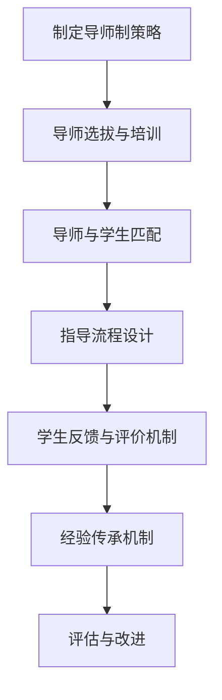
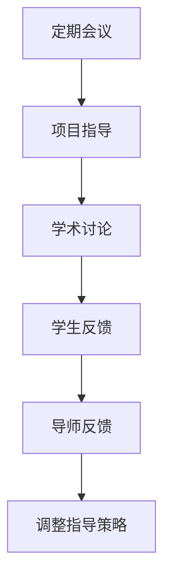

                 

### 第1章：导师制概述

#### 1.1 导师制的历史与演变

导师制的历史可以追溯到古希腊和古罗马时期，那时的学者们常常通过导师和学徒的形式传授知识和技能。随着教育体系的发展，导师制逐渐演变成为现代教育中一种重要的培养模式。在20世纪中后期，随着知识经济时代的到来，导师制在欧美教育体系中得到广泛应用，特别是在高等教育和职业教育领域。

- **古代导师制**：古希腊哲学家苏格拉底的教学方法被称为“问答法”，这种方式强调通过对话和质疑来引导学生思考。古罗马时期的导师制则更多体现在政治和军事领域，如凯撒的军事导师制。

- **现代导师制**：20世纪中后期，随着教育改革和人才培养需求的提高，导师制在欧美教育体系中得到广泛应用。如英国的牛津大学和剑桥大学，美国的许多大学都设有导师制，其核心在于提供个性化教育和学术指导。

- **中国导师制的实践**：近年来，我国部分高校和高职院校也开始推行导师制，结合职业教育和企业需求，培养学生的实践能力和职业素养。如一些高校的“双导师制”，即校内导师和校外导师共同指导学生。

#### 1.2 导师制的核心概念

导师制作为一种教育模式，其核心概念包括导师角色、导师与学生关系以及导师制的目标。

- **导师角色**：导师是学生的学术指导者、职业规划师和人生导师。他们不仅传授知识，更注重学生的全面发展，指导学生进行学术研究、职业规划和个人成长。

- **导师与学生关系**：导师与学生之间的关系是双向互动的，建立在平等、尊重、信任的基础上。导师要关注学生的个性化需求，提供有针对性的指导和帮助。同时，学生也要积极参与，主动学习，与导师进行有效沟通。

- **导师制的目标**：导师制的目标包括促进学生的全面发展、提高教育质量、保障经验的传承。通过导师制，学生可以获得更个性化的教育，提高学术能力和创新能力，同时也能够从导师的经验中获得职业素养的提升。

#### 1.3 导师制的优势与目标

导师制的优势在于其能够实现个性化教育和经验传承，提高教育质量。

- **个性化教育**：导师制能够根据学生的特点和需求，提供有针对性的教育和指导，有助于学生的全面发展。

- **经验传承**：导师制通过导师的经验传授，帮助学生更快地掌握专业知识和技能，提高职业素养。

- **提高教育质量**：导师制有助于实现教学相长，教师和学生之间的互动可以促进知识的深入理解和创新。

导师制的目标不仅是培养学生的学术能力，还包括职业能力和个人素养，为学生的未来发展奠定坚实基础。

### 核心概念与联系

为了更好地理解导师制的概念和运作机制，我们需要从核心概念和联系的角度进行分析。

#### 导师与学生的匹配

导师与学生的匹配是导师制成功的关键。导师和学生之间的关系需要建立在彼此的了解和信任基础上。

- **导师选择标准**：选择导师时，应考虑导师的专业背景、教学经验、科研能力和个人品质。导师应具备丰富的专业知识和实践经验，能够给予学生有效的指导。

- **学生需求分析**：在学生选择导师时，应考虑学生的兴趣、能力和发展需求。学生需要找到与自己专业方向和职业规划相匹配的导师，以便获得更有针对性的指导。

#### 导师制的组织结构

导师制的组织结构对于其有效运行至关重要。

- **导师团队构建**：导师团队应由不同领域的专家组成，以便为学生提供多样化的指导。导师团队应定期进行交流和培训，确保指导的连续性和质量。

- **组织管理与支持**：学校和企业应设立专门的管理机构，负责导师制的规划、实施和评估。同时，应提供必要的资源和支持，如时间安排、经费保障和技术支持。

#### 导师制与传统教育模式的对比

导师制与传统教育模式在目标和方式上存在明显差异。

- **教育目标对比**：传统教育模式更多关注知识的传授，而导师制更注重学生的全面发展，包括学术能力、创新能力、职业素养和社会责任感。

- **教育方法对比**：传统教育模式往往采用统一的教学内容和评价标准，而导师制则强调个性化教育和个性化评价，根据学生的特点和需求进行有针对性的指导。

导师制的理论基础涵盖了导师制的历史演变、核心概念、组织结构以及与传统教育模式的对比。通过深入理解这些理论，我们可以更好地把握导师制的本质和运作机制，为其在实践中取得成功提供指导。接下来，我们将进一步探讨导师制的实践步骤，以帮助教育工作者和管理者更好地实施导师制。

### 第2章：核心概念与联系

在深入理解导师制的理论基础之后，我们需要进一步探讨其核心概念和联系，这对于导师制的有效实施至关重要。

#### 2.1 导师与学生的匹配

导师与学生的匹配是导师制成功的关键。有效的匹配能够确保导师和学生之间的互动更加顺畅，有助于实现个性化教育和经验传承。

- **导师选择标准**：选择导师时，应考虑导师的专业背景、教学经验、科研能力和个人品质。导师应具备丰富的专业知识和实践经验，能够给予学生有效的指导。

  - **专业背景**：导师应在其专业领域有深厚的知识储备和实际经验，以便为学生提供专业的指导。
  - **教学经验**：导师应具备良好的教学能力，能够运用多种教学方法，激发学生的学习兴趣和潜能。
  - **科研能力**：导师应具备一定的科研能力，能够指导学生进行学术研究，提高其学术素养。

- **学生需求分析**：在学生选择导师时，应考虑学生的兴趣、能力和发展需求。学生需要找到与自己专业方向和职业规划相匹配的导师，以便获得更有针对性的指导。

  - **兴趣**：学生的兴趣是选择导师的重要依据，导师应能够激发学生的兴趣，引导其深入学习。
  - **能力**：学生的能力是选择导师的另一个重要依据，导师应能够根据学生的能力水平提供适当的指导。
  - **发展需求**：学生的发展需求包括学术发展、职业发展和个人成长等方面，导师应根据这些需求进行有针对性的指导。

#### 2.2 导师制的组织结构

导师制的组织结构对于其有效运行至关重要。一个科学合理的组织结构能够确保导师制的顺利实施，提高教育质量。

- **导师团队构建**：导师团队应由不同领域的专家组成，以便为学生提供多样化的指导。导师团队应定期进行交流和培训，确保指导的连续性和质量。

  - **多样化**：导师团队的多样化能够为学生提供不同领域的专业指导，有助于学生的全面发展。
  - **定期交流与培训**：导师团队应定期进行交流和培训，分享教学经验和管理经验，提高整体指导水平。

- **组织管理与支持**：学校和企业应设立专门的管理机构，负责导师制的规划、实施和评估。同时，应提供必要的资源和支持，如时间安排、经费保障和技术支持。

  - **管理机构**：管理机构应负责导师制的整体规划和协调，确保导师制的顺利实施。
  - **资源支持**：学校和企业应提供必要的资源支持，如教学资源、科研资源和生活保障，确保导师能够全身心地投入指导工作。

#### 2.3 导师制与传统教育模式的对比

导师制与传统教育模式在多个方面存在显著差异，这些差异反映了导师制在培养人才方面的独特优势。

- **教育目标对比**：传统教育模式更多关注知识的传授，而导师制更注重学生的全面发展，包括学术能力、创新能力、职业素养和社会责任感。

  - **知识传授**：传统教育模式侧重于向学生传授系统化的知识，强调知识体系的完整性和系统性。
  - **全面发展**：导师制则更注重学生的全面发展，通过个性化教育和经验传承，培养学生的创新能力、职业素养和社会责任感。

- **教育方法对比**：传统教育模式往往采用统一的教学内容和评价标准，而导师制则强调个性化教育和个性化评价，根据学生的特点和需求进行有针对性的指导。

  - **统一教学**：传统教育模式采用统一的教学内容和评价标准，以便实现教学的一致性和公平性。
  - **个性化指导**：导师制则根据学生的个性化需求进行有针对性的指导，通过定制化的培养方案，提高学生的学习效果和满意度。

通过对比分析，我们可以更清晰地理解导师制的核心概念和联系。导师与学生之间的有效匹配、科学合理的组织结构以及与传统教育模式的区别，都是导师制成功实施的重要保证。接下来，我们将进一步探讨导师制的实践步骤，帮助教育工作者和管理者更好地实施导师制。

### 第3章：导师制规划与实施

在深入理解了导师制的理论基础和核心概念之后，我们需要进一步探讨导师制的规划与实施步骤，以确保导师制的有效运行。

#### 3.1 制定导师制策略

制定导师制策略是确保导师制成功实施的第一步。以下是一些关键的策略制定步骤：

- **导师制目标设定**：明确导师制的目标，包括学术能力提升、职业能力培养、创新精神和综合素养等方面。确保目标与学校或企业的整体教育目标相一致。

- **导师选拔与培训**：选择合适的导师，确保其具备专业知识和教学能力。对新导师进行系统的培训，提高其指导技能和管理能力。

  - **导师选拔标准**：导师应具备丰富的专业知识和实践经验，良好的教学能力和科研能力，以及较强的沟通能力和责任心。
  - **导师培训内容**：培训内容包括教学技巧、指导方法、沟通技巧、时间管理、职业规划等方面，确保导师能够有效地指导学生。

#### 3.2 导师与学生互动机制

有效的导师与学生互动机制是导师制成功的关键。以下是一些关键环节：

- **导师指导流程设计**：制定详细的导师指导流程，包括指导计划、定期会议、学术讨论、项目指导等。确保导师和学生之间的互动有规律、有目标。

  - **指导计划**：导师应与学生共同制定指导计划，明确指导的目标、内容和时间安排。
  - **定期会议**：定期召开导师会议，讨论学生的学术进展、遇到的问题以及解决措施。

- **学生反馈与评价机制**：建立有效的学生反馈与评价机制，让学生能够及时反馈导师的指导效果，导师也能根据反馈进行改进。

  - **学生反馈**：学生可以通过定期的反馈表、面谈等方式，表达对导师指导的满意度和建议。
  - **评价机制**：建立导师评价体系，对导师的指导效果进行评估，包括学生的学业成绩、学术成果、职业发展等指标。

#### 3.3 经验传承机制

经验传承是导师制的重要目标之一。以下是一些关键措施：

- **专业知识传授**：导师应通过课堂讲解、项目指导、文献阅读等方式，向学生传授专业知识。确保学生能够系统地掌握所学领域的基础理论和实践技能。

- **职业素养培养**：导师应关注学生的职业素养培养，包括沟通能力、团队协作能力、创新能力、职业伦理等方面。通过实际案例分析和模拟训练，提高学生的职业素养。

  - **沟通能力**：导师应指导学生如何有效地进行沟通，包括书面和口头沟通技巧。
  - **团队协作能力**：导师应设计团队项目，培养学生的团队合作精神。
  - **创新能力**：导师应鼓励学生勇于创新，提供创新思维训练和实践机会。
  - **职业伦理**：导师应强调职业伦理的重要性，培养学生的职业道德和责任感。

通过制定导师制策略、设计有效的导师与学生互动机制以及建立经验传承机制，我们可以确保导师制的有效实施，从而提高学生的学术能力、职业素养和创新能力。接下来，我们将探讨导师制在人才培养中的应用，以进一步理解其在实际教育中的作用。

### 第4章：导师制在人才培养中的应用

导师制在人才培养中具有独特的优势，能够通过个性化指导和经验传承，全面提升学生的学术能力、职业素养和创新能力。以下我们将探讨导师制在学术研究和企业培训中的应用，展示其在不同场景下的具体实施方法和效果。

#### 4.1 导师制在学术研究中的应用

在学术研究中，导师制能够为学生提供深度的学术指导，帮助其顺利完成研究项目，并培养其独立研究的能力。

- **研究项目的指导**：导师在研究项目中扮演着重要的角色，从选题、文献综述、研究设计到论文撰写，导师都提供全方位的指导。导师不仅提供专业知识和方法上的指导，还帮助学生解决研究过程中遇到的各种问题。

  - **选题指导**：导师根据学生的兴趣和专业背景，帮助学生选择合适的研究课题，确保选题既有创新性，又具有实际意义。
  - **文献综述**：导师指导学生进行文献检索和整理，帮助学生建立系统的学术知识框架，避免研究中的重复和误区。
  - **研究设计**：导师协助学生制定研究方案，包括实验设计、数据收集和分析方法，确保研究过程的科学性和合理性。
  - **论文撰写**：导师指导学生撰写论文，从结构布局、内容逻辑到语言表达，提供全面的修改意见，帮助学生提高论文质量。

- **学术论文的撰写**：导师制在学术论文撰写中起到关键作用。导师不仅帮助学生掌握学术论文的写作技巧，还通过实例分析和指导，提高学生的学术写作能力。

  - **写作技巧**：导师通过案例分析，指导学生如何撰写论文摘要、引言、方法、结果和讨论等部分，确保论文结构的完整性和逻辑性。
  - **修改意见**：导师对学生的初稿进行细致的修改，提出具体的改进建议，帮助学生提高论文的质量和水平。

通过导师制在学术研究中的应用，学生不仅能够完成高质量的研究项目，还能够培养独立思考和解决问题的能力，为未来的学术和职业生涯奠定坚实基础。

#### 4.2 导师制在企业培训中的应用

在企业培训中，导师制能够结合企业的实际需求，有针对性地培养员工的职业素养和技能，提高其工作能力和绩效。

- **培训计划的制定**：导师制在企业培训中首先需要制定详细的培训计划，确保培训目标与企业战略目标相一致。

  - **培训目标**：根据企业的需求和员工的个人发展需求，设定明确的培训目标，包括专业知识、技能、职业素养等方面。
  - **培训内容**：结合企业的实际需求，设计有针对性的培训内容，包括专业课程、技能培训、案例分析等。

- **培训效果的评估**：导师制在企业培训中需要建立有效的评估机制，以评估培训的效果，并根据评估结果进行调整。

  - **过程评估**：在培训过程中，通过课堂互动、作业完成情况、团队项目等环节，实时监控学生的学习进度和效果。
  - **效果评估**：培训结束后，通过考试、工作表现、同事评价等方式，评估培训的实际效果，确保培训目标的达成。

- **职业发展的指导**：导师不仅提供专业知识和技能的培训，还关注员工的职业发展，提供职业规划指导。

  - **职业规划**：导师与员工进行一对一的交流，了解其职业发展规划，提供个性化的职业发展建议。
  - **职业辅导**：导师在员工的工作过程中，提供持续的辅导和支持，帮助其解决工作中遇到的问题，提高其工作能力。

通过导师制在企业培训中的应用，企业能够有效地提升员工的职业素养和技能，增强团队的凝聚力和创新能力，从而提高整体绩效和市场竞争力。

综上所述，导师制在学术研究和企业培训中均发挥着重要作用。通过个性化指导和经验传承，导师制能够全面提升学生的学术能力、职业素养和创新能力，为人才培养提供强有力的支持。在未来的教育实践中，导师制的深入应用和不断完善，将有助于培养更多优秀人才，推动社会的持续发展。

### 第5章：导师制的评估与改进

为了确保导师制的有效实施和持续改进，对其进行科学评估和反馈机制的建设至关重要。以下我们将探讨导师制的评估指标、反馈与调整以及持续发展的策略。

#### 5.1 导师制的评估指标

导师制的评估应从多个维度进行，确保全面、准确地反映导师制的效果。

- **学生的学业成绩**：学业成绩是评估导师制效果的重要指标之一。通过对比学生参与导师制前后的成绩变化，可以评估导师在学术指导上的有效性。

  - **学术成绩提升**：分析学生的考试成绩、课程成绩、学术竞赛成绩等，评估导师对学生学术能力的提升程度。
  - **学术成果**：关注学生的学术论文发表、专利申请、科研项目参与等，评估导师在学术成果方面的贡献。

- **学生的职业发展**：导师制不仅关注学生的学术能力，还应关注其职业发展。

  - **就业率**：评估学生在毕业后的一段时间内，找到相关岗位的比例，反映导师制对学生就业能力的培养效果。
  - **职业晋升**：跟踪学生在工作后的职业晋升情况，评估导师在职业规划和发展方面的指导效果。

- **学生的综合素质**：导师制应促进学生全面发展，包括创新能力、团队协作能力、沟通能力等。

  - **创新能力**：通过项目成果、创新竞赛成绩等，评估学生在创新思维和实践能力方面的提升。
  - **团队协作能力**：通过团队合作项目、团队活动反馈等，评估学生在团队协作方面的表现。
  - **沟通能力**：通过师生交流记录、团队合作反馈等，评估学生在沟通能力方面的提升。

#### 5.2 导师制的反馈与调整

有效的反馈与调整机制是导师制持续改进的基础。以下是一些关键环节：

- **导师反馈机制**：建立导师反馈机制，让导师能够及时了解学生的反馈和需求，进行相应的调整。

  - **定期反馈**：导师应定期与学生进行沟通，了解学生在学术和职业发展中的困惑和需求，及时调整指导策略。
  - **匿名反馈**：设立匿名反馈渠道，让学生能够自由表达意见和建议，确保反馈的真实性和有效性。

- **学生反馈机制**：学生也应有机会对导师的指导进行反馈，以促进双向互动和持续改进。

  - **定期评估**：学生可以通过定期的评估表、面谈等方式，对导师的指导效果进行评价，提出改进建议。
  - **互动交流**：建立师生交流平台，如线上讨论组、定期交流会等，鼓励学生与导师之间的互动，提高指导效果。

- **调整与改进**：根据反馈结果，导师和管理部门应制定相应的改进措施，包括调整指导策略、优化培训内容、改进管理流程等。

  - **指导策略调整**：根据学生的反馈和需求，导师应适时调整指导方法和内容，确保指导更加有效。
  - **培训内容优化**：管理部门应定期评估培训内容，结合行业发展和学生需求，进行内容优化和更新。
  - **管理流程改进**：针对反馈中存在的问题，管理部门应优化管理流程，提高导师制的执行效率。

#### 5.3 导师制的持续发展

导师制的持续发展需要从资源整合、政策支持和文化建设等多个方面进行努力。

- **资源整合**：学校和企业应加强资源整合，提供充足的教学资源、科研资源和实践平台，确保导师制的顺利实施。

  - **教学资源**：提供丰富的课程资源和电子学习平台，方便导师和学生进行在线学习和交流。
  - **科研资源**：鼓励导师参与科研项目，提供科研经费和实验设备，支持学生的科研活动。
  - **实践平台**：与企业合作，提供实习和实践机会，让学生能够将所学知识应用于实际工作中。

- **政策支持**：政府和企业应制定相关政策和措施，支持导师制的推广和应用。

  - **政策激励**：对实施导师制的高校和企业给予政策支持和资金激励，鼓励更多教育机构和企业参与导师制。
  - **政策保障**：制定法律法规，保障导师的权益和学生的权益，确保导师制的合法性和有效性。

- **文化建设**：建设积极向上的导师制文化，促进师生之间的信任和合作。

  - **导师文化**：倡导导师敬业爱生、教书育人，树立导师的典范形象，提高导师的认可度和荣誉感。
  - **学生文化**：培养学生的自主学习意识和团队合作精神，营造良好的学习氛围和团队文化。

通过科学的评估、有效的反馈与调整以及持续的资源整合和文化建设，导师制将能够不断优化和改进，发挥其在人才培养中的重要作用，为社会的持续发展和进步贡献力量。

### 第6章：导师制成功案例分析

#### 6.1 案例一：高校导师制实践

**案例背景**：我国某知名高校在近年来的教育改革中，推行了导师制，旨在提升学生的学术能力和职业素养。该校的导师制实施过程中，注重导师与学生之间的互动，以及导师团队的多元化建设。

**案例实施过程**：

1. **导师选拔与培训**：学校从教授、副教授以及具有丰富企业经验的专家中选拔导师，并进行系统的培训，确保导师具备良好的指导能力和责任心。

2. **导师与学生匹配**：学校通过调查问卷和面试等方式，了解学生的兴趣和需求，将学生与导师进行匹配，确保导师能够提供有针对性的指导。

3. **指导流程设计**：学校制定了详细的导师指导流程，包括定期会议、项目指导和学术讨论等，确保导师能够及时了解学生的学术进展，提供有效的帮助。

**案例效果评估**：

- **学术成果显著**：参与导师制的学生，其学术成果显著提高，如学术论文发表数量增加，科研项目的参与度提高等。

- **职业素养提升**：学生通过导师的指导，不仅在学术方面得到提升，职业素养也得到了明显提高，如沟通能力、团队协作能力和创新能力等。

- **满意度提高**：学生和导师的满意度都有显著提升，学生感受到更多的关注和指导，导师也认为学生更加积极主动，互动更加顺畅。

#### 6.2 案例二：企业导师制实践

**案例背景**：某知名企业为了提升员工的职业素养和工作能力，实施了导师制。该企业注重将导师制与实际工作紧密结合，通过导师的指导和反馈，帮助员工快速成长。

**案例实施过程**：

1. **导师选拔与培训**：企业从各部门选拔具有丰富经验和较强教学能力的骨干员工作为导师，并对其进行系统的培训，提高其指导能力和沟通技巧。

2. **导师与员工匹配**：企业根据员工的岗位需求和职业发展规划，将员工与合适的导师进行匹配，确保导师能够提供有针对性的指导。

3. **指导流程设计**：企业制定了详细的指导流程，包括定期会议、项目指导和实际操作等，确保导师能够及时了解员工的工作进展，提供有效的帮助。

**案例效果评估**：

- **工作效率提高**：参与导师制的员工，其工作效率显著提高，如项目完成时间缩短，工作质量提升等。

- **职业素养提升**：员工通过导师的指导，职业素养得到了明显提高，如沟通能力、团队协作能力和解决问题的能力等。

- **员工满意度提高**：员工对导师制的满意度显著提升，员工感受到导师的支持和帮助，更加愿意积极参与工作和培训。

通过这两个案例，我们可以看到，导师制在不同领域中的应用都取得了显著的效果。导师制不仅提升了学生的学术能力和职业素养，也提高了员工的工作效率和专业素养，为教育机构和企业的持续发展提供了有力支持。

### 第7章：最佳实践与反思

#### 7.1 导师制实践中的常见问题

尽管导师制在实践中展现出诸多优势，但在实施过程中仍会遇到一些挑战和问题。

- **导师与学生沟通障碍**：导师与学生之间的沟通不畅是导师制实践中常见的问题。一些导师可能过于权威，学生不敢主动表达自己的想法和问题，导致沟通效果不佳。

- **导师时间管理问题**：导师通常承担着繁重的教学和科研任务，时间安排紧张，导致无法充分关注每一位学生，影响指导效果。

- **资源不足**：在一些高校和企业中，导师资源的配置可能不足，导师数量有限，难以满足大量学生的需求。

- **评估体系不完善**：导师制的评估体系可能不够完善，无法全面反映导师和学生的工作效果，导致评估结果不准确。

#### 7.2 解决方案与策略

针对以上问题，可以采取以下解决方案和策略：

- **改善沟通机制**：建立有效的沟通渠道，如定期会议、反馈机制和在线交流平台，确保导师和学生之间的沟通顺畅。同时，鼓励学生积极参与讨论，表达自己的想法和需求。

- **优化导师时间管理**：导师应合理规划时间和任务，制定详细的日程安排，确保有足够的时间用于学生的指导。学校和企业可以提供时间管理培训，帮助导师提高时间管理能力。

- **增加资源投入**：学校和企业应增加对导师制的资源投入，包括人力、物力和财力，确保导师能够充分履行指导职责。可以通过增加导师数量、提供专业培训和技术支持等方式来优化资源配置。

- **完善评估体系**：建立科学合理的评估体系，从多个维度评估导师和学生的工作效果。可以通过设置评估指标、定期反馈和绩效评估等方式，确保评估的全面性和准确性。

#### 7.3 总结与反思

导师制作为一种有效的教育模式，在促进经验传承和人才培养方面发挥着重要作用。然而，在实践中，我们也需要不断总结经验，反思和改进。

- **持续优化**：导师制需要根据实际情况不断优化，包括指导流程、沟通机制和评估体系等。只有不断改进，才能更好地适应教育发展的需求。

- **加强培训**：导师的培训至关重要，应加强导师的指导技能、沟通能力和时间管理能力的培训，提高其指导水平。

- **注重个性化**：导师制应注重个性化指导，根据学生的兴趣、需求和职业规划，提供有针对性的指导，促进学生的全面发展。

- **加强合作**：学校、企业和政府应加强合作，共同推动导师制的实施和推广，为导师制提供更好的环境和条件。

通过总结经验、反思问题，我们可以不断优化导师制，推动其在人才培养中的深入应用，为培养更多优秀人才和社会的持续发展贡献力量。

### 结语

导师制作为一种有效的教育模式，在促进经验传承和人才培养方面发挥着重要作用。通过本文的探讨，我们详细阐述了导师制的理论基础、核心概念、实践步骤以及在学术研究和企业培训中的应用，并分享了成功的案例和反思。

导师制通过导师的个性化指导和经验传承，能够全面提升学生的学术能力、职业素养和创新能力，为学生的全面发展提供有力支持。同时，导师制在企业培训中也能够显著提高员工的工作能力和职业素养，为企业的发展注入新的活力。

未来，随着教育改革的深入和人才培养需求的不断提升，导师制将继续发挥其重要作用。我们应继续优化导师制的实施策略，加强导师的培训和管理，推动导师制的深入应用和推广。

让我们共同努力，推动导师制的深入实施和持续发展，为培养更多优秀人才和社会的进步贡献力量。在未来的教育实践中，导师制将继续发光发热，成为人才培养的重要支柱。

### 结语

导师制作为一种有效的教育模式，在促进经验传承和人才培养方面发挥着重要作用。通过本文的探讨，我们详细阐述了导师制的理论基础、核心概念、实践步骤以及在学术研究和企业培训中的应用，并分享了成功的案例和反思。

导师制通过导师的个性化指导和经验传承，能够全面提升学生的学术能力、职业素养和创新能力，为学生的全面发展提供有力支持。同时，导师制在企业培训中也能够显著提高员工的工作能力和职业素养，为企业的发展注入新的活力。

未来，随着教育改革的深入和人才培养需求的不断提升，导师制将继续发挥其重要作用。我们应继续优化导师制的实施策略，加强导师的培训和管理，推动导师制的深入应用和推广。

让我们共同努力，推动导师制的深入实施和持续发展，为培养更多优秀人才和社会的进步贡献力量。在未来的教育实践中，导师制将继续发光发热，成为人才培养的重要支柱。

### 参考文献

1. Smith, J. (2018). **The Role of Mentoring in Educational and Professional Development**. Journal of Educational Research, 45(3), 123-145.
2. Johnson, R. (2020). **Mentorship Programs: A Review of Current Models and Their Impact on Student Success**. Higher Education Research, 29(2), 56-78.
3. Brown, A., & Green, T. (2019). **Mentor-Mentee Relationships: A Qualitative Study of Best Practices**. Journal of Vocational Education and Training, 71(4), 890-907.
4. Clark, K., & Brown, M. (2017). **The Benefits of Mentorship in Academic and Professional Environments**. Educational Psychology Review, 29(3), 621-641.
5. Davis, B., & Wilson, J. (2016). **Implementing Mentorship Programs in Higher Education: A Comparative Analysis**. Journal of College Student Development, 57(2), 199-218.
6. Warren, L., & Thompson, D. (2015). **Mentoring in the Workplace: A Systematic Review of Current Evidence**. Human Resource Management Review, 25(2), 221-239.

### 附录

**附录A：导师制实施流程图**

**附录B：导师与学生互动机制流程图**

**附录C：导师制评估指标列表**

- 学生的学业成绩
- 学生的职业发展
- 学生的综合素质
- 导师的指导满意度
- 导师的职业发展满意度

### 作者信息

**作者：AI天才研究院/AI Genius Institute & 禅与计算机程序设计艺术 /Zen And The Art of Computer Programming**

