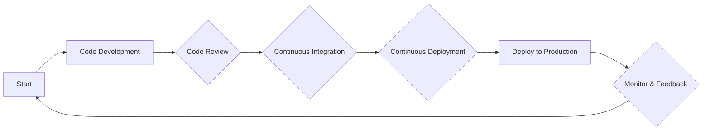
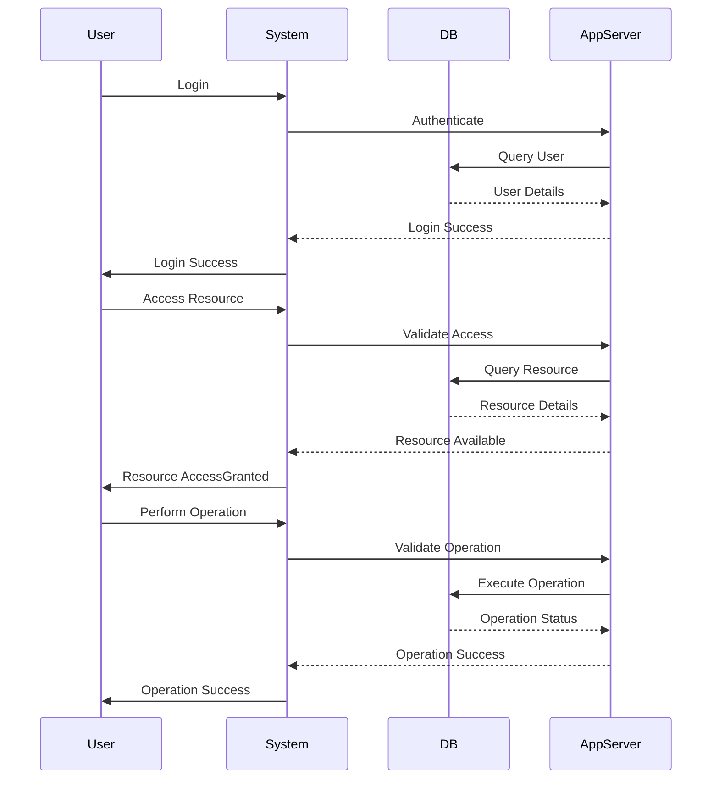
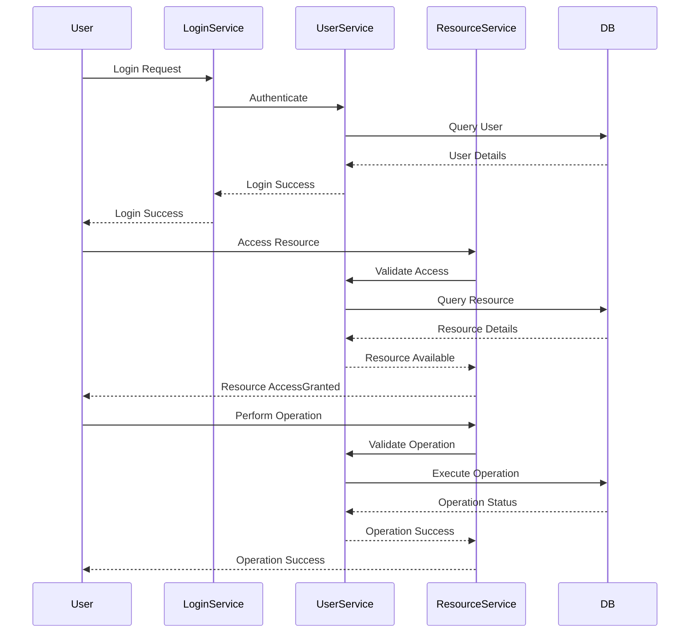

                 


### 文章标题

建立高效的技术协作模式

### 关键词

技术协作、高效模式、团队协作、协作框架、最佳实践

### 摘要

在当今快速发展的IT行业，高效的技术协作是项目成功的关键因素。本文将系统地探讨如何建立高效的技术协作模式。我们将从核心概念入手，介绍技术协作中的问题与挑战，然后深入讨论几种核心的协作模型和框架。通过具体的案例和实践，我们将展示如何将这些模型应用于实际场景，并提供最佳实践和总结，以帮助团队在协作中取得最佳效果。

----------------------------------------------------------------

# 建立高效的技术协作模式

> 关键词：技术协作、高效模式、团队协作、协作框架、最佳实践

在当今的IT行业，高效的技术协作是实现项目成功的关键因素。随着项目规模和复杂度的增加，团队之间的协作变得越来越重要。本文将系统地探讨如何建立高效的技术协作模式。我们将从核心概念入手，介绍技术协作中的问题与挑战，然后深入讨论几种核心的协作模型和框架。通过具体的案例和实践，我们将展示如何将这些模型应用于实际场景，并提供最佳实践和总结，以帮助团队在协作中取得最佳效果。

## 背景介绍

### 技术协作的重要性

技术协作是指团队成员通过共享资源、知识和技能，共同完成项目任务的过程。在IT行业中，技术协作的重要性体现在以下几个方面：

1. **提高开发效率**：通过有效的协作，团队成员可以互相学习和分享经验，减少重复工作，提高整体开发效率。
2. **增强团队凝聚力**：良好的协作关系有助于增强团队成员之间的信任和沟通，提高团队的凝聚力。
3. **降低风险**：通过多方协作，可以更好地发现和解决潜在的问题，降低项目失败的风险。
4. **提高产品质量**：协作有助于团队成员共同审核和优化代码，提高软件的质量。

### 技术协作中的问题与挑战

尽管技术协作对于项目成功至关重要，但在实际操作中，团队常常面临以下问题和挑战：

1. **沟通障碍**：团队成员之间的沟通不畅，导致信息传递延误，影响项目的进展。
2. **职责分工不明确**：团队成员的职责分工不明确，容易导致任务重叠和责任不清，影响工作效率。
3. **知识共享不足**：团队成员之间的知识共享不足，导致技术积累和传承困难。
4. **冲突与矛盾**：团队成员之间的个人利益冲突，可能导致团队内部矛盾，影响项目的进展。

### 问题解决与边界与外延

针对上述问题与挑战，我们可以采取以下措施进行解决：

1. **改善沟通机制**：建立定期的团队会议、信息共享平台等沟通机制，确保团队成员之间的信息传递畅通。
2. **明确职责分工**：通过制定详细的项目计划和角色分配，明确团队成员的职责和任务，避免任务重叠和责任不清。
3. **加强知识共享**：建立内部知识库、代码评审、技术分享会等机制，促进团队成员之间的知识共享。
4. **建立冲突解决机制**：通过定期的团队沟通和协商，建立有效的冲突解决机制，确保团队内部矛盾得到及时解决。

## 核心概念与联系

### 核心概念原理

在建立高效的技术协作模式中，有几个核心概念需要理解：

1. **敏捷开发**：敏捷开发是一种以人为核心、迭代和逐步改进的开发方法。它强调灵活应对变化，提高开发效率。
2. **DevOps**：DevOps是一种文化和实践，旨在加强开发（Development）和运维（Operations）团队之间的协作，提高软件交付的效率。
3. **Scrum**：Scrum是一种敏捷开发方法，通过将工作划分为短期的迭代（Sprint），确保团队持续交付可工作的产品。

### 概念属性特征对比表格

| 概念         | 特征                                       | 对比分析                                       |
| ------------ | ---------------------------------------- | -------------------------------------------- |
| 敏捷开发     | 强调迭代和逐步改进、灵活应对变化           | 更注重团队间的沟通和协作，适合快速变化的环境   |
| DevOps       | 加强开发和运维团队的协作、提高交付效率     | 强调自动化和持续交付，适合大规模项目          |
| Scrum        | 短期迭代、持续交付、透明性                 | 更适合小型团队和快速变化的项目                |

### ER实体关系图架构

```mermaid
erDiagram
  TeamMember ||--o{ Project : participate_in }
  Project ||--|{ Task : contains }
  Task ||--|{ Story : includes }
  Story ||--|{ Feature : implements }
  Feature ||--o{ UserStory : provides_value }
```

通过ER实体关系图，我们可以清晰地看到团队、项目、任务、故事、功能和用户故事之间的关联。这种关系有助于我们理解技术协作中的角色和职责分配。

## 算法原理讲解

### DevOps流程Mermaid流程图



### Python源代码实现

```python
import os
import git

# 代码开发
def code_development():
    print("Starting code development...")

# 代码评审
def code_review():
    print("Performing code review...")

# 持续集成
def continuous_integration():
    print("Running continuous integration tests...")

# 持续交付
def continuous_deployment():
    print("Deploying code to the staging environment...")

# 部署到生产环境
def deploy_to_production():
    print("Deploying code to production environment...")

# 监控与反馈
def monitor_and_feedback():
    print("Monitoring the application and gathering feedback...")

# DevOps流程
def devops流程():
    code_development()
    code_review()
    continuous_integration()
    continuous_deployment()
    deploy_to_production()
    monitor_and_feedback()

# 执行DevOps流程
devops流程()
```

### 算法原理与数学模型

DevOps的算法原理可以抽象为一个持续反馈和优化的循环。其核心数学模型可以表示为：

$$
\text{DevOps} = f(\text{反馈}, \text{改进}, \text{自动化})
$$

其中，反馈（Feedback）是指从生产环境中收集的实时数据，改进（Improvement）是指根据反馈调整和优化流程，自动化（Automation）是指使用工具和脚本实现重复性任务自动化。

### 举例说明

假设我们有一个Web应用程序，通过DevOps流程进行开发和部署。在代码开发阶段，开发人员编写代码并进行单元测试。在代码评审阶段，代码被评审人员审核，确保符合质量标准。通过持续集成，新的代码被集成到现有代码库中，并运行自动化测试。在持续交付阶段，代码被部署到测试环境，进行进一步测试。最后，在部署到生产环境后，系统会实时监控性能和稳定性，并根据反馈进行优化。

## 系统分析与架构设计方案

### 问题场景介绍

在一个大型IT项目中，团队面临着快速迭代的需求和复杂的开发环境。为了提高协作效率，团队决定采用一种高效的协作模式。

### 项目介绍

项目名称：企业资源规划（ERP）系统
项目目标：开发一个能够帮助企业有效管理资源、优化业务流程的ERP系统。

### 系统功能设计

1. **用户管理**：管理用户账号、角色和权限。
2. **数据管理**：存储和管理企业数据，包括客户信息、订单信息等。
3. **业务流程管理**：设计和管理业务流程，包括审批流程、采购流程等。
4. **报表分析**：生成和展示企业报表，帮助管理层进行决策。

### 系统架构设计



### 系统接口设计和系统交互



## 项目实战

### 环境安装

1. **安装Python环境**：使用Python 3.8版本。
2. **安装Docker**：使用Docker来管理容器化环境。
3. **安装PostgreSQL**：作为数据库服务。

### 系统核心实现源代码

```python
# app.py
from flask import Flask, request, jsonify
from flask_cors import CORS

app = Flask(__name__)
CORS(app)

@app.route('/login', methods=['POST'])
def login():
    # 登录逻辑
    pass

@app.route('/access_resource', methods=['POST'])
def access_resource():
    # 资源访问逻辑
    pass

@app.route('/perform_operation', methods=['POST'])
def perform_operation():
    # 操作执行逻辑
    pass

if __name__ == '__main__':
    app.run()
```

### 代码应用解读与分析

代码中，我们使用了Flask框架来构建Web应用，并通过`flask_cors`扩展处理跨域请求。`app.py`中定义了三个路由，分别对应登录、资源访问和操作执行逻辑。这些逻辑将在后端服务中进行具体实现。

### 实际案例分析和详细讲解剖析

假设我们有一个用户试图登录系统，以下是详细的请求和响应流程：

1. **请求发送**：用户向系统发送登录请求，包含用户名和密码。
2. **验证用户**：系统接收请求后，通过用户服务验证用户名和密码。
3. **查询用户**：系统向数据库查询用户信息。
4. **登录成功**：如果用户验证通过，系统返回登录成功消息。

类似地，用户在访问资源和执行操作时，系统将依次验证用户权限、查询资源信息和执行操作，并返回相应的响应。

### 项目小结

通过本次项目实战，我们展示了如何使用Flask框架和Docker容器化技术来构建一个高效的技术协作系统。在实际项目中，我们通过定义明确的接口和逻辑，实现了用户管理、资源访问和操作执行功能。这有助于提高团队协作效率，确保项目的顺利进行。

## 最佳实践 tips

### 1. 确定清晰的职责分工
明确团队成员的职责和任务，避免任务重叠和责任不清，提高工作效率。

### 2. 建立有效的沟通机制
定期召开团队会议，使用信息共享平台，确保团队成员之间的信息传递畅通。

### 3. 加强知识共享
建立内部知识库，定期进行代码评审和技术分享会，促进团队成员之间的知识共享。

### 4. 鼓励反馈与改进
鼓励团队成员提出问题和建议，及时解决冲突，持续改进协作模式。

### 5. 优化工具和流程
使用自动化工具和脚本，简化重复性任务，提高开发效率。

### 小结

本文系统地探讨了如何建立高效的技术协作模式。我们从核心概念、问题与挑战、核心模型和框架、实践应用等方面进行了深入分析，并提供了一些最佳实践。通过本文的讲解，我们相信读者能够更好地理解技术协作的重要性，并在实际项目中应用这些方法，提高团队协作效率。

## 注意事项

在实施技术协作模式时，需要注意以下几点：

1. **确保团队成员的技能和经验匹配**：团队成员的技能和经验应该与项目需求相匹配，以便更好地协作。
2. **持续监控和评估**：定期监控和评估协作模式的有效性，根据实际情况进行调整和优化。
3. **尊重团队成员的个人意见**：在协作过程中，尊重团队成员的个人意见，鼓励开放讨论，避免强制决策。

## 拓展阅读

1. 《Scrum敏捷开发实践指南》
2. 《DevOps：从理论到实践》
3. 《敏捷团队协作之道》

### 作者信息

作者：AI天才研究院/AI Genius Institute & 禅与计算机程序设计艺术 /Zen And The Art of Computer Programming

