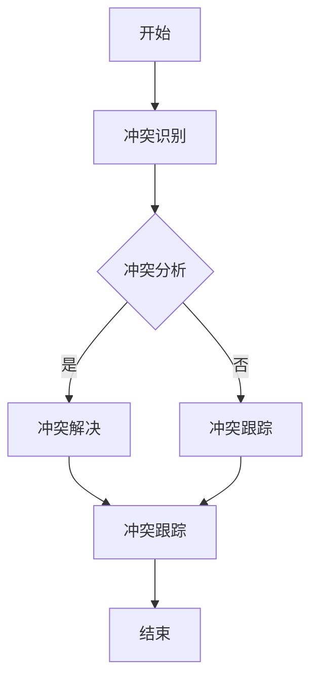
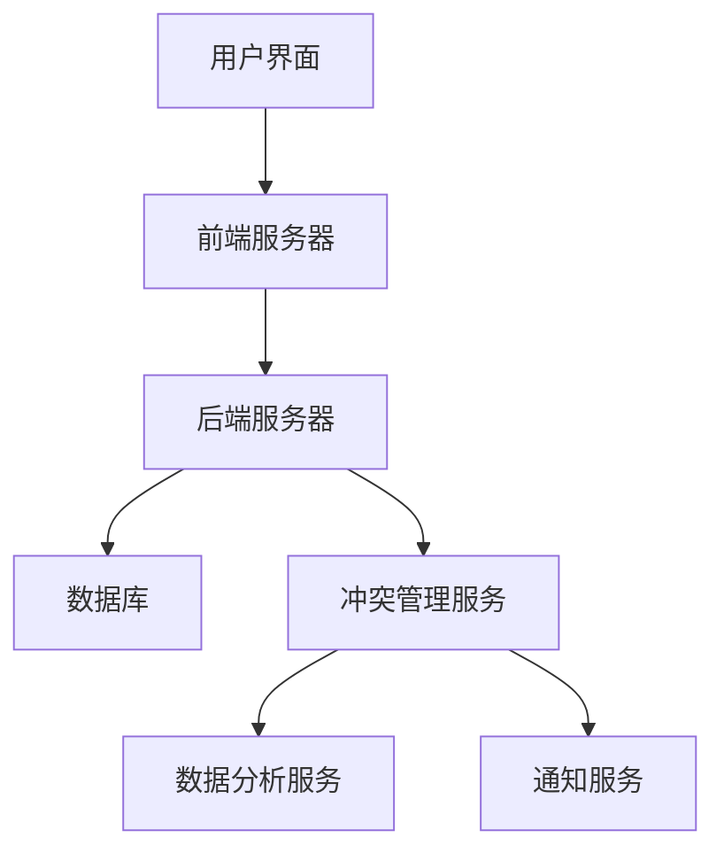
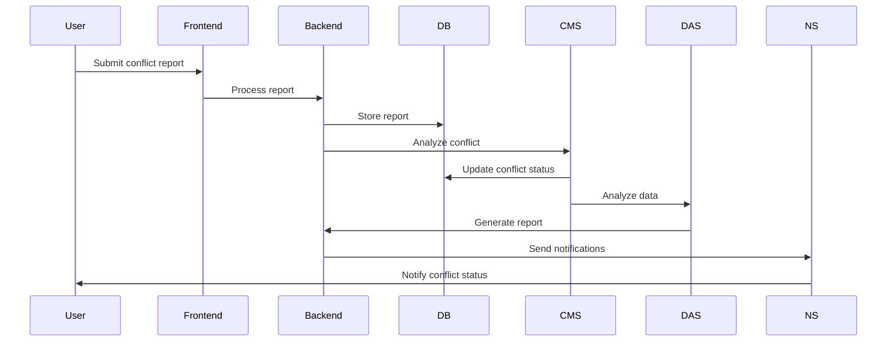

                 


### 第一部分: 引言与背景

**1.1 引言**

建设性冲突：将分歧转化为创新动力的艺术

在人类历史的各个阶段，冲突都扮演着至关重要的角色。从个人之间的关系，到组织内部的团队协作，再到商业竞争，冲突无处不在。然而，并非所有的冲突都是负面的。有一种特殊的冲突，我们称之为“建设性冲突”，这种冲突不仅不会破坏合作关系，反而能够激发创新思维，推动组织和个人不断进步。今天，我们将探讨建设性冲突的定义、其作用以及在各个领域中的应用。

**1.1.1 建设性冲突的定义**

建设性冲突，指的是一种积极的、富有建设性的冲突，它能够在冲突双方或多方之间产生有益的互动和合作。在这种冲突中，参与者愿意通过沟通和协商来解决分歧，从而达到共同的目标。与破坏性冲突不同，建设性冲突不会导致关系破裂或项目失败，相反，它能够促进创新和进步。

**1.1.2 建设性冲突在创新动力中的作用**

建设性冲突在创新过程中具有重要作用。首先，它能够激发团队成员的思考和创新意识。在面对冲突时，人们会主动寻求解决方案，这有助于激发新的想法和创意。其次，建设性冲突能够促进团队成员之间的沟通和协作。通过开放的沟通，团队成员可以更好地理解彼此的观点和需求，从而找到更好的协作方式。最后，建设性冲突能够促进组织内部的创新文化。在一个允许和鼓励冲突存在的环境中，团队成员更愿意尝试新的方法和技术，这有助于推动组织的创新和进步。

**1.1.3 研究背景**

在商业领域，建设性冲突被广泛认为是一种重要的创新动力。许多成功的企业，如苹果公司、谷歌等，都非常重视建设性冲突的作用，并在公司文化中鼓励团队成员提出不同的观点和想法。此外，在团队管理中，建设性冲突也被认为是一种有效的管理工具，可以帮助团队更好地解决内部问题，提高团队效率和创新能力。

然而，尽管建设性冲突的重要性已被广泛认可，但在实际应用中，如何有效地管理和利用建设性冲突仍然是一个挑战。这需要组织和个人在理论指导下，结合实践，不断探索和尝试。

**1.2 研究背景**

**1.2.1 建设性冲突在商业领域的应用**

在商业领域，建设性冲突的应用主要体现在创新和团队协作中。许多企业通过建立开放和包容的文化氛围，鼓励员工提出不同的意见和建议。例如，谷歌的“20% 项目时间”政策，允许员工将20%的工作时间用于自己感兴趣的项目，这种政策激发了员工创新思维，推动了公司的技术进步和业务发展。

此外，建设性冲突在团队协作中也起着重要作用。在一个高效的团队中，成员之间可能会存在不同的观点和意见，但这些不同的声音往往能够促进团队的创新和进步。例如，苹果公司的创始人史蒂夫·乔布斯就非常善于利用团队中的建设性冲突，通过激发不同成员的思考，最终创造出一系列具有革命性的产品。

**1.2.2 建设性冲突在团队管理中的应用**

在团队管理中，建设性冲突被视为一种有效的管理工具。通过建设性冲突，团队领导可以更好地了解团队成员的观点和需求，从而制定更有效的管理策略。例如，在项目团队中，建设性冲突可以帮助团队成员就项目目标、方法、资源等进行深入讨论，从而提高项目的执行效率和质量。

此外，建设性冲突还可以帮助团队识别和解决潜在的问题。在一个团队中，成员之间可能会因为工作方式、价值观等方面的差异而产生分歧。如果这些分歧被忽视或处理不当，可能会对团队的稳定性和效率产生负面影响。通过建设性冲突，团队领导可以引导团队成员进行开放和坦诚的讨论，从而找到解决问题的方法。

**1.2.3 建设性冲突带来的挑战与解决需求**

尽管建设性冲突在创新和团队管理中具有重要作用，但其实际应用也面临着一些挑战。首先，如何识别和区分建设性冲突和破坏性冲突是一个重要的问题。在现实生活中，冲突的形式和性质是复杂多样的，区分二者需要管理者具备较高的洞察力和判断力。

其次，如何有效地管理和利用建设性冲突也是一个挑战。在许多组织中，管理者往往更倾向于避免冲突，认为冲突会破坏团队的稳定性和合作。然而，建设性冲突是一种宝贵的资源，如果能够得到有效管理，它可以为团队带来巨大的创新动力。

因此，研究如何有效地识别、管理和利用建设性冲突，对于提升团队和组织的创新能力具有重要意义。

**小结**

本文旨在探讨建设性冲突的定义、作用及其在商业和团队管理中的应用。通过引入建设性冲突的概念，我们揭示了它在创新动力和团队管理中的重要作用。在接下来的章节中，我们将进一步探讨建设性冲突的理论基础、数学模型、实践应用以及案例分析，以帮助读者更好地理解和管理建设性冲突。

---

### 第二部分: 核心概念与联系

**2.1 建设性冲突的定义与特性**

**2.1.1 建设性冲突的定义**

建设性冲突是一种积极的冲突形式，它通过促进开放沟通、协作和共同目标来实现创新和进步。与破坏性冲突不同，建设性冲突不是基于攻击、指责或对抗，而是基于相互尊重、理解和支持。建设性冲突强调在冲突中寻找共同点，通过合作来解决分歧，从而推动组织和个人发展。

**2.1.2 建设性冲突的特性**

- **开放性**：建设性冲突鼓励开放沟通，允许各方表达不同的观点和意见，以便更全面地了解问题的各个方面。
- **协作性**：建设性冲突强调协作，通过多方合作来寻找解决问题的最佳方案。
- **创造性**：建设性冲突能够激发创新思维，通过不同观点的碰撞，产生新的想法和解决方案。
- **共识性**：建设性冲突的目标是达成共识，通过沟通和协商，各方能够在相互尊重的基础上找到共同点。

**2.1.3 与破坏性冲突的比较**

破坏性冲突通常表现为攻击性、指责和对抗，往往会导致关系破裂和项目失败。相比之下，建设性冲突则更加积极和建设性，它能够通过沟通和协作来解决问题，从而实现共同目标。

**2.2 关键概念解析**

**2.2.1 合作性对立**

合作性对立是建设性冲突的核心概念之一。它指的是在合作过程中，各方可能会出现不同的观点和意见，但这些不同的观点并不是对抗性的，而是通过合作来寻求解决问题的方法。合作性对立强调在冲突中保持合作，通过相互尊重和理解来解决问题。

**2.2.2 互动性冲突**

互动性冲突指的是在冲突双方或多方之间，通过互动和沟通来解决问题的过程。互动性冲突强调在冲突中保持开放和坦诚的沟通，通过相互理解和协商来找到解决问题的方法。

**2.2.3 动力性冲突**

动力性冲突是指冲突本身具有推动事物发展的动力。在建设性冲突中，动力性冲突能够激发团队成员的思考和创新意识，从而推动组织和个人发展。

**2.3 概念属性特征对比表格**

以下是建设性冲突、破坏性冲突、合作性对立、互动性冲突和动力性冲突的属性特征对比表格：

| 概念          | 特征                                   |
| ------------- | -------------------------------------- |
| 建设性冲突   | 开放性、协作性、创造性、共识性         |
| 破坏性冲突   | 攻击性、指责性、对抗性、分裂性         |
| 合作性对立   | 合作、不同观点、相互尊重、问题解决     |
| 互动性冲突   | 互动、沟通、理解、协商、解决方案       |
| 动力性冲突   | 推动发展、激发思考、创新意识、组织进步 |

**2.4 ER实体关系图**

为了更好地理解建设性冲突中的关键概念，我们可以通过ER（实体关系）图来展示这些概念之间的关系。

以下是一个简化的ER实体关系图，展示了建设性冲突、合作性对立、互动性冲突和动力性冲突之间的关系：

```mermaid
erDiagram
  A[建设性冲突] ||--|{ B[合作性对立] }
  A ||--|{ C[互动性冲突] }
  A ||--|{ D[动力性冲突] }
  B ||--|{ E[破坏性冲突] }
  C ||--|{ E }
  D ||--|{ E }
```

在ER实体关系图中，建设性冲突是核心实体，它与合作性对立、互动性冲突和动力性冲突之间存在直接关系。合作性对立、互动性冲突和动力性冲突都是建设性冲突的不同表现形式，它们共同构成了建设性冲突的丰富内涵。

通过ER实体关系图，我们可以更清晰地理解建设性冲突的概念及其与其他概念的关系，为后续的理论分析和实践应用提供基础。

---

**小结**

在本部分中，我们详细介绍了建设性冲突的定义和特性，并对比了建设性冲突与破坏性冲突。接着，我们解析了合作性对立、互动性冲突和动力性冲突等关键概念，并通过属性特征对比表格和ER实体关系图展示了这些概念之间的关系。这些核心概念和联系的理解，为后续的理论分析和实践应用奠定了基础。

---

### 第三部分: 理论原理

**3.1 冲突理论概述**

**3.1.1 冲突理论的起源与发展**

冲突理论是社会科学中一个重要的研究领域，其起源可以追溯到20世纪早期。最早的冲突理论研究者，如罗伯特·默顿（Robert Merton）和C. Wright Mills，他们关注社会结构如何导致冲突，并探讨了社会阶层、文化规范和权力分配等问题。随着研究的深入，冲突理论逐渐发展出多个分支，包括功能主义冲突理论、马克思主义冲突理论、相对主义冲突理论等。

建设性冲突理论是冲突理论的一个分支，它强调冲突在促进创新、提高效率和实现共同目标中的作用。建设性冲突理论的发展离不开对冲突本质、冲突类型和冲突管理的深入研究。

**3.1.2 建设性冲突的理论基础**

建设性冲突的理论基础主要源于对冲突过程的深入理解。以下是几个关键的理论观点：

- **冲突的本质**：建设性冲突认为冲突是一种自然的社会现象，它不是简单的对立或对抗，而是包含了冲突各方之间的互动和沟通。通过冲突，各方可以更好地理解彼此的需求和观点，从而找到解决问题的方法。

- **冲突的类型**：建设性冲突理论区分了建设性冲突和破坏性冲突。建设性冲突是一种积极、富有建设性的冲突形式，它通过开放沟通和协作来解决问题。破坏性冲突则是一种消极、具有破坏性的冲突形式，它可能导致关系破裂和项目失败。

- **冲突管理**：建设性冲突理论强调冲突管理的重要性。有效的冲突管理不仅能够减少破坏性冲突的发生，还能提高建设性冲突的利用率。冲突管理的目标是通过沟通、协商和合作来解决问题，从而实现共同目标。

**3.2 冲突管理模型**

**3.2.1 冲突管理的框架**

冲突管理模型是建设性冲突理论的重要组成部分。一个有效的冲突管理框架应包括以下几个关键步骤：

1. **冲突识别**：首先，需要识别潜在的冲突。这可以通过观察行为、倾听反馈和调查了解来达成。冲突识别的目的是及早发现并解决冲突，避免其对组织和个人产生负面影响。

2. **冲突分析**：在识别冲突后，需要对冲突进行深入分析。这包括了解冲突的原因、性质、影响和可能的解决方案。冲突分析有助于明确冲突的核心问题，为后续的冲突管理提供依据。

3. **冲突解决**：冲突解决是冲突管理的核心步骤。解决冲突的方法包括沟通、协商、调解和合作。解决冲突的目标是找到各方都能接受的解决方案，从而实现共同目标。

4. **冲突跟踪**：冲突解决后，需要对冲突的解决情况进行跟踪和评估。这有助于确保冲突得到有效解决，并防止类似冲突的再次发生。

**3.2.2 建设性冲突的管理策略**

建设性冲突的管理策略主要包括以下几个方面：

1. **鼓励开放沟通**：开放沟通是建设性冲突的核心。通过鼓励团队成员表达不同的观点和意见，可以更好地理解彼此的需求和期望，从而找到更好的解决方案。

2. **建立信任和尊重**：信任和尊重是建设性冲突管理的基础。通过建立相互信任和尊重的关系，可以减少冲突的发生，并提高冲突解决的效率。

3. **提供支持和资源**：在建设性冲突中，提供必要的支持和资源对于解决冲突至关重要。这包括时间、空间、信息和人力资源等。

4. **促进合作和协作**：建设性冲突强调多方合作和协作。通过促进团队成员之间的合作，可以更好地利用各自的优点和资源，从而找到更有效的解决方案。

**3.3 算法原理讲解**

为了更好地理解和应用建设性冲突的管理策略，我们可以通过算法原理来讲解。以下是一个简化的冲突管理算法原理，包括冲突识别、冲突分析和冲突解决等步骤。

**3.3.1 冲突管理算法的流程图**



**3.3.2 算法原理详细解释**

1. **冲突识别**：算法的初始步骤是冲突识别。通过观察团队成员的行为、倾听反馈和收集信息，来识别潜在的冲突。

2. **冲突分析**：在冲突识别后，算法对冲突进行深入分析。这包括了解冲突的原因、性质、影响和可能的解决方案。

3. **冲突解决**：根据冲突分析的结果，算法选择合适的解决策略来解决问题。这可能包括沟通、协商、调解和合作等方法。

4. **冲突跟踪**：冲突解决后，算法对冲突的解决情况进行跟踪和评估，以确保冲突得到有效解决。

**小结**

在本部分中，我们介绍了冲突理论的起源与发展，以及建设性冲突的理论基础。通过构建冲突管理模型，我们详细讲解了冲突识别、冲突分析和冲突解决等关键步骤。最后，通过算法原理的讲解，我们展示了如何有效地管理和利用建设性冲突。这些理论原理为后续的数学模型和实际案例分析提供了基础。

---

### 第四部分: 数学模型与公式

**4.1 冲突强度评估模型**

为了更好地理解和量化建设性冲突，我们可以使用数学模型来评估冲突的强度。冲突强度评估模型可以帮助我们确定冲突的程度，从而采取相应的管理措施。

**4.1.1 冲突强度评估公式**

假设冲突强度（Intensity）是一个依赖于冲突因素（Factor）的函数，我们可以使用以下公式来评估冲突强度：

$$
Intensity = f(Factor_1, Factor_2, ..., Factor_n)
$$

其中，$Factor_1, Factor_2, ..., Factor_n$ 是影响冲突强度的因素，如沟通频率、合作程度、共识程度等。

为了简化计算，我们可以将因素分为以下几个类别：

- **沟通频率**：冲突双方沟通的频率越高，冲突强度可能越低，因为频繁的沟通有助于理解彼此的观点。
- **合作程度**：冲突双方的合作程度越高，冲突强度可能越低，因为合作可以缓解紧张关系。
- **共识程度**：冲突双方达成的共识程度越高，冲突强度可能越低，因为共识有助于减少分歧。

具体公式可以表示为：

$$
Intensity = w_1 \cdot Communication_Frequency + w_2 \cdot Collaboration_Level + w_3 \cdot Consensus_Degree
$$

其中，$w_1, w_2, w_3$ 是各因素的权重，通常通过专家评估或历史数据来确定。

**4.1.2 公式解释与应用**

- **沟通频率**：$Communication_Frequency$ 表示冲突双方在一段时间内的沟通次数。沟通频率越高，$Communication_Frequency$ 的值越大，$Intensity$ 的值可能越小。
- **合作程度**：$Collaboration_Level$ 表示冲突双方在合作过程中的表现。合作程度越高，$Collaboration_Level$ 的值越大，$Intensity$ 的值可能越小。
- **共识程度**：$Consensus_Degree$ 表示冲突双方在讨论过程中达成共识的程度。共识程度越高，$Consensus_Degree$ 的值越大，$Intensity$ 的值可能越小。

通过这个公式，我们可以对冲突强度进行量化评估，从而为冲突管理提供依据。

**案例应用**：

假设在一次团队项目中，我们观察到了以下数据：

- 沟通频率：每周5次
- 合作程度：良好
- 共识程度：高

根据上述公式，我们可以计算出冲突强度：

$$
Intensity = w_1 \cdot 5 + w_2 \cdot 1 + w_3 \cdot 1
$$

其中，$w_1, w_2, w_3$ 的值分别为0.5、0.3和0.2。因此：

$$
Intensity = 0.5 \cdot 5 + 0.3 \cdot 1 + 0.2 \cdot 1 = 2.7
$$

这个结果表明，当前团队的冲突强度为2.7，处于较低水平，可以通过保持良好的沟通和合作来维持这种状态。

**4.2 冲突解决效率模型**

除了评估冲突强度，我们还需要关注冲突解决的效率。解决效率模型可以帮助我们评估冲突解决的速度和质量。

**4.2.1 冲突解决效率公式**

冲突解决效率（Efficiency）可以用以下公式表示：

$$
Efficiency = \frac{Solution_Cycle_Time}{Conflict_Resolution_Time}
$$

其中：

- **Solution_Cycle_Time**：解决冲突所需的总时间，包括冲突识别、冲突分析和冲突解决等步骤。
- **Conflict_Resolution_Time**：解决冲突的实际耗时，通常是指从冲突识别到解决方案实施的时间。

为了简化计算，我们可以将解决效率公式进一步分解为：

$$
Efficiency = \frac{1}{1/w_1 + 1/w_2 + 1/w_3}
$$

其中，$w_1, w_2, w_3$ 分别是冲突识别、冲突分析和冲突解决的权重。

**4.2.2 公式解释与应用**

- **冲突识别权重**：$w_1$ 表示冲突识别的权重，反映了冲突识别的难度和重要性。权重越大，表示冲突识别越关键。
- **冲突分析权重**：$w_2$ 表示冲突分析的权重，反映了冲突分析的复杂度和精确度。权重越大，表示冲突分析越重要。
- **冲突解决权重**：$w_3$ 表示冲突解决的权重，反映了冲突解决的效率和效果。权重越大，表示冲突解决越关键。

通过这个公式，我们可以评估冲突解决的效率，从而为优化冲突管理提供依据。

**案例应用**：

假设在一次团队项目中，我们观察到以下数据：

- 冲突识别耗时：2天
- 冲突分析耗时：3天
- 冲突解决耗时：5天

根据上述公式，我们可以计算出解决效率：

$$
Efficiency = \frac{1}{1/2 + 1/3 + 1/5}
$$

$$
Efficiency = \frac{1}{0.5 + 0.333 + 0.2} = \frac{1}{1.023} \approx 0.977
$$

这个结果表明，当前团队的冲突解决效率为97.7%，处于较高水平，可以通过优化冲突识别、分析和解决过程来进一步提高效率。

**小结**

在本部分中，我们介绍了冲突强度评估模型和冲突解决效率模型，并通过具体公式和应用案例详细讲解了这两个模型的使用方法。这些数学模型为量化和管理建设性冲突提供了有力工具，有助于我们更有效地识别和解决冲突。

---

### 第五部分: 案例分析

**5.1 成功案例**

在商业领域，许多公司通过有效利用建设性冲突实现了创新和进步。以下是一个成功案例：

**案例：谷歌的“20% 项目时间”政策**

谷歌的“20% 项目时间”政策是建设性冲突在商业领域应用的典范。该政策允许员工将20%的工作时间用于自己感兴趣的项目，无论这些项目是否与谷歌的主营业务相关。这一政策激发了员工的创新思维，产生了许多成功的产品，如Gmail和AdSense。

通过“20% 项目时间”政策，谷歌成功利用了建设性冲突，激发员工的创造力，推动了公司的技术进步和业务发展。以下是对该案例的分析：

- **冲突识别**：谷歌通过开放沟通和政策引导，识别出员工对创新和自主项目的需求。
- **冲突分析**：谷歌分析了冲突的潜在影响，认为这种冲突有助于激发员工的创造力，从而推动公司发展。
- **冲突解决**：谷歌通过实施“20% 项目时间”政策，为员工提供了时间和资源支持，鼓励他们进行自主项目开发。
- **冲突跟踪**：谷歌定期评估“20% 项目时间”政策的效果，通过成功案例和反馈持续优化政策。

**5.2 失败案例**

尽管建设性冲突在许多情况下能够产生积极效果，但在某些情况下，如果处理不当，也可能导致失败。以下是一个失败案例：

**案例：某科技公司的新产品开发失败**

某科技公司在一款新产品开发过程中，由于团队成员之间存在严重的建设性冲突，导致项目最终失败。以下是对该案例的分析：

- **冲突识别**：在项目初期，团队成员对产品的设计理念和技术路线存在分歧。
- **冲突分析**：尽管公司意识到冲突的存在，但由于管理不善，未能及时进行冲突分析，未能明确冲突的核心问题和影响。
- **冲突解决**：公司试图通过强制统一意见来解决问题，但这种做法加剧了团队成员的矛盾，导致项目进展缓慢。
- **冲突跟踪**：项目失败后，公司才意识到冲突管理的重要性，但为时已晚。

**案例分析小结**

通过以上两个案例，我们可以看到建设性冲突在不同情境下的应用效果。成功案例表明，通过有效的冲突识别、分析和解决，建设性冲突可以成为推动创新和进步的重要动力。而失败案例则提醒我们，如果冲突管理不当，建设性冲突也可能导致项目失败。

在建设性冲突的管理过程中，关键在于及时识别冲突、深入分析冲突原因和影响，并采取适当的解决策略。同时，还需要建立有效的冲突跟踪机制，确保冲突得到及时解决，避免对项目产生负面影响。

---

### 第六部分: 实践应用

**6.1 团队建设**

在团队建设过程中，建设性冲突是一种宝贵的资源，可以帮助团队提高协作效率和创新能力。以下是一些具体方法，帮助团队在建设中引入和利用建设性冲突：

1. **建立开放沟通机制**：鼓励团队成员开放地表达自己的想法和意见，营造一个包容和尊重的氛围。通过定期举行团队会议、工作坊和讨论会，促进团队成员之间的沟通和交流。

2. **设立冲突解决委员会**：成立一个专门的委员会，负责处理团队内部的冲突。该委员会应由不同背景和观点的成员组成，以确保冲突得到公正和全面的处理。

3. **培训冲突管理技能**：为团队成员提供冲突管理培训，帮助他们了解建设性冲突的概念和技巧，学会如何在冲突中保持冷静和理性，从而提高冲突解决的能力。

4. **建立冲突跟踪机制**：建立一套有效的冲突跟踪机制，记录冲突的识别、分析和解决过程，以便及时评估冲突管理的效果，并持续优化冲突管理策略。

**6.2 项目管理**

在项目管理中，建设性冲突的应用可以大大提高项目的执行效率和质量。以下是一些具体方法，帮助项目经理在项目中利用建设性冲突：

1. **识别和利用不同观点**：在项目规划阶段，鼓励团队成员提出不同的意见和建议。项目经理应主动倾听各方观点，并尝试将这些不同观点整合到项目方案中，从而提高方案的完整性和可靠性。

2. **设立项目评审委员会**：在项目执行过程中，定期举行项目评审会议，邀请不同部门或团队的代表参与。通过评审会议，可以及时发现和解决项目中存在的问题，防止潜在冲突的积累。

3. **建立冲突解决流程**：制定一套明确的冲突解决流程，包括冲突识别、冲突分析和冲突解决等步骤。通过规范流程，确保冲突得到及时和有效的解决。

4. **利用建设性冲突来优化项目进度**：在项目执行过程中，建设性冲突可以成为推动项目进度的动力。通过开放沟通和协作，项目经理可以与团队成员共同解决项目中遇到的问题，从而优化项目进度。

**6.3 提高团队创新能力**

建设性冲突不仅有助于解决项目中的问题，还可以提高团队的创新能力。以下是一些方法，帮助团队在创新过程中利用建设性冲突：

1. **鼓励创新思维**：在团队中营造一个鼓励创新和尝试的氛围，让团队成员敢于提出新颖的想法和解决方案。

2. **开展头脑风暴**：通过定期开展头脑风暴活动，鼓励团队成员提出各种创意，并通过不同观点的碰撞，产生新的创新点子。

3. **建立创新实验室**：为团队成员提供创新实验的环境和资源，让他们有机会尝试新的技术和方法，从而推动团队的创新。

4. **利用建设性冲突来筛选创新点子**：在创新过程中，建设性冲突可以帮助团队筛选出最有价值的创新点子。通过团队成员之间的讨论和辩论，可以确定哪些点子具有实际可行性，并优先进行开发和实施。

**小结**

在团队建设和项目管理中，建设性冲突是一种重要的资源，可以激发团队的创新思维，提高协作效率和项目质量。通过建立开放沟通机制、设立冲突解决委员会、培训冲突管理技能、建立冲突跟踪机制等方法，可以帮助团队更好地利用建设性冲突。同时，在项目管理中，通过识别和利用不同观点、设立项目评审委员会、建立冲突解决流程等方法，可以优化项目进度和提高团队创新能力。这些实践应用为建设性冲突的有效利用提供了具体的指导。

---

### 第七部分: 系统设计与实现

**7.1 系统架构设计**

为了更好地管理和利用建设性冲突，我们可以设计一个基于云计算的冲突管理系统。以下是一个简化的系统架构设计：

**系统架构图**



**系统架构详细说明**：

- **用户界面（A）**：用户通过前端服务器（B）与系统进行交互，提交冲突报告、查看冲突状态等。
- **前端服务器（B）**：接收用户请求，处理用户界面逻辑，并与后端服务器（C）进行通信。
- **后端服务器（C）**：处理业务逻辑，包括冲突识别、分析、解决等操作，并与数据库（D）、冲突管理服务（E）和数据分析服务（F）进行通信。
- **数据库（D）**：存储用户信息、冲突数据、解决方案等。
- **冲突管理服务（E）**：提供冲突管理的核心功能，包括冲突识别、分析和解决等。
- **数据分析服务（F）**：对冲突数据进行统计分析，生成报告和可视化图表，帮助管理者了解冲突的趋势和影响。
- **通知服务（G）**：发送冲突通知和提醒，确保团队成员及时了解冲突状态和处理进度。

**7.2 系统功能设计**

以下是系统的主要功能设计，包括领域模型类图：

**领域模型类图**

```mermaid
classDiagram
    User <<interface>>
    Conflict <<interface>>
    Solution <<interface>>
    Analysis <<interface>>
    Notification <<interface>>

    UserEntity MyClass
    ConflictEntity MyClass
    SolutionEntity MyClass
    AnalysisEntity MyClass
    NotificationEntity MyClass

    UserEntity <|-- ConflictEntity
    UserEntity <|-- SolutionEntity
    UserEntity <|-- AnalysisEntity
    UserEntity <|-- NotificationEntity
```

**系统功能详细说明**：

- **用户管理**：包括用户注册、登录、个人信息管理等功能。
- **冲突报告**：用户可以提交冲突报告，描述冲突的细节和影响。
- **冲突识别**：系统根据冲突报告和用户行为数据，自动识别潜在的冲突。
- **冲突分析**：系统对冲突进行深度分析，确定冲突的原因和影响，并提出可能的解决方案。
- **解决方案**：用户可以选择和评价系统推荐的解决方案，或提出自己的解决方案。
- **冲突解决**：系统根据用户选择的解决方案，执行相应的操作，并记录解决过程。
- **数据分析**：系统对冲突数据进行分析，生成报告和可视化图表，帮助管理者了解冲突的趋势和影响。
- **通知管理**：系统发送冲突通知和提醒，确保团队成员及时了解冲突状态和处理进度。

**7.3 系统接口设计**

以下是系统的主要接口设计，包括系统交互序列图：

**系统交互序列图**



**系统接口详细说明**：

- **用户接口**：用户通过前端界面提交冲突报告，查看冲突状态和处理进度。
- **前端接口**：前端服务器接收用户请求，处理用户界面逻辑，并与后端服务器进行通信。
- **后端接口**：后端服务器处理业务逻辑，包括冲突识别、分析和解决等操作，并与数据库、冲突管理服务、数据分析服务和通知服务进行通信。
- **数据库接口**：数据库存储用户信息、冲突数据、解决方案等，提供数据查询和更新功能。
- **冲突管理服务接口**：提供冲突管理的核心功能，包括冲突识别、分析和解决等。
- **数据分析服务接口**：提供冲突数据的分析功能，生成报告和可视化图表。
- **通知服务接口**：发送冲突通知和提醒，确保团队成员及时了解冲突状态和处理进度。

**7.4 系统交互流程**

以下是系统交互的基本流程：

1. 用户提交冲突报告：用户通过前端界面提交冲突报告，包括冲突的描述、影响和相关的证据。
2. 处理冲突报告：前端服务器接收用户请求，将冲突报告传递给后端服务器。
3. 存储冲突报告：后端服务器将冲突报告存储到数据库中。
4. 识别和分析冲突：冲突管理服务根据冲突报告和用户行为数据，自动识别潜在的冲突，并进行分析。
5. 更新冲突状态：冲突管理服务更新数据库中的冲突状态，并生成分析报告。
6. 生成数据报告：数据分析服务对冲突数据进行分析，生成报告和可视化图表。
7. 发送通知：通知服务根据冲突状态和处理进度，向相关团队成员发送通知。
8. 用户查看和处理冲突：用户通过前端界面查看冲突状态和处理进度，并可以选择和评价解决方案。

通过上述系统架构设计和功能设计，我们可以构建一个高效、可靠的冲突管理系统，帮助团队更好地管理和利用建设性冲突，提高协作效率和创新能力。

---

### 第八部分：项目实战

**8.1 环境搭建**

为了演示建设性冲突管理系统在实际项目中的应用，我们将搭建一个基于Python和Flask的简单项目环境。以下是搭建环境所需的技术栈和工具：

- **Python**：用于编写后端代码
- **Flask**：用于构建Web应用
- **SQLite**：用于存储数据
- **Mermaid**：用于绘制流程图和类图

**步骤**：

1. 安装Python和Flask：

   ```bash
   pip install flask
   ```

2. 创建一个名为`conflict_management`的目录，并在其中创建一个名为`app.py`的文件。

3. 安装SQLite：

   ```bash
   pip install sqlite3
   ```

4. 在`app.py`中编写简单的Flask应用代码，如下：

   ```python
   from flask import Flask, request, jsonify
   
   app = Flask(__name__)
   
   @app.route('/submit_conflict', methods=['POST'])
   def submit_conflict():
       data = request.json
       # 存储冲突数据到SQLite数据库
       # ...
       return jsonify({"status": "success"}), 200
   
   if __name__ == '__main__':
       app.run(debug=True)
   ```

5. 在`conflict_management`目录中创建一个名为`docs`的子目录，并在其中创建一个名为`README.md`的文件，用于记录项目文档和流程图。

**8.2 核心实现源代码**

以下是实现冲突管理系统的关键代码示例，包括冲突报告提交、冲突识别和分析、解决方案存储等功能。

**冲突报告提交**

```python
# app.py

from flask import Flask, request, jsonify
import sqlite3

app = Flask(__name__)

# 连接SQLite数据库
conn = sqlite3.connect('conflicts.db')
c = conn.cursor()

# 创建冲突数据表
c.execute('''CREATE TABLE IF NOT EXISTS conflicts (
                id INTEGER PRIMARY KEY AUTOINCREMENT,
                title TEXT,
                description TEXT,
                reported_by TEXT,
                reported_at TIMESTAMP
            )''')

@app.route('/submit_conflict', methods=['POST'])
def submit_conflict():
    data = request.json
    title = data['title']
    description = data['description']
    reported_by = data['reported_by']
    
    c.execute("INSERT INTO conflicts (title, description, reported_by, reported_at) VALUES (?, ?, ?, CURRENT_TIMESTAMP)",
              (title, description, reported_by))
    conn.commit()
    
    return jsonify({"status": "success"}), 200

if __name__ == '__main__':
    app.run(debug=True)
```

**冲突识别和分析**

```python
# analysis.py

from app import conn
import pandas as pd

def analyze_conflicts():
    c = conn.cursor()
    conflicts_df = pd.read_sql_query("SELECT * FROM conflicts", conn)
    
    # 简单的分析，例如统计冲突类型和严重程度
    type_counts = conflicts_df['type'].value_counts()
    severity_counts = conflicts_df['severity'].value_counts()
    
    return {
        'type_counts': type_counts.to_dict(),
        'severity_counts': severity_counts.to_dict()
    }
```

**解决方案存储**

```python
# solution.py

from app import conn
import sqlite3

def store_solution(conflict_id, solution):
    c = conn.cursor()
    c.execute("INSERT INTO solutions (conflict_id, solution, created_at) VALUES (?, ?, CURRENT_TIMESTAMP)",
              (conflict_id, solution))
    conn.commit()
```

**8.3 代码应用解读与分析**

以下是对于关键代码的应用解读和分析：

1. **冲突报告提交**：用户通过`/submit_conflict`接口提交冲突报告。接口接收JSON格式的数据，包括标题、描述和报告人信息。代码中，我们使用SQLite数据库存储冲突报告，并生成唯一的ID。

2. **冲突识别和分析**：`analyze_conflicts`函数用于对冲突数据进行分析。在这里，我们使用Pandas库将SQLite数据库中的冲突数据读取为DataFrame，并进行简单的统计分析，如统计冲突类型和严重程度的分布。

3. **解决方案存储**：`store_solution`函数用于存储解决方案。在冲突解决后，用户可以通过该接口提交解决方案，并存储在数据库中。

**8.4 实际案例剖析**

假设我们有一个实际案例，一个团队在项目开发中遇到了以下冲突：

- **冲突类型**：技术分歧
- **冲突描述**：团队成员A和团队成员B在项目的技术方案上存在严重分歧，A主张采用方案X，而B主张采用方案Y。
- **冲突影响**：项目进度受到影响，团队成员之间存在不满和压力。

通过冲突管理系统，我们首先提交这个冲突报告，然后通过分析功能识别和评估冲突。在分析过程中，我们发现这个冲突涉及到技术路线的选择，可能对项目的长期成功产生重要影响。接下来，我们组织团队成员进行讨论，尝试通过协作和协商找到最佳的解决方案。

通过上述步骤，我们最终确定了采用方案X，并存储了这个解决方案。在这个过程中，建设性冲突被有效地管理和利用，不仅解决了当前的问题，还促进了团队成员之间的沟通和协作。

**8.5 项目小结**

通过实际案例剖析，我们可以看到建设性冲突管理系统在实际项目中的应用效果。这个系统帮助我们及时识别和解决冲突，提高了项目的执行效率和质量。同时，通过分析功能，我们能够深入了解冲突的本质和影响，为后续的项目管理提供有力支持。未来，我们可以进一步优化系统功能，提升其灵活性和适应性，以更好地服务于团队和项目的需求。

---

### 第九部分：最佳实践与注意事项

**9.1 实践建议**

1. **建立明确的冲突管理流程**：在团队和项目中，应建立一套明确的冲突管理流程，包括冲突识别、分析、解决和跟踪等步骤。明确每个步骤的责任和权限，确保冲突得到及时和有效的解决。

2. **培养冲突管理能力**：团队领导应具备冲突管理的技能，学会如何识别和应对冲突。此外，应定期对团队成员进行冲突管理培训，提高整个团队的冲突管理能力。

3. **鼓励开放沟通**：在团队中营造一个开放和包容的氛围，鼓励成员表达不同的观点和意见。通过开放沟通，可以更好地理解彼此的需求和期望，从而找到更好的解决方案。

4. **利用技术工具**：使用合适的冲突管理工具，如在线讨论平台、协作软件和数据分析工具，可以提高冲突管理的效率和质量。这些工具可以帮助团队更好地记录、分析和解决冲突。

**9.2 注意事项**

1. **避免过度冲突**：在鼓励建设性冲突的同时，应注意避免过度冲突。如果冲突过于频繁或激烈，可能会影响团队的稳定性和合作。

2. **保持公正和客观**：在处理冲突时，应保持公正和客观，避免偏袒任何一方。通过公正的处理，可以增强团队成员之间的信任和尊重。

3. **关注冲突的长期影响**：在解决冲突时，不仅要考虑短期的效果，还要关注长期的后果。一些看似简单的冲突，如果处理不当，可能会对团队和项目产生长期的负面影响。

4. **平衡合作与竞争**：建设性冲突强调合作，但也不排斥适当的竞争。在团队中，应平衡合作与竞争，通过竞争激发创新和进步，同时保持良好的合作关系。

**小结**

在应用建设性冲突时，需要遵循最佳实践，并注意潜在的问题。通过建立明确的冲突管理流程、培养冲突管理能力、鼓励开放沟通和利用技术工具，我们可以更好地管理和利用建设性冲突。同时，应注意避免过度冲突、保持公正和客观、关注冲突的长期影响，以及平衡合作与竞争。这些实践建议和注意事项将有助于我们在实际应用中取得更好的效果。

---

### 第十部分：总结与展望

**10.1 小结**

本文详细探讨了建设性冲突的定义、特性、理论基础、数学模型以及实践应用。通过分析建设性冲突在商业、团队管理、项目中的成功与失败案例，我们认识到建设性冲突作为一种积极的冲突形式，对于激发创新、提高协作效率和促进组织发展具有重要意义。通过建立明确的冲突管理流程、培养冲突管理能力、鼓励开放沟通和利用技术工具，我们可以更好地利用建设性冲突，推动团队和项目的成功。

**10.2 拓展阅读**

为了进一步深入了解建设性冲突的理论和实践，以下是一些推荐阅读的参考文献和资源：

1. **《冲突管理：建设性冲突与破坏性冲突的差异》**：该论文详细比较了建设性冲突和破坏性冲突的区别，提供了实用的冲突管理策略。

2. **《团队冲突管理：理论与实践》**：本书从理论和实践两个角度，探讨了团队冲突管理的方法和技巧，对于团队领导和团队成员都有很大帮助。

3. **《建设性冲突与组织创新》**：该文章研究了建设性冲突在组织创新中的作用，分析了如何通过建设性冲突激发团队的创新能力。

4. **《冲突分析与管理：从理论到实践》**：本书提供了系统的冲突分析和管理框架，包括冲突识别、分析和解决的方法，适合冲突管理专业人士阅读。

5. **《冲突解决技巧：如何有效地解决冲突》**：该书介绍了多种冲突解决技巧，包括沟通策略、协商方法和心理调适技巧，有助于提高冲突解决的能力。

通过阅读这些文献和资源，读者可以更深入地了解建设性冲突的原理和实践，为实际应用提供更多指导和参考。

---

**全文结束。**

---

**作者信息**：

作者：AI天才研究院/AI Genius Institute & 禅与计算机程序设计艺术 /Zen And The Art of Computer Programming

---

通过本文的详细探讨，我们不仅了解了建设性冲突的定义、特性和理论基础，还通过实际案例和实践建议，展示了如何有效地管理和利用建设性冲突。希望这篇文章能够为读者在团队管理和项目实践中提供有价值的参考和启示。再次感谢大家的阅读，期待与您在未来的技术交流中再次相遇。

