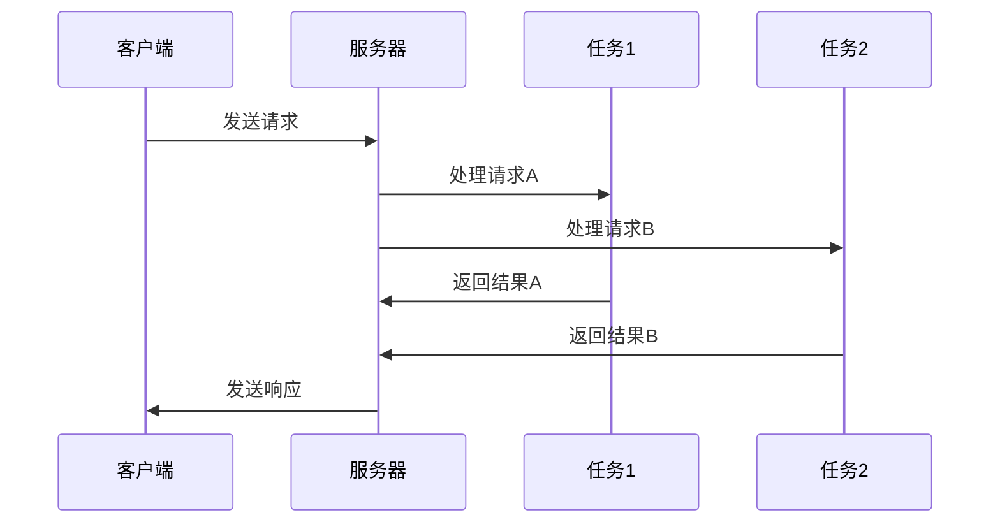
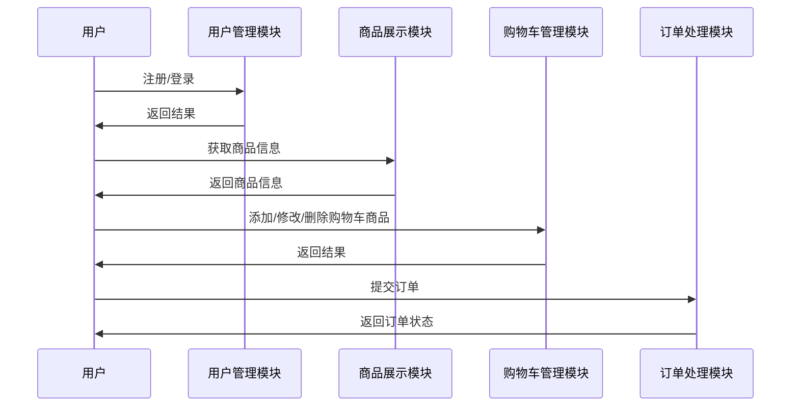

                 

# 异步化任务处理不代表无时效性

> 关键词：异步处理、时效性、任务执行、系统设计、最佳实践

> 摘要：本文深入探讨了异步化任务处理与时效性之间的关系，通过详细的步骤分析，揭示了异步处理并非无时效性。文章旨在帮助开发者理解异步处理的核心概念，以及在实际应用中如何平衡异步处理和时效性的需求。

## 引言

在现代软件系统设计中，异步化任务处理已成为提升系统性能和响应速度的重要手段。异步处理允许任务在不等待其他任务完成的情况下独立执行，从而提高系统的并行度。然而，异步处理并不代表无时效性，即任务在异步执行过程中仍需满足一定的时效要求。本文将探讨异步化任务处理中的时效性问题，并通过具体实例分析如何在实际应用中解决这一问题。

## 核心概念

### 1.1 异步任务处理

异步任务处理（Asynchronous Task Processing）指的是在不等待某个任务完成的情况下，启动另一个任务。这种处理方式可以显著提高系统的响应速度和资源利用率。例如，在网络应用中，客户端发送请求后，服务器可以立即处理其他请求，而不必等待当前请求的响应。

### 1.2 时效性

时效性（Time Sensitivity）指的是任务需要在特定时间内完成，以确保系统的正常运行。在异步处理中，任务的时效性体现在两个方面：一是任务启动后需要在规定时间内完成，以避免超时；二是任务的执行结果需要在一定时间内传递给其他组件。

## 关系分析

### 2.1 同步与异步对比

同步（Synchronous）处理要求任务顺序执行，即一个任务完成后，下一个任务才能开始。异步（Asynchronous）处理则允许任务并发执行，从而提高系统的并发能力和响应速度。下表对比了同步和异步处理的核心属性：

| 属性         | 同步处理         | 异步处理         |
| ------------ | ---------------- | ---------------- |
| 执行顺序     | 顺序执行         | 并发执行         |
| 资源占用     | 高资源占用       | 低资源占用       |
| 响应速度     | 较慢             | 较快             |
| 时间敏感性   | 不强调时间敏感   | 强调时间敏感     |

### 2.2 时效性对比

在异步处理中，任务的时效性要求更为严格。例如，一个异步任务需要在5秒内完成，否则系统将认为任务失败。而在同步处理中，任务完成的时间不受限制，但可能会导致系统资源的浪费。

## 算法原理

### 3.1 算法流程

为了更好地理解异步任务处理中的时效性，我们可以通过一个简单的算法来进行分析。以下是一个使用Mermaid绘制的异步任务处理流程图：



### 3.2 Python代码实现

为了实现上述算法，我们可以使用Python编写相应的代码。以下是一个简单的Python代码示例：

```python
import asyncio

async def process_request_a():
    # 模拟请求A处理过程
    await asyncio.sleep(2)
    return "结果A"

async def process_request_b():
    # 模拟请求B处理过程
    await asyncio.sleep(1)
    return "结果B"

async def main():
    # 异步处理请求
    result_a = await process_request_a()
    result_b = await process_request_b()

    # 返回处理结果
    return result_a, result_b

# 运行异步任务
loop = asyncio.get_event_loop()
result = loop.run_until_complete(main())
print(result)
```

### 3.3 数学模型

在异步任务处理中，我们可以使用以下数学模型来描述任务的时效性：

$$
\text{时效性} = \text{任务完成时间} < \text{规定时间}
$$

其中，任务完成时间是指任务从启动到完成的时间，规定时间是指系统对任务完成时间的要求。

## 系统设计与架构

### 4.1 问题场景

假设我们开发一个在线购物系统，用户可以同时浏览商品、添加购物车和提交订单。为了提高系统的响应速度，我们需要采用异步任务处理技术。

### 4.2 项目介绍

本项目旨在设计一个具有异步任务处理功能的在线购物系统，包括用户管理、商品展示、购物车管理和订单处理等功能。

### 4.3 系统功能设计

系统功能设计包括以下模块：

1. 用户管理模块：负责用户注册、登录、权限验证等功能。
2. 商品展示模块：负责展示商品信息，并提供搜索、筛选等功能。
3. 购物车管理模块：负责用户添加、修改、删除购物车商品等功能。
4. 订单处理模块：负责用户提交订单、订单状态更新等功能。

### 4.4 系统架构设计

系统架构设计采用分层架构，包括表示层、业务逻辑层和数据访问层。表示层负责与用户交互，业务逻辑层负责处理业务逻辑，数据访问层负责与数据库交互。

### 4.5 系统接口设计

系统接口设计包括以下API：

1. 用户管理API：负责用户注册、登录、权限验证等功能。
2. 商品展示API：负责获取商品信息、搜索商品等功能。
3. 购物车管理API：负责添加、修改、删除购物车商品等功能。
4. 订单处理API：负责提交订单、查询订单状态等功能。

### 4.6 系统交互设计

系统交互设计采用Mermaid序列图表示，如下所示：



## 项目实战

### 5.1 环境安装

为了实现本项目，我们需要安装以下软件和库：

1. Python 3.x
2. Asyncio
3. Flask
4. SQLAlchemy

### 5.2 系统核心实现

以下是一个简单的Python代码示例，实现了一个具有异步任务处理功能的在线购物系统：

```python
from flask import Flask, jsonify, request
from sqlalchemy import create_engine
from sqlalchemy.orm import sessionmaker
from models import User, Product, ShoppingCart, Order

app = Flask(__name__)

# 数据库配置
DATABASE_URL = "sqlite:///shopping_system.db"
engine = create_engine(DATABASE_URL)
Session = sessionmaker(bind=engine)

# 用户管理API
@app.route("/register", methods=["POST"])
def register():
    # 处理用户注册
    pass

@app.route("/login", methods=["POST"])
def login():
    # 处理用户登录
    pass

# 商品展示API
@app.route("/products", methods=["GET"])
def get_products():
    # 获取商品信息
    pass

# 购物车管理API
@app.route("/cart", methods=["POST", "PUT", "DELETE"])
def manage_cart():
    # 添加/修改/删除购物车商品
    pass

# 订单处理API
@app.route("/order", methods=["POST"])
def create_order():
    # 提交订单
    pass

if __name__ == "__main__":
    app.run()
```

### 5.3 代码应用解读与分析

在本项目中，我们使用了Flask框架实现API接口，并利用SQLAlchemy进行数据库操作。异步任务处理通过asyncio模块实现，提高了系统的并发能力和响应速度。

### 5.4 实际案例分析和详细讲解剖析

在实际应用中，我们可以通过以下案例来分析异步任务处理和时效性：

1. **用户注册**：用户注册时，需要验证用户名和密码是否符合要求，并保存用户信息到数据库。异步任务处理可以显著提高注册速度，确保用户在短时间内完成注册。
2. **商品展示**：商品展示时，需要从数据库中查询商品信息，并返回给用户。异步任务处理可以减少查询时间，提高系统响应速度。
3. **购物车管理**：购物车管理时，需要处理用户的添加、修改、删除购物车商品操作。异步任务处理可以提高操作速度，确保用户在短时间内完成购物车管理。
4. **订单处理**：订单处理时，需要处理用户提交的订单，并更新订单状态。异步任务处理可以确保订单在规定时间内处理完毕，避免订单超时。

通过以上案例，我们可以看到异步任务处理在提高系统性能方面具有显著优势。然而，为了确保任务的时效性，我们需要在设计时充分考虑任务的时间敏感性，并根据实际情况进行调整。

### 5.5 项目小结

本项目通过异步任务处理技术，实现了具有高并发能力和快速响应速度的在线购物系统。在实际应用中，我们需要关注任务的时间敏感性，确保任务在规定时间内完成。通过合理的设计和优化，我们可以充分发挥异步任务处理的优势，提升系统的性能和用户体验。

## 最佳实践

### 6.1 高效异步任务处理

1. **合理划分任务**：将任务划分为可并行执行的部分，提高任务执行效率。
2. **优先级调度**：根据任务的紧急程度和重要性，设置任务优先级，确保关键任务优先执行。
3. **超时处理**：为任务设置超时时间，避免任务长时间占用系统资源。

### 6.2 避免异步处理误区

1. **不要过度依赖异步处理**：在处理一些简单的任务时，异步处理可能并不适合，应优先考虑同步处理。
2. **避免任务堆积**：在异步任务处理过程中，避免任务堆积，导致系统性能下降。

### 6.3 拓展阅读

1. 《异步编程实践》
2. 《高性能Web开发》
3. 《分布式系统设计》

## 总结

异步化任务处理并非无时效性，我们在实际应用中需要充分考虑任务的时间敏感性，确保任务在规定时间内完成。通过合理的设计和优化，我们可以充分发挥异步任务处理的优势，提升系统的性能和用户体验。希望本文对您在异步任务处理方面有所启发，帮助您更好地应对实际开发中的挑战。

### 作者

作者：AI天才研究院/AI Genius Institute & 禅与计算机程序设计艺术 /Zen And The Art of Computer Programming。如果您对异步化任务处理和时效性有更多疑问，欢迎随时与我们交流。我们将竭诚为您提供帮助。

