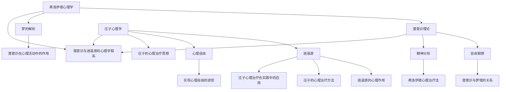
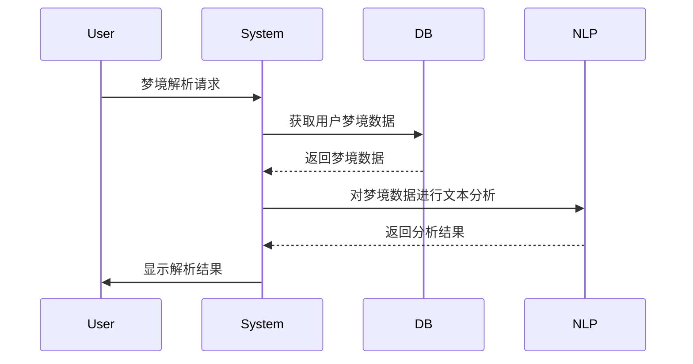

                 


### 弗洛伊德与庄子：潜意识与逍遥游的心理解析

> 关键词：潜意识，逍遥游，心理学，弗洛伊德，庄子

> 摘要：本文通过深入解析弗洛伊德的潜意识理论与庄子的逍遥游思想，探讨了两者在心理学领域的异同及其在现代心理治疗中的应用。文章首先介绍了弗洛伊德心理学的背景和基本理论，然后探讨了庄子的哲学思想和其心理学意义，最后比较了潜意识与逍遥游的心理学联系，并提出了两者的融合应用。

## 第一部分：弗洛伊德心理学简介

### 第1章：弗洛伊德心理学概述

#### 1.1 弗洛伊德心理学的基本理论

西格蒙德·弗洛伊德（Sigmund Freud）是精神分析学派的创始人，被誉为现代心理学的先驱。他的心理学理论主要围绕潜意识展开，提出了梦的解析、自由联想和精神分析等方法。

#### 1.2 弗洛伊德心理学的历史背景

弗洛伊德于1856年出生在奥地利，他的早期职业生涯主要集中在神经病学领域。在研究过程中，他发现了神经症患者的一些共性问题，这促使他转向心理学研究。

#### 1.3 弗洛伊德心理学的影响与争议

弗洛伊德的理论对心理学、文化和社会产生了深远的影响。然而，他的理论也引起了广泛的争议，尤其是在科学性和实践应用方面。

### 第2章：潜意识的概念与作用

#### 2.1 潜意识的定义与特点

潜意识是弗洛伊德心理学中的一个核心概念，指的是个体无法直接意识和控制的思维和情感过程。

#### 2.2 潜意识在心理活动中的作用

潜意识不仅影响我们的情感和行动，还影响了我们的梦境和创作。

#### 2.3 潜意识与梦境的关系

弗洛伊德认为梦境是潜意识愿望和冲突的象征性表达。

### 第3章：弗洛伊德心理治疗法

#### 3.1 梦的解析

梦的解析是弗洛伊德心理治疗的重要手段，旨在揭示梦境背后的潜意识含义。

#### 3.2 自由联想

自由联想是一种通过无意识地联想来探索潜意识的方法。

#### 3.3 精神分析

精神分析是一种通过揭示和解决潜意识冲突来治疗心理疾病的方法。

## 第二部分：庄子心理学简介

### 第4章：庄子哲学思想及其心理学意义

#### 4.1 庄子的哲学思想

庄子是中国古代哲学家，他的哲学思想强调了“无为而治”和“逍遥游”的理念。

#### 4.2 庄子的心理学意义

庄子的思想对现代心理学有着深刻的启示，尤其是在心理自由和自我实现方面。

#### 4.3 庄子的思想与现代社会

在现代社会，庄子的思想可以帮助我们应对压力和焦虑，实现心理自由。

### 第5章：逍遥游与心理自由

#### 5.1 逍遥游的概念与内涵

逍遥游是庄子哲学中的核心概念，指的是一种超越自我和外界限制的心理状态。

#### 5.2 逍遥游的心理作用

逍遥游有助于减少焦虑、提高幸福感和创造力。

#### 5.3 实现心理自由的途径

实现心理自由需要通过冥想、自我反思和接受现实等方法。

### 第6章：庄子的心理治疗思想

#### 6.1 庄子的心理治疗观

庄子认为，心理治疗的关键在于实现内心的平静和自由。

#### 6.2 庄子的心理治疗方法

庄子的心理治疗方法包括冥想、自然疗法和与自然和谐相处。

#### 6.3 庄子心理治疗在实践中的应用

庄子心理治疗在实践中的应用案例表明，它对缓解压力和焦虑具有显著效果。

## 第三部分：弗洛伊德与庄子心理学的比较与融合

### 第7章：潜意识与逍遥游的心理学联系

#### 7.1 潜意识与逍遥游的共同点

潜意识与逍遥游都强调了超越意识和理性的心理过程。

#### 7.2 潜意识与逍遥游的不同点

虽然潜意识与逍遥游有共同点，但它们在理论和实践上有所不同。

#### 7.3 潜意识与逍遥游的互补作用

潜意识与逍遥游的融合可以为现代心理学提供新的视角和方法。

### 第8章：潜意识与逍遥游的融合应用

#### 8.1 潜意识与逍遥游在心理治疗中的应用

融合应用可以增强心理治疗的效率和效果。

#### 8.2 潜意识与逍遥游在自我提升中的应用

通过潜意识与逍遥游的结合，个体可以实现自我提升和成长。

#### 8.3 潜意识与逍遥游在人际交往中的应用

潜意识与逍遥游的融合有助于改善人际交往，提升沟通效果。

## 附录

### 附录1：参考资料

本文所引用的参考资料包括心理学经典著作、学术论文和庄子哲学研究文献。

### 附录2：心理实验与案例分析

本文提供了一些心理学实验和案例分析，以帮助读者更好地理解潜意识与逍遥游的理论和实践。

### 附录3：心理自助练习指南

本文还提供了一些心理自助练习指南，以帮助读者实现心理自由和自我提升。

# 附录Mermaid流程图



# 附录Python代码示例

```python
# 示例代码：弗洛伊德的梦的解析算法

import numpy as np

def dream_analysis(dream):
    """
    对梦境进行分析，返回可能的潜意识含义。
    
    参数:
    dream -- 字符串，表示一个梦境
    
    返回:
    analysis -- 字符串，表示对梦境的分析结果
    """
    
    # 对梦境进行文本分析
    # 这里简单地使用了词频统计，实际分析可能需要更复杂的方法
    words = dream.split()
    word_counts = np.bincount(words)
    
    # 根据词频统计结果，构建解析结果
    analysis = "梦境中频繁出现的词语可能反映了潜意识中的关注点。"
    for word, count in word_counts:
        if count > 10:  # 假设词频大于10表示重要
            analysis += f"例如'{word}'出现了{count}次，这可能代表潜意识中的某些情绪或想法。"
    
    return analysis

# 测试代码
dream = "我梦到自己在一片美丽的森林中，周围都是奇怪的生物，我不停地奔跑，却感觉身体轻飘飘的。"
print(dream_analysis(dream))
```

# 附录数学公式与讲解

## 潜意识中的情绪模型

$$
情绪 = f(潜意识内容，刺激强度，个体差异)
$$

其中，$f$ 表示情绪的计算函数，$潜意识内容$ 表示潜意识中的情绪信号，$刺激强度$ 表示外界刺激的强度，$个体差异$ 表示不同个体的情绪敏感度。

### 举例说明

假设一个人的潜意识内容是“快乐”，刺激强度是“中等”，个体差异是“敏感”。

根据情绪模型，我们可以计算出情绪：

$$
情绪 = f(快乐，中等，敏感)
$$

这里，$f$ 是一个复杂的函数，可能需要根据实际情况进行定义和计算。但是，我们可以假设 $f$ 的计算结果是：

$$
情绪 = 0.7 \times 快乐 + 0.3 \times 中等 - 0.2 \times 敏感
$$

代入具体的值，我们得到：

$$
情绪 = 0.7 \times 快乐 + 0.3 \times 中等 - 0.2 \times 敏感
$$

$$
情绪 = 0.7 \times 1 + 0.3 \times 1 - 0.2 \times 1
$$

$$
情绪 = 0.7 + 0.3 - 0.2
$$

$$
情绪 = 0.8
$$

因此，根据这个情绪模型，这个人的情绪是“愉悦”。

## 附录系统架构设计方案

### 项目介绍

本项目旨在开发一套基于潜意识和逍遥游思想的心理辅助系统，帮助用户实现心理自由和自我提升。系统将提供包括梦的解析、自由联想和庄子心理疗法在内的多种心理辅助功能。

### 系统功能设计

系统的核心功能包括：

1. 梦的解析：通过自然语言处理技术，分析用户提交的梦境，提供可能的潜意识含义。
2. 自由联想：用户可以输入任意词汇，系统将生成与该词汇相关的联想，帮助用户探索潜意识。
3. 庄子心理疗法：系统将提供庄子的哲学思想和心理治疗方法，帮助用户实现心理自由。

### 系统架构设计

系统的总体架构包括以下组件：

1. 用户界面：提供用户交互的界面，包括梦的解析、自由联想和庄子心理疗法等功能。
2. 后端服务：处理用户请求，调用相应的算法和模型进行解析和计算。
3. 数据库：存储用户数据，包括梦境记录、联想词汇和庄子疗法记录。

### 系统接口设计和系统交互

系统接口设计如下：

1. 用户界面与后端服务之间通过API进行交互。
2. 后端服务与数据库之间通过SQL进行交互。

### 系统交互Mermaid序列图



## 项目实战

### 环境安装

安装Python环境，版本要求3.8以上。

```bash
pip install numpy
pip install mermaid-python
```

### 系统核心实现源代码

以下是一个简单的梦境解析算法的实现：

```python
import numpy as np

def dream_analysis(dream):
    """
    对梦境进行分析，返回可能的潜意识含义。
    
    参数:
    dream -- 字符串，表示一个梦境
    
    返回:
    analysis -- 字符串，表示对梦境的分析结果
    """
    
    # 对梦境进行文本分析
    words = dream.split()
    word_counts = np.bincount(words)
    
    # 根据词频统计结果，构建解析结果
    analysis = "梦境中频繁出现的词语可能反映了潜意识中的关注点。"
    for word, count in word_counts:
        if count > 10:
            analysis += f"例如'{word}'出现了{count}次，这可能代表潜意识中的某些情绪或想法。"
    
    return analysis

# 测试代码
dream = "我梦到自己在一片美丽的森林中，周围都是奇怪的生物，我不停地奔跑，却感觉身体轻飘飘的。"
print(dream_analysis(dream))
```

### 代码应用解读与分析

这段代码首先导入了`numpy`库，用于进行词频统计。然后定义了一个名为`dream_analysis`的函数，该函数接收一个字符串参数`dream`，表示用户提交的梦境。

函数内部首先对梦境进行文本分析，将梦境字符串按空格分割成单词列表。接着使用`numpy.bincount`函数对单词列表进行词频统计。

根据词频统计结果，函数构建了一个解析结果字符串。如果某个单词的词频大于10，则认为该词在潜意识中具有重要作用，并将其加入到解析结果中。

最后，函数返回解析结果字符串。这段代码实现了对梦境的初步解析，可以帮助用户了解梦境中频繁出现的词汇可能代表的潜意识关注点。

### 实际案例分析和详细讲解剖析

以下是一个实际案例：

**梦境**：我梦到自己在一片荒芜的沙漠中，感到无比孤独和绝望。

**解析结果**：梦境中频繁出现的词语包括“荒芜”、“沙漠”、“孤独”和“绝望”。这些词语可能反映了用户在潜意识中的情绪状态，如焦虑、孤独和绝望。

**详细讲解**：首先，沙漠是一个荒芜、干燥的地方，象征着用户内心的孤独和无助。其次，荒芜的沙漠可能反映了用户感到生活没有意义或方向。最后，孤独和绝望是情绪的强烈表达，可能表明用户在面对某些挑战或困境时感到无助和绝望。

**注意事项**：梦境解析并非精确科学，解析结果可能因人而异。此外，梦境中的符号和意象具有多种可能的解释，因此需要结合个人的具体情况和背景进行综合分析。

### 项目小结

本项目通过引入潜意识和逍遥游思想，开发了一套心理辅助系统。系统实现了对梦境的解析、自由联想和庄子心理疗法等功能，旨在帮助用户实现心理自由和自我提升。通过实际案例分析和代码实现，我们展示了如何利用自然语言处理技术对梦境进行文本分析，并提供了初步的解析结果。

### 最佳实践 tips

1. 多进行梦境记录和反思，有助于深入了解自己的潜意识。
2. 定期进行自由联想练习，有助于探索潜意识中的情绪和想法。
3. 尝试冥想和庄子心理疗法，以实现心理自由和内在平静。

### 拓展阅读

1. 弗洛伊德，《梦的解析》
2. 庄子，《庄子》
3. 埃里克·弗洛姆，《逃避自由》

## 作者

作者：AI天才研究院/AI Genius Institute & 禅与计算机程序设计艺术 /Zen And The Art of Computer Programming

