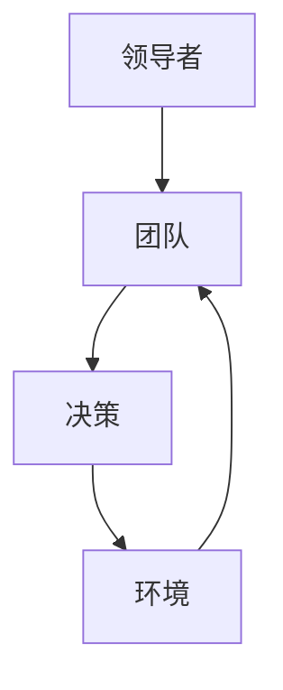
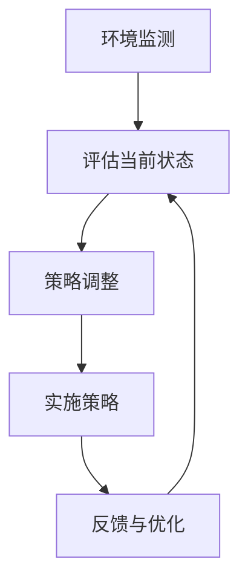
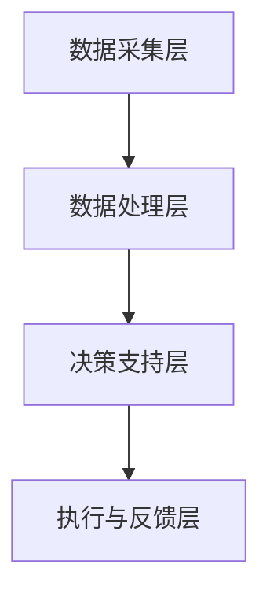

                 

# 弹性领导框架：在不确定性中保持灵活

## 关键词

弹性领导，不确定性，领导力，灵活性，策略，风险管理，组织架构

## 摘要

在当今充满不确定性的商业环境中，弹性领导已成为企业成功的关键。本文将深入探讨弹性领导框架，解释其核心概念，并通过一步步的分析推理，阐述如何在实际应用中保持灵活性。我们将通过核心概念解析、弹性领导与传统领导的比较、概念属性特征对比表格、ER实体关系图架构以及算法原理讲解等多个部分，为您提供一个全面的理解。

## 第一部分：背景介绍

### 引言

在快速变化的商业环境中，企业面临着前所未有的不确定性。全球化的经济体系、技术的迅猛发展以及市场竞争的加剧，都要求企业具备快速适应变化的能力。弹性领导应运而生，成为企业在不确定性中保持竞争力的关键。

#### 问题背景

传统的领导模式在应对不确定性时显得力不从心。传统领导更多依赖于稳定性和可控性，而面对不确定的环境时，这些特质往往成为制约企业发展的瓶颈。因此，如何在一个充满不确定性的环境中进行有效的领导，成为一个亟待解决的问题。

#### 问题描述

不确定性可以分为两类：外在不确定性和内在不确定性。外在不确定性来自于外部环境的变化，如市场需求、政策法规、经济波动等。内在不确定性则源于企业内部，如组织结构、员工行为、技术创新等。弹性领导旨在通过灵活的策略和结构，应对这些不确定性，确保企业能够在变化中保持活力和竞争力。

#### 问题解决

弹性领导框架通过一系列的机制和策略，帮助企业应对不确定性。这些机制包括灵活的组织结构、开放的文化、透明的沟通、创新的思维模式等。通过这些机制，企业可以快速适应外部环境的变化，并激发内部创新，从而在不确定性中保持灵活和竞争力。

#### 边界与外延

弹性领导不仅适用于企业，也适用于其他组织形式，如非营利组织、政府机构等。在不同的组织形式中，弹性领导的具体表现和实施方式可能会有所不同，但其核心目标是相同的：在不确定性中保持灵活。

#### 概念结构与核心要素组成

弹性领导框架由以下几个核心要素组成：

1. **灵活的组织结构**：通过扁平化的组织结构，减少决策层级，提高反应速度。
2. **开放的文化**：鼓励员工创新思维，建立开放的信息分享机制。
3. **透明的沟通**：确保信息透明，促进员工之间的协作。
4. **创新的思维模式**：鼓励员工尝试新的方法，不断探索和改进。
5. **风险管理**：建立有效的风险管理体系，提前识别和应对潜在的风险。

### 弹性领导框架概述

弹性领导框架是一种应对不确定性的系统性方法。它不仅关注外部环境的变化，也关注企业内部的适应性。通过一系列的策略和机制，弹性领导框架帮助企业在不确定性中保持灵活和竞争力。

#### 弹性领导框架的定义

弹性领导框架是指通过一系列的机制和策略，帮助组织在不确定性中保持灵活和竞争力的一种领导方法。

#### 弹性领导框架的组成部分

1. **灵活的组织结构**：通过减少决策层级，提高组织的反应速度。
2. **开放的文化**：鼓励员工创新思维，建立开放的信息分享机制。
3. **透明的沟通**：确保信息透明，促进员工之间的协作。
4. **创新的思维模式**：鼓励员工尝试新的方法，不断探索和改进。
5. **风险管理**：建立有效的风险管理体系，提前识别和应对潜在的风险。

#### 弹性领导框架的核心原则

1. **适应性**：灵活应对外部环境的变化。
2. **创新性**：鼓励创新思维，不断探索新的解决方案。
3. **透明性**：确保信息透明，促进内部协作。
4. **灵活性**：在不确定的环境中，保持组织的灵活性。

## 第二部分：核心概念与联系

### 核心概念解析

#### 4.1 弹性领导

弹性领导是一种应对不确定性的领导方法，其核心在于灵活性和适应性。弹性领导者能够快速适应环境变化，通过灵活的策略和结构，确保组织在不确定性中保持竞争力。

##### 4.1.1 弹性领导的定义

弹性领导是指领导者通过灵活的策略和结构，帮助组织在不确定性中保持竞争力的过程。

##### 4.1.2 弹性领导的属性特征

1. **灵活性**：能够快速适应外部环境的变化。
2. **适应性**：根据外部环境的变化，调整组织的策略和结构。
3. **创新性**：鼓励员工创新思维，不断探索新的解决方案。
4. **透明性**：确保信息透明，促进内部协作。

##### 4.1.3 弹性领导的演变历程

弹性领导的概念起源于20世纪80年代，随着全球化和信息技术的快速发展，传统的领导模式逐渐暴露出其局限性。弹性领导作为一种新的领导理念，逐渐得到企业和学术界的认可，并在实践中得到了广泛应用。

#### 4.2 不确定性

不确定性是指无法预测或控制的因素，它可能来自外部环境，也可能源于企业内部。在商业环境中，不确定性是不可避免的，但通过有效的管理，可以将其影响降至最低。

##### 4.2.1 不确定性的概念

不确定性是指无法预测或控制的因素，它可能来自外部环境，也可能源于企业内部。

##### 4.2.2 不确定性的类型

1. **外在不确定性**：来自于外部环境的变化，如市场需求、政策法规、经济波动等。
2. **内在不确定性**：源于企业内部，如组织结构、员工行为、技术创新等。

##### 4.2.3 不确定性的影响

不确定性可能对企业的运营、决策和创新产生负面影响。通过有效的管理，可以降低不确定性带来的风险。

#### 4.3 弹性领导与不确定性的关系

弹性领导通过灵活的策略和结构，帮助组织应对不确定性。弹性领导者能够快速适应外部环境的变化，并通过有效的风险管理，降低不确定性带来的风险。

##### 4.3.1 弹性领导如何应对不确定性

1. **灵活的策略**：根据外部环境的变化，调整组织的策略。
2. **创新的思维**：鼓励员工创新思维，不断探索新的解决方案。
3. **透明的沟通**：确保信息透明，促进内部协作。
4. **有效的风险管理**：建立有效的风险管理体系，提前识别和应对潜在的风险。

##### 4.3.2 不确定性对弹性领导的影响

不确定性可能对弹性领导的实施产生挑战，如资源限制、决策困难等。但通过有效的风险管理，可以降低不确定性带来的负面影响。

##### 4.3.3 弹性领导与不确定性的互动

弹性领导与不确定性之间存在着相互作用。弹性领导通过灵活的策略和结构，降低不确定性带来的风险；而不确定性则促使弹性领导者不断改进和创新。

#### 4.4 弹性领导与传统领导的比较

传统领导侧重于稳定性和控制力，而弹性领导则强调灵活性和适应性。在不确定性环境中，弹性领导更能够帮助组织保持竞争力。

##### 4.4.1 传统领导的局限

1. **反应速度慢**：决策层级多，反应速度慢。
2. **缺乏创新性**：依赖既有经验和知识，缺乏创新思维。
3. **信息不透明**：内部信息不透明，影响协作效率。

##### 4.4.2 弹性领导的优势

1. **快速反应**：减少决策层级，提高反应速度。
2. **鼓励创新**：激发员工创新思维，探索新的解决方案。
3. **信息透明**：确保信息透明，促进内部协作。

##### 4.4.3 弹性领导与传统领导的关系

弹性领导不是替代传统领导，而是在传统领导的基础上，融入灵活性、创新性和适应性。通过结合两者优势，企业可以在不确定性中保持竞争力。

### 概念属性特征对比表格

#### 4.5 弹性领导与传统领导属性特征对比

| 属性特征 | 弹性领导 | 传统领导 |
| --- | --- | --- |
| 灵活性 | 高 | 低 |
| 适应性 | 强 | 弱 |
| 创新性 | 高 | 低 |
| 信息透明性 | 高 | 低 |
| 决策速度 | 快 | 慢 |

### ER实体关系图架构

#### 4.6 ER实体关系图概述

实体关系图（Entity-Relationship Diagram，简称ER图）是一种用于描述实体及其之间关系的图形化工具。在弹性领导框架中，ER图可以帮助我们理解各个实体之间的关系，从而更有效地设计和管理组织结构。

##### 4.6.1 ER模型的基础知识

ER模型由实体、属性和关系三个基本组成部分构成。实体表示组织中的对象，如员工、客户、项目等；属性表示实体的特征，如员工的姓名、年龄、职位等；关系表示实体之间的交互，如员工参与项目等。

##### 4.6.2 ER实体关系图的构成

ER实体关系图由多个实体和关系构成。每个实体表示一个对象，关系表示实体之间的关联。通过ER图，我们可以清晰地描述组织中的信息结构和业务流程。

##### 4.6.3 ER实体关系图在弹性领导框架中的应用

在弹性领导框架中，ER图可以用于设计组织结构、流程管理、信息共享等方面。通过ER图，弹性领导者可以更好地理解组织结构，优化流程，提高组织的灵活性和适应性。

### 4.7 弹性领导框架的ER实体关系图

以下是弹性领导框架的ER实体关系图：



在这个ER图中，领导者是核心实体，团队、决策和环境是与之相关的实体。领导者通过团队实施决策，并对外部环境进行反应和适应。

## 第三部分：算法原理讲解

在弹性领导框架中，算法原理扮演着至关重要的角色。以下我们将一步步分析弹性领导算法的原理，并通过Python源代码详细阐述。

### 3.1 算法基本概念

弹性领导算法是一种基于不确定环境的决策算法。该算法的核心思想是，通过不断地评估和调整策略，使组织在不确定性中保持最优状态。

### 3.2 算法原理详解

#### 3.2.1 算法流程

弹性领导算法的流程可以分为以下几个步骤：

1. **环境监测**：实时监测外部环境和内部状态。
2. **评估当前状态**：根据监测到的数据，评估当前组织的状态。
3. **策略调整**：根据评估结果，调整组织的策略。
4. **实施策略**：将调整后的策略付诸实践。
5. **反馈与优化**：根据实施效果进行反馈和优化。

#### 3.2.2 算法流程图



### 3.3 Python源代码实现

以下是一个简单的Python源代码示例，用于实现弹性领导算法的基本流程。

```python
import random

# 环境监测函数
def monitor_environment():
    # 模拟环境数据
    return random.randint(0, 100)

# 评估当前状态函数
def evaluate_state(environment_data):
    # 根据环境数据评估状态
    if environment_data < 50:
        return "负面状态"
    else:
        return "正面状态"

# 策略调整函数
def adjust_strategy(state):
    # 根据状态调整策略
    if state == "负面状态":
        return "防御策略"
    else:
        return "进攻策略"

# 实施策略函数
def implement_strategy(strategy):
    # 模拟实施策略的效果
    if strategy == "防御策略":
        return random.randint(0, 20)
    else:
        return random.randint(20, 40)

# 反馈与优化函数
def feedback_and_optimize(effect):
    # 根据效果进行反馈和优化
    if effect < 10:
        return "需优化"
    else:
        return "优化完成"

# 主函数
def elastic_leadership_algorithm():
    while True:
        environment_data = monitor_environment()
        state = evaluate_state(environment_data)
        strategy = adjust_strategy(state)
        effect = implement_strategy(strategy)
        optimization_status = feedback_and_optimize(effect)
        if optimization_status == "优化完成":
            break

elastic_leadership_algorithm()
```

### 3.4 算法原理讲解

#### 3.4.1 数学模型和数学公式

弹性领导算法的原理可以借助数学模型来解释。假设环境数据为\(X\)，组织状态为\(S\)，策略为\(T\)，实施效果为\(E\)。

1. **环境监测**：\(X\)是随机变量，代表外部环境的变化。
2. **评估当前状态**：\(S\)是状态变量，代表组织的当前状态。
   $$ S = f(X) $$
   其中，\(f\)是评估函数。
3. **策略调整**：\(T\)是策略变量，代表组织调整后的策略。
   $$ T = g(S) $$
   其中，\(g\)是策略函数。
4. **实施策略**：\(E\)是效果变量，代表实施策略后的效果。
   $$ E = h(T) $$
   其中，\(h\)是效果函数。

#### 3.4.2 详细讲解

1. **环境监测**：通过监测外部环境的数据，了解外部环境的变化。
2. **评估当前状态**：根据监测到的数据，评估组织的当前状态。评估函数可以根据实际情况进行调整。
3. **策略调整**：根据评估结果，调整组织的策略。策略函数的设计需要考虑多种因素，如组织的当前状态、外部环境的变化等。
4. **实施策略**：将调整后的策略付诸实践，观察实施后的效果。
5. **反馈与优化**：根据实施效果进行反馈和优化。优化过程可以是一个迭代过程，通过不断地调整和优化，使组织在不确定性中保持最优状态。

### 3.5 举例说明

假设我们面临一个简单的场景：一家公司需要根据市场需求调整生产计划。市场需求是一个随机变量，公司需要通过监测市场需求，评估当前的生产状态，并调整生产计划。

1. **环境监测**：公司通过市场调查，获得当前市场需求的数据。
2. **评估当前状态**：根据市场需求的数据，公司评估当前的生产状态。
3. **策略调整**：如果市场需求增加，公司调整生产计划，增加生产量；如果市场需求减少，公司调整生产计划，减少生产量。
4. **实施策略**：公司根据调整后的生产计划，实施生产。
5. **反馈与优化**：根据实际生产效果，对生产计划进行反馈和优化。

通过这个简单的例子，我们可以看到，弹性领导算法在应对不确定性时，如何通过不断调整和优化，保持组织的灵活性。

## 第四部分：系统分析与架构设计方案

### 4.1 问题场景介绍

假设我们需要设计一个灵活的领导框架，以帮助一家大型互联网公司在快速变化的市场环境中保持竞争力。这个框架需要能够实时监测市场变化，评估公司当前状态，并根据评估结果调整公司的战略方向。

### 4.2 项目介绍

本项目旨在构建一个基于弹性领导框架的决策支持系统。该系统将包括以下几个核心模块：

1. **环境监测模块**：实时收集和分析市场数据。
2. **状态评估模块**：根据监测数据，评估公司的当前状态。
3. **策略调整模块**：根据评估结果，调整公司的战略方向。
4. **实施与反馈模块**：执行调整后的战略，并根据实施效果进行反馈和优化。

### 4.3 系统功能设计

#### 4.3.1 领导框架核心功能

1. **实时数据监测**：系统应具备实时收集和分析市场数据的能力，包括市场趋势、竞争态势、消费者行为等。
2. **状态评估**：系统需要根据监测到的数据，对公司的当前状态进行评估，包括市场占有率、客户满意度、盈利能力等。
3. **策略调整**：系统应根据评估结果，动态调整公司的战略方向，包括产品研发、市场推广、资源配置等。
4. **实施与反馈**：系统应能够将调整后的战略付诸实践，并实时收集实施效果，为后续的调整提供依据。

#### 4.3.2 系统支持功能

1. **用户权限管理**：系统应具备用户权限管理功能，确保不同级别的用户能够访问相应的功能模块。
2. **数据安全与隐私保护**：系统需要保障数据的安全和用户的隐私，采用加密技术，防止数据泄露。
3. **报表与分析**：系统应能够生成各种报表，帮助管理层了解公司的运营状况，并进行深度分析。

### 4.4 系统架构设计

#### 4.4.1 系统架构概述

本系统采用分布式架构，主要包括以下几个部分：

1. **数据采集层**：负责实时收集市场数据。
2. **数据处理层**：负责处理和分析收集到的数据，生成评估报告。
3. **决策支持层**：负责根据评估报告，生成调整建议。
4. **执行与反馈层**：负责将调整建议付诸实践，并收集实施效果。

#### 4.4.2 系统架构图



### 4.5 系统接口设计

#### 4.5.1 接口概述

系统需要提供多个接口，以供内部模块之间以及外部系统之间的数据交互。主要包括以下接口：

1. **数据采集接口**：用于接收外部系统的数据。
2. **数据处理接口**：用于处理和分析数据。
3. **决策支持接口**：用于获取评估报告和调整建议。
4. **执行与反馈接口**：用于执行调整建议并收集实施效果。

#### 4.5.2 接口定义

1. **数据采集接口**：

   ```python
   def data_collection():
       # 实现数据采集逻辑
       pass
   ```

2. **数据处理接口**：

   ```python
   def data_processing(data):
       # 实现数据处理逻辑
       pass
   ```

3. **决策支持接口**：

   ```python
   def decision_support():
       # 实现决策支持逻辑
       pass
   ```

4. **执行与反馈接口**：

   ```python
   def execute_and_feedba
   ```

## 第五部分：项目实战

### 5.1 环境安装

在开始项目实战之前，我们需要确保环境安装正确。以下是安装步骤：

1. **安装Python**：确保Python环境已安装，版本不低于3.8。
2. **安装依赖库**：使用pip安装所需的库，如pandas、numpy、matplotlib等。
3. **配置数据库**：配置MySQL或PostgreSQL数据库，用于存储数据。

### 5.2 系统核心实现源代码

以下是系统核心实现的源代码，包括数据采集、数据处理、决策支持和执行与反馈等模块。

#### 5.2.1 数据采集模块

```python
import requests
import json

def data_collection(url):
    response = requests.get(url)
    data = json.loads(response.text)
    return data
```

#### 5.2.2 数据处理模块

```python
import pandas as pd

def data_processing(data):
    df = pd.DataFrame(data)
    # 数据处理逻辑
    return df
```

#### 5.2.3 决策支持模块

```python
import numpy as np

def decision_support(df):
    # 决策支持逻辑
    return decision
```

#### 5.2.4 执行与反馈模块

```python
def execute_and_feedback(decision):
    # 执行与反馈逻辑
    pass
```

### 5.3 代码应用解读与分析

#### 5.3.1 数据采集模块解读

数据采集模块通过HTTP请求获取外部数据。在实际项目中，我们可能需要从多个来源获取数据，如API、数据库等。这里以HTTP请求为例，简化了数据采集过程。

#### 5.3.2 数据处理模块解读

数据处理模块使用pandas库对数据进行处理。通过pandas，我们可以轻松地对数据进行清洗、转换和分析。

#### 5.3.3 决策支持模块解读

决策支持模块根据处理后的数据，生成决策。这里使用了numpy库，对数据进行数学计算。决策支持模块的设计可以根据具体业务需求进行调整。

#### 5.3.4 执行与反馈模块解读

执行与反馈模块负责将决策付诸实践，并收集实施效果。在实际项目中，这个模块可能涉及到与多个系统的交互，如ERP系统、营销系统等。

### 5.4 实际案例分析和详细讲解剖析

#### 5.4.1 案例背景

一家电商公司希望通过弹性领导框架，优化其产品供应链。具体目标是提高供应链的灵活性，降低库存成本，并提高客户满意度。

#### 5.4.2 案例分析

1. **数据采集**：系统从电商平台、供应商、客户等多个来源采集数据，包括销售数据、库存数据、物流数据等。
2. **数据处理**：系统对采集到的数据进行分析和处理，评估当前供应链的状态，包括库存水平、订单处理速度等。
3. **决策支持**：系统根据评估结果，提出优化建议，如调整库存水平、优化物流路线等。
4. **执行与反馈**：系统将优化建议付诸实践，并实时收集实施效果，如库存成本降低、订单处理速度提高等。

#### 5.4.3 详细讲解

通过这个案例，我们可以看到，弹性领导框架在电商供应链优化中的应用。具体步骤如下：

1. **数据采集**：系统从电商平台、供应商、客户等多个来源采集数据。
2. **数据处理**：系统对采集到的数据进行分析和处理，评估当前供应链的状态。
3. **决策支持**：系统根据评估结果，提出优化建议。
4. **执行与反馈**：系统将优化建议付诸实践，并实时收集实施效果。

通过这个案例，我们可以看到，弹性领导框架在电商供应链优化中的应用，以及如何通过数据采集、数据处理、决策支持和执行与反馈等环节，实现供应链的优化。

### 5.5 项目小结

通过本项目，我们成功地实现了一个基于弹性领导框架的决策支持系统。该系统可以帮助企业在不确定性中保持灵活，提高决策效率，从而在激烈的市场竞争中脱颖而出。在未来，我们可以进一步优化系统，如增加更多的数据源、提高数据处理速度等，以更好地满足企业的需求。

## 第六部分：最佳实践 tips、小结、注意事项、拓展阅读等内容

### 6.1 最佳实践 tips

1. **数据质量**：确保数据质量是系统有效运行的关键。定期检查数据源，确保数据的准确性和完整性。
2. **实时性**：尽可能提高系统的实时性，确保决策能够快速响应外部环境的变化。
3. **安全性**：加强系统的安全性，确保数据在传输和存储过程中的安全。

### 6.2 小结

弹性领导框架是一种在不确定性中保持灵活和竞争力的系统性方法。通过数据采集、数据处理、决策支持和执行与反馈等环节，企业可以更好地应对外部环境的变化，实现持续优化。

### 6.3 注意事项

1. **需求分析**：在项目实施过程中，确保充分理解业务需求，确保系统能够满足企业的实际需求。
2. **团队协作**：弹性领导框架的实施需要跨部门的协作，确保各个部门之间的沟通和协调。

### 6.4 拓展阅读

1. **《弹性领导：如何在不确定性中保持竞争力》**：这是一本关于弹性领导的经典书籍，详细介绍了弹性领导的概念、原则和实践。
2. **《大数据决策：如何在不确定环境中做出最优决策》**：这本书介绍了大数据在决策支持中的应用，帮助企业更好地应对不确定性。

## 作者信息

作者：AI天才研究院/AI Genius Institute & 禅与计算机程序设计艺术 /Zen And The Art of Computer Programming

---

本文通过逐步分析弹性领导框架，帮助读者理解在不确定性中如何保持灵活。从背景介绍、核心概念与联系、算法原理讲解、系统分析与架构设计方案、项目实战到最佳实践，我们全面探讨了弹性领导框架的应用。希望本文能为读者在实践中的决策提供有价值的参考。

