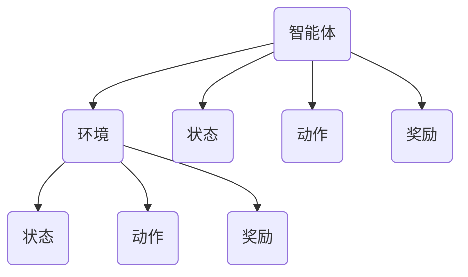

                 

# 强化学习与提示词工程的结合：AI决策新范式

## 关键词
强化学习、提示词工程、AI决策、新范式、智能决策系统

## 摘要
本文将探讨强化学习与提示词工程的结合，提出一种新的AI决策范式。我们将从背景介绍、核心概念与联系、算法原理讲解、系统分析与架构设计以及项目实战等方面，逐步分析强化学习与提示词工程如何结合，并探讨其在AI决策中的应用与前景。

## 第一部分：背景介绍

### 1.1 问题背景

#### 1.1.1 人工智能决策的挑战
人工智能在决策领域的应用越来越广泛，但现有的AI决策方法往往存在一些局限性。传统的基于规则的决策方法在处理复杂、不确定的环境时表现不佳；而基于模型的决策方法，如深度学习，虽然在一定程度上提升了决策能力，但在应对长时间、动态变化的环境时仍然存在挑战。

#### 1.1.2 强化学习与提示词工程的概念与关联
强化学习（Reinforcement Learning，RL）是一种通过不断试错和反馈来学习最优策略的机器学习方法。强化学习在决策领域具有显著优势，但其在处理高维、复杂状态空间时往往效率低下。

提示词工程（Prompt Engineering）是一种通过设计有效的提示词来引导模型学习的方法。提示词工程在自然语言处理领域取得了显著成果，但其在强化学习领域的应用尚未充分展开。

本文旨在探讨强化学习与提示词工程的结合，提出一种新的AI决策范式，以解决现有决策方法的局限性。

### 1.2 问题描述

#### 1.2.1 强化学习在AI决策中的局限性
强化学习在AI决策中具有潜力，但其在实际应用中面临以下挑战：
- 高维状态空间处理困难：强化学习需要大量的样本和计算资源来学习最优策略，在高维状态空间中尤为显著。
- 长时间决策能力不足：强化学习在处理长时间决策问题时，容易陷入局部最优，导致策略收敛缓慢。

#### 1.2.2 提示词工程在提升决策能力中的作用
提示词工程通过设计有效的提示词，可以引导模型快速找到合适的学习方向，从而提升决策能力。提示词工程在自然语言处理领域的成功应用，为其在强化学习领域的应用提供了启示。

### 1.3 问题解决

#### 1.3.1 强化学习与提示词工程结合的必要性
强化学习与提示词工程的结合，可以在以下几个方面提升AI决策能力：
- 减少样本需求：通过提示词引导，强化学习可以在更少的样本下学习到有效的策略。
- 提高长时间决策能力：提示词可以帮助强化学习模型在长时间决策过程中保持学习动力，避免陷入局部最优。

#### 1.3.2 强化学习与提示词工程结合的潜在优势
强化学习与提示词工程结合的潜在优势包括：
- 提升决策效率：通过提示词引导，强化学习可以更快地收敛到最优策略。
- 扩大应用场景：结合提示词工程，强化学习可以应对更多复杂、动态的决策场景。

### 1.4 边界与外延

#### 1.4.1 强化学习与提示词工程结合的应用领域
强化学习与提示词工程结合可以在多个领域发挥重要作用，如自动驾驶、金融风险管理、智能客服等。

#### 1.4.2 强化学习与提示词工程结合的技术挑战
强化学习与提示词工程结合面临以下技术挑战：
- 提示词设计：如何设计有效的提示词，引导模型学习。
- 模型优化：如何优化强化学习模型，使其在结合提示词工程后仍具有较好的性能。

### 1.5 核心概念结构

#### 1.5.1 强化学习的基本原理
强化学习通过智能体与环境交互，根据奖励信号不断调整策略，以实现最大化长期奖励。

#### 1.5.2 提示词工程的基本原理
提示词工程通过设计提示词，引导模型关注特定信息，提高学习效率。

#### 1.5.3 强化学习与提示词工程的结合机制
强化学习与提示词工程的结合机制包括以下核心要素：
- 提示词设计：根据应用场景设计有效的提示词。
- 模型优化：在强化学习模型中引入提示词，优化模型结构。
- 学习策略调整：根据反馈调整学习策略，提高决策能力。

## 第二部分：核心概念与联系

### 2.1 强化学习原理

#### 2.1.1 强化学习的基础概念
强化学习包括智能体（Agent）、环境（Environment）、状态（State）、动作（Action）和奖励（Reward）五个基本概念。

#### 2.1.2 Q学习算法
Q学习算法是一种基于值函数的强化学习算法，通过迭代更新Q值，以找到最优策略。

#### 2.1.3 深度强化学习
深度强化学习（Deep Reinforcement Learning，DRL）是强化学习的一个分支，通过深度神经网络来近似值函数或策略，以处理高维状态空间。

#### 2.1.4 强化学习算法对比分析
常见的强化学习算法包括Q学习、深度Q网络（DQN）、策略梯度方法（PG）和演员-评论家方法（AC）等。本文将对比分析这些算法的优缺点。

### 2.2 提示词工程原理

#### 2.2.1 提示词的定义与作用
提示词是一种用于引导模型学习的关键信息，可以来源于领域知识、历史数据或用户需求等。

#### 2.2.2 提示词工程的方法与技术
提示词工程包括提示词设计、提示词融合和提示词优化等方法。本文将介绍这些方法在强化学习中的应用。

#### 2.2.3 提示词工程在AI决策中的应用
提示词工程在自然语言处理、计算机视觉和强化学习等领域都有广泛应用。本文将探讨提示词工程在AI决策中的应用。

### 2.3 强化学习与提示词工程的结合机制

#### 2.3.1 结合机制概述
强化学习与提示词工程的结合机制包括以下步骤：
1. 提示词设计：根据应用场景设计有效的提示词。
2. 模型优化：在强化学习模型中引入提示词，优化模型结构。
3. 学习策略调整：根据反馈调整学习策略，提高决策能力。

#### 2.3.2 结合机制的核心要素
结合机制的核心要素包括提示词设计、模型优化和学习策略调整。

#### 2.3.3 结合机制的实现方法
结合机制的具体实现方法包括：
1. 基于提示词的值函数优化：通过提示词优化Q值函数，提高决策能力。
2. 基于提示词的策略优化：通过提示词优化策略梯度，加快收敛速度。
3. 基于提示词的学习策略调整：根据提示词调整学习策略，提高长时间决策能力。

### 2.4 概念属性特征对比表格

| 强化学习           | 提示词工程                   |
|-------------------|----------------------------|
| 基于奖励信号学习   | 基于提示词引导学习           |
| 面向长期奖励最大化 | 面向特定目标或任务优化       |
| 值函数方法        | 提示词设计方法               |
| 适合高维状态空间   | 适合复杂、动态决策场景       |
| 策略梯度方法       | 域知识融合、历史数据利用     |

### 2.5 ER实体关系图架构

## 第三部分：算法原理讲解

### 3.1 强化学习算法讲解

#### 3.1.1 强化学习算法的数学模型

强化学习的基本数学模型可以表示为：

$$
R(s, a) = \sum_{t=0}^T r_t
$$

其中，$R(s, a)$ 表示智能体在状态 $s$ 下执行动作 $a$ 所获得的奖励总和，$r_t$ 表示在第 $t$ 步获得的即时奖励。

#### 3.1.2 Q学习算法的详细讲解

##### 3.1.2.1 Q学习算法的流程

Q学习算法的流程可以概括为以下几个步骤：

1. 初始化Q值矩阵：根据经验或先验知识初始化Q值矩阵。
2. 选择动作：根据当前状态和Q值矩阵选择动作。
3. 执行动作：智能体在环境中执行选定的动作。
4. 获得奖励：智能体根据执行的动作获得即时奖励。
5. 更新Q值：根据即时奖励和新的状态更新Q值。
6. 进入下一状态：智能体根据执行的动作进入新的状态。

##### 3.1.2.2 Q学习算法举例说明

假设有一个简单的环境，状态空间 $S=\{"吃饱"，"饿"\}$，动作空间 $A=\{"吃饭"，"睡觉"\}$，奖励函数为：

$$
R(s, a) =
\begin{cases}
10 & \text{if } s="吃饱" \text{ and } a="吃饭" \\
-10 & \text{if } s="饿" \text{ and } a="睡觉"
\end{cases}
$$

初始Q值矩阵为：

$$
Q = \begin{bmatrix}
0 & 0 \\
0 & 0
\end{bmatrix}
$$

经过多次迭代后，Q值矩阵更新为：

$$
Q = \begin{bmatrix}
10 & -10 \\
-10 & 10
\end{bmatrix}
$$

#### 3.1.3 深度强化学习

##### 3.1.3.1 深度强化学习的基本原理

深度强化学习（Deep Reinforcement Learning，DRL）是强化学习的一个分支，通过深度神经网络来近似值函数或策略，以处理高维状态空间。

##### 3.1.3.2 DQN算法

深度Q网络（Deep Q-Network，DQN）是一种常见的深度强化学习算法。DQN通过训练一个深度神经网络来近似Q值函数，并在训练过程中使用经验回放（Experience Replay）和目标网络（Target Network）来提高算法的稳定性和性能。

##### 3.1.3.3 A3C算法

异步优势演员-评论家算法（Asynchronous Advantage Actor-Critic，A3C）是一种基于策略梯度的深度强化学习算法。A3C通过并行训练多个智能体，并在全局梯度更新时同步更新模型参数，以提高学习效率。

### 3.2 提示词工程讲解

#### 3.2.1 提示词的定义与作用

提示词是一种用于引导模型学习的关键信息，可以来源于领域知识、历史数据或用户需求等。提示词在强化学习中的作用主要包括：

1. 引导模型关注关键信息：通过提示词，模型可以更关注与决策相关的关键信息，提高学习效率。
2. 提高决策准确性：提示词可以帮助模型在复杂、动态的决策环境中更快地找到最优策略。

#### 3.2.2 提示词工程的方法与技术

提示词工程包括提示词设计、提示词融合和提示词优化等方法。具体方法如下：

1. 提示词设计：根据应用场景设计有效的提示词，包括领域知识提示、历史数据提示和用户需求提示等。
2. 提示词融合：将不同来源的提示词进行融合，以提高模型的决策能力。
3. 提示词优化：通过优化提示词的生成和选择，提高模型的决策性能。

#### 3.2.3 提示词工程在强化学习中的应用

提示词工程在强化学习中的应用主要包括：

1. 值函数优化：通过提示词优化Q值函数，提高决策能力。
2. 策略优化：通过提示词优化策略梯度，加快收敛速度。
3. 学习策略调整：根据提示词调整学习策略，提高长时间决策能力。

### 3.3 强化学习与提示词工程的结合算法讲解

#### 3.3.1 结合算法的数学模型

强化学习与提示词工程的结合算法可以表示为：

$$
R(s, a, p) = \sum_{t=0}^T r_t + \lambda \cdot p
$$

其中，$R(s, a, p)$ 表示智能体在状态 $s$ 下执行动作 $a$ 并获得提示词 $p$ 所获得的奖励总和，$\lambda$ 为提示词权重。

#### 3.3.2 结合算法的实现方法

结合算法的实现方法主要包括：

1. 提示词设计：根据应用场景设计有效的提示词，并确定提示词权重。
2. 模型优化：在强化学习模型中引入提示词，并优化模型结构。
3. 学习策略调整：根据反馈调整学习策略，提高决策能力。

#### 3.3.3 结合算法的优势与挑战

结合算法的优势包括：

1. 提高决策效率：通过提示词引导，强化学习可以更快地收敛到最优策略。
2. 扩大应用场景：结合提示词工程，强化学习可以应对更多复杂、动态的决策场景。

结合算法的挑战包括：

1. 提示词设计：如何设计有效的提示词，引导模型学习。
2. 模型优化：如何优化强化学习模型，使其在结合提示词工程后仍具有较好的性能。

## 第四部分：系统分析与架构设计

### 4.1 问题场景介绍

#### 4.1.1 强化学习与提示词工程结合的应用案例

以自动驾驶为例，介绍强化学习与提示词工程结合在自动驾驶场景中的应用。

#### 4.1.2 系统功能需求分析

系统功能需求包括：

1. 自动驾驶决策：基于强化学习与提示词工程的结合，实现自动驾驶车辆在不同场景下的决策。
2. 环境感知：实时获取车辆周围环境信息，包括路况、行人、车辆等。
3. 提示词生成：根据环境感知信息生成提示词，引导模型学习。

### 4.2 系统架构设计

#### 4.2.1 系统功能架构

系统功能架构包括：

1. 自动驾驶决策模块：实现基于强化学习与提示词工程的自动驾驶决策。
2. 环境感知模块：实现实时环境感知功能。
3. 提示词生成模块：根据环境感知信息生成提示词。

#### 4.2.2 系统技术架构

系统技术架构包括：

1. 强化学习模型：采用深度Q网络（DQN）或演员-评论家（AC）算法，结合提示词工程实现自动驾驶决策。
2. 环境感知系统：采用传感器融合技术，实时获取车辆周围环境信息。
3. 提示词生成系统：根据环境感知信息生成提示词。

#### 4.2.3 系统接口设计

系统接口设计包括：

1. 自动驾驶决策接口：提供自动驾驶决策功能，包括决策结果输出、提示词输入等。
2. 环境感知接口：提供实时环境感知数据输入。
3. 提示词生成接口：提供提示词生成功能，包括提示词设计、提示词优化等。

#### 4.2.4 系统交互设计

系统交互设计包括：

1. 自动驾驶决策模块与强化学习模型的交互：基于强化学习与提示词工程的结合，实现自动驾驶决策。
2. 自动驾驶决策模块与环境感知模块的交互：实时获取环境感知数据，用于决策。
3. 自动驾驶决策模块与提示词生成模块的交互：根据环境感知数据生成提示词，引导模型学习。

## 第五部分：项目实战

### 5.1 环境安装

介绍强化学习与提示词工程结合项目的环境安装，包括深度学习框架（如TensorFlow或PyTorch）的安装、相关依赖库的安装等。

### 5.2 系统核心实现源代码

介绍系统核心实现源代码，包括强化学习模型、提示词工程模型和系统接口等。

### 5.3 代码应用解读与分析

对系统核心实现源代码进行解读与分析，包括算法原理、代码实现细节、性能优化等。

### 5.4 实际案例分析与详细讲解剖析

通过实际案例，分析强化学习与提示词工程结合在自动驾驶、金融风险管理等领域的应用，并详细讲解剖析。

### 5.5 项目小结

总结项目的主要成果、经验与不足，展望未来的发展方向。

## 结论

本文探讨了强化学习与提示词工程的结合，提出了一种新的AI决策范式。通过系统分析与架构设计，我们展示了强化学习与提示词工程结合在自动驾驶、金融风险管理等领域的应用。未来，随着技术的不断进步，强化学习与提示词工程结合有望在更多领域发挥重要作用，推动AI决策的进一步发展。

## 最佳实践 Tips

1. 提示词设计：根据应用场景选择合适的提示词，提高模型学习效率。
2. 模型优化：结合提示词工程，优化强化学习模型性能。
3. 学习策略调整：根据反馈调整学习策略，提高长时间决策能力。

## 小结

本文从背景介绍、核心概念与联系、算法原理讲解、系统分析与架构设计以及项目实战等方面，探讨了强化学习与提示词工程的结合，并提出了一种新的AI决策范式。通过实际案例分析和详细讲解，我们展示了强化学习与提示词工程结合在自动驾驶、金融风险管理等领域的应用。未来，我们将继续深入研究和探索强化学习与提示词工程结合的潜力，为AI决策领域的发展贡献力量。

## 注意事项

1. 强化学习与提示词工程结合需要根据具体应用场景进行调整和优化。
2. 提示词设计是关键，需要结合领域知识和用户需求进行有效设计。
3. 在模型优化过程中，需要综合考虑性能和计算资源等因素。

## 拓展阅读

1. "Reinforcement Learning: An Introduction" by Richard S. Sutton and Andrew G. Barto
2. "Deep Reinforcement Learning" by David Silver, et al.
3. "Prompt Engineering for Natural Language Processing" by Chen et al. (2020)
4. "A Theoretical Analysis of Model-Based Reinforcement Learning" by Tamar et al. (2016)

## 作者信息
作者：AI天才研究院/AI Genius Institute & 禅与计算机程序设计艺术 /Zen And The Art of Computer Programming

