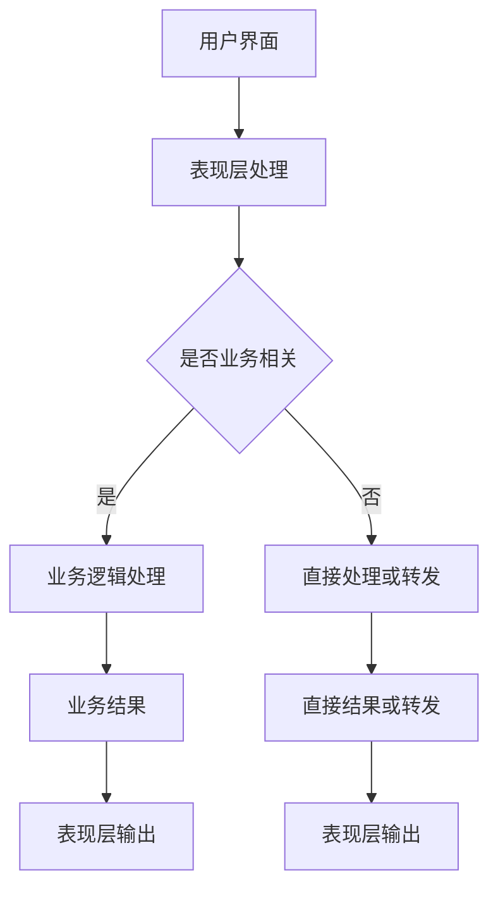
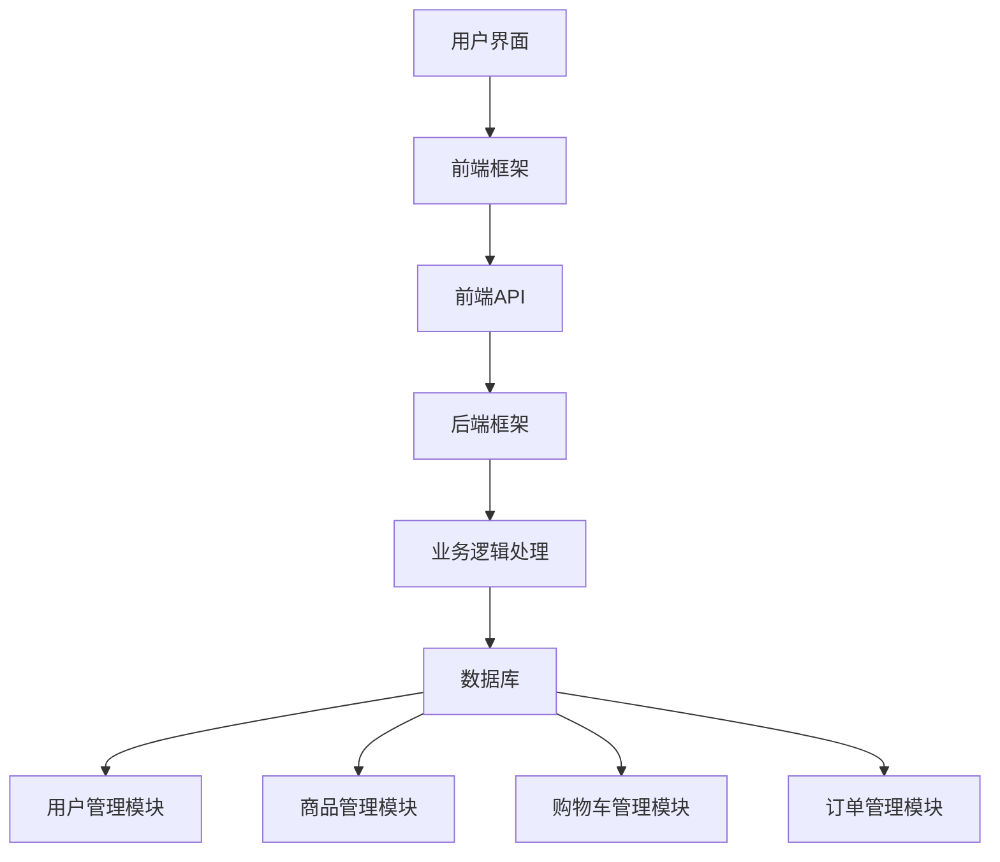
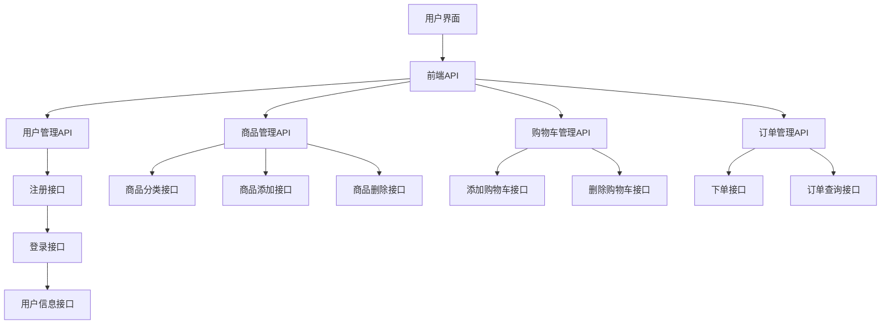

                 

### 文章标题

### 关键词：表现层、业务逻辑、分离与融合、软件架构、组件化、中间件、事件驱动、决策树模型、系统架构设计

### 摘要：

本文深入探讨了软件架构中表现层与业务逻辑的分离与融合问题。通过详细阐述核心概念、关系、实现方法和算法原理，本文旨在为读者提供一种系统性的理解，帮助他们在实际项目中有效地应用这些理念，提高软件系统的可维护性和可扩展性。

---

### 1. 引言

在软件开发领域，表现层（Presentation Layer）和业务逻辑（Business Logic）的分离与融合是一个经久不衰的话题。这两种层次在软件架构中扮演着至关重要的角色，但它们之间的关系复杂多变。合理地处理它们之间的关系，可以极大地提升软件系统的质量和性能。

本文将从以下几个方面展开讨论：

1. **背景介绍**：介绍表现层和业务逻辑的基本概念，以及它们在软件架构中的作用。
2. **核心概念与联系**：深入探讨表现层与业务逻辑之间的关系，包括分离与融合的优点和实现方法。
3. **算法原理讲解**：通过Python代码示例和决策树模型，详细解释分离与融合的算法实现原理。
4. **系统分析与架构设计方案**：结合具体项目，介绍系统功能设计、架构设计、接口设计和系统交互。
5. **项目实战**：通过实际案例，展示如何在项目中应用分离与融合的理念。
6. **最佳实践 tips**：总结项目经验，提供实用的建议。
7. **小结与拓展阅读**：总结全文，并推荐进一步阅读的资源。

### 2. 背景介绍

#### 2.1 表现层

表现层是软件系统与用户进行交互的界面，它负责接收用户输入、展示用户界面以及处理用户反馈。表现层通常包括前端界面（如HTML、CSS、JavaScript）和后端接口（如REST API、Websocket等）。其核心任务是确保用户能够直观、便捷地使用软件系统。

#### 2.2 业务逻辑

业务逻辑是软件系统的核心，它负责处理业务规则、业务流程和业务逻辑规则。业务逻辑通常与具体的业务场景紧密相关，例如订单处理、用户管理、财务计算等。业务逻辑的设计和实现需要充分考虑业务需求的变化，以保证系统的灵活性和可维护性。

#### 2.3 两者关系

在软件架构中，表现层和业务逻辑之间存在紧密的联系。一方面，表现层需要向业务逻辑传递用户请求，并展示业务逻辑的处理结果；另一方面，业务逻辑需要依赖于表现层的输入和输出，来实现具体的业务功能。

然而，这种紧密的联系也可能导致系统结构的复杂化和维护成本的增加。因此，如何在表现层和业务逻辑之间找到平衡，成为软件架构设计的重要课题。

### 3. 核心概念与联系

#### 3.1 表现层与业务逻辑的关系

表现层和业务逻辑的分离与融合是软件架构设计中的重要概念。它们之间的关系可以用Mermaid流程图来表示：



#### 3.2 分离与融合的优点

- **分离**：可以提高模块化程度，使得每个模块功能清晰，易于维护和扩展。例如，当业务逻辑发生变化时，表现层不需要修改。
- **融合**：可以提高系统的响应速度，减少数据传输开销。例如，在某些情况下，直接在表现层处理业务逻辑可以减少一层转发。

#### 3.3 实现方法

- **组件化**：将表现层和业务逻辑划分为独立的组件，每个组件负责一部分功能。
- **中间件**：使用中间件来处理业务逻辑，使得表现层与业务逻辑解耦。
- **事件驱动**：使用事件来触发业务逻辑，使得表现层与业务逻辑松耦合。

### 4. 算法原理讲解

#### 4.1 分离与融合的算法实现

以下是一个简单的Python代码示例，展示了如何实现表现层与业务逻辑的分离与融合。

```python
# 表现层
def user_interface():
    user_input = input("请输入您的需求：")
    return process_request(user_input)

# 业务逻辑
def process_request(request):
    if request == "登录":
        return business_logic_login()
    elif request == "注册":
        return business_logic_register()
    else:
        return "无效请求"

# 业务逻辑处理（登录）
def business_logic_login():
    username = input("请输入用户名：")
    password = input("请输入密码：")
    # 模拟登录验证
    if username == "admin" and password == "123456":
        return "登录成功"
    else:
        return "登录失败"

# 业务逻辑处理（注册）
def business_logic_register():
    username = input("请输入用户名：")
    password = input("请输入密码：")
    # 模拟注册验证
    if len(username) > 0 and len(password) > 0:
        return "注册成功"
    else:
        return "注册失败"

# 主程序
if __name__ == "__main__":
    result = user_interface()
    print(result)
```

#### 4.2 算法原理说明

- **用户界面**：负责接收用户输入，调用业务逻辑处理函数。
- **业务逻辑处理函数**：根据用户输入，调用不同的业务逻辑处理函数。
- **业务逻辑处理**：处理具体的业务请求，例如登录或注册。

### 5. 系统分析与架构设计方案

#### 5.1 问题场景介绍

假设我们要设计一个在线购物系统，用户可以在系统中浏览商品、添加购物车、下订单等。这个系统需要处理大量的用户请求，并确保数据的准确性和一致性。

#### 5.2 项目介绍

为了实现这个系统，我们采用了以下技术栈：

- 前端：使用React框架搭建用户界面，采用Webpack进行打包。
- 后端：使用Spring Boot框架进行业务逻辑处理，使用MyBatis进行数据库操作。
- 数据库：使用MySQL数据库存储用户数据和商品信息。

#### 5.3 系统功能设计

系统功能设计包括以下几个方面：

1. **用户管理**：提供用户注册、登录、信息修改等功能。
2. **商品管理**：提供商品分类、商品添加、商品删除等功能。
3. **购物车管理**：提供商品添加到购物车、购物车删除商品等功能。
4. **订单管理**：提供下单、订单查询等功能。

#### 5.4 系统架构设计

系统架构设计如下：



#### 5.5 系统接口设计和系统交互

系统接口设计和系统交互如下：



### 6. 项目实战

#### 6.1 环境安装

为了搭建这个在线购物系统，我们需要安装以下软件：

- Node.js
- React
- Spring Boot
- MySQL

安装方法请参考相关软件的官方文档。

#### 6.2 系统核心实现源代码

以下是系统核心实现的源代码：

```java
// 用户管理模块
public class UserManager {
    public String register(String username, String password) {
        // 注册逻辑
    }

    public String login(String username, String password) {
        // 登录逻辑
    }

    public String getUserInfo(String username) {
        // 获取用户信息逻辑
    }
}

// 商品管理模块
public class ProductManager {
    public String addProduct(Product product) {
        // 添加商品逻辑
    }

    public String deleteProduct(int productId) {
        // 删除商品逻辑
    }

    public String getProductCategory() {
        // 获取商品分类逻辑
    }
}

// 购物车管理模块
public class ShoppingCartManager {
    public String addCart(int productId, int quantity) {
        // 添加购物车逻辑
    }

    public String deleteCart(int cartId) {
        // 删除购物车逻辑
    }
}

// 订单管理模块
public class OrderManager {
    public String createOrder(Order order) {
        // 创建订单逻辑
    }

    public String getOrderInfo(int orderId) {
        // 获取订单信息逻辑
    }
}
```

#### 6.3 代码应用解读与分析

在这个项目中，我们采用了MVC（Model-View-Controller）架构模式。每个模块都有对应的模型（Model）、视图（View）和控制器（Controller）。

- **用户管理模块**：负责用户注册、登录和用户信息管理。
- **商品管理模块**：负责商品添加、删除和商品分类管理。
- **购物车管理模块**：负责商品添加到购物车和购物车删除操作。
- **订单管理模块**：负责订单创建和订单信息查询。

#### 6.4 实际案例分析和详细讲解剖析

以用户注册功能为例，我们详细分析其实现过程：

1. **前端界面**：用户在前端界面输入用户名和密码，点击“注册”按钮。
2. **前端API**：前端API接收到用户请求，将用户名和密码发送到后端。
3. **后端控制器**：后端控制器接收到请求，调用用户管理模块的register方法。
4. **用户管理模块**：用户管理模块执行注册逻辑，将用户信息存储到数据库。
5. **后端返回结果**：后端将注册结果返回给前端API。
6. **前端显示结果**：前端根据后端返回的结果，提示用户注册成功或失败。

通过这个案例，我们可以看到表现层与业务逻辑是如何分离与融合的。前端负责用户交互，后端负责业务处理，两者之间通过API进行通信。

#### 6.5 项目小结

通过这个在线购物系统的实现，我们深入理解了表现层与业务逻辑的分离与融合。这种设计方法可以提高系统的可维护性和可扩展性，使得开发过程更加高效。

### 7. 最佳实践 tips

1. **明确职责边界**：在项目初期，明确表现层和业务逻辑的职责边界，避免职责不清导致的混乱。
2. **使用中间件**：合理使用中间件来处理业务逻辑，减少表现层和业务逻辑之间的耦合。
3. **持续迭代**：在项目开发过程中，持续迭代和优化系统架构，确保其适应不断变化的业务需求。

### 8. 小结与拓展阅读

本文系统地探讨了表现层与业务逻辑的分离与融合，通过理论分析和实际案例，展示了其在软件架构设计中的应用。希望读者能够通过本文，对表现层与业务逻辑的关系有更深入的理解，并在实际项目中灵活运用这些理念。

为了进一步深入学习和实践，以下是一些拓展阅读资源：

1. 《软件架构设计：模式、原则与最佳实践》（Martin Fowler 著）
2. 《代码大全》（Steve McConnell 著）
3. 《重构：改善既有代码的设计》（Martin Fowler 著）

作者：AI天才研究院/AI Genius Institute & 禅与计算机程序设计艺术 /Zen And The Art of Computer Programming

