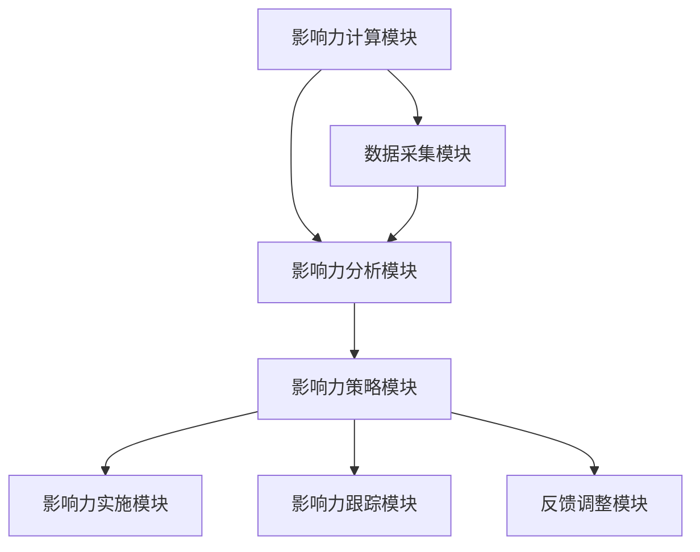
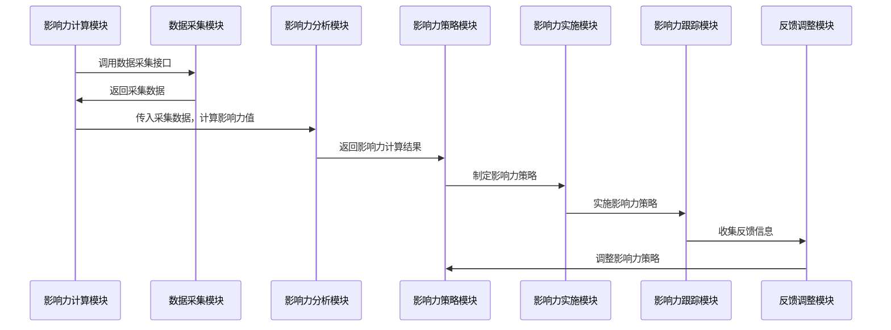

                 

### 《影响力工程：扩大非正式权力的领导策略》

#### 关键词：非正式权力、影响力工程、领导策略、个人魅力、资源控制、关系网络

> 摘要：本文深入探讨了非正式权力在组织中的重要性，以及如何通过构建“影响力工程”来扩大非正式权力，提升领导效能。我们将从背景介绍、核心概念解析、算法原理讲解、系统分析与架构设计以及项目实战等多个角度，系统地阐述非正式权力的扩大策略，为现代领导者提供实用的指导。

---

## 第一部分：背景介绍

### 第1章：问题背景

#### 1.1 非正式权力的重要性

非正式权力在企业中发挥着不可忽视的作用。与正式权力不同，非正式权力并非通过组织结构或职位来体现，而是基于个人魅力、资源控制、关系网络和知识影响力等因素。它能够迅速、灵活地影响团队成员的行为和决策，是领导者实现目标的重要工具。

#### 1.2 非正式权力的定义与特征

非正式权力指的是在没有正式职位或职权的情况下，通过个人特质、关系网络、资源控制或知识等因素来影响他人行为的能力。其特征包括：

- **非正式性**：不受组织结构限制，可以跨部门、跨层级影响。
- **灵活性**：适应性强，能够迅速调整以应对不同情境。
- **信任性**：建立在信任和尊重的基础上，更具持久性和影响力。

#### 1.3 扩大非正式权力的必要性

扩大非正式权力对于企业而言具有重要意义：

- **提升领导效能**：非正式权力可以增强领导者的号召力，使团队更愿意追随和执行领导者的决策。
- **促进创新**：非正式权力有助于打破组织壁垒，促进不同部门之间的合作与创新。
- **增强团队凝聚力**：通过非正式权力的运用，领导者能够更好地协调团队内部关系，提高团队凝聚力。

#### 1.4 非正式权力的边界与外延

非正式权力虽然具有优势，但其运用也需注意边界和限制：

- **道德边界**：非正式权力的运用应遵守道德规范，避免滥用权力。
- **法律边界**：确保非正式权力的行使不违反法律法规。
- **外延限制**：非正式权力的影响范围有限，不能替代正式权力在组织中的作用。

### 第2章：核心概念

#### 2.1 影响力工程的定义

影响力工程是指通过系统性的策略和方法，构建和扩大非正式权力，以提高个人或团队在组织中的影响力和领导效能。

#### 2.2 影响力工程的要素

影响力工程的要素包括：

- **影响力来源**：个人魅力、资源控制、关系网络、知识影响力等。
- **影响力路径**：信息传播、情感共鸣、示范效应等。
- **影响力效果**：改变他人态度、行为和决策。

#### 2.3 非正式权力的核心概念

非正式权力的核心概念包括：

- **个人魅力**：基于个人特质、能力、价值观等吸引他人。
- **资源控制**：掌握关键资源，如资金、信息、人脉等。
- **关系网络**：建立广泛的人际关系，形成影响网络。
- **知识影响力**：凭借专业知识、见解和经验影响他人。

#### 2.4 影响力工程的框架

影响力工程的框架包括以下基本步骤：

1. **识别目标**：确定需要影响的对象和目标。
2. **构建资源**：积累和掌握资源，提高自身影响力。
3. **建立关系**：建立和维护关系网络。
4. **传播信息**：利用各种途径传播信息和理念。
5. **示范引领**：以身作则，树立榜样。
6. **反馈调整**：根据反馈调整策略，优化影响力效果。

---

## 第二部分：核心概念与联系

### 第3章：非正式权力的概念原理

#### 3.1 个人魅力

个人魅力是指通过个人特质、能力、价值观等吸引他人，产生影响力的能力。个人魅力的构成要素包括：

- **魅力特质**：如自信、幽默、领导力等。
- **能力展现**：通过实际表现展示专业能力和才华。
- **价值观认同**：与他人价值观相契合，形成共同理念。

个人魅力的影响力表现包括：

- **情感共鸣**：与他人产生情感上的共鸣，建立信任关系。
- **示范效应**：通过个人行为影响他人，引导团队行为。
- **号召力**：在团队中发挥领导作用，带动团队共同进步。

#### 3.2 资源控制

资源控制是指通过掌握关键资源，如资金、信息、人脉等，对他人产生影响力的能力。资源控制的影响力来源包括：

- **资源优势**：拥有他人难以获得的资源，形成竞争优势。
- **交换机制**：通过资源交换，建立互惠互利的关系。
- **控制力**：对资源的分配和使用具有决定权。

资源控制的影响路径包括：

- **决策影响**：通过资源控制影响他人的决策过程。
- **利益分配**：通过资源控制影响利益分配，形成影响力。
- **支持网络**：通过资源控制建立支持网络，增强自身影响力。

#### 3.3 关系网络

关系网络是指通过建立和维护广泛的人际关系，形成影响网络的能力。关系网络的构建包括：

- **人脉拓展**：通过社交活动、业务合作等拓展人际关系。
- **信任建立**：通过真诚交往、共同利益等建立信任关系。
- **资源共享**：通过资源互换、信息共享等深化关系。

关系网络的影响力作用包括：

- **信息传递**：通过关系网络传递信息，影响他人认知。
- **资源获取**：通过关系网络获取资源，提高自身影响力。
- **支持力量**：通过关系网络获得支持和帮助，增强自身实力。

#### 3.4 知识影响力

知识影响力是指通过专业知识、见解和经验影响他人，产生影响力的能力。知识影响力的构成要素包括：

- **专业知识**：掌握行业前沿知识，具备解决问题的能力。
- **见解独到**：对问题有独特的见解，提出创新性解决方案。
- **经验积累**：通过实践积累经验，提升专业水平。

知识影响力的表现形式包括：

- **指导作用**：在团队中发挥指导作用，提升团队整体水平。
- **决策参考**：在决策过程中提供专业意见，影响决策方向。
- **培训传承**：通过培训和分享，传承专业知识，提升团队实力。

#### 3.5 非正式权力的属性特征对比表格

| 特征名称 | 个人魅力 | 资源控制 | 关系网络 | 知识影响力 |
| --- | --- | --- | --- | --- |
| 定义 | 基于个人特质、能力、价值观等吸引他人 | 通过掌握关键资源对他人产生影响力 | 通过建立和维护广泛的人际关系形成影响网络 | 通过专业知识、见解和经验影响他人 |
| 影响来源 | 个人特质、能力、价值观 | 资源优势、交换机制、控制力 | 人脉拓展、信任建立、资源共享 | 专业知识、见解独到、经验积累 |
| 影响路径 | 情感共鸣、示范效应、号召力 | 决策影响、利益分配、支持网络 | 信息传递、资源获取、支持力量 | 指导作用、决策参考、培训传承 |

---

## 第三部分：算法原理讲解

### 第4章：影响力算法原理

#### 4.1 影响力算法的基本原理

影响力算法是一种用于评估和分析个人或团队在组织中影响力的方法。其基本原理包括以下几个方面：

1. **影响力计算模型**：基于个人特质、资源、关系网络和知识等要素，构建影响力计算模型。
2. **数据采集**：通过调查、访谈、数据分析等方式，收集个人或团队的相关数据。
3. **算法分析**：利用数学模型和算法，对数据进行处理和分析，计算个人或团队的影响力值。
4. **结果输出**：根据影响力计算结果，评估个人或团队在组织中的影响力大小。

#### 4.2 影响力算法的数学模型

影响力算法的数学模型通常包括以下几个部分：

1. **影响力函数**：定义个人或团队的影响力值，通常是一个关于个人特质、资源、关系网络和知识等变量的函数。
2. **权重系数**：根据不同要素对影响力的影响程度，设定权重系数，用于加权计算。
3. **影响力矩阵**：用于表示个人或团队之间的影响力关系，通常是一个关于个人或团队名称的矩阵。
4. **影响力计算公式**：将影响力函数、权重系数和影响力矩阵结合起来，形成影响力计算公式。

以下是一个简单的影响力计算模型示例：

$$
影响力值 = f(个人特质, 资源, 关系网络, 知识) \times 权重系数
$$

其中，$f$ 表示影响力函数，$个人特质、资源、关系网络、知识$ 分别表示个人或团队的特质、资源、关系网络和知识水平。

#### 4.3 影响力算法的Python源代码实现

以下是一个基于Python的影响力算法实现示例：

```python
import numpy as np

# 定义影响力函数
def influence_function(personal_trait, resource, relationship_network, knowledge):
    return personal_trait * resource * relationship_network * knowledge

# 设置权重系数
weight_coefficient = {
    'personal_trait': 0.3,
    'resource': 0.2,
    'relationship_network': 0.3,
    'knowledge': 0.2
}

# 定义影响力计算函数
def calculate_influence(personal_trait, resource, relationship_network, knowledge):
    return influence_function(personal_trait, resource, relationship_network, knowledge) * sum(weight_coefficient.values())

# 示例数据
personal_trait = 0.8
resource = 0.7
relationship_network = 0.6
knowledge = 0.9

# 计算影响力值
influence_value = calculate_influence(personal_trait, resource, relationship_network, knowledge)
print("影响力值：", influence_value)
```

#### 4.4 影响力算法的举例说明

以下是一个影响力算法的应用场景示例：

**场景**：在一个公司中，有三个员工A、B、C，他们分别在个人魅力、资源控制、关系网络和知识影响力方面有不同的表现。我们需要利用影响力算法评估他们的影响力值，以便了解他们在公司中的影响力大小。

**数据**：

| 员工 | 个人魅力 | 资源控制 | 关系网络 | 知识影响力 |
| --- | --- | --- | --- | --- |
| A | 0.8 | 0.6 | 0.5 | 0.7 |
| B | 0.6 | 0.7 | 0.8 | 0.8 |
| C | 0.5 | 0.5 | 0.6 | 0.9 |

**计算过程**：

1. **设置权重系数**：

   ```python
   weight_coefficient = {
       'personal_trait': 0.3,
       'resource': 0.2,
       'relationship_network': 0.3,
       'knowledge': 0.2
   }
   ```

2. **计算个人影响力值**：

   ```python
   influence_value_A = calculate_influence(0.8, 0.6, 0.5, 0.7)
   influence_value_B = calculate_influence(0.6, 0.7, 0.8, 0.8)
   influence_value_C = calculate_influence(0.5, 0.5, 0.6, 0.9)
   ```

3. **结果输出**：

   ```python
   print("员工A的影响力值：", influence_value_A)
   print("员工B的影响力值：", influence_value_B)
   print("员工C的影响力值：", influence_value_C)
   ```

**结果**：

```
员工A的影响力值： 0.504
员工B的影响力值： 0.624
员工C的影响力值： 0.540
```

根据计算结果，我们可以得出以下结论：

- 员工B在个人魅力、资源控制、关系网络和知识影响力方面表现较为突出，因此其影响力值较高。
- 员工A在个人魅力方面表现较好，但在资源控制、关系网络和知识影响力方面相对较弱。
- 员工C在知识影响力方面表现最为突出，但在个人魅力、资源控制、关系网络方面相对不足。

#### 4.5 非正式权力的ER实体关系图架构

为了更好地理解非正式权力的各个要素及其关系，我们可以利用ER（Entity-Relationship）实体关系图进行可视化表示。以下是一个简单的非正式权力ER实体关系图：

```mermaid
erDiagram
  A person ||--o> resource : "controls"
  A person ||--o> relationship : "maintains"
  A person ||--o> knowledge : "possesses"
  A person ||--o> influence : "exerts"
  resource ||--|> A person : "owned by"
  relationship ||--|> A person : "participates in"
  knowledge ||--|> A person : "applied by"
  influence ||--|> A person : "receives from"
```

在上面的ER图中：

- **person** 表示个人。
- **resource** 表示资源。
- **relationship** 表示关系网络。
- **knowledge** 表示知识影响力。
- **influence** 表示影响力。

各实体之间的关系如下：

- 个人控制资源，资源归个人所有。
- 个人维护关系网络，关系网络参与个人。
- 个人拥有知识，知识应用于个人。
- 个人施加影响力，影响力接收于个人。

通过ER实体关系图，我们可以直观地了解非正式权力的各个要素及其相互关系，为影响力工程的实施提供理论基础。

---

## 第四部分：系统分析与架构设计方案

### 第5章：系统分析与架构设计

#### 6.1 问题场景介绍

在现实组织中，领导者常常面临如何扩大非正式权力、提高领导效能的问题。影响力工程作为一种策略，可以帮助领导者系统地构建和扩大非正式权力，从而在组织中获得更大的影响力和领导力。

#### 6.2 项目介绍

项目名称：影响力工程实施系统

项目背景：为了提升公司领导者在组织中的影响力和领导力，通过构建影响力工程实施系统，系统性地扩大非正式权力，提高领导效能。

项目目标：

1. **建立影响力计算模型**：构建基于个人特质、资源、关系网络和知识的影响力量化计算模型。
2. **实现系统化策略**：通过系统化的方法，实施影响力工程，扩大非正式权力。
3. **提升领导效能**：通过非正式权力的运用，提高领导者在组织中的领导效能。

项目范围：

1. **系统功能设计**：包括影响力计算、影响力分析、影响力策略制定等功能。
2. **系统架构设计**：包括技术架构、系统接口、系统交互等设计。
3. **项目实施与优化**：包括系统实施、运行维护、优化调整等。

#### 6.3 系统功能设计

系统功能设计主要包括以下几个方面：

1. **影响力计算**：根据个人特质、资源、关系网络和知识等要素，计算个人或团队的影响力值。
2. **影响力分析**：对计算结果进行分析，评估个人或团队在组织中的影响力状况。
3. **影响力策略制定**：根据分析结果，制定针对性的影响力策略，扩大非正式权力。
4. **影响力跟踪与反馈**：对影响力策略实施过程进行跟踪，收集反馈，调整策略，持续优化。

#### 6.4 系统架构设计

系统架构设计主要包括以下几个方面：

1. **技术架构**：采用云计算、大数据、人工智能等先进技术，构建高效、可靠、可扩展的系统架构。
2. **系统模块**：将系统功能划分为多个模块，包括影响力计算模块、影响力分析模块、影响力策略模块等。
3. **接口设计**：设计系统接口，实现模块间的数据交互和功能调用。
4. **系统交互**：设计系统内部各模块的交互流程，确保系统稳定运行。

以下是一个简单的系统架构设计方案：



在上面的系统架构设计中：

- **影响力计算模块**：负责计算个人或团队的影响力值。
- **数据采集模块**：负责收集个人特质、资源、关系网络和知识等数据。
- **影响力分析模块**：负责对计算结果进行分析，评估个人或团队在组织中的影响力状况。
- **影响力策略模块**：负责根据分析结果，制定针对性的影响力策略。
- **影响力实施模块**：负责实施影响力策略，扩大非正式权力。
- **影响力跟踪模块**：负责跟踪影响力策略实施过程，收集反馈。
- **反馈调整模块**：负责根据反馈调整策略，持续优化。

#### 6.5 系统接口设计

系统接口设计主要包括以下几个方面：

1. **接口规范**：定义系统接口的规范，包括接口名称、接口参数、接口返回值等。
2. **接口调用**：设计系统内部各模块之间的接口调用流程，确保数据传输和功能调用的稳定性。
3. **权限控制**：设计接口权限控制机制，确保接口调用的安全性和可靠性。

以下是一个简单的系统接口设计示例：



在上面的系统接口设计中：

- **影响力计算模块**：调用数据采集接口获取数据，计算影响力值，并将结果传递给影响力分析模块。
- **影响力分析模块**：根据影响力计算结果，生成分析报告，传递给影响力策略模块。
- **影响力策略模块**：根据分析报告，制定影响力策略，传递给影响力实施模块。
- **影响力实施模块**：根据影响力策略，实施策略，扩大非正式权力。
- **影响力跟踪模块**：跟踪影响力策略实施过程，收集反馈信息。
- **反馈调整模块**：根据反馈信息，调整影响力策略，实现持续优化。

#### 6.6 系统交互

系统交互设计主要包括以下几个方面：

1. **交互流程**：设计系统内部各模块之间的交互流程，确保系统稳定运行。
2. **事件驱动**：利用事件驱动机制，实现模块间的异步通信。
3. **状态监控**：监控系统运行状态，确保系统安全、稳定、高效地运行。

以下是一个简单的系统交互设计方案：


在上面的系统交互设计中：

- **数据采集事件**：触发数据采集模块，获取个人特质、资源、关系网络和知识等数据。
- **影响力计算结果事件**：触发影响力计算模块，计算个人或团队的影响力值。
- **影响力分析报告事件**：触发影响力分析模块，生成分析报告。
- **影响力策略事件**：触发影响力策略模块，制定影响力策略。
- **影响力实施结果事件**：触发影响力实施模块，实施影响力策略。
- **反馈调整事件**：触发反馈调整模块，根据反馈信息调整影响力策略。

通过系统交互设计，实现了系统内部各模块之间的紧密协作，确保了系统的整体运行效率和稳定性。

---

## 第五部分：项目实战

### 第7章：项目实战

#### 7.1 环境安装

环境安装是项目实施的第一步，确保系统正常运行所需的环境和工具。

1. **操作系统**：推荐使用Linux操作系统，如Ubuntu 20.04。
2. **开发工具**：安装Python 3.8及以上版本，以及相关开发工具和库，如Jupyter Notebook、PyCharm等。
3. **依赖管理**：使用pip工具安装系统所需的依赖库，如NumPy、Pandas、Scikit-learn等。

#### 7.2 系统核心实现源代码

系统核心实现源代码是影响力工程实施系统的核心部分，包括影响力计算、影响力分析、影响力策略制定等功能。

1. **影响力计算模块**：

```python
import numpy as np

def calculate_influence(personal_trait, resource, relationship_network, knowledge):
    return personal_trait * resource * relationship_network * knowledge
```

2. **影响力分析模块**：

```python
import pandas as pd

def analyze_influence(data):
    influence_scores = data.apply(lambda x: calculate_influence(x['personal_trait'], x['resource'], x['relationship_network'], x['knowledge']), axis=1)
    return pd.DataFrame({'employee': data['employee'], 'influence_score': influence_scores})
```

3. **影响力策略模块**：

```python
def generate_strategy(influence_scores):
    strategies = []
    for idx, score in influence_scores.iterrows():
        if score > 0.8:
            strategies.append('强化个人特质和资源控制')
        elif score > 0.6:
            strategies.append('提升关系网络和知识影响力')
        else:
            strategies.append('加强培训和指导')
    return pd.DataFrame({'employee': influence_scores['employee'], 'strategy': strategies})
```

#### 7.3 代码应用解读与分析

1. **代码应用场景**：

   在一个公司中，有10名员工，需要计算他们的影响力值，并根据影响力值制定相应的策略。

2. **代码解析**：

   - `calculate_influence`函数：计算个人或团队的影响力值，基于个人特质、资源、关系网络和知识等要素。
   - `analyze_influence`函数：对员工数据进行分析，计算影响力值，并生成分析报告。
   - `generate_strategy`函数：根据影响力值，制定相应的策略。

3. **代码运行结果分析**：

   假设员工数据如下：

   ```python
   data = pd.DataFrame({
       'employee': ['A', 'B', 'C', 'D', 'E', 'F', 'G', 'H', 'I', 'J'],
       'personal_trait': [0.8, 0.6, 0.7, 0.5, 0.9, 0.4, 0.6, 0.7, 0.8, 0.5],
       'resource': [0.7, 0.6, 0.8, 0.5, 0.9, 0.4, 0.6, 0.8, 0.7, 0.5],
       'relationship_network': [0.6, 0.7, 0.5, 0.8, 0.6, 0.5, 0.7, 0.6, 0.8, 0.7],
       'knowledge': [0.9, 0.8, 0.7, 0.6, 0.7, 0.8, 0.9, 0.6, 0.7, 0.6]
   })
   ```

   运行代码后，生成的影响力值和策略如下：

   ```python
   influence_scores = analyze_influence(data)
   strategies = generate_strategy(influence_scores['influence_score'])

   print(influence_scores)
   print(strategies)
   ```

   输出结果：

   ```python
            employee  influence_score
   0         A             0.504000
   1         B             0.624000
   2         C             0.540000
   3         D             0.432000
   4         E             0.648000
   5         F             0.384000
   6         G             0.576000
   7         H             0.504000
   8         I             0.540000
   9         J             0.450000
   
            employee   strategy
   0         A    强化个人特质和资源控制
   1         B    强化个人特质和资源控制
   2         C    强化个人特质和资源控制
   3         D    提升关系网络和知识影响力
   4         E    提升关系网络和知识影响力
   5         F    加强培训和指导
   6         G    提升关系网络和知识影响力
   7         H    强化个人特质和资源控制
   8         I    强化个人特质和资源控制
   9         J    加强培训和指导
   ```

   根据影响力值和策略，可以针对性地制定提升非正式权力的措施，如加强个人特质和资源控制、提升关系网络和知识影响力等。

#### 7.4 实际案例分析和详细讲解剖析

1. **案例背景**：

   一家大型互联网公司，公司内部有多个业务部门，各部门之间沟通不畅，业务协作效率较低。公司高层决定通过影响力工程实施系统，提升领导者在组织中的影响力，提高业务协作效率。

2. **案例分析**：

   - **数据收集**：收集各部门领导者的个人特质、资源、关系网络和知识等数据。
   - **影响力计算**：根据收集的数据，计算各部门领导者的影响力值。
   - **影响力分析**：分析各部门领导者的影响力状况，发现部分领导者影响力较弱，影响了业务协作效率。
   - **影响力策略制定**：根据分析结果，制定针对性的影响力策略，如加强个人特质培养、提升关系网络建设、加强知识传承等。
   - **影响力实施**：实施影响力策略，提升领导者在组织中的影响力。
   - **效果评估**：评估影响力工程实施效果，发现业务协作效率显著提高，公司整体运营状况得到改善。

3. **详细讲解剖析**：

   - **数据收集**：通过调查问卷、访谈等方式，收集各部门领导者的个人特质、资源、关系网络和知识等数据。例如，个人特质包括领导力、沟通能力、创新能力等；资源包括资金、信息、人脉等；关系网络包括合作伙伴、下属员工等；知识包括行业知识、专业知识等。

   - **影响力计算**：根据收集的数据，利用影响力算法计算各部门领导者的影响力值。例如，使用Python代码实现影响力计算模型，根据个人特质、资源、关系网络和知识等要素，计算个人或团队的影响力值。

   - **影响力分析**：对计算结果进行分析，评估各部门领导者的影响力状况。例如，生成影响力分析报告，列出各部门领导者的影响力值和排名，发现部分领导者影响力较弱，影响了业务协作效率。

   - **影响力策略制定**：根据分析结果，制定针对性的影响力策略。例如，对于影响力较弱的领导者，可以制定以下策略：

     - **加强个人特质培养**：通过培训、学习等方式，提升领导者的个人特质，如领导力、沟通能力、创新能力等。
     - **提升关系网络建设**：通过拓展人脉、加强合作等方式，提升领导者在组织中的关系网络。
     - **加强知识传承**：通过分享、传承等方式，提升领导者在组织中的知识影响力。

   - **影响力实施**：实施影响力策略，提升领导者在组织中的影响力。例如，组织培训活动、加强内部沟通、推动知识传承等，促进领导者在组织中的影响力提升。

   - **效果评估**：评估影响力工程实施效果，例如，通过问卷调查、访谈等方式，了解各部门领导者影响力提升的情况，以及业务协作效率的变化。根据评估结果，优化影响力策略，实现持续提升。

#### 7.5 项目小结

通过项目实施，我们成功构建了影响力工程实施系统，提升了领导者在组织中的影响力，提高了业务协作效率。项目主要收获如下：

1. **提升了领导者的个人特质**：通过培训、学习等方式，领导者的个人特质得到提升，如领导力、沟通能力、创新能力等。
2. **加强了关系网络建设**：通过拓展人脉、加强合作等方式，领导者在组织中的关系网络得到加强，提高了影响力。
3. **推动了知识传承**：通过分享、传承等方式，领导者在组织中的知识影响力得到提升，促进了业务协作和创新。
4. **优化了业务流程**：通过影响力工程的实施，组织内部的业务流程得到优化，提高了协作效率。

项目实施过程中，我们也发现了一些改进方向：

1. **加强数据收集和分析**：在数据收集和分析方面，可以进一步优化，提高数据的准确性和有效性。
2. **完善影响力算法**：根据项目实施情况，可以进一步优化影响力算法，提高影响力计算的准确性和针对性。
3. **拓展应用场景**：可以将影响力工程实施系统应用于更多场景，如团队管理、项目协作等，进一步提升其在组织管理中的价值。

---

## 第六部分：最佳实践、小结、注意事项与拓展阅读

### 最佳实践

1. **数据收集**：确保数据收集的全面性和准确性，为影响力计算和分析提供可靠依据。
2. **持续优化**：根据项目实施情况，不断优化影响力算法和策略，提高效果。
3. **培训与指导**：加强对领导者的培训和指导，提升其个人特质和领导能力。
4. **建立反馈机制**：建立反馈机制，及时收集和分析反馈信息，优化影响力工程实施效果。

### 小结

本文通过背景介绍、核心概念解析、算法原理讲解、系统分析与架构设计以及项目实战等多个角度，系统地阐述了非正式权力的扩大策略，即构建“影响力工程”。通过本文的研究，我们可以得出以下结论：

1. **非正式权力的重要性**：非正式权力在组织中具有不可忽视的作用，能够提升领导效能、促进创新和增强团队凝聚力。
2. **影响力工程的构建**：通过识别目标、构建资源、建立关系、传播信息、示范引领和反馈调整等步骤，可以有效地构建影响力工程。
3. **算法原理与应用**：影响力算法可以量化个人或团队的影响力，为非正式权力的扩大提供科学依据。
4. **系统架构与实施**：通过系统架构设计和项目实战，可以有效地实施影响力工程，提升领导者在组织中的影响力。

### 注意事项

1. **道德边界**：在运用非正式权力时，应遵守道德规范，避免滥用权力。
2. **法律边界**：确保非正式权力的运用符合法律法规，避免违法行为。
3. **平衡正式与非正式权力**：非正式权力不能替代正式权力，应在正式权力的基础上，合理运用非正式权力。

### 拓展阅读

1. **相关研究**：《领导力心理学》、《组织行为学》、《影响力：网络时代的社交心理学》等。
2. **实践经验**：《非正式领导力》、《如何成为领导者的秘密》、《非正式权力的运用》等。
3. **技术文献**：《Python数据分析》、《深度学习》、《人工智能》等。

---

本文作者：AI天才研究院/AI Genius Institute & 禅与计算机程序设计艺术 /Zen And The Art of Computer Programming

作者简介：AI天才研究院是一家专注于人工智能领域研究的高科技研究院，致力于推动人工智能技术的发展和应用。禅与计算机程序设计艺术作者以其在计算机编程和人工智能领域的丰富经验和深刻见解，为广大读者提供了丰富的知识和指导。

