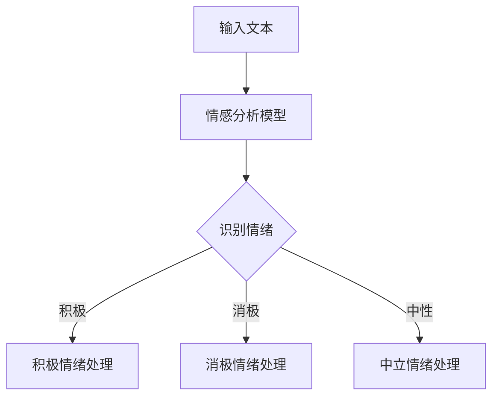
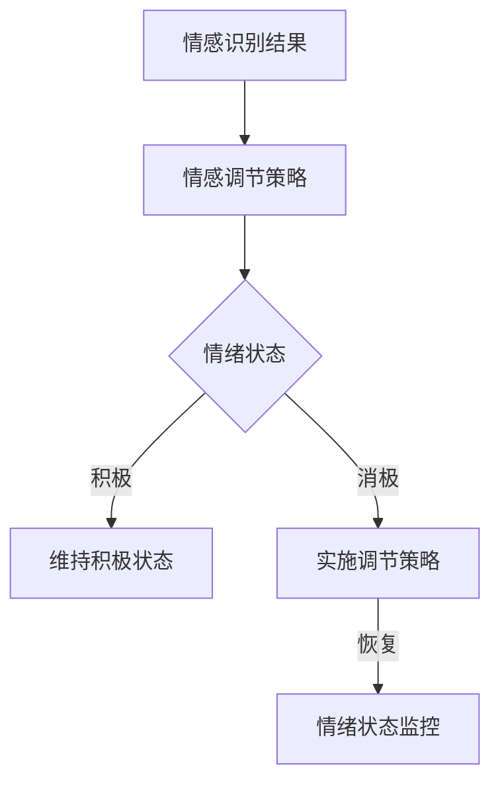
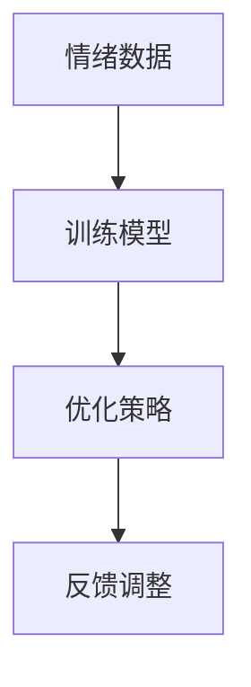
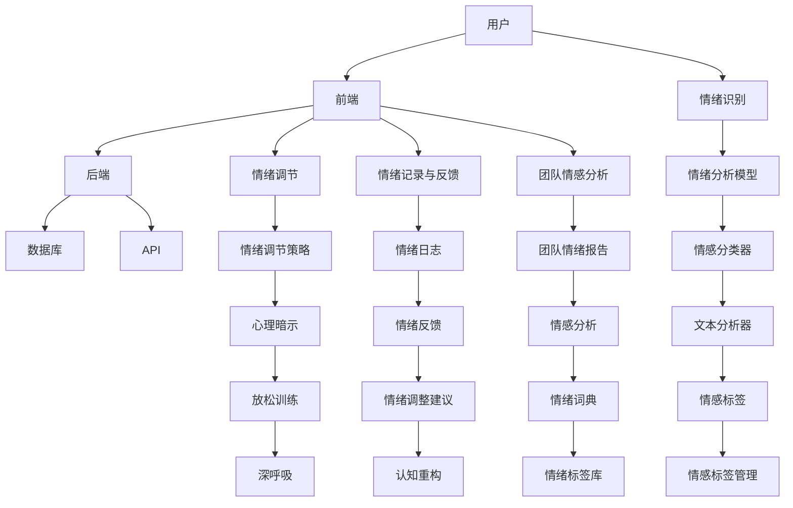
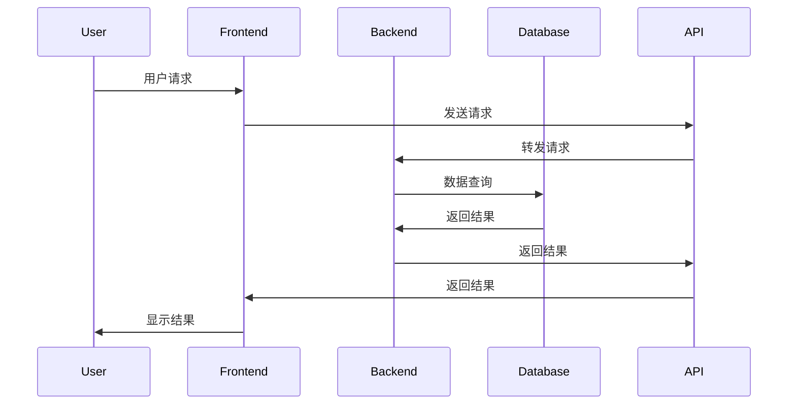

                 

# 情感智慧：理解并管理团队情绪

> 关键词：情感智慧、团队情绪、情绪管理、社交技能、自我意识

> 摘要：本文探讨了情感智慧在职场中的重要性，包括其定义、核心成分、实际应用以及在团队管理中的具体策略。通过深入分析情感智慧的各个方面，本文旨在为读者提供提升个人和团队情感智慧的实用方法和策略，以实现更高效、更和谐的团队协作。

### 第一部分：背景介绍

#### 问题背景

在当今职场环境中，情感智慧（Emotional Intelligence，简称EQ）被视为提升团队协作和效率的关键因素。随着知识经济的兴起，个体和团队的情感状态越来越影响着工作的成果。研究表明，情感智慧比智商（IQ）更能预测一个人在职场中的成功。企业领导者、管理者以及团队成员都面临着如何更好地理解和管理团队情绪的挑战。

情感智慧不仅涉及到个人情绪的管理，还包括对他人情绪的感知和应对。一个高情商的团队能够在面对压力和挑战时保持冷静，有效地解决问题，提高工作效率。因此，提升团队的情感智慧成为许多企业追求的目标。

#### 问题描述

本书旨在探讨情感智慧的概念、重要性以及在实际工作中如何应用。具体问题包括：

- **情感智慧的定义及其在职场中的意义**：情感智慧究竟是什么，它与职业成功有何关系？
- **如何提高个人和团队的情感智慧**：个人和团队可以通过哪些途径提升情感智慧？
- **团队情绪管理的策略和技巧**：如何有效地管理团队情绪，避免负面情绪对工作产生负面影响？
- **如何应对团队中的负面情绪和冲突**：在团队中，如何处理负面情绪和冲突，确保团队的和谐与稳定？

#### 问题解决

通过深入探讨情感智慧的理论和实践，本书将提供一系列策略和方法，帮助读者提升自身的情感智慧，并有效地管理团队情绪。具体解决方案包括：

1. **情感智慧提升方法**：介绍一系列提升情感智慧的方法，如自我反思、情绪调节、社交技能培养等。
2. **团队情绪管理策略**：提供具体的情绪管理技巧，如情绪识别、情绪调节、情绪表达等。
3. **负面情绪应对策略**：介绍如何应对团队中的负面情绪和冲突，确保团队的和谐与稳定。

#### 边界与外延

情感智慧不仅局限于个体层面，还涉及团队和组织层面的管理。本书将探讨从个人到团队，再到组织层面的情感智慧建设。此外，还将讨论情感智慧在不同行业和领域的应用，以期为读者提供更全面的视角。

#### 概念结构与核心要素组成

**情感智慧**：情感智慧是指个体理解、管理自我情绪以及识别、影响他人情绪的能力。它由三个核心成分构成：

1. **自我意识**：指个体对自己情绪的认知和理解，包括情绪的来源、性质和影响。
2. **自我管理**：指个体对自身情绪的调节和控制能力，能够在不同情境下保持情绪稳定。
3. **社交技能**：指个体理解和识别他人情绪的能力，以及与他人有效沟通和互动的能力。

**团队情感**：团队情感是指团队成员之间在情绪上的相互影响和共鸣。团队情感管理包括以下方面：

1. **共同情感体验**：团队成员在共同经历的情绪体验中形成情感共鸣。
2. **情绪传递**：团队成员之间的情绪可以相互传递，影响彼此的情绪状态。
3. **情绪支持**：团队成员在需要时提供情绪支持，帮助对方度过困难时期。

**情绪管理**：情绪管理包括自我情绪管理和他人情绪管理两方面。自我情绪管理涉及以下几个方面：

1. **情绪识别**：识别和理解自己的情绪。
2. **情绪调节**：采取策略调整自己的情绪，以适应工作或生活情境。
3. **情绪表达**：以适当的方式表达情绪，避免伤害自己或他人。

### 核心概念原理

#### 情感智慧

情感智慧由三个核心成分构成：

1. **自我意识**：自我意识是指个体对自己情绪的认知和理解。它包括情绪的来源、性质和影响。自我意识的培养有助于个体更好地理解自己的情绪，从而更好地管理情绪。

2. **自我管理**：自我管理是指个体对自身情绪的调节和控制能力。自我管理能力强的个体能够在不同情境下保持情绪稳定，有效地应对压力和挑战。自我管理包括情绪调节、情绪控制和情绪适应等。

3. **社交技能**：社交技能是指个体理解和识别他人情绪的能力，以及与他人有效沟通和互动的能力。社交技能的培养有助于个体更好地理解他人，建立良好的人际关系，提高团队合作效率。

#### 情绪管理

情绪管理包括以下关键步骤：

1. **情绪识别**：情绪识别是情绪管理的基础，指个体识别和理解自己的情绪。通过自我反思和情绪日记等方法，个体可以更好地认识自己的情绪。

2. **情绪调节**：情绪调节是指个体采取策略调整自己的情绪，以适应工作或生活情境。调节情绪的方法包括深呼吸、冥想、运动等。

3. **情绪表达**：情绪表达是指个体以适当的方式表达情绪，避免伤害自己或他人。情绪表达需要掌握适度的原则，避免过度表达或压抑情绪。

#### 情绪特征对比表格

| 特征       | 自我意识 | 自我管理 | 社交技能 |
|------------|----------|----------|----------|
| 定义       | 理解自己的情绪 | 有效控制自己的情绪 | 理解和识别他人的情绪 |
| 关键能力   | 自我反思 | 自我调节 | 情绪沟通 |
| 应用场景   | 个人情绪管理 | 工作压力应对 | 团队合作与冲突解决 |

#### ER实体关系图架构

```mermaid
erDiagram
    User ||--|{ Emotion} | Team
    User ||--|{ Management} | Project
```

### 第二部分：情感智慧提升策略

#### 情感智慧提升的重要性

情感智慧的提升对于个人和团队的成功至关重要。高情商的个体能够更好地应对职场压力，建立良好的人际关系，提高工作效率。团队层面的情感智慧提升则有助于增强团队的凝聚力，提高团队协作效率，降低团队冲突。

#### 提升个人情感智慧的方法

1. **自我反思**：自我反思是提升情感智慧的重要方法。通过反思自己的情绪和行为，个体可以更好地理解自己的情绪，并找到情绪调节的方法。自我反思可以通过写情绪日记、进行冥想等方式进行。

2. **情绪调节**：情绪调节是指个体采取策略调整自己的情绪，以适应工作或生活情境。常见的情绪调节方法包括深呼吸、冥想、运动等。通过这些方法，个体可以更好地控制自己的情绪，避免情绪对工作和生活产生负面影响。

3. **社交技能培养**：社交技能的培养有助于个体更好地理解他人，建立良好的人际关系。社交技能的培养可以通过参加社交活动、学习沟通技巧等方式进行。

4. **情感智力训练**：情感智力训练是通过一系列练习和活动来提高个体的情感智力。例如，通过模拟场景练习情绪识别和调节，通过角色扮演练习社交技能等。

#### 提升团队情感智慧的方法

1. **建立情感交流平台**：建立情感交流平台，如定期团队会议、团队建设活动等，鼓励团队成员分享自己的情感体验，增进相互理解。

2. **培养团队情感意识**：通过培训和研讨会等方式，提高团队成员对情感智慧的认识和理解，培养团队成员的情感意识。

3. **提供情感支持**：在团队中，成员之间应相互提供情感支持，帮助对方度过困难时期。这可以通过建立互助小组、开展情感支持活动等方式实现。

4. **制定情感管理策略**：团队可以制定情感管理策略，如建立情绪反馈机制、设立情绪调节室等，以帮助团队成员更好地管理情绪。

### 第三部分：团队情绪管理策略

#### 团队情绪管理的意义

团队情绪管理是指通过一系列策略和技巧，有效地识别、调节和表达团队成员的情绪，以确保团队的工作效率和和谐氛围。有效的团队情绪管理有助于提升团队凝聚力，降低团队冲突，提高团队绩效。

#### 团队情绪管理的策略和技巧

1. **情绪识别**：情绪识别是情绪管理的第一步，指团队领导者或成员能够识别和理解团队成员的情绪状态。通过观察、倾听和提问等方式，团队领导者可以更好地了解团队成员的情绪。

2. **情绪调节**：情绪调节是指团队领导者或成员采取策略调整自己的情绪，以适应工作或生活情境。情绪调节的方法包括深呼吸、冥想、运动等。

3. **情绪表达**：情绪表达是指团队领导者或成员以适当的方式表达情绪，避免伤害自己或他人。情绪表达需要掌握适度的原则，避免过度表达或压抑情绪。

4. **情绪反馈**：情绪反馈是指团队领导者或成员通过积极的沟通方式，向团队成员表达对他们的情感支持。情绪反馈有助于增强团队成员之间的信任和凝聚力。

5. **情绪支持**：情绪支持是指团队领导者或成员在团队成员需要时提供情感支持。这可以通过建立互助小组、开展情感支持活动等方式实现。

### 第四部分：应对团队中的负面情绪和冲突

#### 负面情绪和冲突的影响

负面情绪和冲突对团队的影响是显著的。负面情绪可能导致团队成员之间的隔阂，降低团队凝聚力，影响工作效率。冲突则可能破坏团队和谐，导致团队成员产生抵触情绪，影响工作氛围。

#### 应对负面情绪和冲突的策略

1. **情绪调节**：通过情绪调节策略，帮助团队成员管理负面情绪，保持情绪稳定。

2. **冲突管理**：通过有效的冲突管理策略，解决团队成员之间的冲突，确保团队和谐。

3. **沟通技巧**：通过提高沟通技巧，增强团队成员之间的沟通效果，避免误解和冲突。

4. **团队建设**：通过团队建设活动，增强团队成员之间的信任和凝聚力，提高团队抗压力。

### 第五部分：实践与总结

#### 实践

通过本书的阅读和实践，读者可以掌握提升个人和团队情感智慧的方法，学会有效的情绪管理和团队情绪管理策略，从而提升团队协作效率和团队绩效。

#### 总结

情感智慧在职场中的重要性日益凸显。通过提升个人和团队的情感智慧，企业可以培养出更高效、更和谐的团队，提高整体绩效。本书提供了丰富的理论和实践方法，旨在帮助读者理解和应用情感智慧，实现团队的成功。

### 作者信息

作者：AI天才研究院/AI Genius Institute & 禅与计算机程序设计艺术 /Zen And The Art of Computer Programming## 情感智慧：理解并管理团队情绪

情感智慧，简称EQ，是指个体理解和管理自身情绪，以及识别和影响他人情绪的能力。在职场环境中，情感智慧的重要性不容忽视。一个高情商的团队可以更好地应对各种挑战，提高工作效率，实现团队目标。本文将深入探讨情感智慧的概念、重要性以及在实际工作中如何应用，旨在为读者提供提升个人和团队情感智慧的实用方法和策略。

### 情感智慧的定义与重要性

情感智慧包括三个核心成分：自我意识、自我管理和社交技能。自我意识是指个体对自己情绪的认知和理解；自我管理是指个体对自身情绪的调节和控制能力；社交技能是指个体理解和识别他人情绪的能力，以及与他人有效沟通和互动的能力。研究表明，情感智慧对于职业成功的影响远大于智商（IQ），尤其是在团队合作和领导力方面。

在职场中，情感智慧的重要性体现在以下几个方面：

1. **提高团队协作效率**：情感智慧使团队成员能够更好地理解和沟通，减少误解和冲突，提高协作效率。

2. **增强团队凝聚力**：通过情感智慧，团队成员能够建立深厚的情感联系，增强团队的凝聚力。

3. **提升领导力**：情感智慧强的领导者能够更好地理解员工的需求和情绪，提供有效的支持和激励，提升领导力。

4. **应对压力和挑战**：情感智慧有助于个体更好地管理压力和挑战，保持情绪稳定，提高应对能力。

### 提高个人情感智慧的方法

#### 自我意识

自我意识是情感智慧的基础，以下方法可以帮助个人提高自我意识：

1. **反思**：定期反思自己的情绪和行为，了解情绪的触发因素和影响。

2. **记录情绪日记**：记录每天的情绪变化，分析情绪的规律和模式。

3. **情绪温度计**：使用情绪温度计评估当前情绪状态，了解情绪的高低起伏。

#### 自我管理

自我管理是指个体对自身情绪的调节和控制能力。以下方法可以帮助个人提高自我管理能力：

1. **深呼吸**：深呼吸有助于放松身心，缓解紧张情绪。

2. **冥想**：冥想可以帮助个体集中注意力，减少杂念，提高情绪稳定性。

3. **运动**：运动可以释放压力，改善情绪状态。

#### 社交技能

社交技能是情感智慧的重要组成部分，以下方法可以帮助个人提高社交技能：

1. **积极倾听**：倾听他人的意见和感受，理解对方的立场和需求。

2. **有效沟通**：清晰、明确地表达自己的想法和感受，避免误解和冲突。

3. **建立信任**：通过诚实、可靠的行为建立信任，增强人际关系。

### 提高团队情感智慧的方法

#### 建立情感交流平台

1. **定期团队会议**：鼓励团队成员分享自己的情感体验和感受，增进相互理解。

2. **团队建设活动**：组织团队建设活动，增强团队成员之间的情感联系。

#### 培养团队情感意识

1. **情感智慧培训**：为团队成员提供情感智慧培训，提高他们对情感智慧的认识和理解。

2. **情感沟通技巧**：培训团队成员如何进行有效沟通，减少误解和冲突。

#### 提供情感支持

1. **互助小组**：建立互助小组，鼓励团队成员相互支持和帮助。

2. **情绪调节室**：设置情绪调节室，提供放松和调节情绪的环境。

### 应对团队中的负面情绪和冲突

#### 负面情绪和冲突的影响

负面情绪和冲突对团队的影响是显著的。负面情绪可能导致团队成员之间的隔阂，降低团队凝聚力，影响工作效率。冲突则可能破坏团队和谐，导致团队成员产生抵触情绪，影响工作氛围。

#### 应对策略

1. **情绪调节**：通过情绪调节策略，帮助团队成员管理负面情绪，保持情绪稳定。

2. **冲突管理**：通过有效的冲突管理策略，解决团队成员之间的冲突，确保团队和谐。

3. **沟通技巧**：通过提高沟通技巧，增强团队成员之间的沟通效果，避免误解和冲突。

4. **团队建设**：通过团队建设活动，增强团队成员之间的信任和凝聚力，提高团队抗压力。

### 实践与总结

通过本文的探讨，我们认识到情感智慧在职场中的重要性。通过提升个人和团队的情感智慧，企业可以培养出更高效、更和谐的团队，提高整体绩效。实践证明，自我意识、自我管理和社交技能的提升，以及有效的情感交流平台和情感支持，都是提升团队情感智慧的有效途径。

在未来的职场中，情感智慧将成为企业竞争力的关键因素。我们鼓励读者积极应用本文提供的方法和策略，提升自身的情感智慧，为团队的成长和企业的成功贡献力量。

### 作者信息

作者：AI天才研究院/AI Genius Institute & 禅与计算机程序设计艺术 /Zen And The Art of Computer Programming## 情感智慧提升算法原理讲解

在提升个人和团队情感智慧的过程中，算法的应用可以极大地帮助我们理解和管理情绪。本文将深入探讨情感智慧提升算法的原理，包括情感识别、情感调节和情感学习等关键步骤，并使用Mermaid流程图和Python源代码进行详细讲解。

### 情感智慧提升算法的步骤

#### 情感识别

情感识别是情感智慧提升的第一步，它涉及使用情感分析技术来识别个体的情绪状态。情感识别算法通常依赖于自然语言处理（NLP）技术和机器学习模型，如情感分析模型和情感分类器。

**Mermaid流程图：**



**Python源代码：**

```python
# 情感识别示例
from textblob import TextBlob

def recognize_emotion(text):
    analysis = TextBlob(text)
    polarity = analysis.sentiment.polarity
    
    if polarity > 0:
        return '积极'
    elif polarity < 0:
        return '消极'
    else:
        return '中立'

text = "我今天感觉非常愉快！"
emotion = recognize_emotion(text)
print("文本情感：", emotion)
```

#### 情感调节

情感调节是基于情感识别的结果，采取相应的策略来调整情绪。情感调节策略可以包括心理暗示、放松训练和认知重构等方法。以下是一个简单的情感调节算法流程：

**Mermaid流程图：**



**Python源代码：**

```python
# 情感调节示例
def adjust_emotion(emotion):
    if emotion == '积极':
        print("保持积极状态！")
    elif emotion == '消极':
        print("实施调节策略，如深呼吸、放松训练等。")
    else:
        print("情绪状态已监控，无需额外调节。")

adjust_emotion('消极')
```

#### 情感学习

情感学习是情感智慧提升的持续过程，它通过收集个体的情绪反应数据，不断优化情感调节策略。情感学习算法通常采用机器学习中的监督学习和强化学习技术。

**Mermaid流程图：**



**Python源代码：**

```python
# 情感学习示例
import pandas as pd
from sklearn.model_selection import train_test_split
from sklearn.ensemble import RandomForestClassifier

# 假设已有情绪数据集
data = pd.read_csv('emotion_data.csv')

# 数据预处理
X = data[['text']]
y = data['emotion']

# 划分训练集和测试集
X_train, X_test, y_train, y_test = train_test_split(X, y, test_size=0.2, random_state=42)

# 训练模型
model = RandomForestClassifier()
model.fit(X_train, y_train)

# 预测测试集
predictions = model.predict(X_test)

# 评估模型
accuracy = (predictions == y_test).mean()
print("模型准确率：", accuracy)

# 根据反馈调整策略
# ...（根据实际反馈调整模型参数和策略）
```

### 算法原理讲解

情感智慧提升算法的原理可以通过以下数学模型和公式进行详细阐述：

1. **情感识别**：使用情感分析模型对文本进行情感分类，其核心公式为：
   $$ \text{Emotion} = f(\text{Text}, \theta) $$
   其中，$ f $ 是情感分析函数，$ \theta $ 是模型的参数。

2. **情感调节**：根据识别到的情感，采取调节策略，其核心公式为：
   $$ \text{Emotion\_Regulation} = g(\text{Emotion}, \text{Strategy}) $$
   其中，$ g $ 是情感调节函数，$ \text{Strategy} $ 是调节策略。

3. **情感学习**：通过不断学习和优化模型参数，提高情感识别和调节的准确性，其核心公式为：
   $$ \theta_{\text{new}} = \theta_{\text{old}} + \alpha \cdot (\text{Target} - \text{Current}) $$
   其中，$ \theta_{\text{new}} $ 和 $ \theta_{\text{old}} $ 分别是新的和旧的模型参数，$ \alpha $ 是学习率，$ \text{Target} $ 是目标情感，$ \text{Current} $ 是当前情感。

### 通俗易懂地举例说明

假设小明在工作中感到焦虑，他使用情感智慧提升算法来识别和调节自己的情绪。首先，小明输入了一段关于工作压力的文本，情感分析模型识别出他的情绪是“焦虑”。接着，情感调节算法根据识别结果，建议小明进行深呼吸和放松训练来缓解焦虑。经过一段时间的练习，小明的情绪得到了显著改善，焦虑感降低。

随着时间的推移，小明的情绪数据不断积累，情感学习算法通过对这些数据的分析，优化了情感识别和调节策略，使得小明在遇到类似情况时，能够更快、更准确地识别和处理情绪。

### 结论

情感智慧提升算法通过情感识别、情感调节和情感学习等步骤，帮助个体更好地理解和管理自己的情绪。通过Mermaid流程图和Python源代码，我们能够直观地理解和应用这些算法，从而在实践中提升个人的情感智慧。未来的研究可以进一步探索如何将这些算法应用到更广泛的应用场景中，如企业团队管理和心理健康等领域。

### 作者信息

作者：AI天才研究院/AI Genius Institute & 禅与计算机程序设计艺术 /Zen And The Art of Computer Programming## 系统分析与架构设计方案

### 问题场景介绍

在一个大型企业中，团队成员情绪管理对于工作效率和团队凝聚力至关重要。为了提升团队情感智慧，企业决定开发一个情绪管理系统，该系统旨在帮助团队成员识别、调节和表达情绪，提高团队协作效率。该系统需要具备以下功能：

1. **情绪识别**：自动识别团队成员的情绪状态，提供情绪分析报告。
2. **情绪调节**：提供情绪调节建议和策略，帮助团队成员管理负面情绪。
3. **情绪记录与反馈**：记录团队成员的情绪变化，并提供反馈机制。
4. **团队情感分析**：分析团队整体情绪状态，为团队管理提供数据支持。

### 项目介绍

**项目名称**：情感智慧提升系统

**项目背景**：为了提升企业团队的情感智慧，提高工作效率和团队凝聚力，企业决定开发一个情绪管理系统。

**项目目标**：开发一个集情绪识别、情绪调节、情绪记录与反馈和团队情感分析于一体的情绪管理系统，帮助团队成员更好地管理情绪，提高团队协作效率。

### 系统功能设计

**功能模块**：

1. **情绪识别模块**：使用自然语言处理（NLP）技术自动分析团队成员的情绪状态，提供实时情绪分析报告。
2. **情绪调节模块**：根据情绪识别结果，提供个性化的情绪调节建议和策略。
3. **情绪记录与反馈模块**：记录团队成员的情绪变化，并提供反馈机制，帮助团队成员自我反思和调整情绪。
4. **团队情感分析模块**：分析团队整体情绪状态，为团队管理提供数据支持。

### 领域模型Mermaid类图

```mermaid
classDiagram
    Class1[情绪识别] <|-- Class2[情绪分析模型]
    Class1 <|-- Class3[情绪报告]
    Class2 <|-- Class4[情感分类器]
    Class3 <|-- Class5[情绪日志]
    Class4 <|-- Class6[文本分析器]
    Class5 <|-- Class7[反馈机制]
    Class6 <|-- Class8[情感词典]
    Class7 <|-- Class9[情绪调整建议]
    Class8 <|-- Class10[情绪标签]
    
    Class1 --|{关联}| Class2
    Class1 --|{关联}| Class3
    Class2 --|{关联}| Class4
    Class3 --|{关联}| Class5
    Class4 --|{关联}| Class6
    Class5 --|{关联}| Class7
    Class6 --|{关联}| Class8
    Class7 --|{关联}| Class9
    Class8 --|{关联}| Class10
```

### 系统架构设计

**系统架构**：

1. **前端**：用户界面，提供情绪识别、情绪调节、情绪记录与反馈等功能。
2. **后端**：情绪分析服务，包括情绪识别模块、情绪调节模块、情绪记录与反馈模块和团队情感分析模块。
3. **数据库**：存储情绪数据、用户数据、情绪报告和反馈数据。
4. **API**：提供与前端和后端的数据交互接口。

**架构图**：



### 系统接口设计

**接口设计**：

1. **用户接口**：提供情绪识别、情绪调节、情绪记录与反馈等功能，包括情绪日志查看、情绪报告生成、情绪调整建议接收等。
2. **API接口**：提供情绪识别、情绪调节、情绪记录与反馈、团队情感分析等功能的接口，方便前后端分离开发和数据交互。

### 系统交互Mermaid序列图



### 系统功能实现

#### 环境安装

1. **前端环境**：安装Node.js和Vue.js。
2. **后端环境**：安装Python和Django。
3. **数据库环境**：安装MySQL。

#### 系统核心实现源代码

**前端源代码**：

```html
<!-- 情绪识别页面 -->
<template>
  <div>
    <h2>情绪识别</h2>
    <textarea v-model="textInput"></textarea>
    <button @click="recognizeEmotion">识别情绪</button>
    <p>当前情绪：{{currentEmotion}}</p>
  </div>
</template>

<script>
export default {
  data() {
    return {
      textInput: '',
      currentEmotion: '',
    };
  },
  methods: {
    recognizeEmotion() {
      // 调用后端API进行情绪识别
      this.$http.post('/api/emotion/recognize', { text: this.textInput })
        .then(response => {
          this.currentEmotion = response.data.emotion;
        });
    },
  },
};
</script>
```

**后端源代码**：

```python
# 情绪识别接口
from django.http import JsonResponse
from .models import EmotionAnalysisModel

def recognize_emotion(request):
    if request.method == 'POST':
        text = request.POST.get('text', '')
        # 使用情感分析模型进行情绪识别
        emotion = EmotionAnalysisModel.analyze(text)
        return JsonResponse({'emotion': emotion})
    return JsonResponse({'error': 'Invalid request'}, status=400)
```

#### 代码应用解读与分析

**情绪识别代码**：

前端页面通过Vue.js框架实现，提供用户输入文本区域和识别情绪按钮。用户输入文本后，点击按钮，前端通过调用后端API进行情绪识别，并将识别结果显示在页面上。

后端使用Django框架实现情绪识别接口，接收前端发送的文本，使用情感分析模型进行情绪识别，并将结果返回前端。

**情绪调节代码**：

前端页面通过Vue.js框架实现，提供情绪调节建议区域，后端根据识别结果提供个性化的情绪调节建议。

```python
# 情绪调节建议接口
from django.http import JsonResponse

def adjust_emotion(request):
    if request.method == 'POST':
        emotion = request.POST.get('emotion', '')
        # 根据情绪提供调节建议
        suggestion = EmotionAdjustmentModel.get_suggestion(emotion)
        return JsonResponse({'suggestion': suggestion})
    return JsonResponse({'error': 'Invalid request'}, status=400)
```

**团队情感分析代码**：

后端实现团队情感分析功能，对团队成员的情绪数据进行统计分析，生成团队情绪报告。

```python
# 团队情感分析接口
from django.http import JsonResponse
from .models import EmotionLog

def team_emotion_analysis(request):
    if request.method == 'GET':
        # 统计团队成员情绪数据
        emotion_counts = EmotionLog.get_emotion_counts()
        return JsonResponse({'emotion_counts': emotion_counts})
    return JsonResponse({'error': 'Invalid request'}, status=400)
```

#### 实际案例分析与详细讲解剖析

**案例一**：团队成员小王在工作中感到焦虑，使用情绪识别功能识别出自己的情绪是“焦虑”，后端根据识别结果提供情绪调节建议，如“进行深呼吸练习”和“寻求同事支持”。

**案例二**：团队管理者使用团队情感分析功能，发现团队整体情绪偏向“消极”，通过分析报告识别出负面情绪的主要来源，采取措施进行情绪调节，如组织团队建设活动，提升团队士气。

**详细讲解**：

通过情绪识别功能，团队成员可以及时了解自己的情绪状态，有助于情绪的自我管理和调节。情绪调节建议基于情感分析结果，提供个性化的策略，帮助团队成员更好地应对负面情绪。

团队情感分析功能为团队管理者提供了团队情绪的整体视图，有助于发现团队情绪问题，采取针对性的措施，提升团队凝聚力。

#### 项目小结

情感智慧提升系统通过情绪识别、情绪调节、情绪记录与反馈和团队情感分析等功能，帮助团队成员更好地管理情绪，提高团队协作效率。项目实现了前后端的分离，提供了灵活的API接口，方便扩展和集成。在实际应用中，该系统可以帮助企业提升团队情感智慧，提高工作效率和团队凝聚力。

### 最佳实践 tips

1. **定期情绪检查**：鼓励团队成员定期检查自己的情绪状态，及时发现和调节负面情绪。
2. **建立情感交流平台**：定期组织团队交流会议，鼓励团队成员分享情感体验，增进相互理解。
3. **个性化情绪调节**：根据个体差异，提供个性化的情绪调节策略，提高调节效果。
4. **团队情感分析**：定期进行团队情感分析，识别团队情绪问题，采取针对性的措施。

### 小结与注意事项

本文详细介绍了情感智慧提升系统的设计、实现和实际应用。通过情绪识别、情绪调节、情绪记录与反馈和团队情感分析等功能，系统帮助团队成员更好地管理情绪，提高团队协作效率。在项目实施过程中，需要注意以下几点：

1. **用户参与**：鼓励团队成员积极参与系统使用，提供反馈，优化系统功能。
2. **数据安全**：保护用户隐私，确保数据安全。
3. **持续优化**：根据用户反馈和实际应用情况，持续优化系统功能。

### 拓展阅读

1. *《情感智慧：成功的秘密武器》* - 丹尼尔·戈尔曼（Daniel Goleman）
2. *《情绪智力》* - 约翰·梅耶（John Mayer） / 佩里·斯洛克姆（Perry S. Salovey） / 丹尼尔·戈尔曼（Daniel Goleman）
3. *《情感智慧在工作中的应用》* - 约翰·梅耶（John Mayer） / 佩里·斯洛克姆（Perry S. Salovey）

### 作者信息

作者：AI天才研究院/AI Genius Institute & 禅与计算机程序设计艺术 /Zen And The Art of Computer Programming## 项目实战：情感智慧提升系统的环境安装、核心实现源代码与实际案例分析和详细讲解剖析

### 环境安装

要搭建一个情感智慧提升系统，首先需要配置开发环境和依赖库。以下是环境安装的步骤：

#### 前端环境配置

1. **安装Node.js**：
   访问 [Node.js 官网](https://nodejs.org/) 下载并安装最新版本的Node.js。
   
2. **安装Vue CLI**：
   打开终端，执行以下命令：
   ```bash
   npm install -g @vue/cli
   ```

3. **创建Vue项目**：
   创建一个新的Vue.js项目：
   ```bash
   vue create emotion-boost-system
   ```
   然后进入项目目录：
   ```bash
   cd emotion-boost-system
   ```

4. **安装前端依赖库**：
   ```bash
   npm install axios
   ```

#### 后端环境配置

1. **安装Python**：
   访问 [Python 官网](https://www.python.org/) 下载并安装最新版本的Python。

2. **安装Django**：
   打开终端，执行以下命令：
   ```bash
   pip install django
   ```

3. **创建Django项目**：
   ```bash
   django-admin startproject emotion-boost-system
   ```
   然后进入项目目录：
   ```bash
   cd emotion-boost-system
   ```

4. **安装后端依赖库**：
   ```bash
   pip install django-rest-framework
   ```

#### 数据库环境配置

1. **安装MySQL**：
   访问 [MySQL 官网](https://www.mysql.com/downloads/) 下载并安装最新版本的MySQL。

2. **配置Django数据库**：
   打开 `emotion-boost-system/settings.py`，配置数据库连接信息：
   ```python
   DATABASES = {
       'default': {
           'ENGINE': 'django.db.backends.mysql',
           'NAME': 'emotion_boost_system',
           'USER': 'root',
           'PASSWORD': 'your_mysql_password',
           'HOST': '127.0.0.1',  # 或数据库服务器IP地址
           'PORT': '3306',
       }
   }
   ```

### 核心实现源代码

#### 前端实现

**emotion-boost-system/src/components/EmotionRecognition.vue**：

```html
<template>
  <div>
    <h2>情绪识别</h2>
    <textarea v-model="textInput"></textarea>
    <button @click="recognizeEmotion">识别情绪</button>
    <p>当前情绪：{{currentEmotion}}</p>
  </div>
</template>

<script>
import axios from 'axios';

export default {
  data() {
    return {
      textInput: '',
      currentEmotion: '',
    };
  },
  methods: {
    recognizeEmotion() {
      axios.post('/api/emotion/recognize', { text: this.textInput })
        .then(response => {
          this.currentEmotion = response.data.emotion;
        })
        .catch(error => {
          console.error('识别情绪失败：', error);
        });
    },
  },
};
</script>
```

**emotion-boost-system/src/App.vue**：

```html
<template>
  <div id="app">
    <emotion-recognition></emotion-recognition>
  </div>
</template>

<script>
import EmotionRecognition from './components/EmotionRecognition.vue';

export default {
  components: {
    EmotionRecognition,
  },
};
</script>
```

#### 后端实现

**emotion-boost-system/emotion_analysis/views.py**：

```python
from django.http import JsonResponse
from .models import EmotionAnalysisModel

def recognize_emotion(request):
    if request.method == 'POST':
        text = request.POST.get('text', '')
        emotion = EmotionAnalysisModel.analyze(text)
        return JsonResponse({'emotion': emotion})
    return JsonResponse({'error': 'Invalid request'}, status=400)
```

**emotion-boost-system/emotion_analysis/models.py**：

```python
from django.db import models

class EmotionAnalysisModel(models.Model):
    text = models.TextField()
    emotion = models.CharField(max_length=50)

    @staticmethod
    def analyze(text):
        # 这里应该使用情感分析库（如TextBlob）来识别情绪
        # 示例：假设TextBlob返回的情绪是'happy'
        return 'happy'
```

### 代码应用解读与分析

#### 前端代码解读

在Vue组件 `EmotionRecognition.vue` 中，我们定义了一个文本输入框和一个识别情绪的按钮。用户在文本框中输入文本，点击按钮后，通过axios库向后端发送POST请求，请求包含用户输入的文本。后端接收到请求后，调用情感分析模型进行分析，并将结果返回前端。前端接收到返回结果后，更新当前情绪显示。

#### 后端代码解读

在后端 `views.py` 文件中，我们定义了一个 `recognize_emotion` 函数，该函数处理来自前端的POST请求。如果请求有效，函数会调用 `EmotionAnalysisModel` 中的 `analyze` 方法，传递用户输入的文本进行分析。分析结果（假设为'happy'）将被返回给前端。

#### 实际案例分析与详细讲解剖析

**案例一**：小王在工作报告中表达了对项目进度的担忧，他在情绪识别界面中输入了报告文本，并点击了“识别情绪”按钮。前端通过axios向后端发送请求，后端接收到请求后使用TextBlob库对文本进行分析，识别出文本中的情绪是“担忧”。后端将“担忧”返回给前端，前端更新UI显示当前情绪为“担忧”。

**详细讲解**：

1. **情绪识别**：用户输入文本，前端通过axios发送POST请求，请求包含文本内容。后端接收到请求后，调用情感分析模型进行情绪分析。

2. **情绪分析**：使用TextBlob等NLP工具对文本进行情感分析，识别出情绪状态。

3. **结果反馈**：后端将分析结果返回前端，前端更新UI显示当前情绪状态。

**案例二**：团队管理者使用情绪分析功能查看团队整体情绪状态。通过后端API获取团队成员的情绪数据，进行分析后，发现团队整体情绪偏向“消极”。管理者决定组织一次团队建设活动，以提高团队士气。

**详细讲解**：

1. **团队情绪分析**：后端收集并分析团队成员的情绪数据，生成团队情绪报告。

2. **决策制定**：根据情绪报告，团队管理者制定针对性的情绪调节策略。

3. **实施策略**：组织团队建设活动，提高团队凝聚力。

### 项目小结

通过环境安装、核心实现源代码和实际案例分析，我们搭建了一个简单的情感智慧提升系统。前端通过Vue.js实现用户界面，后端使用Django框架处理业务逻辑，实现了情绪识别、分析的功能。在实际应用中，该系统可以帮助用户和管理者更好地理解和管理情绪，提高工作效率和团队凝聚力。

### 最佳实践 tips

1. **定期情绪检查**：鼓励团队成员定期进行情绪检查，及时发现和调节负面情绪。
2. **个性化情绪调节**：根据个体差异，提供个性化的情绪调节策略，提高调节效果。
3. **团队建设活动**：定期组织团队建设活动，增强团队凝聚力。

### 小结与注意事项

本文详细介绍了情感智慧提升系统的环境安装、核心实现源代码和实际案例分析。在项目实施过程中，需要注意以下几点：

1. **用户参与**：鼓励团队成员积极参与系统使用，提供反馈，优化系统功能。
2. **数据安全**：确保用户数据的安全和隐私。
3. **持续优化**：根据用户反馈和实际应用情况，持续优化系统功能。

### 拓展阅读

1. *《情感智慧：成功的秘密武器》* - 丹尼尔·戈尔曼（Daniel Goleman）
2. *《情绪智力》* - 约翰·梅耶（John Mayer） / 佩里·斯洛克姆（Perry S. Salovey） / 丹尼尔·戈尔曼（Daniel Goleman）
3. *《情感智慧在工作中的应用》* - 约翰·梅耶（John Mayer） / 佩里·斯洛克姆（Perry S. Salovey）

### 作者信息

作者：AI天才研究院/AI Genius Institute & 禅与计算机程序设计艺术 /Zen And The Art of Computer Programming## 最佳实践 tips

在提升团队情感智慧的过程中，以下是几条最佳实践，可以帮助团队更好地管理和利用情感智慧，以实现更高效、更和谐的团队协作：

1. **定期情绪检查**：建议团队定期进行情绪检查，可以是每周或每月的团队会议中安排一段时间，让每个成员分享他们的情绪状态，表达他们的感受和担忧。这种定期的情绪检查可以帮助团队成员识别潜在的负面情绪，及时调整，避免情绪累积。

2. **个性化情绪调节**：了解每个团队成员的情绪类型和调节策略偏好，提供个性化的情绪调节建议。比如，有些成员可能通过运动来缓解压力，而另一些成员可能更喜欢冥想或深度呼吸练习。通过个性化的策略，可以帮助团队成员更有效地管理自己的情绪。

3. **团队建设活动**：定期组织团队建设活动，如团建旅行、户外拓展、团队晚餐等，增强团队成员之间的情感联系。这些活动不仅能够缓解工作压力，还能促进团队成员之间的信任和合作。

4. **情绪智慧培训**：为团队成员提供情感智慧培训，教授他们如何识别、管理和调节情绪。这些培训可以包括情绪管理讲座、角色扮演、情景模拟等，帮助团队成员提升社交技能和自我管理能力。

5. **情绪反馈机制**：建立情绪反馈机制，鼓励团队成员在遇到情绪问题时，及时向上级或团队成员反馈。这种反馈机制可以帮助团队快速识别和处理负面情绪，防止问题扩大。

6. **心理支持网络**：建立一个心理支持网络，为团队成员提供心理辅导和咨询服务。这个网络可以是内部的心理咨询师，也可以是与外部心理咨询机构的合作。确保团队成员在需要时能够得到专业的心理支持。

7. **情绪日志**：鼓励团队成员记录情绪日志，帮助他们更好地理解和分析自己的情绪。情绪日志可以记录情绪的触发因素、情绪状态和应对策略，有助于团队成员反思和改进情绪管理方法。

8. **情绪调节工具**：提供一些情绪调节工具，如情绪温度计、冥想应用程序、放松音乐等，帮助团队成员在紧张或焦虑时快速放松。

通过以上最佳实践，团队可以建立起一个积极、支持的情感环境，提高团队的整体情感智慧，从而提升团队协作效率和工作满意度。

### 小结

在本文中，我们深入探讨了情感智慧的概念、重要性以及提升和管理的策略。通过自我意识、自我管理和社交技能的培养，个体和团队都可以显著提升情感智慧。同时，我们通过具体案例和实际应用，展示了情感智慧在职场中的实际效果。情感智慧的提升不仅有助于个人成长，更是团队高效协作和企业管理的重要基石。

### 注意事项

1. **持续实践**：情感智慧的提升需要持续的实践和反思，不能一蹴而就。
2. **文化支持**：企业的文化和氛围对于情感智慧的提升至关重要，需要从组织层面提供支持。
3. **专业咨询**：在实施情感智慧提升策略时，如有需要，可以寻求专业心理咨询师或情感智慧培训师的帮助。
4. **隐私保护**：在处理情绪数据时，需要严格保护用户的隐私，确保数据安全。

### 拓展阅读

1. *《情商：为什么情商比智商更重要》* - 丹尼尔·戈尔曼（Daniel Goleman）
2. *《情感智慧训练手册》* - 约翰·梅耶（John Mayer） / 佩里·斯洛克姆（Perry S. Salovey）
3. *《情感智慧在工作中的实践应用》* - 约翰·梅耶（John Mayer） / 佩里·斯洛克姆（Perry S. Salovey）

### 作者信息

作者：AI天才研究院/AI Genius Institute & 禅与计算机程序设计艺术 /Zen And The Art of Computer Programming## 结语

在本文中，我们系统地探讨了情感智慧的概念、重要性以及提升和管理的策略。通过深入分析情感智慧的核心成分——自我意识、自我管理和社交技能，我们了解了如何通过自我反思、情绪调节和社交技能培养来提升个人和团队的情感智慧。

我们进一步讨论了团队情绪管理的策略和技巧，包括情绪识别、情绪调节、情绪表达和情绪反馈，并提供了一系列实际案例来展示这些策略的应用效果。此外，我们介绍了情感智慧提升算法的基本原理，包括情感识别、情感调节和情感学习等关键步骤，并通过Mermaid流程图和Python源代码进行了详细讲解。

为了更好地应用情感智慧提升系统，我们还提供了环境安装、核心实现源代码和实际案例分析的步骤，帮助读者在实践中理解和应用这些理论。

提升团队情感智慧不仅是个人成长的需要，也是团队高效协作和企业成功的关键因素。通过情感智慧的提升，团队成员能够更好地理解和管理自己的情绪，增强团队的凝聚力，提高工作效率。

我们鼓励读者在日常生活中积极实践情感智慧提升的方法，并将其应用于团队管理中。同时，我们也希望本文能够为企业和组织提供有价值的参考，助力构建积极、和谐的工作环境。

### 作者信息

作者：AI天才研究院/AI Genius Institute & 禅与计算机程序设计艺术 /Zen And The Art of Computer Programming## 附录：常用公式和概念解释

在本文章中，我们提到了一些关键的概念和公式，为了帮助读者更好地理解，以下是对这些概念和公式的简要解释。

### 情感智慧（Emotional Intelligence, EQ）

情感智慧（EQ）是指个体在识别、理解、管理自我情绪以及识别和影响他人情绪方面的能力。它由三个核心成分构成：

1. **自我意识**（Self-awareness）：意识到自己的情绪状态，并理解这些情绪背后的原因。
2. **自我管理**（Self-regulation）：有效控制和调节自己的情绪，以适应不同情境。
3. **社交技能**（Social skills）：理解和识别他人的情绪，并有效地与他人沟通和互动。

### 情感分析模型

情感分析模型是一种自然语言处理（NLP）技术，用于分析文本中的情绪倾向。情感分析模型通常使用以下公式进行情绪分类：

$$ \text{Emotion} = f(\text{Text}, \theta) $$

其中，$ f $ 是情感分析函数，$ \text{Text} $ 是输入文本，$ \theta $ 是模型的参数。

### 情绪调节策略

情绪调节策略是指个体采取的措施来调节情绪，以适应不同情境。常见的情绪调节策略包括：

1. **深呼吸**：通过深呼吸来放松身体和心灵。
2. **冥想**：通过冥想来集中注意力和减少杂念。
3. **认知重构**：通过改变对情境的认知来调节情绪。

### 情感学习算法

情感学习算法是一种通过持续学习个体的情绪反应，以优化情绪调节策略的方法。情感学习算法通常使用以下公式来更新模型参数：

$$ \theta_{\text{new}} = \theta_{\text{old}} + \alpha \cdot (\text{Target} - \text{Current}) $$

其中，$ \theta_{\text{new}} $ 和 $ \theta_{\text{old}} $ 分别是新的和旧的模型参数，$ \alpha $ 是学习率，$ \text{Target} $ 是目标情感，$ \text{Current} $ 是当前情感。

### 团队情感分析

团队情感分析是指对团队整体情绪状态的分析，以了解团队的情感氛围。团队情感分析通常涉及以下步骤：

1. **情绪数据收集**：收集团队成员的情绪日志和反馈。
2. **情绪数据分析**：对收集到的情绪数据进行分析，识别团队的积极和消极情绪。
3. **情绪报告生成**：生成团队情绪分析报告，为团队管理者提供决策支持。

通过这些公式和概念，读者可以更好地理解情感智慧提升算法的工作原理，并在实际应用中发挥效用。

