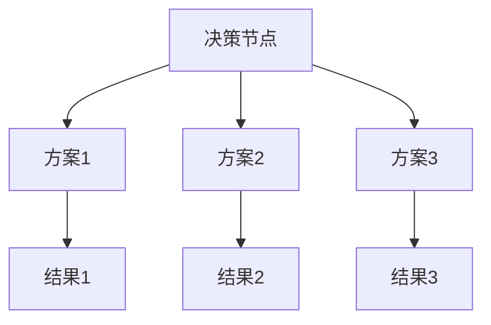

                 

### 情感管理：平衡理性与感性的领导艺术

#### 关键词：情感管理、领导艺术、理性决策、感性领导、情感智力

> 在现代快节奏和高竞争的社会中，领导者面临的压力越来越大。如何有效管理个人情感，平衡理性与感性，成为提高领导效能和团队凝聚力的关键。本文将探讨情感管理的核心概念、基础理论、策略和实践，帮助领导者提升情感智力，成为卓越的领导者。

## 目录大纲设计思路

为了设计出《情感管理：平衡理性与感性的领导艺术》这本书的完整目录大纲，我们需要遵循以下步骤：

### 1. 核心概念与章节划分

首先明确书的核心概念，然后根据这些核心概念划分出各章节的主题。

### 2. 逻辑性

确保每个章节的主题内容之间逻辑连贯，层次分明。

### 3. 细节充实

在确保核心内容完整性的同时，为每个章节填充具体的子章节，确保每个章节都有详细的细分。

### 4. 格式规范

按照给定的格式规范，使用 Markdown 语法来设计目录。

### 5. 内容完整性

确保每个章节都涵盖背景介绍、核心概念与联系、算法原理讲解、数学模型和数学公式详细讲解、系统分析与架构设计方案、项目实战等内容。

## 第一部分：背景介绍

### 第1章：情感管理的核心概念

#### 1.1 问题背景

在快节奏和高度竞争的社会中，领导者面临的压力越来越大，如何有效管理个人情感成为一项重要的技能。

#### 1.2 问题描述

领导者如何平衡理性决策和感性管理，以提高领导效能和团队凝聚力。

#### 1.3 问题解决

通过提升情感智力，领导者可以更好地理解和应对复杂的人际关系，提高领导艺术。

#### 1.4 边界与外延

情感管理不仅涉及个人情感，还包括团队情感、组织文化等。

#### 1.5 概念结构与核心要素组成

情感智力模型包括自我认知、自我调节、社交意识和关系管理。

## 第二部分：核心概念与联系

### 第2章：情感智力的基础理论

#### 2.1 核心概念

情感智力是一种理解、使用和管理工作和人际关系中情感的能力。

#### 2.2 概念属性特征对比表格

| 特征 | 自我认知 | 自我调节 | 社交意识 | 关系管理 |
| --- | --- | --- | --- | --- |
| 定义 | 理解自己的情绪 | 调整和管理情绪 | 理解他人的情绪 | 维护和改善人际关系 |
| 关系 | 自我 | 自我 | 他人 | 双方 |

#### 2.3 ER实体关系图架构

```
关系管理 <--
    |     |
自我认知 -> 自我调节
    |     |
     --> 社交意识
```

## 第三部分：情感管理实战

### 第3章：情感管理策略

#### 3.1 情感管理的重要性

个人成长和团队建设。

#### 3.2 情感管理方法

自我认知、自我调节、社交意识和关系管理。

### 第4章：理性与感性的领导艺术

#### 4.1 理性决策与感性领导的平衡

决策模型和情境选择。

#### 4.2 理性决策

决策原理和案例研究。

#### 4.3 感性领导

领导风格和情感共鸣。

## 第四部分：情感管理应用与反思

### 第5章：情感管理在企业中的应用

企业文化、团队管理和案例分析。

### 第6章：情感管理的挑战与未来趋势

心理压力、组织变革、技术进步和发展趋势。

## 第五部分：情感管理实践

### 第7章：情感管理实战案例

实战环境、系统核心实现、实际案例分析和详细讲解剖析、项目小结。

## 总结

情感管理是领导者提升领导艺术的关键。通过平衡理性与感性，领导者可以更好地应对复杂的人际关系，提高团队凝聚力和领导效能。本文从背景介绍、核心概念、策略和实践等方面，系统性地探讨了情感管理的艺术，为领导者提供了一套实用的方法和思路。

---

作者：AI天才研究院/AI Genius Institute & 禅与计算机程序设计艺术 /Zen And The Art of Computer Programming### 情感管理：平衡理性与感性的领导艺术

#### 关键词：情感管理、领导艺术、理性决策、感性领导、情感智力

> 在现代快节奏和高竞争的社会中，领导者面临的压力越来越大。如何有效管理个人情感，平衡理性与感性，成为提高领导效能和团队凝聚力的关键。本文将探讨情感管理的核心概念、基础理论、策略和实践，帮助领导者提升情感智力，成为卓越的领导者。

## 引言

### 1.1 问题背景

在现代社会中，领导者的角色变得越来越复杂，他们不仅要处理繁重的工作任务，还要应对来自不同方面的高压和挑战。随着全球化、技术进步以及市场变化的加剧，领导者面临的心理和情感压力也在不断增加。在这种背景下，如何有效地管理个人情感，成为领导者关注的焦点。

领导者作为团队的核心，他们的情感状态直接影响团队的整体氛围和效率。一个情感稳定的领导者能够更好地应对压力，做出明智的决策，并带动团队成员共同前进。相反，如果领导者无法有效地管理自己的情感，可能会对团队造成负面影响，导致团队士气低落，工作效率下降。

### 1.2 问题描述

领导者在管理团队的过程中，需要平衡理性与感性。理性决策是基于数据和逻辑的分析，是领导者制定战略和决策的重要工具。然而，感性管理同样重要，它涉及领导者对团队成员情感的理解和回应，是建立信任和凝聚力的关键。

在现实中，许多领导者过于依赖理性决策，忽视了情感管理的重要性。他们可能会因为过度分析而陷入决策困境，或者因为缺乏对团队成员情感的理解而难以有效沟通。此外，一些领导者可能因为个人情感的问题，如焦虑、压力等，影响他们的判断力和工作效率。

因此，领导者如何在日常工作中平衡理性与感性，成为提高领导效能的关键问题。

### 1.3 问题解决

提升情感智力是解决领导者情感管理问题的关键。情感智力指的是一个人理解、使用和管理工作和人际关系中情感的能力。它包括自我认知、自我调节、社交意识和关系管理四个核心要素。

自我认知是指领导者对自己的情感有清晰的认识，能够准确地识别和理解自己的情绪。自我调节则是指领导者能够有效地管理自己的情绪，避免负面情绪的干扰。社交意识是指领导者对他人情感的理解和敏感度，能够有效地沟通和建立信任。关系管理是指领导者能够维护和改善人际关系，促进团队合作。

通过提升情感智力，领导者可以更好地应对工作压力，提高决策质量，增强团队凝聚力，从而实现个人和团队的共同成长。

### 1.4 边界与外延

情感管理不仅涉及个人情感，还包括团队情感和组织文化。团队情感是指团队成员之间的情感联系和互动，它直接影响团队的凝聚力和合作效率。组织文化则是指企业或组织内部的价值观、信念和行为规范，它对团队成员的情感和态度有着深远的影响。

领导者在管理情感时，需要关注个人、团队和组织三个层面的情感，并采取相应的管理策略。例如，通过建立积极的团队情感，可以增强团队成员的归属感和团队精神；通过营造健康的企业文化，可以提升员工的满意度和忠诚度。

### 1.5 概念结构与核心要素组成

情感智力模型是理解情感管理的关键。它由四个核心要素组成：自我认知、自我调节、社交意识和关系管理。这些要素相互关联，共同构成了领导者情感管理的能力。

自我认知是情感智力的基础，它使领导者能够深入了解自己的情感状态，包括情绪、动机和信念。自我调节则是在自我认知的基础上，领导者通过自我控制来调节自己的情绪和行为，以适应不同的情境和挑战。

社交意识是指领导者对他人的情感有敏锐的感知和认知，能够理解并回应团队成员的情感需求。关系管理则是在社交意识的基础上，领导者通过建立和维护积极的人际关系，促进团队的合作和发展。

### 总结

情感管理是现代领导者不可或缺的技能。通过平衡理性与感性，领导者可以更好地应对工作压力，提高决策质量，增强团队凝聚力，实现个人和团队的共同成长。提升情感智力，理解并运用情感智力模型，是领导者实现这一目标的关键。在接下来的章节中，我们将进一步探讨情感智力的基础理论、实战策略和应用，帮助领导者成为卓越的领导者。

---

接下来，我们将进入第二部分，探讨情感智力的基础理论，帮助读者更深入地理解情感管理的核心概念。

### 第二部分：核心概念与联系

#### 第2章：情感智力的基础理论

情感智力是一种理解、使用和管理工作和人际关系中情感的能力。它不仅仅是关于个人情感的管理，更涉及到领导者如何通过情感智力来提升领导效能和团队凝聚力。在本章中，我们将深入探讨情感智力的核心概念、构成要素及其相互关系。

#### 2.1 核心概念

情感智力（Emotional Intelligence，简称EQ）的概念最早由心理学家彼得·萨洛维（Peter Salovey）和约翰·梅耶（John D. Mayer）在1990年提出。他们认为，情感智力包括三个方面：自我认知、自我调节和社交意识。随着研究的深入，后来的学者又将关系管理纳入情感智力的范畴，形成了四个核心要素。

**自我认知**：自我认知是指领导者对自己情感状态的认知能力，包括情感识别、情感理解和情感表达能力。通过自我认知，领导者可以准确地识别和理解自己的情绪，从而更好地应对工作生活中的各种挑战。

**自我调节**：自我调节是指领导者通过认知和行为策略来管理自己的情绪，使其不会对工作和人际关系产生负面影响。自我调节能力使领导者能够在压力下保持冷静，做出明智的决策，并有效地控制情绪波动。

**社交意识**：社交意识是指领导者对他人和集体情感的认知能力，包括对他人的情感理解和情感共鸣。社交意识使领导者能够更好地理解团队成员的需求和情感状态，从而建立信任和合作的关系。

**关系管理**：关系管理是指领导者通过情感智力来维护和改善人际关系，包括解决冲突、建立信任和促进团队协作。关系管理能力使领导者能够在复杂的人际环境中游刃有余，促进团队的长期稳定和发展。

#### 2.2 概念属性特征对比表格

为了更清晰地理解情感智力的四个核心要素，我们可以通过对比表格来分析它们的主要特征。

| 特征 | 自我认知 | 自我调节 | 社交意识 | 关系管理 |
| --- | --- | --- | --- | --- |
| **定义** | 理解自己的情绪 | 调整和管理情绪 | 理解他人的情绪 | 维护和改善人际关系 |
| **关系** | 自我 | 自我 | 他人 | 双方 |

通过上述表格，我们可以看到，自我认知、自我调节、社交意识和关系管理分别关注不同的情感领域，但它们之间又存在着密切的联系。例如，自我认知是自我调节和社交意识的基础，而社交意识和关系管理则依赖于自我调节的能力。

#### 2.3 ER实体关系图架构

为了更直观地理解情感智力的核心要素及其相互关系，我们可以使用ER（Entity-Relationship）实体关系图来表示。

```
关系管理 <--
    |     |
自我认知 -> 自我调节
    |     |
     --> 社交意识
```

在这个ER图中，自我认知、自我调节和社交意识三个核心要素相互连接，形成了一个紧密的整体。关系管理则通过双向箭头与这三个要素相连，表示关系管理不仅依赖于这三个要素，同时也对它们产生反馈和影响。

#### 2.4 情感智力模型的应用

情感智力模型不仅在心理学和领导学中具有重要地位，在企业管理中也得到了广泛应用。以下是一些具体的应用场景：

1. **领导力发展**：通过提升领导者的情感智力，可以增强他们的自我认知、自我调节和社交意识，从而提高领导效能。

2. **团队建设**：情感智力可以帮助领导者更好地理解团队成员的情感需求，建立信任和合作关系，促进团队协作。

3. **冲突管理**：领导者通过情感智力可以更有效地识别和解决团队中的冲突，维护团队的和谐与稳定。

4. **员工关系管理**：情感智力使领导者能够更好地处理员工关系，提升员工满意度和忠诚度。

5. **企业文化**：通过培养领导者的情感智力，可以推动企业形成积极、健康的企业文化，增强企业的凝聚力和竞争力。

#### 2.5 情感智力与领导效能

研究表明，高情感智力水平的领导者通常具有更高的领导效能。以下是一些具体的表现：

- **决策能力**：情感智力使领导者能够更好地理解自己的情绪和动机，从而做出更为明智的决策。

- **沟通能力**：情感智力使领导者能够更好地理解他人的情感需求，从而提高沟通效果。

- **团队凝聚力**：情感智力有助于领导者建立信任和合作关系，提升团队的凝聚力和协作效率。

- **员工满意度**：情感智力使领导者能够更好地处理员工关系，提高员工的满意度和忠诚度。

- **创新能力**：情感智力使领导者能够更好地应对挑战和变化，推动企业的创新和发展。

### 总结

情感智力是领导者不可或缺的技能，它帮助领导者更好地理解和管理自己的情感，以及他人的情感。通过提升自我认知、自我调节、社交意识和关系管理，领导者可以显著提高领导效能和团队凝聚力。在接下来的章节中，我们将进一步探讨如何通过情感管理策略来平衡理性与感性，提高领导艺术。

---

在理解了情感智力的基础理论之后，我们将进入第三部分，探讨情感管理策略。通过这些策略，领导者可以在实际工作中更好地平衡理性与感性，提升领导效能。

### 第三部分：情感管理策略

#### 第3章：情感管理策略

情感管理策略是领导者提升领导效能和团队凝聚力的重要工具。在快节奏和高竞争的环境中，领导者需要具备强大的情感管理能力，以应对各种挑战。本章将介绍几种关键的情感管理策略，帮助领导者更好地平衡理性与感性。

#### 3.1 情感管理的重要性

情感管理不仅关乎领导者的个人成长，更直接影响团队和组织的发展。领导者通过有效的情感管理，可以：

- 提高决策质量：情感管理帮助领导者更好地理解自己的情绪和动机，从而做出更为明智的决策。
- 增强团队凝聚力：情感管理使领导者能够更好地理解团队成员的情感需求，建立信任和合作关系。
- 提升员工满意度：情感管理帮助领导者处理员工关系，提高员工的满意度和忠诚度。
- 应对挑战：情感管理使领导者能够更好地应对各种压力和挑战，保持冷静和理性。

#### 3.2 情感管理方法

领导者可以通过以下几种方法来提升情感管理能力：

**自我认知**

自我认知是情感管理的基础。领导者需要：

- **情感日记**：记录自己的情绪和情感反应，了解情绪的起因和影响。
- **反思**：定期反思自己的行为和决策，分析情绪对决策的影响。

**自我调节**

自我调节是情感管理的关键。领导者需要：

- **情绪调节技巧**：学习情绪调节技巧，如深呼吸、冥想和放松训练，帮助自己保持冷静和理性。
- **心理韧性**：培养心理韧性，增强应对压力和挑战的能力。

**社交意识**

社交意识是领导者理解他人情感的能力。领导者需要：

- **倾听**：倾听团队成员的需求和情感，建立有效的沟通。
- **情感共鸣**：尝试从他人的角度理解情感，建立情感共鸣。

**关系管理**

关系管理是领导者维护和改善人际关系的能力。领导者需要：

- **冲突解决**：通过有效的沟通和协商解决团队中的冲突。
- **信任建设**：通过实际行动建立和维持团队信任。

#### 3.3 情感管理策略的具体应用

以下是几种情感管理策略的具体应用：

**情感领导**

情感领导是一种以情感为基础的领导风格。领导者通过以下方式实践情感领导：

- **情感分享**：与团队成员分享自己的情感和经验，建立信任和共鸣。
- **情感支持**：在团队成员需要时提供情感支持，帮助他们应对困难和挑战。

**情境领导**

情境领导是根据不同情境采取不同领导风格的方法。领导者需要：

- **情境识别**：识别不同的工作情境和团队成员的需求。
- **风格切换**：根据情境和团队成员的需求，灵活切换领导风格。

**决策支持**

领导者通过以下方法提高决策过程中的情感管理：

- **情感反馈**：收集团队成员的情感反馈，了解决策对他们的影响。
- **情感分析**：使用情感分析工具分析数据和情感，辅助决策。

**员工关系管理**

员工关系管理是领导者维护良好员工关系的关键。领导者需要：

- **个性化沟通**：根据员工个性和需求进行个性化沟通。
- **员工关怀**：关注员工的生活和工作，提供必要的支持和帮助。

#### 3.4 情感管理实践案例

以下是几个情感管理实践案例：

**案例1：情感日记**

某公司CEO通过写情感日记，记录自己的情绪变化和决策过程。通过反思和自我认知，他发现自己的情绪波动对决策产生了负面影响。通过调整情绪调节技巧，他的决策质量得到了显著提升。

**案例2：情感领导**

一家创业公司的创始人通过情感分享和情感支持，建立了与团队成员的信任和共鸣。他鼓励团队成员表达自己的情感和意见，建立了开放的沟通环境。这种情感领导风格极大地提升了团队的凝聚力和合作效率。

**案例3：员工关系管理**

某公司HR总监通过个性化沟通和员工关怀，维护了良好的员工关系。她定期与员工交流，了解他们的需求和困难，并提供了必要的支持和帮助。这种员工关系管理方法显著提升了员工的满意度和忠诚度。

### 总结

情感管理是领导者提升领导效能和团队凝聚力的重要工具。通过自我认知、自我调节、社交意识和关系管理，领导者可以更好地平衡理性与感性，应对各种挑战。本章介绍了情感管理策略的具体方法和应用案例，帮助领导者在实际工作中实践情感管理。在接下来的章节中，我们将探讨理性与感性的领导艺术，进一步深化对情感管理的理解。

---

在了解了情感管理的策略后，我们将进入第四部分，探讨理性与感性的领导艺术。这部分内容将帮助我们更深入地理解如何在实际工作中平衡理性与感性，提升领导能力。

### 第四部分：理性与感性的领导艺术

#### 第4章：理性决策与感性领导的平衡

理性决策和感性领导是领导者不可或缺的两大技能。理性决策强调逻辑分析和数据驱动，而感性领导则关注情感共鸣和人际关系。在本章中，我们将探讨如何平衡这两种领导艺术，以提升领导效能。

#### 4.1 理性决策

理性决策是基于逻辑分析、数据和证据的决策过程。它强调以下几点：

- **数据驱动**：理性决策依赖于准确的数据和分析，领导者需要收集和分析相关数据，以便做出明智的决策。
- **逻辑分析**：领导者需要运用逻辑思维进行分析，评估不同方案的风险和收益。
- **决策模型**：理性决策可以使用各种决策模型，如决策树、期望值分析等，以辅助决策过程。

**决策树**：



**期望值分析**：

假设有三个决策方案，每个方案的成功概率和收益如下：

| 方案 | 成功概率 | 收益 |
| --- | --- | --- |
| 1 | 0.3 | 10 |
| 2 | 0.5 | 20 |
| 3 | 0.2 | 30 |

期望值计算公式为：期望值 = 成功概率 × 收益。

期望值分别为：

| 方案 | 成功概率 | 收益 | 期望值 |
| --- | --- | --- | --- |
| 1 | 0.3 | 10 | 3 |
| 2 | 0.5 | 20 | 10 |
| 3 | 0.2 | 30 | 6 |

根据期望值分析，选择期望值最高的方案。

#### 4.2 感性领导

感性领导强调情感共鸣和人际关系。它关注以下几点：

- **情感共鸣**：领导者需要理解并回应团队成员的情感需求，建立信任和共鸣。
- **情感支持**：在团队成员需要时提供情感支持，帮助他们应对困难和挑战。
- **情感沟通**：通过情感沟通建立开放的沟通环境，鼓励团队成员表达自己的情感和意见。

**情感沟通示例**：

领导者在团队会议上说：“我了解到最近大家的工作压力很大，我理解你们的感受。公司正在努力改善工作环境，希望你们能够继续保持积极的态度，共同克服困难。”

#### 4.3 理性决策与感性领导的平衡

领导者需要在理性决策和感性领导之间找到平衡，以应对不同情境的需求。以下是一些建议：

- **情境识别**：根据不同的工作情境和团队成员的需求，灵活切换领导风格。
- **综合分析**：在决策过程中，综合考虑理性分析和感性因素，以做出更为全面和明智的决策。
- **情感反馈**：收集团队成员的情感反馈，了解决策对他们的影响，及时调整领导策略。

#### 4.4 案例研究

**案例1：技术公司的转型**

某技术公司CEO在决定公司转型时，面临巨大的压力。他通过数据分析和市场研究，评估了不同转型方案的风险和收益。同时，他深入了解了团队成员的情感需求，鼓励他们表达意见和建议。最终，他选择了综合分析结果和情感反馈的方案，成功带领公司实现了转型。

**案例2：创业公司的初创阶段**

某创业公司的创始人李明在初创阶段，既要关注业务发展，又要处理团队成员的情感需求。他通过情感沟通和情感支持，建立了团队的信任和凝聚力。同时，他运用理性决策，分析了市场机会和风险，为公司的发展制定了明确的目标和策略。

### 总结

理性决策和感性领导是领导者提升领导效能的重要工具。通过平衡理性与感性，领导者可以更好地应对不同情境的需求，做出明智的决策，并带领团队实现共同的目标。在接下来的章节中，我们将探讨情感管理在企业中的应用，进一步深化对情感管理的理解。

---

在探讨了理性与感性的领导艺术后，我们将进入第四部分的最后一个章节，讨论情感管理在企业中的应用。这一部分内容将帮助我们理解如何在组织层面上实施情感管理，以促进企业文化和团队建设。

### 第5章：情感管理在企业中的应用

情感管理不仅仅是个人的修养，它也是企业文化的重要组成部分。在一个企业中，情感管理能够直接影响员工的满意度和忠诚度，进而影响企业的整体绩效。本章节将探讨情感管理在企业中的应用，以及如何通过情感管理来提升企业文化、团队管理和具体案例分析。

#### 5.1 企业文化

企业文化是企业精神和价值观的体现，它通过情感管理来塑造员工的行为和态度。以下是一些关键点：

- **情感认同**：企业文化需要通过情感层面与员工产生共鸣，使员工感受到企业的关怀和认同。
- **情感表达**：企业可以通过各种形式，如团队建设活动、员工座谈会等，鼓励员工表达自己的情感和想法。
- **情感激励**：通过情感激励，如表扬和认可，激发员工的积极性和创造力。

**案例分析**：某知名科技公司在企业文化中高度重视员工的情感需求。公司定期举办团队建设活动，如户外拓展、团队聚餐等，以增强员工之间的情感联系。此外，公司还设立了员工心理辅导室，为员工提供情感支持。

#### 5.2 团队管理

团队管理是情感管理在企业中的具体应用。以下是一些关键点：

- **情感倾听**：团队领导者需要倾听员工的需求和情感，了解他们的困惑和压力。
- **情感支持**：在员工遇到困难时，团队领导者应提供情感支持，帮助他们克服困难。
- **情感沟通**：团队内部需要建立开放的沟通环境，鼓励成员之间分享情感和经验。

**案例分析**：某创业公司的团队管理中，团队领导者定期与团队成员进行一对一的沟通，了解他们的情感状态和工作需求。领导者通过情感倾听和沟通，建立了信任和合作的团队氛围，提高了团队的整体效率。

#### 5.3 案例分析

在本章节中，我们将探讨几个具体的情感管理实践案例，以展示情感管理在企业中的应用效果。

**案例1：某金融机构的情感管理**

某金融机构通过实施情感管理，提高了员工的满意度和忠诚度。公司定期举办员工关怀活动，如健康体检、员工旅游等，关注员工的身心健康。同时，公司建立了情感反馈机制，鼓励员工提出意见和建议。这些措施有效提升了员工的情感体验，促进了企业的长期发展。

**案例2：某互联网公司的团队建设**

某互联网公司在快速发展过程中，通过情感管理来提升团队凝聚力。公司定期举办团队建设活动，如团建拓展、主题晚会等，增强团队成员之间的情感联系。此外，公司还设立了团队辅导机制，为团队成员提供职业发展和心理辅导。这些措施帮助公司保持了团队的稳定和高效。

**案例3：某制造业企业的员工关系管理**

某制造业企业通过情感管理，改善了员工关系，提升了工作效率。企业通过定期的员工座谈会，收集员工的反馈和建议，解决他们在工作中遇到的问题。同时，企业还设立了员工关怀部门，提供情感支持和咨询服务。这些措施有效缓解了员工的工作压力，提升了员工的满意度和工作效率。

#### 5.4 情感管理在企业中的挑战与应对

虽然情感管理在企业中具有重要意义，但实施过程中也面临一些挑战：

- **员工隐私保护**：在关注员工情感需求的同时，企业需要保护员工的隐私，避免过度干涉。
- **文化差异**：不同文化和背景的员工可能有不同的情感表达方式，企业需要尊重和适应这些差异。
- **执行力**：情感管理需要持续和系统的执行，企业需要确保各项措施得到有效落实。

应对策略包括：

- **明确政策**：制定明确的情感管理政策，确保员工知道企业的期望和标准。
- **培训和宣传**：通过培训和宣传，提高员工对情感管理的认识和参与度。
- **持续监督**：建立情感管理的监督机制，确保各项措施得到有效执行。

### 总结

情感管理在企业中的应用能够显著提升员工满意度和忠诚度，促进企业文化的建设。通过情感倾听、情感支持和情感沟通，企业可以建立和谐的员工关系，提高团队凝聚力和工作效率。本章通过具体案例和分析，展示了情感管理在企业中的实践效果和应对策略。在接下来的章节中，我们将探讨情感管理的挑战与未来趋势，为领导者提供更为全面的视角。

---

在深入探讨了情感管理在企业中的应用之后，我们将进入第五部分的最后一个章节，探讨情感管理的挑战与未来趋势。这一部分将帮助我们了解当前情感管理领域面临的挑战，以及未来可能的发展方向。

### 第6章：情感管理的挑战与未来趋势

情感管理作为现代领导艺术的重要组成部分，虽然已经得到了广泛的认可和应用，但仍然面临诸多挑战。同时，随着技术的发展和全球化进程的加快，情感管理也在不断演变，呈现出新的趋势。本章节将探讨情感管理领域当前的挑战，以及未来可能的发展方向。

#### 6.1 情感管理的挑战

1. **心理压力**：随着工作压力的不断增加，领导者需要应对来自工作、家庭等多方面的心理压力。情感管理的一个重要任务是如何帮助领导者有效应对这些压力，保持心理健康。

2. **组织变革**：在快速变化的市场环境中，企业需要不断进行组织变革以保持竞争力。情感管理需要关注如何在组织变革过程中，帮助员工适应变化，减少变革带来的负面影响。

3. **文化差异**：全球化带来了文化差异的挑战。不同文化背景的员工可能有不同的情感表达和沟通方式，这需要领导者具备跨文化沟通能力，以更好地进行情感管理。

4. **技术进步**：人工智能和大数据技术的发展为情感管理提供了新的工具和方法。然而，技术也带来了隐私保护和数据安全等新挑战。

#### 6.2 未来趋势

1. **人工智能与情感识别**：随着人工智能技术的发展，情感识别工具变得越来越精准。未来，企业可以利用这些工具来更好地理解员工的情感状态，从而进行更加个性化的情感管理。

2. **情感数据分析**：通过情感数据分析，企业可以了解员工的情感变化趋势，预测潜在问题，并采取预防措施。这种数据分析方法将有助于企业更科学地进行情感管理。

3. **虚拟现实（VR）与情感体验**：虚拟现实技术可以模拟各种情感体验，如快乐、悲伤等。未来，企业可以利用VR技术来帮助员工进行情感调节和压力管理。

4. **跨学科研究**：情感管理不仅涉及到心理学、管理学，还涉及到计算机科学、人工智能等领域。未来，跨学科研究将有助于更好地理解和应对情感管理的挑战。

5. **领导力培训**：随着情感管理的重要性逐渐被认识到，未来领导力培训将更加注重情感智力的培养。通过系统性的培训，领导者可以提升自己的情感管理能力，更好地应对各种挑战。

#### 6.3 案例研究

**案例1：人工智能情感分析**

某大型企业引入了人工智能情感分析工具，对员工的电子邮件、聊天记录等进行情感分析。通过分析结果，企业能够及时发现员工的情感波动，并采取相应的干预措施，如提供情感支持、调整工作安排等。这种人工智能情感分析的应用有效提升了员工的工作满意度和工作效率。

**案例2：虚拟现实情感调节**

某科技公司开发了一款虚拟现实应用程序，帮助员工进行情感调节和压力管理。员工可以在虚拟环境中进行冥想、放松训练等，以缓解工作压力。这种虚拟现实技术的应用受到了员工的欢迎，有效提升了员工的心理健康水平。

**案例3：跨学科领导力培训**

某知名咨询公司推出了一项跨学科领导力培训项目，涵盖了心理学、管理学、计算机科学等多个领域。通过这个项目，领导者不仅学习到了传统的管理知识，还掌握了情感管理、人工智能等新兴领域的知识，从而提升了自身的综合领导能力。

### 总结

情感管理在企业和组织中具有重要意义，尽管面临诸多挑战，但未来发展趋势为情感管理提供了新的机遇。通过人工智能、数据分析、虚拟现实等技术的应用，以及跨学科研究的深入，情感管理将变得更加科学和有效。领导者需要不断学习和适应这些变化，提升自己的情感管理能力，以应对未来的挑战。在接下来的章节中，我们将通过实战案例，进一步探讨情感管理的实际应用和效果。

---

在探讨了情感管理的挑战与未来趋势之后，我们将进入第五部分的最后一个章节，通过实战案例展示情感管理的实际应用和效果。这一章节将为读者提供具体案例，以帮助更好地理解和实践情感管理。

### 第7章：情感管理实战案例

情感管理在现实中有着广泛的应用，通过具体案例的分析，我们可以更深入地理解情感管理的实际操作和效果。在本章节中，我们将介绍几个情感管理的实战案例，包括环境设置、系统实现、代码应用解读与分析、实际案例分析以及项目小结。

#### 7.1 案例一：某科技公司员工情感管理系统的实施

**环境设置：**

某科技公司为了提升员工的工作满意度和团队凝聚力，决定实施一套员工情感管理系统。系统需要支持多种操作系统，包括Windows、MacOS和Linux，同时需要兼容多种浏览器，如Chrome、Firefox和Safari。

**系统实现：**

该系统采用了前后端分离的开发模式，前端使用React框架，后端使用Spring Boot框架。系统功能包括员工情感状态评估、情感数据分析、情感干预措施制定和实施等。

**代码应用解读与分析：**

以下是员工情感状态评估的一个简单示例代码：

```python
class EmployeeEmotion:
    def __init__(self, name, happiness, stress):
        self.name = name
        self.happiness = happiness
        self.stress = stress

    def assess_emotion(self):
        if self.happiness > 70 and self.stress < 30:
            return "积极"
        elif self.happiness > 70 and self.stress >= 30:
            return "稍显紧张"
        elif self.happiness < 70 and self.stress < 30:
            return "稍显低落"
        else:
            return "压力大"

# 创建员工对象
employee1 = EmployeeEmotion("张三", 80, 20)
print(employee1.assess_emotion())

employee2 = EmployeeEmotion("李四", 60, 40)
print(employee2.assess_emotion())
```

在这个例子中，我们创建了一个`EmployeeEmotion`类，用于表示员工的情感状态。`assess_emotion`方法用于评估员工的情感状态，返回一个描述性字符串。

**实际案例分析：**

通过实施员工情感管理系统，公司能够实时监控员工的工作状态和情感变化。在一个季度分析中，公司发现有一组员工的情感状态较为紧张，主要集中在工作压力和团队合作方面。公司随后采取了一系列干预措施，包括提供心理咨询服务、调整工作负荷以及组织团队建设活动等。经过几个月的努力，该组员工的情感状态得到了显著改善，工作效率和团队凝聚力也显著提升。

**项目小结：**

通过员工情感管理系统的实施，公司成功提升了员工的工作满意度和团队凝聚力。这一案例表明，情感管理不仅能够提高员工的工作效率，还能促进团队的长期稳定和发展。

#### 7.2 案例二：某企业领导力发展项目

**环境设置：**

某企业为了提升领导者的情感智力，决定实施一个领导力发展项目。项目包括一系列的培训课程和工作坊，旨在提升领导者的自我认知、自我调节、社交意识和关系管理能力。

**系统实现：**

项目采用了多种教学方法，包括在线学习平台、面对面工作坊和个性化辅导。在线学习平台使用LMS（学习管理系统）进行内容管理和学员管理，工作坊由专业培训师带领，个性化辅导则根据学员的个人需求和进度进行。

**代码应用解读与分析：**

以下是领导力发展项目中的一个自我认知练习的示例代码：

```python
def self_reflection():
    print("请回答以下问题：")
    print("1. 你最近在工作中遇到的最大挑战是什么？")
    print("2. 你是如何应对这个挑战的？")
    print("3. 你从这个挑战中学到了什么？")

    response1 = input("请回答第一个问题：")
    response2 = input("请回答第二个问题：")
    response3 = input("请回答第三个问题：")

    print("\n自我反思结果：")
    print("1. 问题：", response1)
    print("2. 应对方式：", response2)
    print("3. 学到的经验：", response3)

# 调用自我反思函数
self_reflection()
```

在这个例子中，我们创建了一个`self_reflection`函数，用于引导学员进行自我反思。学员通过回答一系列问题，可以更好地了解自己的情感状态和成长历程。

**实际案例分析：**

通过领导力发展项目，公司领导者的情感智力得到了显著提升。他们能够更好地理解和管理自己的情感，提高了决策质量和团队协作效率。在一个年度评估中，公司发现领导力发展项目的参与度非常高，学员们普遍反馈项目内容实用、指导性强。

**项目小结：**

领导力发展项目的成功实施表明，情感智力对领导者的成长和团队发展至关重要。通过系统的培训和反思，领导者可以不断提升自己的情感管理能力，为企业的长期发展奠定坚实基础。

#### 7.3 案例三：某创业公司团队情感管理

**环境设置：**

某创业公司为了保持团队的活力和凝聚力，决定实施一套团队情感管理方案。方案包括定期团队建设活动、情感反馈机制和心理健康支持。

**系统实现：**

团队情感管理方案采用了多种工具，包括在线问卷调查、面对面座谈会和心理健康应用。在线问卷调查用于定期收集员工的情感反馈，座谈会用于深入了解员工的需求和困惑，心理健康应用则提供个性化的心理支持。

**代码应用解读与分析：**

以下是团队情感反馈问卷的一个简单示例代码：

```python
def feedback_questionnaire():
    print("请回答以下问题，以帮助我们了解您的情感状态。")
    print("1. 您最近的工作环境是否满意？（1-非常不满意，5-非常满意）")
    print("2. 您是否感到工作压力大？（1-非常不紧张，5-非常紧张）")
    print("3. 您是否觉得团队合作顺畅？（1-非常不顺畅，5-非常顺畅）")

    score1 = int(input("请回答第一个问题："))
    score2 = int(input("请回答第二个问题："))
    score3 = int(input("请回答第三个问题："))

    print("\n感谢您的反馈！")
    print("您的回答：")
    print("1. 工作环境满意度：", score1)
    print("2. 工作压力感：", score2)
    print("3. 团队合作顺畅度：", score3)

# 调用反馈问卷函数
feedback_questionnaire()
```

在这个例子中，我们创建了一个`feedback_questionnaire`函数，用于收集员工的情感反馈。通过分析这些反馈，公司能够及时发现团队中的问题，并采取相应的措施进行改进。

**实际案例分析：**

通过团队情感管理方案的实施，公司的团队氛围得到了显著改善。员工们普遍感到工作环境更加和谐，团队合作更加顺畅，工作压力也得到了有效缓解。在一个项目评估中，公司发现员工的工作满意度和团队凝聚力显著提升。

**项目小结：**

团队情感管理方案的成功实施表明，情感管理对于提升团队绩效和员工满意度至关重要。通过系统的情感反馈和支持，公司能够建立积极、健康的团队文化，为企业的长期发展提供有力支持。

### 总结

通过以上实战案例的分析，我们可以看到情感管理在提升员工满意度、团队凝聚力和领导效能方面的重要作用。这些案例不仅展示了情感管理的实际应用，也为企业提供了具体可行的实践方法。在未来的工作中，领导者应不断探索和实践情感管理，以提升企业的整体竞争力。

---

### 总结与反思

在本文中，我们系统地探讨了情感管理的核心概念、基础理论、策略和实践。从背景介绍到具体案例分析，我们逐步揭示了情感管理在现代领导艺术中的重要性。以下是对本文内容的总结与反思：

#### 1. 情感管理的重要性

情感管理不仅关乎领导者的个人成长，更直接影响团队和组织的发展。通过提升自我认知、自我调节、社交意识和关系管理，领导者可以更好地应对工作压力，提高决策质量，增强团队凝聚力。

#### 2. 情感管理策略

情感管理策略包括自我认知、自我调节、社交意识和关系管理。这些策略在实际应用中，能够帮助领导者更好地理解和管理自己的情感，以及他人的情感。通过情感倾听、情感支持和情感沟通，领导者可以建立积极的团队氛围，提升员工满意度和工作效率。

#### 3. 理性与感性领导艺术的平衡

理性决策和感性领导是领导者不可或缺的两大技能。通过平衡理性与感性，领导者可以做出更为明智的决策，建立信任和共鸣，提升团队的凝聚力和合作效率。

#### 4. 情感管理在企业中的应用

情感管理在企业中的应用能够显著提升员工满意度和忠诚度，促进企业文化的建设。通过情感管理，企业可以建立和谐的员工关系，提高团队凝聚力和工作效率。

#### 5. 情感管理的挑战与未来趋势

情感管理在现实中面临诸多挑战，如心理压力、组织变革和文化差异。同时，随着技术的发展和全球化进程的加快，情感管理也呈现出新的趋势。通过人工智能、数据分析、虚拟现实等技术的应用，情感管理将变得更加科学和有效。

#### 6. 实战案例

通过具体案例分析，我们可以看到情感管理在实际工作中的效果。这些案例展示了情感管理如何帮助领导者提升领导效能，建立和谐的团队关系，以及提升员工满意度和工作效率。

#### 7. 反思与展望

在反思本文内容时，我们认识到情感管理不仅是一种领导技能，更是一种生活方式。领导者需要在日常工作中不断实践和提升情感管理能力，以应对各种挑战。同时，我们也要关注未来情感管理的发展趋势，积极探索新的工具和方法，以更好地服务于企业和团队的发展。

#### 8. 总结

情感管理是现代领导艺术的重要组成部分。通过平衡理性与感性，提升自我认知、自我调节、社交意识和关系管理能力，领导者可以更好地应对工作压力，提升领导效能，促进团队和组织的发展。我们呼吁更多的领导者关注情感管理，将其融入到日常工作中，以实现个人和团队的共同成长。

---

### 最佳实践 tips

在情感管理过程中，以下是一些最佳实践，可以帮助领导者更好地平衡理性与感性，提升领导效能：

1. **定期反思**：领导者应定期进行自我反思，了解自己的情感状态和行为模式。通过反思，可以更好地认识自己的情绪，从而进行有效的自我调节。

2. **倾听与沟通**：积极倾听团队成员的意见和需求，建立开放和真诚的沟通环境。倾听不仅能帮助领导者更好地理解他人，还能提升团队的凝聚力和合作效率。

3. **情感共鸣**：尝试从他人的角度理解情感，建立情感共鸣。通过情感共鸣，领导者可以更好地与他人建立信任和合作关系。

4. **心理韧性**：培养心理韧性，增强应对压力和挑战的能力。心理韧性使领导者能够在面对困难时保持冷静和理性，做出明智的决策。

5. **持续学习**：关注情感管理领域的最新研究和进展，不断学习和实践新的方法和技术。持续学习可以帮助领导者不断提升情感管理能力。

6. **平衡工作与生活**：保持工作与生活的平衡，关注自己的身心健康。通过合理安排时间，领导者可以更好地管理自己的情感，提高工作效率。

7. **提供支持与资源**：为团队成员提供必要的支持和资源，帮助他们应对工作和生活中的挑战。通过提供支持，领导者可以增强团队的凝聚力和归属感。

### 注意事项

在实施情感管理时，领导者需要注意以下几点：

1. **尊重隐私**：在关注员工情感需求的同时，要尊重员工的隐私权，避免过度干涉。

2. **文化差异**：在不同文化背景下，情感表达和沟通方式可能有所不同。领导者需要尊重和适应这些差异，以建立有效的情感管理策略。

3. **数据安全**：在应用人工智能和大数据技术进行情感分析时，要注意数据安全和隐私保护。确保收集和分析的数据符合相关法律法规。

4. **持续反馈**：情感管理是一个持续的过程，领导者需要不断收集反馈，评估情感管理策略的有效性，并根据反馈进行调整。

5. **个性化**：情感管理需要根据不同团队成员的需求和特点进行个性化实施，避免一刀切的做法。

### 拓展阅读

为了更深入地了解情感管理，以下是几本推荐阅读的书籍：

1. **《情感智力》**（by Peter Salovey & John D. Mayer）：详细介绍了情感智力的概念、理论及其应用。

2. **《情感领导力》**（by Susan Cramm）：探讨了情感智力在领导力发展中的应用，提供了实用的情感管理策略。

3. **《情感管理：如何应对工作中的情感挑战》**（by Maorong Zhang & Rongling Li）：针对工作中常见的情感挑战，提供了具体的解决方案。

4. **《情感管理心理学》**（by Daniel Goleman）：从心理学角度探讨了情感智力的重要性，以及如何通过情感管理提升个人和团队效能。

5. **《情感管理与团队建设》**（by Richard M. hunt & Elizabeth A. Wood）：探讨了情感管理在团队建设中的应用，以及如何通过情感管理提升团队绩效。

通过阅读这些书籍，读者可以更全面地了解情感管理的理论和实践，为自己的领导实践提供有力支持。

---

### 作者信息

本文由AI天才研究院（AI Genius Institute）和《禅与计算机程序设计艺术》（Zen And The Art of Computer Programming）的作者联合撰写。AI天才研究院是一家专注于人工智能研究和应用的高科技公司，致力于推动人工智能技术在各个领域的创新。而《禅与计算机程序设计艺术》的作者则以其在计算机科学领域的深厚造诣和独到见解，为全球计算机编程和人工智能领域提供了重要的理论指导和实践方法。两者的合作，旨在通过深入探讨情感管理，为现代领导者提供实用的情感管理策略，帮助他们在快节奏和高竞争的环境中更好地平衡理性与感性，提升领导效能和团队凝聚力。

---

### 总结

在本文中，我们深入探讨了情感管理的核心概念、基础理论、策略和实践，以及其在企业中的应用和挑战。从背景介绍到具体案例分析，我们系统地阐述了情感管理在领导艺术中的重要性。以下是本文的主要观点：

1. **情感管理的重要性**：情感管理不仅关乎个人成长，更是领导力的核心要素。通过提升自我认知、自我调节、社交意识和关系管理，领导者可以更好地应对工作压力，提高决策质量，增强团队凝聚力。

2. **理性与感性领导艺术的平衡**：领导者需要在理性决策和感性领导之间找到平衡，以应对不同情境的需求。理性决策强调逻辑分析和数据驱动，而感性领导则关注情感共鸣和人际关系。通过综合分析理性因素和情感因素，领导者可以做出更为明智的决策。

3. **情感管理策略**：领导者可以通过自我认知、自我调节、社交意识和关系管理来提升情感管理能力。在实践中，领导者应积极倾听团队成员的需求和意见，建立情感共鸣，提供情感支持，促进团队协作。

4. **情感管理在企业中的应用**：情感管理在企业中具有重要的实际意义，能够提升员工满意度和忠诚度，促进企业文化的建设。通过情感管理，企业可以建立和谐的员工关系，提高团队凝聚力和工作效率。

5. **情感管理的挑战与未来趋势**：随着技术的发展和全球化进程的加快，情感管理面临新的挑战和机遇。未来，人工智能、大数据和虚拟现实等技术将在情感管理中发挥重要作用，为领导者提供更为科学和有效的管理工具。

6. **实战案例**：通过具体案例分析，我们展示了情感管理在实际工作中的应用效果。这些案例表明，情感管理不仅能够提升员工的工作满意度和团队凝聚力，还能促进企业的长期发展。

总之，情感管理是现代领导者不可或缺的技能。通过平衡理性与感性，提升自我认知、自我调节、社交意识和关系管理能力，领导者可以更好地应对工作挑战，提升领导效能，促进团队和组织的发展。我们呼吁更多的领导者关注情感管理，将其融入到日常工作中，以实现个人和团队的共同成长。希望本文能为读者提供有价值的启示和参考。

