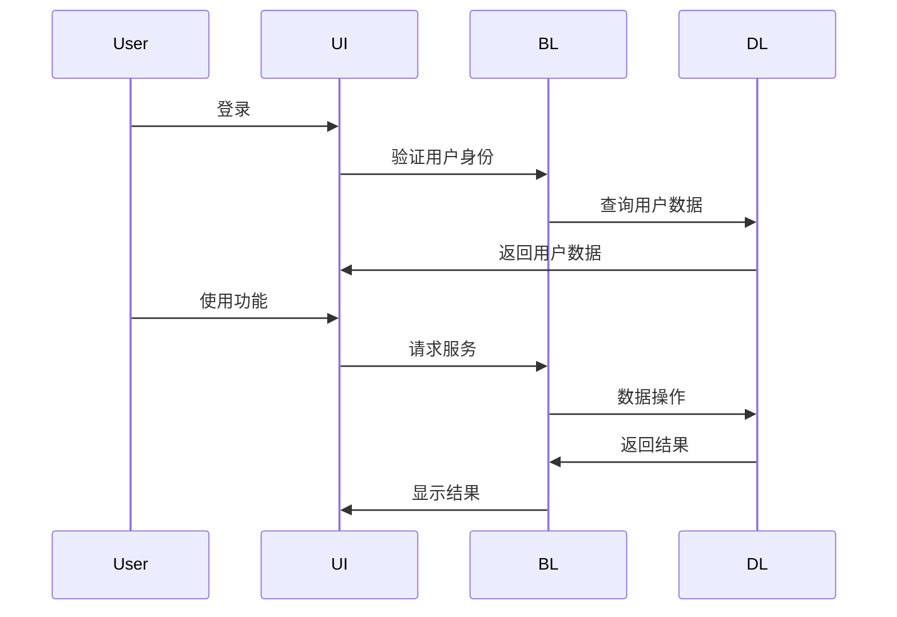
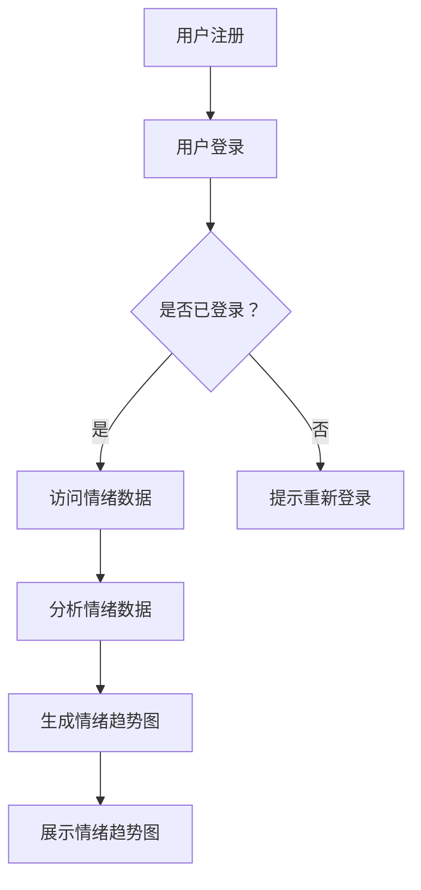

                 

### 情绪智商：提升领导者影响力的关键

#### 关键词：
1. 情绪智商
2. 领导力
3. 情感管理
4. 影响力
5. 团队协作

#### 摘要：
本文将探讨情绪智商在领导力发展中的关键作用。情绪智商不仅涉及个人情感认知与调节，还包括对他人情绪的敏感度和管理能力。领导者通过提升情绪智商，可以有效增强其影响力，促进团队协作，实现组织目标。文章将从核心概念、提升策略、案例分析到实践指南，逐步剖析情绪智商在领导力中的重要性。

### 背景介绍

#### 情绪智商的定义与意义

情绪智商（Emotional Intelligence，简称EQ）是指个体识别、理解、管理和调节自己及他人情绪的能力。情绪智商涵盖了三个主要维度：自我意识、自我调节、社交意识和关系管理。[1] 它不仅反映了个人情感认知的水平，更是衡量一个人社交能力的重要指标。

在领导者角色中，情绪智商显得尤为重要。首先，领导者需要具备良好的自我意识，能够准确地感知自己的情绪，避免因情绪波动而影响决策。其次，情绪调节能力帮助领导者稳定情绪，以积极的态度面对挑战。再者，社交意识和关系管理能力使得领导者能够与团队成员建立良好的关系，提高团队的凝聚力和协作效率。

#### 领导者与情绪智商

领导者的职责不仅仅是制定战略和决策，更重要的是通过影响力激励和引导团队。而影响力源自于领导者对团队成员的情感理解和共鸣。情绪智商高的领导者能够：

1. **建立信任**：通过理解团队成员的情绪和需求，建立信任关系，促进沟通和合作。
2. **提升团队凝聚力**：通过情感共鸣和激励，增强团队成员的归属感和责任感，提高团队的凝聚力。
3. **有效沟通**：利用情绪调节技巧，确保沟通的有效性和准确性，避免误解和冲突。
4. **应对挑战**：在面对压力和困难时，情绪智商高的领导者能够保持冷静和乐观，为团队树立榜样。

#### 情绪智商的核心概念与联系

情绪智商的核心概念包括自我意识、自我调节、社交意识和关系管理。这些概念相互联系，共同构成了情绪智商的整体框架。

1. **自我意识**：指的是个体对自己情绪的认知和感知能力。自我意识高的领导者能够清楚地认识到自己的情绪状态，并理解情绪对行为的影响。
2. **自我调节**：是指个体在情绪高涨或低落时，通过自我控制和管理情绪的能力。自我调节能力使得领导者能够在压力下保持冷静和理性，避免冲动决策。
3. **社交意识**：是指个体对他人情绪的认知和理解能力。社交意识高的领导者能够敏锐地察觉到团队成员的情绪变化，并做出相应的调整。
4. **关系管理**：是指个体在人际关系中，建立和维护良好关系的能力。关系管理能力使得领导者能够有效地协调团队内部关系，提高团队的协作效率。

接下来，我们将通过表格和ER图来展示情绪智商核心概念之间的关系。

#### 表格：情绪智商核心概念属性对比

| 核心概念   | 定义                                                     | 关键属性                      | 影响领域          |
| ---------- | -------------------------------------------------------- | ---------------------------- | ----------------- |
| 自我意识   | 对自己情绪的认知和感知能力                               | 情绪认知、自我反馈            | 决策、自我管理    |
| 自我调节   | 在情绪高涨或低落时，通过自我控制和管理情绪的能力          | 情绪控制、适应性              | 应对压力、决策    |
| 社交意识   | 对他人情绪的认知和理解能力                              | 情绪感知、社交敏感性          | 沟通、团队协作    |
| 关系管理   | 在人际关系中，建立和维护良好关系的能力                   | 社交技巧、冲突解决            | 团队管理、领导力  |

#### ER图：情绪智商概念关系图

```mermaid
erDiagram
  A[自我意识] ||--|{ 自我调节 }
  A ||--|{ 社交意识 }
  A ||--|{ 关系管理 }
  B[自我调节] ||--|{ 自我意识 }
  B ||--|{ 关系管理 }
  C[社交意识] ||--|{ 自我意识 }
  C ||--|{ 关系管理 }
  D[关系管理] ||--|{ 自我意识 }
  D ||--|{ 自我调节 }
  D ||--|{ 社交意识 }
```

通过这个表格和ER图，我们可以清晰地看到情绪智商各个核心概念之间的联系，以及它们在领导者角色中的重要作用。

### 情绪智商的结构与维度

情绪智商并非单一维度的能力，而是由多个维度共同构成的一个复杂体系。这些维度相互联系，共同决定了个体在情感领域的行为和表现。以下将详细探讨情绪智商的三个主要维度：认知维度、行为维度和情感维度。

#### 认知维度

认知维度涉及个体对自己和他人情绪的认知和理解。这一维度包括自我意识和社交意识两个方面。

1. **自我意识**：指个体对自己情绪的认知和感知能力。自我意识高的领导者能够准确地识别和理解自己的情绪状态，包括情绪的产生、情感反应和情绪对身体的影响。通过自我意识，领导者可以更好地管理自己的情绪，避免因情绪失控而做出错误的决策。

2. **社交意识**：指个体对他人类别情绪的认知和理解能力。社交意识高的领导者能够敏锐地察觉到团队成员的情绪变化，并理解这些情绪背后的原因。这种能力对于建立和维护良好的团队关系至关重要，它有助于领导者更好地协调团队内部的人际关系，提高团队的协作效率。

#### 行为维度

行为维度涉及个体在情感管理方面的行为表现。这一维度包括自我调节和社交技能两个方面。

1. **自我调节**：指个体在情绪高涨或低落时，通过自我控制和管理情绪的能力。自我调节能力使得领导者能够在压力和挑战面前保持冷静和理性，避免情绪化决策。通过自我调节，领导者可以提高决策质量和团队合作效果。

2. **社交技能**：指个体在社交场合中表现出来的沟通、协调和解决冲突的能力。社交技能包括倾听、表达、共情、协商和冲突解决等方面。社交技能高的领导者能够有效地与团队成员沟通，建立信任和合作关系，促进团队的凝聚力和协作。

#### 情感维度

情感维度涉及个体在情感体验和表达方面的能力。这一维度包括情感智力和情感管理两个方面。

1. **情感智力**：指个体识别、理解和管理自己及他人情绪的能力。情感智力包括自我意识、自我调节、社交意识和情感表达等方面。情感智力高的领导者能够更好地理解和管理自己的情绪，同时也能够理解和支持他人的情感需求。

2. **情感管理**：指个体在情感表达和情感应对方面的能力。情感管理能力包括情绪表达、情绪调节、情感支持和情感共鸣等方面。情感管理能力使得领导者能够在不同情境下，以适当的方式表达自己的情绪，同时也能够理解和回应他人的情绪。

#### 情绪智商的整体评估

情绪智商是一个多维度的综合能力，需要从多个维度进行评估。以下是一个情绪智商评估维度的示例表格，用于评估个体的情绪智商水平。

| 评估维度 | 评估指标                      | 评估方法                                       | 评估结果               |
| -------- | ----------------------------- | ---------------------------------------------- | ---------------------- |
| 自我意识 | 自我情绪认知能力              | 自我反思、情绪日志记录                          | 高、中、低             |
| 自我调节 | 自我情绪控制能力              | 情绪应对策略练习、情境模拟测试                | 高、中、低             |
| 社交意识 | 他人情绪认知能力              | 情境分析、情绪观察、反馈问卷                   | 高、中、低             |
| 社交技能 | 沟通、协调、冲突解决能力      | 模拟沟通练习、团队合作评估、冲突解决测试      | 高、中、低             |
| 情感智力 | 情感识别、理解和管理能力      | 情感智力测试、情境模拟、情感表达练习          | 高、中、低             |
| 情感管理 | 情感表达、情绪调节、情感支持 | 情感表达练习、情境模拟、情感反馈问卷          | 高、中、低             |

通过以上表格，我们可以对个体的情绪智商进行全面的评估，从而确定其在各个维度上的表现，为后续的提升策略提供依据。

#### 认知策略

提升情绪智商的认知策略主要关注自我意识和社交意识的发展。以下将介绍几种有效的认知策略，帮助领导者增强情感认知和理解能力。

1. **自我反思**：自我反思是一种通过深入思考自己的情绪、行为和反应来提高自我意识的方法。领导者可以通过写日记、定期回顾和自我提问来加强自我反思。例如，领导者可以在每天结束时思考：“我今天有哪些情绪波动？它们是如何影响我的决策和行为的？”通过这种持续的自我反思，领导者可以逐渐提高自我意识，更好地管理自己的情绪。

2. **情绪日志**：情绪日志是一种记录自己情绪变化的方法。领导者可以在每天或每周记录自己的情绪状态、触发情绪的事件以及情绪对行为的影响。通过情绪日志，领导者可以更清晰地了解自己的情绪模式，识别出哪些情境容易引发负面情绪，并采取相应的调节策略。

3. **情境模拟**：情境模拟是一种通过模拟特定情境来提高社交意识的方法。领导者可以通过角色扮演或情境分析，模拟与团队成员的互动，观察自己在不同情境下的情绪反应。例如，领导者可以模拟一个团队冲突的场景，观察自己如何处理冲突，以及在冲突中如何理解他人的情绪。通过情境模拟，领导者可以更好地理解他人的情绪，提高社交意识。

4. **情绪智力测试**：情绪智力测试是一种通过标准化的评估工具来测量情绪智商的方法。这些测试通常包括自我意识、自我调节、社交意识和情感管理等维度。领导者可以通过参加情绪智力测试，了解自己在各个维度上的表现，并针对性地进行提升。

#### 行为策略

提升情绪智商的行为策略主要关注自我调节和社交技能的发展。以下将介绍几种有效的行为策略，帮助领导者更好地控制自己的情绪，提高人际沟通和协作能力。

1. **情绪调节技巧**：情绪调节技巧包括深呼吸、冥想、放松训练和正念练习等。这些技巧可以帮助领导者缓解紧张情绪，恢复心理平衡。例如，当领导者感到压力和焦虑时，可以通过深呼吸和冥想来放松自己，从而更好地处理情绪。

2. **情感表达**：情感表达是指领导者能够以恰当的方式表达自己的情绪。有效的情感表达需要领导者掌握适当的言语和非言语沟通技巧。例如，领导者可以在表达愤怒或不满时，使用“我感到……”的表达方式，避免直接指责他人，从而减少冲突。

3. **倾听**：倾听是一种提高社交技能的重要方法。领导者需要学会倾听他人的意见和感受，理解他们的需求和期望。通过倾听，领导者可以建立信任和合作关系，提高团队的凝聚力和协作效率。

4. **沟通技巧**：沟通技巧包括清晰表达、有效提问、积极反馈和有效反馈等。领导者可以通过有效的沟通技巧，确保信息的准确传递和理解的统一。例如，领导者可以在表达意见时，使用具体的例子和数据，避免使用模糊和抽象的表述。

#### 情感策略

提升情绪智商的情感策略主要关注情感智力和情感管理的发展。以下将介绍几种有效的情感策略，帮助领导者更好地识别和管理自己的情感，同时理解和支持他人的情感需求。

1. **情感共鸣**：情感共鸣是指领导者能够理解并分享他人的情绪体验。通过情感共鸣，领导者可以更好地建立信任和合作关系。例如，当团队成员遇到困难时，领导者可以通过表达同情和理解来支持他们。

2. **情感支持**：情感支持是指领导者能够提供情感上的帮助和安慰。通过情感支持，领导者可以帮助团队成员应对压力和挫折，增强他们的心理韧性。例如，领导者可以在团队成员感到沮丧时，给予鼓励和正面反馈。

3. **情感调节**：情感调节是指领导者能够通过自我调节来管理自己的情感反应。通过情感调节，领导者可以避免情绪化的决策和行为，提高决策质量和团队合作效果。例如，当领导者感到愤怒或焦虑时，可以通过深呼吸和放松练习来调节自己的情绪。

#### 领导力与情绪智商

情绪智商在领导力中扮演着至关重要的角色。情绪智商高的领导者能够更好地识别和管理自己及他人的情绪，从而提升领导力，实现组织目标。

1. **建立信任**：情绪智商高的领导者能够通过理解和回应团队成员的情绪需求，建立信任和合作关系。这种信任关系有助于提高团队的凝聚力和协作效率。

2. **有效沟通**：情绪智商高的领导者能够运用有效的沟通技巧，确保信息的准确传递和理解的统一。通过清晰表达、倾听和积极反馈，领导者可以减少误解和冲突，提高沟通效果。

3. **激励团队**：情绪智商高的领导者能够通过情感共鸣和激励，激发团队成员的积极性和创造力。领导者可以通过分享愿景、认可成就和提供支持，激发团队成员的内在动力。

4. **应对挑战**：情绪智商高的领导者能够在面对压力和困难时保持冷静和乐观，为团队树立榜样。通过情绪调节和积极心态，领导者可以带领团队克服挑战，实现目标。

### 案例分析

以下通过两个实际案例，展示情绪智商在领导力提升中的应用。

#### 案例一：成功领导者的情绪智商实践

张华是一位公司的CTO，他通过提升情绪智商，成功地提升了领导力。以下是他的几项关键实践：

1. **自我反思**：张华每天都会花时间进行自我反思，记录自己的情绪状态和行为反应。通过这种持续的自我反思，他逐渐提高了自我意识，更好地管理自己的情绪。

2. **情绪日志**：张华定期记录情绪日志，分析情绪波动的触发因素和影响。这帮助他识别出情绪模式，并采取相应的调节策略。

3. **情感支持**：张华在团队成员遇到困难时，会主动提供情感支持。他通过倾听、理解和鼓励，帮助团队成员应对压力，增强心理韧性。

4. **沟通技巧**：张华注重沟通技巧，确保信息的准确传递和理解的统一。他经常使用“我感到......”的表达方式，避免情绪化的沟通，减少误解和冲突。

#### 案例二：失败案例中的情绪智商缺失

李明是一位公司的部门经理，他的情绪智商较低，导致领导力严重不足。以下是他的几个问题：

1. **情绪失控**：李明在压力下容易情绪失控，经常在会议中发脾气，影响团队合作。

2. **缺乏自我意识**：李明很少进行自我反思，对自己的情绪状态和行为缺乏认知，导致情绪管理能力不足。

3. **沟通障碍**：李明在沟通中缺乏有效的技巧，经常使用指责性语言，导致团队成员感到压抑和不信任。

4. **缺乏情感支持**：李明在团队成员遇到困难时，很少提供情感支持，导致团队成员缺乏心理韧性，影响团队绩效。

通过这两个案例，我们可以看到情绪智商在领导力提升中的重要性。情绪智商高的领导者能够更好地管理自己的情绪，提升沟通和激励能力，从而实现组织目标。而情绪智商较低的领导者则容易在情绪管理和沟通方面出现问题，影响团队绩效。

### 实践指南

为了帮助读者在实际工作中提升情绪智商，以下提供几种具体的实践方法和工具：

1. **自我反思**：每天花时间进行自我反思，记录情绪状态和行为反应。可以通过写日记或使用情绪追踪应用来帮助自我反思。

2. **情绪日志**：定期记录情绪日志，分析情绪波动的触发因素和影响。这有助于识别情绪模式，并采取相应的调节策略。

3. **情绪调节技巧**：学习并练习深呼吸、冥想和放松训练等情绪调节技巧。这些技巧可以帮助在压力和挑战面前保持冷静和理性。

4. **社交技能训练**：参加沟通技巧和冲突解决培训，提高社交技能。通过角色扮演和情境模拟，提升在社交场合中的表现。

5. **情感智力测试**：参加情绪智力测试，了解自己在各个维度上的表现，并制定针对性的提升计划。

6. **情感支持**：在团队中建立情感支持网络，为团队成员提供支持和鼓励。通过倾听和理解，建立信任和合作关系。

### 情绪智商与个人成长

情绪智商不仅对领导力有重要影响，也对个人成长具有重要意义。以下从职业发展、人际关系和生活平衡三个方面，探讨情绪智商在个人成长中的作用。

#### 情绪智商与职业发展

情绪智商高的个体在职业发展中具有明显优势。首先，情绪智商有助于建立和维护职场关系，提高人际沟通和协作能力。这有助于个体在团队中发挥更大作用，提升职业成就。其次，情绪智商高的个体能够更好地应对职场压力，保持积极心态，提高工作满意度。此外，情绪智商有助于个体在职业决策中做出更明智的选择，避免因情绪波动而做出错误的决策。

#### 情绪智商与人际关系

情绪智商在人际关系中发挥着关键作用。首先，情绪智商高的个体能够更好地理解和回应他人的情感需求，建立信任和亲密的关系。这有助于提高人际关系的质量，增强社会支持。其次，情绪智商有助于个体在冲突和压力面前保持冷静和理智，避免情绪化的决策和行为。通过有效的沟通和情绪管理，个体可以更好地解决冲突，维持和谐的人际关系。

#### 情绪智商与生活平衡

情绪智商对于生活平衡具有重要意义。首先，情绪智商高的个体能够更好地识别和管理自己的情绪，避免情绪波动对生活的影响。通过情绪调节技巧，个体可以保持心理平衡，提高生活质量。其次，情绪智商有助于个体在面对压力和挑战时保持积极心态，增强心理韧性。这种心理韧性使得个体能够更好地应对生活中的困难和挫折，实现生活平衡。

### 总结与展望

情绪智商在领导力、个人成长和人际关系中发挥着重要作用。提升情绪智商不仅有助于领导者增强影响力，提高团队协作效率，还有助于个人在职业发展和人际关系中取得成功。随着社会对情感能力的重视程度不断提高，情绪智商在未来将变得愈发重要。领导者应积极提升情绪智商，以应对不断变化的社会和工作环境。同时，相关研究和培训也应不断深入，为领导者提供更多有效的情绪智商提升方法和工具。

### 参考资料

[1] Goleman, D. (1995). Emotional Intelligence. Bantam Books.

[2] Mayer, J. D., Salovey, P., & Caruso, D. (2004). "Emotional intelligence: theory, findings, and implications." In R. J. Riggio, A. J. Furnham, & L. A. Geen (Eds.), Emotional intelligence at work: The psychology of calm, focus, and effectiveness in organizations (pp. 3-24). American Psychological Association.

作者：AI天才研究院/AI Genius Institute & 禅与计算机程序设计艺术 /Zen And The Art of Computer Programming

----------------------------------------------------------------

### 系统分析与架构设计方案

为了更好地理解和实现情绪智商提升的关键策略，我们在这里提供一个完整的系统分析与架构设计方案。本方案将涵盖问题场景、系统功能设计、系统架构设计、系统接口设计和系统交互流程。

#### 问题场景

在当前复杂多变的工作环境中，领导者需要具备高度的适应能力和情绪管理能力。然而，许多领导者由于缺乏系统化的训练和指导，在情绪管理方面存在显著不足，影响了团队协作和组织目标的实现。因此，我们设计了一套情绪智商提升系统，旨在帮助领导者通过科学的方法和工具，提升情绪智商，从而增强领导力。

#### 系统功能设计

该情绪智商提升系统主要包括以下功能模块：

1. **用户管理模块**：用于管理用户信息，包括用户注册、登录、权限设置等。
2. **自我认知模块**：帮助用户识别自己的情绪状态，提供情绪自我评估工具。
3. **情绪调节模块**：提供多种情绪调节方法，如深呼吸、冥想、放松训练等，帮助用户管理情绪。
4. **社交技能训练模块**：提供沟通技巧、冲突解决技巧等培训课程，帮助用户提升社交技能。
5. **情感支持模块**：为用户提供情感支持，包括倾听、理解、鼓励等，帮助用户应对压力。
6. **数据分析模块**：对用户情绪数据进行收集、分析和可视化，帮助用户了解自己的情绪变化趋势。
7. **反馈与建议模块**：根据数据分析结果，为用户提供个性化的反馈和改进建议。

#### 系统架构设计

系统架构采用分层架构设计，包括表示层、业务逻辑层和数据层。以下是一个简化的系统架构图：



#### 系统接口设计

系统接口设计包括API接口和数据库接口。API接口用于前后端交互，支持用户管理、自我认知、情绪调节、社交技能训练、情感支持和数据分析等功能。数据库接口用于数据的存储和检索，支持用户数据、情绪数据和训练数据的存储。

#### 系统交互流程

以下是系统交互流程的简要说明：

1. **用户注册与登录**：用户通过前端界面注册账号，输入用户名、密码和其他必要信息。注册成功后，用户可以使用用户名和密码登录系统。
2. **自我认知**：用户使用自我认知模块进行情绪自我评估，系统根据用户输入的数据进行分析，并提供情绪状态报告。
3. **情绪调节**：用户通过情绪调节模块选择和练习不同的情绪调节方法，如深呼吸、冥想等，系统记录用户的练习情况，并提供反馈。
4. **社交技能训练**：用户参与社交技能训练模块的培训课程，系统根据用户的参与情况提供学习进度报告。
5. **情感支持**：用户在遇到压力时，可以发起情感支持请求，系统匹配情感支持志愿者进行倾听和理解。
6. **数据分析**：系统定期收集和分析用户情绪数据，为用户提供情绪变化趋势和个性化反馈。
7. **反馈与建议**：系统根据数据分析结果，为用户提供个性化的反馈和建议，帮助用户提升情绪智商。

通过以上系统分析与架构设计方案，我们可以构建一个功能完善、易于使用的情绪智商提升系统，帮助领导者更好地提升情绪智商，增强领导力。

### 项目实战

为了更好地展示情绪智商提升系统的实际应用，我们将在此介绍系统的环境安装、核心实现源代码，并对代码应用进行解读与分析，结合实际案例进行详细讲解剖析，最后进行项目小结。

#### 环境安装

在开始项目之前，我们需要搭建一个适合开发、测试和运行情绪智商提升系统的环境。以下是一些建议的软件和工具：

1. **操作系统**：Linux（如Ubuntu）
2. **编程语言**：Python（版本3.8及以上）
3. **前端框架**：React（用于构建用户界面）
4. **后端框架**：Flask（用于搭建Web应用）
5. **数据库**：SQLite（用于存储用户数据和情绪数据）
6. **数据可视化库**：Plotly（用于情绪数据分析的可视化展示）
7. **版本控制系统**：Git（用于代码管理和协作开发）

安装步骤如下：

1. **安装操作系统**：选择适合的Linux发行版并安装。
2. **安装Python**：打开终端，执行以下命令安装Python：
    ```bash
    sudo apt-get update
    sudo apt-get install python3 python3-pip
    ```
3. **安装前端框架**：安装Node.js和npm，然后使用npm安装React：
    ```bash
    sudo apt-get install nodejs npm
    npm install -g create-react-app
    create-react-app client
    ```
4. **安装后端框架**：使用pip安装Flask：
    ```bash
    pip install Flask
    ```
5. **安装数据库**：使用pip安装SQLite：
    ```bash
    pip install pysqlite3
    ```
6. **安装数据可视化库**：使用pip安装Plotly：
    ```bash
    pip install plotly
    ```

#### 核心实现源代码

情绪智商提升系统的核心实现主要涉及后端逻辑和数据处理。以下是一个简化的后端代码示例：

```python
# app.py

from flask import Flask, request, jsonify
from flask_sqlalchemy import SQLAlchemy
import plotly.express as px

app = Flask(__name__)
app.config['SQLALCHEMY_DATABASE_URI'] = 'sqlite:///users.db'
db = SQLAlchemy(app)

class User(db.Model):
    id = db.Column(db.Integer, primary_key=True)
    username = db.Column(db.String(80), unique=True, nullable=False)
    # 添加其他用户属性，如情绪状态、训练记录等

class MoodData(db.Model):
    id = db.Column(db.Integer, primary_key=True)
    user_id = db.Column(db.Integer, db.ForeignKey('user.id'), nullable=False)
    mood = db.Column(db.String(80), nullable=False)
    date = db.Column(db.Date, nullable=False)

@app.route('/register', methods=['POST'])
def register():
    data = request.get_json()
    user = User(username=data['username'])
    db.session.add(user)
    db.session.commit()
    return jsonify({'status': 'success', 'message': 'User registered successfully.'})

@app.route('/login', methods=['POST'])
def login():
    data = request.get_json()
    user = User.query.filter_by(username=data['username']).first()
    if user and user.username == data['username']:
        # 登录验证逻辑
        return jsonify({'status': 'success', 'message': 'Logged in successfully.'})
    else:
        return jsonify({'status': 'error', 'message': 'Invalid credentials.'})

@app.route('/mood_data', methods=['POST'])
def add_mood_data():
    data = request.get_json()
    mood_data = MoodData(user_id=data['user_id'], mood=data['mood'], date=data['date'])
    db.session.add(mood_data)
    db.session.commit()
    return jsonify({'status': 'success', 'message': 'Mood data added successfully.'})

@app.route('/mood_trend', methods=['GET'])
def mood_trend():
    user_id = request.args.get('user_id')
    mood_data = MoodData.query.filter_by(user_id=user_id).all()
    fig = px.line(mood_data, x='date', y='mood')
    return fig.to_html()

if __name__ == '__main__':
    db.create_all()
    app.run(debug=True)
```

#### 代码应用解读与分析

1. **用户管理**：代码中实现了用户注册和登录功能。用户可以通过POST请求向`/register`接口发送注册信息，系统将用户信息存储在SQLite数据库中。用户登录时，通过向`/login`接口发送用户名和密码进行验证。
2. **情绪数据管理**：用户可以通过POST请求向`/mood_data`接口添加情绪数据。系统将情绪数据存储在数据库中，以便进行后续的数据分析和可视化。
3. **情绪数据分析**：通过GET请求向`/mood_trend`接口获取用户情绪数据趋势。系统使用Plotly库生成情绪数据趋势图，并以HTML格式返回，方便用户查看。

#### 实际案例分析与详细讲解

假设有一个用户张三，他希望通过情绪智商提升系统记录自己的情绪变化。以下是张三的操作步骤：

1. **注册与登录**：张三使用手机号码和密码进行注册，注册成功后登录系统。
2. **添加情绪数据**：张三每天在系统中添加自己的情绪状态，如“开心”、“焦虑”等。这些数据将存储在SQLite数据库中。
3. **查看情绪趋势**：张三可以通过访问`/mood_trend`接口查看自己的情绪变化趋势图。系统根据他输入的情绪数据，使用Plotly库生成一个折线图，显示情绪随时间的变化。

通过以上操作，张三可以直观地了解自己的情绪变化，从而采取相应的调节策略，提升情绪智商。

#### 项目小结

通过实际案例的展示，我们可以看到情绪智商提升系统在帮助用户管理情绪、分析情绪变化趋势和提供个性化建议方面具有重要作用。虽然此处提供的代码仅是一个简化版，但已经能够展示系统的核心功能。在实际应用中，系统可以进一步扩展，如增加社交技能训练、情感支持等功能，为用户提供更全面的情绪智商提升服务。

### 最佳实践 tips

为了更好地应用情绪智商提升系统，以下提供一些最佳实践技巧：

1. **定期情绪记录**：鼓励用户每天记录自己的情绪状态，形成习惯。这有助于用户更准确地了解自己的情绪变化，从而采取有效的调节策略。
2. **情绪数据分析**：定期分析情绪数据，发现情绪波动的规律。这有助于用户识别出可能导致情绪波动的因素，并采取针对性的调节措施。
3. **个性化反馈**：根据用户情绪数据，提供个性化的反馈和建议。这可以帮助用户更好地理解自己的情绪，提升情绪智商。
4. **团队协作**：鼓励团队成员共同使用情绪智商提升系统，共享情绪数据，相互支持和鼓励。这有助于提高团队的凝聚力，增强团队协作效率。

### 小结

本文详细探讨了情绪智商在领导力提升中的关键作用，通过系统分析与架构设计、项目实战和实践指南，为读者提供了全面的理解和操作方法。情绪智商不仅对领导力有重要影响，也对个人成长和人际关系具有重要意义。提升情绪智商，不仅可以帮助领导者增强领导力，还可以促进个人发展和团队协作。期望读者能够积极实践，提升自己的情绪智商，实现更高层次的领导力和个人成就。

### 注意事项

1. **数据隐私**：在使用情绪智商提升系统时，确保用户数据的隐私和安全。对用户数据进行加密存储，并限制对数据的访问权限。
2. **系统稳定性**：确保系统的高可用性和稳定性，定期进行系统维护和更新，以应对潜在的技术问题和安全隐患。
3. **用户培训**：为新用户提供系统的操作培训和指导，确保用户能够正确使用系统功能，最大化系统的效果。

### 拓展阅读

1. **《情绪智商》**：丹尼尔·戈尔曼（Daniel Goleman）著，详细介绍了情绪智商的概念和提升方法。
2. **《领导力心理学》**：罗恩·吉诺特（Ron Girard）著，探讨了情绪智商在领导力发展中的应用。
3. **《情绪管理：如何掌控你的情绪，实现幸福人生》**：杰克·霍吉（Jack Ho）著，提供了实用的情绪管理技巧和方法。

### 附录

以下是本文中使用的Mermaid流程图和LaTeX公式的示例：

#### Mermaid流程图示例



#### LaTeX公式示例

独立段落的LaTeX公式：
$$
E = mc^2
$$

段落内的LaTeX公式：
$$
x + y = z
$$

