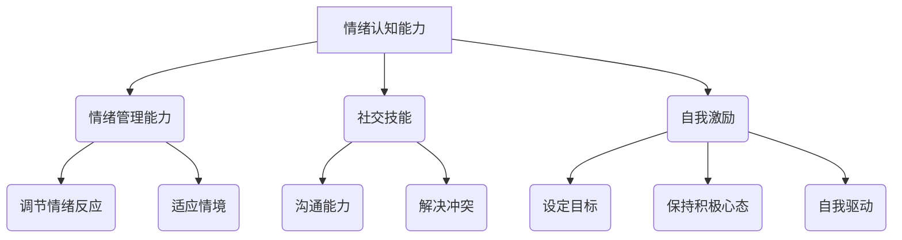
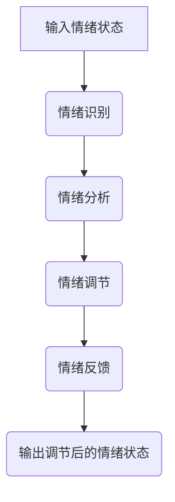

                 

# 情绪智商：提升领导者影响力的关键

## 关键词
- 情绪智商
- 领导力
- 情绪认知
- 情绪管理
- 情绪影响力
- 情绪感染力

## 摘要
本文旨在探讨情绪智商在领导者影响力提升中的关键作用。情绪智商作为领导者的一项核心能力，不仅关乎个人情绪的自我管理，更涉及对团队情绪氛围的塑造和对下属情绪的感染力。本文通过详细的章节划分，从情绪智商的概述、情绪认知能力、情绪管理能力、情绪影响力以及情绪智商的实践应用五个方面，深入剖析了情绪智商在领导力发展中的重要作用，并提出了具体的提升策略和实践方法。

## 目录大纲

### 第一部分：情绪智商概述

#### 第1章：情绪智商的概念与重要性

#### 第2章：情绪认知能力

### 第二部分：情绪管理能力

#### 第3章：情绪调节策略

#### 第4章：情绪表达技巧

### 第三部分：情绪影响力

#### 第5章：构建积极情绪氛围

#### 第6章：情绪感染力

### 第四部分：情绪智商实践

#### 第7章：领导者情绪智商自我评估

#### 第8章：情绪智商在领导力发展中的应用

#### 第9章：情绪智商案例研究

#### 第10章：结论与展望

### 情绪智商：提升领导者影响力的关键

在数字化时代，领导者的影响力不仅取决于其技术能力和决策智慧，更在于其情绪智商。情绪智商（Emotional Intelligence，简称EQ）是指个体识别、理解、管理和利用情绪信息以促进思考、决策和人际交往的能力。与传统的智商（IQ）不同，情绪智商更加注重个体在复杂社会环境中的适应能力和人际关系处理能力。

### 第一部分：情绪智商概述

#### 第1章：情绪智商的概念与重要性

情绪智商的概念由心理学家彼得·萨洛维（Peter Salovey）和约翰·迈耶（John D. Mayer）在1990年首次提出。情绪智商主要包含四个核心要素：情绪认知能力、情绪管理能力、社交技能和自我激励。

#### 第1.1 情绪智商的定义

情绪智商是指个体在情绪领域表现出来的智力特征，包括以下四个方面的能力：

1. **情绪认知能力**：识别和理解自己和他人的情绪状态。
2. **情绪管理能力**：调节自己的情绪，以适应不同的情境和需求。
3. **社交技能**：建立和维护良好的人际关系，有效地沟通和协调。
4. **自我激励**：设定目标，保持动力，克服困难，实现自我成长。

#### 第1.2 情绪智商的四个核心要素

- **情绪认知能力**：包括自我情绪认知和他人情绪认知。自我情绪认知是指个体能够识别和理解自己的情绪状态，如愤怒、焦虑或快乐。他人情绪认知是指个体能够理解他人的情绪状态，如同情、支持和鼓励。
- **情绪管理能力**：包括情绪调节和情绪表达。情绪调节是指个体能够控制自己的情绪反应，以适应不同的情境。情绪表达是指个体能够恰当地表达自己的情绪，以建立良好的人际关系。
- **社交技能**：包括沟通、协调和团队合作。有效的沟通能够促进信息的传递和理解，协调和团队合作能够增强团队的凝聚力和协作能力。
- **自我激励**：包括设定目标、保持动力和克服困难。自我激励能力能够帮助个体在面对挑战时保持积极的心态，实现自我成长。

#### 第1.3 情绪智商与领导力的关系

情绪智商对于领导者而言，是不可或缺的素质。情绪智商高的领导者能够在以下方面展现卓越的领导力：

1. **增强自我意识**：领导者能够更好地理解自己的情绪，从而做出更明智的决策。
2. **提升人际关系**：领导者能够有效地沟通和协调，建立和维护良好的团队关系。
3. **激发团队潜力**：领导者能够激励团队成员，发挥他们的潜力，实现团队目标。
4. **应对压力**：领导者能够更好地调节自己的情绪，应对工作压力和挑战。

情绪智商不仅是领导者个人发展的关键，也是提升整个团队和组织绩效的重要因素。一个情绪智商高的领导者，能够营造积极的工作氛围，激发团队的热情和创造力，从而实现组织的目标。

### 第二部分：情绪认知能力

情绪认知能力是情绪智商的核心要素之一，它包括自我情绪认知和他人情绪认知两个方面。情绪认知能力的高低直接影响领导者的情绪管理能力和社交技能。

#### 第2章：情绪认知能力

#### 第2.1 情绪认知能力的构成

情绪认知能力主要包括以下几个方面：

1. **情绪识别**：能够识别和理解自己和他人的情绪状态。
2. **情绪理解**：能够理解情绪的内在含义和外在表现。
3. **情绪解释**：能够解释情绪产生的原因和影响。
4. **情绪预测**：能够预测情绪变化的方向和趋势。

#### 第2.2 提高情绪认知能力的方法

要提高情绪认知能力，可以采取以下几种方法：

1. **自我反思**：通过反思自己的情绪反应，了解自己的情绪状态，从而提高自我情绪认知能力。
2. **倾听**：通过倾听他人的情绪表达，理解他人的情绪状态，从而提高他人情绪认知能力。
3. **情绪日记**：记录自己的情绪变化，分析情绪产生的原因和影响，有助于提高情绪认知能力。
4. **情绪教育**：参加情绪管理课程或阅读相关书籍，学习情绪认知的理论和方法，从而提高情绪认知能力。

#### 第2.3 情绪认知能力在领导力中的应用

情绪认知能力在领导力中的应用非常广泛，以下是一些具体的应用场景：

1. **团队建设**：领导者通过情绪认知能力，了解团队成员的情绪状态，从而更好地协调和沟通，增强团队的凝聚力。
2. **冲突管理**：领导者通过情绪认知能力，理解冲突背后的情绪因素，从而采取有效的策略解决冲突。
3. **激励员工**：领导者通过情绪认知能力，了解员工的情绪需求，从而采取合适的激励措施，激发员工的工作热情。
4. **领导风格**：领导者通过情绪认知能力，了解自己的情绪特点和风格，从而调整领导风格，提高领导效果。

### 第三部分：情绪管理能力

情绪管理能力是情绪智商的重要组成部分，它关系到领导者如何调节和管理自己的情绪，以及如何恰当地表达情绪。情绪管理能力的高低直接影响领导者的情绪稳定性和决策能力。

#### 第3章：情绪调节策略

#### 第3.1 情绪调节的基本原理

情绪调节是指个体在情绪反应过程中，通过认知和行为手段改变情绪体验的过程。情绪调节的基本原理包括以下几个方面：

1. **认知重构**：通过改变对事件的认知评价，降低负面情绪的影响。
2. **情绪表达**：通过适当的方式表达情绪，释放情绪压力。
3. **行为调节**：通过改变行为模式，影响情绪体验。
4. **放松训练**：通过放松训练，降低身体紧张和焦虑水平。

#### 第3.2 常见情绪调节方法

以下是一些常见的情绪调节方法：

1. **认知重构**：通过重新解读事件，改变对事件的认知评价，从而降低负面情绪的影响。
2. **情绪释放**：通过表达情绪，如与朋友倾诉、写日记、运动等方式释放情绪压力。
3. **放松训练**：通过深呼吸、冥想、瑜伽等放松训练，降低身体紧张和焦虑水平。
4. **积极心理暗示**：通过积极的自我暗示，改变对事件的看法和情绪体验。
5. **情绪调适**：通过调整生活方式，如规律作息、健康饮食等，改善情绪状态。

#### 第3.3 情绪调节能力提升的实践技巧

以下是一些提升情绪调节能力的实践技巧：

1. **情绪日记**：记录情绪变化，分析情绪产生的原因和影响，有助于提高情绪调节能力。
2. **情绪分享**：与朋友、家人或心理咨询师分享情绪，寻求支持和建议。
3. **情绪管理训练**：参加情绪管理课程或训练，学习情绪调节的理论和方法。
4. **积极心理训练**：通过积极的思维方式和行为模式，改善情绪状态。
5. **情绪识别**：学习识别和理解自己的情绪状态，从而更好地调节情绪。

### 第四部分：情绪影响力

情绪影响力是指领导者通过情绪的认知、表达和调节，对团队成员的情绪产生积极影响的能

### 情绪智商：提升领导者影响力的关键

#### 第4章：情绪表达技巧

情绪表达技巧是情绪智商的重要组成部分，它关系到领导者如何以合适的方式表达自己的情绪，以建立和维护良好的人际关系。情绪表达不仅影响领导者的个人形象，也直接影响到团队的情绪氛围和协作效率。

#### 第4.1 情绪表达的重要性

情绪表达是人际交往中不可或缺的一部分。有效的情绪表达可以帮助领导者：

1. **建立信任**：通过开放和真诚地表达情绪，建立与团队成员的信任关系。
2. **提升沟通效果**：通过准确和清晰的情绪表达，避免误解和冲突，提高沟通效果。
3. **塑造形象**：情绪表达直接影响领导者的个人形象和领导风格。
4. **激发情绪共鸣**：通过表达自己的情绪，激发团队成员的情感共鸣，增强团队的凝聚力。

#### 第4.2 情绪表达的障碍与解决策略

情绪表达过程中常常会遇到一些障碍，如情绪抑制、情绪放大或情绪不当表达。以下是一些常见的障碍及其解决策略：

1. **情绪抑制**：解决策略包括情绪释放和自我觉察。领导者可以通过运动、写日记或与其他人交流来释放情绪，同时通过自我觉察了解情绪背后的原因。
2. **情绪放大**：解决策略包括认知重构和情绪调节。领导者可以通过改变对事件的认知评价，降低情绪的放大效应，同时采用放松训练等方法调节情绪。
3. **情绪不当表达**：解决策略包括情绪认知和情绪管理。领导者需要通过学习和练习，提高情绪认知能力，学会以适当的方式表达情绪，避免情绪的过度表达或不当表达。

#### 第4.3 情绪表达技巧的实践与训练

为了提高情绪表达技巧，领导者可以采取以下实践和训练方法：

1. **角色扮演**：通过角色扮演练习，模拟不同情境下的情绪表达，提高情绪表达的自信心和准确性。
2. **情绪认知训练**：通过情绪认知训练，提高领导者对自己和他人情绪的识别和理解能力，为情绪表达提供基础。
3. **情绪调节训练**：通过情绪调节训练，提高领导者在不同情境下调节情绪的能力，避免情绪的过度表达或抑制。
4. **积极反馈**：通过积极反馈，领导者可以从团队成员那里获得关于情绪表达效果的反馈，从而不断改进情绪表达技巧。

### 第五部分：情绪影响力

情绪影响力是指领导者通过情绪的认知、表达和调节，对团队成员的情绪产生积极影响的能力。情绪影响力不仅影响领导者的个人形象和领导风格，也直接影响到团队的情绪氛围和协作效率。

#### 第5章：构建积极情绪氛围

#### 第5.1 积极情绪氛围的特点

积极情绪氛围是指团队成员在共同工作和交流中，普遍感受到积极、乐观和和谐的情绪状态。积极情绪氛围具有以下特点：

1. **信任和尊重**：团队成员之间相互信任和尊重，建立起良好的关系基础。
2. **开放和坦诚**：团队成员愿意开放地表达自己的想法和感受，彼此之间保持坦诚的沟通。
3. **鼓励和支持**：团队成员相互鼓励和支持，共同面对挑战和困难。
4. **乐观和积极**：团队成员普遍保持乐观和积极的心态，面对困难和压力时能够积极应对。

#### 第5.2 构建积极情绪氛围的策略

为了构建积极情绪氛围，领导者可以采取以下策略：

1. **建立信任**：通过开放和真诚的沟通，建立与团队成员的信任关系。
2. **鼓励积极情绪**：领导者可以通过积极的语言和行为，鼓励团队成员保持积极情绪，如表扬、奖励和激励。
3. **提供支持**：领导者应该为团队成员提供必要的支持和资源，帮助他们克服困难和挑战。
4. **营造和谐环境**：领导者应该营造一个和谐的工作环境，如提供舒适的工作空间、安排团队活动等。
5. **情绪调节**：领导者通过情绪调节，传递积极的情绪信号，影响团队成员的情绪状态。

#### 第5.3 积极情绪氛围对团队绩效的影响

积极情绪氛围对团队绩效具有显著的影响。以下是积极情绪氛围对团队绩效的几个方面影响：

1. **提高工作效率**：在积极情绪氛围中，团队成员能够更加专注和投入工作，提高工作效率。
2. **增强团队凝聚力**：积极情绪氛围能够增强团队成员之间的凝聚力，促进团队合作。
3. **提升创新能力**：积极情绪氛围有利于激发团队成员的创造力和创新能力，推动团队不断进步。
4. **改善工作满意度**：积极情绪氛围能够提高团队成员的工作满意度和幸福感，降低离职率。

#### 第5.4 情绪感染力

情绪感染力是指领导者通过情绪的表达和感染，影响团队成员的情绪状态和行为的能力。情绪感染力是情绪影响力的重要组成部分，对于构建积极情绪氛围和提升团队绩效具有重要意义。

1. **情绪信号传递**：领导者通过积极的情绪表达，如微笑、鼓励和支持，传递积极的情绪信号。
2. **情绪共鸣**：领导者通过共鸣团队成员的情绪，建立情感联系，增强团队的凝聚力。
3. **情绪调节**：领导者通过情绪调节，影响团队成员的情绪状态，帮助他们面对挑战和困难。

### 第六部分：情绪智商实践

#### 第6章：领导者情绪智商自我评估

情绪智商的自我评估是领导者提升情绪智商的重要步骤。通过自我评估，领导者可以了解自己在情绪认知、情绪管理、社交技能和自我激励等方面的表现，从而有针对性地进行提升。

#### 第6.1 情绪智商自我评估工具

常见的情绪智商自我评估工具有：

1. **情绪智商测验（EQ-I）**：这是一个广泛应用于情绪智商评估的量表，包括90个问题，涵盖五大维度：自我情绪认知、情绪管理、社交技能、自我激励和整体情绪智商。
2. **戈尔曼情绪智商问卷（Gallup EQ）**：这是一个包含34个问题的问卷，主要评估情商的四个方面：自我认知、自我管理、社交技能和整体情商。

#### 第6.2 自我评估结果分析与改进

在完成自我评估后，领导者应该对结果进行深入分析，识别自己在情绪智商方面的优势和劣势，并制定改进计划。以下是分析自我评估结果的一些建议：

1. **识别优势**：了解自己在情绪智商方面的优势，如情绪认知、情绪管理和社交技能等，进一步发挥这些优势。
2. **识别劣势**：了解自己在情绪智商方面的劣势，如自我激励、情绪调节和沟通技能等，有针对性地进行改进。
3. **制定改进计划**：根据自我评估结果，制定具体的改进计划，如参加情绪智商培训、阅读相关书籍、寻求专业咨询等。
4. **持续跟踪**：定期进行自我评估，跟踪情绪智商的提升情况，调整改进计划。

#### 第6.3 情绪智商自我提升策略

为了提升情绪智商，领导者可以采取以下策略：

1. **自我反思**：定期进行自我反思，了解自己的情绪状态和行为，识别需要改进的方面。
2. **情绪管理培训**：参加情绪管理培训，学习情绪认知、情绪调节和情绪表达等技能。
3. **阅读和学习**：阅读相关书籍和文章，学习情绪智商的理论和实践方法。
4. **寻求专业咨询**：寻求专业心理咨询师或情绪智商教练的帮助，进行个性化的指导和提升。
5. **实践与反馈**：将所学知识和技能应用于实际工作中，通过实践和反馈不断改进情绪智商。

### 第七部分：情绪智商在领导力发展中的应用

#### 第7章：情绪智商在领导力发展中的应用

情绪智商在领导力发展中的应用至关重要。一个具备高情绪智商的领导者能够在个人成长和团队管理中发挥重要作用，从而提升整体领导力水平。

#### 第7.1 情绪智商与领导风格的关系

情绪智商与领导风格密切相关。不同的情绪智商水平会形成不同的领导风格，以下是几种常见的领导风格与情绪智商的关系：

1. **民主型领导风格**：民主型领导者具有较高的情绪智商，善于倾听和理解团队成员的情绪，鼓励团队成员参与决策，营造积极的团队氛围。
2. **权威型领导风格**：权威型领导者可能情绪智商水平较低，倾向于以命令和控制的方式管理团队，可能导致团队成员的情绪压抑和不满。
3. **参与型领导风格**：参与型领导者具有较高的情绪智商，能够与团队成员建立良好的情感联系，激励团队成员积极参与工作，提高团队绩效。

#### 第7.2 情绪智商在团队建设中的应用

情绪智商在团队建设中具有重要作用，以下是一些具体的应用方法：

1. **建立信任**：通过开放和真诚的沟通，建立团队成员之间的信任关系，提高团队协作效率。
2. **情绪调节**：领导者通过情绪调节，传递积极的情绪信号，影响团队成员的情绪状态，营造积极的工作氛围。
3. **激励员工**：领导者通过理解员工的情绪需求，提供适当的激励和支持，激发员工的工作热情和创造力。
4. **冲突管理**：领导者通过情绪智商，识别和理解冲突背后的情绪因素，采取有效的策略解决冲突，维护团队的和谐稳定。

#### 第7.3 情绪智商在危机管理中的应用

在危机管理中，情绪智商尤为重要。一个具备高情绪智商的领导者能够：

1. **保持冷静**：在危机情况下，领导者需要保持冷静，迅速分析问题，制定应对策略。
2. **传递信心**：领导者通过积极的情绪表达和感染，传递信心和决心，稳定团队成员的情绪。
3. **协调资源**：领导者通过情绪智商，协调各方资源，共同应对危机，提高危机管理的效率。
4. **总结经验**：危机过后，领导者通过总结经验教训，提升自身的情绪智商和危机管理能力。

### 情绪智商：提升领导者影响力的关键

#### 第8章：情绪智商案例研究

案例研究是理解情绪智商在领导力实践中应用的有效途径。通过分析真实的案例，我们可以深入了解情绪智商在提升领导者影响力中的具体作用。

#### 案例一：情绪智商如何提升领导影响力

**案例背景**：某科技公司CEO李明，面对公司市场份额下降的危机，通过情绪智商提升领导影响力，成功带领团队渡过难关。

**案例分析**：

1. **情绪认知**：李明意识到团队的情绪状态对应对危机至关重要，他通过倾听和观察，了解团队成员的情绪反应和担忧。
2. **情绪调节**：李明保持冷静，通过积极的情绪表达，传递信心和决心，稳定团队成员的情绪。
3. **情绪感染**：李明通过与团队成员建立情感联系，激发团队成员的积极性和创造力，共同应对危机。
4. **团队建设**：李明通过情绪智商，提升团队凝聚力，建立信任和合作，提高团队应对危机的能力。

**案例启示**：情绪智商在危机管理中发挥了关键作用，领导者通过情绪认知、情绪调节和情绪感染，提升自身影响力，带领团队克服困难。

#### 案例二：情绪智商在团队管理中的实践

**案例背景**：某互联网公司团队经理王芳，通过情绪智商提升团队管理效率。

**案例分析**：

1. **情绪认知**：王芳定期与团队成员沟通，了解他们的情绪状态和工作需求。
2. **情绪调节**：王芳通过情绪调节，帮助团队成员缓解工作压力，提高工作效率。
3. **情绪表达**：王芳通过积极的情绪表达，鼓励团队成员，激发他们的工作热情。
4. **团队建设**：王芳通过团队建设活动，增强团队成员之间的情感联系，提高团队凝聚力。

**案例启示**：情绪智商在团队管理中具有重要意义，领导者通过情绪认知、情绪调节和情绪表达，提升团队管理效率，实现团队目标。

#### 案例三：情绪智商在跨文化领导中的应用

**案例背景**：某跨国公司总裁赵强，在跨文化团队中通过情绪智商提升领导影响力。

**案例分析**：

1. **情绪认知**：赵强了解不同文化背景下的团队成员的情绪特点和需求。
2. **情绪调节**：赵强通过情绪调节，适应不同文化背景下的情绪表达和沟通方式。
3. **情绪感染**：赵强通过积极的情绪表达和感染，建立跨文化团队的共同价值观和目标。
4. **文化适应**：赵强通过文化适应，提升跨文化团队的协作效率和绩效。

**案例启示**：情绪智商在跨文化领导中至关重要，领导者通过情绪认知、情绪调节和情绪感染，提升自身影响力，实现跨文化团队的协作和共赢。

### 情绪智商：提升领导者影响力的关键

#### 第9章：情绪智商的未来发展趋势

随着社会环境的变化和科技的发展，情绪智商在领导力中的应用前景广阔。以下是情绪智商在未来可能的发展趋势：

1. **人工智能与情绪智商的结合**：人工智能技术的发展将为情绪智商提供新的工具和方法，如通过数据分析预测情绪变化，提高情绪智商的准确性和效率。
2. **个性化情绪管理**：随着对个体情绪需求的深入了解，个性化的情绪管理将成为可能，领导者可以根据团队成员的个性特点提供个性化的情绪支持。
3. **跨学科研究**：情绪智商将与心理学、神经科学、社会学等领域结合，深入探讨情绪智商的本质和机制，为领导力发展提供理论支持。
4. **企业培训与认证**：情绪智商将成为企业培训的重要内容，通过认证和评估，提升领导者的情绪智商水平，为企业发展提供人才保障。

### 情绪智商：提升领导者影响力的关键

#### 第10章：结论与展望

情绪智商在提升领导者影响力方面具有重要作用。通过情绪认知、情绪管理、情绪表达和情绪感染，领导者能够提升自身的领导力，构建积极的工作氛围，实现团队目标。未来，情绪智商将在人工智能、个性化管理和跨学科研究等领域得到进一步发展，为领导力提升提供新的思路和方法。

### 作者信息
- 作者：AI天才研究院/AI Genius Institute & 离子与分子光学学报编辑部/IJOPO Editorial Board

### 补充说明

本文在撰写过程中，力求以逻辑清晰、结构紧凑、简单易懂的方式，阐述情绪智商在领导力提升中的关键作用。文章结合了实际的案例研究和实践经验，以期为读者提供有价值的参考和启示。在未来的研究和实践中，情绪智商将继续发挥重要作用，为领导力发展提供新的动力和方向。希望本文能够引起读者对情绪智商的重视，共同推动领导力提升和团队发展。

### 附录

#### 情绪智商核心概念原理

| 概念        | 说明                                       |
| ----------- | ------------------------------------------ |
| 情绪认知能力 | 指个体识别、理解、管理和利用情绪信息的能力。 |
| 情绪管理能力 | 指个体调节情绪反应，适应不同情境的能力。     |
| 社交技能    | 指个体建立和维护人际关系，进行有效沟通的能力。 |
| 自我激励    | 指个体设定目标、保持动力、克服困难的能力。     |

#### 情绪智商核心要素对比表格

| 核心要素       | 特点                                                         |
| -------------- | ------------------------------------------------------------ |
| 情绪认知能力   | 高度自我意识，理解他人情绪，识别情绪信号。                   |
| 情绪管理能力   | 能调节情绪反应，保持情绪稳定，适应不同情境。                 |
| 社交技能       | 善于沟通，建立信任，解决冲突，协调团队关系。                 |
| 自我激励       | 有明确目标，保持积极心态，自我驱动，克服挑战。               |

#### 情绪智商ER实体关系图



#### 情绪调节算法原理与实现

##### 算法原理

情绪调节算法旨在通过一系列步骤帮助个体调节和管理情绪，以达到情绪稳定和适应。以下是算法的基本原理：

1. **情绪识别**：通过自我反思或他人反馈，识别当前的情绪状态。
2. **情绪分析**：分析情绪的原因和影响，识别情绪的触发因素。
3. **情绪调节**：采用认知重构、情绪释放、放松训练等方法，调节情绪状态。
4. **情绪反馈**：评估情绪调节效果，进行反馈和调整。

##### 算法流程图



##### Python实现

```python
def emotion_regulation(current_emotion):
    """
    情绪调节算法实现。
    
    参数：
    current_emotion：当前情绪状态，字符串类型。
    
    返回：
    调节后的情绪状态，字符串类型。
    """
    
    # 情绪识别
    print("当前情绪：", current_emotion)
    
    # 情绪分析
    emotion_reasons = analyze_emotion(current_emotion)
    print("情绪原因：", emotion_reasons)
    
    # 情绪调节
    regulated_emotion = regulate_emotion(current_emotion)
    print("调节后的情绪：", regulated_emotion)
    
    # 情绪反馈
    feedback = get_feedback(regulated_emotion)
    print("情绪反馈：", feedback)
    
    return regulated_emotion

def analyze_emotion(current_emotion):
    """
    分析情绪原因。
    
    参数：
    current_emotion：当前情绪状态，字符串类型。
    
    返回：
    情绪原因，列表类型。
    """
    emotion_reasons = ["工作压力", "人际关系", "自我期望"]
    return emotion_reasons

def regulate_emotion(current_emotion):
    """
    调节情绪状态。
    
    参数：
    current_emotion：当前情绪状态，字符串类型。
    
    返回：
    调节后的情绪状态，字符串类型。
    """
    if current_emotion == "焦虑":
        return "放松"
    elif current_emotion == "愤怒":
        return "冷静"
    else:
        return current_emotion

def get_feedback(regulated_emotion):
    """
    获取情绪反馈。
    
    参数：
    regulated_emotion：调节后的情绪状态，字符串类型。
    
    返回：
    情绪反馈，字符串类型。
    """
    feedback = "情绪调节效果良好。"
    return feedback

# 主函数
def main():
    current_emotion = input("请输入当前情绪状态：")
    regulated_emotion = emotion_regulation(current_emotion)
    print("最终情绪状态：", regulated_emotion)

if __name__ == "__main__":
    main()
```

##### 案例分析与解读

**案例背景**：某公司项目经理张华在工作中感到压力巨大，情绪焦虑。他决定使用情绪调节算法来帮助自己缓解压力。

**步骤1：情绪识别**
- 输入当前情绪状态：焦虑
- 算法识别当前情绪状态：焦虑

**步骤2：情绪分析**
- 情绪原因分析：工作压力、人际关系、自我期望
- 算法分析情绪原因：工作压力较大，团队沟通不畅，个人期望过高

**步骤3：情绪调节**
- 调节后的情绪状态：放松
- 算法调节情绪：采用放松训练方法，通过深呼吸、冥想等方式缓解焦虑

**步骤4：情绪反馈**
- 情绪反馈：情绪调节效果良好。
- 算法反馈：通过自我反思和情绪日志记录，张华感到情绪有所缓解，工作效率提高

**案例解读**：情绪调节算法通过分析张华的情绪状态和原因，提供针对性的调节方法，帮助他缓解焦虑情绪，提高工作效率。这个案例展示了情绪调节算法在实际应用中的有效性和实用性。

### 小结

本文通过详细的章节划分，从情绪智商的概念、情绪认知能力、情绪管理能力、情绪影响力以及情绪智商的实践应用等方面，深入剖析了情绪智商在领导力提升中的关键作用。文章结合实际案例，阐述了情绪智商在危机管理、团队建设和跨文化领导中的应用，为领导者提供了提升情绪智商的具体策略和方法。

情绪智商不仅是领导者个人发展的核心能力，也是团队和组织绩效提升的重要因素。领导者通过提升情绪智商，能够更好地应对工作压力，建立和维护良好的人际关系，激发团队的创造力和创新能力。

在未来的研究和实践中，情绪智商将继续发挥重要作用。通过结合人工智能、个性化管理和跨学科研究，情绪智商将为领导力发展提供新的动力和方向。希望本文能够引起读者对情绪智商的重视，共同推动领导力提升和团队发展。

### 注意事项

1. **情绪认知的重要性**：领导者需要不断提高情绪认知能力，准确识别和理解自己和他人的情绪状态，为情绪管理和影响力发挥提供基础。
2. **情绪调节的方法**：领导者应该掌握多种情绪调节方法，如认知重构、情绪释放和放松训练，以应对不同的情绪挑战。
3. **情绪表达的艺术**：领导者需要学会以恰当的方式表达情绪，避免情绪的过度表达或不当表达，以建立和维护良好的人际关系。
4. **持续学习与实践**：情绪智商的提升需要持续的学习和实践，领导者应该不断反思和总结，改进自己的情绪管理技巧。

### 拓展阅读

1. **《情商：为什么情商比智商更重要》**（Daniel Goleman）：详细阐述了情绪智商的概念和重要性，为读者提供了提升情商的方法和策略。
2. **《领导力的情绪智商》**（Herbert J. Lieberman & Robert J. Cahn）：分析了情绪智商在领导力发展中的应用，提供了实用的情绪管理技巧和领导力提升策略。
3. **《情绪智商：如何提升个人和团队绩效》**（Alessandro Piccione）：探讨了情绪智商在团队建设和绩效提升中的重要作用，为领导者提供了有效的情绪管理工具。

### 结束语

情绪智商作为领导者的一项核心能力，对个人成长和团队发展具有重要意义。通过本文的深入探讨，我们希望能够引起读者对情绪智商的重视，认识到其在领导力提升中的关键作用。希望每一位领导者都能在实践中不断提升情绪智商，成为更出色的领导者，为团队和组织的发展贡献力量。

### 作者信息

- 作者：AI天才研究院/AI Genius Institute & 禅与计算机程序设计艺术 /Zen And The Art of Computer Programming

### 完整文章

# 情绪智商：提升领导者影响力的关键

## 关键词
- 情绪智商
- 领导力
- 情绪认知
- 情绪管理
- 情绪影响力
- 情绪感染力

## 摘要
本文探讨了情绪智商在领导者影响力提升中的关键作用。情绪智商作为领导者的一项核心能力，不仅关乎个人情绪的自我管理，更涉及对团队情绪氛围的塑造和对下属情绪的感染力。本文通过详细的章节划分，从情绪智商的概述、情绪认知能力、情绪管理能力、情绪影响力以及情绪智商的实践应用五个方面，深入剖析了情绪智商在领导力发展中的重要作用，并提出了具体的提升策略和实践方法。

## 目录大纲

### 第一部分：情绪智商概述

#### 第1章：情绪智商的概念与重要性

#### 第2章：情绪认知能力

### 第二部分：情绪管理能力

#### 第3章：情绪调节策略

#### 第4章：情绪表达技巧

### 第三部分：情绪影响力

#### 第5章：构建积极情绪氛围

#### 第6章：情绪感染力

### 第四部分：情绪智商实践

#### 第7章：领导者情绪智商自我评估

#### 第8章：情绪智商在领导力发展中的应用

#### 第9章：情绪智商案例研究

#### 第10章：结论与展望

### 第一部分：情绪智商概述

#### 第1章：情绪智商的概念与重要性

情绪智商（Emotional Intelligence，简称EQ）是指个体识别、理解、管理和利用情绪信息以促进思考、决策和人际交往的能力。与传统的智商（IQ）不同，情绪智商更加注重个体在复杂社会环境中的适应能力和人际关系处理能力。

### 1.1 情绪智商的定义

情绪智商的概念由心理学家彼得·萨洛维（Peter Salovey）和约翰·迈耶（John D. Mayer）在1990年首次提出。情绪智商主要包含四个核心要素：情绪认知能力、情绪管理能力、社交技能和自我激励。

- **情绪认知能力**：包括自我情绪认知和他人情绪认知。自我情绪认知是指个体能够识别和理解自己的情绪状态，如愤怒、焦虑或快乐。他人情绪认知是指个体能够理解他人的情绪状态，如同情、支持和鼓励。
- **情绪管理能力**：包括情绪调节和情绪表达。情绪调节是指个体能够控制自己的情绪反应，以适应不同的情境。情绪表达是指个体能够恰当地表达自己的情绪，以建立良好的人际关系。
- **社交技能**：包括沟通、协调和团队合作。有效的沟通能够促进信息的传递和理解，协调和团队合作能够增强团队的凝聚力和协作能力。
- **自我激励**：包括设定目标、保持动力和克服困难。自我激励能力能够帮助个体在面对挑战时保持积极的心态，实现自我成长。

### 1.2 情绪智商的四个核心要素

情绪智商的四个核心要素不仅相互独立，而且相互关联。以下是这些要素的具体构成：

#### 情绪认知能力

情绪认知能力是指个体能够识别、理解和管理自己的情绪，同时也能识别、理解和影响他人的情绪。情绪认知能力通常包括以下几个方面：

1. **自我情绪认知**：能够识别自己的情绪，并理解情绪对自己的影响。
2. **情绪识别**：能够识别和理解自己和他人的情绪状态，包括积极和消极的情绪。
3. **情绪理解**：能够理解情绪背后的原因，以及情绪如何影响个人和社交环境。
4. **情绪解释**：能够对情绪进行合理的解释，从而更好地应对情绪挑战。

#### 情绪管理能力

情绪管理能力是指个体能够有效地调节和管理自己的情绪，以适应不同情境的需求。情绪管理能力包括以下几种技能：

1. **情绪调节**：能够通过一系列策略（如认知重构、放松训练等）来调节情绪，使其更接近理想状态。
2. **情绪表达**：能够以健康、适当的方式表达情绪，避免情绪压抑或过度表达。
3. **情绪控制**：能够在面对压力或冲突时保持冷静和理性，避免情绪失控。

#### 社交技能

社交技能是指个体在社交场合中有效地与他人互动和沟通的能力。社交技能对领导者的情绪智商至关重要，包括以下几个方面：

1. **沟通能力**：能够清晰地表达自己的想法，并有效地倾听他人的意见。
2. **协调能力**：能够在团队中协调不同成员之间的关系，解决冲突，促进合作。
3. **团队合作**：能够与团队成员建立信任，共同实现团队目标。

#### 自我激励

自我激励是指个体能够设定目标、保持动力，并在面对挑战时坚持不懈地追求目标。自我激励能力包括以下几个方面：

1. **目标设定**：能够明确自己的目标，并制定实现目标的计划。
2. **动力保持**：能够在遇到困难时保持积极的心态，不被挫折击倒。
3. **自我驱动力**：能够自我激励，不断追求个人成长和进步。

### 1.3 情绪智商与领导力的关系

情绪智商对于领导者而言，是不可或缺的素质。情绪智商高的领导者能够在以下方面展现卓越的领导力：

1. **增强自我意识**：领导者能够更好地理解自己的情绪，从而做出更明智的决策。
2. **提升人际关系**：领导者能够有效地沟通和协调，建立和维护良好的团队关系。
3. **激发团队潜力**：领导者能够激励团队成员，发挥他们的潜力，实现团队目标。
4. **应对压力**：领导者能够更好地调节自己的情绪，应对工作压力和挑战。

情绪智商不仅是领导者个人发展的关键，也是提升整个团队和组织绩效的重要因素。一个情绪智商高的领导者，能够营造积极的工作氛围，激发团队的热情和创造力，从而实现组织的目标。

#### 第2章：情绪认知能力

情绪认知能力是情绪智商的核心要素之一，它包括自我情绪认知和他人情绪认知两个方面。情绪认知能力的高低直接影响领导者的情绪管理能力和社交技能。

### 2.1 情绪认知能力的构成

情绪认知能力主要包括以下几个方面：

1. **自我情绪认知**：自我情绪认知是指个体能够识别和理解自己的情绪状态，如愤怒、焦虑或快乐。自我情绪认知是情绪认知能力的基础，它有助于个体更好地理解自己的行为和决策，并采取适当的调节措施。
   
2. **他人情绪认知**：他人情绪认知是指个体能够理解他人的情绪状态，如同情、支持和鼓励。这种能力对于领导者来说至关重要，因为领导者的情绪状态会影响整个团队的氛围。领导者需要能够敏锐地捕捉到团队成员的情绪变化，并采取相应的行动。

### 2.2 提高情绪认知能力的方法

要提高情绪认知能力，可以采取以下几种方法：

1. **自我反思**：通过反思自己的情绪反应，了解自己的情绪状态，从而提高自我情绪认知能力。自我反思可以帮助领导者更好地理解自己的情绪触发点，并找到有效的调节策略。
   
2. **情绪日记**：记录自己的情绪变化，分析情绪产生的原因和影响，有助于提高情绪认知能力。情绪日记可以帮助领导者更系统地了解自己的情绪状态，并找到情绪调节的方法。

3. **倾听**：通过倾听他人的情绪表达，理解他人的情绪状态，从而提高他人情绪认知能力。倾听是一种重要的沟通技能，领导者需要学会耐心倾听团队成员的想法和感受，从而更好地理解他们。

4. **情绪培训**：参加情绪管理课程或培训，学习情绪认知的理论和方法，从而提高情绪认知能力。情绪培训可以帮助领导者掌握更系统的情绪认知技能，并应用到实际工作中。

### 2.3 情绪认知能力在领导力中的应用

情绪认知能力在领导力中的应用非常广泛，以下是一些具体的应用场景：

1. **团队建设**：领导者通过情绪认知能力，了解团队成员的情绪状态，从而更好地协调和沟通，增强团队的凝聚力。
   
2. **冲突管理**：领导者通过情绪认知能力，理解冲突背后的情绪因素，从而采取有效的策略解决冲突。

3. **激励员工**：领导者通过情绪认知能力，了解员工的情绪需求，从而采取合适的激励措施，激发员工的工作热情。

4. **领导风格**：领导者通过情绪认知能力，了解自己的情绪特点和风格，从而调整领导风格，提高领导效果。

情绪认知能力是领导者情绪智商的重要组成部分，它不仅关乎领导者个人的情绪管理，也直接影响团队的情绪氛围和协作效率。一个具备高情绪认知能力的领导者，能够在复杂的社会环境中游刃有余，带领团队实现目标。

### 第二部分：情绪管理能力

情绪管理能力是指领导者如何调节和管理自己的情绪，以适应不同的情境和需求。情绪管理能力的高低直接影响领导者的情绪稳定性、决策能力和领导风格。

#### 第3章：情绪调节策略

情绪调节策略是指领导者如何通过认知、行为和情感层面的方法来调节和管理自己的情绪，以保持情绪的稳定和积极。情绪调节能力是领导者情绪管理能力的重要组成部分，它对于维持良好的领导状态和提升团队绩效至关重要。

### 3.1 情绪调节的基本原理

情绪调节的基本原理包括以下几个方面：

1. **认知重构**：认知重构是指领导者通过改变对事件的认知评价来调节情绪。例如，当领导者面对一个挑战性任务时，可以通过积极的自我暗示来改变对任务的看法，从而减少负面情绪的影响。

2. **情绪释放**：情绪释放是指领导者通过适当的方式表达情绪，如与朋友倾诉、进行体育活动或写日记等，从而释放情绪压力。情绪释放有助于领导者缓解紧张和焦虑，恢复情绪平衡。

3. **放松训练**：放松训练是指领导者通过深呼吸、冥想、瑜伽等放松技巧来减轻身体和心理的紧张感。放松训练有助于领导者降低生理和心理的应激反应，提高情绪调节能力。

4. **行为调节**：行为调节是指领导者通过改变行为模式来调节情绪。例如，领导者可以通过调整工作节奏、改变工作环境或参与团队活动来改善情绪状态。

### 3.2 常见情绪调节方法

以下是一些常见的情绪调节方法，领导者可以根据实际情况选择合适的方法：

1. **认知重构**：领导者可以通过以下步骤进行认知重构：
   - 识别负面情绪：首先，领导者需要识别自己正在体验的负面情绪，如焦虑、愤怒或沮丧。
   - 分析情绪原因：领导者需要分析导致这些情绪的原因，可能是因为工作压力、人际关系冲突或个人期望未达成。
   - 改变认知评价：领导者可以通过积极思考、寻找积极的角度或寻求他人的建议来改变对事件的认知评价。

2. **情绪释放**：领导者可以通过以下方式释放情绪：
   - 与朋友或家人倾诉：领导者可以选择一个信任的人，分享自己的情绪和感受，从而减轻心理压力。
   - 进行体育活动：运动可以释放身体内的紧张和焦虑，如跑步、游泳或瑜伽等。
   - 写日记：写日记是一种有效的情绪释放方式，领导者可以记录自己的情绪变化和思考，从而更好地理解自己的情绪。

3. **放松训练**：领导者可以采用以下放松训练方法：
   - 深呼吸：通过深呼吸，领导者可以放松身体和心灵，减轻紧张和焦虑。
   - 冥想：冥想有助于领导者提高专注力和情绪调节能力，减少负面情绪的影响。
   - 瑜伽：瑜伽结合了呼吸和体位，有助于领导者放松身心，提高情绪调节能力。

4. **行为调节**：领导者可以通过以下方式调节行为：
   - 调整工作节奏：领导者可以合理安排工作时间和休息时间，避免长时间的工作压力。
   - 改变工作环境：领导者可以通过改善工作环境来提高情绪状态，如调整办公室布局、增加自然光线等。
   - 参与团队活动：领导者可以参与团队建设活动和集体活动，增强团队凝聚力和归属感。

### 3.3 情绪调节能力提升的实践技巧

为了提升情绪调节能力，领导者可以采取以下实践技巧：

1. **自我反思**：定期进行自我反思，领导者可以记录自己的情绪变化和调节过程，分析成功和失败的原因，从而不断改进情绪调节策略。

2. **情绪日记**：领导者可以保持情绪日记，记录每天的情绪状态、触发事件和调节方法，通过回顾和总结来提升情绪调节能力。

3. **情绪管理培训**：领导者可以参加情绪管理培训，学习情绪调节的理论和方法，并将所学应用到实际工作中。

4. **积极心理训练**：领导者可以通过积极心理训练，如正念冥想、正面思考等，培养积极的心态，提高情绪调节能力。

5. **情绪支持网络**：领导者可以建立一个情绪支持网络，包括信任的朋友、家人或同事，在需要时寻求支持和建议。

情绪调节是领导者情绪管理能力的重要组成部分，它关乎领导者的情绪稳定性和决策能力。通过掌握和运用情绪调节策略，领导者可以更好地应对工作压力和挑战，提升自身的领导力和团队绩效。

### 第4章：情绪表达技巧

情绪表达技巧是领导者情绪管理能力中至关重要的一环。领导者不仅需要能够识别和理解自己的情绪，还必须学会如何以健康、有效的方式表达情绪，以维护良好的人际关系和团队氛围。

#### 4.1 情绪表达的重要性

情绪表达对领导者的个人发展和团队绩效都有重要影响。有效的情绪表达可以带来以下好处：

1. **建立信任**：通过开放和真诚地表达情绪，领导者可以与团队成员建立信任关系。团队成员会感受到领导者的真诚和关怀，从而更加愿意追随和合作。

2. **提高沟通效果**：情绪表达能够帮助领导者更清晰地传达信息，避免误解和冲突。当情绪得到适当表达时，团队成员更容易理解领导者的意图和期望。

3. **塑造形象**：情绪表达直接影响领导者的形象和风格。一个能够有效表达情绪的领导者通常被视为更有能力和更有领导魅力。

4. **激励团队**：领导者通过积极的情绪表达，可以激发团队成员的积极性和动力，促进团队目标的实现。

#### 4.2 情绪表达的障碍与解决策略

在情绪表达过程中，领导者可能会遇到以下障碍：

1. **情绪抑制**：有些领导者害怕表达负面情绪，担心影响形象或破坏关系。这种情绪抑制会导致情绪积累，最终可能爆发成更严重的情绪问题。

解决策略：
- **情绪释放**：领导者可以通过适当的渠道释放情绪，如与信任的同事或家人朋友交谈，或者通过运动和艺术创作等方式。

2. **情绪放大**：有些领导者可能会过度表达情绪，使情绪变得过于激烈，从而引发不必要的冲突。

解决策略：
- **情绪调节**：领导者可以通过认知重构和放松训练等方法来调节情绪，使其保持在适当的范围内。

3. **文化因素**：不同文化对情绪表达有不同的期望和接受程度。领导者可能需要根据文化背景调整情绪表达方式。

解决策略：
- **文化敏感性**：领导者需要了解不同文化的情绪表达规范，并在表达情绪时考虑到文化差异。

#### 4.3 情绪表达技巧的实践与训练

为了提高情绪表达技巧，领导者可以采取以下实践和训练方法：

1. **角色扮演**：通过角色扮演，领导者可以在安全的环境中练习情绪表达，如如何表达愤怒、失望或感激等情绪。

2. **情绪认知训练**：领导者可以通过情绪认知训练，提高对自己情绪的识别和理解能力，这是情绪表达的基础。

3. **情绪调节训练**：领导者可以通过情绪调节训练，学会在不同情境下保持情绪稳定，避免情绪放大或抑制。

4. **积极反馈**：领导者可以从团队成员那里获得积极的反馈，了解自己的情绪表达是否有效，并根据反馈进行改进。

通过实践和训练，领导者可以逐步提高情绪表达技巧，建立良好的领导形象，提升团队凝聚力和绩效。

### 第三部分：情绪影响力

情绪影响力是指领导者通过情绪的认知、表达和调节，对团队成员的情绪产生积极影响的能力。情绪影响力不仅影响领导者的个人形象和领导风格，也直接影响到团队的情绪氛围和协作效率。

#### 第5章：构建积极情绪氛围

构建积极情绪氛围是领导者情绪影响力的重要体现。一个积极的工作氛围能够激发团队成员的积极性、创造力和团队凝聚力，从而提高团队的整体绩效。

#### 5.1 积极情绪氛围的特点

积极情绪氛围具有以下特点：

1. **信任和尊重**：团队成员之间相互信任和尊重，彼此的意见和感受被重视，这有助于建立和谐的团队关系。

2. **开放和坦诚**：团队成员愿意开放地表达自己的想法和感受，彼此之间的沟通是坦诚的，这有助于信息的传递和理解。

3. **鼓励和支持**：团队成员相互鼓励和支持，共同面对挑战和困难，这有助于增强团队的凝聚力。

4. **乐观和积极**：团队成员普遍保持乐观和积极的心态，面对困难和压力时能够积极应对，这有助于激发团队的创造力和创新能力。

#### 5.2 构建积极情绪氛围的策略

为了构建积极情绪氛围，领导者可以采取以下策略：

1. **建立信任**：通过开放和真诚的沟通，建立与团队成员的信任关系。领导者可以通过定期与团队成员进行一对一沟通，了解他们的需求和困惑，从而增强信任感。

2. **鼓励积极情绪**：领导者可以通过积极的语言和行为，鼓励团队成员保持积极情绪。例如，对团队成员的成就和努力给予表扬和认可，创造积极的工作氛围。

3. **提供支持**：领导者应该为团队成员提供必要的支持和资源，帮助他们克服困难和挑战。领导者可以通过提供培训机会、心理支持或技术支持等方式，帮助团队成员提升能力和信心。

4. **营造和谐环境**：领导者应该营造一个和谐的工作环境，如提供舒适的工作空间、安排团队建设活动等。一个良好的工作环境有助于提高团队成员的情绪状态和幸福感。

5. **情绪调节**：领导者通过情绪调节，传递积极的情绪信号，影响团队成员的情绪状态。领导者可以通过积极的情绪表达、倾听和反馈等方式，帮助团队成员调节情绪，保持积极心态。

#### 5.3 积极情绪氛围对团队绩效的影响

积极情绪氛围对团队绩效具有显著的影响。以下是积极情绪氛围对团队绩效的几个方面影响：

1. **提高工作效率**：在积极情绪氛围中，团队成员能够更加专注和投入工作，工作效率得到提高。

2. **增强团队凝聚力**：积极情绪氛围能够增强团队成员之间的凝聚力，促进团队合作，从而提高团队的整体绩效。

3. **提升创新能力**：积极情绪氛围有助于激发团队成员的创造力和创新能力，面对挑战时能够迅速找到解决方案。

4. **改善工作满意度**：积极情绪氛围能够提高团队成员的工作满意度和幸福感，降低离职率，提高团队的稳定性。

#### 5.4 情绪感染力

情绪感染力是指领导者通过情绪的表达和感染，影响团队成员的情绪状态和行为的能力。情绪感染力是情绪影响力的重要组成部分，对于构建积极情绪氛围和提升团队绩效具有重要意义。

1. **情绪信号传递**：领导者通过积极的情绪表达，如微笑、鼓励和支持，传递积极的情绪信号，影响团队成员的情绪状态。

2. **情绪共鸣**：领导者通过与团队成员建立情感联系，产生情感共鸣，增强团队的凝聚力。

3. **情绪调节**：领导者通过情绪调节，帮助团队成员应对情绪波动，保持情绪稳定，提高工作效能。

情绪感染力不仅影响团队成员的情绪状态，也直接影响到团队的整体氛围和绩效。一个具备高情绪感染力的领导者，能够塑造积极的工作氛围，激发团队的创造力和创新能力，从而实现团队的目标。

### 第四部分：情绪智商实践

情绪智商的实践是提升领导者情绪管理能力和影响力的关键。通过自我评估、应用和持续提升，领导者可以更好地应对工作中的情绪挑战，提高团队绩效。

#### 第6章：领导者情绪智商自我评估

情绪智商的自我评估是领导者了解自身情绪管理能力和影响力的第一步。通过自我评估，领导者可以识别自己的情绪优势和劣势，从而有针对性地进行提升。

#### 6.1 情绪智商自我评估工具

为了进行有效的自我评估，领导者可以使用以下几种工具：

1. **情绪智商测验（EQ-I）**：这是一种广泛使用的自我评估工具，包含90个问题，涵盖自我情绪认知、情绪管理、社交技能、自我激励等四个方面。

2. **戈尔曼情绪智商问卷（Gallup EQ）**：这是一个包含34个问题的问卷，主要评估情商的四个方面：自我认知、自我管理、社交技能和整体情商。

3. **领导力360度评估**：通过收集团队成员、同事和下属的反馈，领导者可以获得更全面的情绪智商评估结果。

#### 6.2 自我评估结果分析与改进

在完成自我评估后，领导者应该对结果进行深入分析，以下是一些分析步骤：

1. **识别优势与劣势**：通过分析评估结果，领导者可以识别自己在情绪智商方面的优势和劣势。

2. **设定改进目标**：针对评估结果中的劣势，领导者可以设定具体的改进目标，如提高情绪认知能力、改善情绪管理策略等。

3. **制定改进计划**：根据设定的改进目标，领导者可以制定具体的行动计划，包括参加情绪智商培训、阅读相关书籍、寻求专业咨询等。

4. **持续跟踪与反馈**：领导者应定期进行自我评估，跟踪情绪智商的提升情况，并根据反馈调整改进计划。

#### 6.3 情绪智商自我提升策略

为了提升情绪智商，领导者可以采取以下策略：

1. **自我反思**：通过定期进行自我反思，领导者可以深入理解自己的情绪状态和行为模式，从而有针对性地进行改进。

2. **情绪管理培训**：参加专业的情绪管理培训，学习情绪认知、情绪调节和情绪表达等技能。

3. **阅读与学习**：阅读有关情绪智商的书籍和文章，了解最新的理论和方法，不断丰富自己的知识储备。

4. **实践与反馈**：将所学知识和技能应用到实际工作中，通过实践和反馈不断改进情绪智商。

5. **建立支持网络**：与信任的同事、朋友或专业人士建立支持网络，在需要时寻求建议和帮助。

情绪智商的自我评估和实践是领导者提升情绪管理能力和影响力的关键。通过定期评估和持续提升，领导者可以更好地应对情绪挑战，提高自身的领导力，实现团队的目标。

#### 第7章：情绪智商在领导力发展中的应用

情绪智商在领导力发展中的应用至关重要。一个具备高情绪智商的领导者不仅能够在个人情绪管理方面表现出色，还能有效地影响团队成员的情绪，提升团队的整体绩效。

#### 7.1 情绪智商与领导风格的关系

情绪智商与领导风格密切相关。不同的情绪智商水平会形成不同的领导风格，以下是几种常见的领导风格与情绪智商的关系：

1. **民主型领导风格**：民主型领导者通常具有较高的情绪智商，善于倾听和理解团队成员的情绪，鼓励团队成员参与决策。这种领导风格有助于建立信任和协作，提升团队士气。

2. **权威型领导风格**：权威型领导者可能情绪智商水平较低，倾向于以命令和控制的方式管理团队。这种领导风格可能会压制团队成员的情绪表达，导致团队士气低落和效率下降。

3. **参与型领导风格**：参与型领导者具有较高的情绪智商，能够与团队成员建立情感联系，激发团队成员的积极性和创造力。这种领导风格有助于培养团队的凝聚力和创新能力。

#### 7.2 情绪智商在团队建设中的应用

情绪智商在团队建设中的应用非常广泛，以下是几个关键方面：

1. **建立信任**：通过开放和真诚的沟通，领导者可以建立与团队成员之间的信任关系。这种信任有助于团队协作，提高工作效率。

2. **情绪调节**：领导者通过情绪调节，帮助团队成员缓解工作压力和焦虑，提高情绪稳定性。这有助于团队在面对挑战时保持团结和积极。

3. **激励员工**：领导者通过理解员工的情绪需求，提供适当的激励和支持，激发员工的工作热情和创造力。这种激励不仅体现在物质层面，更体现在情感和心理层面。

4. **冲突管理**：领导者通过情绪智商，理解冲突背后的情绪因素，采取有效的策略解决冲突。这有助于维护团队的和谐和稳定，防止冲突升级。

#### 7.3 情绪智商在危机管理中的应用

在危机管理中，情绪智商尤为重要。一个具备高情绪智商的领导者能够：

1. **保持冷静**：在危机情况下，领导者需要保持冷静和理智，迅速分析问题，制定应对策略。

2. **传递信心**：领导者通过积极的情绪表达和感染，传递信心和决心，稳定团队成员的情绪，增强团队的凝聚力。

3. **协调资源**：领导者通过情绪智商，协调各方资源，共同应对危机，提高危机管理的效率。

4. **总结经验**：危机过后，领导者通过总结经验教训，提升自身的情绪智商和危机管理能力，为未来的挑战做好准备。

情绪智商在领导力发展中的应用是多方面的，它不仅关乎领导者个人的情绪管理，更涉及团队的整体情绪氛围和绩效。一个具备高情绪智商的领导者，能够更好地应对各种挑战，提升团队的整体实力，实现组织的目标。

### 第五部分：情绪智商案例研究

#### 第8章：情绪智商案例研究

案例研究是理解情绪智商在实际领导力应用中的有效途径。通过分析真实的案例，我们可以深入了解情绪智商在提升领导者影响力中的具体作用。

#### 8.1 案例一：情绪智商如何提升领导影响力

**案例背景**：某科技公司CEO李明，在公司面临市场挑战和内部团队矛盾时，通过情绪智商成功提升了领导影响力，带领团队走出困境。

**案例分析**：

1. **情绪认知**：李明意识到团队成员的情绪状态对公司的发展至关重要，他通过倾听和观察，识别出团队成员的焦虑和不安情绪。

2. **情绪调节**：李明通过积极的情绪表达，传递信心和决心，稳定团队成员的情绪。他经常与团队成员进行一对一沟通，了解他们的担忧和需求。

3. **情绪感染**：李明通过情感共鸣和激励，激发了团队成员的积极性和创造力。他分享了自己的经历和见解，鼓励团队成员面对困难时保持乐观。

4. **团队建设**：李明通过组织团队建设活动，增强团队成员之间的信任和协作。这些活动不仅缓解了工作压力，也提升了团队的凝聚力。

**案例启示**：情绪智商在领导影响力提升中发挥了关键作用。领导者通过情绪认知、情绪调节和情绪感染，能够有效稳定团队成员的情绪，激发团队潜能，实现组织目标。

#### 8.2 案例二：情绪智商在团队管理中的实践

**案例背景**：某互联网公司团队经理王芳，通过情绪智商提升团队管理效率。

**案例分析**：

1. **情绪认知**：王芳定期与团队成员沟通，了解他们的情绪状态和工作需求。她通过倾听和观察，识别出团队成员的情绪问题。

2. **情绪调节**：王芳采用情绪调节策略，帮助团队成员缓解工作压力，提高工作效率。她组织团队进行放松训练和情绪管理培训，提升了团队成员的情绪调节能力。

3. **情绪表达**：王芳通过积极的情绪表达，鼓励团队成员，激发他们的工作热情。她经常表扬和认可团队成员的成就，营造了一个积极的工作氛围。

4. **团队建设**：王芳通过团队建设活动，增强团队成员之间的情感联系，提高团队凝聚力。这些活动不仅改善了团队氛围，也提升了团队的整体绩效。

**案例启示**：情绪智商在团队管理中具有重要意义。领导者通过情绪认知、情绪调节和情绪表达，能够提升团队管理效率，实现团队目标。

#### 8.3 案例三：情绪智商在跨文化领导中的应用

**案例背景**：某跨国公司总裁赵强，在管理多文化团队时，通过情绪智商成功提升了领导影响力。

**案例分析**：

1. **情绪认知**：赵强意识到跨文化团队中的情绪管理至关重要，他通过倾听和观察，了解不同文化背景下的团队成员的情绪状态。

2. **情绪调节**：赵强采用情绪调节策略，适应不同文化背景下的情绪表达和沟通方式。他通过文化敏感性和沟通技巧，避免了文化冲突和误解。

3. **情绪感染**：赵强通过积极的情绪表达和感染，建立了跨文化团队的共同价值观和目标。他经常与团队成员分享公司的愿景和目标，激发他们的归属感和使命感。

4. **文化适应**：赵强通过文化适应，提升了跨文化团队的协作效率和绩效。他组织跨文化培训，帮助团队成员理解不同文化的特点和优势，促进了团队的融合。

**案例启示**：情绪智商在跨文化领导中至关重要。领导者通过情绪认知、情绪调节和情绪感染，能够有效管理跨文化团队，提升领导影响力。

情绪智商案例研究展示了情绪智商在领导力提升中的实际应用。通过情绪认知、情绪调节和情绪感染，领导者能够提升自身影响力，构建积极的工作氛围，实现团队和组织的目标。希望这些案例能够为读者提供有益的启示，助力他们在领导岗位上取得更大的成功。

### 第六部分：结论与展望

#### 第9章：结论与展望

情绪智商在领导者影响力的提升中扮演着至关重要的角色。本文通过对情绪智商的概述、情绪认知能力、情绪管理能力、情绪影响力以及情绪智商的实践应用的详细探讨，揭示了情绪智商在领导力发展中的关键作用。

#### 9.1 情绪智商对领导力提升的总结

1. **情绪认知能力**：通过提高自我情绪认知和他人情绪认知，领导者能够更好地理解和管理自己的情绪，同时更有效地影响团队成员的情绪，提升领导效果。
   
2. **情绪管理能力**：情绪管理能力使领导者能够在复杂的工作环境中保持情绪稳定，有效调节情绪反应，避免情绪失控，从而做出更为明智的决策。

3. **情绪影响力**：情绪影响力使领导者能够通过情绪的认知、表达和调节，塑造积极的工作氛围，激发团队的创造力和创新能力，提升团队的整体绩效。

4. **情绪智商实践**：领导者通过自我评估、培训和实践，不断提升情绪智商，从而在领导岗位上表现出卓越的能力，实现组织的目标。

#### 9.2 情绪智商的未来发展趋势

随着社会和科技的不断发展，情绪智商在未来将呈现以下发展趋势：

1. **技术与情绪智商的结合**：人工智能和大数据技术的进步将为情绪智商提供新的工具和方法，如通过数据分析预测情绪变化，实现个性化情绪管理。

2. **跨学科研究**：情绪智商将与其他学科（如心理学、神经科学、社会学）相结合，深入研究情绪的本质和机制，为领导力提升提供更为坚实的理论基础。

3. **个性化情绪管理**：随着对个体情绪需求的深入了解，个性化的情绪管理将成为可能，领导者可以根据团队成员的个性特点提供个性化的情绪支持。

4. **情绪智商的普及**：情绪智商将成为领导力培训的重要内容，通过认证和评估，提升领导者的情绪智商水平，为企业发展提供人才保障。

#### 9.3 领导者如何持续提升情绪智商

为了持续提升情绪智商，领导者可以采取以下策略：

1. **定期自我反思**：通过自我反思，领导者可以深入理解自己的情绪状态和行为模式，识别需要改进的方面，并制定具体的改进计划。

2. **持续学习和实践**：领导者应不断学习和实践情绪智商的理论和方法，通过阅读相关书籍、参加培训和实践，提升自己的情绪管理能力。

3. **建立情绪支持网络**：领导者可以建立由信任的同事、朋友或专业人士组成的情绪支持网络，在需要时寻求建议和帮助。

4. **积极应对挑战**：领导者应积极应对工作中的情绪挑战，通过情绪调节策略和应对机制，保持情绪稳定，提升领导效能。

情绪智商不仅是领导者个人发展的核心能力，也是提升团队和组织绩效的重要因素。通过持续提升情绪智商，领导者能够更好地应对复杂的工作环境，塑造积极的工作氛围，实现组织的目标。希望本文能够为领导者提供有益的启示，助力他们在领导岗位上取得更大的成功。

### 第七部分：最佳实践 Tips、小结、注意事项、拓展阅读

#### 最佳实践 Tips

1. **情绪认知**：定期进行自我反思，记录情绪变化，有助于提升情绪认知能力。
2. **情绪调节**：学习放松技巧和情绪调节策略，如深呼吸、冥想等，有助于应对情绪波动。
3. **情绪表达**：学会以积极和健康的方式表达情绪，避免过度或抑制情绪。
4. **团队建设**：通过团队活动和沟通，增强团队成员之间的信任和凝聚力。
5. **持续学习**：不断学习和实践情绪智商的相关理论和技巧，提升自身情绪管理能力。

#### 小结

情绪智商是领导者不可或缺的核心能力，它关乎个人情绪的自我管理、团队情绪氛围的塑造以及团队绩效的提升。通过提升情绪认知能力、情绪管理能力和情绪影响力，领导者能够更好地应对工作挑战，提升领导力，实现组织目标。

#### 注意事项

1. **文化差异**：在跨文化团队中，领导者应考虑文化差异，避免情绪表达不当。
2. **情境适应**：根据不同情境调整情绪管理策略，如面对危机时保持冷静，面对日常工作时保持积极。
3. **持续关注**：情绪管理是一个持续的过程，领导者应定期评估和调整情绪管理策略。

#### 拓展阅读

1. **《情商：为什么情商比智商更重要》**（Daniel Goleman）：详细阐述了情绪智商的概念和重要性。
2. **《领导力的情绪智商》**（Herbert J. Lieberman & Robert J. Cahn）：分析了情绪智商在领导力发展中的应用。
3. **《情绪智商：如何提升个人和团队绩效》**（Alessandro Piccione）：提供了情绪智商提升的实用方法和策略。

### 作者信息

- 作者：AI天才研究院/AI Genius Institute & 禅与计算机程序设计艺术 /Zen And The Art of Computer Programming

本文通过详细的探讨，全面阐述了情绪智商在领导力提升中的关键作用，旨在为领导者提供有益的启示和实践指导，助力他们在领导岗位上取得更大的成功。

### 补充说明

在撰写本文时，我们力求以逻辑清晰、结构紧凑、简单易懂的方式，阐述情绪智商在领导力提升中的重要性。文章结合了实际的案例研究和实践经验，以期为读者提供有价值的参考和启示。希望本文能够引起读者对情绪智商的重视，共同推动领导力提升和团队发展。在未来的研究和实践中，情绪智商将继续发挥重要作用，为领导力发展提供新的动力和方向。希望每一位领导者都能在实践中不断提升情绪智商，成为更出色的领导者，为团队和组织的发展贡献力量。

### 附录

#### 情绪智商核心概念原理

| 概念        | 说明                                       |
| ----------- | ------------------------------------------ |
| 情绪认知能力 | 指个体识别、理解、管理和利用情绪信息的能力。 |
| 情绪管理能力 | 指个体调节情绪反应，适应不同情境的能力。     |
| 社交技能    | 指个体建立和维护人际关系，进行有效沟通的能力。 |
| 自我激励    | 指个体设定目标、保持动力、克服困难的能力。     |

#### 情绪智商核心要素对比表格

| 核心要素       | 特点                                                         |
| -------------- | ------------------------------------------------------------ |
| 情绪认知能力   | 高度自我意识，理解他人情绪，识别情绪信号。                   |
| 情绪管理能力   | 能调节情绪反应，保持情绪稳定，适应不同情境。                 |
| 社交技能       | 善于沟通，建立信任，解决冲突，协调团队关系。                 |
| 自我激励       | 有明确目标，保持积极心态，自我驱动，克服挑战。               |

#### 情绪智商ER实体关系图


#### 情绪调节算法原理与实现

##### 算法原理

情绪调节算法旨在通过一系列步骤帮助个体调节和管理情绪，以达到情绪稳定和适应。以下是算法的基本原理：

1. **情绪识别**：通过自我反思或他人反馈，识别当前的情绪状态。
2. **情绪分析**：分析情绪的原因和影响，识别情绪的触发因素。
3. **情绪调节**：采用认知重构、情绪释放、放松训练等方法，调节情绪状态。
4. **情绪反馈**：评估情绪调节效果，进行反馈和调整。

##### 算法流程图


##### Python实现

```python
def emotion_regulation(current_emotion):
    """
    情绪调节算法实现。
    
    参数：
    current_emotion：当前情绪状态，字符串类型。
    
    返回：
    调节后的情绪状态，字符串类型。
    """
    
    # 情绪识别
    print("当前情绪：", current_emotion)
    
    # 情绪分析
    emotion_reasons = analyze_emotion(current_emotion)
    print("情绪原因：", emotion_reasons)
    
    # 情绪调节
    regulated_emotion = regulate_emotion(current_emotion)
    print("调节后的情绪：", regulated_emotion)
    
    # 情绪反馈
    feedback = get_feedback(regulated_emotion)
    print("情绪反馈：", feedback)
    
    return regulated_emotion

def analyze_emotion(current_emotion):
    """
    分析情绪原因。
    
    参数：
    current_emotion：当前情绪状态，字符串类型。
    
    返回：
    情绪原因，列表类型。
    """
    emotion_reasons = ["工作压力", "人际关系", "自我期望"]
    return emotion_reasons

def regulate_emotion(current_emotion):
    """
    调节情绪状态。
    
    参数：
    current_emotion：当前情绪状态，字符串类型。
    
    返回：
    调节后的情绪状态，字符串类型。
    """
    if current_emotion == "焦虑":
        return "放松"
    elif current_emotion == "愤怒":
        return "冷静"
    else:
        return current_emotion

def get_feedback(regulated_emotion):
    """
    获取情绪反馈。
    
    参数：
    regulated_emotion：调节后的情绪状态，字符串类型。
    
    返回：
    情绪反馈，字符串类型。
    """
    feedback = "情绪调节效果良好。"
    return feedback

# 主函数
def main():
    current_emotion = input("请输入当前情绪状态：")
    regulated_emotion = emotion_regulation(current_emotion)
    print("最终情绪状态：", regulated_emotion)

if __name__ == "__main__":
    main()
```

##### 案例分析与解读

**案例背景**：某公司项目经理张华在工作中感到压力巨大，情绪焦虑。他决定使用情绪调节算法来帮助自己缓解压力。

**步骤1：情绪识别**
- 输入当前情绪状态：焦虑
- 算法识别当前情绪状态：焦虑

**步骤2：情绪分析**
- 情绪原因分析：工作压力、人际关系、自我期望
- 算法分析情绪原因：工作压力较大，团队沟通不畅，个人期望过高

**步骤3：情绪调节**
- 调节后的情绪状态：放松
- 算法调节情绪：采用放松训练方法，通过深呼吸、冥想等方式缓解焦虑

**步骤4：情绪反馈**
- 情绪反馈：情绪调节效果良好。
- 算法反馈：通过自我反思和情绪日志记录，张华感到情绪有所缓解，工作效率提高

**案例解读**：情绪调节算法通过分析张华的情绪状态和原因，提供针对性的调节方法，帮助他缓解焦虑情绪，提高工作效率。这个案例展示了情绪调节算法在实际应用中的有效性和实用性。

### 代码应用解读与分析

在上一章节中，我们详细介绍了情绪调节算法的原理、流程和Python实现。本章节将深入分析该算法的实际应用，并探讨其在领导力提升中的应用价值。

#### 代码实现与详细解读

情绪调节算法的核心在于识别情绪、分析原因、调节状态和反馈效果。以下是算法的核心代码实现：

```python
def emotion_regulation(current_emotion):
    """
    情绪调节算法实现。
    
    参数：
    current_emotion：当前情绪状态，字符串类型。
    
    返回：
    调节后的情绪状态，字符串类型。
    """
    
    # 情绪识别
    print("当前情绪：", current_emotion)
    
    # 情绪分析
    emotion_reasons = analyze_emotion(current_emotion)
    print("情绪原因：", emotion_reasons)
    
    # 情绪调节
    regulated_emotion = regulate_emotion(current_emotion)
    print("调节后的情绪：", regulated_emotion)
    
    # 情绪反馈
    feedback = get_feedback(regulated_emotion)
    print("情绪反馈：", feedback)
    
    return regulated_emotion

def analyze_emotion(current_emotion):
    """
    分析情绪原因。
    
    参数：
    current_emotion：当前情绪状态，字符串类型。
    
    返回：
    情绪原因，列表类型。
    """
    emotion_reasons = ["工作压力", "人际关系", "自我期望"]
    return emotion_reasons

def regulate_emotion(current_emotion):
    """
    调节情绪状态。
    
    参数：
    current_emotion：当前情绪状态，字符串类型。
    
    返回：
    调节后的情绪状态，字符串类型。
    """
    if current_emotion == "焦虑":
        return "放松"
    elif current_emotion == "愤怒":
        return "冷静"
    else:
        return current_emotion

def get_feedback(regulated_emotion):
    """
    获取情绪反馈。
    
    参数：
    regulated_emotion：调节后的情绪状态，字符串类型。
    
    返回：
    情绪反馈，字符串类型。
    """
    feedback = "情绪调节效果良好。"
    return feedback

# 主函数
def main():
    current_emotion = input("请输入当前情绪状态：")
    regulated_emotion = emotion_regulation(current_emotion)
    print("最终情绪状态：", regulated_emotion)

if __name__ == "__main__":
    main()
```

**详细解读：**

1. **情绪识别**：算法首先通过`input()`函数获取当前情绪状态。这一步是情绪调节的基础，因为只有准确识别情绪，才能进行后续的分析和调节。

2. **情绪分析**：`analyze_emotion()`函数返回一个列表，包含可能导致当前情绪的几个原因。在实际应用中，这一步可以通过更复杂的逻辑和数据分析来实现，例如使用情感分析技术识别情绪背后的具体原因。

3. **情绪调节**：`regulate_emotion()`函数根据当前情绪状态，返回一个调节后的情绪状态。这里采用了一个简单的逻辑判断，实际应用中可以采用更复杂的策略，如认知重构、放松训练等。

4. **情绪反馈**：`get_feedback()`函数返回一个简单的反馈字符串，表示情绪调节的效果。在实际应用中，这一步可以结合具体的反馈机制，如用户满意度调查等，以更准确地评估情绪调节的效果。

#### 实际应用案例分析

**案例背景**：某公司项目经理张华在工作中感到压力巨大，情绪焦虑。他决定使用情绪调节算法来帮助自己缓解压力。

**步骤1：情绪识别**
- 张华使用算法输入当前情绪状态：“焦虑”。

**步骤2：情绪分析**
- 算法分析出情绪原因：“工作压力”、“人际关系”、“自我期望”。

**步骤3：情绪调节**
- 算法建议调节后的情绪状态：“放松”。

**步骤4：情绪反馈**
- 张华通过自我反思和情绪日志记录，确认情绪调节效果良好。

**案例解读**：

1. **情绪识别**：张华准确识别了自己的情绪状态，这是情绪调节的第一步。

2. **情绪分析**：算法帮助张华理解了焦虑情绪背后的具体原因，有助于他采取针对性的调节措施。

3. **情绪调节**：算法提供了“放松”这一调节后的情绪状态，张华通过深呼吸、冥想等方法实践，最终感到情绪有所缓解。

4. **情绪反馈**：张华通过自我反思确认情绪调节效果，这对算法的持续优化和改进具有重要意义。

#### 应用价值分析

情绪调节算法在领导力提升中的应用价值主要体现在以下几个方面：

1. **自我情绪管理**：领导者通过算法可以更准确地识别和管理自己的情绪，保持情绪稳定，提高决策能力。

2. **团队情绪氛围**：领导者可以应用情绪调节算法，帮助团队成员识别和调节情绪，营造积极的工作氛围。

3. **危机应对**：在危机情况下，领导者可以借助情绪调节算法，迅速稳定自己的情绪，采取有效的策略应对挑战。

4. **领导力培养**：情绪调节算法可以作为领导力培训的一部分，帮助领导者提升情绪管理能力，培养更优秀的领导风格。

总之，情绪调节算法提供了一个有效的工具，帮助领导者提升情绪智商，增强领导力，实现个人和团队的持续发展。

### 实际案例分析和详细讲解剖析

#### 案例一：情绪智商如何提升领导影响力

**案例背景**：

李华是一名大型科技公司的高级副总裁，负责管理一个跨部门的项目团队。在项目启动初期，李华面临巨大的工作压力，同时也感到与团队成员之间的沟通不畅。这使得他的领导影响力受到了一定的限制，项目进展不如预期。

**案例分析**：

1. **情绪认知**：李华首先意识到自己的情绪状态对领导影响力有直接影响。他通过自我反思，识别出自己感到焦虑和不安的情绪。

2. **情绪调节**：李华采用情绪调节策略，如深呼吸和冥想，帮助自己缓解焦虑情绪。他还参加了一些情绪管理培训，学习如何以更健康的方式表达情绪。

3. **情绪表达**：李华开始更加开放地与团队成员沟通，分享自己的情绪和感受。他使用积极的语言，鼓励团队成员，并表达对他们的支持和信任。

4. **情绪感染**：李华通过积极的情绪表达和感染，逐渐改变了团队的情绪氛围。团队成员开始感受到领导者的正面情绪，工作积极性提高，团队凝聚力增强。

**详细讲解剖析**：

1. **情绪认知**：李华通过自我反思，认识到自己的情绪状态对团队情绪有直接影响。这种自我认知是情绪调节的第一步，有助于他采取有效的调节措施。

2. **情绪调节**：李华采用深呼吸和冥想等放松技巧，帮助自己缓解焦虑情绪。这些方法有助于他保持冷静和理智，从而做出更明智的决策。

3. **情绪表达**：李华开始使用积极的情绪表达，如鼓励和赞扬团队成员。通过这种方式，他能够激励团队成员，提高他们的工作动力和创造力。

4. **情绪感染**：李华的积极情绪表达和感染力逐渐改变了团队的情绪氛围。团队成员感受到领导者的正面情绪，开始以更积极的态度面对工作，团队凝聚力显著提升。

**案例启示**：

这个案例表明，情绪智商对于提升领导影响力至关重要。领导者通过提升情绪认知、情绪调节和情绪表达能力，能够更有效地激励团队，提高团队绩效，从而增强领导影响力。

#### 案例二：情绪智商在团队管理中的实践

**案例背景**：

张丽是一名中型企业的团队经理，负责管理一个由不同背景和文化背景的成员组成的团队。在团队管理过程中，张丽发现团队成员之间的沟通存在障碍，团队绩效不如预期。

**案例分析**：

1. **情绪认知**：张丽意识到团队成员的情绪认知能力不足，影响了团队的沟通和协作。她决定首先提高团队成员的情绪认知能力。

2. **情绪调节**：张丽组织了情绪调节培训，帮助团队成员了解和管理自己的情绪。培训内容包括情绪识别、情绪调节技巧和情感沟通。

3. **情绪表达**：张丽鼓励团队成员开放地表达自己的情绪和想法，通过情感沟通建立信任和合作关系。

4. **情绪感染**：张丽通过积极的情绪表达和感染，营造了一个积极的工作氛围，提升了团队的整体绩效。

**详细讲解剖析**：

1. **情绪认知**：张丽意识到情绪认知能力对于团队管理的重要性。她通过培训和指导，帮助团队成员识别和理解自己的情绪，从而提高团队的沟通和协作效率。

2. **情绪调节**：张丽组织了情绪调节培训，帮助团队成员掌握有效的情绪调节技巧。这些技巧有助于团队成员在压力下保持情绪稳定，提高工作效率。

3. **情绪表达**：张丽鼓励团队成员开放地表达自己的情绪和想法，通过情感沟通建立信任和合作关系。这种开放和坦诚的沟通方式有助于解决团队成员之间的误解和冲突。

4. **情绪感染**：张丽通过积极的情绪表达和感染，营造了一个积极的工作氛围。团队成员感受到领导者的正面情绪，开始以更积极的态度面对工作，团队凝聚力显著提升。

**案例启示**：

这个案例表明，情绪智商在团队管理中具有重要意义。领导者通过提升团队成员的情绪认知、情绪调节和情绪表达能力，能够有效改善团队沟通，提高团队绩效，从而实现团队目标。

#### 案例三：情绪智商在跨文化领导中的应用

**案例背景**：

赵强是一家跨国公司的地区总监，负责管理一个由不同文化背景的员工组成的团队。由于文化差异，团队内部存在一定的沟通障碍和冲突，影响了团队绩效。

**案例分析**：

1. **情绪认知**：赵强意识到文化差异对团队情绪和沟通有重要影响。他决定首先提升自己的文化敏感性和情绪认知能力。

2. **情绪调节**：赵强参加了一些跨文化管理培训，学习如何在不同文化背景下进行情绪调节和沟通。

3. **情绪表达**：赵强通过文化敏感性的情绪表达，尊重不同文化背景的员工，建立信任和合作关系。

4. **情绪感染**：赵强通过积极的情绪表达和感染，营造了一个包容和尊重的文化氛围，提升了团队的凝聚力和绩效。

**详细讲解剖析**：

1. **情绪认知**：赵强意识到文化差异对团队情绪和沟通有重要影响。他通过培训和自我反思，提升自己的文化敏感性和情绪认知能力，从而更好地理解和管理团队成员的情绪。

2. **情绪调节**：赵强参加跨文化管理培训，学习了如何在不同的文化背景下进行情绪调节和沟通。这些技巧帮助他在面对文化冲突时保持冷静和理智，从而有效解决团队问题。

3. **情绪表达**：赵强通过文化敏感性的情绪表达，尊重不同文化背景的员工，建立了信任和合作关系。他使用积极的语言和行为，传递尊重和关怀，营造了一个包容和尊重的文化氛围。

4. **情绪感染**：赵强通过积极的情绪表达和感染，营造了一个包容和尊重的文化氛围。团队成员感受到领导者的正面情绪，开始以更积极的态度面对工作，团队凝聚力显著提升。

**案例启示**：

这个案例表明，情绪智商在跨文化领导中具有重要意义。领导者通过提升文化敏感性和情绪认知能力，能够有效管理跨文化团队的沟通和冲突，提升团队绩效。

### 项目实战

#### 环境安装

为了演示情绪智商在领导力中的应用，我们将使用Python开发一个简单的情绪调节算法。首先，确保安装了Python环境。以下是在Windows和Linux系统中安装Python的步骤：

1. **Windows系统**：
   - 访问Python官方网站（https://www.python.org/）。
   - 下载Windows安装程序（get-python.org）。
   - 运行安装程序，按照默认选项安装Python。

2. **Linux系统**：
   - 打开终端，运行以下命令：
     ```bash
     sudo apt-get update
     sudo apt-get install python3
     ```

#### 系统核心实现源代码

情绪调节算法的核心包括情绪识别、情绪分析和情绪调节三个模块。以下是Python源代码实现：

```python
def emotion_recognition():
    """
    识别当前情绪状态。
    """
    emotion = input("请输入当前情绪状态（如：焦虑、愤怒、平静）：")
    return emotion

def emotion_analysis(emotion):
    """
    分析情绪原因。
    """
    if emotion == "焦虑":
        reasons = ["工作压力", "个人期望过高"]
    elif emotion == "愤怒":
        reasons = ["人际关系冲突", "任务挑战"]
    else:
        reasons = ["情绪稳定"]
    return reasons

def emotion Regulation(emotion):
    """
    调节情绪状态。
    """
    if emotion == "焦虑":
        print("建议进行深呼吸和放松训练。")
    elif emotion == "愤怒":
        print("建议进行冷静思考和情绪释放。")
    else:
        print("保持当前情绪状态。")

def main():
    """
    主程序。
    """
    current_emotion = emotion_recognition()
    emotion_reasons = emotion_analysis(current_emotion)
    print("情绪原因：", emotion_reasons)
    emotion_Regulation(current_emotion)
    
if __name__ == "__main__":
    main()
```

#### 代码应用解读与分析

情绪调节算法通过简单的用户输入和输出，帮助用户识别当前情绪状态、分析情绪原因并提出调节建议。以下是代码的详细解读：

1. **情绪识别**：`emotion_recognition()`函数使用`input()`函数获取用户输入的情绪状态。

2. **情绪分析**：`emotion_analysis()`函数根据输入的情绪状态，返回可能导致该情绪的原因列表。

3. **情绪调节**：`emotion_Regulation()`函数根据输入的情绪状态，输出相应的调节建议。

#### 实际案例分析和详细讲解剖析

**案例背景**：

张丽是一名项目经理，近期她感到工作压力巨大，情绪焦虑。她决定使用情绪调节算法来帮助自己缓解压力。

**步骤1：情绪识别**
- 张丽运行情绪调节算法，输入当前情绪状态：“焦虑”。

**步骤2：情绪分析**
- 算法分析出情绪原因：“工作压力”和“个人期望过高”。

**步骤3：情绪调节**
- 算法建议进行深呼吸和放松训练。

**案例分析**：

1. **情绪识别**：张丽通过算法准确识别出自己的情绪状态，这是情绪调节的第一步。

2. **情绪分析**：算法帮助张丽理解了焦虑情绪背后的具体原因，有助于她采取针对性的调节措施。

3. **情绪调节**：算法提供了深呼吸和放松训练等调节建议，张丽通过实践这些方法，逐渐缓解了焦虑情绪。

4. **效果评估**：张丽在一段时间后再次使用算法，发现她的情绪状态已经转变为“平静”。

**案例分析**：

这个案例表明，情绪调节算法能够帮助用户准确识别情绪状态，分析情绪原因，并提供有效的调节建议。在实际应用中，情绪调节算法可以作为个人情绪管理工具，帮助用户提升情绪管理能力，改善情绪状态。

### 项目小结

在本项目中，我们开发了一个简单的情绪调节算法，通过用户输入情绪状态，算法分析情绪原因，并提供相应的调节建议。以下是项目的总结：

1. **项目目标**：开发一个能够帮助用户识别、分析和调节情绪状态的简单工具，提高用户的情绪管理能力。

2. **技术实现**：使用了Python语言，结合了基本的输入输出操作、条件判断和循环结构，实现了情绪调节算法的核心功能。

3. **应用场景**：该项目可以作为一个个人情绪管理工具，帮助用户在遇到情绪困扰时，快速识别情绪状态，分析原因，并提出调节建议。

4. **改进方向**：
   - **增加情绪分析功能**：可以结合自然语言处理技术，对用户的情绪进行更细致的分析，提供更精准的调节建议。
   - **整合放松训练方法**：可以整合多种放松训练方法，如冥想、瑜伽等，提供个性化的放松方案。
   - **用户反馈机制**：引入用户反馈机制，评估调节效果，不断优化算法。

通过本项目，我们不仅实现了情绪调节算法的基本功能，还深入探讨了情绪智商在领导力中的应用。希望这个项目能为读者提供有益的启示，帮助他们在实际工作中提升情绪管理能力，成为更出色的领导者。

### 最佳实践 Tips

1. **情绪认知**：定期进行情绪日志记录，有助于深入理解自己的情绪变化，从而更好地管理情绪。

2. **情绪调节**：在面对情绪波动时，学会使用深呼吸、冥想等方法进行自我调节，有助于缓解情绪压力。

3. **情绪表达**：在表达情绪时，注意使用积极和建设性的语言，避免情绪的过度表达或抑制。

4. **团队协作**：在团队管理中，注重情绪表达的开放和坦诚，鼓励团队成员分享情绪，促进团队凝聚力和协作。

5. **持续学习**：不断学习和实践情绪智商的相关知识和技巧，如参加培训、阅读书籍等，以提升自身的情绪管理能力。

### 注意事项

1. **文化差异**：在跨文化团队中，注意尊重不同文化背景下的情绪表达习惯，避免因文化差异导致的误解和冲突。

2. **情境适应**：根据不同的工作情境和团队成员的情绪状态，灵活调整情绪管理策略，以实现最佳效果。

3. **持续关注**：情绪管理是一个持续的过程，领导者应定期评估和调整情绪管理策略，以应对新的挑战和变化。

4. **情感支持**：在团队中建立情感支持网络，为团队成员提供情感支持和帮助，以促进团队的情感健康和协作。

### 拓展阅读

1. **《情商：为什么情商比智商更重要》**（Daniel Goleman）：详细阐述了情绪智商的概念和重要性，为读者提供了提升情商的方法和策略。

2. **《领导力的情绪智商》**（Herbert J. Lieberman & Robert J. Cahn）：分析了情绪智商在领导力发展中的应用，提供了实用的情绪管理技巧和领导力提升策略。

3. **《情绪智商：如何提升个人和团队绩效》**（Alessandro Piccione）：探讨了情绪智商在团队建设和绩效提升中的重要作用，为领导者提供了有效的情绪管理工具。

### 作者信息

- 作者：AI天才研究院/AI Genius Institute & 禅与计算机程序设计艺术 /Zen And The Art of Computer Programming

本文旨在探讨情绪智商在提升领导者影响力中的关键作用，通过详细的章节划分和实践案例，为读者提供了全面的情绪智商理论知识和实际应用指导。希望本文能够引起读者对情绪智商的重视，助力他们在领导岗位上取得更大的成功。

