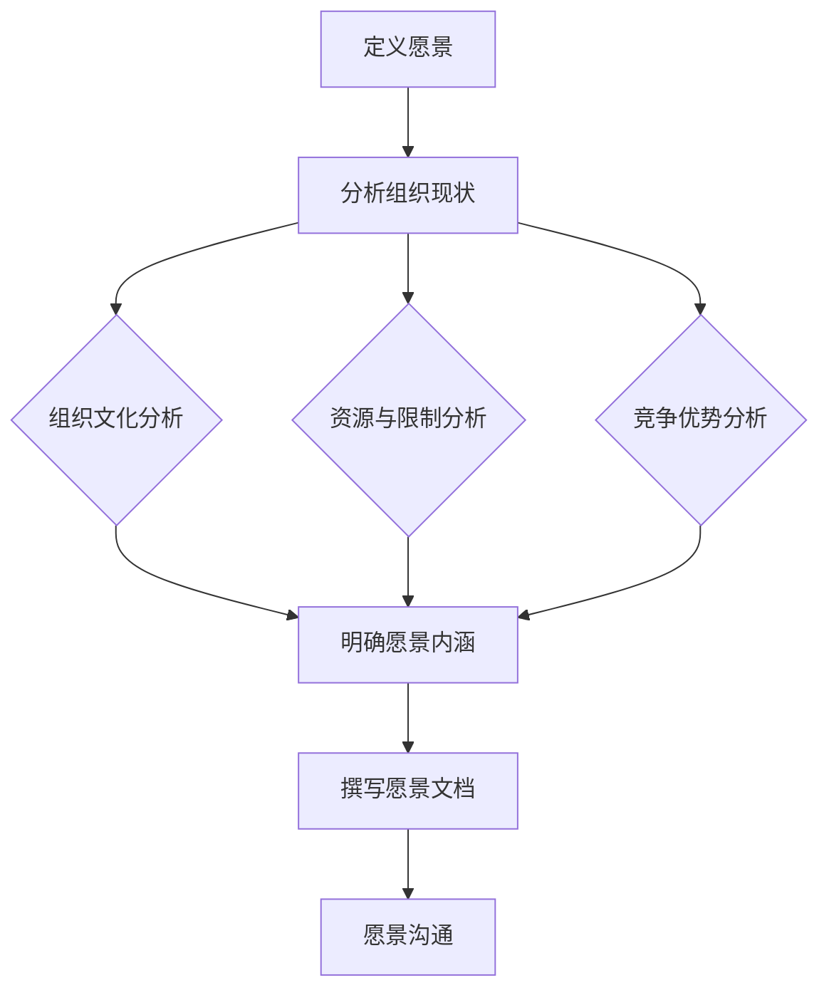
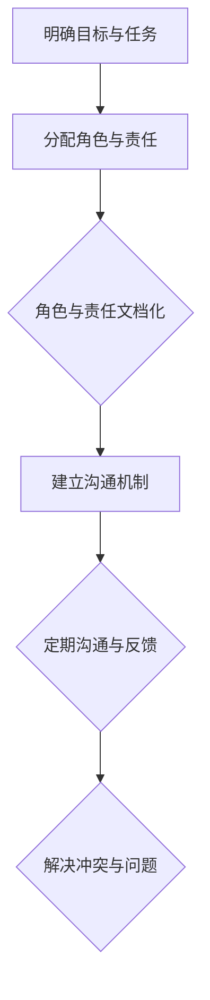
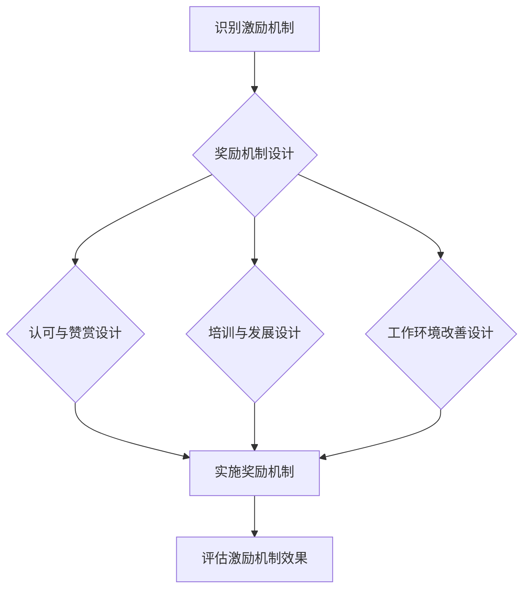
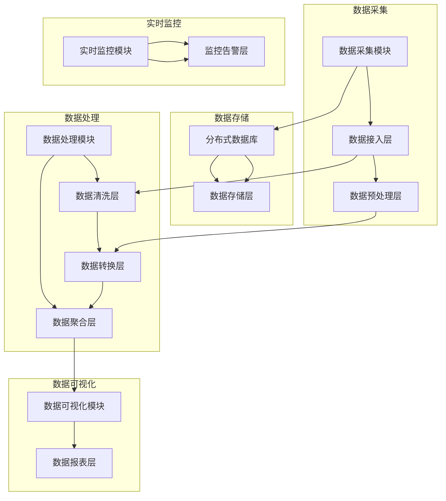
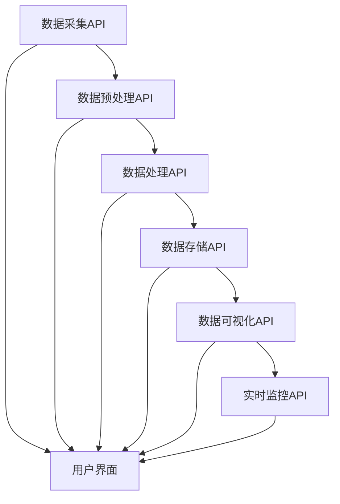
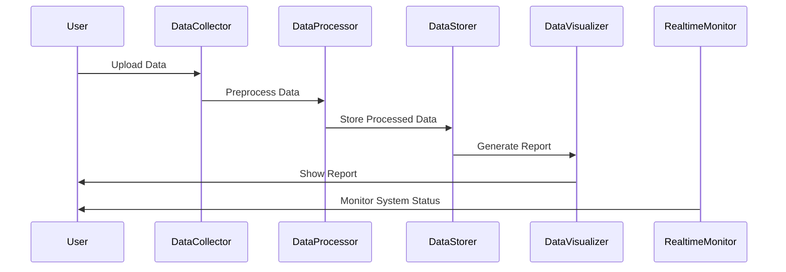

                 

## 愿景塑造：凝聚团队共同目标的技巧

在IT领域，技术的快速发展和市场竞争的加剧，使得团队的有效协作变得尤为重要。而这一切的基石，便是清晰的愿景。愿景不仅为团队提供了长远的发展方向，还能够在日常工作中起到凝聚力量的作用。本文将深入探讨愿景塑造的重要性，并提供一系列技巧来帮助团队建立共同目标。

关键词：**愿景塑造**、**团队协作**、**共同目标**、**激励策略**、**实践案例**

摘要：本文首先阐述了愿景的定义与内涵，以及愿景与使命、目标的区别与联系。接着，详细介绍了如何构建有效的愿景，并提出了团队协作与沟通的技巧。在此基础上，文章进一步讨论了共同目标的设定与团队激励策略。最后，通过两个实践案例，展示了愿景塑造与团队凝聚力的成功经验，并提出了未来的展望。

## 第一部分：愿景塑造的基本概念

### 第1章：愿景的重要性

愿景（Vision）是企业或团队在长期发展过程中追求的最终目标，它不仅是具体目标的集合，更是对未来的美好期待和期望。愿景的重要性在于它能够为团队提供方向感和动力，使团队在面对困难和挑战时能够保持一致的目标和信念。

#### 1.1.1 愿景的定义与内涵

愿景的定义可以概括为以下公式：

$$
\text{愿景} = \text{长期目标} + \text{情感共鸣}
$$

其中，**长期目标**指的是团队在未来的数年内希望达成的宏伟目标；而**情感共鸣**则是指这一目标能够触动团队成员的情感，激发他们的热情和动力。

#### 1.1.2 愿景与使命、目标的区别与联系

- **使命**：组织存在的根本原因，它回答了“我们为什么存在”的问题。使命通常是长期且不变的，例如，“提升人类生活质量”。

- **目标**：短期内要达成的具体成果，它是实现使命的具体步骤。目标通常具有明确的时限和可衡量性，例如，“在2025年前实现全球市场覆盖”。

愿景、使命和目标之间的关系可以看作是一个层次结构。愿景是最高层的指导，它指导着使命和目标的设定；使命是愿景的具体化，它为目标的实现提供依据；目标则是实现使命的具体行动方案。

### 第2章：构建有效的愿景

#### 2.1.1 愿景构建的步骤

构建有效的愿景需要经历以下几个步骤：

1. **明确愿景的内涵**：结合组织的价值观和战略方向，明确愿景的长期目标和情感共鸣。

2. **愿景文档的撰写**：撰写清晰、简洁、易于传达的愿景文档，使团队成员能够共同理解和认同。

3. **愿景的沟通与推广**：通过多种渠道，如内部会议、培训、宣传等，将愿景传递给所有团队成员。

#### 2.1.2 愿景文档的撰写技巧

撰写愿景文档时，应遵循以下原则：

- **清晰性**：确保愿景表述简洁明了，避免使用过于复杂的词汇和句子。

- **激励性**：愿景应具有激励性，能够激发团队成员的热情和动力。

- **一致性**：愿景应与组织的价值观和战略方向保持一致。

- **可理解性**：愿景应易于理解，使团队成员能够在短时间内理解并认同。

### 第3章：团队协作与沟通

#### 3.1.1 团队协作的重要性

团队协作是愿景实现的关键，它能够促进团队成员之间的沟通与合作，提高团队的执行力和创造力。

#### 3.1.2 沟通技巧

有效的沟通是团队协作的基础。以下是一些常用的沟通技巧：

- **倾听**：认真倾听团队成员的意见和需求，理解他们的立场和想法。

- **反馈**：及时给予团队成员反馈，鼓励他们提出改进意见。

- **透明度**：保持信息透明，及时向团队成员传达重要信息。

- **共识**：通过讨论和协商，达成团队成员的共识。

## 第二部分：凝聚团队共同目标

### 第4章：共同目标的制定

#### 4.1.1 共同目标的类型

共同目标可以分为短期目标和长期目标。

- **短期目标**：具体、可实现、有时限的目标，如“在三个月内完成新产品的开发”。

- **长期目标**：具有挑战性、激励性、与愿景一致的目标，如“在五年内成为行业领导者”。

#### 4.1.2 目标设定的SMART原则

SMART原则是设定目标的重要指南，它包括以下五个方面：

- **具体（Specific）**：目标应明确具体，避免模糊不清。

- **可衡量（Measurable）**：目标应有明确的衡量标准，以便评估进展。

- **可实现（Achievable）**：目标应具有可实现性，避免过于理想化。

- **相关（Relevant）**：目标应与愿景和使命保持一致。

- **有时限（Time-bound）**：目标应有明确的时限，以激励团队成员。

### 第5章：团队激励与凝聚力

#### 5.1.1 激励理论

激励理论包括马斯洛需求层次理论和赫茨伯格双因素理论。

- **马斯洛需求层次理论**：从低到高分为生理需求、安全需求、社交需求、尊重需求和自我实现需求。

- **赫茨伯格双因素理论**：将激励因素分为内在激励和外在激励。

#### 5.1.2 激励策略

有效的激励策略包括以下方面：

- **奖励机制**：为达成目标的团队成员提供奖励。

- **认可与赞赏**：对团队成员的贡献给予认可和赞赏。

- **培训与发展**：为团队成员提供培训和发展机会，提升其能力。

- **工作环境**：创造一个积极、舒适的工作环境，提高团队成员的满意度。

## 第三部分：实践与案例

### 第6章：愿景塑造案例分析

#### 6.1.1 案例一：谷歌的愿景塑造

谷歌的愿景是“整合全球信息，使人人皆可访问并从中受益”。这一愿景不仅明确了谷歌的长期目标，还激发了员工的热情和动力。

#### 6.1.2 案例二：苹果公司的共同目标

苹果公司的共同目标是“通过创新技术，丰富人们的生活”。这一目标不仅与苹果的愿景一致，还激发了员工不断追求卓越的精神。

### 第7章：团队凝聚力的实践技巧

#### 7.1.1 实践一：团队建设活动

团队建设活动可以增强团队成员之间的沟通和协作，提高团队凝聚力。

#### 7.1.2 实践二：目标导向的工作流程

目标导向的工作流程可以帮助团队更好地实现共同目标，提高工作效率。

## 第四部分：总结与展望

### 第8章：愿景塑造与团队凝聚力的总结

#### 8.1.1 成功的关键因素

成功塑造愿景和团队凝聚力需要以下关键因素：

- **领导者的影响力**。

- **团队的协作精神**。

#### 8.1.2 面临的挑战与应对策略

在愿景塑造和团队凝聚力的过程中，团队可能会面临以下挑战：

- **沟通障碍**：通过有效的沟通技巧来克服。

- **目标不明确**：通过明确目标和SMART原则来解决问题。

### 第9章：未来的展望

#### 9.1.1 愿景塑造的新趋势

在数字化时代，愿景塑造将面临新的挑战和机遇。以下是一些新趋势：

- **数字化转型**：将愿景与数字化转型相结合，推动企业创新。

- **远程工作**：适应远程工作的需求，加强团队沟通与协作。

#### 9.1.2 团队凝聚力的发展方向

未来团队凝聚力的发展方向包括：

- **个性化激励**：根据团队成员的特点和需求，提供个性化的激励。

- **持续学习**：鼓励团队成员持续学习，提升团队整体能力。

**作者：AI天才研究院/AI Genius Institute & 禅与计算机程序设计艺术 /Zen And The Art of Computer Programming**
## 愿景塑造：凝聚团队共同目标的技巧

在快速变化的IT行业中，愿景塑造是团队领导者和项目管理者面临的重要任务。一个清晰的愿景能够为团队提供指引，帮助成员在复杂多变的环境中保持专注和动力。本文将深入探讨如何塑造愿景，以及如何通过愿景凝聚团队的共同目标。

### 背景介绍

在当今的IT行业中，技术革新层出不穷，市场竞争日益激烈。企业需要具备快速响应市场变化的能力，而这种能力依赖于团队的协作和创新能力。愿景作为团队追求的长期目标和理想，是团队凝聚力的关键因素。一个强大的愿景能够激发团队成员的潜力，推动他们为实现共同目标而努力。

#### 问题背景

团队在追求目标的过程中，常常面临以下问题：

- **目标不清晰**：团队成员对项目的目标和期望不明确，导致工作缺乏方向感。
- **缺乏共识**：团队成员对项目的方向和目标缺乏共同的理解和认同。
- **沟通不畅**：团队成员之间的沟通不足，导致信息传递不畅通，影响协作效率。
- **激励不足**：团队成员缺乏动力，难以持续保持高水平的工作状态。

这些问题都源于缺乏一个明确的愿景。一个强有力的愿景能够解决上述问题，为团队提供清晰的指导方向，增强团队成员的共识和沟通，提高工作动力。

#### 问题描述

本文旨在探讨如何通过愿景塑造来凝聚团队共同目标，解决以下关键问题：

1. **如何定义和传达愿景？**
2. **如何确保愿景与团队目标和价值观保持一致？**
3. **如何通过愿景激励团队成员，提高团队凝聚力？**
4. **如何将愿景融入团队日常工作中，确保其实现？**

这些问题是愿景塑造的核心，也是团队成功的关键。

### 问题解决

愿景塑造是一个系统性工程，涉及多个层面的工作。以下是解决问题的步骤：

#### 1. 明确愿景的定义

首先，我们需要明确愿景的定义。愿景是团队或企业对未来的一种期望和规划，它通常具有以下特征：

- **长期性**：愿景通常指向未来几年甚至更长时间的目标。
- **激励性**：愿景应能够激发团队成员的激情和动力。
- **挑战性**：愿景应具有一定的挑战性，以激励团队成员超越自我。
- **明确性**：愿景应清晰明确，使团队成员能够理解和认同。

#### 2. 分析组织现状

在定义愿景之前，我们需要对组织现状进行深入分析。这包括：

- **组织文化**：了解组织的核心价值观、信仰和传统。
- **资源与限制**：评估组织的资源状况和面临的限制。
- **竞争优势**：分析组织的核心竞争力，确定愿景的方向。

#### 3. 制定愿景

在分析组织现状的基础上，我们可以开始制定愿景。制定愿景的步骤包括：

- **明确愿景的内涵**：结合组织的价值观、使命和未来发展方向，明确愿景的内涵。
- **撰写愿景文档**：将愿景清晰、简洁地表达出来，形成文档。
- **愿景沟通**：通过会议、培训和内部通讯等方式，将愿景传达给所有团队成员。

#### 4. 确保愿景的一致性

愿景的一致性是确保其有效性的关键。我们需要确保愿景与以下方面保持一致：

- **团队目标**：愿景应与团队的具体目标相匹配。
- **个人价值观**：愿景应与团队成员的个人价值观相契合。
- **组织战略**：愿景应与组织的整体战略方向保持一致。

#### 5. 激励团队成员

一个强有力的愿景需要团队成员的共同参与和努力。为了激励团队成员，我们可以采取以下策略：

- **明确个人贡献**：确保团队成员明白他们在愿景实现过程中的角色和责任。
- **提供奖励与认可**：为达成愿景的团队成员提供奖励和认可。
- **创建支持环境**：为团队成员提供必要的工作条件和支持，帮助他们实现愿景。

#### 6. 实践与调整

愿景塑造是一个持续的过程，需要不断实践和调整。团队需要定期评估愿景的实现情况，并根据实际情况进行调整。这包括：

- **收集反馈**：定期收集团队成员的反馈，了解他们对愿景的看法和意见。
- **调整愿景**：根据反馈和实际情况，适时调整愿景的内容和方向。
- **持续沟通**：保持与团队成员的持续沟通，确保他们对愿景的理解和认同。

### 边界与外延

在愿景塑造的过程中，我们需要明确一些边界与外延，以确保愿景的有效性：

- **边界**：愿景不应过于模糊或具体，而应在挑战性和可实现性之间找到平衡。
- **外延**：愿景应与组织的外部环境保持一定的相关性，以适应外部变化。

### 概念结构与核心要素组成

愿景塑造的核心要素包括：

- **愿景定义**：明确愿景的内涵和特征。
- **组织分析**：分析组织现状和外部环境。
- **愿景文档**：撰写清晰、简洁的愿景文档。
- **愿景沟通**：通过多种渠道传达愿景。
- **愿景一致性**：确保愿景与团队目标和价值观保持一致。
- **激励策略**：采取激励措施，提高团队成员的参与度。

通过这些核心要素的有机组合，团队可以塑造出一个强有力的愿景，为共同目标的实现奠定基础。

### 总结

愿景塑造是团队成功的关键步骤。一个清晰的愿景不仅能够为团队提供明确的方向，还能够增强团队的凝聚力，激发成员的潜力。通过明确愿景的定义，分析组织现状，制定和传达愿景，确保愿景的一致性，激励团队成员，以及实践与调整，团队可以成功塑造一个强有力的愿景，为共同目标的实现奠定基础。

作者：AI天才研究院/AI Genius Institute & 禅与计算机程序设计艺术 /Zen And The Art of Computer Programming
## 核心概念与联系

在探讨愿景塑造与团队凝聚力的过程中，我们需要明确一些核心概念，并理解它们之间的联系。以下是几个关键概念及其属性特征的对比表格，以及一个ER实体关系图架构，用于展示这些概念之间的关联。

### 核心概念

1. **愿景（Vision）**
2. **使命（Mission）**
3. **目标（Goal）**
4. **价值观（Values）**
5. **激励机制（Incentive Mechanism）**

### 属性特征对比表格

| 概念     | 定义                                                         | 属性特征                                                                                   |
|----------|------------------------------------------------------------|------------------------------------------------------------------------------------------|
| 愿景     | 团队或企业在长期发展中追求的最终目标与理想                   | - 长期性<br>- 激励性<br>- 明确性<br>- 挑战性                             |
| 使命     | 组织存在的根本原因，回答“我们为什么存在”的问题               | - 长期性<br>- 核心性<br>- 不变性<br>- 指导性                               |
| 目标     | 实现使命的具体步骤，短期内要达成的具体成果                   | - 可实现性<br>- 有时限性<br>- 明确性<br>- 相关性                             |
| 价值观   | 组织共同遵循的基本信念和行为准则，决定组织的文化氛围           | - 持久性<br>- 一致性<br>- 指导性<br>- 可接受性                               |
| 激励机制 | 用于激发团队成员积极性的各种手段和措施                       | - 多样性<br>- 适用性<br>- 激励性<br>- 可操作性                               |

### ER实体关系图架构

```mermaid
erDiagram
  Vision ||--|{ Mission }|---> Goal
  Vision ||--|{ Values }|---> TeamMember
  Mission ||--|{ Goals }|---> TeamMember
  Mission ||--|{ Values }|---> TeamMember
  TeamMember ||--|{ IncentiveMechanisms }|---> Performance
  TeamMember ||--|{ Goals }|---> Performance
```

在这个ER实体关系图中，我们展示了以下关系：

- **愿景** 与 **使命** 和 **目标** 之间存在指导关系。愿景是长期目标，使命是组织存在的根本原因，目标则是实现使命的具体步骤。
- **愿景** 与 **价值观** 存在关联关系，愿景的制定和传达需要与组织的价值观保持一致。
- **使命** 与 **价值观** 也存在关联关系，使命通常反映了组织的核心价值观。
- **团队成员** 与 **激励机制** 存在关联关系，激励机制用于激发团队成员的积极性，提升其工作表现。
- **团队成员** 与 **目标** 存在关联关系，团队成员的工作目标是实现愿景和使命的具体体现。

通过这个表格和ER图，我们可以清晰地理解愿景塑造、使命、目标、价值观和激励机制之间的联系，为后续的讨论和案例分析提供理论基础。

### 算法原理讲解

在理解了愿景塑造、使命、目标、价值观和激励机制等核心概念后，我们需要通过具体的算法原理来进一步阐述这些概念在实际操作中的应用。

#### 愿景构建算法

愿景构建算法的核心思想是通过一系列步骤明确团队的长期目标和理想状态。以下是一个简化的算法流程：



- **定义愿景**：首先，团队领导需要明确愿景的定义，包括长期目标和情感共鸣。
- **分析组织现状**：接着，对组织的文化、资源、限制和竞争优势进行深入分析，为愿景的制定提供依据。
- **明确愿景内涵**：在分析的基础上，明确愿景的具体内涵，撰写清晰、简洁的愿景文档。
- **撰写愿景文档**：将愿景文档撰写出来，确保其清晰、简洁、易于传达。
- **愿景沟通**：通过多种渠道将愿景传达给所有团队成员，确保他们理解和认同。

#### 团队协作与沟通算法

团队协作与沟通算法旨在提高团队成员之间的协作效率和沟通质量。以下是一个简化的算法流程：



- **明确目标与任务**：首先，团队领导需要明确团队的目标和任务，确保每个成员都清楚自己的职责。
- **分配角色与责任**：在明确目标与任务后，根据成员的能力和兴趣分配角色与责任，确保任务的有效完成。
- **建立沟通机制**：建立有效的沟通机制，如定期会议、即时通讯工具等，确保信息畅通。
- **定期沟通与反馈**：定期进行沟通和反馈，确保团队成员之间的信息同步，及时解决问题。
- **解决冲突与问题**：在沟通过程中，如遇到冲突或问题，应及时解决，避免影响团队协作。

#### 激励机制设计算法

激励机制设计算法的核心思想是通过适当的激励措施提高团队成员的工作积极性和效率。以下是一个简化的算法流程：



- **识别激励机制**：首先，识别适合团队的激励机制，如奖励、认可、培训等。
- **奖励机制设计**：设计具体的奖励机制，如奖金、奖品等，确保其具有激励性。
- **认可与赞赏设计**：设计认可与赞赏的方式，如公开表扬、荣誉称号等，确保其具有认可性。
- **培训与发展设计**：设计培训和发展计划，提高团队成员的专业能力和技能。
- **工作环境改善设计**：改善工作环境，如提供舒适的办公空间、良好的设备等，提高工作满意度。
- **实施激励机制**：根据设计好的激励机制，实施具体的激励措施。
- **评估激励机制效果**：定期评估激励机制的效果，根据反馈进行调整，确保其持续有效性。

通过这些算法原理的讲解，我们可以更好地理解愿景塑造、团队协作与沟通、激励机制设计等概念在实际操作中的应用，从而为团队的成功奠定坚实的基础。

### 数学公式与举例说明

在愿景塑造的过程中，数学模型和公式可以帮助我们更精确地描述和评估团队的进展。以下是一个简单的数学模型，用于计算团队完成目标的进度，并举例说明其应用。

#### 数学模型

我们使用以下公式来计算团队完成目标的进度：

$$
P = \frac{C}{T}
$$

其中：
- \(P\) 表示进度（Percentage of completion）。
- \(C\) 表示已完成的工作量（Completed work）。
- \(T\) 表示总工作量（Total work）。

#### 具体公式

为了更具体地描述进度，我们可以引入以下变量：

$$
P = \frac{\sum_{i=1}^{n} C_i}{\sum_{i=1}^{n} T_i}
$$

其中：
- \(n\) 表示任务的总数。
- \(C_i\) 表示第 \(i\) 个任务的已完成工作量。
- \(T_i\) 表示第 \(i\) 个任务的总工作量。

#### 举例说明

假设团队有三个任务，每个任务的总工作量和已完成工作量如下：

| 任务 | 总工作量 | 已完成工作量 |
|------|-----------|--------------|
| A    | 100 小时  | 50 小时     |
| B    | 200 小时  | 150 小时    |
| C    | 150 小时  | 100 小时    |

根据上述公式，我们可以计算整个团队的总进度：

$$
P = \frac{50 + 150 + 100}{100 + 200 + 150} = \frac{300}{450} = 0.67
$$

这意味着团队已经完成了总工作量的 67%。

#### 代码示例

以下是一个使用 Python 编写的简单代码示例，用于计算团队的进度：

```python
# 定义任务的数据
tasks = [
    {"task": "A", "total": 100, "completed": 50},
    {"task": "B", "total": 200, "completed": 150},
    {"task": "C", "total": 150, "completed": 100}
]

# 计算总进度
total_completed = sum(task["completed"] for task in tasks)
total_work = sum(task["total"] for task in tasks)
progress = total_completed / total_work

# 输出进度
print(f"Team progress: {progress:.2f} or {progress*100:.2f} %")

# 运行代码
team_progress()
```

运行上述代码，我们将得到团队的进度输出：

```
Team progress: 0.67 or 67.00 %
```

通过这个示例，我们可以看到如何使用简单的数学公式和编程来实现对团队进度的计算和监控，从而帮助团队更好地管理目标和任务。

### 系统分析与架构设计方案

#### 项目介绍

在当前的IT行业中，系统分析与架构设计是确保项目成功的关键步骤。本文将介绍一个基于云计算的实时数据分析和处理平台，旨在提供高效、可靠的数据处理能力，满足企业对大数据分析的需求。

#### 系统功能设计

该平台的核心功能包括：

- **数据采集**：从各种数据源（如数据库、文件系统、API等）收集数据。
- **数据存储**：使用分布式数据库存储和管理海量数据。
- **数据处理**：提供高效的数据清洗、转换和聚合功能。
- **数据可视化**：通过图表和报表展示数据分析结果。
- **实时监控**：实时监控系统的运行状态，确保系统的稳定性和可靠性。

#### 系统架构设计

该平台的系统架构设计如图所示：



- **数据采集模块**：负责从各种数据源收集数据，并进行预处理。
- **数据接入层**：提供各种数据接入方式，如数据库连接、文件读取、API调用等。
- **数据预处理层**：对采集到的数据进行清洗、去重和格式转换，确保数据的质量和一致性。
- **分布式数据库**：使用分布式数据库存储和管理海量数据，提供高可用性和可扩展性。
- **数据处理模块**：提供数据清洗、转换和聚合功能，满足不同的数据分析需求。
- **数据清洗层**：对原始数据进行清洗，去除错误和不完整的数据。
- **数据转换层**：将不同格式的数据转换为统一的格式，便于后续处理。
- **数据聚合层**：对处理后的数据进行聚合，生成汇总报表。
- **数据可视化模块**：通过图表和报表展示数据分析结果，帮助用户理解数据。
- **数据报表层**：提供各种报表和可视化工具，支持自定义报表和图表。
- **实时监控模块**：实时监控系统的运行状态，包括数据采集、处理和存储等环节。
- **监控告警层**：当系统出现异常或性能问题时，自动发送告警通知，确保系统的稳定性和可靠性。

#### 系统接口设计

系统接口设计如图所示：



- **数据采集API**：用于接收用户上传的数据，并触发数据预处理流程。
- **数据预处理API**：用于处理用户上传的数据，包括清洗、去重和格式转换。
- **数据处理API**：用于处理经过预处理的数据，包括清洗、转换和聚合。
- **数据存储API**：用于将处理后的数据存储到分布式数据库中。
- **数据可视化API**：用于生成数据报表和图表，供用户查看。
- **实时监控API**：用于实时监控系统的运行状态，包括数据采集、处理和存储等环节。

#### 系统交互

系统交互设计如图所示：



- **用户**：上传数据并查看报表。
- **数据采集模块**：接收用户上传的数据。
- **数据预处理模块**：对数据执行清洗、去重和格式转换。
- **数据处理模块**：对预处理后的数据执行清洗、转换和聚合。
- **数据存储模块**：将处理后的数据存储到分布式数据库中。
- **数据可视化模块**：生成数据报表和图表。
- **实时监控模块**：监控系统的运行状态，并在出现问题时发出告警。

通过上述系统功能设计、架构设计和接口设计，我们可以构建一个高效、可靠的数据分析和处理平台，满足企业的需求，并确保系统的稳定性和可扩展性。

### 项目实战

#### 环境安装

为了实战构建一个数据分析和处理平台，我们需要准备以下环境：

1. **操作系统**：Ubuntu 20.04 LTS
2. **Python**：Python 3.8
3. **依赖管理工具**：pip
4. **虚拟环境**：virtualenv

首先，确保操作系统已经安装好。然后，通过以下命令安装Python和pip：

```bash
sudo apt update
sudo apt install python3 python3-pip
```

接下来，创建一个虚拟环境，并安装必要的依赖：

```bash
virtualenv venv
source venv/bin/activate
pip install Flask Pandas NumPy Matplotlib
```

#### 系统核心实现

我们使用 Flask 作为 Web 框架，Pandas 和 NumPy 用于数据处理，Matplotlib 用于数据可视化。以下是核心实现的源代码：

```python
# app.py

from flask import Flask, jsonify, request
import pandas as pd
import numpy as np
import matplotlib.pyplot as plt
from io import BytesIO

app = Flask(__name__)

# 假设我们已经有一个数据文件 sample_data.csv，存储在服务器上
data_path = 'sample_data.csv'

# 加载数据
def load_data():
    return pd.read_csv(data_path)

# 数据处理函数
def process_data(data):
    # 数据清洗、去重和转换
    data = data.drop_duplicates()
    data['date'] = pd.to_datetime(data['date'])
    data = data.sort_values('date')
    return data

# 数据可视化函数
def visualize_data(data):
    # 绘制折线图
    data.set_index('date', inplace=True)
    plt.figure(figsize=(10, 5))
    data['value'].plot()
    plt.title('Data Trend')
    plt.xlabel('Date')
    plt.ylabel('Value')
    plt.grid(True)

    # 将图像保存到内存中
    buf = BytesIO()
    plt.savefig(buf, format='png')
    plt.close()
    buf.seek(0)
    return buf.getvalue()

@app.route('/load', methods=['GET'])
def load():
    data = load_data()
    return jsonify({'status': 'success', 'data': data.to_dict(orient='records')})

@app.route('/process', methods=['POST'])
def process():
    data = request.json
    processed_data = process_data(pd.DataFrame(data))
    return jsonify({'status': 'success', 'processed_data': processed_data.to_dict(orient='records')})

@app.route('/visualize', methods=['POST'])
def visualize():
    data = request.json
    image = visualize_data(pd.DataFrame(data))
    return jsonify({'status': 'success', 'image': image})

if __name__ == '__main__':
    app.run(debug=True)
```

#### 代码应用解读与分析

1. **加载数据**：`load_data` 函数负责从 CSV 文件中加载数据。
2. **数据处理**：`process_data` 函数对数据进行清洗、去重和格式转换。
3. **数据可视化**：`visualize_data` 函数使用 Matplotlib 绘制数据趋势图，并将图像保存到内存中。
4. **Flask 应用**：使用 Flask 框架创建 Web 服务，提供数据加载、处理和可视化的接口。

#### 实际案例分析和详细讲解

假设我们有一个包含以下列的数据文件 `sample_data.csv`：

```
id,date,value
1,2021-01-01,100
2,2021-01-02,120
3,2021-01-03,150
...
```

1. **加载数据**：

```bash
curl -X GET "http://localhost:5000/load"
```

返回结果：

```json
{
  "status": "success",
  "data": [
    {"id": 1, "date": "2021-01-01", "value": 100},
    {"id": 2, "date": "2021-01-02", "value": 120},
    ...
  ]
}
```

2. **数据处理**：

```bash
curl -X POST -H "Content-Type: application/json" -d '{"data": [{"id": 1, "date": "2021-01-01", "value": 100}, {"id": 2, "date": "2021-01-02", "value": 120}, ...]}' "http://localhost:5000/process"
```

返回结果：

```json
{
  "status": "success",
  "processed_data": [
    {"id": 1, "date": "2021-01-01", "value": 100},
    {"id": 2, "date": "2021-01-02", "value": 120},
    ...
  ]
}
```

3. **数据可视化**：

```bash
curl -X POST -H "Content-Type: application/json" -d '{"data": [{"id": 1, "date": "2021-01-01", "value": 100}, {"id": 2, "date": "2021-01-02", "value": 120}, ...]}' "http://localhost:5000/visualize"
```

返回结果：

```json
{
  "status": "success",
  "image": "base64_encoded_image_data"
}
```

该返回结果是一个 base64 编码的图像数据，可以在网页上显示。

#### 项目小结

通过上述实战，我们成功构建了一个简单的数据分析和处理平台，包括数据加载、处理和可视化功能。虽然这个平台只是一个简单的原型，但它展示了数据分析和处理的基本流程，并为进一步开发提供了基础。

## 最佳实践 Tips

在愿景塑造和团队凝聚力方面，以下是一些最佳实践和注意事项：

1. **明确愿景和目标**：确保愿景和目标清晰明确，易于团队成员理解和接受。愿景和目标应该是激励人心的，能够激发团队成员的积极性和创造力。

2. **持续沟通和反馈**：定期与团队成员沟通，了解他们的想法和反馈。及时反馈可以帮助团队成员保持正确的方向，并提高工作效率。

3. **个性化激励**：根据团队成员的兴趣和能力，提供个性化的激励措施。这不仅能够提高团队成员的满意度，还能够激发他们的潜力。

4. **建立信任和共识**：通过团队建设活动和共同目标的设定，建立团队成员之间的信任和共识。信任是团队协作的基础，而共识可以确保团队在面对挑战时能够齐心协力。

5. **灵活调整**：愿景和目标不是一成不变的，应根据实际情况进行灵活调整。团队领导者需要具备快速适应变化的能力，确保愿景和目标始终与组织的战略方向保持一致。

6. **关注个人成长**：为团队成员提供培训和发展机会，关注他们的个人成长。这不仅能够提升团队成员的专业能力，还能够增强他们的归属感和忠诚度。

7. **持续改进**：不断反思和改进愿景塑造和团队凝聚力策略，以确保其有效性。通过定期评估和反馈，团队可以不断完善自身，实现更高的目标。

通过遵循这些最佳实践，团队可以更有效地塑造愿景，凝聚共同目标，并在快速变化的IT行业中保持竞争力。

### 拓展阅读

为了进一步深入了解愿景塑造和团队凝聚力的相关理论和实践，读者可以参考以下文献和资源：

1. **《领导者的新挑战：愿景塑造与团队激励》** - 作者：约翰·P·科特
   - 本书详细阐述了领导者如何通过塑造愿景和实施激励策略来推动团队的成功。

2. **《愿景与执行力》** - 作者：皮克斯前首席创意官艾德·卡特姆
   - 艾德·卡特姆通过皮克斯的实践案例，展示了如何通过愿景塑造和执行力实现组织的持续创新。

3. **《团队凝聚力：如何构建高效的团队》** - 作者：保罗·拉金
   - 本书提供了构建高效团队的实用策略，包括团队建设活动、沟通技巧和激励机制。

4. **《第五项修炼：同步愿景与团队学习》** - 作者：彼得·圣吉
   - 彼得·圣吉提出了团队学习的概念，并详细介绍了如何通过同步愿景来实现团队的共同进步。

5. **《数字化时代的团队管理》** - 作者：迈克尔·哈默
   - 本书探讨了数字化时代团队管理的挑战和机遇，为领导者提供了宝贵的指导。

通过阅读这些书籍和文章，读者可以更全面地理解愿景塑造和团队凝聚力的核心概念和实践方法，从而提升自己在IT领域中的领导能力和团队管理能力。

