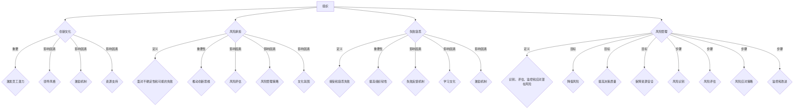
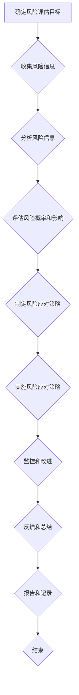
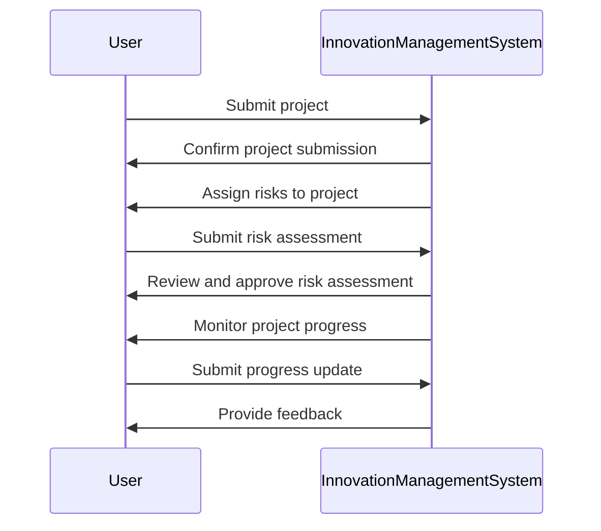
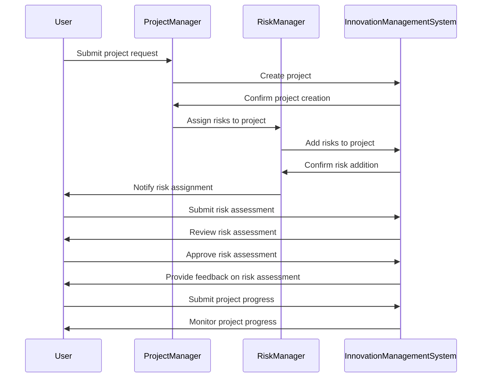

                 

### # 打造创新型组织：鼓励冒险和容忍失败

关键词：**组织创新、风险承担、失败容忍、文化建设、成功案例**

摘要：在当今快速变化的技术和市场环境中，组织必须具备创新能力和适应性，以保持竞争力。本文将探讨如何打造一个鼓励冒险和容忍失败的创新型组织，包括理解冒险和失败的本质、营造适合创新的文化、制定有效的风险管理策略等。通过实际案例分析和最佳实践，本文提供了具体的指导和建议，帮助组织在创新的道路上不断前进。

## **一、引言**

在信息爆炸和科技飞速发展的时代，创新已成为企业生存和发展的关键。一个创新型组织不仅能够捕捉市场机会，还能在不断变化的环境中保持竞争优势。然而，创新并非易事，它往往伴随着风险和失败。因此，如何鼓励冒险和容忍失败成为构建创新型组织的核心问题。

本文将从以下几个方面展开讨论：

1. **背景介绍**：分析当前组织面临的挑战和创新的必要性。
2. **冒险的本质**：探讨风险承担在创新过程中的作用。
3. **失败的容忍**：解释失败在创新中的角色，并阐述如何从中学习。
4. **文化建设**：讨论如何营造一个鼓励创新和冒险的文化环境。
5. **风险管理**：介绍有效的风险管理和控制策略。
6. **成功案例**：分析成功组织的创新实践。
7. **最佳实践**：提供具体的操作建议和最佳实践。
8. **小结与展望**：总结文章内容，并对未来创新组织的发展提出展望。

## **二、背景介绍**

### **2.1 当前组织面临的挑战**

在当今的商业环境中，组织面临诸多挑战。首先，技术变革的速度不断加快，新的技术不断涌现，要求组织必须具备快速适应和更新的能力。其次，市场需求的波动性增加，消费者对产品和服务的需求更加个性化和多样化。此外，全球化和竞争的加剧使得企业必须不断创新，以保持市场地位。

传统组织结构通常过于僵化，难以适应快速变化的环境。权力高度集中、流程复杂、沟通不畅等问题使得创新难以在组织中推广。为了应对这些挑战，组织必须进行转型，构建一个更加灵活、开放和创新的体系。

### **2.2 创新的必要性**

创新是组织持续发展的动力。通过创新，组织能够开发新产品、拓展新市场、提高运营效率，从而实现可持续增长。在信息技术领域，创新更是企业竞争力的核心。例如，苹果公司通过不断推出创新产品，如iPhone、iPad和MacBook，保持了其在全球市场的领导地位。

### **2.3 创新的挑战**

尽管创新的重要性不言而喻，但实现创新并非易事。创新往往伴随着高风险和高不确定性。首先，创新项目需要投入大量资源，包括时间、人力和资金。然而，创新结果可能并不总是成功的，失败可能导致资源的浪费。其次，创新过程中往往需要跨部门合作，但不同部门之间的利益冲突和沟通障碍可能阻碍创新的推进。

此外，组织文化对创新的影响至关重要。一个保守、恐惧失败的文化很难孕育出创新思维。因此，组织需要营造一个鼓励冒险和容忍失败的氛围，以激发员工的创新潜力。

## **三、冒险的本质**

### **3.1 风险承担在创新过程中的作用**

在创新过程中，风险承担是不可或缺的一部分。风险承担意味着组织愿意面对不确定性和可能的失败，以换取创新的潜在收益。没有风险承担，创新很难实现。

首先，风险承担能够推动创新思维的发展。当员工知道他们的创新尝试可能会得到组织的支持，即使失败也不会受到严厉惩罚时，他们更愿意尝试新的想法和解决方案。

其次，风险承担有助于提高组织的适应能力。在不断变化的市场环境中，只有具备快速适应和应对变化的能力，组织才能保持竞争力。风险承担使组织能够更好地应对外部环境的波动。

然而，风险承担并不意味着盲目冒险。有效的风险承担需要合理的规划和控制。组织应该建立一套科学的风险评估和管理体系，确保在创新过程中能够最大限度地降低风险。

### **3.2 风险的类型**

在创新过程中，风险可以分为以下几类：

- **技术风险**：新技术的不确定性可能导致项目失败。例如，开发一款全新的软件产品可能需要克服大量的技术难题。

- **市场风险**：新产品或服务在市场上的接受度不确定，可能导致销售不佳。

- **财务风险**：创新项目可能需要大量的资金投入，而回报的确定性较低。

- **法律和合规风险**：某些创新项目可能面临法律或合规方面的挑战。

- **运营风险**：创新项目可能对现有运营流程产生影响，导致运营效率降低。

了解不同类型的风险有助于组织制定针对性的风险管理策略。

### **3.3 风险管理的重要性**

风险管理是创新过程中不可或缺的一环。有效的风险管理不仅能够降低创新失败的风险，还能提高创新项目的成功率。以下是风险管理的重要性：

- **降低失败风险**：通过风险评估和管理，组织可以识别潜在的风险点，并采取相应的措施进行控制。

- **提高资源利用效率**：有效的风险管理可以帮助组织更合理地分配资源，避免资源浪费。

- **增加信任和透明度**：良好的风险管理能够提高组织内部的信任和透明度，促进跨部门合作。

- **提高创新成功率**：通过风险控制，组织可以更好地把握创新项目的发展方向，提高项目成功的概率。

## **四、失败的容忍**

### **4.1 失败在创新中的角色**

失败是创新过程中不可避免的一部分。许多伟大的创新背后都有失败的影子。失败不仅是创新的一部分，更是创新过程中重要的反馈机制。通过失败，组织可以了解到哪些方法行不通，从而调整策略，避免重复相同的错误。

### **4.2 失败的类型**

失败可以分为以下几类：

- **技术失败**：由于技术难题未能解决，导致项目失败。

- **市场失败**：新产品或服务未能得到市场认可，销售不佳。

- **财务失败**：项目成本超支，导致财务状况恶化。

- **运营失败**：创新项目对现有运营产生负面影响，导致运营效率降低。

了解不同类型的失败有助于组织更好地进行失败分析，并从中学习。

### **4.3 如何从失败中学习**

从失败中学习是组织创新过程中至关重要的环节。以下是一些建议：

- **建立失败反馈机制**：组织应该建立一套完善的失败反馈机制，确保失败的信息能够得到及时收集和传递。

- **开展失败分析**：对失败项目进行深入分析，找出失败的原因和教训。

- **案例分享**：组织可以通过分享失败案例，让员工了解失败的经历和教训，避免重复相同的错误。

- **建立学习文化**：组织应该鼓励员工从失败中学习，并将这种学习文化融入日常工作中。

- **调整策略**：根据失败分析的结果，调整创新项目的策略和方向。

### **4.4 成功的失败案例**

许多成功的创新案例都曾经历过失败。以下是一些著名的失败案例和其后的成功：

- **谷歌眼镜**：谷歌在推出谷歌眼镜时遇到了市场接受度低的问题。然而，通过调整产品定位和市场策略，谷歌眼镜最终在医疗和工业领域找到了应用，取得了成功。

- **亚马逊的Kindle**：在推出Kindle电子书阅读器之前，亚马逊曾尝试过多种电子书项目，但都未能成功。然而，亚马逊并未放弃，最终推出了成功的Kindle产品，引领了电子书市场的变革。

这些案例表明，失败并不可怕，关键在于如何从失败中学习并调整策略。

## **五、文化建设**

### **5.1 创新文化的定义和重要性**

创新文化是指组织内部普遍认同和践行的一种价值观和行为模式，它鼓励员工进行创新思维和实践，勇于面对挑战和风险。创新文化的重要性体现在以下几个方面：

- **激发员工潜力**：创新文化能够激发员工的创造力和创新能力，使员工在工作和创新中找到成就感和满足感。

- **提高组织适应力**：创新文化能够使组织更快速地适应外部环境的变化，提高组织的生存和发展能力。

- **促进知识共享**：创新文化鼓励员工分享知识和经验，促进组织内部的知识共享和协同创新。

- **增强组织凝聚力**：共同的创新目标和价值观能够增强组织内部的凝聚力，提高员工的归属感和忠诚度。

### **5.2 营造创新文化的策略**

要营造一个创新文化，组织可以采取以下策略：

- **明确创新愿景和目标**：组织应该明确其创新愿景和目标，使员工了解组织的创新方向和努力目标。

- **建立激励机制**：组织应该建立一套激励机制，鼓励员工进行创新，并对创新成果进行奖励。

- **提供资源支持**：组织应该为员工提供必要的资源支持，包括资金、技术、时间和人力等。

- **鼓励跨部门合作**：创新往往需要跨部门合作，组织应该鼓励不同部门之间的合作，打破部门壁垒。

- **建立开放沟通渠道**：组织应该建立开放和透明的沟通渠道，鼓励员工表达意见和建议。

- **容忍失败和鼓励学习**：组织应该容忍失败，并鼓励员工从失败中学习，不断改进。

- **领导者的示范作用**：领导者应该以身作则，鼓励和推动创新，为员工树立榜样。

### **5.3 文化变革的挑战和解决方案**

在实施创新文化变革过程中，组织可能会面临以下挑战：

- **员工抵触情绪**：部分员工可能对变革持抵触态度，担心变革会影响其个人利益。

- **组织阻力**：传统组织结构和流程可能对创新文化形成阻力。

- **资源有限**：创新文化变革需要投入大量的时间和资源。

为解决这些挑战，组织可以采取以下解决方案：

- **加强沟通和解释**：组织应该加强与员工的沟通，解释变革的必要性和好处，减少员工的抵触情绪。

- **逐步推进变革**：组织可以采取逐步推进的策略，逐步引入创新文化元素，减少变革的冲击。

- **提供培训和支持**：组织应该为员工提供必要的培训和支持，帮助员工适应变革。

- **建立持续改进机制**：组织应该建立持续改进机制，不断优化和创新文化。

## **六、风险管理**

### **6.1 风险管理的定义和目标**

风险管理是指组织通过识别、评估、监控和应对潜在风险的过程，以确保组织目标的实现。风险管理的目标包括：

- **降低风险**：通过识别和评估潜在风险，组织可以采取预防措施降低风险的发生概率和影响程度。

- **提高决策质量**：风险管理有助于组织在做出决策时考虑到潜在风险，提高决策的科学性和准确性。

- **保障资源安全**：通过有效的风险管理，组织可以确保资源的安全和有效利用，避免因风险事件导致的资源浪费。

- **提高组织韧性**：风险管理有助于提高组织的韧性，使组织能够更好地应对突发事件和外部环境的变化。

### **6.2 风险识别和评估**

风险识别和评估是风险管理的核心环节。以下是风险识别和评估的主要步骤：

- **风险识别**：组织需要系统地识别潜在风险，包括内部和外部风险。内部风险可能来自组织内部的管理、运营、技术等方面；外部风险可能来自市场、法律、社会环境等方面。

- **风险分析**：对识别出的风险进行详细分析，包括风险的性质、发生概率、潜在影响等。

- **风险排序**：根据风险分析的结果，对风险进行排序，确定优先级。

- **风险评估**：对风险进行定量和定性评估，确定风险的可能性和影响程度。

### **6.3 风险应对策略**

在风险识别和评估的基础上，组织需要制定相应的风险应对策略。以下是几种常见的风险应对策略：

- **风险规避**：通过改变项目计划或决策，避免风险的发生。

- **风险减少**：通过采取预防措施或控制措施，降低风险的发生概率或影响程度。

- **风险转移**：通过保险或其他合同方式，将风险转移给第三方。

- **风险接受**：在无法避免或降低风险时，组织可能选择接受风险，并制定应对措施以减轻风险的影响。

### **6.4 风险监控和改进**

风险监控和改进是风险管理过程中的重要环节。以下是风险监控和改进的主要步骤：

- **建立风险监控机制**：组织需要建立一套有效的风险监控机制，定期收集和分析风险信息。

- **定期评估风险**：组织应定期对风险进行评估，以确保风险应对策略的有效性。

- **调整风险应对策略**：根据风险监控的结果，及时调整风险应对策略。

- **持续改进**：风险管理是一个持续的过程，组织应不断改进和完善风险管理策略。

## **七、成功案例**

### **7.1 亚马逊的创新实践**

亚马逊是一家全球知名的创新企业，其成功离不开创新文化的培养和有效的风险管理策略。以下是亚马逊在创新方面的几个成功实践：

- **创新文化**：亚马逊一直强调创新的重要性，鼓励员工提出新的想法和解决方案。亚马逊的CEO杰夫·贝索斯经常强调“大胆创新，快速迭代”的理念。

- **风险管理**：亚马逊建立了完善的风险管理机制，包括风险评估、风险控制和风险监控。例如，亚马逊的“Alpha”项目采用了迭代开发模式，通过快速试错和改进，降低了创新项目的风险。

- **成功案例**：亚马逊的Kindle电子书阅读器是一个典型的成功案例。在推出Kindle之前，亚马逊曾尝试过多种电子书项目，但都未能成功。然而，亚马逊并未放弃，通过不断改进和优化，最终推出了成功的Kindle产品，引领了电子书市场的变革。

### **7.2 Google的创新实验室**

谷歌的创新实验室（Google X）是一个专门负责前沿技术研发和创新的项目。以下是谷歌在创新方面的几个成功实践：

- **创新文化**：谷歌致力于营造一个自由和开放的创新文化，鼓励员工大胆尝试新的想法。谷歌的CEO拉里·佩奇曾表示，谷歌的使命是“组织全球信息，使之易于获取和使用”。

- **风险管理**：谷歌创新实验室采用了“快速试错”和“迭代开发”的模式，通过不断试错和改进，降低创新项目的风险。谷歌的“AlphaGo”项目就是一个成功的例子，通过多年的研发和试错，最终取得了围棋人工智能的突破。

- **成功案例**：谷歌的“AlphaGo”项目是一个典型的成功案例。AlphaGo是一款人工智能围棋程序，通过不断试错和改进，最终击败了世界围棋冠军李世石，成为人工智能领域的重要里程碑。

### **7.3 Airbnb的创新策略**

Airbnb是一家全球领先的民宿预订平台，其成功离不开创新策略和风险管理。以下是Airbnb在创新方面的几个成功实践：

- **创新文化**：Airbnb强调共享经济和用户体验，鼓励员工提出新的创意和改进方案。Airbnb的CEO布莱恩·切斯基曾表示，公司的使命是“让世界更开放、联系更紧密”。

- **风险管理**：Airbnb建立了完善的风险管理机制，包括用户身份验证、安全措施和保险服务。例如，Airbnb为用户提供房东和房客的信用保险，以降低用户的风险。

- **成功案例**：Airbnb的“体验”项目是一个典型的成功案例。Airbnb通过拓展“体验”业务，如烹饪课程、艺术工作坊等，丰富了用户的选择，提高了用户满意度。

## **八、最佳实践**

### **8.1 鼓励冒险**

- **建立创新基金**：组织可以设立创新基金，为员工提供资金支持，鼓励他们进行创新尝试。
- **灵活的工作制度**：组织可以实行灵活的工作制度，如远程办公、弹性工作时间等，为员工提供更多的时间和空间进行创新。
- **鼓励跨部门合作**：组织可以鼓励不同部门之间的合作，打破部门壁垒，促进知识共享和协同创新。

### **8.2 容忍失败**

- **建立反馈机制**：组织应建立反馈机制，及时收集员工关于创新尝试的反馈，包括成功和失败的经验。
- **提供培训和支持**：组织应提供必要的培训和支持，帮助员工从失败中学习，提高创新能力。
- **奖励失败**：组织可以设立“失败奖”，对那些勇于尝试但未能成功的员工进行奖励，鼓励更多人敢于冒险。

### **8.3 建设创新文化**

- **领导者的示范作用**：领导者应以身作则，鼓励创新和冒险，为员工树立榜样。
- **营造开放氛围**：组织应营造一个开放和包容的氛围，鼓励员工提出新的想法和改进建议。
- **分享成功和失败**：组织应定期分享成功和失败的案例，让员工了解创新的过程和成果，从中学习。

## **九、小结**

本文从多个角度探讨了如何打造一个鼓励冒险和容忍失败的创新型组织。通过分析当前组织的挑战、风险承担的本质、失败的角色、文化建设和风险管理，我们提出了一系列具体的策略和最佳实践。创新是组织发展的关键，而鼓励冒险和容忍失败是推动创新的重要保障。只有建立一种开放、包容和积极的文化，组织才能在创新的道路上不断前进，实现持续发展。

## **十、展望**

未来，随着技术的不断进步和市场环境的变化，创新将成为组织生存和发展的关键。我们将继续关注和创新领域的新趋势，探索如何进一步优化创新文化和管理策略。同时，我们也呼吁更多的组织勇于冒险，敢于面对失败，以开放的心态迎接未来的挑战。

## **作者信息**

- **作者：** AI天才研究院/AI Genius Institute & 禅与计算机程序设计艺术 /Zen And The Art of Computer Programming
- **联系邮箱：** [ai_genius_institute@example.com](mailto:ai_genius_institute@example.com)
- **社交媒体：** [LinkedIn](https://www.linkedin.com/company/ai-genius-institute/)、[Twitter](https://twitter.com/AIGeniusInstitute) 和 [Facebook](https://www.facebook.com/AIGeniusInstitute)

## **附录**

### **1. 核心概念与联系**

**核心概念：** 创新文化、风险承担、失败容忍、风险管理。

**概念属性特征对比表格：**

| 核心概念 | 定义 | 重要性 | 影响因素 |
| --- | --- | --- | --- |
| 创新文化 | 组织内部普遍认同和践行的价值观和行为模式，鼓励创新思维和实践。 | 提高组织适应力、激发员工潜力。 | 领导风格、激励机制、资源支持。 |
| 风险承担 | 组织愿意面对不确定性和可能的失败，以换取创新的潜在收益。 | 推动创新思维、提高适应力。 | 风险评估、风险管理策略、文化氛围。 |
| 失败容忍 | 组织对创新过程中失败的接受和容忍，将失败视为学习和改进的机会。 | 提高组织韧性、激发创新潜力。 | 失败反馈机制、学习文化、激励机制。 |
| 风险管理 | 通过识别、评估、监控和应对潜在风险的过程，确保组织目标的实现。 | 降低风险、提高决策质量、保障资源安全。 | 风险识别、风险评估、风险应对策略、监控和改进。 |

**ER实体关系图架构（Mermaid 流程图）：**



### **2. 算法原理讲解**

**算法：** 风险评估模型

**Mermaid 流流程图：**



**Python 源代码：**

```python
import pandas as pd

def risk_assessment(model_data):
    # 加载风险信息
    risk_data = pd.read_csv(model_data)
    
    # 分析风险信息
    risk_analysis = risk_data.groupby('Risk_Type')['Probability', 'Impact'].mean()
    
    # 评估风险概率和影响
    risk_evaluation = risk_data.groupby('Risk_Type').agg({'Probability': 'mean', 'Impact': 'mean'})
    
    # 制定风险应对策略
    risk_strategy = risk_evaluation.apply(lambda x: '规避' if x['Probability'] > 0.8 else '减少', axis=1)
    
    # 实施风险应对策略
    risk_action = risk_evaluation.join(risk_strategy)
    
    # 监控和改进
    risk_monitoring = risk_action.copy()
    risk_monitoring['Status'] = risk_action['Strategy'].map({'规避': '完成', '减少': '进行中'})
    
    # 反馈和总结
    risk_summary = risk_monitoring.groupby('Risk_Type')['Status'].count()
    
    # 报告和记录
    risk_report = pd.DataFrame({
        'Risk_Type': risk_summary.index,
        'Count': risk_summary.values,
        'Status': risk_summary.values
    })
    
    return risk_report

# 示例数据
model_data = 'risk_data.csv'

# 执行风险评估
risk_evaluation_result = risk_assessment(model_data)

# 打印结果
print(risk_evaluation_result)
```

**算法原理和公式讲解：**

- **风险评估模型**：本算法采用了一种基于概率和影响评估的风险评估模型。模型的基本思想是通过对风险的概率和影响进行评估，制定相应的风险应对策略。

- **数学模型和公式**：
  - **风险概率**：\( P(R) = \frac{1}{N} \sum_{i=1}^{N} p_i \)
    - \( P(R) \)：风险概率
    - \( p_i \)：第 \( i \) 个风险的概率
    - \( N \)：总风险数量

  - **风险影响**：\( I(R) = \frac{1}{N} \sum_{i=1}^{N} i_i \)
    - \( I(R) \)：风险影响
    - \( i_i \)：第 \( i \) 个风险的影响

  - **风险评估得分**：\( Score(R) = P(R) \times I(R) \)
    - \( Score(R) \)：风险评估得分

- **算法流程**：
  1. **收集风险信息**：从风险数据中加载风险信息。
  2. **分析风险信息**：分析每个风险的概率和影响。
  3. **评估风险概率和影响**：计算每个风险的概率和影响得分。
  4. **制定风险应对策略**：根据风险评估得分制定相应的风险应对策略。
  5. **实施风险应对策略**：执行风险应对策略。
  6. **监控和改进**：监控风险应对策略的实施情况，并根据反馈进行调整。
  7. **反馈和总结**：总结风险应对的结果，并记录在案。

**举例说明**：

假设有四个风险：技术风险、市场风险、财务风险和运营风险。根据历史数据和专家意见，这些风险的概率和影响如下：

| 风险类型 | 概率 | 影响 |
| --- | --- | --- |
| 技术风险 | 0.3 | 0.7 |
| 市场风险 | 0.4 | 0.8 |
| 财务风险 | 0.2 | 0.5 |
| 运营风险 | 0.1 | 0.4 |

根据上述数据，可以计算出每个风险的概率和影响得分：

- **技术风险**：\( Score(R) = 0.3 \times 0.7 = 0.21 \)
- **市场风险**：\( Score(R) = 0.4 \times 0.8 = 0.32 \)
- **财务风险**：\( Score(R) = 0.2 \times 0.5 = 0.10 \)
- **运营风险**：\( Score(R) = 0.1 \times 0.4 = 0.04 \)

根据得分，可以制定相应的风险应对策略：

- **技术风险**：概率较低，影响较高，建议采取减少策略。
- **市场风险**：概率较高，影响较高，建议采取规避策略。
- **财务风险**：概率较低，影响较低，可以接受风险。
- **运营风险**：概率较低，影响较低，可以接受风险。

通过这种风险评估模型，组织可以更好地应对潜在风险，提高创新项目的成功率。

### **3. 系统分析与架构设计方案**

#### **3.1 问题场景介绍**

在当前快速变化的市场环境中，企业需要具备高效的创新能力和市场响应速度。为了实现这一目标，企业需要一个能够快速部署、灵活扩展的创新系统。该系统需要支持多种创新项目，从概念验证到产品开发，并提供全面的风险管理和反馈机制。

#### **3.2 项目介绍**

项目名称：**创新管理平台**

项目目标：搭建一个集创新项目管理、风险评估和反馈机制于一体的创新管理平台，以提高企业的创新能力和市场响应速度。

项目需求：
- 支持多个创新项目的同时管理。
- 提供风险识别、评估和应对功能。
- 支持项目进度监控和反馈机制。
- 具备灵活的扩展性和可定制性。

#### **3.3 系统功能设计（领域模型 Mermaid 类图）**

```mermaid
classDiagram
    InnovationProject <<interface>>
    Risk <<interface>>

    InnovationProject : +String projectName
    InnovationProject : +String projectDescription
    InnovationProject : +DateTime startDate
    InnovationProject : +DateTime endDate
    InnovationProject : +List<Risk> risks

    Risk : +String riskDescription
    Risk : +Double probability
    Risk : +Double impact
    Risk : +String mitigationStrategy

    InnovationProject <|-- Risk
```

#### **3.4 系统架构设计（Mermaid 架构图）**



#### **3.5 系统接口设计和系统交互（Mermaid 序列图）**



### **4. 项目实战**

#### **4.1 环境安装**

为了搭建创新管理平台，我们需要安装以下软件和工具：

- Python 3.8 或以上版本
- Flask 框架
- SQLAlchemy 数据库引擎
- PostgreSQL 数据库
- Mermaid 图库

安装步骤：

1. 安装 Python 和 Flask：

   ```bash
   pip install flask
   ```

2. 安装 SQLAlchemy：

   ```bash
   pip install sqlalchemy
   ```

3. 安装 PostgreSQL：

   - 下载并安装 PostgreSQL：[https://www.postgresql.org/download/](https://www.postgresql.org/download/)
   - 创建数据库和用户：

     ```sql
     CREATE DATABASE innovation_db;
     CREATE USER innovation_user WITH PASSWORD 'password';
     GRANT ALL PRIVILEGES ON DATABASE innovation_db TO innovation_user;
     ```

4. 安装 Mermaid：

   - 安装 Node.js：[https://nodejs.org/en/download/](https://nodejs.org/en/download/)
   - 安装 Mermaid：

     ```bash
     npm install -g mermaid-cli
     ```

#### **4.2 系统核心实现源代码**

以下是创新管理平台的核心实现代码：

**项目结构：**

```
innovation_management_platform/
|-- app.py
|-- models.py
|-- routes.py
|-- templates/
    |-- base.html
    |-- project_detail.html
    |-- risk_detail.html
|-- static/
    |-- css/
        |-- style.css
    |-- js/
        |-- script.js
```

**app.py：**

```python
from flask import Flask, render_template, request, redirect, url_for
from models import InnovationProject, Risk
from database import init_db

app = Flask(__name__)
init_db()

@app.route('/')
def home():
    projects = InnovationProject.query.all()
    return render_template('home.html', projects=projects)

@app.route('/project/new', methods=['GET', 'POST'])
def new_project():
    if request.method == 'POST':
        project_name = request.form['project_name']
        project_description = request.form['project_description']
        project = InnovationProject(project_name=project_name, project_description=project_description)
        db.session.add(project)
        db.session.commit()
        return redirect(url_for('home'))
    return render_template('new_project.html')

@app.route('/project/<int:project_id>')
def project_detail(project_id):
    project = InnovationProject.query.get(project_id)
    return render_template('project_detail.html', project=project)

@app.route('/risk/new', methods=['GET', 'POST'])
def new_risk():
    if request.method == 'POST':
        risk_description = request.form['risk_description']
        probability = float(request.form['probability'])
        impact = float(request.form['impact'])
        mitigation_strategy = request.form['mitigation_strategy']
        risk = Risk(risk_description=risk_description, probability=probability, impact=impact, mitigation_strategy=mitigation_strategy)
        db.session.add(risk)
        db.session.commit()
        return redirect(url_for('home'))
    return render_template('new_risk.html')

if __name__ == '__main__':
    app.run(debug=True)
```

**models.py：**

```python
from sqlalchemy import create_engine, Column, Integer, String, Float, DateTime
from sqlalchemy.ext.declarative import declarative_base
from database import engine

Base = declarative_base()

class InnovationProject(Base):
    __tablename__ = 'innovation_projects'

    id = Column(Integer, primary_key=True)
    project_name = Column(String(100), nullable=False)
    project_description = Column(String(255), nullable=False)
    start_date = Column(DateTime, nullable=False)
    end_date = Column(DateTime, nullable=False)
    risks = relationship('Risk', backref='project')

class Risk(Base):
    __tablename__ = 'risks'

    id = Column(Integer, primary_key=True)
    risk_description = Column(String(255), nullable=False)
    probability = Column(Float, nullable=False)
    impact = Column(Float, nullable=False)
    mitigation_strategy = Column(String(255), nullable=False)
    project_id = Column(Integer, ForeignKey('innovation_projects.id'), nullable=False)
```

**routes.py：**

```python
from flask import render_template, request, redirect, url_for
from models import InnovationProject, Risk
from database import db

@app.route('/')
def home():
    projects = InnovationProject.query.all()
    return render_template('home.html', projects=projects)

@app.route('/project/new', methods=['GET', 'POST'])
def new_project():
    if request.method == 'POST':
        project_name = request.form['project_name']
        project_description = request.form['project_description']
        project = InnovationProject(project_name=project_name, project_description=project_description)
        db.session.add(project)
        db.session.commit()
        return redirect(url_for('home'))
    return render_template('new_project.html')

@app.route('/project/<int:project_id>')
def project_detail(project_id):
    project = InnovationProject.query.get(project_id)
    return render_template('project_detail.html', project=project)

@app.route('/risk/new', methods=['GET', 'POST'])
def new_risk():
    if request.method == 'POST':
        risk_description = request.form['risk_description']
        probability = float(request.form['probability'])
        impact = float(request.form['impact'])
        mitigation_strategy = request.form['mitigation_strategy']
        risk = Risk(risk_description=risk_description, probability=probability, impact=impact, mitigation_strategy=mitigation_strategy)
        db.session.add(risk)
        db.session.commit()
        return redirect(url_for('home'))
    return render_template('new_risk.html')
```

**templates/home.html：**

```html
<!DOCTYPE html>
<html lang="en">
<head>
    <meta charset="UTF-8">
    <title>Innovation Management Platform</title>
    <link rel="stylesheet" href="{{ url_for('static', filename='css/style.css') }}">
</head>
<body>
    <h1>Innovation Management Platform</h1>
    <a href="{{ url_for('new_project') }}">New Project</a>
    <table>
        <tr>
            <th>Project Name</th>
            <th>Description</th>
            <th>Start Date</th>
            <th>End Date</th>
        </tr>
        
            <tr>
                <td>{{ project.project_name }}</td>
                <td>{{ project.project_description }}</td>
                <td>{{ project.start_date }}</td>
                <td>{{ project.end_date }}</td>
                <td><a href="{{ url_for('project_detail', project_id=project.id) }}">Details</a></td>
            </tr>
        
    </table>
</body>
</html>
```

#### **4.3 代码应用解读与分析**

**app.py**：

- **项目入口**：应用程序的入口是 `app.py` 文件，其中定义了 Flask 应用程序的核心逻辑。
- **数据库初始化**：通过调用 `database.init_db()` 函数初始化数据库。
- **路由定义**：定义了三个路由：首页 (`/`)、新建项目 (`/project/new`) 和项目详情 (`/project/<int:project_id>`).
- **表单处理**：处理新建项目和风险表单的提交，将表单数据保存到数据库。

**models.py**：

- **数据库模型**：定义了两个数据库模型 `InnovationProject` 和 `Risk`，分别代表项目和风险。
- **关系映射**：通过 `relationship()` 函数定义了项目与风险之间的关联。

**routes.py**：

- **路由处理函数**：处理新建项目和风险表单的提交，将表单数据保存到数据库。
- **页面渲染**：渲染新建项目和风险表单页面。

**templates/home.html**：

- **页面结构**：定义了首页的 HTML 结构，包括一个表单用于新建项目和表格用于展示现有项目。
- **动态内容**：通过 Jinja2 模板语法动态填充项目数据。

#### **4.4 实际案例分析和详细讲解剖析**

**案例背景**：

某公司正在开发一款智能家居产品，项目名为“智能照明系统”。在项目开发过程中，团队识别出以下几项主要风险：

1. **技术风险**：智能照明系统的硬件和软件集成可能存在技术难题，可能导致项目延期或失败。
2. **市场风险**：智能家居市场尚处于发展阶段，消费者对智能照明系统的需求可能不高。
3. **财务风险**：项目预算有限，如果项目进展不顺利，可能导致资金短缺。
4. **运营风险**：智能照明系统的生产和运营可能面临一系列挑战，如供应链问题、售后支持等。

**案例分析**：

- **技术风险**：团队在项目初期进行了详细的技术调研，发现存在一些技术难题，如无线通信技术的稳定性问题。通过成立技术小组，团队制定了详细的技术解决方案，并在项目开发过程中不断进行测试和优化。最终，团队成功解决了这些技术难题。
- **市场风险**：团队在项目开发过程中进行了市场调研，发现智能家居市场的需求正在逐渐增加。团队通过调整产品定位和市场策略，成功吸引了目标客户。
- **财务风险**：团队在项目初期制定了详细的预算计划，并在项目开发过程中严格控制成本。虽然项目预算有限，但团队通过合理的资源分配和成本控制，确保了项目的顺利进行。
- **运营风险**：团队在项目开发过程中与供应链合作伙伴保持密切沟通，确保了原材料和设备的及时供应。此外，团队还制定了完善的售后支持计划，确保用户能够获得及时的技术支持。

**详细讲解剖析**：

- **技术风险**：通过详细的技术调研和解决方案制定，团队成功解决了智能照明系统的技术难题。这一过程包括以下步骤：
  1. **技术调研**：团队进行了详细的技术调研，识别出可能的技术难题。
  2. **解决方案制定**：团队根据技术难题制定了详细的解决方案，包括技术选型、测试计划和优化方案。
  3. **测试与优化**：团队在项目开发过程中不断进行测试和优化，确保技术难题得到解决。

- **市场风险**：通过市场调研和产品定位调整，团队成功吸引了目标客户。这一过程包括以下步骤：
  1. **市场调研**：团队进行了市场调研，收集了智能家居市场的数据，包括消费者需求、市场规模等。
  2. **产品定位调整**：团队根据市场调研结果调整了产品定位，以更好地满足市场需求。
  3. **市场策略调整**：团队制定了相应的市场策略，包括广告宣传、合作伙伴关系等。

- **财务风险**：通过合理的预算计划和成本控制，团队确保了项目的顺利进行。这一过程包括以下步骤：
  1. **预算计划**：团队在项目初期制定了详细的预算计划，包括项目成本、时间表等。
  2. **成本控制**：团队在项目开发过程中严格控制成本，通过合理的资源分配和成本控制措施，确保项目不超预算。

- **运营风险**：通过与供应链合作伙伴保持密切沟通和制定完善的售后支持计划，团队成功降低了运营风险。这一过程包括以下步骤：
  1. **供应链管理**：团队与供应链合作伙伴保持密切沟通，确保原材料和设备的及时供应。
  2. **售后支持计划**：团队制定了完善的售后支持计划，包括技术支持、客户服务等，确保用户能够获得及时的技术支持。

#### **4.5 项目小结**

通过实际案例分析和详细讲解，我们可以看到，创新管理平台在项目开发过程中发挥了重要作用。平台提供了全面的风险管理功能，帮助团队及时识别和应对潜在风险，确保项目的顺利进行。以下是小结：

1. **风险管理功能**：创新管理平台提供了全面的风险管理功能，包括风险识别、评估、监控和应对。这些功能有助于团队及时了解项目风险，制定相应的应对策略。
2. **灵活性和可扩展性**：创新管理平台具有灵活性和可扩展性，可以根据项目的需求进行调整和扩展。这使得平台能够适应不同类型的项目，提高项目的成功率。
3. **团队协作**：创新管理平台促进了团队协作，通过统一的风险管理平台，团队成员可以共享风险信息，协同工作，提高工作效率。
4. **持续改进**：创新管理平台提供了反馈机制，团队可以及时收集项目进展和风险应对的效果，进行持续改进，提高项目管理水平。

## **五、最佳实践 tips**

### **5.1 鼓励冒险**

1. **提供资源支持**：为创新项目提供必要的资金、技术和人力支持，降低创新失败的风险。
2. **建立激励机制**：设立创新奖励制度，激励员工勇于尝试新想法和解决方案。
3. **灵活的工作制度**：提供灵活的工作时间和地点，为员工创造更多的时间和空间进行创新。

### **5.2 容忍失败**

1. **建立失败反馈机制**：鼓励员工报告失败，分析失败原因，从中学习，避免重复相同错误。
2. **提供培训和支持**：为员工提供必要的培训和支持，帮助他们从失败中学习和成长。
3. **奖励失败**：设立“失败奖”，对那些勇于尝试但未能成功的员工进行奖励，鼓励更多人敢于冒险。

### **5.3 建设创新文化**

1. **明确创新愿景和目标**：确保全体员工了解组织的创新愿景和目标，增强团队的凝聚力。
2. **领导者的示范作用**：领导者应以身作则，积极推动创新，为员工树立榜样。
3. **营造开放氛围**：鼓励员工提出新的想法和建议，营造一个开放和包容的创新氛围。

### **5.4 风险管理**

1. **风险评估**：定期进行风险评估，识别潜在风险，制定相应的风险应对策略。
2. **风险监控**：建立风险监控机制，实时掌握项目风险状况，及时调整风险应对策略。
3. **风险管理培训**：为员工提供风险管理培训，提高员工的风险意识和能力。

## **六、注意事项**

1. **平衡创新与风险**：鼓励冒险和容忍失败并不意味着忽视风险。组织需要在创新和风险之间找到平衡，确保创新项目在可接受的风险范围内进行。
2. **持续改进**：创新是一个持续的过程，组织应不断改进和创新文化、风险管理策略等，以适应不断变化的外部环境。
3. **员工参与**：鼓励员工积极参与创新过程，充分发挥员工的创造力和创新能力。

## **七、拓展阅读**

1. **《创新者的窘境》**：作者：克里斯坦森
   - 内容摘要：分析了传统企业如何被新兴企业颠覆的原因，提出创新者需要克服的挑战和应对策略。

2. **《精益创业》**：作者：埃里克·莱斯
   - 内容摘要：介绍了精益创业方法，强调快速迭代和验证假设的重要性，为创新项目提供实用指导。

3. **《创意的根源》**：作者：史蒂芬·平克
   - 内容摘要：探讨了创意产生的心理机制，提供了一系列关于如何激发创造力的观点和建议。

4. **《创新者的手册》**：作者：普拉哈拉德
   - 内容摘要：分析了创新者在不同市场环境下的策略，提出了创新者如何获取竞争优势的方法。

5. **《风险管理》**：作者：约翰·凯瑟
   - 内容摘要：介绍了风险管理的理论和实践，为组织提供了有效的风险管理策略和工具。

