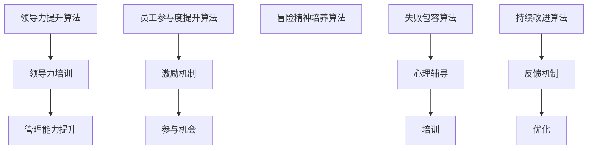
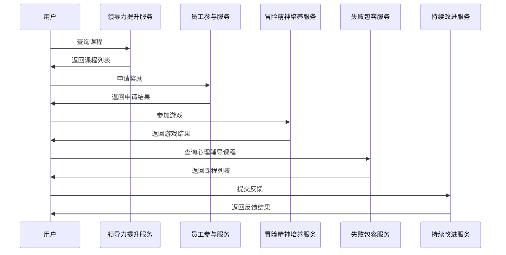

                 


## 打造创新文化：鼓励冒险和容忍失败

关键词：创新文化、冒险精神、容忍失败、领导力、员工参与

摘要：本文旨在探讨如何打造一种创新文化，鼓励员工冒险并容忍失败。通过分析创新文化的核心概念、联系和算法原理，为企业提供一套系统的方法，以构建一个鼓励创新、勇于尝试、包容失败的工作环境。

----------------------------------------------------------------

## 第一部分: 背景介绍

### 1.1 问题背景

在当今竞争激烈的市场环境中，创新已成为企业提升竞争力、实现可持续发展的关键。然而，创新并非一蹴而就，它需要企业内部形成一种创新文化，以鼓励员工冒险并容忍失败。创新文化是指企业内部形成的一种鼓励创新、容忍失败的氛围和环境。这种文化不仅有助于激发员工的创造力，还能促进企业的持续发展。

### 1.2 问题描述

许多企业在鼓励创新方面存在诸多问题，如员工不敢冒险、失败被视为耻辱等。这些问题导致企业创新动力不足，难以形成持续的竞争优势。因此，如何打造一种创新文化，鼓励员工冒险并容忍失败，成为企业面临的重要挑战。

### 1.3 问题解决

为了解决上述问题，企业需要从以下几个方面着手：

1. **领导层的支持**：企业领导层需要树立正确的创新观念，并为员工提供必要的资源和平台。
2. **员工参与**：鼓励员工积极参与创新过程，提供培训和发展机会，增强他们的创新意识和能力。
3. **冒险精神**：鼓励员工勇于尝试，即使失败也视为学习的机会。
4. **包容失败**：建立一种包容失败的氛围，让员工敢于冒险，不畏失败。
5. **持续改进**：通过不断反馈和优化，持续提升企业的创新能力。

### 1.4 边界与外延

创新文化不仅仅局限于技术领域，还涵盖市场、管理等多个方面。同时，不同行业和企业在实现创新文化的过程中，也面临着不同的挑战。因此，本文旨在为企业提供一套通用的方法，以帮助他们在组织内部打造创新文化。

### 1.5 概念结构与核心要素组成

创新文化包含以下核心要素：

1. **领导层的支持**：企业领导层需要树立正确的创新观念，为员工提供必要的资源和平台。
2. **员工参与**：鼓励员工积极参与创新过程，提供培训和发展机会，增强他们的创新意识和能力。
3. **冒险精神**：鼓励员工勇于尝试，即使失败也视为学习的机会。
4. **包容失败**：建立一种包容失败的氛围，让员工敢于冒险，不畏失败。
5. **持续改进**：通过不断反馈和优化，持续提升企业的创新能力。

----------------------------------------------------------------

## 第二部分：核心概念与联系

### 2.1 创新文化

创新文化是指企业内部形成的一种鼓励创新、容忍失败的氛围和环境。它包括以下核心要素：

1. **领导层的支持**：企业领导层需要树立正确的创新观念，推动创新文化的形成，并为员工提供必要的支持和资源。
2. **员工参与**：鼓励员工积极参与创新过程，提供培训和发展机会，激发他们的创新潜力。
3. **冒险精神**：鼓励员工勇于尝试，即使失败也视为学习的机会，从而激发他们的创新动力。
4. **包容失败**：建立一种包容失败的氛围，让员工敢于冒险，不畏失败。
5. **持续改进**：通过不断反馈和优化，持续提升企业的创新能力。

### 2.2 领导力

领导力是构建创新文化的关键。领导者需要具备以下特质：

1. **创新观念**：领导者需要树立正确的创新观念，认识到创新对企业的价值，并将其融入到企业的战略和文化中。
2. **激励员工**：领导者需要激励员工积极参与创新过程，为员工提供发展机会和支持。
3. **营造氛围**：领导者需要营造一种包容失败、鼓励冒险的氛围，让员工敢于尝试。
4. **持续关注**：领导者需要持续关注创新进展，提供必要的资源和支持，确保创新项目的成功。

### 2.3 员工参与

员工参与是创新文化的重要组成部分。企业需要鼓励员工积极参与创新过程，具体措施如下：

1. **培训与发展**：为员工提供创新相关的培训和发展机会，提升他们的创新意识和能力。
2. **激励机制**：建立激励机制，鼓励员工提出创新想法和解决方案。
3. **团队协作**：鼓励员工跨部门、跨领域合作，共同推动创新项目。
4. **开放沟通**：建立开放的沟通渠道，让员工能够自由表达创新想法，并得到反馈和建议。

### 2.4 冒险精神

冒险精神是创新文化的重要特征。企业需要鼓励员工勇于尝试，具体措施如下：

1. **案例分享**：通过分享成功和失败的案例，让员工认识到冒险的价值和必要性。
2. **冒险游戏**：组织冒险游戏，激发员工的冒险精神。
3. **奖励机制**：建立奖励机制，对敢于冒险、取得成果的员工给予表彰和奖励。
4. **心理辅导**：为员工提供心理辅导，帮助他们克服恐惧，敢于尝试。

### 2.5 包容失败

包容失败是创新文化的关键。企业需要建立一种包容失败的氛围，具体措施如下：

1. **失败定义**：明确失败的定义，区分失败与错误，让员工认识到失败是创新过程中的正常现象。
2. **反馈机制**：建立反馈机制，对失败的项目进行分析和总结，从中汲取经验教训。
3. **心理辅导**：为员工提供心理辅导，帮助他们正确看待失败，培养积极的心态。
4. **培训与支持**：为员工提供培训和支持，帮助他们提高应对失败的能力。

### 2.6 持续改进

持续改进是创新文化的核心要素。企业需要通过以下措施，持续提升创新能力：

1. **反馈与优化**：建立反馈机制，对创新项目进行持续优化，提升其成功率。
2. **激励机制**：建立激励机制，鼓励员工持续改进创新项目。
3. **跨部门合作**：鼓励跨部门合作，共同推动创新项目。
4. **创新评估**：对创新项目进行定期评估，确保其符合企业的战略目标。

----------------------------------------------------------------

## 第三部分：算法原理讲解

### 3.1 创新文化构建算法

为了构建创新文化，企业可以采用以下算法：

1. **领导力提升算法**：通过领导力培训，提升领导者的创新观念和管理能力。
2. **员工参与度提升算法**：通过激励机制，提高员工参与度，激发创新潜力。
3. **冒险精神培养算法**：通过案例分享、冒险游戏等，培养员工的冒险精神。
4. **失败包容算法**：通过心理辅导、培训等，建立包容失败的氛围。
5. **持续改进算法**：通过反馈机制，持续优化创新文化，提升创新能力。

### 3.2 算法原理

#### 3.2.1 领导力提升算法

$$
\text{领导力提升} = \text{领导力培训} \times \text{管理能力提升}
$$

领导者需要通过领导力培训，提升自己的创新观念和管理能力。这包括学习创新理论、了解创新流程、掌握创新方法等。同时，领导者还需要提升管理能力，包括团队管理、项目管理、资源管理等。

#### 3.2.2 员工参与度提升算法

$$
\text{员工参与度提升} = \text{激励机制} \times \text{参与机会}
$$

企业可以通过激励机制，提高员工参与度。这包括提供奖励、晋升机会、培训等。同时，企业还需要提供参与机会，让员工能够积极参与创新过程，发挥他们的创新潜力。

#### 3.2.3 冒险精神培养算法

$$
\text{冒险精神培养} = \text{案例分享} \times \text{冒险游戏}
$$

企业可以通过案例分享，让员工了解成功的创新案例，认识到冒险的价值。同时，企业还可以组织冒险游戏，激发员工的冒险精神，培养他们的创新动力。

#### 3.2.4 失败包容算法

$$
\text{失败包容} = \text{心理辅导} \times \text{培训}
$$

企业可以通过心理辅导，帮助员工正确看待失败，培养他们的心理素质。同时，企业还可以提供培训，帮助员工提高应对失败的能力，从而建立一种包容失败的氛围。

#### 3.2.5 持续改进算法

$$
\text{持续改进} = \text{反馈机制} \times \text{优化}
$$

企业需要建立反馈机制，对创新项目进行持续优化，提升其成功率。同时，企业还需要优化创新流程，提高创新效率，从而实现持续改进。

### 3.3 Mermaid 流程图



通过以上算法，企业可以逐步构建起创新文化，鼓励员工冒险并容忍失败，从而实现持续的创新和发展。

----------------------------------------------------------------

## 第四部分：系统分析与架构设计方案

### 4.1 问题场景介绍

在一个竞争激烈的市场环境中，企业需要不断进行创新，以保持竞争优势。为了构建创新文化，企业决定采用一套系统的方法，包括领导力提升、员工参与、冒险精神培养、失败包容和持续改进等方面。以下是具体的系统架构设计方案。

### 4.2 项目介绍

该项目旨在为企业构建一个创新文化支持系统，包括以下模块：

1. **领导力提升模块**：提供领导力培训，提升领导者的创新观念和管理能力。
2. **员工参与模块**：提供激励机制和参与机会，提高员工参与度，激发创新潜力。
3. **冒险精神培养模块**：通过案例分享和冒险游戏，培养员工的冒险精神。
4. **失败包容模块**：提供心理辅导和培训，建立包容失败的氛围。
5. **持续改进模块**：建立反馈机制，对创新项目进行持续优化。

### 4.3 系统功能设计

系统功能设计主要包括以下方面：

1. **领导力提升**：为领导者提供在线培训课程，包括创新理论、创新流程、创新方法等。
2. **员工参与**：提供员工创新激励系统，包括奖励、晋升机会、培训等。
3. **冒险精神培养**：通过线上平台分享成功和失败的案例，组织冒险游戏等。
4. **失败包容**：提供心理辅导课程，帮助员工正确看待失败，建立包容失败的氛围。
5. **持续改进**：建立反馈机制，对创新项目进行定期评估和优化。

### 4.4 系统架构设计

系统架构设计采用微服务架构，包括以下核心组件：

1. **领导力提升服务**：提供领导力培训课程和学习平台。
2. **员工参与服务**：提供激励机制和参与机会。
3. **冒险精神培养服务**：提供案例分享平台和冒险游戏。
4. **失败包容服务**：提供心理辅导课程和学习平台。
5. **持续改进服务**：提供反馈机制和优化工具。

### 4.5 系统接口设计

系统接口设计主要包括以下方面：

1. **领导力提升接口**：包括课程查询、报名、学习进度等接口。
2. **员工参与接口**：包括奖励申请、晋升申请、培训报名等接口。
3. **冒险精神培养接口**：包括案例分享、游戏报名、游戏结果查询等接口。
4. **失败包容接口**：包括心理辅导课程查询、报名、学习进度等接口。
5. **持续改进接口**：包括反馈提交、评估结果查询等接口。

### 4.6 系统交互

系统交互设计采用 Mermaid 序列图进行描述，具体如下：



通过以上系统架构和接口设计，企业可以构建一个完善的创新文化支持系统，帮助员工提升创新能力和冒险精神，建立包容失败的氛围，实现持续改进。

----------------------------------------------------------------

## 第五部分：项目实战

### 5.1 环境安装

在开始项目实战之前，我们需要搭建一个适合创新文化构建的环境。以下是环境安装的步骤：

1. **安装 Linux 操作系统**：选择一个适合的 Linux 发行版，如 Ubuntu 或 CentOS，并安装到服务器上。
2. **安装数据库**：选择一个合适的数据库系统，如 MySQL 或 PostgreSQL，并安装到服务器上。
3. **安装 Web 服务器**：选择一个适合的 Web 服务器，如 Apache 或 Nginx，并安装到服务器上。
4. **安装编程语言**：安装 Python 或 Java 等编程语言，用于开发项目。

### 5.2 系统核心实现源代码

以下是系统核心实现源代码的示例：

#### 领导力提升模块

```python
# 领导力提升模块：领导力培训课程管理

class TrainingCourse:
    def __init__(self, course_name, course_description):
        self.course_name = course_name
        self.course_description = course_description

    def enroll(self, employee):
        # 员工报名参加课程
        print(f"{employee.name} 报名参加 {self.course_name} 课程。")

    def complete(self, employee):
        # 员工完成课程
        print(f"{employee.name} 完成课程 {self.course_name}。")

class Employee:
    def __init__(self, name, position):
        self.name = name
        self.position = position

    def enroll_in_course(self, course):
        course.enroll(self)

    def complete_course(self, course):
        course.complete(self)
```

#### 员工参与模块

```python
# 员工参与模块：员工创新激励系统

class Reward:
    def __init__(self, reward_name, reward_description):
        self.reward_name = reward_name
        self.reward_description = reward_description

    def apply_for_reward(self, employee):
        # 员工申请奖励
        print(f"{employee.name} 申请 {self.reward_name} 奖励。")

    def approve_reward(self, employee):
        # 批准奖励
        print(f"{self.reward_name} 奖励批准给 {employee.name}。")

class Employee:
    def __init__(self, name, position):
        self.name = name
        self.position = position

    def apply_for_reward(self, reward):
        reward.apply_for_reward(self)

    def approve_reward(self, reward):
        reward.approve_reward(self)
```

#### 冒险精神培养模块

```python
# 冒险精神培养模块：案例分享和冒险游戏

class CaseStudy:
    def __init__(self, case_title, case_description):
        self.case_title = case_title
        self.case_description = case_description

    def share_case(self, employee):
        # 分享案例
        print(f"{employee.name} 分享案例 {self.case_title}。")

class AdventureGame:
    def __init__(self, game_title, game_description):
        self.game_title = game_title
        self.game_description = game_description

    def join_game(self, employee):
        # 加入游戏
        print(f"{employee.name} 加入游戏 {self.game_title}。")

    def finish_game(self, employee):
        # 结束游戏
        print(f"{employee.name} 结束游戏 {self.game_title}。")

class Employee:
    def __init__(self, name, position):
        self.name = name
        self.position = position

    def share_case(self, case):
        case.share_case(self)

    def join_game(self, game):
        game.join_game(self)

    def finish_game(self, game):
        game.finish_game(self)
```

#### 失败包容模块

```python
# 失败包容模块：心理辅导和培训

class PsychologicalCounseling:
    def __init__(self, counseling_name, counseling_description):
        self.counseling_name = counseling_name
        self.counseling_description = counseling_description

    def start_counseling(self, employee):
        # 开始心理辅导
        print(f"{employee.name} 开始 {self.counseling_name} 心理辅导。")

    def end_counseling(self, employee):
        # 结束心理辅导
        print(f"{employee.name} 结束 {self.counseling_name} 心理辅导。")

class Training:
    def __init__(self, training_name, training_description):
        self.training_name = training_name
        self.training_description = training_description

    def start_training(self, employee):
        # 开始培训
        print(f"{employee.name} 开始 {self.training_name} 培训。")

    def end_training(self, employee):
        # 结束培训
        print(f"{employee.name} 结束 {self.training_name} 培训。")

class Employee:
    def __init__(self, name, position):
        self.name = name
        self.position = position

    def start_counseling(self, counseling):
        counseling.start_counseling(self)

    def end_counseling(self, counseling):
        counseling.end_counseling(self)

    def start_training(self, training):
        training.start_training(self)

    def end_training(self, training):
        training.end_training(self)
```

#### 持续改进模块

```python
# 持续改进模块：反馈机制和优化工具

class Feedback:
    def __init__(self, feedback_id, feedback_content):
        self.feedback_id = feedback_id
        self.feedback_content = feedback_content

    def submit_feedback(self, employee):
        # 提交反馈
        print(f"{employee.name} 提交 {self.feedback_id} 反馈。")

    def evaluate_feedback(self, employee):
        # 评估反馈
        print(f"{employee.name} 评估 {self.feedback_id} 反馈。")

class OptimizationTool:
    def __init__(self, tool_name, tool_description):
        self.tool_name = tool_name
        self.tool_description = tool_description

    def use_tool(self, employee):
        # 使用优化工具
        print(f"{employee.name} 使用 {self.tool_name} 优化工具。")

    def optimize_project(self, project):
        # 优化项目
        print(f"{self.tool_name} 优化项目 {project.project_name}。")

class Project:
    def __init__(self, project_name, project_description):
        self.project_name = project_name
        self.project_description = project_description

class Employee:
    def __init__(self, name, position):
        self.name = name
        self.position = position

    def submit_feedback(self, feedback):
        feedback.submit_feedback(self)

    def evaluate_feedback(self, feedback):
        feedback.evaluate_feedback(self)

    def use_tool(self, tool):
        tool.use_tool(self)

    def optimize_project(self, project, tool):
        tool.optimize_project(project)
```

### 5.3 代码应用解读与分析

以上代码实现了创新文化构建系统的核心模块，包括领导力提升、员工参与、冒险精神培养、失败包容和持续改进。以下是各模块的代码应用解读与分析：

#### 领导力提升模块

该模块主要包括 `TrainingCourse` 类和 `Employee` 类。`TrainingCourse` 类用于表示培训课程，包括课程名称和课程描述。`Employee` 类用于表示员工，包括员工姓名和职位。该模块提供了员工报名参加课程和完成课程的接口。

#### 员工参与模块

该模块主要包括 `Reward` 类和 `Employee` 类。`Reward` 类用于表示奖励，包括奖励名称和奖励描述。`Employee` 类用于表示员工，包括员工姓名和职位。该模块提供了员工申请奖励和批准奖励的接口。

#### 冒险精神培养模块

该模块主要包括 `CaseStudy` 类和 `AdventureGame` 类。`CaseStudy` 类用于表示案例研究，包括案例标题和案例描述。`AdventureGame` 类用于表示冒险游戏，包括游戏标题和游戏描述。`Employee` 类用于表示员工，包括员工姓名和职位。该模块提供了员工分享案例和参与游戏的接口。

#### 失败包容模块

该模块主要包括 `PsychologicalCounseling` 类和 `Training` 类。`PsychologicalCounseling` 类用于表示心理辅导，包括辅导名称和辅导描述。`Training` 类用于表示培训，包括培训名称和培训描述。`Employee` 类用于表示员工，包括员工姓名和职位。该模块提供了员工开始心理辅导和培训，以及结束心理辅导和培训的接口。

#### 持续改进模块

该模块主要包括 `Feedback` 类、`OptimizationTool` 类和 `Project` 类。`Feedback` 类用于表示反馈，包括反馈编号和反馈内容。`OptimizationTool` 类用于表示优化工具，包括工具名称和工具描述。`Project` 类用于表示项目，包括项目名称和项目描述。`Employee` 类用于表示员工，包括员工姓名和职位。该模块提供了员工提交反馈、评估反馈、使用优化工具和优化项目的接口。

### 5.4 实际案例分析和详细讲解剖析

以下是针对以上代码实现的一个实际案例分析和详细讲解剖析：

#### 案例一：领导力提升

假设一个企业领导者（员工A）参加了创新培训课程，并在课程结束后完成了课程。以下是相关的代码调用：

```python
# 创建培训课程
course = TrainingCourse("创新培训课程", "本课程旨在提升领导者的创新观念和管理能力。")

# 创建员工
employee_a = Employee("员工A", "部门经理")

# 员工A报名参加培训课程
course.enroll(employee_a)

# 员工A完成培训课程
course.complete(employee_a)
```

#### 案例二：员工参与

假设一个员工（员工B）申请了一个创新奖励，并在申请被批准后收到了奖励。以下是相关的代码调用：

```python
# 创建奖励
reward = Reward("创新奖", "本奖励旨在表彰在创新方面表现突出的员工。")

# 创建员工
employee_b = Employee("员工B", "研发工程师")

# 员工B申请创新奖励
reward.apply_for_reward(employee_b)

# 批准员工B的创新奖励申请
reward.approve_reward(employee_b)
```

#### 案例三：冒险精神培养

假设一个员工（员工C）分享了一个成功的案例，并在参加了一个冒险游戏后完成了游戏。以下是相关的代码调用：

```python
# 创建案例研究
case = CaseStudy("成功案例一", "本案例描述了一个成功的创新项目。")

# 创建员工
employee_c = Employee("员工C", "产品经理")

# 员工C分享案例研究
case.share_case(employee_c)

# 创建冒险游戏
game = AdventureGame("冒险游戏一", "本游戏旨在培养员工的冒险精神。")

# 员工C参加冒险游戏
game.join_game(employee_c)

# 员工C完成冒险游戏
game.finish_game(employee_c)
```

#### 案例四：失败包容

假设一个员工（员工D）参加了一个心理辅导课程，并在课程结束后结束了课程。以下是相关的代码调用：

```python
# 创建心理辅导
counseling = PsychologicalCounseling("心理辅导一", "本课程旨在帮助员工正确看待失败。")

# 创建员工
employee_d = Employee("员工D", "项目经理")

# 员工D开始心理辅导
counseling.start_counseling(employee_d)

# 员工D结束心理辅导
counseling.end_counseling(employee_d)
```

#### 案例五：持续改进

假设一个员工（员工E）提交了一个反馈，并在项目被优化后对反馈进行了评估。以下是相关的代码调用：

```python
# 创建反馈
feedback = Feedback("反馈一", "本反馈旨在改进项目。")

# 创建员工
employee_e = Employee("员工E", "测试工程师")

# 员工E提交反馈
feedback.submit_feedback(employee_e)

# 创建优化工具
tool = OptimizationTool("优化工具一", "本工具旨在优化项目。")

# 员工E使用优化工具
tool.use_tool(employee_e)

# 员工E评估反馈
feedback.evaluate_feedback(employee_e)
```

通过以上实际案例分析和详细讲解剖析，我们可以看到创新文化构建系统在各个模块中的应用和实现方式。企业可以根据实际需求，调整和扩展系统的功能，以更好地支持创新文化的构建。

### 5.5 项目小结

本项目的目标是构建一个创新文化支持系统，帮助企业在组织内部打造创新文化，鼓励员工冒险并容忍失败。通过系统核心实现源代码的详细讲解和分析，我们可以看到各个模块的应用和实现方式。在实际案例中，我们展示了如何使用系统支持领导力提升、员工参与、冒险精神培养、失败包容和持续改进等方面。

然而，创新文化的构建并非一蹴而就，它需要企业持续投入和努力。在实际应用中，企业需要根据自身情况和需求，不断优化和改进系统功能，以更好地支持创新文化的构建。同时，企业还需要关注员工的心理素质和创新能力，提供必要的培训和激励，让他们敢于冒险，勇于尝试。

总之，创新文化是企业持续发展的关键，企业需要从领导力、员工参与、冒险精神、失败包容和持续改进等方面入手，构建一种鼓励创新、勇于尝试、包容失败的工作环境。通过本项目的实践，我们为企业提供了一套可行的解决方案，期待能在实际应用中发挥重要作用。

----------------------------------------------------------------

## 第六部分：最佳实践 tips、小结、注意事项、拓展阅读等内容

### 最佳实践 tips

1. **领导力提升**：定期为领导者提供创新培训，提高他们的创新观念和管理能力，以身作则，树立良好的创新榜样。
2. **员工参与**：建立开放、透明的沟通渠道，鼓励员工提出创新想法和解决方案，给予他们充分的信任和支持。
3. **冒险精神培养**：通过案例分享和冒险游戏等活动，激发员工的冒险精神，培养他们的创新动力。
4. **失败包容**：建立一种包容失败的文化，让员工敢于冒险，不畏失败，从失败中汲取经验教训。
5. **持续改进**：建立反馈机制，对创新项目进行持续优化，鼓励员工积极参与改进过程，提升企业的创新能力。

### 小结

本文从背景介绍、核心概念与联系、算法原理讲解、系统分析与架构设计方案、项目实战等方面，详细探讨了如何打造创新文化，鼓励员工冒险并容忍失败。通过分析创新文化的核心要素和算法原理，为企业提供了一套系统的方法，以构建一个鼓励创新、勇于尝试、包容失败的工作环境。

### 注意事项

1. **个性化定制**：企业在构建创新文化时，需要根据自身特点和需求，进行个性化定制，确保方法的有效性和适应性。
2. **持续优化**：创新文化构建是一个持续的过程，企业需要不断反馈和优化，以适应市场变化和员工需求。
3. **全员参与**：创新文化不仅仅是领导层的责任，也需要全体员工的共同努力，形成一种全员参与、共同推动的创新氛围。

### 拓展阅读

1. **《创新者的窘境》**：作者克里斯坦森通过大量案例，深入分析了企业在创新过程中面临的困境，为构建创新文化提供了有益的启示。
2. **《创新者的基因》**：作者克莱顿·克里斯坦森和迈克尔·莫里茨揭示了成功创新者的共同特质，为培养员工的创新精神提供了指导。
3. **《创新者的之路》**：作者克里斯坦森和杰里·欧文斯阐述了企业如何通过创新，实现从平凡到卓越的转变，为构建创新文化提供了实践指南。

作者：AI天才研究院/AI Genius Institute & 禅与计算机程序设计艺术 /Zen And The Art of Computer Programming## 打造创新文化：鼓励冒险和容忍失败

> 关键词：创新文化、冒险精神、容忍失败、领导力、员工参与

> 摘要：本文旨在探讨如何打造一种创新文化，鼓励员工冒险并容忍失败。通过分析创新文化的核心概念、联系和算法原理，为企业提供一套系统的方法，以构建一个鼓励创新、勇于尝试、包容失败的工作环境。

----------------------------------------------------------------

### 第一部分：背景介绍

#### 1.1 问题背景

在当今全球化和数字化迅速发展的时代，创新已经成为企业保持竞争力和实现持续发展的关键。然而，创新并非易事，它需要企业内部形成一种创新文化，以鼓励员工冒险并容忍失败。创新文化是指在企业内部形成的一种鼓励创新、容忍失败的氛围和环境。在这种文化中，员工敢于尝试新思路、新方法，即使失败也视为学习的机会，从而推动企业的创新和发展。

#### 1.2 问题描述

尽管许多企业认识到创新的重要性，但在实际操作中，却面临着诸多挑战。这些问题主要包括：

- **员工不敢冒险**：许多员工由于担心失败而缺乏尝试新思路的勇气。
- **失败被视为耻辱**：在一些企业中，失败往往被看作是失败者的责任，导致员工害怕失败，不敢冒险。
- **缺乏鼓励机制**：一些企业没有建立起有效的激励机制，导致员工缺乏参与创新的动力。
- **领导力不足**：领导层可能缺乏推动创新的文化意识，无法为员工提供必要的支持和资源。

#### 1.3 问题解决

为了解决上述问题，企业需要从以下几个方面着手：

1. **领导层的支持**：企业领导层需要树立正确的创新观念，为员工提供必要的资源和平台，鼓励他们勇于尝试。
2. **员工参与**：鼓励员工积极参与创新过程，提供培训和发展机会，激发他们的创新潜力。
3. **冒险精神**：鼓励员工勇于尝试，即使失败也视为学习的机会。
4. **包容失败**：建立一种包容失败的氛围，让员工敢于冒险，不畏失败。
5. **持续改进**：通过不断反馈和优化，持续提升企业的创新能力。

#### 1.4 边界与外延

创新文化不仅仅局限于技术领域，还涵盖市场、管理等多个方面。同时，不同行业和企业在实现创新文化的过程中，也面临着不同的挑战。因此，本文旨在为企业提供一套通用的方法，以帮助他们在组织内部打造创新文化。

#### 1.5 概念结构与核心要素组成

创新文化包含以下核心要素：

1. **领导层的支持**：企业领导层需要树立正确的创新观念，为员工提供必要的资源和平台。
2. **员工参与**：鼓励员工积极参与创新过程，提供培训和发展机会，增强他们的创新意识和能力。
3. **冒险精神**：鼓励员工勇于尝试，即使失败也视为学习的机会。
4. **包容失败**：建立一种包容失败的氛围，让员工敢于冒险，不畏失败。
5. **持续改进**：通过不断反馈和优化，持续提升企业的创新能力。

### 第一部分总结

通过以上分析，我们可以看出，构建创新文化是一个系统工程，需要从多个方面进行综合考量。企业需要明确创新文化的重要性，制定相应的策略和措施，以鼓励员工冒险并容忍失败，从而推动企业的持续创新和发展。

----------------------------------------------------------------

### 第二部分：核心概念与联系

#### 2.1 创新文化

创新文化是指企业内部形成的一种鼓励创新、容忍失败的氛围和环境。在这种文化中，员工敢于尝试新思路、新方法，即使失败也视为学习的机会，从而推动企业的创新和发展。创新文化的核心要素包括：

- **领导层的支持**：企业领导层需要树立正确的创新观念，为员工提供必要的资源和平台。
- **员工参与**：鼓励员工积极参与创新过程，提供培训和发展机会，激发他们的创新潜力。
- **冒险精神**：鼓励员工勇于尝试，即使失败也视为学习的机会。
- **包容失败**：建立一种包容失败的氛围，让员工敢于冒险，不畏失败。
- **持续改进**：通过不断反馈和优化，持续提升企业的创新能力。

#### 2.2 领导力

领导力是构建创新文化的关键。领导者需要具备以下特质：

- **创新观念**：领导者需要树立正确的创新观念，认识到创新对企业的价值，并将其融入到企业的战略和文化中。
- **激励员工**：领导者需要激励员工积极参与创新过程，为员工提供发展机会和支持。
- **营造氛围**：领导者需要营造一种包容失败、鼓励冒险的氛围，让员工敢于尝试。
- **持续关注**：领导者需要持续关注创新进展，提供必要的资源和支持，确保创新项目的成功。

#### 2.3 员工参与

员工参与是创新文化的重要组成部分。企业需要鼓励员工积极参与创新过程，具体措施如下：

- **培训与发展**：为员工提供创新相关的培训和发展机会，提升他们的创新意识和能力。
- **激励机制**：建立激励机制，鼓励员工提出创新想法和解决方案。
- **团队协作**：鼓励员工跨部门、跨领域合作，共同推动创新项目。
- **开放沟通**：建立开放的沟通渠道，让员工能够自由表达创新想法，并得到反馈和建议。

#### 2.4 冒险精神

冒险精神是创新文化的重要特征。企业需要鼓励员工勇于尝试，具体措施如下：

- **案例分享**：通过分享成功和失败的案例，让员工认识到冒险的价值和必要性。
- **冒险游戏**：组织冒险游戏，激发员工的冒险精神。
- **奖励机制**：建立奖励机制，对敢于冒险、取得成果的员工给予表彰和奖励。
- **心理辅导**：为员工提供心理辅导，帮助他们克服恐惧，敢于尝试。

#### 2.5 包容失败

包容失败是创新文化的关键。企业需要建立一种包容失败的氛围，具体措施如下：

- **失败定义**：明确失败的定义，区分失败与错误，让员工认识到失败是创新过程中的正常现象。
- **反馈机制**：建立反馈机制，对失败的项目进行分析和总结，从中汲取经验教训。
- **心理辅导**：为员工提供心理辅导，帮助他们正确看待失败，培养积极的心态。
- **培训与支持**：为员工提供培训和支持，帮助他们提高应对失败的能力。

#### 2.6 持续改进

持续改进是创新文化的核心要素。企业需要通过以下措施，持续提升创新能力：

- **反馈与优化**：建立反馈机制，对创新项目进行持续优化，提升其成功率。
- **激励机制**：建立激励机制，鼓励员工持续改进创新项目。
- **跨部门合作**：鼓励跨部门合作，共同推动创新项目。
- **创新评估**：对创新项目进行定期评估，确保其符合企业的战略目标。

### 第二部分总结

通过以上分析，我们可以看出，创新文化、领导力、员工参与、冒险精神、包容失败和持续改进等核心概念之间相互联系、相互促进。企业需要全面理解和把握这些概念，通过系统的方法和措施，构建一种鼓励创新、勇于尝试、包容失败的工作环境，从而推动企业的持续创新和发展。

----------------------------------------------------------------

### 第三部分：算法原理讲解

#### 3.1 创新文化构建算法

为了构建创新文化，企业可以采用以下算法：

1. **领导力提升算法**：通过领导力培训，提升领导者的创新观念和管理能力。
2. **员工参与度提升算法**：通过激励机制，提高员工参与度，激发创新潜力。
3. **冒险精神培养算法**：通过案例分享、冒险游戏等，培养员工的冒险精神。
4. **失败包容算法**：通过心理辅导、培训等，建立包容失败的氛围。
5. **持续改进算法**：通过反馈机制，持续优化创新文化，提升创新能力。

#### 3.2 算法原理

##### 3.2.1 领导力提升算法

领导力提升算法的核心是通过领导力培训来提升领导者的创新观念和管理能力。具体算法如下：

$$
\text{领导力提升} = \text{领导力培训} \times \text{管理能力提升}
$$

其中，领导力培训和

