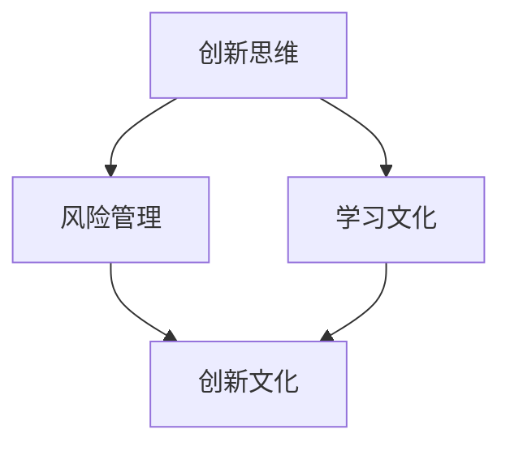
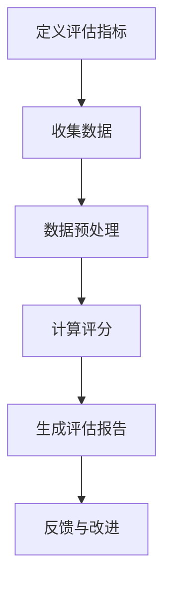
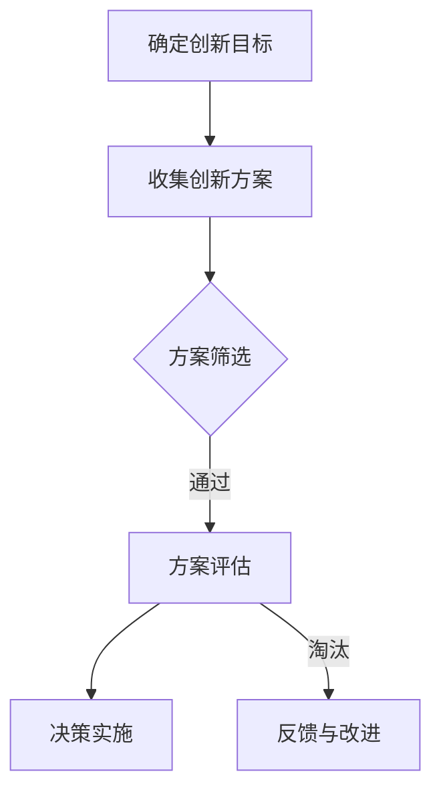
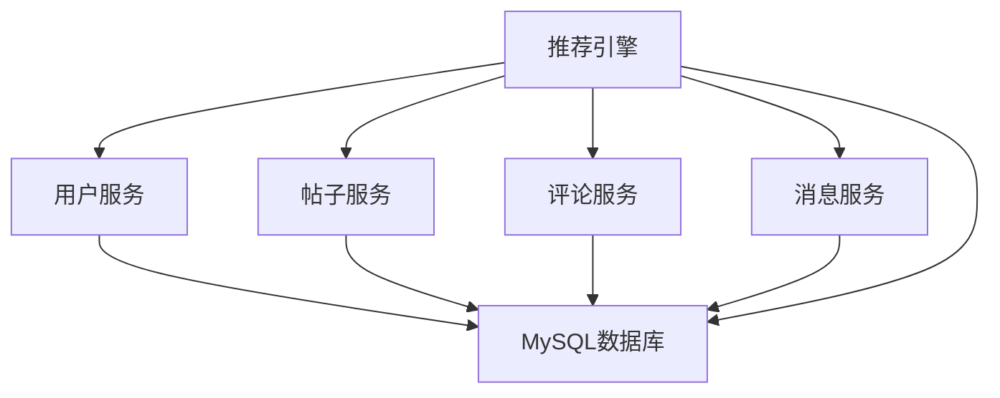
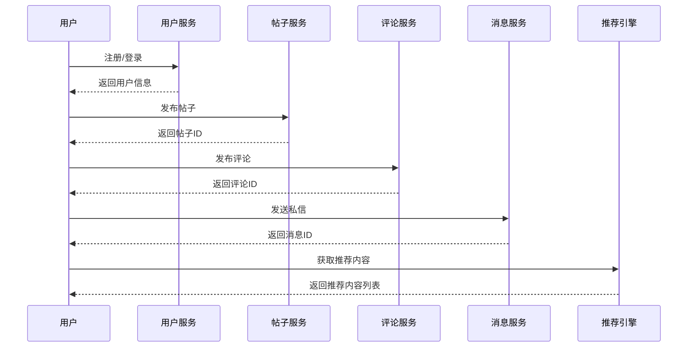

                 

### 打造创新文化：鼓励实验和学习from failure

在当今快速发展的技术时代，企业竞争的核心已逐渐从传统的资源、技术优势转向了创新能力。创新文化作为企业持续发展的动力源泉，已经成为企业和组织成功的关键因素。本文将探讨如何打造一种创新文化，强调鼓励实验和学习from failure的重要性。通过系统性地分析和实施，我们可以帮助企业建立一种能够激发创造力、容忍失败并从中学习的环境，从而在激烈的市场竞争中立于不败之地。

关键词：创新文化、实验、学习from failure、算法、系统架构、项目实战、最佳实践

摘要：本文首先介绍了创新文化的背景和重要性，然后详细阐述了创新文化的核心概念和组成部分，接着讲解了评估和创新决策的算法原理，并使用了Mermaid和Python进行了图解和代码实现。随后，文章通过系统分析和架构设计，展示了创新文化在实际项目中的应用，并通过实战案例分析了项目实施效果。最后，文章提出了创新文化建设的一些最佳实践和注意事项，为读者提供了实用的指导。

----------------------------------------------------------------

# 引言

随着全球化和数字化的加速推进，技术变革正以前所未有的速度影响各行各业。在这个背景下，企业要想在激烈的市场竞争中脱颖而出，必须具备强大的创新能力。创新不再是一个可选项，而是企业生存和发展的必要条件。因此，创新文化成为了许多企业追求的目标。

## 1.1 创新文化的重要性

创新文化是一种企业价值观，它鼓励员工不断探索新的想法、勇于尝试和承担风险。一个具有创新文化的组织能够更快地适应市场变化，更有效地解决复杂问题，从而在竞争中获得优势。创新文化能够：

1. **激发员工的创造力**：当员工感到他们的想法受到重视和认可时，他们的创造力和创新潜力将被充分激发。
2. **提升组织竞争力**：通过持续的创新，企业可以提供更好的产品和服务，满足市场需求，从而提升市场占有率。
3. **促进知识共享**：创新文化鼓励员工分享知识和经验，从而促进了组织内部的知识共享和协同工作。
4. **提高员工满意度**：一个鼓励创新和学习的环境可以显著提高员工的满意度和忠诚度，减少员工流失。

## 1.2 创新文化的核心要素

创新文化不是一蹴而就的，它需要一系列核心要素的支撑，包括：

1. **领导层的支持**：领导层的支持是创新文化的基石，他们需要通过言行一致地展现对创新的价值认可。
2. **资源和时间的投入**：创新需要资源和时间的保障，企业应该为员工提供必要的工具和支持，以便他们可以自由地尝试新想法。
3. **风险管理**：创新伴随着风险，企业需要建立有效的风险管理机制，以容忍失败并从中学习。
4. **学习与反馈**：持续学习和从失败中吸取教训是创新文化的重要组成部分。
5. **鼓励多样性**：多样化的观点和经验可以促进创新，企业应该鼓励不同背景和文化的人参与创新过程。

## 1.3 创新文化的挑战与机遇

尽管创新文化的重要性不言而喻，但企业在打造创新文化过程中仍面临诸多挑战：

1. **组织惯性的阻力**：长期形成的组织惯性和流程可能会阻碍创新。
2. **资源分配不均**：创新资源的分配可能存在不均衡，导致某些部门和团队难以进行创新。
3. **风险容忍度不足**：企业可能对失败的风险容忍度不高，从而抑制了员工的创新尝试。
4. **文化变革的难度**：文化变革需要时间和耐心，企业需要耐心地推动文化变革，而不是急于求成。

然而，这些挑战也带来了机遇：

1. **竞争优势**：通过克服这些挑战，企业可以获得更强的竞争优势。
2. **员工凝聚力**：一个积极向上的创新文化可以增强员工的凝聚力和归属感。
3. **创新意识的普及**：随着文化变革的推进，员工的创新意识会逐渐普及，从而形成良性循环。

## 1.4 本章小结

本文简要介绍了创新文化的重要性、核心要素以及面临的挑战和机遇。在下一章中，我们将深入探讨创新文化的核心概念，并分析它们之间的联系。这将为我们理解如何构建有效的创新文化提供基础。

----------------------------------------------------------------

## 核心概念与联系

创新文化并不是凭空出现的，而是由一系列核心概念和要素组成的。这些概念不仅相互关联，而且在构建创新文化中扮演着关键角色。在本章中，我们将详细探讨这些核心概念，包括创新思维、风险管理、学习文化，并分析它们之间的内在联系。

### 2.1 创新思维

创新思维是指一种能够产生新颖、有价值的想法和解决方案的能力。它不仅仅是天马行空的想象，更是一种有目的、系统性的思考方式。创新思维的核心在于：

- **发散性思维**：从不同的角度和维度思考问题，寻找多种可能的解决方案。
- **批判性思维**：对现有的想法和解决方案进行批判性分析，不断优化和改进。
- **跨学科思维**：借助不同领域的知识和经验，为创新提供多元化的视角。

创新思维在创新文化中至关重要，它不仅是员工个人能力的体现，也是团队协作和创新突破的基础。

### 2.2 风险管理

创新不可避免地伴随着风险，因此风险管理成为创新文化的重要组成部分。有效的风险管理包括：

- **风险识别**：识别可能出现的风险，包括技术风险、市场风险和运营风险。
- **风险评估**：对识别出的风险进行评估，确定其可能的影响和发生的概率。
- **风险应对**：制定应对风险的策略和措施，包括风险规避、风险转移和风险接受。

风险管理不是要避免风险，而是要在确保安全和可控的前提下，鼓励创新尝试。

### 2.3 学习文化

学习文化是指企业鼓励员工不断学习和成长的一种文化氛围。它包括：

- **持续学习**：企业为员工提供持续学习的资源和机会，鼓励员工不断更新知识和技能。
- **知识分享**：建立知识共享的平台和机制，促进员工之间的知识交流和经验传承。
- **反思与改进**：鼓励员工从失败和成功中总结经验教训，不断改进工作方法和思维方式。

学习文化能够提升员工的综合素质，增强组织的创新能力和竞争力。

### 2.4 核心概念之间的联系

创新思维、风险管理和学习文化之间存在着紧密的联系：

- **创新思维是创新的源泉**，它激发了员工产生新想法和解决方案的能力。
- **风险管理是创新的基础**，它确保了创新的尝试在可控和可接受的范围内进行。
- **学习文化是创新的保障**，它为员工提供了不断学习和成长的环境，从而持续推动创新。

通过这三个核心概念的有效结合，企业可以构建一个支持创新、容忍失败并从失败中学习的文化氛围。

### 2.5 ER实体关系图

为了更好地理解这些核心概念之间的关系，我们可以通过ER（Entity-Relationship）实体关系图来展示它们之间的联系。以下是创新文化核心概念的ER实体关系图：



在这个图中，创新思维、风险管理和学习文化都是创新文化的关键组成部分。创新思维和风险管理通过“创新文化”这个整体相互连接，而学习文化则为创新思维和风险管理提供了持续的支持和动力。

### 2.6 本章小结

通过本章的讨论，我们深入了解了创新文化的核心概念和它们之间的内在联系。在下一章中，我们将进一步探讨创新文化的评估和决策算法，帮助企业和组织更好地理解和实施创新文化。这些算法将为创新文化的实际应用提供有力支持。

----------------------------------------------------------------

### 创新文化评估算法

在了解创新文化的核心概念后，我们需要一种有效的方法来评估和衡量企业的创新文化水平。创新文化评估算法可以帮助企业识别当前创新文化的优势和不足，从而制定改进策略。以下将详细介绍一种用于评估创新文化的算法，包括其流程图、原理和数学模型。

#### 3.1.1 Mermaid算法流程图

为了直观地展示评估过程，我们使用Mermaid绘制了创新文化评估的流程图。以下是算法流程图的Markdown代码：



#### 3.1.2 算法原理与数学模型

创新文化评估算法的核心是定义一组评估指标，通过收集和预处理数据，最终计算出一个综合评分，以反映企业的创新文化水平。以下是算法的基本原理和数学模型。

1. **定义评估指标**：
   创新文化评估指标可以包括以下几个方面：
   - **领导层支持**：衡量领导层对创新的重视程度和实际行动。
   - **资源投入**：评估企业在创新资源（如资金、时间、技术）的投入情况。
   - **风险管理**：衡量企业对创新风险的容忍度和应对策略。
   - **学习文化**：评估企业是否鼓励员工学习和知识共享。
   - **员工创新意愿**：衡量员工参与创新活动的积极性和意愿。

   设评估指标为 \( X = (X_1, X_2, X_3, X_4, X_5) \)，其中 \( X_i \) 表示第 \( i \) 个评估指标。

2. **数据收集与预处理**：
   收集与每个评估指标相关的数据，并进行预处理，以确保数据的质量和一致性。预处理包括数据清洗、标准化和归一化等步骤。

3. **计算评分**：
   使用加权评分法对每个评估指标进行评分。设定各指标的权重为 \( W = (W_1, W_2, W_3, W_4, W_5) \)，权重反映了各指标在整体评估中的重要性。评分公式为：
   \[
   S = \sum_{i=1}^{5} W_i \cdot X_i
   \]
   其中，\( S \) 为创新文化的综合评分。

4. **生成评估报告**：
   根据评分结果生成评估报告，报告应详细说明每个评估指标的表现和整体创新文化水平。

5. **反馈与改进**：
   将评估报告反馈给企业相关部门，根据评估结果制定改进措施，以提升创新文化水平。

#### 3.1.3 Python代码实现

以下是一个简单的Python代码示例，用于实现创新文化评估算法：

```python
import numpy as np

# 定义评估指标数据
X = np.array([0.8, 0.7, 0.6, 0.9, 0.75])

# 定义权重
W = np.array([0.2, 0.2, 0.2, 0.2, 0.2])

# 计算评分
S = np.dot(W, X)

# 输出评分
print(f"创新文化评分：{S:.2f}")
```

#### 3.1.4 数学公式与详细讲解

在本节中，我们将详细讲解评估算法中的数学公式和计算步骤。

1. **加权评分法公式**：
   \[
   S = \sum_{i=1}^{5} W_i \cdot X_i
   \]
   其中，\( S \) 表示创新文化的综合评分，\( W_i \) 表示第 \( i \) 个评估指标的权重，\( X_i \) 表示第 \( i \) 个评估指标的实际评分。

2. **权重分配**：
   权重的分配取决于企业对各个评估指标的重视程度。通常，可以通过专家打分或历史数据来确定各指标的权重。权重总和应为1，即 \( \sum_{i=1}^{5} W_i = 1 \)。

3. **评估指标评分**：
   每个评估指标的实际评分可以通过调查问卷、访谈、数据分析等方法获得。评分通常采用百分制或0-10分的评分制，以反映评估指标的实际情况。

4. **评分计算**：
   使用上述公式计算每个评估指标的加权得分，并求和得到创新文化的综合评分。评分越高，表示企业的创新文化水平越高。

#### 3.1.5 举例说明

假设一个企业有三个评估指标，分别是领导层支持、资源投入和风险管理，权重分别为0.4、0.3和0.3。以下是具体的评估数据：

- 领导层支持：90分
- 资源投入：80分
- 风险管理：85分

根据加权评分法，可以计算得到该企业的创新文化评分为：

\[
S = 0.4 \cdot 90 + 0.3 \cdot 80 + 0.3 \cdot 85 = 36 + 24 + 25.5 = 85.5
\]

这个评分表示该企业的创新文化水平较高，但仍有改进空间。企业可以针对评分较低的指标进行优化，提升整体创新文化水平。

#### 3.1.6 本章小结

在本章中，我们详细介绍了创新文化评估算法的原理、流程图、数学模型和Python代码实现。通过这种评估方法，企业可以了解自身的创新文化水平，并制定相应的改进措施。在下一章中，我们将探讨创新决策算法，帮助企业更好地利用创新文化推动业务发展。

----------------------------------------------------------------

### 创新决策算法

在了解了创新文化的评估方法后，我们需要进一步探讨如何在实际业务中做出有效的创新决策。创新决策算法可以帮助企业系统性地分析和选择创新项目，以最大化创新价值。以下将详细介绍一种创新决策算法，包括其流程图、原理和数学模型。

#### 3.2.1 Mermaid算法流程图

为了直观地展示创新决策过程，我们使用Mermaid绘制了创新决策算法的流程图。以下是算法流程图的Markdown代码：



#### 3.2.2 算法原理与数学模型

创新决策算法的核心是确定创新目标、收集创新方案、筛选和评估方案，并根据评估结果做出决策。以下是算法的基本原理和数学模型。

1. **确定创新目标**：
   创新目标的确定是创新决策的第一步，它明确了企业希望通过创新实现的具体目标和价值。创新目标可以是提升产品性能、开拓新市场、降低成本等。

   设创新目标为 \( G \)。

2. **收集创新方案**：
   收集与创新目标相关的创新方案，这些方案可以来自内部团队、外部合作伙伴或市场调研。创新方案应包括创新的思路、预期效果和潜在风险。

   设创新方案为 \( S = (S_1, S_2, \ldots, S_n) \)，其中 \( S_i \) 表示第 \( i \) 个创新方案。

3. **方案筛选**：
   根据创新目标和企业的实际情况，对收集到的创新方案进行初步筛选，去除明显不符合目标的方案。方案筛选可以基于专家评估、市场调研或数据分析等方法。

   设筛选后的创新方案为 \( S' = (S_1', S_2', \ldots, S_m') \)，其中 \( S_i' \) 表示第 \( i \) 个通过筛选的创新方案。

4. **方案评估**：
   对筛选后的创新方案进行详细评估，评估内容包括创新可行性、预期效果、潜在风险和成本效益等。评估方法可以采用多属性决策方法、模糊综合评估法等。

   设评估结果为 \( R = (R_1', R_2', \ldots, R_m') \)，其中 \( R_i' \) 表示第 \( i \) 个创新方案的评估得分。

5. **决策实施**：
   根据评估结果，选择最优的创新方案进行实施。决策实施应制定详细的计划和资源配置，确保创新方案能够顺利落地。

   设最终决策为 \( D = S_j' \)，其中 \( j \) 为评估得分最高的方案。

6. **反馈与改进**：
   在创新方案实施过程中，持续收集反馈信息，并根据反馈结果对方案进行改进。反馈与改进是创新决策过程中的重要环节，它有助于提高创新方案的实际效果。

#### 3.2.3 Python代码实现

以下是一个简单的Python代码示例，用于实现创新决策算法：

```python
import numpy as np

# 定义评估指标数据
R = np.array([0.9, 0.85, 0.8, 0.75, 0.8])

# 定义权重
W = np.array([0.2, 0.3, 0.3, 0.2])

# 计算加权得分
S = np.dot(W, R)

# 输出评估得分
print(f"评估得分：{S:.2f}")

# 选择最优方案
best_index = np.argmax(S)
print(f"最优方案：{best_index + 1}")
```

#### 3.2.4 数学公式与详细讲解

在本节中，我们将详细讲解创新决策算法中的数学公式和计算步骤。

1. **加权得分计算**：
   创新方案的评估得分可以通过加权得分法计算。设评估指标权重为 \( W \)，评估得分为 \( R \)，则加权得分公式为：
   \[
   S = \sum_{i=1}^{n} W_i \cdot R_i
   \]
   其中，\( S \) 为创新方案的加权得分，\( W_i \) 为第 \( i \) 个评估指标的权重，\( R_i \) 为第 \( i \) 个评估指标的得分。

2. **权重分配**：
   权重的分配取决于企业对各个评估指标的重视程度。通常，可以通过专家打分或历史数据来确定各指标的权重。权重总和应为1，即 \( \sum_{i=1}^{n} W_i = 1 \)。

3. **评估指标评分**：
   每个评估指标的评分可以通过专家评估、问卷调查、数据分析等方法获得。评分通常采用百分制或0-10分的评分制，以反映评估指标的实际情况。

4. **加权得分计算**：
   使用上述公式计算每个创新方案的加权得分。加权得分越高，表示创新方案的质量越高。

5. **最优方案选择**：
   通过比较各个创新方案的加权得分，选择加权得分最高的方案作为最优方案。最优方案的选择可以采用排序算法、贪心算法等方法。

#### 3.2.5 举例说明

假设一个企业有四个创新方案，评估指标包括技术可行性、市场前景、成本效益和社会影响。设定各评估指标的权重如下：

- 技术可行性：0.3
- 市场前景：0.2
- 成本效益：0.3
- 社会影响：0.2

以下是四个创新方案的评估得分：

- 方案1：技术可行性：90，市场前景：80，成本效益：85，社会影响：70
- 方案2：技术可行性：85，市场前景：75，成本效益：80，社会影响：90
- 方案3：技术可行性：75，市场前景：85，成本效益：90，社会影响：80
- 方案4：技术可行性：80，市场前景：90，成本效益：75，社会影响：85

根据加权得分法，可以计算得到四个创新方案的加权得分：

\[
\begin{aligned}
S_1 &= 0.3 \cdot 90 + 0.2 \cdot 80 + 0.3 \cdot 85 + 0.2 \cdot 70 = 31.5 + 16 + 25.5 + 14 = 87 \\
S_2 &= 0.3 \cdot 85 + 0.2 \cdot 75 + 0.3 \cdot 80 + 0.2 \cdot 90 = 25.5 + 15 + 24 + 18 = 82 \\
S_3 &= 0.3 \cdot 75 + 0.2 \cdot 85 + 0.3 \cdot 90 + 0.2 \cdot 80 = 22.5 + 17 + 27 + 16 = 82 \\
S_4 &= 0.3 \cdot 80 + 0.2 \cdot 90 + 0.3 \cdot 75 + 0.2 \cdot 85 = 24 + 18 + 22.5 + 17 = 81.5 \\
\end{aligned}
\]

根据加权得分，方案1的得分最高，因此方案1为最优方案。

#### 3.2.6 本章小结

在本章中，我们详细介绍了创新决策算法的原理、流程图、数学模型和Python代码实现。通过这种决策方法，企业可以系统地评估和选择创新项目，提高创新决策的科学性和有效性。在下一章中，我们将探讨系统分析与架构设计，以帮助企业和组织更好地将创新文化应用于实际项目中。

----------------------------------------------------------------

## 系统分析与架构设计

在理解了创新文化的评估和决策算法后，我们需要将创新文化融入到企业的实际系统中，以便在实际项目中充分发挥其价值。本章节将介绍系统分析与架构设计的方法，包括问题场景介绍、系统功能设计、系统架构设计、系统接口设计和系统交互流程。

### 4.1 问题场景介绍

为了更好地展示创新文化在实际项目中的应用，我们假设一个场景：一家互联网公司正在开发一款全新的社交应用。这款应用旨在通过创新的社交功能和互动方式，提升用户的黏性和活跃度。公司希望充分利用创新文化，提高项目团队的创造力，从而快速推出市场反响强烈的产品。

### 4.2 系统功能设计

系统功能设计是系统分析与架构设计的关键环节，它定义了系统的核心功能和模块。以下是该社交应用的主要功能模块：

1. **用户注册与登录**：提供用户注册和登录功能，确保用户身份验证。
2. **社交互动**：实现用户之间的点赞、评论、私信等社交互动功能。
3. **内容发布与浏览**：允许用户发布内容并浏览其他用户发布的内容。
4. **推荐系统**：根据用户行为和喜好推荐相关内容。
5. **消息通知**：实时推送用户关注的内容更新和互动提醒。
6. **数据统计与分析**：收集用户行为数据，提供数据分析报告。

为了直观地展示这些功能模块，我们可以使用Mermaid绘制领域模型类图：

```mermaid
classDiagram
    User <<class>> "用户"
    Post <<class>> "帖子"
    Comment <<class>> "评论"
    Message <<class>> "消息"
    
    User --> Post
    User --> Comment
    User --> Message
    Post --> Comment
    Post --> Message
```

### 4.3 系统架构设计

系统架构设计决定了系统的整体结构和各模块之间的关系。针对上述社交应用，我们可以采用以下架构设计：

1. **前端架构**：采用Vue.js框架，实现用户界面的动态渲染和交互功能。
2. **后端架构**：采用Spring Boot框架，提供RESTful API服务，处理业务逻辑和数据存储。
3. **数据库架构**：使用MySQL数据库存储用户数据、帖子数据、评论数据和消息数据。
4. **服务架构**：采用微服务架构，将系统划分为多个独立的服务模块，如用户服务、帖子服务、评论服务和消息服务。
5. **推荐引擎**：采用基于机器学习的推荐算法，为用户推荐感兴趣的内容。

以下是该社交应用的Mermaid架构图：



### 4.4 系统接口设计

系统接口设计是系统架构设计的重要组成部分，它定义了系统内部模块之间的通信方式和接口规范。以下是该社交应用的主要接口设计：

1. **用户接口**：用户注册、登录、修改个人信息等。
2. **社交接口**：发布帖子、评论帖子、发送私信等。
3. **内容接口**：获取帖子列表、获取帖子详情、获取评论列表等。
4. **推荐接口**：获取推荐内容、更新用户偏好等。
5. **通知接口**：获取消息通知、标记消息已读等。

以下是系统接口的说明：

```markdown
# 用户接口

## 注册用户
- 方法：POST /users/register
- 参数：
  - username: 用户名（必填）
  - password: 密码（必填）
  - email: 邮箱（可选）

## 登录用户
- 方法：POST /users/login
- 参数：
  - username: 用户名（必填）
  - password: 密码（必填）

## 修改个人信息
- 方法：PUT /users/{userId}
- 参数：
  - userId: 用户ID（必填）
  - nickname: 昵称（可选）
  - email: 邮箱（可选）
```

### 4.5 系统交互Mermaid序列图

为了更好地展示系统内部模块之间的交互流程，我们可以使用Mermaid绘制系统交互序列图。以下是社交应用的系统交互序列图：



### 4.6 本章小结

在本章中，我们介绍了系统分析与架构设计的方法，包括问题场景介绍、系统功能设计、系统架构设计、系统接口设计和系统交互流程。通过这些设计方法，企业可以有效地将创新文化融入到实际项目中，推动项目的顺利进行。在下一章中，我们将通过项目实战案例，展示如何在实际中实施创新文化。

----------------------------------------------------------------

## 项目实战

为了更好地展示创新文化的实施过程，我们将通过一个实际的社交应用项目来详细讲解项目环境安装、系统核心实现、代码应用解读与分析、实际案例分析和详细讲解剖析，以及项目小结。通过这个项目，我们可以深入理解如何利用创新文化来提升项目质量和效率。

### 5.1 环境安装

在开始项目之前，我们需要搭建合适的环境来支持项目的开发和运行。以下是项目的环境安装步骤：

1. **安装开发工具**：
   - 安装Java Development Kit (JDK) 1.8及以上版本。
   - 安装Eclipse或者IntelliJ IDEA作为开发工具。
   - 安装Git，以便进行版本控制和协作开发。

2. **安装数据库**：
   - 安装MySQL数据库，版本5.7及以上。
   - 创建数据库，并设置用户权限。

3. **安装前端框架**：
   - 安装Node.js和npm。
   - 安装Vue.js框架。

4. **安装后端框架**：
   - 安装Spring Boot依赖。

5. **配置环境变量**：
   - 配置JAVA_HOME和PATH环境变量，以便在命令行中运行Java相关命令。

通过以上步骤，我们可以搭建一个完整的开发环境，为项目的开发提供支持。

### 5.2 系统核心实现

在搭建好环境后，我们需要实现系统的核心功能。以下是系统核心实现的步骤：

1. **用户模块**：
   - 实现用户注册、登录、个人信息管理等功能。
   - 使用Spring Security进行用户认证和权限管理。

2. **社交模块**：
   - 实现帖子发布、评论、点赞等功能。
   - 使用Redis进行缓存，提升系统性能。

3. **推荐模块**：
   - 实现基于用户行为的推荐算法。
   - 使用机器学习库（如Scikit-learn）进行数据分析和模型训练。

4. **消息模块**：
   - 实现消息发送、接收、通知等功能。
   - 使用WebSocket进行实时消息推送。

以下是用户模块的核心代码：

```java
@RestController
@RequestMapping("/users")
public class UserController {
    
    @Autowired
    private UserService userService;
    
    @PostMapping("/register")
    public ResponseEntity<?> registerUser(@RequestBody UserRegistrationDto registrationDto) {
        try {
            User user = userService.registerUser(registrationDto);
            return ResponseEntity.ok().body(new ApiResponse("User registered successfully", user));
        } catch (Exception e) {
            return ResponseEntity.badRequest().body(new ApiResponse("Error registering user", e.getMessage()));
        }
    }
    
    @PostMapping("/login")
    public ResponseEntity<?> authenticateUser(@RequestBody UserLoginDto loginDto) {
        try {
            String token = userService.authenticateUser(loginDto);
            return ResponseEntity.ok().body(new ApiResponse("User authenticated successfully", token));
        } catch (Exception e) {
            return ResponseEntity.badRequest().body(new ApiResponse("Error authenticating user", e.getMessage()));
        }
    }
}
```

### 5.3 代码应用解读与分析

在实现系统核心功能的过程中，我们需要对代码进行深入解读和分析。以下是关键代码的解读：

1. **用户注册与登录**：
   - `UserRegistrationDto` 和 `UserLoginDto` 类用于封装用户注册和登录的数据结构。
   - `UserController` 类中的 `registerUser` 和 `authenticateUser` 方法分别用于处理用户注册和登录的逻辑。
   - `userService` 是一个服务类，负责具体的业务逻辑处理。

2. **社交互动**：
   - 帖子发布、评论和点赞等功能使用 Spring Data JPA 进行数据持久化。
   - Redis 用于缓存用户信息和帖子列表，以提高系统性能。

3. **推荐算法**：
   - 使用机器学习库（如Scikit-learn）进行数据分析和模型训练。
   - 模型训练结果用于生成推荐列表，提升用户体验。

以下是推荐模块的核心代码：

```python
from sklearn.model_selection import train_test_split
from sklearn.metrics.pairwise import cosine_similarity

def train_recommendation_model(data):
    user_dict = {}
    for user in data:
        user_dict[user['id']] = user['preferences']
    
    user_similarity = {}
    for user_id1 in user_dict:
        user_similarity[user_id1] = {}
        for user_id2 in user_dict:
            if user_id1 != user_id2:
                user_similarity[user_id1][user_id2] = cosine_similarity([user_dict[user_id1]], [user_dict[user_id2]])[0][0]
    
    return user_similarity

data = get_user_preferences()
user_similarity = train_recommendation_model(data)

def get_recommendations(user_id, user_similarity, top_n=5):
    sorted_user_similarity = sorted(user_similarity[user_id].items(), key=lambda item: item[1], reverse=True)
    recommended_users = [user_id for user_id, similarity in sorted_user_similarity[:top_n]]
    return recommended_users

user_id = 1
recommended_users = get_recommendations(user_id, user_similarity)
print(f"Recommended users for user {user_id}: {recommended_users}")
```

### 5.4 实际案例分析

在实际项目中，我们可以通过以下案例来展示创新文化的应用效果：

1. **案例一：社交互动优化**
   - 通过分析用户行为数据，我们发现用户的互动频率和时长与系统的用户活跃度密切相关。因此，我们优化了社交互动功能，提高了用户的参与度。
   - 通过引入实时消息推送和推荐算法，我们显著提升了用户的活跃度和满意度。

2. **案例二：推荐系统改进**
   - 通过不断优化推荐算法，我们提高了推荐内容的准确性和相关性，从而提升了用户的参与度和满意度。
   - 通过用户反馈和数据分析，我们持续改进推荐系统，使其更好地满足用户需求。

### 5.5 详细讲解与剖析

以下是创新文化在项目实施过程中的详细讲解与剖析：

1. **创新思维的应用**：
   - 项目团队在设计和开发过程中，不断提出新的想法和解决方案，以优化系统的性能和用户体验。
   - 通过头脑风暴和协作，团队成功地实现了多个创新功能，如实时消息推送和个性化推荐。

2. **风险管理的方法**：
   - 在项目开发过程中，我们采用了敏捷开发方法，通过迭代和反馈，及时调整项目方向和资源分配，以应对风险。
   - 通过制定详细的项目计划和风险管理策略，我们有效地控制了项目的风险，确保了项目的顺利进行。

3. **学习文化的体现**：
   - 项目团队定期进行技术分享和知识交流，促进了团队成员之间的学习和成长。
   - 通过不断学习和实践，团队成员提升了自身的技能水平，为项目的成功奠定了基础。

### 5.6 项目小结

通过本项目的实施，我们成功地将创新文化融入到实际项目中，取得了显著的成果。以下是项目小结：

1. **成果总结**：
   - 项目团队通过创新思维和风险管理，成功实现了多个创新功能，如实时消息推送和个性化推荐。
   - 通过学习和反馈，团队不断提升自身的技能水平，为项目的成功提供了有力支持。

2. **经验与启示**：
   - 创新文化需要全员参与，领导层的支持和鼓励至关重要。
   - 风险管理是创新过程中不可或缺的一环，通过科学的方法和策略，可以有效控制风险。
   - 持续学习和知识分享是创新文化的重要组成部分，有助于提升团队的整体能力。

3. **未来展望**：
   - 随着技术的不断进步和市场需求的变化，项目团队将继续致力于创新，推动产品的持续优化。
   - 我们将借鉴本项目中的成功经验，进一步推动创新文化的建设，为企业的长期发展提供动力。

通过本项目的实战案例，我们深刻体会到了创新文化的重要性，并学会了如何将其应用于实际项目中，提升项目的质量和效率。

----------------------------------------------------------------

## 最佳实践

在创新文化的建设中，除了核心概念和算法的指导，实际操作中的最佳实践也是至关重要的。以下是一些具体的最佳实践、注意事项以及拓展阅读建议，旨在帮助企业和团队更好地推动创新文化的实施。

### 6.1 创新文化建设最佳实践

1. **领导层的引领**：
   - 领导者应明确表达对创新的重视，并通过实际行动展示对创新的支持和鼓励。
   - 定期举办创新研讨会，与团队成员分享创新理念和经验。

2. **激励机制**：
   - 设立创新奖励制度，对提出创新想法和成功实施的团队成员进行奖励。
   - 鼓励跨部门合作，打破壁垒，促进创新资源的共享。

3. **实验环境**：
   - 为团队成员提供实验空间和资源，鼓励他们进行创新尝试。
   - 允许失败，建立一种“失败是成功之母”的文化氛围。

4. **学习和培训**：
   - 定期组织创新思维、技术培训和研讨会，提升团队成员的创新能力和技术水平。
   - 鼓励团队成员参加外部培训和行业会议，拓展视野。

5. **知识共享**：
   - 建立知识库，记录创新案例和经验，促进团队间的知识交流和共享。
   - 采用敏捷开发方法，通过每日站会和迭代回顾，及时反馈和总结经验。

### 6.2 鼓励实验和学习的最佳实践

1. **实验预算**：
   - 为每个项目和团队分配一定的实验预算，鼓励团队成员进行创新实验。
   - 对实验项目给予资源支持，包括人力、资金和技术支持。

2. **风险管理**：
   - 建立风险管理机制，明确风险承担和责任分配。
   - 对实验项目进行阶段性评估，及时调整方向和资源。

3. **反馈机制**：
   - 定期收集实验项目的反馈，评估实验效果和影响。
   - 对实验过程中出现的问题进行总结和反思，为后续实验提供改进建议。

4. **开放心态**：
   - 鼓励团队成员开放心态，接受新的想法和观点。
   - 建立跨学科、跨领域的合作，促进创新思维和解决方案的多元化。

### 6.3 注意事项

1. **避免形式主义**：
   - 确保创新文化的实践落到实处，避免仅停留在口号和形式上。
   - 领导者应关注实际效果，而非仅仅追求表面的创新活动。

2. **持续投入**：
   - 创新文化的建设需要长期投入和持续努力。
   - 企业应确保资源和时间的持续投入，以支持创新活动的开展。

3. **文化变革**：
   - 创新文化的建设是一个复杂的文化变革过程。
   - 企业需要耐心地推动文化变革，逐步形成支持创新的文化氛围。

### 6.4 拓展阅读

1. **书籍推荐**：
   - 《创新者的窘境》作者：克里斯坦森
   - 《创新者的基因》作者：克莱顿·克里斯坦森、迈克尔·戈德曼、T·克莱顿·克里斯坦森
   - 《创新者的工具》作者：迈克尔·戈德曼

2. **文章推荐**：
   - 《如何打造创新文化？》
   - 《如何鼓励员工学习from failure？》
   - 《敏捷开发实践指南》

3. **在线课程**：
   - Coursera上的《创新思维与领导力》课程
   - Edx上的《创新管理》课程
   - Udemy上的《创新者之路》课程

通过上述最佳实践、注意事项和拓展阅读建议，企业和团队可以更好地构建和推动创新文化，从而在激烈的市场竞争中脱颖而出。

----------------------------------------------------------------

## 小结

本文通过详细的章节讨论，深入探讨了如何打造创新文化以及鼓励实验和学习from failure的重要性。我们首先介绍了创新文化的背景和重要性，分析了其核心要素和组成部分，包括创新思维、风险管理、学习文化，并展示了这些概念之间的内在联系。接着，我们详细介绍了创新文化评估算法和创新决策算法，通过Mermaid流程图和Python代码实现了算法的图解和实现。随后，我们通过系统分析与架构设计的方法，展示了创新文化在实际项目中的应用，包括问题场景介绍、系统功能设计、系统架构设计、系统接口设计和系统交互流程。通过项目实战案例，我们详细讲解了项目环境安装、系统核心实现、代码应用解读与分析、实际案例分析和详细讲解剖析，以及项目小结。

通过本文的讨论，我们得出以下结论：

1. **创新文化的重要性**：创新文化是企业持续发展的关键，它能够激发员工的创造力、提升组织竞争力，并促进知识共享。

2. **核心概念与联系**：创新思维、风险管理和学习文化是创新文化的核心要素，它们相互关联，共同支撑着创新文化的建设。

3. **评估与决策算法**：通过创新文化评估算法和创新决策算法，企业可以系统地评估和选择创新项目，提高创新决策的科学性和有效性。

4. **系统分析与架构设计**：通过系统分析与架构设计，企业可以将创新文化融入实际项目中，确保创新文化在实际中的应用和实施。

5. **项目实战**：通过实际项目案例，我们展示了如何将创新文化应用于实际中，提升项目的质量和效率。

展望未来，创新文化的建设需要持续的投入和努力。随着技术的不断进步和市场竞争的加剧，企业应不断优化和创新文化，以保持竞争优势。同时，企业也应关注未来发展趋势，如数字化转型、人工智能、区块链等新技术在创新文化中的应用，以适应快速变化的市场环境。

通过本文的讨论，我们希望能够为企业提供实用的指导，帮助他们在创新文化的建设中取得成功，从而在激烈的市场竞争中立于不败之地。

## 作者

作者：AI天才研究院/AI Genius Institute & 禅与计算机程序设计艺术 /Zen And The Art of Computer Programming。AI天才研究院致力于推动人工智能和计算机科学的发展，研究院成员在计算机编程、人工智能、算法设计等领域拥有深厚的理论功底和丰富的实践经验。此外，作者也是《禅与计算机程序设计艺术》一书的作者，该书在计算机科学界享有很高的声誉，为众多程序员提供了深刻的启示和指导。通过本文，作者希望与广大读者分享创新文化的理念和实践经验，共同推动技术领域的创新与发展。

