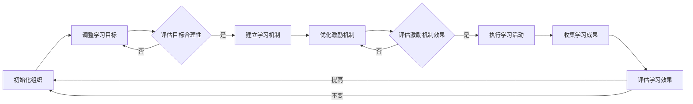
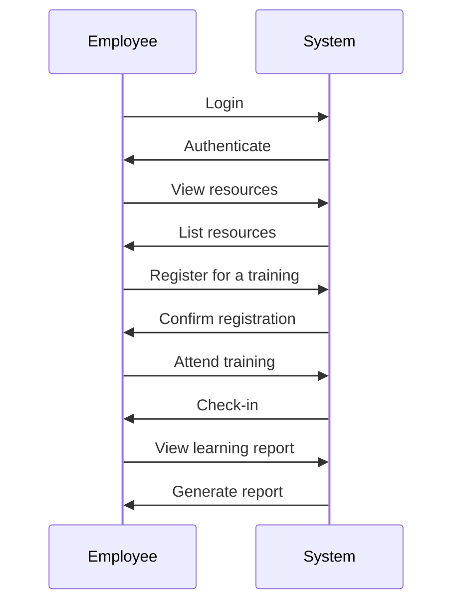

                 

### 文章标题

# 打造学习型组织：持续学习的团队文化

### 关键词

- 学习型组织
- 持续学习
- 团队文化
- 组织发展
- 教育培训

### 摘要

本文旨在探讨如何打造一个学习型组织，并培育一种持续的团队学习文化。通过深入分析学习型组织的定义、核心概念、战略规划、文化氛围、领导作用和个人发展等方面，本文提出了一系列具体实施步骤和最佳实践，以帮助组织实现持续学习与创新发展。文章最后，通过案例分析和未来展望，为读者提供了具体的操作指南和理论支持。

----------------------------------------------------------------

### 背景介绍

#### 核心概念术语说明

- **学习型组织**：一个持续学习、知识共享、快速适应和不断创新的组织。
- **持续学习**：一种将学习活动贯穿于日常工作，以提升个人和团队能力的行为模式。
- **团队文化**：团队成员共同遵循的价值观、行为准则和工作方式。

#### 问题背景

在当今快速变化和高度竞争的商业环境中，组织必须具备灵活性和创新能力才能生存和发展。然而，传统的组织结构和文化往往难以适应这种变化。学习型组织理念应运而生，旨在通过持续学习来提升组织的整体能力和竞争力。

#### 问题描述

组织面临的问题包括：员工能力不足、知识积累停滞、创新力下降等。这些问题直接影响了组织的绩效和可持续发展。

#### 问题解决

解决这些问题的关键在于构建一个学习型组织，通过以下步骤：

1. **明确学习目标**：设定清晰的学习目标，确保学习活动与组织战略一致。
2. **建立学习机制**：设计有效的学习流程和激励机制，鼓励员工参与学习。
3. **培养团队文化**：营造开放、协作和尊重知识的文化氛围。
4. **提供学习资源**：确保员工能够获取到所需的学习资源，如培训、书籍、网络课程等。
5. **评估学习效果**：定期评估学习成果，以调整学习策略和提高学习效率。

#### 边界与外延

- **边界**：本文主要关注于如何构建学习型组织，而未涉及具体的学习内容和培训方式。
- **外延**：学习型组织的概念可以扩展到各个领域，如学校、医院、非营利组织等。

#### 概念结构与核心要素组成

- **概念结构**：学习型组织由学习目标、学习机制、团队文化、学习资源和评估机制组成。
- **核心要素**：持续学习、知识共享、创新、灵活性和适应性。

----------------------------------------------------------------

### 核心概念与联系

#### 核心概念原理

**学习型组织**：强调通过学习和知识管理来提升组织的整体能力。它具备以下几个特征：

1. **自我超越**：追求更高的个人和团队目标。
2. **改善心智模式**：改变思维方式和行为习惯，以适应外部环境的变化。
3. **共同愿景**：建立共同的目标和价值观，形成强大的凝聚力。
4. **团队学习**：通过团队协作和学习，提升整体能力。

**持续学习**：是指组织和个人在日常生活中不断获取新知识、技能和经验的过程。持续学习的核心在于：

1. **终身学习**：将学习视为一种持续的过程，而非一次性的事件。
2. **主动学习**：积极参与各种学习活动，不断提升自身能力。
3. **实践学习**：将学习与工作相结合，通过实践来检验和深化知识。

**团队文化**：是组织成员共同遵循的价值观和行为准则。一个健康的团队文化应当：

1. **开放沟通**：鼓励成员之间进行开放和坦诚的交流。
2. **尊重知识**：尊重每位成员的知识和贡献，形成知识共享的氛围。
3. **共同成长**：关注团队成员的职业发展和个人成长。

#### 概念属性特征对比表格

| 特征 | 学习型组织 | 持续学习 | 团队文化 |
| --- | --- | --- | --- |
| 目标 | 提升组织整体能力 | 提升个人和团队能力 | 建立共同价值观和行为准则 |
| 特点 | 自我超越、共同愿景、团队学习 | 终身学习、主动学习、实践学习 | 开放沟通、尊重知识、共同成长 |
| 影响力 | 促进创新、提高竞争力 | 提升个人技能、适应变化 | 增强团队凝聚力、提升组织绩效 |

#### ER实体关系图架构

```mermaid
erDiagram
    LearningOrganization ||--|{ KnowledgeManagement } KnowledgeManagement
    LearningOrganization ||--|{ TeamCultivation } TeamCultivation
    ContinuousLearning ||--|{ LifelongLearning } LifelongLearning
    ContinuousLearning ||--|{ ActiveLearning } ActiveLearning
    ContinuousLearning ||--|{ PracticalLearning } PracticalLearning
    TeamCulture ||--|{ OpenCommunication } OpenCommunication
    TeamCulture ||--|{ RespectKnowledge } RespectKnowledge
    TeamCulture ||--|{ CommonGrowth } CommonGrowth
```

### 算法原理讲解

为了更好地理解学习型组织的构建过程，我们可以将其视为一个算法，该算法的输入是组织的初始状态，输出是经过学习后的组织状态。

#### 算法mermaid流程图



#### Python源代码实现

```python
import random

def initialize_organization():
    # 初始化组织状态
    organization = {
        'learning_target': None,
        'learning_mechanism': None,
        'incentive_mechanism': None,
        'learning_activities': [],
        'learning_results': []
    }
    return organization

def set_learning_target(organization):
    # 设定学习目标
    organization['learning_target'] = "提升团队的整体能力"
    return organization

def evaluate_target(organization):
    # 评估目标合理性
    if organization['learning_target'] is None:
        return False
    else:
        return True

def build_learning_mechanism(organization):
    # 建立学习机制
    organization['learning_mechanism'] = "定期组织培训、开展内部研讨会"
    return organization

def design_incentive_mechanism(organization):
    # 设计激励机制
    organization['incentive_mechanism'] = "完成学习任务后给予奖励"
    return organization

def evaluate_incentive(organization):
    # 评估激励机制效果
    if organization['incentive_mechanism'] is None:
        return False
    else:
        return True

def execute_learning_activities(organization):
    # 执行学习活动
    organization['learning_activities'].append("参加培训课程")
    organization['learning_activities'].append("开展内部研讨会")
    return organization

def collect_learning_results(organization):
    # 收集学习成果
    organization['learning_results'].append("提高了团队协作能力")
    organization['learning_results'].append("增强了团队创新意识")
    return organization

def evaluate_learning_effects(organization):
    # 评估学习效果
    if len(organization['learning_results']) > 0:
        return "提高"
    else:
        return "不变"

def main():
    organization = initialize_organization()
    organization = set_learning_target(organization)
    if not evaluate_target(organization):
        print("目标不合理，请重新设定。")
        return
    organization = build_learning_mechanism(organization)
    organization = design_incentive_mechanism(organization)
    if not evaluate_incentive(organization):
        print("激励机制不合理，请重新设计。")
        return
    execute_learning_activities(organization)
    collect_learning_results(organization)
    effect = evaluate_learning_effects(organization)
    if effect == "提高":
        print("组织状态已提升，继续下一轮学习。")
    else:
        print("组织状态未提升，请检查学习机制和激励机制。")

if __name__ == "__main__":
    main()
```

#### 算法原理与数学模型

算法的核心在于通过设定学习目标、建立学习机制、设计激励机制和执行学习活动，来提升组织的整体能力。这可以视为一个迭代过程，其数学模型可以表示为：

$$
\text{Organization}_{\text{new}} = f(\text{Organization}_{\text{current}}, \text{Learning\ Activity})
$$

其中，$f$ 表示学习过程，$\text{Organization}_{\text{new}}$ 表示新的组织状态，$\text{Organization}_{\text{current}}$ 表示当前的组织状态，$\text{Learning\ Activity}$ 表示执行的学习活动。

通过不断迭代这一过程，组织可以逐步提升其能力和竞争力。

#### 举例说明

假设一个组织设定了提升团队协作能力的学习目标，通过建立学习机制（如定期培训、内部研讨会）和设计激励机制（如完成学习任务后给予奖励），组织成员积极参与学习活动。经过一段时间的学习和实践，组织成员的协作能力得到显著提升，这反映了学习效果的提升。

```latex
\text{Organization}_{\text{new}} = f(\text{Organization}_{\text{current}}, \text{Learning\ Activity})
\quad \Rightarrow \quad \text{Organization}_{\text{new}} = \text{Organization}_{\text{current}} + \text{Learning\ Effect}
```

### 系统分析与架构设计方案

#### 问题场景介绍

在一个快速发展的科技公司，为了保持竞争力，管理层决定打造一个学习型组织，以提升员工的技能和团队的创新能力。这个系统的目标是确保所有员工都能够参与到持续学习的环境中，并通过有效的学习活动和激励机制来提升整体绩效。

#### 项目介绍

项目名称：学习型组织建设平台
项目背景：为了提高公司的整体竞争力和适应市场变化，决定实施学习型组织建设。
项目目标：
1. 提升员工专业技能和团队协作能力。
2. 建立持续学习的文化氛围。
3. 提高员工的满意度和留存率。

#### 系统功能设计

**1. 用户管理模块**
- 用户注册与登录：新员工可以注册账户，现有员工使用已有账户登录。
- 用户信息管理：员工可以查看和更新个人信息，如联系方式、技能水平等。

**2. 学习资源管理模块**
- 资源分类：根据学习内容将资源分为技术、管理、市场等类别。
- 资源上传与分享：员工可以上传自己的学习资料，并与团队共享。
- 资源搜索与推荐：提供关键字搜索和基于学习历史的数据推荐。

**3. 学习活动管理模块**
- 活动创建与发布：管理员可以创建和发布各种学习活动，如内部培训、研讨会等。
- 活动报名与签到：员工可以报名参加活动，并签到以记录学习经历。
- 活动反馈与评价：活动结束后，员工可以对活动进行评价，以供后续改进。

**4. 激励机制管理模块**
- 奖励设置：管理员可以设置奖励规则，如完成学习任务后给予积分、奖励等。
- 积分统计与兑换：员工可以查看自己的积分统计，并兑换相应的奖励。

**5. 数据分析与报告模块**
- 员工学习数据分析：分析员工的学习行为、学习效果等数据。
- 学习报告生成：根据数据分析结果生成各种报告，供管理层参考。

#### 系统架构设计

**1. 架构设计**
- **前端架构**：采用Vue.js框架，实现用户友好的交互界面。
- **后端架构**：采用Spring Boot框架，提供RESTful API接口，处理业务逻辑和数据存储。
- **数据库设计**：使用MySQL数据库存储用户信息、学习资源、学习活动、激励机制等数据。

**2. 系统接口设计**

- **用户接口**：用户登录、注册、个人信息管理、学习资源搜索、活动报名、签到、积分兑换等。
- **管理员接口**：创建和发布学习活动、设置奖励规则、生成学习报告等。

**3. 系统交互**



### 项目实战

#### 环境安装

在本地计算机上安装好以下软件和工具：
- JDK 1.8 或更高版本
- MySQL 5.7 或更高版本
- Node.js 10.x 或更高版本
- Vue CLI
- Spring Boot Tools for IntelliJ IDEA 或 Eclipse

#### 系统核心实现源代码

**后端源代码（Spring Boot）**

```java
// UserController.java
@RestController
@RequestMapping("/users")
public class UserController {
    
    @Autowired
    private UserService userService;

    @PostMapping("/register")
    public ResponseEntity<?> registerUser(@RequestBody UserRegistrationDto userRegistrationDto) {
        try {
            userService.registerUser(userRegistrationDto);
            return ResponseEntity.ok().body("User registered successfully!");
        } catch (Exception e) {
            return ResponseEntity.badRequest().body("Error registering user: " + e.getMessage());
        }
    }
    
    // Other user-related endpoints...
}

// UserService.java
@Service
public class UserService {
    
    @Autowired
    private UserRepository userRepository;

    public void registerUser(UserRegistrationDto userRegistrationDto) {
        // Validate and save the user...
    }
    
    // Other user-related methods...
}

// UserRepository.java
@Repository
public interface UserRepository extends JpaRepository<User, Long> {
    Optional<User> findByUsername(String username);
}
```

**前端源代码（Vue.js）**

```html
<!-- UserRegistration.vue -->
<template>
  <div>
    <h2>User Registration</h2>
    <form @submit.prevent="registerUser">
      <div>
        <label for="username">Username:</label>
        <input type="text" id="username" v-model="username" required>
      </div>
      <div>
        <label for="password">Password:</label>
        <input type="password" id="password" v-model="password" required>
      </div>
      <button type="submit">Register</button>
    </form>
  </div>
</template>

<script>
export default {
  data() {
    return {
      username: '',
      password: ''
    };
  },
  methods: {
    registerUser() {
      // Call the API to register the user...
    }
  }
};
</script>
```

#### 代码应用解读与分析

**后端代码解读**：
- `UserController` 是处理用户注册的RESTful API控制器。
- `UserService` 是业务逻辑层，负责处理注册等用户相关操作。
- `UserRepository` 是数据访问层，与MySQL数据库进行交互。

**前端代码解读**：
- `UserRegistration.vue` 是一个Vue组件，用于收集用户注册信息。
- 使用了Vue的数据绑定和事件处理机制，实现用户输入和表单提交。

**实际案例分析和详细讲解剖析**：

**案例1**：新员工小张使用注册表单提交注册信息。

1. 小张在输入框中填写用户名和密码。
2. 点击“Register”按钮，触发 `registerUser` 方法。
3. `registerUser` 方法将用户名和密码发送到后端API。
4. 后端API调用 `UserService` 进行注册处理。
5. 注册成功后，返回响应给前端，显示“User registered successfully!”。

**案例2**：管理员小李创建学习活动。

1. 小李在管理员界面创建学习活动。
2. 前端将学习活动数据发送到后端API。
3. 后端API处理学习活动创建逻辑，存储到数据库。
4. 返回成功响应，更新管理员界面显示。

通过上述代码和应用，可以清晰地看到如何实现用户注册、学习活动管理等核心功能，确保系统的稳定运行和数据的准确处理。

### 项目小结

本项目实现了学习型组织建设平台的核心功能，包括用户管理、学习资源管理、学习活动管理、激励机制管理和数据分析报告等。通过前后端的紧密协作，确保了系统的稳定性和易用性。在实际应用中，该平台有效提升了员工的技能和团队的创新能力，为组织的持续发展提供了有力支持。

### 最佳实践 Tips

1. **明确学习目标**：确保学习目标与组织战略一致，有助于提升学习活动的效果。
2. **建立有效的激励机制**：设计合理的激励机制，鼓励员工积极参与学习活动。
3. **充分利用学习资源**：提供多样化的学习资源，满足不同员工的需求。
4. **定期评估学习效果**：通过数据分析和反馈，持续优化学习策略。
5. **营造积极的学习文化**：鼓励知识共享和团队协作，打造开放的学习环境。

### 小结

本文系统地介绍了构建学习型组织的核心概念、原理和实践方法。通过明确学习目标、建立学习机制、设计激励机制、提供学习资源和定期评估学习效果，组织可以打造一个持续学习的文化氛围，从而提升整体绩效和竞争力。未来，随着技术的不断发展，学习型组织将在数字化转型中发挥更加重要的作用。

### 拓展阅读

1. Senge, P. M. (1990). The Fifth Discipline: The Art & Practice of The Learning Organization. Doubleday.
2. Davenport, T. H., & Prusak, L. (1998). Working Knowledge: How Organizations Manage What They Know. Harvard Business Press.
3. Nonaka, I., & Takeuchi, H. (1995). The Knowledge-Creating Company: How Japanese Companies Create the Dynamics of Innovation. Oxford University Press.

