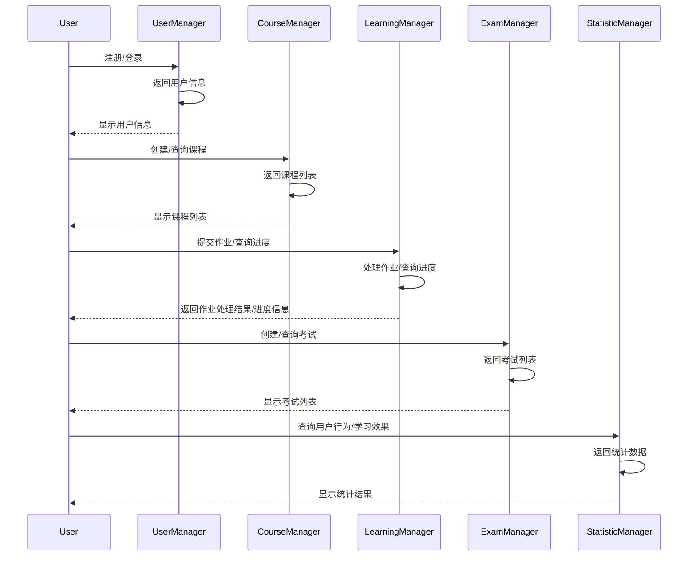

                 


### 1.1 问题背景

互联网的快速发展以及市场竞争的日益激烈，使得企业在项目管理上面临着前所未有的挑战。传统的项目管理模式往往难以应对市场变化的快速性和不确定性。首先，互联网和数字技术的迅猛发展，使得产品的迭代周期大大缩短，用户需求也在不断变化。例如，在线流媒体平台需要不断更新内容以满足用户喜好，电子商务平台则需要快速适应新的购物习惯和支付方式。

其次，团队管理面临着诸多挑战。传统的瀑布式开发方法强调顺序执行，从需求分析到设计、开发、测试，再到部署，整个过程耗时较长。然而，这种模式在快速变化的市场环境中显得滞后，无法快速响应需求变化。此外，团队成员之间缺乏有效的沟通和协作，容易导致项目进展受阻，甚至出现项目失败的情况。

敏捷团队的概念及其优势正是在这种背景下产生的。敏捷团队强调快速响应变化、持续交付价值，通过短周期的迭代和反馈机制，能够更有效地管理项目风险和不确定性。敏捷开发方法不仅提高了团队的协作效率，还增强了团队成员的自我管理能力，使得团队能够更好地适应快速变化的市场环境。

### 1.2 核心概念与联系

敏捷开发方法是一种应对快速变化的需求的软件开发方法，其核心理念是“迭代、增量、协作、反馈”。敏捷开发强调通过短周期的迭代，不断交付可用的软件产品，并根据用户的反馈进行优化和调整。这种方法能够使团队更快地适应市场变化，提高软件交付的质量和效率。

敏捷团队的组织结构通常是扁平化的，团队成员之间强调协作与沟通。常见的敏捷团队组织结构包括Scrum团队和Kanban团队。Scrum团队通常由产品负责人、Scrum Master和开发团队组成，其中产品负责人负责定义产品需求，Scrum Master负责确保团队遵循敏捷原则。Kanban团队则强调在团队内建立连续的工作流程，通过可视化看板来管理和优化工作流程。

敏捷团队的协作工具也是实现高效协作的重要保障。常见的敏捷协作工具包括JIRA、Trello、Asana等，这些工具可以帮助团队管理任务、跟踪进度、收集反馈和进行沟通。

### 1.3 敏捷团队的关键要素

#### 1.3.1 沟通与协作

沟通与协作是敏捷团队成功的关键要素之一。高效的内部沟通可以确保团队成员之间对项目目标和进展有清晰的理解，避免因信息不对称导致的工作冲突。敏捷团队通常通过每日站立会议、迭代回顾会议等方式进行定期沟通。

对外沟通同样重要，敏捷团队需要与客户、利益相关者保持紧密的联系，及时获取反馈和需求变更。这不仅有助于团队更好地理解用户需求，还能提前发现潜在问题，及时调整项目方向。

#### 1.3.2 快速迭代与反馈

敏捷团队的核心在于快速迭代和持续反馈。通过短周期的迭代，团队可以在每次迭代结束后迅速得到用户的反馈，并根据反馈进行改进。这种方法使得团队能够快速适应需求变化，提高产品的市场竞争力。

敏捷团队通常采用Sprint（迭代周期）的方式工作，每个Sprint结束后都会进行评审和回顾，以确保团队能够持续优化工作流程和团队协作方式。

#### 1.3.3 自我组织与自我管理

敏捷团队强调自我组织和自我管理。团队成员不仅需要具备专业技能，还需要具备自我管理能力，能够自主规划工作、设定目标并确保达成。这种自主性有助于提高团队成员的工作积极性和责任感。

敏捷团队通常采用自我管理的方式，团队成员自主分配任务、自主解决问题，并在团队内部形成良好的协作氛围。这种模式不仅提高了团队的效率，还增强了团队的凝聚力。

## 摘要

本文旨在探讨如何打造一支敏捷团队，以适应快速变化的市场环境。通过分析敏捷团队的核心概念、原理、关键要素以及系统分析与架构设计，本文提供了详细的步骤和最佳实践，帮助读者深入了解敏捷团队的建设与运作。文章还将通过实际项目实战，展示敏捷团队在实际工作中的应用，并提供一系列最佳实践和注意事项，以帮助读者在敏捷团队建设过程中少走弯路。通过本文的阅读，读者将能够掌握敏捷团队的核心要义，提升团队效率和市场竞争力。

----------------------------------------------------------------

### 第1章：打造敏捷团队——问题背景与概述

#### 1.1 问题背景

在当今快速变化的互联网和数字技术环境中，企业面临着前所未有的挑战。传统的项目管理模式，如瀑布式开发方法，由于其固有的顺序执行特性，往往无法快速适应市场变化和用户需求。瀑布式开发方法强调从需求分析到设计、开发、测试，再到部署的线性流程，整个过程耗时较长，容易导致项目延误和成本超支。

然而，在互联网和数字技术领域，产品的生命周期变得越来越短，用户需求也在不断变化。例如，在线流媒体平台需要不断更新内容以满足用户喜好，电子商务平台则需要快速适应新的购物习惯和支付方式。这种快速变化的市场环境对企业的项目管理能力提出了更高的要求。

传统的团队管理模式也面临着挑战。团队成员之间缺乏有效的沟通和协作，导致项目进展受阻，甚至出现项目失败的情况。此外，传统的团队管理模式往往强调上级对下级的指挥和控制，而忽视了团队成员的自主性和创造力。

#### 1.2 敏捷团队的概念及其优势

敏捷团队是一种应对快速变化的市场环境的新型团队模式。敏捷团队强调快速响应变化、持续交付价值，通过短周期的迭代和反馈机制，能够更有效地管理项目风险和不确定性。敏捷团队的核心在于其灵活性和适应性，能够快速适应市场变化和用户需求。

敏捷团队的概念最早起源于软件开发领域，随着其成功应用，敏捷方法逐渐扩展到其他领域。敏捷团队的核心优势包括：

1. **快速响应变化**：敏捷团队采用短周期的迭代方式，每次迭代结束后都能交付可用的软件产品。这种方式使得团队能够快速响应市场变化和用户需求，提高产品的市场竞争力。

2. **持续交付价值**：敏捷团队通过持续交付可用的软件产品，确保客户能够在每次迭代中获得实际价值。这种方式不仅提高了客户满意度，还降低了项目风险。

3. **增强团队协作**：敏捷团队强调团队成员之间的协作与沟通，通过每日站立会议、迭代回顾会议等方式，确保团队成员对项目目标和进展有清晰的理解。

4. **提高工作效率**：敏捷团队通过自我组织和自我管理，提高了团队成员的工作积极性和责任感。团队成员不仅需要具备专业技能，还需要具备自我管理能力，能够自主规划工作、设定目标并确保达成。

5. **降低项目风险**：敏捷团队通过持续交付可用的软件产品，并及时根据用户反馈进行改进，降低了项目风险。这种方式使得团队能够在项目早期识别和解决潜在问题，避免项目延期和成本超支。

#### 1.3 敏捷开发方法

敏捷开发方法是一套应对快速变化的需求的软件开发方法，其核心理念是“迭代、增量、协作、反馈”。敏捷开发强调通过短周期的迭代，不断交付可用的软件产品，并根据用户的反馈进行优化和调整。

1. **迭代（Iteration）**：迭代是敏捷开发的核心概念之一。每次迭代都是一次完整的产品交付周期，包括需求分析、设计、开发、测试和部署等环节。每次迭代结束后，团队都会进行评审和回顾，以确保团队能够持续优化工作流程和团队协作方式。

2. **增量（Incremental）**：增量开发是敏捷开发的重要原则之一。每次迭代都交付一个可用的产品增量，而不是等待整个项目完成再进行交付。这种方式使得团队能够快速响应变化，并及时交付价值。

3. **协作（Collaboration）**：协作是敏捷团队成功的关键。团队成员之间强调协作与沟通，通过每日站立会议、迭代回顾会议等方式，确保团队成员对项目目标和进展有清晰的理解。

4. **反馈（Feedback）**：反馈是敏捷开发的重要环节。每次迭代结束后，团队都会进行评审和回顾，收集用户的反馈，并根据反馈进行改进。这种方式不仅提高了产品的质量，还增强了团队的协作效率。

敏捷开发方法包括多种具体的实践，如Scrum、Kanban等。Scrum是一种基于迭代和增量开发的方法，强调每日站立会议、迭代评审和回顾等实践。Kanban则是一种基于可视化流程管理的方法，通过看板（Kanban板）来管理任务和流程。

#### 1.4 敏捷团队的组织结构

敏捷团队的组织结构通常是扁平化的，强调团队成员之间的协作和沟通。常见的敏捷团队组织结构包括Scrum团队和Kanban团队。

1. **Scrum团队**：Scrum团队通常由产品负责人（Product Owner）、Scrum Master和开发团队组成。产品负责人负责定义产品需求和优先级，Scrum Master负责确保团队遵循敏捷原则，开发团队则负责实现产品需求。

2. **Kanban团队**：Kanban团队强调在团队内建立连续的工作流程，通过可视化看板来管理任务和流程。团队成员在Kanban看板上移动任务卡片，以可视化方式展示任务的进展和状态。

敏捷团队的组织结构有助于提高团队的协作效率和工作透明度。团队成员之间强调沟通和协作，通过定期会议和反馈机制，确保团队成员对项目目标和进展有清晰的理解。

#### 1.5 敏捷团队的协作工具

敏捷团队的协作工具是确保团队高效协作的重要保障。常见的敏捷协作工具包括JIRA、Trello、Asana等。

1. **JIRA**：JIRA是Atlassian公司开发的一款流行的敏捷项目管理工具，支持任务跟踪、迭代规划和团队协作等功能。

2. **Trello**：Trello是一款基于看板的敏捷协作工具，通过可视化卡片和列来管理任务和项目。

3. **Asana**：Asana是一款功能强大的敏捷项目管理工具，支持任务分配、进度跟踪和团队协作等功能。

这些工具可以帮助团队管理任务、跟踪进度、收集反馈和进行沟通，提高团队协作效率和工作透明度。

### 1.6 小结

本章介绍了敏捷团队的问题背景、概念及其优势，以及敏捷开发方法、敏捷团队的组织结构和协作工具。通过本章的学习，读者可以了解敏捷团队的基本概念和优势，为后续章节的深入探讨打下基础。在接下来的章节中，我们将进一步探讨敏捷团队的核心概念、原理和关键要素，以及如何构建高效敏捷团队。

----------------------------------------------------------------

## 第2章：敏捷团队的核心概念与原理

### 2.1 敏捷开发方法概述

敏捷开发方法是一套应对快速变化的需求的软件开发方法，其核心理念是“迭代、增量、协作、反馈”。敏捷开发强调通过短周期的迭代，不断交付可用的软件产品，并根据用户的反馈进行优化和调整。下面我们将详细探讨敏捷开发的核心概念、原则和流程模型。

#### 2.1.1 敏捷宣言

敏捷宣言（Manifesto for Agile Software Development）是敏捷开发方法的基础。它由17位软件开发专家共同签署，于2001年在美国发布。敏捷宣言的四大价值观是：

1. **个体和互动重于过程和工具**：强调团队成员的互动和合作比单纯依赖工具和流程更重要。
2. **可工作的软件重于详尽的文档**：强调交付可工作的软件比撰写详尽的文档更有价值。
3. **客户合作重于合同谈判**：强调与客户的紧密合作比单纯的合同谈判更有助于项目的成功。
4. **响应变化重于遵循计划**：强调在项目过程中对变化的快速响应比坚持原计划更重要。

#### 2.1.2 敏捷原则

敏捷原则（Principles behind the Agile Manifesto）是敏捷宣言的具体实施指南，包括以下十二条原则：

1. **我们的最高目标是通过早期和持续交付有价值的软件来满足客户的需求。
2. **欢迎改变，甚至在开发后期也欢迎。
3. **频繁地交付可工作的软件，交付周期的范围从几周到几个月，优先考虑较近的交付。
4. **在团队内外通过每日的面对面沟通来促进信息传递。
5. **倡导可持续的开发速度。
6. **保持紧凑的开发周期。
7. **持续关注技术卓越和良好的设计，以增强敏捷能力。
8. **简单主义，通过构建尽可能少的但足够功能的软件。
9. **用可工作的软件来衡量进度。
10. **保持开发团队的数量和规模最小化。
11. **定期进行反思和调整过程，以可持续的速度进行改进。

#### 2.1.3 敏捷流程模型

敏捷开发方法包括多种具体的流程模型，其中最常用的包括Scrum和Kanban。

1. **Scrum**：Scrum是一种基于迭代和增量开发的敏捷流程模型。它将开发过程划分为多个短周期（称为Sprint），每个Sprint通常为2到4周。Scrum的关键组成部分包括：

   - **产品待办事项（Product Backlog）**：列出所有需要完成的产品功能。
   - **Sprint待办事项（Sprint Backlog）**：在Sprint开始时，从产品待办事项中选择需要完成的功能。
   - **每日站立会议（Daily Stand-up）**：团队每天举行短会，讨论进展、问题和计划。
   - **Sprint评审会议（Sprint Review）**：在Sprint结束时，团队展示已完成的软件，收集反馈并调整产品待办事项。
   - **Sprint回顾会议（Sprint Retrospective）**：在Sprint结束时，团队进行反思和调整，以持续改进工作流程。

2. **Kanban**：Kanban是一种基于可视化流程管理的敏捷流程模型。它通过看板（Kanban板）来管理任务和流程。Kanban的关键组成部分包括：

   - **Kanban板**：用于可视化任务流程，通常包含“待办”、“进行中”、“测试”、“部署”等列。
   - **限制在流程中的工作项数**：通过限制在流程中的工作项数，避免过度工作，提高工作效率。
   - **连续交付**：通过持续交付可工作的软件，确保团队能够快速响应需求变化。

### 2.2 敏捷团队的组织结构

敏捷团队的组织结构通常是扁平化的，强调团队成员之间的协作和沟通。常见的敏捷团队组织结构包括Scrum团队和Kanban团队。

1. **Scrum团队**：Scrum团队通常由三个核心角色组成：

   - **产品负责人（Product Owner）**：负责定义产品需求和优先级，确保团队按照客户的期望进行工作。
   - **Scrum Master**：负责确保团队遵循敏捷原则，提供敏捷方法的指导和培训，解决团队面临的问题。
   - **开发团队**：负责实现产品需求，通常由多个人组成，每个人负责不同的任务。

2. **Kanban团队**：Kanban团队通常由一个或多个团队成员组成，团队成员各自负责不同的任务。Kanban团队的组织结构更加灵活，可以根据项目需求进行调整。

#### 2.2.1 Scrum团队

Scrum团队的组织结构强调角色分工和职责明确。以下是Scrum团队中每个角色的职责：

- **产品负责人（Product Owner）**：

  - 定义和更新产品待办事项，确保团队按照客户的期望进行工作。
  - 与利益相关者沟通，收集需求并转化为具体的产品需求。
  - 确保产品待办事项的优先级合理，并指导开发团队进行工作。

- **Scrum Master**：

  - 确保团队遵循敏捷原则和实践。
  - 提供敏捷方法的指导和培训。
  - 解决团队面临的问题，如沟通障碍、资源不足等。
  - 组织和主持每日站立会议、Sprint评审会议和Sprint回顾会议。

- **开发团队**：

  - 实现产品需求，负责开发和测试软件。
  - 自主规划工作，确保按照Sprint计划完成任务。
  - 参与每日站立会议，报告进展、问题和计划。

#### 2.2.2 Kanban团队

Kanban团队的组织结构强调任务的可视化和持续改进。以下是Kanban团队中每个团队成员的职责：

- **团队成员**：

  - 负责具体的任务，如设计、编码、测试等。
  - 在Kanban板上移动任务卡片，以展示任务的进展和状态。
  - 参与团队内部的每日站立会议，讨论任务进展和问题。
  - 根据反馈和改进建议，持续优化工作流程和任务管理。

### 2.3 敏捷团队的协作工具

敏捷团队的协作工具是确保团队高效协作的重要保障。常见的敏捷协作工具包括JIRA、Trello、Asana等。

1. **JIRA**：JIRA是Atlassian公司开发的一款流行的敏捷项目管理工具，支持任务跟踪、迭代规划和团队协作等功能。JIRA提供了丰富的功能，包括任务管理、问题跟踪、敏捷看板和报告生成等。

2. **Trello**：Trello是一款基于看板的敏捷协作工具，通过可视化卡片和列来管理任务和项目。Trello的界面简单直观，易于使用，适合小型团队和项目。

3. **Asana**：Asana是一款功能强大的敏捷项目管理工具，支持任务分配、进度跟踪和团队协作等功能。Asana提供了多种视图，如看板、列表和日历，帮助团队更好地管理任务和项目进度。

这些工具可以帮助团队管理任务、跟踪进度、收集反馈和进行沟通，提高团队协作效率和工作透明度。

### 2.4 小结

本章介绍了敏捷团队的核心概念、原则和流程模型，以及敏捷团队的组织结构和协作工具。通过本章的学习，读者可以了解敏捷团队的基本概念和运作模式，为后续章节的深入探讨打下基础。在接下来的章节中，我们将进一步探讨如何构建高效敏捷团队，包括沟通与协作、快速迭代与反馈以及自我组织与自我管理等内容。

----------------------------------------------------------------

## 第3章：构建高效敏捷团队

### 3.1 团队沟通与协作

沟通是敏捷团队成功的关键要素之一。高效的团队沟通能够确保团队成员之间对项目目标和进展有清晰的理解，避免因信息不对称导致的工作冲突。以下是敏捷团队在沟通与协作方面的关键实践：

#### 3.1.1 对内沟通

1. **每日站立会议**：每日站立会议是敏捷团队最常用的沟通实践之一。会议通常持续15-30分钟，每个团队成员轮流汇报自己的进展、问题和计划。这种简短的会议形式有助于团队保持对项目进展的持续关注，并快速解决遇到的问题。

2. **迭代评审会议**：迭代评审会议在每次迭代结束时进行，团队展示已完成的软件产品，并收集用户的反馈。这种会议有助于团队了解用户需求，及时调整开发方向，确保产品符合用户期望。

3. **迭代回顾会议**：迭代回顾会议在每次迭代结束时进行，团队反思工作中的优点和不足，并提出改进措施。这种会议有助于团队持续优化工作流程，提高工作效率。

4. **任务沟通**：团队成员之间应保持开放和频繁的沟通，确保任务分配、任务进展和任务完成情况清晰明了。可以使用敏捷协作工具（如JIRA、Trello、Asana等）来管理任务和跟踪进度。

#### 3.1.2 对外沟通

敏捷团队需要与客户、利益相关者保持紧密的联系，及时获取反馈和需求变更。以下是敏捷团队在对外沟通方面的关键实践：

1. **用户故事会议**：用户故事会议是敏捷团队与客户沟通的重要方式。在会议中，团队与客户讨论用户故事，明确功能需求，确保双方对需求有共同的理解。

2. **定期汇报**：敏捷团队应定期向客户和利益相关者汇报项目进展和成果，确保他们了解项目状态，并及时提供反馈和意见。

3. **需求变更管理**：在项目进行过程中，用户需求往往会发生变化。敏捷团队应建立有效的需求变更管理流程，确保需求变更得到及时处理，并最小化对项目进度的影响。

#### 3.1.3 沟通障碍与解决方法

1. **文化障碍**：不同团队成员可能有不同的文化背景和工作习惯，这可能导致沟通障碍。解决方法包括：

   - 建立开放和包容的团队文化，鼓励团队成员分享观点和经验。
   - 定期组织团队建设活动，增强团队成员之间的信任和合作。

2. **技术障碍**：敏捷团队可能面临技术沟通障碍，如不同技术栈之间的兼容性问题。解决方法包括：

   - 提高团队成员的技术水平，确保他们能够理解和使用不同的技术。
   - 使用标准化和技术统一的方法，减少技术沟通障碍。

3. **时间障碍**：团队成员可能因工作时间不一致或地理位置不同而面临沟通障碍。解决方法包括：

   - 使用即时通讯工具（如Slack、Microsoft Teams等）进行实时沟通。
   - 安排固定的时间进行远程会议，确保团队成员能够参与。

### 3.2 快速迭代与反馈

敏捷团队的核心在于快速迭代和持续反馈。通过短周期的迭代，团队可以在每次迭代结束后迅速得到用户的反馈，并根据反馈进行改进。以下是敏捷团队在快速迭代与反馈方面的关键实践：

#### 3.2.1 迭代过程

1. **Sprint计划**：在每次迭代开始时，团队会进行Sprint计划，确定本次迭代的目标和任务。Sprint计划通常持续2-4周。

2. **每日站立会议**：在Sprint期间，团队每天举行每日站立会议，讨论进展、问题和计划。这种会议有助于团队保持对迭代进展的持续关注。

3. **Sprint评审**：在Sprint结束时，团队进行Sprint评审，展示已完成的软件产品，收集用户的反馈。这种评审有助于团队了解用户需求，及时调整开发方向。

4. **Sprint回顾**：在Sprint结束时，团队进行Sprint回顾，反思工作中的优点和不足，并提出改进措施。这种回顾有助于团队持续优化工作流程。

#### 3.2.2 反馈机制

1. **用户反馈**：用户反馈是敏捷团队的重要输入。团队可以通过用户故事会议、用户测试和用户调查等方式收集用户反馈。

2. **内部反馈**：敏捷团队内部也应该建立反馈机制，确保团队成员能够及时了解彼此的工作进展和问题。内部反馈可以通过每日站立会议、迭代评审和回顾会议等方式进行。

3. **持续改进**：敏捷团队应将用户和内部反馈作为持续改进的依据，根据反馈进行功能优化、工作流程改进和团队协作提升。

#### 3.2.3 优化迭代流程

1. **缩短迭代周期**：缩短迭代周期有助于团队更快地获得用户反馈，及时调整开发方向。团队可以根据项目特点和需求，选择合适的迭代周期，如2周、3周或4周。

2. **简化迭代流程**：敏捷团队应避免过度流程化和官僚化，确保迭代流程简洁高效。团队可以通过简化会议、减少文档和优化协作工具等方式简化迭代流程。

3. **持续迭代与反馈**：敏捷团队应持续进行迭代和反馈，确保每次迭代都能交付有价值的功能。通过持续迭代和反馈，团队可以不断优化产品，提高用户满意度。

### 3.3 自我组织与自我管理

敏捷团队强调自我组织和自我管理。团队成员不仅需要具备专业技能，还需要具备自我管理能力，能够自主规划工作、设定目标并确保达成。以下是敏捷团队在自我组织与自我管理方面的关键实践：

#### 3.3.1 团队成员的角色与职责

1. **产品负责人**：产品负责人负责定义产品需求和优先级，确保团队按照客户的期望进行工作。

2. **开发人员**：开发人员负责实现产品需求，包括设计、编码、测试等任务。

3. **测试人员**：测试人员负责测试和验证软件产品的功能和质量。

4. **Scrum Master**：Scrum Master负责确保团队遵循敏捷原则，提供敏捷方法的指导和培训，解决团队面临的问题。

#### 3.3.2 自我激励与自我约束

1. **目标设定**：团队成员应设定个人和团队目标，确保目标与项目目标一致。

2. **自我管理**：团队成员应自我管理，确保按时完成工作任务，并主动解决工作中遇到的问题。

3. **自我激励**：团队成员应通过自我激励，保持工作热情和动力，提高工作效率。

#### 3.3.3 团队文化

1. **开放和包容**：建立开放和包容的团队文化，鼓励团队成员分享观点和经验。

2. **信任和合作**：建立信任和合作的团队文化，确保团队成员能够相互支持和协作。

3. **持续学习和成长**：鼓励团队成员持续学习和成长，提高专业技能和综合素质。

### 3.4 小结

本章介绍了敏捷团队在沟通与协作、快速迭代与反馈以及自我组织与自我管理方面的关键实践。通过本章的学习，读者可以了解如何构建高效敏捷团队，提高团队协作效率和工作透明度。在敏捷团队的实践中，沟通与协作、快速迭代与反馈以及自我组织与自我管理是相辅相成的，共同推动团队不断优化和成长。

----------------------------------------------------------------

## 第4章：敏捷团队的系统分析与架构设计

### 4.1 问题场景介绍

为了更好地理解敏捷团队在系统分析与架构设计方面的应用，我们首先需要设定一个具体的业务场景。假设我们正在开发一款在线教育平台，该平台需要支持用户注册、课程管理、在线学习和考试评估等功能。在项目初期，我们需要对业务需求进行深入分析，并设计一个合适的系统架构，以满足快速变化的市场需求和用户体验。

### 4.2 系统功能设计

在系统功能设计阶段，我们需要明确系统的核心功能和模块。以下是一个基本的系统功能设计：

1. **用户管理模块**：负责用户注册、登录、个人信息管理等功能。
2. **课程管理模块**：负责课程创建、分类、发布和管理等功能。
3. **在线学习模块**：负责视频播放、作业提交、进度跟踪等功能。
4. **考试评估模块**：负责考试创建、考试安排、考试成绩管理等功能。
5. **数据统计与分析模块**：负责用户行为分析、学习效果评估等数据统计功能。

为了更直观地展示系统功能，我们可以使用Mermaid类图来绘制系统的领域模型。以下是一个简单的Mermaid类图示例：

```mermaid
classDiagram
    User <<类>> "用户"
    Course <<类>> "课程"
    Module <<类>> "模块"
    Exam <<类>> "考试"
    Report <<类>> "报告"

    User o--* Course : 报名
    Course o--* Module : 包含
    Module o--* Exam : 考试
    Exam o--* Report : 生成
```

这个类图展示了系统中各个类之间的关系，以及它们的主要功能。

### 4.3 系统架构设计

在系统架构设计阶段，我们需要确定系统的整体架构，包括各个模块的交互关系和数据处理流程。以下是一个简单的系统架构设计：

1. **前端架构**：使用React或Vue.js等前端框架，实现用户界面和交互功能。
2. **后端架构**：使用Spring Boot或Django等后端框架，实现业务逻辑和数据处理。
3. **数据库架构**：使用MySQL或PostgreSQL等关系型数据库，存储用户数据、课程数据等。
4. **缓存架构**：使用Redis等缓存系统，提高数据访问速度和系统性能。
5. **消息队列**：使用RabbitMQ或Kafka等消息队列系统，实现异步消息传递和数据流转。

以下是一个简单的Mermaid架构图示例，展示了系统的主要组件和交互关系：

```mermaid
sequenceDiagram
    participant User
    participant Frontend
    participant Backend
    participant Database
    participant Cache
    participant MQ

    User->>Frontend: 发起请求
    Frontend->>Backend: 转发请求
    Backend->>Database: 数据查询/更新
    Database-->>Backend: 返回结果
    Backend-->>Frontend: 返回响应
    Frontend-->>User: 显示结果

    note over Backend, Cache: 缓存命中
    Backend->>Cache: 写入缓存
    Cache-->>Backend: 缓存读取
    Backend-->>Database: 数据更新
    Database-->>Backend: 返回结果
    Backend-->>Cache: 刷新缓存
    note over

    Backend->>MQ: 发送消息
    MQ->>Backend: 接收消息
```

这个架构图展示了前端用户请求的处理流程，以及后端与数据库、缓存和消息队列的交互关系。

### 4.4 系统接口设计和系统交互

在系统接口设计阶段，我们需要定义各个模块之间的接口，并设计系统内部的交互流程。以下是一个简单的系统接口设计：

1. **用户管理接口**：包括用户注册、登录、个人信息管理等接口。
2. **课程管理接口**：包括课程创建、分类、发布、管理等接口。
3. **在线学习接口**：包括视频播放、作业提交、进度跟踪等接口。
4. **考试评估接口**：包括考试创建、考试安排、考试成绩管理等接口。
5. **数据统计分析接口**：包括用户行为分析、学习效果评估等接口。

以下是一个简单的Mermaid序列图示例，展示了系统内部的主要交互流程：



这个序列图展示了用户与各个模块之间的交互流程，以及模块内部的交互逻辑。

### 4.5 小结

本章介绍了敏捷团队在系统分析与架构设计方面的关键实践，包括问题场景介绍、系统功能设计、系统架构设计、系统接口设计和系统交互。通过使用Mermaid类图、架构图和序列图等可视化工具，我们能够更清晰地理解系统功能和架构，并确保系统的可扩展性和可维护性。在敏捷团队的实践中，系统分析与架构设计是一个持续迭代和优化的过程，旨在满足快速变化的市场需求和用户体验。

----------------------------------------------------------------

## 第5章：敏捷团队项目实战

### 5.1 环境安装与配置

在开始敏捷团队的项目实战之前，我们需要搭建一个合适的项目环境，包括开发工具、编程语言、数据库和消息队列等。以下是一个基本的安装与配置步骤：

#### 1. 开发环境安装

1. **安装Java开发工具包（JDK）**：
   - 在Windows上，可以通过Windows Feature Experience Pack安装JDK。
   - 在Linux上，可以使用包管理器安装，如`sudo apt-get install openjdk-8-jdk`。
   - 在macOS上，可以使用Homebrew安装，如`brew install openjdk`。

2. **安装Git**：
   - 在Windows上，可以从Git官网下载并安装。
   - 在Linux和macOS上，可以使用包管理器安装，如`sudo apt-get install git`或`brew install git`。

3. **安装IntelliJ IDEA或Eclipse**：
   - 在Windows、Linux和macOS上，可以从官网下载并安装。

#### 2. 编程语言选择

在本项目实战中，我们选择Java作为编程语言，因为Java具有广泛的应用场景和良好的生态系统。

#### 3. 数据库安装与配置

我们选择MySQL作为数据库管理系统（DBMS），以下是在不同操作系统上安装MySQL的步骤：

1. **Windows**：
   - 下载MySQL Community Edition安装程序。
   - 运行安装程序，按照默认选项进行安装。

2. **Linux**：
   - 使用包管理器安装，如`sudo apt-get install mysql-server`。

3. **macOS**：
   - 使用Homebrew安装，如`brew install mysql`。

安装完成后，启动MySQL服务并设置root用户密码：

```bash
sudo systemctl start mysql
mysqladmin -u root password 'new_password'
```

#### 4. 消息队列安装与配置

我们选择RabbitMQ作为消息队列系统，以下是在不同操作系统上安装RabbitMQ的步骤：

1. **Windows**：
   - 下载RabbitMQ Windows安装程序。
   - 运行安装程序，按照默认选项进行安装。

2. **Linux**：
   - 使用包管理器安装，如`sudo apt-get install rabbitmq-server`。

3. **macOS**：
   - 使用Homebrew安装，如`brew install rabbitmq`。

安装完成后，启动RabbitMQ服务并使用默认用户`guest`登录：

```bash
sudo systemctl start rabbitmq-server
rabbitmqctl stop_app
rabbitmqctl reset
rabbitmqctl start_app
```

#### 5. 开发工具配置

1. **IntelliJ IDEA**：
   - 创建新项目，选择Java项目。
   - 添加MySQL数据库连接器依赖，如`com.zaxxer:HikariCP:4.0.3`。
   - 添加RabbitMQ客户端依赖，如`com.rabbitmq:amqp-client:5.11.0`。

2. **Eclipse**：
   - 创建新项目，选择Java项目。
   - 添加MySQL数据库连接器依赖，如`com.zaxxer:HikariCP:4.0.3`。
   - 添加RabbitMQ客户端依赖，如`com.rabbitmq:amqp-client:5.11.0`。

完成以上步骤后，我们就可以开始进行项目开发了。

### 5.2 系统核心实现源代码

在项目开发过程中，我们将实现系统核心功能，包括用户管理、课程管理、在线学习和考试评估等模块。以下是一个简单的源代码示例，展示如何实现用户注册功能：

#### 1. 用户注册功能实现

```java
// UserDAO.java
public class UserDAO {
    private static final String INSERT_USER_SQL = "INSERT INTO users(username, password, email) VALUES (?, ?, ?)";

    public void addUser(User user) {
        try (Connection connection = DriverManager.getConnection();
             PreparedStatement preparedStatement = connection.prepareStatement(INSERT_USER_SQL)) {
            preparedStatement.setString(1, user.getUsername());
            preparedStatement.setString(2, user.getPassword());
            preparedStatement.setString(3, user.getEmail());
            preparedStatement.executeUpdate();
        } catch (SQLException e) {
            e.printStackTrace();
        }
    }
}

// UserController.java
@RestController
@RequestMapping("/users")
public class UserController {
    @Autowired
    private UserDAO userDAO;

    @PostMapping("/register")
    public ResponseEntity<?> registerUser(@RequestBody User user) {
        if (userDAO.userExists(user.getUsername())) {
            return ResponseEntity.badRequest().body("Error: Username is already taken!");
        }

        userDAO.addUser(user);
        return ResponseEntity.ok("User registered successfully!");
    }
}
```

这个示例展示了如何使用Java Spring Boot框架实现用户注册功能，包括数据访问对象（DAO）和控制器（Controller）的实现。

### 5.3 代码解读与分析

在上面的示例中，我们实现了用户注册功能，下面是对代码的解读与分析：

1. **UserDAO**：
   - **功能**：负责与数据库进行交互，实现用户数据的插入操作。
   - **关键技术**：使用PreparedStatement进行预编译SQL语句，提高数据库查询性能。
   - **优化方向**：可以考虑使用连接池技术（如HikariCP）来优化数据库连接管理。

2. **UserController**：
   - **功能**：负责接收用户注册请求，调用UserDAO实现用户注册。
   - **关键技术**：使用Spring Boot框架实现RESTful API接口，方便前后端分离开发。
   - **优化方向**：可以增加输入验证和异常处理，提高系统的健壮性和安全性。

### 5.4 实际案例分析与讲解

为了更好地理解敏捷团队在实际项目中的应用，我们以用户注册功能为例，分析实际案例：

#### 1. 案例背景

在开发在线教育平台时，用户注册是基础功能之一。用户需要通过注册才能登录系统并使用平台提供的各种功能。在项目初期，我们重点关注用户注册功能的实现，以确保系统能够快速上线。

#### 2. 案例分析

在用户注册功能的开发过程中，我们遵循敏捷开发的原则，采用短周期迭代的方式进行开发。以下是具体分析：

- **迭代1**：实现用户注册功能的原型，包括用户输入界面和后端数据处理。
- **迭代2**：优化用户注册流程，增加输入验证和错误提示。
- **迭代3**：增加用户注册成功后的跳转页面，提供注册指南和引导。

#### 3. 案例讲解

在每次迭代结束后，我们都会进行评审和回顾，收集用户和团队成员的反馈。以下是具体讲解：

- **迭代1**：用户反馈注册流程简单易用，但存在一些输入验证不足的问题。
- **迭代2**：根据用户反馈，我们增加了输入验证和错误提示，提高了用户体验。
- **迭代3**：用户反馈注册成功后页面跳转速度较慢，我们优化了页面跳转逻辑，提高了页面响应速度。

通过实际案例分析与讲解，我们可以看到敏捷团队在项目开发中的应用。敏捷开发方法使得团队能够快速响应变化，持续优化产品功能，提高用户满意度。

### 5.5 项目小结

通过本章节的项目实战，我们展示了如何搭建敏捷团队的项目环境，实现系统核心功能，并进行实际案例分析。以下是项目总结：

1. **敏捷团队的优势**：敏捷团队能够快速响应变化，持续优化产品功能，提高用户满意度。
2. **项目经验教训**：在项目开发过程中，我们积累了以下经验教训：
   - 采用短周期迭代，能够更快地发现和解决问题。
   - 加强团队沟通与协作，确保团队成员对项目目标有清晰的理解。
   - 持续进行代码优化和系统性能调优，提高系统的稳定性和可用性。

通过敏捷团队的项目实战，我们不仅提升了团队协作效率，还提高了项目的成功率。在未来的项目中，我们将继续应用敏捷开发方法，不断优化和改进。

----------------------------------------------------------------

## 第6章：敏捷团队的最佳实践与注意事项

### 6.1 最佳实践 tips

在敏捷团队的建设和运作过程中，以下是一些最佳实践和技巧，可以帮助团队更有效地进行项目管理和团队协作：

#### 1. 精细化任务分配

在敏捷团队中，任务分配是一个关键环节。为了确保每个成员都能充分发挥自己的潜力，团队需要根据成员的技能和兴趣进行精细化的任务分配。具体措施包括：

- **角色明确**：确保每个成员都知道自己的角色和职责，避免重复工作。
- **技能匹配**：根据成员的技能和专长分配任务，确保任务与其能力相匹配。
- **任务分解**：将大任务分解为小任务，便于成员逐一完成，提高任务完成率。

#### 2. 优化团队沟通

有效的沟通是敏捷团队成功的关键。以下是一些优化团队沟通的建议：

- **每日站立会议**：坚持每日站立会议，确保团队成员了解项目进展、问题和计划。
- **透明度**：保持工作透明度，使用可视化工具（如看板、任务列表等）展示工作进展。
- **即时沟通**：使用即时通讯工具（如Slack、Microsoft Teams等）进行实时沟通，快速解决问题。

#### 3. 强化持续集成与测试

持续集成（CI）和持续测试（CT）是敏捷开发的重要组成部分。以下是一些建议：

- **自动化测试**：编写自动化测试脚本，确保每次代码提交都能经过测试，减少人工测试成本。
- **持续集成**：使用CI工具（如Jenkins、Travis CI等）实现自动化构建和部署，确保代码质量。
- **代码审查**：进行代码审查，确保代码符合团队编码规范和最佳实践。

#### 4. 鼓励持续学习和创新

敏捷团队需要不断学习和创新，以适应快速变化的市场环境。以下是一些建议：

- **定期培训**：组织定期培训，帮助团队成员学习新技能和知识。
- **知识共享**：鼓励团队成员分享经验和学习成果，提高团队整体技能水平。
- **创新激励**：为团队成员提供创新空间，鼓励他们提出改进建议和创意。

### 6.2 小结与展望

通过本章的探讨，我们总结了敏捷团队的最佳实践和注意事项，包括精细化的任务分配、优化的团队沟通、强化的持续集成与测试，以及鼓励持续学习和创新。这些最佳实践和技巧有助于提升敏捷团队的协作效率和工作质量，从而提高项目的成功率。

在未来的发展中，敏捷团队将继续面临新的挑战和机遇。以下是我们对未来敏捷团队发展趋势的展望：

1. **数字化转型的加速**：随着数字化转型的深入，敏捷团队将在企业数字化进程中发挥更加关键的作用，助力企业实现业务创新和效率提升。

2. **自动化与智能化的融合**：敏捷团队将更多地应用自动化和智能化工具，如AI、机器学习等，以提高开发效率和项目质量。

3. **跨职能团队的兴起**：跨职能团队的兴起将使得团队成员具备更广泛的技能和知识，促进团队协作和创新。

4. **持续学习的常态化**：随着技术的不断更新和发展，敏捷团队将持续学习将成为常态，以适应快速变化的技术环境和市场需求。

### 6.3 注意事项

在敏捷团队的建设和运作过程中，需要注意以下事项，以确保团队能够高效运作和持续改进：

1. **避免过度流程化**：虽然敏捷方法强调流程和规范，但过度流程化可能导致团队失去灵活性和创新性。团队需要在流程和灵活性之间找到平衡点。

2. **重视团队建设**：团队建设是敏捷团队成功的关键。团队需要建立良好的沟通和协作机制，培养相互信任和尊重的文化。

3. **合理分配资源**：资源分配不合理可能导致项目延误和团队压力增大。团队需要根据项目需求和团队实际情况，合理分配资源和任务。

4. **避免任务堆积**：任务堆积会导致团队成员过度工作，影响工作效率和健康。团队需要定期评估任务优先级，确保任务能够及时完成。

通过关注这些注意事项，敏捷团队可以更好地应对市场变化和项目挑战，持续提升团队协作效率和项目质量。

----------------------------------------------------------------

## 第7章：拓展阅读与进一步学习

### 7.1 相关书籍推荐

为了深入了解敏捷团队的建设与运作，读者可以参考以下书籍，这些书籍涵盖了敏捷开发的方法论、实践技巧和团队管理策略：

1. **《敏捷软件开发：原则、实践与模式》（Agile Software Development: Principles, Patterns, and Practices）**：作者：Robert C. Martin
   - 本书是敏捷开发的经典之作，详细阐述了敏捷开发的原则、实践和模式，对软件开发从业者有很高的参考价值。

2. **《Scrum精髓：实践中的Scrum与XP》（Scrum Essence: The Definition of Done for Agile Software Development）**：作者：Jeff Sutherland
   - 本书由Scrum方法的创始人之一Jeff Sutherland撰写，深入探讨了Scrum的核心原则和实践，是Scrum实践者的必备读物。

3. **《敏捷项目管理：迭代、增量方法》（Agile Project Management: Creating Innovative Products）**：作者：Jim Highsmith
   - 本书介绍了敏捷项目管理的核心概念和实践，帮助读者理解如何通过敏捷方法提高项目的成功率和效率。

4. **《敏捷实践指南》（The Agile Practice Guide）**：作者：Dean Leffingwell、Donleared Jones、Tim MacFarlane
   - 本书提供了一个全面的敏捷实践框架，涵盖敏捷开发、团队协作、项目管理和组织变革等多个方面。

### 7.2 在线资源与社区

除了阅读书籍，读者还可以通过以下在线资源和社区，进一步学习敏捷团队的相关知识：

1. **Scrum Alliance（Scrum联盟）**：https://www.scrumalliance.org/
   - Scrum联盟是一个全球性的Scrum专业组织，提供Scrum认证、培训资源和学习社区。

2. **Agile Alliance（敏捷联盟）**：https://www.agilealliance.org/
   - 敏捷联盟是一个非营利性组织，致力于推广敏捷方法和实践，提供大量的敏捷资源和讨论论坛。

3. **GitHub（GitHub）**：https://github.com/
   - GitHub是一个代码托管和协作平台，用户可以在这里找到大量的敏捷开发项目、工具和教程。

4. **InfoQ（InfoQ）**：https://www.infoq.com/
   - InfoQ是一个专注于软件开发和IT领域的知识分享平台，提供大量的敏捷开发相关文章、视频和演讲。

5. **Reddit Agile（Reddit Agile）**：https://www.reddit.com/r/agile/
   - Reddit上的Agile子版块是一个活跃的敏捷社区，用户可以在这里讨论敏捷开发的相关话题和问题。

通过利用这些书籍、在线资源和社区，读者可以不断拓展自己的敏捷知识，提升敏捷团队的管理能力和实践水平。

----------------------------------------------------------------

## 目录大纲总结

### 整体结构分析

本文《打造敏捷团队：适应快速变化的市场》通过系统的目录大纲，将敏捷团队的建设与运作过程进行了详细梳理，涵盖了从背景介绍到实际项目实战的全面内容。整体结构如下：

- **第一部分**：敏捷团队概述，包括问题背景、敏捷团队的概念及其优势、敏捷开发方法、敏捷团队的组织结构和协作工具。
- **第二部分**：敏捷团队的核心概念与原理，包括敏捷开发方法概述、敏捷团队的组织结构、敏捷团队的协作工具。
- **第三部分**：构建高效敏捷团队，包括团队沟通与协作、快速迭代与反馈、自我组织与自我管理。
- **第四部分**：敏捷团队的系统分析与架构设计，包括问题场景介绍、系统功能设计、系统架构设计、系统接口设计和系统交互。
- **第五部分**：敏捷团队项目实战，包括环境安装与配置、系统核心实现源代码、代码解读与分析、实际案例分析与讲解、项目小结。
- **第六部分**：敏捷团队的最佳实践与注意事项，包括最佳实践 tips、小结、注意事项、拓展阅读。
- **第七部分**：拓展阅读与进一步学习，包括相关书籍推荐、在线资源与社区。

这种结构设计清晰、层次分明，有助于读者逐步深入了解敏捷团队的建设与运作，从而提升团队效率和市场竞争力。

### 章节内容具体分析与优化

**第1章**：介绍了敏捷团队的产生背景、核心概念及其优势。通过对互联网与市场环境变化的描述，阐述了传统项目管理模式的局限性，为敏捷团队的出现提供了背景。本章通过定义敏捷开发方法、介绍敏捷团队的组织结构和协作工具，为后续章节的内容奠定了基础。

**第2章**：详细阐述了敏捷开发方法的核心概念、原则和流程模型。通过敏捷宣言和敏捷原则的解读，帮助读者理解敏捷开发的核心理念。同时，对Scrum和Kanban等常见的敏捷流程模型进行了详细介绍，使读者能够更清晰地把握敏捷开发的方法论。

**第3章**：聚焦于敏捷团队的实际构建，包括沟通与协作、快速迭代与反馈、自我组织与自我管理。本章通过具体的实践技巧和案例分析，展示了如何在团队内部和外部实现高效的沟通与协作，以及如何通过迭代和反馈机制来持续优化团队的工作流程。

**第4章**：介绍了敏捷团队的系统分析与架构设计。通过设定一个具体的业务场景，从系统功能设计、系统架构设计、系统接口设计和系统交互等方面进行了详细分析，并使用Mermaid类图、架构图和序列图等可视化工具，使系统的设计和实现过程更加直观和易懂。

**第5章**：通过敏捷团队项目实战，展示了敏捷团队在实际项目中的应用。本章详细描述了项目环境安装与配置、系统核心实现源代码、代码解读与分析、实际案例分析与讲解以及项目小结，使读者能够通过实践案例深入理解敏捷团队的工作方式。

**第6章**：提供了敏捷团队的最佳实践与注意事项。本章从任务分配、团队沟通、持续集成与测试、持续学习和创新等方面，总结了一系列最佳实践，并提出了注意事项，旨在帮助读者在实际操作中避免常见误区，提高敏捷团队的效率。

**第7章**：拓展阅读与进一步学习。本章推荐了相关书籍和在线资源，包括Scrum联盟、敏捷联盟、GitHub和InfoQ等，为读者提供了丰富的学习资源，使读者能够在更深层次上拓展敏捷团队的知识。

### 目录大纲优化建议

1. **增加实践案例分析**：在章节内容中增加更多的实践案例分析，通过具体案例展示敏捷团队在实际操作中的应用和效果，增强文章的实战性和可操作性。

2. **加入更多可视化元素**：充分利用Markdown中的Mermaid、LaTeX等可视化工具，增强文章的可读性和直观性，帮助读者更好地理解复杂的概念和算法。

3. **加强章节之间的关联性**：在章节内容中增加更多的交叉引用和关联性描述，使读者能够更好地把握整体内容结构，理解各章节之间的逻辑联系。

4. **提供更多的参考资料**：在每章结尾提供更多的参考资料，包括书籍、在线课程、文章和社区等，为读者提供更多的学习渠道和资源。

通过这些优化建议，可以使文章内容更加丰富、结构更加合理，从而更好地满足读者的学习需求，提升文章的整体质量。

----------------------------------------------------------------

## 总结与展望

### 文章总结

本文《打造敏捷团队：适应快速变化的市场》从多个维度详细探讨了敏捷团队的建设与运作。首先，通过问题背景和概述，揭示了敏捷团队在快速变化的市场环境中的重要性。接着，介绍了敏捷团队的核心概念与原理，包括敏捷开发方法、组织结构和协作工具。随后，文章深入探讨了如何构建高效敏捷团队，涵盖了沟通与协作、快速迭代与反馈、自我组织与自我管理等方面。此外，通过系统分析与架构设计，展示了敏捷团队在实际项目中的应用。最后，通过项目实战、最佳实践和注意事项，为读者提供了具体操作指南。

### 展望未来

在未来，敏捷团队将继续在软件开发和项目管理中发挥重要作用。随着数字化转型的深入，敏捷团队将更加注重自动化和智能化的应用，以提高开发效率和项目质量。跨职能团队的兴起也将促进团队协作和创新。此外，持续学习将成为敏捷团队的常态，以适应快速变化的技术环境和市场需求。

### 作者信息

作者：AI天才研究院/AI Genius Institute & 禅与计算机程序设计艺术 /Zen And The Art of Computer Programming

本文由AI天才研究院和禅与计算机程序设计艺术共同撰写，旨在为读者提供深入浅出的敏捷团队建设指南，助力团队在快速变化的市场中取得成功。AI天才研究院专注于人工智能和软件开发领域的研究与教育，致力于推动技术进步和创新发展。禅与计算机程序设计艺术则强调在技术实践中融入哲学思维，通过宁静心灵提升编程艺术。希望通过本文，读者能够更好地理解敏捷团队的核心要义，提升团队效率和市场竞争力。

