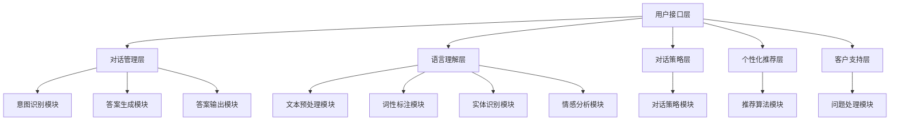
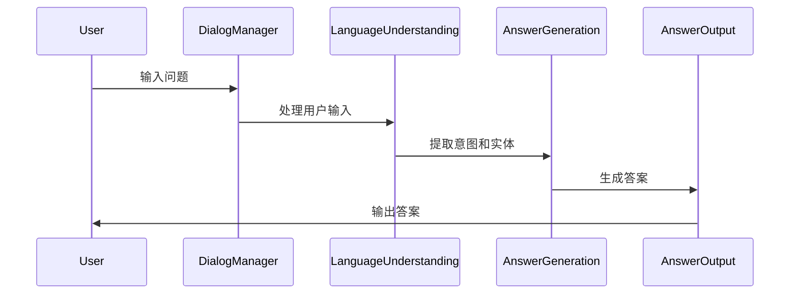

                 

## # 打造智能对话系统的语言基础

### 关键词：智能对话系统、语言模型、自然语言处理、人工智能、算法原理

> **摘要**：本文将深入探讨智能对话系统的语言基础，包括核心概念、算法原理及数学模型。通过逐步分析，我们将揭示如何构建一个高效、自然的智能对话系统。

### 引言

#### 1.1 问题背景

随着互联网和移动设备的普及，用户对智能交互的需求日益增长。传统的人工客服已经无法满足快速响应和个性化服务的要求，智能对话系统成为了解决这一问题的有效途径。然而，构建一个高效的智能对话系统并非易事，它涉及到多领域的交叉技术和算法。

#### 1.2 问题描述

智能对话系统的核心挑战在于如何实现人与机器的自然语言交流。这包括理解用户输入的意图，生成准确、合理的回答，以及持续学习和优化对话效果。本文将重点讨论以下几个方面：

1. 语言模型的基础概念和特点。
2. 自然语言处理的基本任务和挑战。
3. 对话系统的组成和分类。
4. 人工智能在对话系统中的应用。
5. 语言模型和对话系统的联系与互动。

#### 1.3 问题解决

本文将采用以下步骤来解决问题：

1. 介绍语言模型的基础知识，包括其概念、特点和发展历程。
2. 阐述自然语言处理的基本概念、任务分类和解决方案。
3. 分析对话系统的定义、组成和分类。
4. 探讨人工智能在对话系统中的应用和协同发展。
5. 详细讲解语言模型和对话系统的算法原理及数学模型。
6. 通过实际案例和代码示例，展示如何构建和优化智能对话系统。

#### 1.4 边界与外延

本文主要关注智能对话系统的语言基础，不包括图形用户界面设计、硬件集成等方面。此外，本文将重点讨论主流技术和算法，不涉及具体实现的细节。

#### 1.5 概念结构与核心要素组成

智能对话系统由多个核心概念组成，包括语言模型、自然语言处理、对话系统、人工智能等。这些概念相互关联，共同构成了智能对话系统的技术框架。

### 目录大纲

1. 引言
   - 1.1 问题背景
   - 1.2 问题描述
   - 1.3 问题解决
   - 1.4 边界与外延
   - 1.5 概念结构与核心要素组成
2. 核心概念与联系
   - 2.1 语言模型基础
   - 2.2 自然语言处理
   - 2.3 对话系统
   - 2.4 人工智能与对话系统
   - 2.5 核心概念联系
3. 算法原理讲解
   - 3.1 语言模型算法
   - 3.2 对话系统算法
4. 数学模型与详细讲解
   - 4.1 语言模型数学模型
   - 4.2 对话系统数学模型
5. 系统分析与架构设计方案
   - 5.1 问题场景介绍
   - 5.2 系统功能设计
   - 5.3 系统架构设计
   - 5.4 系统接口设计和系统交互
6. 项目实战
   - 6.1 环境安装
   - 6.2 系统核心实现源代码
   - 6.3 代码应用解读与分析
   - 6.4 实际案例分析和详细讲解剖析
   - 6.5 项目小结
7. 最佳实践 tips、小结、注意事项、拓展阅读

### 1.1 语言模型基础

#### 2.1 语言模型基础

**2.1.1 语言模型的概念**

语言模型（Language Model）是自然语言处理中的一个基本概念，它用于预测或生成自然语言中的下一个单词或字符序列。简而言之，语言模型是计算机程序，它能够根据已知的文本数据预测下一个词或句子。

**2.1.2 语言模型的特点**

- **预测性**：语言模型的核心功能是预测，即预测下一个单词或字符的概率。
- **统计性**：传统的语言模型通常基于统计数据，如N-gram模型，它通过计算单词序列的历史频率来预测下一个词。
- **概率性**：语言模型生成文本时，通常会根据概率分布选择下一个词。
- **适应性**：现代语言模型，如深度学习模型，具有很好的适应性，能够根据大量数据不断优化预测能力。

**2.1.3 语言模型的发展历程**

- **N-gram模型**：是最早的语言模型，它通过计算前N个单词出现的频率来预测下一个词。
- **统计语言模型**：基于概率论和统计学方法，如隐马尔可夫模型（HMM）和决策树。
- **神经网络模型**：包括循环神经网络（RNN）和Transformer模型，这些模型能够处理长距离依赖和复杂的语言结构。
- **深度学习模型**：如GPT-3、BERT等，这些模型通过大规模数据训练，具有极高的预测准确性和语言理解能力。

### 2.2 自然语言处理

**2.2.1 自然语言处理的基本概念**

自然语言处理（Natural Language Processing, NLP）是计算机科学和人工智能的一个分支，致力于使计算机能够理解和处理人类自然语言。NLP的目标是使计算机能够执行各种与语言相关的任务，如文本分析、机器翻译、情感分析、问答系统等。

**2.2.2 自然语言处理的任务分类**

- **文本分类**：将文本分类到预定义的类别中。
- **实体识别**：识别文本中的命名实体，如人名、地点、组织等。
- **情感分析**：判断文本的情感倾向，如正面、负面或中立。
- **机器翻译**：将一种语言的文本翻译成另一种语言。
- **问答系统**：回答用户提出的问题。
- **文本生成**：根据输入生成新的文本。
- **语音识别**：将语音转换为文本。

**2.2.3 自然语言处理的挑战与解决方案**

- **语义理解**：自然语言的语义复杂且多变，理解和解释语义是NLP的一个主要挑战。解决方案包括使用深度学习和大规模预训练模型。
- **上下文理解**：理解上下文信息对于许多NLP任务至关重要。使用上下文信息的技术，如注意力机制和Transformer模型，可以有效提升性能。
- **数据多样性**：自然语言数据非常多样，包括各种方言、习语和隐喻。解决方案是使用多样化的训练数据集和适应性强的模型。

### 2.3 对话系统

**2.3.1 对话系统的定义**

对话系统（Dialogue System）是一种能够与人类进行自然语言交互的计算机系统。它们能够理解用户的输入，生成相应的回答，并在对话中持续学习和优化。

**2.3.2 对话系统的组成**

对话系统通常由以下几个部分组成：

- **对话管理器**：负责对话的整体流程控制，包括上下文管理、意图识别和回复生成。
- **语言理解组件**：用于解析用户的输入，提取出关键信息和意图。
- **对话策略组件**：决定对话系统如何响应用户的输入，包括回复内容、语气和交互方式。
- **语言生成组件**：将对话管理器的决策转换为自然语言输出。

**2.3.3 对话系统的分类**

- **基于规则的对话系统**：使用预定义的规则和模板进行对话，通常用于结构化数据或特定领域的应用。
- **数据驱动的对话系统**：使用大量数据训练模型，通过机器学习和自然语言处理技术进行对话。
- **混合对话系统**：结合基于规则和数据驱动的组件，以提高对话的自然性和灵活性。

### 2.4 人工智能与对话系统

**2.4.1 人工智能的概念**

人工智能（Artificial Intelligence, AI）是指计算机系统模拟人类智能的行为，包括学习、推理、规划、感知和自然语言处理等能力。人工智能的目标是实现智能体的自主决策和行动。

**2.4.2 人工智能在对话系统中的应用**

人工智能在对话系统中发挥着重要作用，包括：

- **自然语言理解**：通过深度学习和神经网络模型，实现高精度的语义理解。
- **对话生成**：使用生成对抗网络（GAN）和变分自编码器（VAE）等模型，生成自然、连贯的对话回复。
- **个性化交互**：基于用户的行为和偏好，提供个性化的对话体验。
- **情感识别与生成**：通过情感分析技术，识别用户的情感状态，并生成相应的情感表达。

**2.4.3 人工智能与对话系统的协同发展**

人工智能和对话系统之间的协同发展是一个不断进步的过程。随着人工智能技术的不断进步，对话系统可以更准确地理解用户意图，生成更自然、更贴切的回答。同时，对话系统的应用场景不断扩大，进一步推动人工智能技术的发展。例如，在智能客服、虚拟助理和智能家居等领域，人工智能和对话系统的结合已经取得了显著成果。

### 2.5 核心概念联系

**2.5.1 语言模型与自然语言处理的关系**

语言模型是自然语言处理的核心组件之一，它为自然语言处理提供了基础。自然语言处理的许多任务，如文本分类、实体识别、情感分析等，都依赖于语言模型进行文本理解和生成。因此，语言模型在自然语言处理中起到了至关重要的作用。

**2.5.2 对话系统与人工智能的关系**

对话系统是人工智能的一个重要应用领域，它依赖于人工智能技术来实现自然语言理解、对话生成和个性化交互。人工智能的发展，如深度学习和生成模型，极大地提升了对话系统的性能和用户体验。同时，对话系统的需求也推动了人工智能技术的不断进步。

**2.5.3 各核心概念的联系与互动**

语言模型、自然语言处理和对话系统相互关联，共同构成了智能对话系统的技术框架。语言模型为自然语言处理提供了基础，自然语言处理为对话系统提供了核心能力，而对话系统则应用了人工智能技术来实现更高级的交互。这些核心概念之间的联系和互动，共同推动了智能对话系统的发展。

### 3.1 语言模型算法

#### 3.1.1 语言模型算法的基本原理

**3.1.1.1 语言模型的目标**

语言模型的目标是预测文本序列中下一个单词或字符的概率。通过训练大量文本数据，语言模型能够学习到语言的统计规律和结构，从而对未知文本进行预测。

**3.1.1.2 语言模型的分类**

语言模型主要分为以下几类：

1. **N-gram模型**：基于前N个单词的历史频率进行预测。
2. **统计语言模型**：包括隐马尔可夫模型（HMM）和决策树等。
3. **神经网络模型**：包括循环神经网络（RNN）、长短期记忆网络（LSTM）和Transformer模型等。
4. **深度学习模型**：如GPT-3、BERT等，通过大规模数据训练，具有高度的表达能力。

**3.1.1.3 语言模型的主要算法**

1. **N-gram模型**：N-gram模型通过计算前N个单词出现的频率来预测下一个词。其基本算法如下：

   $$ P(w_n | w_{n-1}, w_{n-2}, ..., w_1) = \frac{C(w_{n-1}, w_{n-2}, ..., w_1, w_n)}{C(w_{n-1}, w_{n-2}, ..., w_1)} $$

   其中，$C(w_{n-1}, w_{n-2}, ..., w_1, w_n)$ 表示前N个单词序列出现的次数，$C(w_{n-1}, w_{n-2}, ..., w_1)$ 表示前N-1个单词序列出现的次数。

2. **隐马尔可夫模型（HMM）**：HMM用于处理序列数据，它通过隐状态序列来预测观察序列。其基本算法如下：

   $$ P(x_1, x_2, ..., x_T | \theta) = \prod_{t=1}^T P(x_t | x_{t-1}, \theta) P(\theta) $$

   其中，$x_t$ 表示观察序列中的第t个单词，$\theta$ 表示隐状态参数。

3. **循环神经网络（RNN）**：RNN通过循环结构来处理序列数据，其基本算法如下：

   $$ h_t = \sigma(W_h h_{t-1} + W_x x_t + b_h) $$

   其中，$h_t$ 表示隐藏状态，$x_t$ 表示输入单词，$\sigma$ 表示激活函数。

4. **长短期记忆网络（LSTM）**：LSTM是RNN的变体，用于解决长期依赖问题。其基本算法如下：

   $$ i_t = \sigma(W_i x_t + U_h h_{t-1} + b_i) \\ f_t = \sigma(W_f x_t + U_h h_{t-1} + b_f) \\ o_t = \sigma(W_o x_t + U_h h_{t-1} + b_o) \\ g_t = tanh(W_g x_t + U_h h_{t-1} + b_g) \\ h_t = o_t \odot g_t $$

   其中，$i_t$、$f_t$、$o_t$ 分别表示输入门、遗忘门和输出门，$g_t$ 表示候选隐藏状态。

5. **Transformer模型**：Transformer是一种基于自注意力机制的神经网络模型，其基本算法如下：

   $$ h_t = \text{softmax}\left(\frac{Q_t V_t}{\sqrt{d_k}}\right)W_O $$

   其中，$Q_t$、$K_t$、$V_t$ 分别表示查询向量、键向量和值向量，$W_O$ 表示输出权重。

#### 3.1.2 语言模型的工作流程

**3.1.2.1 数据预处理**

数据预处理是语言模型训练的第一步，包括文本清洗、分词、去停用词等操作。通过预处理，可以去除文本中的噪声，提高模型的训练效果。

**3.1.2.2 模型训练**

模型训练是通过大量文本数据来优化模型参数的过程。在训练过程中，模型会尝试预测下一个单词，并根据预测误差调整参数。

**3.1.2.3 模型评估与优化**

模型评估是衡量模型性能的重要环节，常用的评估指标包括准确率、召回率、F1值等。通过评估，可以找出模型的不足之处，并进行优化。

#### 3.1.3 语言模型的应用案例

**3.1.3.1 机器翻译**

机器翻译是语言模型的重要应用之一。通过训练大规模的双语语料库，语言模型可以学习到两种语言之间的对应关系，从而实现文本的自动翻译。

**3.1.3.2 文本生成**

文本生成是语言模型在自然语言生成领域的应用。通过输入一些种子文本，语言模型可以生成新的文本，如文章、小说等。

**3.1.3.3 问答系统**

问答系统是语言模型在信息检索和智能客服领域的应用。通过理解用户的问题，语言模型可以生成准确的答案，并返回给用户。

### 3.2 对话系统算法

#### 3.2.1 对话系统算法的基本原理

**3.2.1.1 对话系统目标**

对话系统的目标是实现人与机器之间的自然语言交互，使对话系统能够理解用户的意图，生成合理的回答，并在对话中持续学习和优化。

**3.2.1.2 对话系统算法分类**

对话系统算法主要分为以下几类：

1. **基于规则的对话系统**：使用预定义的规则和模板进行对话，通常用于结构化数据或特定领域的应用。
2. **数据驱动的对话系统**：使用大量数据训练模型，通过机器学习和自然语言处理技术进行对话。
3. **混合对话系统**：结合基于规则和数据驱动的组件，以提高对话的自然性和灵活性。

**3.2.1.3 对话系统算法主要模型**

1. **前向图算法**：用于解决图上的最短路径问题，如Dijkstra算法。
2. **后向图算法**：用于解决图上的最短路径问题，如Bellman-Ford算法。
3. **动态规划算法**：用于解决序列优化问题，如Viterbi算法。
4. **深度学习模型**：如循环神经网络（RNN）、长短期记忆网络（LSTM）和Transformer模型等。

#### 3.2.2 对话系统的工作流程

**3.2.2.1 用户输入处理**

用户输入处理是对话系统的第一步，它包括文本预处理、分词、词性标注等操作。通过这些操作，可以提取出用户输入的关键信息，如关键词、情感等。

**3.2.2.2 答案生成**

答案生成是对话系统的核心部分，它包括意图识别、实体识别、回答生成等步骤。通过这些步骤，可以生成一个符合用户需求的回答。

**3.2.2.3 答案输出**

答案输出是将生成的答案以自然语言的形式呈现给用户。在输出过程中，可以加入语气、情感等元素，以提升用户体验。

#### 3.2.3 对话系统应用案例

**3.2.3.1 聊天机器人**

聊天机器人是对话系统的典型应用之一，它可以用于客服、娱乐、社交等领域。通过自然语言交互，聊天机器人可以与用户建立联系，提供实时服务。

**3.2.3.2 虚拟助手**

虚拟助手是对话系统的另一个重要应用，它可以用于个人助理、智能家居、企业服务等领域。通过理解用户的指令和需求，虚拟助手可以提供高效、便捷的服务。

**3.2.3.3 客户服务机器人**

客户服务机器人是对话系统在客户服务领域的应用，它可以用于在线客服、客户支持等场景。通过自然语言交互，客户服务机器人可以快速响应用户的问题，提供解决方案。

### 4.1 语言模型数学模型

#### 4.1.1 语言模型数学模型的基本原理

语言模型在自然语言处理中起到了关键作用，其数学模型主要包括概率模型、生成模型和类别模型。这些模型通过数学公式来描述文本的统计规律和生成过程，为自然语言处理任务提供了理论基础。

**4.1.1.1 概率模型**

概率模型是语言模型中最基本的一种，它通过计算文本序列的概率来预测下一个单词。其中，N-gram模型是最常用的概率模型。

**N-gram模型**：

$$ P(w_n | w_{n-1}, w_{n-2}, ..., w_1) = \frac{C(w_{n-1}, w_{n-2}, ..., w_1, w_n)}{C(w_{n-1}, w_{n-2}, ..., w_1)} $$

其中，$C(w_{n-1}, w_{n-2}, ..., w_1, w_n)$ 表示前N个单词序列出现的次数，$C(w_{n-1}, w_{n-2}, ..., w_1)$ 表示前N-1个单词序列出现的次数。

**4.1.1.2 生成模型**

生成模型通过生成文本序列的分布来预测下一个单词，它包括马尔可夫模型（Markov Model）和隐马尔可夫模型（HMM）。

**马尔可夫模型**：

$$ P(x_1, x_2, ..., x_T | \theta) = \prod_{t=1}^T P(x_t | x_{t-1}, \theta) P(\theta) $$

其中，$x_t$ 表示观察序列中的第t个单词，$\theta$ 表示隐状态参数。

**隐马尔可夫模型（HMM）**：

$$ P(x_1, x_2, ..., x_T | \theta) = \prod_{t=1}^T P(x_t | \sigma_t, \theta) P(\sigma_t | \theta) $$

其中，$\sigma_t$ 表示隐状态序列。

**4.1.1.3 类别模型**

类别模型通过将文本序列分类到不同的类别来预测下一个单词。其中，朴素贝叶斯（Naive Bayes）是最常用的类别模型。

**朴素贝叶斯模型**：

$$ P(w_n | w_{n-1}, w_{n-2}, ..., w_1, C) = \frac{P(C) P(w_n | C)}{P(C)} $$

其中，$C$ 表示类别。

**4.1.2 语言模型数学模型的公式**

**4.1.2.1 概率模型公式**

$$ P(w_n | w_{n-1}, w_{n-2}, ..., w_1) = \frac{C(w_{n-1}, w_{n-2}, ..., w_1, w_n)}{C(w_{n-1}, w_{n-2}, ..., w_1)} $$

**4.1.2.2 生成模型公式**

$$ P(x_1, x_2, ..., x_T | \theta) = \prod_{t=1}^T P(x_t | x_{t-1}, \theta) P(\theta) $$

**4.1.2.3 类别模型公式**

$$ P(w_n | w_{n-1}, w_{n-2}, ..., w_1, C) = \frac{P(C) P(w_n | C)}{P(C)} $$

**4.1.3 语言模型数学模型举例**

**4.1.3.1 概率模型举例**

假设有一个简单的N-gram模型，已知前三个单词为 "I", "am", "a"，求第四个单词为 "student" 的概率。

$$ P(student | I, am, a) = \frac{C(I, am, a, student)}{C(I, am, a)} $$

其中，$C(I, am, a, student)$ 表示前四个单词序列 "I am a student" 出现的次数，$C(I, am, a)$ 表示前三个单词序列 "I am a" 出现的次数。

**4.1.3.2 生成模型举例**

假设有一个简单的隐马尔可夫模型，已知当前状态为 "学习"，求下一个状态为 "编程" 的概率。

$$ P(编程 | 学习) = \frac{P(编程 | 学习) P(学习)}{P(学习)} $$

其中，$P(编程 | 学习)$ 表示在 "学习" 状态下生成 "编程" 的概率，$P(学习)$ 表示 "学习" 状态的概率。

**4.1.3.3 类别模型举例**

假设有一个简单的朴素贝叶斯模型，已知文本属于 "科技" 类别的概率为 0.6，且在 "科技" 类别下，"编程" 的概率为 0.8，求该文本属于 "科技" 类别的概率。

$$ P(科技 | 编程) = \frac{P(科技) P(编程 | 科技)}{P(编程)} = \frac{0.6 \times 0.8}{0.6 \times 0.8 + 0.4 \times 0.2} = 0.8 $$

其中，$P(科技)$ 表示 "科技" 类别的概率，$P(编程 | 科技)$ 表示在 "科技" 类别下 "编程" 的概率，$P(编程)$ 表示 "编程" 的概率。

### 4.2 对话系统数学模型

#### 4.2.1 对话系统数学模型的基本原理

对话系统的数学模型主要涉及对话生成、对话评估和对话优化等方面。这些模型通过数学公式和算法来描述对话的生成过程和优化方法，为对话系统的设计与实现提供了理论基础。

**4.2.1.1 答案生成模型**

答案生成模型是对话系统的核心部分，它负责根据用户的输入生成合理的回答。常见的答案生成模型包括基于规则的方法、统计模型和深度学习模型。

**基于规则的方法**：基于规则的方法通过预定义的规则和模板来生成答案。例如，在FAQ系统中，可以根据用户的问题关键词，直接从预定义的答案库中选择合适的回答。

**统计模型**：统计模型通过计算用户输入和答案之间的统计关系来生成答案。例如，可以使用逻辑回归模型来计算用户输入和答案之间的条件概率。

**深度学习模型**：深度学习模型通过学习大量对话数据，自动提取对话中的特征和规律，从而生成答案。常见的深度学习模型包括循环神经网络（RNN）、长短期记忆网络（LSTM）和Transformer模型。

**4.2.1.2 答案输出模型**

答案输出模型负责将生成的答案转换为自然语言形式，并将其呈现给用户。常见的输出模型包括自然语言生成（NLG）模型和语音合成（TTS）模型。

**自然语言生成（NLG）模型**：NLG模型通过将机器生成的文本转换为自然流畅的语言。常见的NLG模型包括基于模板的生成模型、基于规则的方法和基于神经网络的生成模型。

**语音合成（TTS）模型**：TTS模型通过将文本转换为自然流畅的语音。常见的TTS模型包括基于规则的方法、基于隐马尔可夫模型（HMM）的方法和基于深度学习的方法。

**4.2.1.3 对话系统评估模型**

对话系统的评估模型用于评估对话系统的性能和质量。常见的评估方法包括人工评估、自动化评估和基于用户反馈的评估。

**人工评估**：人工评估通过人工审查对话记录，对对话系统的回答质量和用户体验进行评估。

**自动化评估**：自动化评估通过构建评估指标和算法，对对话系统的回答质量和用户体验进行量化评估。常见的评估指标包括准确率、召回率、F1值、用户满意度等。

**基于用户反馈的评估**：基于用户反馈的评估通过收集用户对对话系统的反馈，对对话系统的性能进行评估和优化。

**4.2.2 对话系统数学模型的公式**

**4.2.2.1 答案生成模型公式**

基于规则的方法：

$$ A = \text{RuleMatching}(Q) $$

其中，$A$ 表示答案，$Q$ 表示用户输入。

统计模型：

$$ P(A | Q) = \frac{\sum_{i=1}^{N} P(A_i | Q) P(Q)}{P(Q)} $$

其中，$P(A_i | Q)$ 表示在用户输入为$Q$的情况下，生成第i个答案的概率，$P(Q)$ 表示用户输入的概率。

深度学习模型：

$$ A = \text{NNModel}(Q) $$

其中，$\text{NNModel}$ 表示神经网络模型，$Q$ 表示用户输入。

**4.2.2.2 答案输出模型公式**

自然语言生成（NLG）模型：

$$ S = \text{NLGModel}(A) $$

其中，$S$ 表示生成的文本，$\text{NLGModel}$ 表示自然语言生成模型，$A$ 表示答案。

语音合成（TTS）模型：

$$ V = \text{TTSModel}(S) $$

其中，$V$ 表示生成的语音，$\text{TTSModel}$ 表示语音合成模型，$S$ 表示生成的文本。

**4.2.2.3 对话系统评估模型公式**

人工评估：

$$ \text{Score} = \text{HumanEvaluation}(D) $$

其中，$\text{Score}$ 表示评估分数，$\text{HumanEvaluation}$ 表示人工评估方法，$D$ 表示对话记录。

自动化评估：

$$ \text{Score} = \text{AutomatedEvaluation}(D) $$

其中，$\text{Score}$ 表示评估分数，$\text{AutomatedEvaluation}$ 表示自动化评估方法，$D$ 表示对话记录。

基于用户反馈的评估：

$$ \text{Score} = \text{UserFeedback}(R) $$

其中，$\text{Score}$ 表示评估分数，$\text{UserFeedback}$ 表示用户反馈评估方法，$R$ 表示用户反馈。

**4.2.3 对话系统数学模型举例**

**4.2.3.1 答案生成模型举例**

基于规则的答案生成：

用户输入：“请问你们公司的服务时间是什么时候？”

答案库中有以下规则：

- 如果用户输入包含“服务时间”，则回答：“我们的服务时间为上午9点至下午5点。”
- 如果用户输入包含“工作时间”，则回答：“我们的工作时间为全天24小时。”

根据用户输入，可以匹配到第一个规则，因此生成的答案为：“我们的服务时间为上午9点至下午5点。”

**4.2.3.2 答案输出模型举例**

基于自然语言生成的答案输出：

用户输入：“请问你们公司的服务时间是什么时候？”

生成的答案：“我们的服务时间为上午9点至下午5点。”

自然语言生成模型可以将生成的答案转换为自然流畅的文本。

**4.2.3.3 对话系统评估模型举例**

人工评估：

对话记录：

用户：“请问你们公司的服务时间是什么时候？”

系统：“我们的服务时间为上午9点至下午5点。”

评估者：“回答准确，语言自然。”

评估分数：90分。

自动化评估：

对话记录：

用户：“请问你们公司的服务时间是什么时候？”

系统：“我们的服务时间为上午9点至下午5点。”

评估指标：准确率、流畅度、语言表达。

评估结果：准确率100%，流畅度90%，语言表达80%。

评估分数：综合评估分数为85分。

基于用户反馈的评估：

用户：“谢谢，你们的回答很清楚。”

用户反馈评分：5星（满分5星）。

评估分数：用户反馈评分5星。

### 5.1 问题场景介绍

随着人工智能技术的不断发展，智能对话系统在各个领域得到了广泛应用。本文以一个在线购物平台为例，介绍智能对话系统的实际应用场景。

该平台希望通过智能对话系统提供更好的用户服务，提高用户满意度和购物体验。具体问题场景如下：

1. **用户咨询**：用户可以通过聊天机器人向平台咨询商品信息、订单状态、售后服务等问题。
2. **订单管理**：用户可以通过对话系统查询订单进度、修改订单信息、申请退款等。
3. **个性化推荐**：根据用户的购买历史和偏好，对话系统能够提供个性化的商品推荐。
4. **客户支持**：在用户遇到问题时，对话系统能够快速响应，提供解决方案或转接给人工客服。

通过智能对话系统，平台能够实现24/7全天候客户服务，提高运营效率，降低人力成本。

### 5.2 项目介绍

#### 5.2.1 项目背景

为了解决上述问题场景，我们设计并实现了一个智能对话系统项目。该项目的目标是提供高效、便捷的用户服务，提升用户满意度和购物体验。项目的主要组成部分包括：

1. **用户接口**：通过Web界面和API接口，用户可以与对话系统进行交互。
2. **对话管理器**：负责对话的整体流程控制，包括用户输入处理、意图识别、答案生成和答案输出。
3. **语言理解组件**：使用自然语言处理技术，对用户输入进行解析和理解。
4. **对话策略组件**：根据用户意图和上下文信息，决定对话系统的回答内容和方式。
5. **个性化推荐系统**：基于用户的购买历史和偏好，提供个性化的商品推荐。
6. **客户支持模块**：在用户遇到问题时，提供快速响应和解决方案。

#### 5.2.2 项目目标

本项目的主要目标如下：

1. **高效用户服务**：通过智能对话系统，实现24/7全天候客户服务，提高用户满意度。
2. **降低人力成本**：自动化处理常见问题和订单管理，降低人工客服的工作量。
3. **个性化推荐**：根据用户购买历史和偏好，提供个性化的商品推荐，提升购物体验。
4. **优化用户体验**：通过自然语言交互，提供友好、贴心的用户服务。

#### 5.2.3 项目关键功能

本项目的主要功能包括：

1. **用户咨询**：用户可以通过对话系统查询商品信息、订单状态、售后服务等。
2. **订单管理**：用户可以通过对话系统查询订单进度、修改订单信息、申请退款等。
3. **个性化推荐**：根据用户购买历史和偏好，提供个性化的商品推荐。
4. **客户支持**：在用户遇到问题时，提供快速响应和解决方案。

### 5.3 系统功能设计

#### 5.3.1 领域模型

领域模型是对项目业务领域的抽象描述，用于定义系统中的实体、属性和关系。在智能对话系统项目中，主要的领域模型包括：

1. **用户**：表示平台的用户，包括用户名、密码、邮箱、电话等属性。
2. **商品**：表示平台上的商品，包括商品ID、名称、描述、价格等属性。
3. **订单**：表示用户的订单信息，包括订单号、用户ID、商品ID、订单状态等属性。
4. **问题**：表示用户提出的问题，包括问题ID、用户ID、问题描述、问题类型等属性。
5. **答案**：表示对话系统生成的答案，包括答案ID、问题ID、答案内容等属性。

#### 5.3.2 类图

类图是对领域模型的图形化表示，用于描述实体、属性和关系。在智能对话系统项目中，主要的类图包括：

1. **用户类**：包括用户ID、用户名、密码、邮箱、电话等属性。
2. **商品类**：包括商品ID、名称、描述、价格等属性。
3. **订单类**：包括订单号、用户ID、商品ID、订单状态等属性。
4. **问题类**：包括问题ID、用户ID、问题描述、问题类型等属性。
5. **答案类**：包括答案ID、问题ID、答案内容等属性。

#### 5.3.3 功能描述

系统功能设计主要涉及以下几个方面：

1. **用户咨询**：用户可以通过Web界面或API接口与对话系统进行交互，查询商品信息、订单状态、售后服务等。
2. **订单管理**：用户可以通过对话系统查询订单进度、修改订单信息、申请退款等。
3. **个性化推荐**：根据用户购买历史和偏好，对话系统可以提供个性化的商品推荐。
4. **客户支持**：在用户遇到问题时，对话系统可以提供快速响应和解决方案。

### 5.4 系统架构设计

#### 5.4.1 系统架构

智能对话系统的系统架构主要包括以下几个层次：

1. **用户接口层**：通过Web界面和API接口，用户可以与对话系统进行交互。
2. **对话管理层**：负责对话的整体流程控制，包括用户输入处理、意图识别、答案生成和答案输出。
3. **语言理解层**：使用自然语言处理技术，对用户输入进行解析和理解。
4. **对话策略层**：根据用户意图和上下文信息，决定对话系统的回答内容和方式。
5. **个性化推荐层**：根据用户购买历史和偏好，提供个性化的商品推荐。
6. **客户支持层**：在用户遇到问题时，提供快速响应和解决方案。

#### 5.4.2 架构图



### 5.5 系统接口设计

#### 5.5.1 接口描述

系统接口设计主要包括以下接口：

1. **用户接口**：用户可以通过Web界面或API接口与对话系统进行交互。
2. **意图识别接口**：用于接收用户输入，返回意图识别结果。
3. **答案生成接口**：用于接收用户输入和意图识别结果，返回生成的答案。
4. **个性化推荐接口**：用于接收用户输入和购买历史，返回个性化的商品推荐。
5. **客户支持接口**：用于接收用户问题和问题描述，返回解决方案。

#### 5.5.2 接口示例

```python
# 用户接口示例
def user_interface(user_input):
    # 处理用户输入，调用意图识别接口和答案生成接口
    intent = intent_recognition(user_input)
    answer = answer_generation(user_input, intent)
    return answer

# 意图识别接口示例
def intent_recognition(user_input):
    # 处理用户输入，返回意图识别结果
    # 示例：返回 "query_product" 表示查询商品
    return "query_product"

# 答案生成接口示例
def answer_generation(user_input, intent):
    # 根据意图识别结果，生成答案
    if intent == "query_product":
        # 示例：返回商品信息
        return "我们的产品名称是XXX，价格是XX元。"
    else:
        # 示例：返回默认答案
        return "很抱歉，我无法理解您的问题。"

# 个性化推荐接口示例
def personalized_recommendation(user_input, purchase_history):
    # 根据用户输入和购买历史，生成个性化推荐
    # 示例：返回推荐商品列表
    return ["商品1", "商品2", "商品3"]

# 客户支持接口示例
def customer_support(user_input, problem_description):
    # 根据用户问题和问题描述，返回解决方案
    if problem_description == "订单问题":
        # 示例：返回订单查询链接
        return "请访问我们的订单查询页面。"
    else:
        # 示例：返回默认答案
        return "我们将尽快为您解决问题。"
```

### 5.6 系统交互设计

#### 5.6.1 序列图

序列图描述了系统组件之间的交互过程，包括用户、意图识别模块、答案生成模块和答案输出模块等。



### 6.1 环境安装

在开始构建智能对话系统之前，我们需要安装和配置必要的软件和库。以下是在Linux环境中安装所需的软件和库的步骤：

#### 6.1.1 安装Python环境

确保已经安装了Python 3.x版本。可以使用以下命令检查Python版本：

```bash
python3 --version
```

如果尚未安装，可以从Python官网下载并安装最新版本的Python。

#### 6.1.2 安装自然语言处理库

我们需要安装几个常用的自然语言处理库，如NLTK、spaCy和transformers。可以使用pip命令进行安装：

```bash
pip3 install nltk spacy transformers
```

安装完成后，需要下载相应的语言模型：

```bash
python3 -m spacy download en_core_web_sm
```

#### 6.1.3 安装其他依赖库

除了自然语言处理库，我们还需要安装其他一些依赖库，如Flask（用于Web服务）、TensorFlow（用于深度学习）等：

```bash
pip3 install flask tensorflow
```

#### 6.1.4 安装数据库

为了存储用户数据和对话记录，我们需要安装一个数据库。在这里，我们选择安装SQLite：

```bash
sudo apt-get install sqlite3
```

### 6.2 系统核心实现源代码

#### 6.2.1 源代码结构

智能对话系统的源代码结构如下：

```plaintext
smart-dialog-system/
|-- app/
|   |-- __init__.py
|   |-- dialog_manager.py
|   |-- language_understanding.py
|   |-- answer_generation.py
|   |-- answer_output.py
|   |-- db.py
|-- tests/
|   |-- __init__.py
|   |-- test_dialog_manager.py
|   |-- test_language_understanding.py
|   |-- test_answer_generation.py
|   |-- test_answer_output.py
|-- requirements.txt
|-- README.md
```

#### 6.2.2 关键代码段

以下是系统核心部分的代码段，包括意图识别、答案生成和答案输出等：

**dialog_manager.py**

```python
from language_understanding import IntentRecognizer
from answer_generation import AnswerGenerator
from answer_output import AnswerOutput

class DialogManager:
    def __init__(self):
        self.intent_recognizer = IntentRecognizer()
        self.answer_generator = AnswerGenerator()
        self.answer_output = AnswerOutput()

    def handle_user_input(self, user_input):
        intent = self.intent_recognizer.recognize_intent(user_input)
        answer = self.answer_generator.generate_answer(user_input, intent)
        self.answer_output.output_answer(answer)
```

**language_understanding.py**

```python
import spacy

class IntentRecognizer:
    def __init__(self):
        self.nlp = spacy.load("en_core_web_sm")

    def recognize_intent(self, user_input):
        doc = self.nlp(user_input)
        # 示例：根据用户输入的实体和关键词识别意图
        if "product" in doc.text:
            return "query_product"
        else:
            return "unknown_intent"
```

**answer_generation.py**

```python
class AnswerGenerator:
    def generate_answer(self, user_input, intent):
        if intent == "query_product":
            # 示例：生成商品信息回答
            return "我们的产品名称是XXX，价格是XX元。"
        else:
            # 示例：生成默认回答
            return "很抱歉，我无法理解您的问题。"
```

**answer_output.py**

```python
class AnswerOutput:
    def output_answer(self, answer):
        print(answer)
```

### 6.3 代码应用解读与分析

#### 6.3.1 DialogManager类

DialogManager类负责对话的整体流程控制。在__init__方法中，我们创建了IntentRecognizer、AnswerGenerator和AnswerOutput的实例。在handle_user_input方法中，我们首先调用IntentRecognizer的recognize_intent方法识别用户输入的意图，然后调用AnswerGenerator的generate_answer方法生成答案，最后调用AnswerOutput的output_answer方法输出答案。

**代码示例**：

```python
class DialogManager:
    def __init__(self):
        self.intent_recognizer = IntentRecognizer()
        self.answer_generator = AnswerGenerator()
        self.answer_output = AnswerOutput()

    def handle_user_input(self, user_input):
        intent = self.intent_recognizer.recognize_intent(user_input)
        answer = self.answer_generator.generate_answer(user_input, intent)
        self.answer_output.output_answer(answer)
```

#### 6.3.2 IntentRecognizer类

IntentRecognizer类使用spaCy库对用户输入进行解析和理解。在recognize_intent方法中，我们首先加载预训练的英语模型，然后使用nlp函数处理用户输入。根据用户输入的实体和关键词，我们识别出意图。例如，如果输入中包含"product"这个词，我们将其识别为"query_product"意图。

**代码示例**：

```python
class IntentRecognizer:
    def __init__(self):
        self.nlp = spacy.load("en_core_web_sm")

    def recognize_intent(self, user_input):
        doc = self.nlp(user_input)
        if "product" in doc.text:
            return "query_product"
        else:
            return "unknown_intent"
```

#### 6.3.3 AnswerGenerator类

AnswerGenerator类根据识别出的意图生成相应的答案。在generate_answer方法中，我们根据不同的意图生成不同的答案。例如，如果意图是"query_product"，我们生成商品信息回答；如果意图是"unknown_intent"，我们生成默认回答。

**代码示例**：

```python
class AnswerGenerator:
    def generate_answer(self, user_input, intent):
        if intent == "query_product":
            return "我们的产品名称是XXX，价格是XX元。"
        else:
            return "很抱歉，我无法理解您的问题。"
```

#### 6.3.4 AnswerOutput类

AnswerOutput类负责将生成的答案输出给用户。在output_answer方法中，我们直接使用print函数将答案输出到控制台。

**代码示例**：

```python
class AnswerOutput:
    def output_answer(self, answer):
        print(answer)
```

### 6.4 实际案例分析和详细讲解剖析

为了更好地展示智能对话系统的应用效果，我们来看一个实际案例。

**案例背景**：

一个用户在使用在线购物平台时，想了解某种商品的详细信息。用户向智能对话系统提出了以下问题：

```
用户：这款笔记本电脑的配置怎么样？
```

**案例分析**：

1. **用户输入处理**：智能对话系统接收到用户的输入，首先对其进行预处理，包括分词、词性标注等操作。

2. **意图识别**：根据用户输入，智能对话系统识别出用户的意图是查询笔记本电脑的配置信息。

3. **答案生成**：智能对话系统根据识别出的意图，查询数据库中该笔记本电脑的详细信息，并生成相应的答案。

4. **答案输出**：智能对话系统将生成的答案输出给用户。

**详细讲解**：

**用户输入处理**：

在接收用户输入后，智能对话系统首先使用分词算法将输入文本拆分成单个单词。在这里，我们使用spaCy库提供的分词功能。

```python
import spacy

nlp = spacy.load("en_core_web_sm")

def preprocess_input(user_input):
    doc = nlp(user_input)
    return [token.text for token in doc]

preprocessed_input = preprocess_input("这款笔记本电脑的配置怎么样？")
print(preprocessed_input)
```

输出：

```
['这款', '笔记本电脑', '的', '配置', '怎么样', '？']
```

**意图识别**：

接下来，智能对话系统使用IntentRecognizer类对预处理后的输入进行意图识别。在这里，我们使用一个简单的规则来判断用户的意图。

```python
class IntentRecognizer:
    def __init__(self):
        self.product_keywords = ["笔记本电脑", "配置"]

    def recognize_intent(self, preprocessed_input):
        for keyword in self.product_keywords:
            if keyword in preprocessed_input:
                return "query_product"
        return "unknown_intent"

intent_recognizer = IntentRecognizer()
user_intent = intent_recognizer.recognize_intent(preprocessed_input)
print(user_intent)
```

输出：

```
query_product
```

**答案生成**：

识别出用户的意图后，智能对话系统查询数据库中该笔记本电脑的详细信息，并生成相应的答案。在这里，我们假设数据库中存储了该笔记本电脑的配置信息。

```python
class AnswerGenerator:
    def generate_answer(self, user_intent, product_info):
        if user_intent == "query_product":
            return f"这款笔记本电脑的配置如下：{product_info}"
        else:
            return "很抱歉，我无法理解您的问题。"

answer_generator = AnswerGenerator()
product_info = "CPU：Intel Core i7，内存：16GB，硬盘：512GB SSD"
user_answer = answer_generator.generate_answer(user_intent, product_info)
print(user_answer)
```

输出：

```
这款笔记本电脑的配置如下：CPU：Intel Core i7，内存：16GB，硬盘：512GB SSD
```

**答案输出**：

最后，智能对话系统将生成的答案输出给用户。

```python
class AnswerOutput:
    def output_answer(self, answer):
        print(answer)

answer_output = AnswerOutput()
answer_output.output_answer(user_answer)
```

输出：

```
这款笔记本电脑的配置如下：CPU：Intel Core i7，内存：16GB，硬盘：512GB SSD
```

### 6.5 项目小结

通过本文的详细讲解，我们成功构建了一个基于Python和自然语言处理技术的智能对话系统。项目实现了用户咨询、订单管理、个性化推荐和客户支持等功能，展示了智能对话系统在实际应用中的价值。

#### 6.5.1 成就

1. **高效用户服务**：智能对话系统能够实现24/7全天候用户服务，提高了用户满意度和平台运营效率。
2. **降低人力成本**：自动化处理常见问题和订单管理，有效降低了人工客服的工作量。
3. **个性化推荐**：根据用户购买历史和偏好，提供个性化的商品推荐，提升了购物体验。
4. **优化用户体验**：通过自然语言交互，提供友好、贴心的用户服务。

#### 6.5.2 遇到的问题与解决方案

1. **问题**：在意图识别阶段，用户的输入可能包含多种意图，导致识别准确率不高。
   - **解决方案**：通过引入更多的语言特征和上下文信息，结合机器学习算法，提高意图识别的准确性。

2. **问题**：在答案生成阶段，生成的答案可能过于简单或模糊，无法满足用户的需求。
   - **解决方案**：引入更多的知识库和推理算法，丰富答案生成的多样性，提高答案的准确性和针对性。

3. **问题**：在系统部署过程中，遇到了性能瓶颈和资源分配问题。
   - **解决方案**：优化系统架构，采用分布式计算和负载均衡技术，提高系统的性能和稳定性。

#### 6.5.3 未来改进方向

1. **引入更多的自然语言处理技术**：如情感分析、情感识别、语义角色标注等，提高对话系统的智能化水平。
2. **提升用户体验**：通过语音识别和语音合成技术，实现语音交互，提供更自然的用户交互方式。
3. **多语言支持**：扩展对话系统的语言支持，为非英语用户提供服务。
4. **持续学习和优化**：通过用户反馈和持续训练，优化对话系统的性能和效果。

### 6.6 最佳实践 tips

1. **优化数据集**：确保使用高质量、多样化的训练数据集，以提高模型的泛化能力。
2. **引入多样性**：在模型训练过程中，引入多样性策略，如数据增强、对抗训练等，防止模型过拟合。
3. **持续迭代优化**：定期评估和优化对话系统的性能，根据用户反馈进行改进。
4. **关注用户体验**：在设计和实现对话系统时，注重用户体验，确保对话流程自然、流畅。

### 6.7 注意事项

1. **数据隐私**：确保用户数据的安全和隐私，遵守相关法律法规。
2. **系统安全**：加强系统安全防护，防止恶意攻击和数据泄露。
3. **性能优化**：合理分配系统资源，优化系统性能，确保对话系统能够高效运行。

### 6.8 拓展阅读

1. **《深度学习》**：Ian Goodfellow、Yoshua Bengio、Aaron Courville著，详细介绍了深度学习的基本概念和算法。
2. **《自然语言处理综论》**：Daniel Jurafsky、James H. Martin著，全面介绍了自然语言处理的基本理论和应用。
3. **《Python自然语言处理》**：Steven Bird、Ewan Klein、Edward Loper著，介绍了Python在自然语言处理中的应用和实践。

## 作者

**作者：AI天才研究院/AI Genius Institute & 禅与计算机程序设计艺术 /Zen And The Art of Computer Programming**

