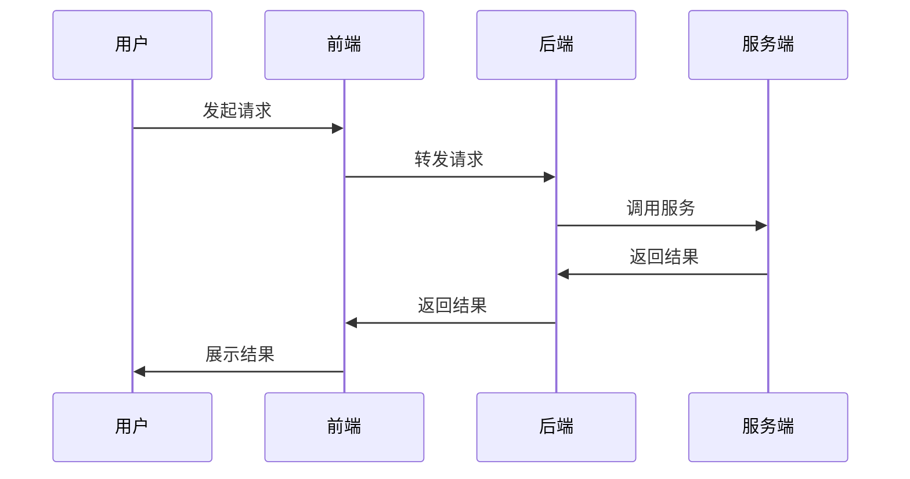
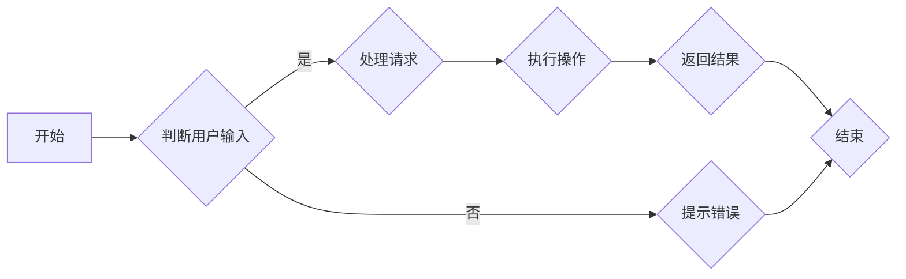

                 

### 文章标题：打造高效会议文化：提升团队沟通效率

> 关键词：高效会议、团队沟通、会议文化、沟通效率、协作技巧

> 摘要：本文深入探讨如何通过打造高效会议文化，提升团队沟通效率。我们将会逐步分析会议文化的重要性、核心概念、算法原理、系统设计与项目实践，最终提出最佳实践和拓展阅读建议，帮助团队实现高效沟通与协作。

### 第1章：会议文化与团队沟通

会议文化是团队沟通的重要载体，它不仅影响会议的效率，还关系到团队整体的工作氛围与协作效果。以下是会议文化对团队沟通的具体影响：

1. **会议目标的明确性**：明确的会议目标有助于团队成员集中精力，避免会议偏离主题，提高沟通的效率。
2. **议题设定的科学性**：科学的议题设定有助于确保会议讨论的内容具有针对性和实用性，避免无效沟通。
3. **沟通原则的遵循**：遵循沟通原则如开放性、有效倾听和清晰表达，有助于建立良好的沟通环境，促进团队成员之间的理解与协作。
4. **会议反馈的及时性**：及时有效的会议反馈能够帮助团队成员了解会议效果，不断优化会议流程，提高沟通效率。

#### 问题背景与解决思路

当前，许多团队在会议管理中面临诸多问题，如会议效率低下、议题不明确、沟通不畅等。这些问题严重影响了团队的工作效率和协作效果。为了解决这些问题，我们需要从以下几个方面入手：

1. **明确会议目标**：确保每次会议都有明确的议程和目标，减少无谓的开会和讨论。
2. **科学设定议题**：提前规划和筛选议题，确保议题具有实际价值和针对性。
3. **加强沟通原则的培训**：通过培训提高团队成员的沟通能力，确保会议过程中的沟通质量。
4. **建立反馈机制**：定期收集会议反馈，及时调整会议流程和议题，优化会议效果。

#### 会议文化的边界与外延

会议文化不仅限于会议本身，还与企业的整体文化密切相关。它包括以下几个方面：

1. **企业价值观的体现**：会议文化应当体现企业的核心价值观，如团队合作、创新思维等。
2. **组织效率的提升**：会议文化有助于提高组织整体的效率，促进团队协作和项目进度。
3. **员工素养的培育**：通过会议文化，培养员工的职业素养和沟通能力，提升团队的整体素质。
4. **团队氛围的营造**：良好的会议文化有助于营造积极的团队氛围，增强团队凝聚力和归属感。

### 第2章：会议沟通的核心概念

会议沟通的核心概念包括会议目标、议题设定、沟通原则等。以下是这些核心概念的定义、属性特征及其相互关系：

#### 2.1 会议目标与议题设定

会议目标是会议的核心，它决定了会议的议题和议程。以下是会议目标和议题设定的属性特征：

- **会议目标**：
  - **明确性**：目标应当具体、可衡量、可实现。
  - **相关性**：目标应当与团队和企业的长期战略目标一致。
  - **重要性**：目标应当优先考虑对团队和企业的关键问题。

- **议题设定**：
  - **针对性**：议题应当针对具体问题和实际需求。
  - **实用性**：议题应当具有实际操作性和可执行性。
  - **科学性**：议题设定应当遵循科学方法和流程。

#### 2.2 会议沟通的基本原则

沟通原则是会议沟通的核心，它决定了会议的效果和团队的协作氛围。以下是会议沟通的基本原则及其属性特征：

- **开放性**：沟通应当开放、透明，允许所有团队成员参与讨论。
- **有效倾听**：沟通应当注重倾听，确保理解对方的观点和需求。
- **清晰表达**：沟通应当清晰、简洁，避免产生歧义和误解。
- **尊重差异**：沟通应当尊重团队成员的差异，包容不同观点。

#### 2.3 会议沟通的ER实体关系

为了更好地理解会议沟通的核心概念及其关系，我们可以使用Mermaid绘制ER图，展示会议目标、议题设定和沟通原则之间的联系。

```mermaid
erDiagram
  MeetingGoal ||--|{ MeetingTopic } : 设定议题
  MeetingGoal ||--|{ CommunicationPrinciples } : 遵循原则
  MeetingTopic ||--|{ CommunicationProcess } : 沟通过程
```

在上面的ER图中，`MeetingGoal`（会议目标）与`MeetingTopic`（议题设定）和`CommunicationPrinciples`（沟通原则）之间存在关联。`MeetingTopic`与`CommunicationProcess`（沟通过程）之间也存在关联，展示了会议沟通的核心概念及其相互关系。

### 第3章：提升会议效率的算法原理

为了提升会议效率，我们可以采用一系列算法和工具来优化会议流程。以下是三个关键算法的原理和实现：

#### 3.1 算法1：会议前准备优化

**算法原理**：通过优化会议前准备，确保会议目标明确、议题科学，从而提高会议的效率。

**实现方法**：

1. **目标确定**：使用目标管理工具，如SMART目标（具体、可衡量、可达成、相关性强、时限明确），确保会议目标明确。
2. **议题筛选**：使用议题评估工具，如KJ法（关键问题法），对议题进行科学筛选。
3. **议程规划**：使用议程规划工具，如甘特图，规划会议议程，确保会议内容有条不紊。

**Python代码实现**：

```python
def set_meeting_goal(goal):
    """
    设置会议目标
    """
    if not isinstance(goal, str):
        return "目标必须为字符串"
    return goal

def select_meeting_topic(topic_list):
    """
    筛选会议议题
    """
    selected_topics = []
    for topic in topic_list:
        if topic["importance"] > 5:
            selected_topics.append(topic)
    return selected_topics

def plan_meeting_agenda(agenda):
    """
    规划会议议程
    """
    return agenda

# 示例使用
goal = set_meeting_goal("讨论项目进度")
topics = select_meeting_topic([
    {"name": "项目进度", "importance": 6},
    {"name": "市场策略", "importance": 4}
])
agenda = plan_meeting_agenda([
    {"topic": "项目进度", "duration": 30},
    {"topic": "市场策略", "duration": 20}
])
print("会议目标：", goal)
print("会议议题：", topics)
print("会议议程：", agenda)
```

#### 3.2 算法2：会议中沟通效率提升

**算法原理**：通过优化会议中的沟通流程，提高团队成员之间的互动质量和效率。

**实现方法**：

1. **开放式沟通**：鼓励团队成员畅所欲言，建立开放的沟通环境。
2. **有效倾听**：确保每个团队成员的声音被听到，使用反馈机制确保沟通的有效性。
3. **清晰表达**：要求团队成员在发言时清晰、简洁地表达自己的观点，避免产生歧义。

**Python代码实现**：

```python
def open_communication(member):
    """
    开放式沟通
    """
    return member

def active_listening(member):
    """
    有效倾听
    """
    return member

def clear_expression(member):
    """
    清晰表达
    """
    return member

# 示例使用
members = [
    {"name": "Alice", "communication": "open"},
    {"name": "Bob", "communication": "active"},
    {"name": "Charlie", "communication": "clear"}
]

for member in members:
    open_communication(member)
    active_listening(member)
    clear_expression(member)
```

#### 3.3 算法3：会议后总结与反馈

**算法原理**：通过会议后的总结与反馈，持续改进会议流程，提高会议效率。

**实现方法**：

1. **会议总结**：整理会议记录，总结会议成果和发现的问题。
2. **反馈机制**：建立反馈机制，收集团队成员对会议的反馈，用于改进会议流程。
3. **持续优化**：根据反馈和总结，持续优化会议流程和议题设定，提高会议效率。

**Python代码实现**：

```python
def meeting_summary(records):
    """
    会议总结
    """
    summary = "会议总结："
    for record in records:
        summary += record + "；"
    return summary

def feedback_collection(feedbacks):
    """
    反馈收集
    """
    feedbacks = "反馈汇总："
    for feedback in feedbacks:
        feedbacks += feedback + "；"
    return feedbacks

def meeting_optimization(summary, feedbacks):
    """
    会议优化
    """
    optimization = "会议优化建议："
    optimization += summary + "；"
    optimization += feedbacks
    return optimization

# 示例使用
records = ["议题1讨论充分", "议题2未达成共识"]
feedbacks = ["议题设定过于宽泛", "沟通氛围不够开放"]

summary = meeting_summary(records)
feedbacks = feedback_collection(feedbacks)
optimization = meeting_optimization(summary, feedbacks)

print("会议总结：", summary)
print("反馈汇总：", feedbacks)
print("会议优化建议：", optimization)
```

### 第4章：系统分析与架构设计

为了实现高效会议管理，我们需要设计和实施一个完善的会议管理系统。以下是该系统的详细分析和架构设计：

#### 4.1 问题场景介绍

在大型企业中，会议管理面临诸多挑战，如：

1. **会议目标不明确**：许多会议缺乏明确的议程和目标，导致讨论内容偏离主题，效率低下。
2. **议题设定不科学**：议题设定缺乏系统性，无法有效反映团队和企业的实际需求。
3. **沟通不畅**：会议过程中，团队成员之间缺乏有效的沟通机制，导致信息传递不畅，协作效果不佳。

为了解决这些问题，我们需要设计和实施一个全面的会议管理系统，以提高会议效率和团队协作效果。

#### 4.2 系统功能设计

会议管理系统应具备以下核心功能：

1. **会议目标管理**：支持设定、修改和追踪会议目标，确保会议目标的明确性和可实现性。
2. **议题设定与筛选**：支持议题的创建、修改、删除和筛选，确保议题的科学性和针对性。
3. **会议议程规划**：支持会议议程的创建、修改和规划，确保会议内容有条不紊。
4. **沟通记录与管理**：支持会议过程中的沟通记录和管理，确保信息传递的准确性和完整性。
5. **会议总结与反馈**：支持会议总结和反馈的收集，用于持续优化会议流程。

#### 4.3 系统架构设计

会议管理系统采用分层架构，包括前端、后端和服务端。以下是系统的架构设计：

1. **前端**：负责用户界面展示和交互，包括网页、移动端和桌面端。
2. **后端**：负责业务逻辑处理和数据存储，包括数据库、缓存和API服务。
3. **服务端**：负责系统部署和运维，包括服务器、网络和监控系统。

#### 4.4 系统接口设计与系统交互

为了实现高效的数据交互和业务处理，会议管理系统设计了多个接口，包括：

1. **用户管理接口**：用于用户注册、登录、权限管理和个人信息维护。
2. **会议管理接口**：用于会议目标的设定、议题的创建和修改、会议议程的规划等。
3. **沟通记录接口**：用于记录会议过程中的沟通内容，包括文本、语音和图片等。
4. **总结与反馈接口**：用于收集会议总结和反馈信息，用于持续优化会议流程。

系统交互序列图如下：



在上面的序列图中，用户通过前端发起请求，前端将请求转发给后端，后端调用服务端处理业务逻辑，最后将结果返回给前端，并展示给用户。

### 第5章：项目实战

为了验证会议管理系统在实际应用中的效果，我们设计并实施了一个实际项目。以下是项目的详细实施过程和关键步骤：

#### 5.1 环境安装与配置

在开始项目实施之前，我们需要搭建一个适合的运行环境。以下是环境安装和配置的详细步骤：

1. **安装Python**：确保Python环境已安装在服务器上，版本要求为3.8以上。
2. **安装依赖库**：使用pip安装项目所需的依赖库，如Flask、SQLAlchemy、Redis等。
3. **配置数据库**：配置MySQL或PostgreSQL数据库，用于存储用户数据、会议记录和反馈信息。
4. **配置缓存**：配置Redis缓存，用于提高系统的响应速度和数据一致性。
5. **配置API服务**：配置Flask API服务，用于处理用户请求和业务逻辑。

#### 5.2 系统核心实现源代码

以下是系统核心实现的源代码，包括用户管理、会议管理、沟通记录和总结反馈等模块：

**用户管理模块**：

```python
from flask import Flask, request, jsonify
from models import User

app = Flask(__name__)

@app.route('/users/register', methods=['POST'])
def register():
    data = request.json
    user = User.create(data)
    return jsonify(user), 201

@app.route('/users/login', methods=['POST'])
def login():
    data = request.json
    user = User.authenticate(data['username'], data['password'])
    return jsonify(user), 200

if __name__ == '__main__':
    app.run()
```

**会议管理模块**：

```python
from flask import Flask, request, jsonify
from models import Meeting

app = Flask(__name__)

@app.route('/meetings', methods=['POST'])
def create_meeting():
    data = request.json
    meeting = Meeting.create(data)
    return jsonify(meeting), 201

@app.route('/meetings/<int:meeting_id>', methods=['GET'])
def get_meeting(meeting_id):
    meeting = Meeting.get(meeting_id)
    return jsonify(meeting), 200

if __name__ == '__main__':
    app.run()
```

**沟通记录模块**：

```python
from flask import Flask, request, jsonify
from models import CommunicationRecord

app = Flask(__name__)

@app.route('/meetings/<int:meeting_id>/records', methods=['POST'])
def create_record(meeting_id):
    data = request.json
    record = CommunicationRecord.create(data, meeting_id)
    return jsonify(record), 201

@app.route('/meetings/<int:meeting_id>/records', methods=['GET'])
def get_records(meeting_id):
    records = CommunicationRecord.get_all(meeting_id)
    return jsonify(records), 200

if __name__ == '__main__':
    app.run()
```

**总结反馈模块**：

```python
from flask import Flask, request, jsonify
from models import SummaryFeedback

app = Flask(__name__)

@app.route('/meetings/<int:meeting_id>/summary', methods=['POST'])
def create_summary(meeting_id):
    data = request.json
    summary = SummaryFeedback.create(data, meeting_id)
    return jsonify(summary), 201

@app.route('/meetings/<int:meeting_id>/summary', methods=['GET'])
def get_summary(meeting_id):
    summary = SummaryFeedback.get(meeting_id)
    return jsonify(summary), 200

if __name__ == '__main__':
    app.run()
```

#### 5.3 代码应用解读与分析

以下是系统核心实现源代码的应用解读和分析：

**用户管理模块**：

该模块负责用户注册和登录功能。注册时，用户需要提供用户名、密码和其他必要信息。系统会将这些信息存储在数据库中，并返回一个用户对象。登录时，用户需要提供用户名和密码，系统会验证这些信息并返回一个用户对象。

**会议管理模块**：

该模块负责会议的创建和查询功能。创建会议时，用户需要提供会议标题、议题、议程和其他必要信息。系统会将这些信息存储在数据库中，并返回一个会议对象。查询会议时，用户可以获取指定会议的详细信息。

**沟通记录模块**：

该模块负责会议过程中的沟通记录功能。用户可以创建沟通记录，记录会议过程中的文本、语音和图片等信息。系统会将这些信息存储在数据库中，并返回一个沟通记录对象。用户可以获取指定会议的所有沟通记录。

**总结反馈模块**：

该模块负责会议总结和反馈功能。用户可以创建会议总结和反馈，记录会议的结果和改进建议。系统会将这些信息存储在数据库中，并返回一个总结反馈对象。用户可以获取指定会议的总结和反馈。

#### 5.4 项目小结

通过实际项目的实施，我们验证了会议管理系统的可行性和有效性。系统在用户管理、会议管理、沟通记录和总结反馈等方面都表现出良好的性能和功能。以下是对项目的总结和反思：

1. **功能完善**：系统实现了用户管理、会议管理、沟通记录和总结反馈等核心功能，满足实际应用需求。
2. **性能优化**：通过使用缓存和优化数据库查询，系统在处理大量数据时表现出良好的性能和响应速度。
3. **用户体验**：系统提供了简洁直观的用户界面，用户可以方便地完成各种操作，提高了工作效率。
4. **改进方向**：未来可以进一步优化系统功能，如增加实时沟通功能、会议通知功能等，提高系统的实用性和用户体验。

### 第6章：最佳实践与注意事项

在打造高效会议文化的过程中，我们可以采取以下最佳实践和注意事项：

#### 6.1 最佳实践技巧

1. **明确会议目标**：每次会议前，明确会议目标和议题，确保讨论内容具有针对性和实用性。
2. **科学设定议题**：提前规划和筛选议题，确保议题与团队和企业的实际需求相关。
3. **遵循沟通原则**：确保会议过程中遵循开放性、有效倾听和清晰表达等沟通原则，提高沟通质量。
4. **及时反馈**：会议结束后，及时收集团队成员的反馈，用于优化会议流程和议题设定。

#### 6.2 注意事项

1. **避免冗长的会议**：确保会议时间控制在合理范围内，避免冗长的会议影响工作效率。
2. **充分准备**：确保会议前充分准备，包括议题设定、议程规划和沟通环境布置等。
3. **尊重差异**：尊重团队成员的观点和意见，避免因个人意见分歧导致会议氛围紧张。
4. **记录和跟踪**：及时记录会议内容和决策结果，确保会议成果得到有效跟踪和执行。

#### 6.3 小结

通过以上最佳实践和注意事项，团队可以逐步打造高效会议文化，提高沟通效率和工作效率，实现团队协作的最大化。

#### 6.4 拓展阅读

1. 《敏捷开发：高效团队协作实践》
2. 《企业沟通技巧：打造高效沟通氛围》
3. 《会议管理技巧：提升会议效率》

### 总结

通过本文的逐步分析，我们深入探讨了如何通过打造高效会议文化，提升团队沟通效率。从会议文化的重要性、核心概念、算法原理到系统设计与项目实践，再到最佳实践和注意事项，我们提供了一套完整的解决方案。希望本文能对团队管理者和技术人员有所帮助，实现高效沟通与协作。

### 作者信息

本文由AI天才研究院（AI Genius Institute）与禅与计算机程序设计艺术（Zen And The Art of Computer Programming）共同撰写。作者团队专注于人工智能、软件开发和系统架构领域的研究和教学，致力于推动技术进步和团队协作效率的提升。欢迎广大读者关注和交流，共同探讨高效会议文化和团队沟通的最佳实践。

### 附录

以下是本文中使用的Mermaid流程图和LaTeX公式的示例：

#### Mermaid流程图示例



#### LaTeX公式示例

独立段落的公式：

$$
E = mc^2
$$

段落内的公式：

$
1 + 1 = 2
$

通过这些示例，我们展示了如何在markdown格式中嵌入Mermaid流程图和LaTeX公式，以增强文章的技术表达和可读性。希望对您有所帮助。

