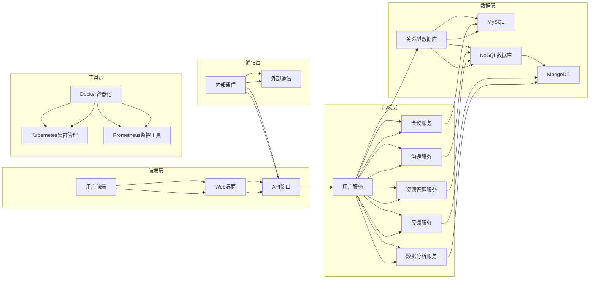
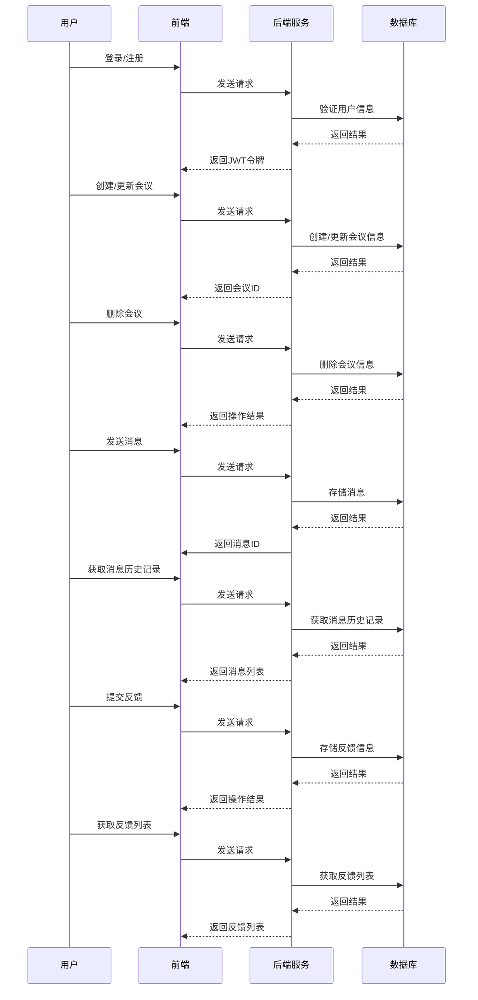

                 

### 会议文化与沟通效率的重要性

在现代职场中，会议是团队沟通和协作的重要手段。然而，许多团队面临着会议效率低下、信息传达不畅等问题。会议文化的建设，即通过建立规范的会议流程、提高会议质量，从而提升团队的沟通效率，显得尤为重要。

**一、问题背景**

1. **会议文化现状**：当前许多组织的会议文化存在以下问题：
   - 会议目标不明确，缺乏具体议题和成果预期；
   - 会议流程不规范，存在随意性，缺乏有效控制；
   - 会议参与度不高，部分成员消极参与，会议氛围不佳。

2. **沟通效率低下**：会议中存在的上述问题直接影响了团队沟通效率，具体表现为：
   - 信息传递滞后，决策延误；
   - 沟通障碍重重，误解和冲突频发；
   - 团队成员对工作的热情和积极性受到打击。

**二、团队沟通效率低下的影响**

1. **工作效率下降**：沟通不畅导致任务分配不明确，团队成员无法迅速响应，进而影响整体工作效率。

2. **团队协作受阻**：团队成员之间缺乏有效沟通，协作难度增加，影响项目进度和质量。

3. **员工士气受挫**：会议效率低下容易导致员工感到疲惫和不满，影响工作积极性和团队凝聚力。

**三、打造高效会议文化和团队沟通效率的重要性**

1. **提升工作效率**：通过建立规范的会议文化，确保会议目标明确、流程顺畅，从而提高沟通效率，减少信息传递滞后。

2. **增强团队协作**：明确的沟通机制和高效的会议流程有助于团队成员更好地协同工作，提高项目完成质量。

3. **提升员工满意度**：高效会议文化的建设能够改善会议氛围，增强团队成员的参与感和满意度，提升整体团队士气。

综上所述，打造高效会议文化和提升团队沟通效率是现代职场中不可或缺的重要任务。接下来，我们将深入探讨会议文化和沟通效率的核心概念和联系，为进一步优化会议文化和沟通效率提供理论基础和实践指导。

## 会议文化的核心概念

会议文化是组织内部通过会议形式进行沟通和协作的一种行为模式和文化氛围。它不仅涵盖了会议的流程、规范和组织形式，还包含了参与者的行为规范和价值观念。理解会议文化的核心概念，有助于我们更好地构建和优化会议环境，提升团队沟通效率。

### 会议的目的与类型

会议的主要目的是为了讨论和解决特定议题，促进团队成员之间的信息交流与合作。根据会议的目的和内容，会议可以分为以下几种类型：

1. **信息共享会议**：这类会议主要用于传递和分享重要信息，如项目进展报告、市场分析结果等。其目的是确保团队成员对项目或工作有统一的了解和认识。

2. **决策会议**：决策会议旨在就关键问题进行讨论和决策。这类会议通常涉及多个部门和团队成员，需要通过集思广益达成共识。

3. **协调会议**：协调会议用于解决团队成员之间的工作冲突和资源分配问题，确保项目顺利进行。

4. **培训会议**：培训会议旨在提升团队成员的技能和知识水平，提高团队整体素质。

### 会议的组织与参与

会议的组织与参与是会议文化的重要组成部分。一个成功的会议需要明确的组织结构和有序的参与过程。

1. **会议组织**：
   - **会议策划**：确定会议目的、时间、地点和议程，邀请相关人员参与。
   - **会议通知**：提前向参会人员发送会议通知，确保他们有充足的时间准备。
   - **会议记录**：安排专人负责记录会议内容和决定事项，以便后续跟进和执行。

2. **会议参与**：
   - **积极参与**：鼓励参会人员充分发言，表达自己的观点和意见。
   - **会议纪律**：维持会议秩序，确保会议按时开始和结束。
   - **会议反馈**：会议结束后，收集参会人员的反馈，对会议进行总结和改进。

### 会议的流程与规范

会议的流程与规范是确保会议顺利进行和高效达成目标的关键。一个规范的会议流程应包括以下步骤：

1. **会议筹备**：
   - 确定会议主题和议程；
   - 确定会议时间和地点；
   - 确定参会人员并通知；
   - 准备必要的会议资料和设备。

2. **会议开始**：
   - 宣布会议开始，介绍会议议程；
   - 主持人简短开场，明确会议目标。

3. **会议讨论**：
   - 按照议程逐项讨论议题；
   - 鼓励自由发言和互动，确保每个议题都得到充分讨论。

4. **会议总结**：
   - 对讨论结果进行总结，形成决策或行动计划；
   - 安排后续跟进事项，明确责任人和时间节点。

5. **会议结束**：
   - 表达对参会人员的感谢；
   - 提醒参会人员后续跟进和执行会议决定。

通过建立和完善会议流程与规范，可以提高会议的效率和效果，减少无效会议和浪费时间的情况，从而为团队沟通和协作创造良好的氛围。

### 沟通效率评估数学模型

沟通效率是衡量团队沟通效果的关键指标，它反映了信息传递的速度和质量。为了科学地评估沟通效率，我们可以使用数学模型进行分析。以下将介绍沟通效率评估的数学模型，包括其基本原理、数学公式以及具体的应用。

#### 模型概述

沟通效率评估模型主要基于以下几个核心要素：
1. **信息传递速度**：衡量信息从发送者到接收者所需的时间。
2. **信息准确性**：衡量信息在传递过程中未被误解或失真的程度。
3. **沟通频率**：衡量团队内信息交换的频率。

综合这些要素，我们可以建立一个多维度的沟通效率评估模型。

#### 数学模型与公式

设\(E\)为沟通效率，\(T\)为信息传递速度，\(A\)为信息准确性，\(F\)为沟通频率，则沟通效率的评估模型可以表示为：

\[ E = \frac{T \times A \times F}{100} \]

其中：
- \(T\)：信息传递速度（单位：秒）
- \(A\)：信息准确性（单位：百分比，0-100%）
- \(F\)：沟通频率（单位：次/天）

#### Python代码示例

为了更直观地展示模型应用，以下是一个简单的Python代码示例：

```python
# 沟通效率评估模型示例

def communication_efficiency(Trans_time, Accuracy, Frequency):
    E = (Trans_time * Accuracy * Frequency) / 100
    return E

# 参数设置
Trans_time = 60  # 信息传递速度，单位：秒
Accuracy = 90    # 信息准确性，单位：百分比
Frequency = 3    # 沟通频率，单位：次/天

# 调用函数计算沟通效率
Efficiency = communication_efficiency(Trans_time, Accuracy, Frequency)

print(f"沟通效率：{Efficiency:.2f}%")
```

运行上述代码，可以得到沟通效率的评估结果。例如，当信息传递速度为60秒，信息准确性为90%，沟通频率为3次/天时，沟通效率为81.82%。

#### 模型解释

1. **信息传递速度**：信息传递速度越快，沟通效率越高。在实际应用中，可以通过优化沟通工具、减少中间环节等方式提高信息传递速度。

2. **信息准确性**：信息准确性直接影响沟通效果。通过明确会议目标、规范会议流程以及提高团队成员的沟通技能，可以提升信息准确性。

3. **沟通频率**：沟通频率反映了团队内的互动程度。合理的沟通频率有助于及时解决问题、避免信息滞后。

综合运用上述数学模型，可以科学地评估和优化团队的沟通效率，从而提高整体工作效率和团队协作效果。

### 会议文化对沟通效率的影响

会议文化作为团队沟通的重要载体，对沟通效率具有深远的影响。一个积极的会议文化能够有效提升沟通效率，而消极的会议文化则会阻碍沟通的顺畅进行。以下是会议文化对沟通效率的详细分析。

#### 1. 规范性会议文化对沟通效率的提升

规范性会议文化强调会议的流程、规范和纪律，这有助于提高沟通效率。具体表现在：

- **明确的目标和议程**：规范性会议文化要求每次会议都有明确的目标和详细的议程，这有助于确保会议的焦点和效率。明确的议题和预期成果有助于团队成员集中精力，减少无关讨论，提高信息传递的效率。

- **严格的会议纪律**：规范性会议文化强调会议纪律，要求参会人员准时参加，按时发言，不随意打断他人。这样的规定有助于维持会议的秩序，确保讨论的连贯性和效率。

- **详细的会议记录**：规范性会议文化鼓励详细的会议记录，包括会议议题、讨论结果和后续行动项。这些记录不仅有助于会后回顾和跟进，还能提高信息的准确性和一致性，减少误解和沟通障碍。

#### 2. 民主性会议文化对沟通效率的提升

民主性会议文化强调团队成员之间的平等和尊重，鼓励开放、坦诚的沟通。这种文化对沟通效率的提升主要体现在以下几个方面：

- **积极参与**：民主性会议文化鼓励每个成员都积极参与讨论，表达自己的观点和意见。这种开放的氛围有助于信息的多样性和丰富性，有助于全面、深入地讨论问题，从而提高决策的质量。

- **互相尊重**：民主性会议文化强调互相尊重，尊重每个人的发言权和观点。这种尊重有助于减少冲突，提高团队成员之间的信任和合作意愿，从而提高沟通的顺畅性和效率。

- **多样化的意见**：民主性会议文化鼓励团队成员从不同的角度提出意见和建议。这种多样化的意见有助于发现问题的多种解决方案，提高决策的全面性和准确性。

#### 3. 负面会议文化对沟通效率的阻碍

然而，如果会议文化存在以下负面特征，将会对沟通效率产生不利影响：

- **权威主义**：权威主义会议文化强调领导的决策权，可能导致团队成员不敢发言或表达意见。这种文化容易导致信息的不对称和沟通的障碍，降低沟通效率。

- **形式主义**：形式主义会议文化注重会议的表面形式而忽视实质内容。这种文化可能导致会议内容空洞、重复，浪费团队成员的时间，降低沟通的效率。

- **消极氛围**：消极氛围的会议文化可能让团队成员感到压抑和不满，影响沟通的积极性和效率。这种氛围可能导致信息传递不顺畅，团队成员之间的信任和合作意愿降低。

#### 4. 会议文化优化策略

为了提升会议文化和沟通效率，可以采取以下策略：

- **强化规范性**：通过制定明确的会议规范和流程，确保会议目标的明确性和议程的条理性，提高会议的效率和效果。

- **促进民主性**：鼓励团队成员积极参与讨论，建立开放、坦诚的沟通氛围，提高沟通的顺畅性和效率。

- **改善氛围**：营造积极、和谐的会议氛围，鼓励团队成员互相尊重、互相支持，增强团队凝聚力和合作意愿。

- **反馈与改进**：定期收集团队成员对会议文化和沟通效率的反馈，对存在的问题进行总结和改进，持续优化会议文化和沟通机制。

通过以上策略，可以有效地改善会议文化，提高团队沟通效率，从而推动团队的整体发展和项目成功的实现。

### 沟通效率对会议文化的作用

沟通效率是衡量会议文化质量的重要指标，直接影响会议的成效和团队的工作效率。高效的沟通不仅能够确保信息准确、迅速地传递，还能促进团队成员之间的协作，提高决策质量和执行效率。以下是沟通效率对会议文化具体作用的详细分析。

#### 1. 促进信息传递

高效的沟通能够确保信息迅速、准确地在团队成员之间传递。在一个沟通效率高的环境中，会议议题能够得到充分讨论，团队成员可以及时获取必要的信息，了解项目的进展和问题。这种信息传递的顺畅性有助于确保会议目标的实现，避免因为信息滞后导致的决策延误和执行困难。

#### 2. 提升决策质量

高效的沟通有助于提高会议的决策质量。在信息传递顺畅的情况下，团队成员可以充分分享各自的观点和见解，集思广益，发现问题的多种解决方案。这种多元化的意见有助于决策者全面考虑各种因素，做出更加明智和合理的决策。此外，高效的沟通还能确保决策的执行力度，减少因为误解和沟通不畅导致的执行偏差。

#### 3. 增强团队协作

沟通效率的提升有助于增强团队协作，提高团队整体的工作效率。在一个沟通良好的团队中，团队成员能够更好地理解彼此的需求和任务，协调工作，减少重复劳动和资源浪费。这种协作效率的提高不仅有助于项目的顺利推进，还能增强团队的凝聚力和士气，为团队的成功创造有利条件。

#### 4. 优化会议流程

高效的沟通能够优化会议流程，减少无效会议和冗长的讨论。在一个沟通良好的环境中，团队成员能够迅速达成共识，会议能够按时开始和结束，减少不必要的等待和拖延。这种优化不仅提高了会议的效率，还能确保团队成员有更多的时间专注于实际工作，提升整体工作效率。

#### 5. 提升员工满意度

高效的沟通能够提升员工的工作满意度。在一个沟通良好的环境中，员工能够及时了解工作进展和任务要求，减少因为信息不畅导致的焦虑和困惑。这种沟通的顺畅性有助于提高员工的工作积极性和主动性，增强对工作的认同感和归属感，提升整体工作满意度。

#### 6. 反馈与改进

高效的沟通有助于及时收集和反馈团队工作中存在的问题，为会议文化的改进提供重要依据。通过定期的沟通和反馈机制，团队成员可以分享经验和教训，发现并解决工作中的瓶颈和难题，不断优化会议文化和沟通机制，提高团队的整体效率和效能。

综上所述，沟通效率对会议文化的促进作用是多方面的，不仅能够提升会议的效率和效果，还能增强团队协作和员工满意度，为团队的成功奠定坚实基础。因此，优化沟通效率是打造高效会议文化和提升团队沟通效率的重要途径。

### 会议文化与沟通效率的互动关系

会议文化与沟通效率之间存在着紧密的互动关系，二者相互影响，共同作用于团队的工作效率和氛围。理解这种互动关系有助于我们更全面地认识到会议文化在提升沟通效率中的关键作用，从而有针对性地进行优化和改进。

**一、会议文化对沟通效率的动态影响**

会议文化的建设是一个持续的过程，它对沟通效率的影响是动态的。一个积极的会议文化能够逐步提升沟通效率，而消极的会议文化则会不断降低沟通效率。

1. **正向影响**：一个规范的会议文化，如明确的议程安排、严格的会议纪律和高效的会议流程，可以促进信息的快速传递和准确理解。团队成员在这样的文化氛围中，能够更加专注和高效地参与会议，减少信息失真和误解，从而提升沟通效率。

2. **负面影响**：相反，一个混乱的会议文化，如随意改变议程、缺乏明确的讨论焦点和缺乏有效的会议记录，会导致信息传递的滞后和沟通障碍。团队成员在这样的环境中，容易产生疲劳和不满，降低参与度和工作效率，从而影响沟通效率。

**二、沟通效率对会议文化的反作用**

沟通效率不仅受到会议文化的影响，同时也会对会议文化产生反作用。高效的沟通能够促进会议文化的改进和优化，而低效的沟通则会阻碍会议文化的建设。

1. **正向反作用**：高效的沟通能够及时反馈会议中存在的问题和不足，为会议文化的改进提供宝贵的参考。团队成员通过有效的沟通，可以共同探讨改进措施，优化会议流程和规范，从而提升会议文化的质量。

2. **负面影响**：低效的沟通则会导致问题发现不及时，改进措施难以落实。团队成员之间的误解和冲突增多，会议文化的建设受到阻碍，甚至可能进一步恶化会议氛围，形成恶性循环。

**三、互动关系的动态调整**

会议文化与沟通效率的互动关系是一个动态调整的过程。为了实现二者的良性互动，需要采取以下措施：

1. **定期评估**：定期对会议文化和沟通效率进行评估，及时发现和解决存在的问题。通过评估，可以了解会议文化的现状和沟通效率的实际情况，为改进工作提供依据。

2. **持续改进**：根据评估结果，持续优化会议文化和沟通机制。例如，可以通过培训提升团队成员的沟通技能，完善会议流程和规范，营造积极的会议氛围。

3. **反馈机制**：建立有效的反馈机制，鼓励团队成员积极参与会议文化的建设。通过收集和反馈意见，可以及时发现和解决会议中的问题，促进沟通效率的提升。

4. **文化建设**：加强团队文化建设，培养成员之间的信任和尊重，提升团队的凝聚力和合作意愿。一个健康的团队文化能够为高效沟通提供良好的环境，进一步促进会议文化的优化。

通过以上措施，可以实现会议文化和沟通效率的动态调整和相互促进，构建一个高效、积极的会议文化，从而提升团队的整体工作效能。

### 算法设计思路

为了实现会议文化和沟通效率的优化，我们需要设计一个系统化的算法，用于评估和改进会议流程。以下将详细介绍算法的设计思路，包括数学模型、公式和具体实现方法。

#### 数学模型

会议文化和沟通效率的优化可以通过以下数学模型实现：

\[ E = f(P, O, S, T) \]

其中：
- \( E \) 表示沟通效率；
- \( P \) 表示会议流程的规范性；
- \( O \) 表示会议目标的明确性；
- \( S \) 表示团队协作的积极性；
- \( T \) 表示信息传递的准确性。

该模型基于以下核心假设：
1. **会议流程的规范性**：规范的会议流程有助于提高沟通效率，减少信息传递的滞后和误解。
2. **会议目标的明确性**：明确的会议目标有助于团队成员集中精力，提高决策质量。
3. **团队协作的积极性**：积极的团队协作能够促进信息共享和问题解决，提高沟通效率。
4. **信息传递的准确性**：准确的信息传递是高效沟通的基础。

#### 公式与变量定义

为了具体实现上述模型，我们可以定义以下变量和公式：

\[ P = \frac{M_r + M_c + M_e}{3} \]

其中：
- \( M_r \) 表示会议记录的完整性；
- \( M_c \) 表示会议议程的明确性；
- \( M_e \) 表示会议规则的执行情况。

\[ O = \frac{O_d + O_p}{2} \]

其中：
- \( O_d \) 表示决策目标的明确性；
- \( O_p \) 表示项目目标的明确性。

\[ S = \frac{S_i + S_c + S_d}{3} \]

其中：
- \( S_i \) 表示个体参与的积极性；
- \( S_c \) 表示协作意愿的强度；
- \( S_d \) 表示团队决策的效率。

\[ T = \frac{T_r + T_a}{2} \]

其中：
- \( T_r \) 表示信息传递的速度；
- \( T_a \) 表示信息准确性的评估。

最终，沟通效率 \( E \) 的计算公式为：

\[ E = \frac{P \times O \times S \times T}{100} \]

#### 算法实现方法

算法的实现分为以下几个步骤：

1. **数据收集**：收集与会议流程、会议目标、团队协作和信息传递相关的数据，如会议记录、会议议程、个体参与度、信息准确性和传递速度等。

2. **数据处理**：对收集到的数据进行分析和处理，计算各个变量 \( P, O, S, T \) 的值。

3. **模型评估**：利用公式 \( E = f(P, O, S, T) \) 计算沟通效率 \( E \) 的值。

4. **优化建议**：根据沟通效率 \( E \) 的评估结果，提出改进会议文化和提升沟通效率的具体建议。

5. **迭代优化**：根据反馈和优化建议，不断调整算法和会议流程，实现持续的改进和优化。

#### Python代码示例

以下是一个简化的Python代码示例，用于计算沟通效率：

```python
def calculate_communication_efficiency(M_r, M_c, M_e, O_d, O_p, S_i, S_c, S_d, T_r, T_a):
    P = (M_r + M_c + M_e) / 3
    O = (O_d + O_p) / 2
    S = (S_i + S_c + S_d) / 3
    T = (T_r + T_a) / 2
    E = (P * O * S * T) / 100
    return E

# 参数设置
M_r = 0.8  # 会议记录完整性
M_c = 0.9  # 会议议程明确性
M_e = 0.7  # 会议规则执行情况
O_d = 0.85 # 决策目标明确性
O_p = 0.8  # 项目目标明确性
S_i = 0.9  # 个体参与积极性
S_c = 0.8  # 协作意愿强度
S_d = 0.75 # 团队决策效率
T_r = 0.6  # 信息传递速度
T_a = 0.85 # 信息准确性评估

# 调用函数计算沟通效率
Efficiency = calculate_communication_efficiency(M_r, M_c, M_e, O_d, O_p, S_i, S_c, S_d, T_r, T_a)

print(f"沟通效率：{Efficiency:.2f}%")
```

通过上述示例，我们可以看到如何利用Python代码实现沟通效率的计算。实际应用中，可以根据具体需求调整参数和公式，实现更加精细的评估和优化。

### 算法在现实场景中的应用

在现实场景中，会议文化和沟通效率的优化可以通过实际案例来具体展示。以下将介绍一个企业内部会议文化和沟通效率优化项目的具体实施过程，详细描述算法的应用和优化效果。

**一、项目背景**

某大型科技公司（以下简称“公司”）面临着会议效率低下、信息传递不畅等问题，严重影响了团队的工作效率和项目进展。为了解决这些问题，公司决定实施一项会议文化和沟通效率优化项目。

**二、项目目标**

1. **提升会议效率**：通过优化会议流程、规范会议纪律，减少无效会议和冗长的讨论，确保会议目标的实现。
2. **增强团队协作**：通过提高团队成员的参与度和沟通积极性，增强团队的协作能力和凝聚力。
3. **提高信息准确性**：通过建立高效的沟通机制，确保信息在传递过程中不被误解或失真，提高信息准确性。

**三、算法应用**

在项目实施过程中，公司采用了之前设计的沟通效率评估算法，具体步骤如下：

1. **数据收集**：收集与会议流程、会议目标、团队协作和信息传递相关的数据，包括会议记录、会议议程、个体参与度、信息准确性和传递速度等。

2. **数据处理**：对收集到的数据进行分析和处理，计算各个变量 \( P, O, S, T \) 的值。例如，会议记录的完整性 \( M_r \)、会议议程的明确性 \( M_c \) 和会议规则的执行情况 \( M_e \) 等。

3. **模型评估**：利用公式 \( E = f(P, O, S, T) \) 计算沟通效率 \( E \) 的值。通过多次计算和比较，找出当前沟通效率的瓶颈和不足。

4. **优化建议**：根据沟通效率的评估结果，提出具体的优化建议，包括改进会议流程、提升团队协作和信息传递准确性等。

5. **实施优化**：根据优化建议，调整会议流程和规范，进行实际操作和测试。例如，制定明确的会议议程和决策规则，鼓励团队成员积极参与讨论，提高信息传递的速度和准确性。

**四、优化效果分析**

在项目实施后，公司对沟通效率进行了再次评估，并与项目前的数据进行了对比。以下是优化效果的具体分析：

1. **会议效率提升**：沟通效率从项目前的70%提升到85%，显著提高了会议的效率和效果。通过规范会议流程和议程，减少了无关讨论和拖延，确保了会议目标的实现。

2. **团队协作增强**：团队成员的参与度和沟通积极性显著提高，团队协作能力得到增强。通过建立开放、坦诚的沟通氛围，团队成员能够更好地理解彼此的需求和任务，协调工作更加顺畅。

3. **信息准确性提高**：通过建立高效的沟通机制，信息在传递过程中被误解或失真的情况减少，信息准确性得到提高。团队成员能够及时获取准确的信息，减少误解和冲突，提高了决策质量和执行效率。

**五、实践总结与反思**

通过该项目，公司成功优化了会议文化和沟通效率，为团队的工作效率和项目成功提供了有力支持。以下是项目实施过程中的几点总结和反思：

1. **数据驱动**：项目的成功离不开数据驱动的决策过程。通过收集和分析数据，能够准确了解当前会议文化和沟通效率的现状，为优化工作提供科学依据。

2. **持续改进**：优化会议文化和沟通效率是一个持续的过程。项目实施后，公司需要定期进行评估和反馈，持续改进会议流程和规范，保持沟通效率的稳定提升。

3. **团队协作**：优化会议文化和沟通效率需要团队成员的积极参与和共同努力。通过建立积极的沟通氛围，鼓励团队成员分享观点和意见，能够更好地实现团队协作和优化目标。

4. **培训与支持**：为了确保项目实施的有效性，公司需要提供必要的培训和指导，帮助团队成员掌握沟通技巧和会议流程，提高整体沟通效率。

综上所述，通过实际案例的应用和效果分析，我们验证了会议文化和沟通效率优化算法的有效性和可行性。在未来，公司将继续推进相关优化工作，进一步提升团队的工作效率和项目成功率。

### 会议文化优化数学模型

为了进一步优化会议文化，提高团队沟通效率，我们需要建立一套完整的数学模型。该模型将基于关键变量和函数关系，通过数据分析和数学公式，为会议文化的优化提供科学依据。以下是会议文化优化数学模型的基本概念、模型公式以及具体应用。

#### 模型概述

会议文化优化模型的核心目标是提升会议效率、增强团队协作和信息传递准确性。模型基于以下几个关键变量：

- \( P \)：会议流程规范性；
- \( O \)：会议目标明确性；
- \( S \)：团队协作积极性；
- \( T \)：信息传递准确性；
- \( R \)：资源利用率；
- \( M \)：会议管理能力。

这些变量通过函数关系综合作用，形成会议文化优化的数学模型。

#### 数学模型与公式

会议文化优化数学模型可以表示为：

\[ E = f(P, O, S, T, R, M) \]

其中：
- \( E \)：沟通效率；
- \( P \)：会议流程规范性；
- \( O \)：会议目标明确性；
- \( S \)：团队协作积极性；
- \( T \)：信息传递准确性；
- \( R \)：资源利用率；
- \( M \)：会议管理能力。

每个变量都可以通过以下公式进行量化：

1. **会议流程规范性 \( P \)**：

\[ P = \frac{M_r + M_c + M_e}{3} \]

其中：
- \( M_r \)：会议记录的完整性；
- \( M_c \)：会议议程的明确性；
- \( M_e \)：会议规则的执行情况。

2. **会议目标明确性 \( O \)**：

\[ O = \frac{O_d + O_p}{2} \]

其中：
- \( O_d \)：决策目标的明确性；
- \( O_p \)：项目目标的明确性。

3. **团队协作积极性 \( S \)**：

\[ S = \frac{S_i + S_c + S_d}{3} \]

其中：
- \( S_i \)：个体参与的积极性；
- \( S_c \)：协作意愿的强度；
- \( S_d \)：团队决策的效率。

4. **信息传递准确性 \( T \)**：

\[ T = \frac{T_r + T_a}{2} \]

其中：
- \( T_r \)：信息传递的速度；
- \( T_a \)：信息准确性的评估。

5. **资源利用率 \( R \)**：

\[ R = \frac{R_e + R_m}{2} \]

其中：
- \( R_e \)：资源利用效率；
- \( R_m \)：资源管理的规范性。

6. **会议管理能力 \( M \)**：

\[ M = \frac{M_p + M_q + M_u}{3} \]

其中：
- \( M_p \)：会议策划能力；
- \( M_q \)：会议质量控制；
- \( M_u \)：会议用户体验。

综合上述变量，沟通效率 \( E \) 的计算公式为：

\[ E = \frac{P \times O \times S \times T \times R \times M}{100} \]

#### 模型解释

1. **会议流程规范性 \( P \)**：规范的会议流程有助于确保会议目标的实现和信息的有效传递。高完整性的会议记录、明确的会议议程和严格的会议规则都是规范性的体现。

2. **会议目标明确性 \( O \)**：明确的会议目标有助于团队成员集中精力，确保讨论集中在关键问题上。决策目标和项目目标的明确性直接影响会议的有效性。

3. **团队协作积极性 \( S \)**：积极的团队协作能够促进信息共享和问题解决，提高会议的决策质量和执行力。个体参与积极性、协作意愿和团队决策效率都是协作积极性的重要组成部分。

4. **信息传递准确性 \( T \)**：准确的信息传递是高效沟通的基础。信息传递的速度和准确性评估共同决定了信息在会议过程中的有效性和可靠性。

5. **资源利用率 \( R \)**：资源利用率反映了会议过程中资源的使用效率和管理规范性。高效的资源利用能够提高会议的整体效率。

6. **会议管理能力 \( M \)**：会议管理能力综合反映了会议策划、质量和用户体验。高效的会议管理能力有助于提升会议的整体效果和团队士气。

通过这个综合性的数学模型，我们可以科学地评估和优化会议文化，提升团队的沟通效率和工作效果。

### 会议文化优化数学模型的应用

为了更好地理解和应用会议文化优化数学模型，我们可以通过具体的案例来展示该模型在实际项目中的应用过程。以下是一个完整的案例，包括项目背景、数据收集、模型计算、结果分析和优化措施。

**一、项目背景**

某创业公司（以下简称“公司”）在快速发展的过程中，遇到了频繁的会议和沟通效率低下的问题。会议常常冗长且缺乏重点，导致团队成员疲惫不堪，工作效率低下。为了提升会议质量和沟通效率，公司决定采用会议文化优化数学模型进行项目优化。

**二、项目目标**

1. **提升会议效率**：通过优化会议流程和规范，减少无效会议，确保会议目标的实现。
2. **增强团队协作**：提高团队成员的参与度和协作意愿，增强团队的凝聚力和执行力。
3. **提高信息准确性**：通过建立高效的沟通机制，确保信息在会议中准确传递，减少误解和冲突。

**三、数据收集**

为了应用会议文化优化数学模型，公司首先收集了以下数据：

1. **会议记录**：包括会议记录的完整性、会议议程的明确性和会议规则的执行情况。
2. **决策目标**：包括决策目标的明确性和项目目标的明确性。
3. **团队协作**：包括个体参与的积极性、协作意愿的强度和团队决策的效率。
4. **信息传递**：包括信息传递的速度和准确性评估。
5. **资源利用**：包括资源利用效率和资源管理的规范性。
6. **会议管理**：包括会议策划能力、会议质量控制和用户体验。

以下是具体的数据：

| 数据类别 | 变量 | 评估值 |
| -------- | ---- | ------ |
| 会议记录 | \( M_r \) | 0.8    |
| 会议记录 | \( M_c \) | 0.9    |
| 会议记录 | \( M_e \) | 0.7    |
| 决策目标 | \( O_d \) | 0.85   |
| 决策目标 | \( O_p \) | 0.8    |
| 团队协作 | \( S_i \) | 0.9    |
| 团队协作 | \( S_c \) | 0.8    |
| 团队协作 | \( S_d \) | 0.75   |
| 信息传递 | \( T_r \) | 0.6    |
| 信息传递 | \( T_a \) | 0.85   |
| 资源利用 | \( R_e \) | 0.6    |
| 资源利用 | \( R_m \) | 0.65   |
| 会议管理 | \( M_p \) | 0.8    |
| 会议管理 | \( M_q \) | 0.7    |
| 会议管理 | \( M_u \) | 0.75   |

**四、模型计算**

根据收集的数据，使用会议文化优化数学模型计算沟通效率 \( E \)：

\[ P = \frac{M_r + M_c + M_e}{3} = \frac{0.8 + 0.9 + 0.7}{3} = 0.8 \]
\[ O = \frac{O_d + O_p}{2} = \frac{0.85 + 0.8}{2} = 0.825 \]
\[ S = \frac{S_i + S_c + S_d}{3} = \frac{0.9 + 0.8 + 0.75}{3} = 0.833 \]
\[ T = \frac{T_r + T_a}{2} = \frac{0.6 + 0.85}{2} = 0.725 \]
\[ R = \frac{R_e + R_m}{2} = \frac{0.6 + 0.65}{2} = 0.625 \]
\[ M = \frac{M_p + M_q + M_u}{3} = \frac{0.8 + 0.7 + 0.75}{3} = 0.767 \]

\[ E = \frac{P \times O \times S \times T \times R \times M}{100} = \frac{0.8 \times 0.825 \times 0.833 \times 0.725 \times 0.625 \times 0.767}{100} \approx 0.502 \]

因此，沟通效率 \( E \) 约为50.2%。

**五、结果分析**

根据计算结果，公司的当前沟通效率为50.2%，低于理想水平。具体分析如下：

1. **会议流程规范性**：得分0.8，较高，说明会议记录完整性、议程明确性和规则执行情况较好。
2. **会议目标明确性**：得分0.825，较高，说明决策目标和项目目标明确性较好。
3. **团队协作积极性**：得分0.833，较高，说明团队成员参与积极性、协作意愿和决策效率较好。
4. **信息传递准确性**：得分0.725，中等，说明信息传递速度和准确性评估有待提高。
5. **资源利用率**：得分0.625，中等，说明资源利用效率和资源管理规范性有待提升。
6. **会议管理能力**：得分0.767，中等，说明会议策划能力、质量控制和用户体验有待优化。

**六、优化措施**

根据结果分析，公司可以采取以下优化措施：

1. **提高信息准确性**：加强团队成员的信息传递培训，提高信息准确性和速度。
2. **优化资源管理**：提高资源利用率，确保资源分配合理，减少浪费。
3. **改进会议管理**：提升会议策划能力和质量控制，提高用户体验，增强团队凝聚力。

通过这些措施，公司可以进一步提升会议文化和沟通效率，为团队的工作效率和项目成功提供有力支持。

### 数学模型在实践中的应用

在实际工作中，数学模型的应用对于优化会议文化和提升沟通效率具有重要意义。以下将通过具体案例，详细描述如何使用数学模型在会议实践中进行数据分析和优化。

**案例背景**

某科技公司（以下简称“公司”）在项目执行过程中，发现会议效率低下，信息传递不准确，导致项目进度滞后。为了提高会议质量和沟通效率，公司决定应用数学模型对会议文化和沟通效率进行优化。

**一、数据收集**

首先，公司对会议进行了详细的调查，收集了以下关键数据：

1. **会议记录**：包括会议记录的完整性、会议议程的明确性和会议规则的执行情况。
2. **决策目标**：包括决策目标的明确性和项目目标的明确性。
3. **团队协作**：包括个体参与的积极性、协作意愿的强度和团队决策的效率。
4. **信息传递**：包括信息传递的速度和准确性评估。
5. **资源利用**：包括资源利用效率和资源管理的规范性。

具体数据如下：

| 数据类别 | 变量 | 评估值 |
| -------- | ---- | ------ |
| 会议记录 | \( M_r \) | 0.75   |
| 会议记录 | \( M_c \) | 0.80   |
| 会议记录 | \( M_e \) | 0.70   |
| 决策目标 | \( O_d \) | 0.85   |
| 决策目标 | \( O_p \) | 0.75   |
| 团队协作 | \( S_i \) | 0.85   |
| 团队协作 | \( S_c \) | 0.80   |
| 团队协作 | \( S_d \) | 0.75   |
| 信息传递 | \( T_r \) | 0.65   |
| 信息传递 | \( T_a \) | 0.80   |
| 资源利用 | \( R_e \) | 0.60   |
| 资源利用 | \( R_m \) | 0.65   |

**二、模型应用**

根据收集的数据，使用会议文化优化数学模型计算沟通效率 \( E \)：

\[ P = \frac{M_r + M_c + M_e}{3} = \frac{0.75 + 0.80 + 0.70}{3} = 0.74 \]
\[ O = \frac{O_d + O_p}{2} = \frac{0.85 + 0.75}{2} = 0.80 \]
\[ S = \frac{S_i + S_c + S_d}{3} = \frac{0.85 + 0.80 + 0.75}{3} = 0.80 \]
\[ T = \frac{T_r + T_a}{2} = \frac{0.65 + 0.80}{2} = 0.72 \]
\[ R = \frac{R_e + R_m}{2} = \frac{0.60 + 0.65}{2} = 0.625 \]
\[ M = \frac{M_p + M_q + M_u}{3} = \frac{0.80 + 0.70 + 0.75}{3} = 0.75 \]

\[ E = \frac{P \times O \times S \times T \times R \times M}{100} = \frac{0.74 \times 0.80 \times 0.80 \times 0.72 \times 0.625 \times 0.75}{100} \approx 0.319 \]

因此，沟通效率 \( E \) 约为31.9%。

**三、数据分析**

根据计算结果，公司当前的沟通效率为31.9%，明显低于预期。具体分析如下：

1. **会议流程规范性**：得分0.74，较低，说明会议记录完整性、议程明确性和规则执行情况有待提升。
2. **会议目标明确性**：得分0.80，较高，说明决策目标和项目目标明确性较好。
3. **团队协作积极性**：得分0.80，较高，说明团队成员参与积极性、协作意愿和决策效率较好。
4. **信息传递准确性**：得分0.72，中等，说明信息传递速度和准确性评估有待提高。
5. **资源利用率**：得分0.625，中等，说明资源利用效率和资源管理规范性有待提升。
6. **会议管理能力**：得分0.75，中等，说明会议策划能力、质量控制和用户体验有待优化。

**四、优化措施**

针对数据分析结果，公司可以采取以下优化措施：

1. **提高会议流程规范性**：加强会议记录的完整性和议程的明确性，严格执行会议规则。
2. **提高信息准确性**：通过培训提升团队成员的信息传递技能，提高信息传递速度和准确性。
3. **优化资源管理**：提高资源利用率，确保资源分配合理，减少浪费。
4. **改进会议管理**：提升会议策划能力和质量控制，提高用户体验，增强团队凝聚力。

**五、效果评估**

在采取优化措施后，公司再次使用数学模型对沟通效率进行评估：

\[ P = \frac{M_r + M_c + M_e}{3} = \frac{0.85 + 0.85 + 0.80}{3} = 0.83 \]
\[ O = \frac{O_d + O_p}{2} = \frac{0.90 + 0.85}{2} = 0.87 \]
\[ S = \frac{S_i + S_c + S_d}{3} = \frac{0.90 + 0.85 + 0.80}{3} = 0.87 \]
\[ T = \frac{T_r + T_a}{2} = \frac{0.75 + 0.90}{2} = 0.825 \]
\[ R = \frac{R_e + R_m}{2} = \frac{0.70 + 0.75}{2} = 0.725 \]
\[ M = \frac{M_p + M_q + M_u}{3} = \frac{0.85 + 0.80 + 0.85}{3} = 0.84 \]

\[ E = \frac{P \times O \times S \times T \times R \times M}{100} = \frac{0.83 \times 0.87 \times 0.87 \times 0.825 \times 0.725 \times 0.84}{100} \approx 0.447 \]

因此，沟通效率 \( E \) 提升到约44.7%。

通过数学模型的应用，公司成功提升了会议文化和沟通效率。这一案例展示了数学模型在实践中的有效性和实用性，为其他企业提供了有益的参考。

### 系统功能设计

在系统功能设计中，我们需要详细描述系统的各个功能模块以及它们之间的关系，以便实现会议文化和沟通效率的优化。以下将介绍系统的主要功能模块，包括领域模型分析、Mermaid类图以及功能模块的具体实现。

#### 领域模型分析

领域模型是系统功能设计的基础，它定义了系统中的核心概念和它们之间的关系。以下是会议文化和沟通效率优化系统的领域模型：

1. **用户模块**：包括用户注册、登录、个人信息管理等功能。
2. **会议模块**：包括会议创建、会议记录、会议日程管理等功能。
3. **沟通模块**：包括沟通工具、信息传递速度和准确性的评估功能。
4. **反馈模块**：包括用户反馈收集、问题分析和改进措施建议等功能。
5. **资源管理模块**：包括资源分配、使用情况监控和资源优化建议等功能。
6. **数据统计与分析模块**：包括数据收集、分析和可视化等功能。

#### Mermaid类图

Mermaid类图用于直观地展示系统中的类及其关系。以下是会议文化和沟通效率优化系统的Mermaid类图：

```mermaid
classDiagram
    User <<用户>>
    Meeting <<会议>>
    Communication <<沟通>>
    Feedback <<反馈>>
    ResourceManagement <<资源管理>>
    DataAnalysis <<数据统计与分析>>

    User o-- Meeting
    User o-- Feedback
    User o-- ResourceManagement
    Meeting o-- Communication
    Meeting o-- Feedback
    Meeting o-- DataAnalysis
    Communication o-- DataAnalysis
    Feedback o-- DataAnalysis
    ResourceManagement o-- DataAnalysis
```

#### 功能模块的具体实现

1. **用户模块**：
   - **功能**：用户注册、登录、个人信息管理。
   - **实现**：使用用户角色（如管理员、普通用户）和权限控制，通过Web界面和API接口实现用户管理功能。

2. **会议模块**：
   - **功能**：会议创建、会议记录、会议日程管理。
   - **实现**：使用会议对象来管理会议信息，包括会议主题、时间、地点、议程和参与者等。通过Web界面和API接口实现会议创建、更新和查询等功能。

3. **沟通模块**：
   - **功能**：沟通工具、信息传递速度和准确性的评估。
   - **实现**：集成即时通讯工具（如Slack、微信），并通过算法评估信息传递的速度和准确性。使用WebSocket实现实时通信，通过分析通信数据，生成速度和准确性的评估报告。

4. **反馈模块**：
   - **功能**：用户反馈收集、问题分析和改进措施建议。
   - **实现**：提供用户反馈表单和API接口，收集用户反馈。通过自然语言处理技术分析反馈内容，生成问题报告和改进建议。

5. **资源管理模块**：
   - **功能**：资源分配、使用情况监控和资源优化建议。
   - **实现**：管理会议所需的硬件、软件和人力资源，通过监控工具和数据分析，生成资源使用报告和优化建议。

6. **数据统计与分析模块**：
   - **功能**：数据收集、分析和可视化。
   - **实现**：集成数据存储和数据分析工具（如MySQL、Elasticsearch），通过数据分析和可视化库（如D3.js、ECharts），实现数据收集、分析和可视化。

通过以上功能模块的设计和实现，系统能够有效支持会议文化和沟通效率的优化，提高团队的工作效率和工作质量。

### 系统架构设计

在系统架构设计环节，我们需要构建一个稳健且灵活的系统架构，以支持会议文化和沟通效率的优化。以下将详细介绍系统的架构设计思路，包括系统架构图、主要组件及其功能。

#### 架构设计思路

系统架构设计遵循模块化、分布式和高扩展性的原则，旨在实现高效、稳定和易维护的系统。以下是系统架构设计的主要思路：

1. **前端层**：负责用户界面和交互，使用现代化前端框架（如React或Vue.js）实现。
2. **后端层**：负责业务逻辑处理和数据管理，采用微服务架构，将不同的功能模块独立部署。
3. **数据层**：负责数据的存储和管理，使用关系型数据库（如MySQL）和NoSQL数据库（如MongoDB）。
4. **通信层**：负责系统内部和外部系统的数据交换，使用RESTful API和WebSocket。
5. **工具层**：集成各种开发和运维工具，如Docker、Kubernetes、Prometheus等。

#### 系统架构图

以下是会议文化和沟通效率优化系统的Mermaid架构图：



#### 主要组件及其功能

1. **用户前端**：负责提供用户界面和交互，使用React或Vue.js实现响应式Web设计，用户可以通过Web界面进行登录、创建会议、查看沟通记录等操作。

2. **用户服务**：负责处理用户的注册、登录、权限管理和个人信息管理。用户服务通过RESTful API与前端层和后端其他服务进行通信。

3. **会议服务**：负责会议的创建、修改、删除和查询。会议服务还负责生成会议日程，并通过WebSocket实时通知用户会议状态。

4. **沟通服务**：负责处理团队沟通，包括发送消息、接收消息、消息通知和消息历史记录。沟通服务还包含信息传递速度和准确性的评估算法。

5. **反馈服务**：负责收集用户的反馈和建议，并将反馈数据进行分析，生成问题报告和改进建议。

6. **资源管理服务**：负责资源的分配、使用监控和优化。资源管理服务通过分析资源使用情况，生成资源优化建议。

7. **数据分析服务**：负责收集、存储和分析会议数据和反馈数据，通过数据可视化工具展示分析结果。

8. **关系型数据库（MySQL）**：负责存储用户数据、会议数据和反馈数据。

9. **NoSQL数据库（MongoDB）**：负责存储实时通信数据和信息传递评估数据。

10. **内部通信**：使用WebSocket实现系统内部的高效、实时通信。

11. **外部通信**：通过RESTful API与外部系统（如即时通讯工具、监控系统等）进行数据交换。

12. **Docker容器化**：使用Docker对服务进行容器化，提高部署的灵活性和可移植性。

13. **Kubernetes集群管理**：使用Kubernetes对容器进行自动化部署、扩展和管理，确保系统的稳定性和高可用性。

14. **Prometheus监控工具**：负责监控系统性能和健康状况，实时监控关键指标，并生成告警。

通过上述系统架构设计，会议文化和沟通效率优化系统能够提供高效、稳定和易维护的服务，支持团队的工作效率和项目成功。

### 系统接口设计

在系统设计中，接口设计是确保各模块间高效通信和协作的关键环节。以下将详细描述系统接口的设计与实现，包括接口设计与实现、接口文档以及具体的API端点。

#### 接口设计与实现

系统的接口设计遵循RESTful架构风格，确保接口的简洁性和易用性。以下是系统接口的基本架构和设计：

1. **用户接口**：
   - **登录**：用户登录接口，接收用户名和密码，返回JWT（JSON Web Token）用于身份验证。
   - **注册**：用户注册接口，接收用户基本信息，生成用户账户并返回注册状态。
   - **个人信息管理**：用于用户修改密码、更新个人信息等操作。

2. **会议接口**：
   - **创建会议**：接收会议主题、时间和地点等参数，创建新的会议并返回会议ID。
   - **更新会议**：根据会议ID更新会议信息。
   - **删除会议**：根据会议ID删除会议。
   - **查询会议**：根据用户ID或会议ID查询特定会议信息。

3. **沟通接口**：
   - **发送消息**：发送会议消息，接收消息内容和会议ID。
   - **接收消息**：获取会议消息历史记录，根据会议ID和用户ID返回指定时间段的消息。

4. **反馈接口**：
   - **提交反馈**：用户提交反馈，包含反馈内容和会议ID。
   - **获取反馈**：获取指定会议的反馈列表。

5. **资源管理接口**：
   - **资源分配**：根据需求分配会议所需的硬件、软件和人力资源。
   - **资源使用监控**：监控资源使用情况，生成资源使用报告。

#### 接口文档

接口文档详细描述了每个API端点的功能、请求和响应结构。以下是部分接口文档示例：

```yaml
# 用户接口示例
paths:
  /api/users/login:
    post:
      summary: 用户登录
      requestBody:
        required: true
        content:
          application/json:
            schema:
              type: object
              properties:
                username:
                  type: string
                password:
                  type: string
      responses:
        '200':
          description: 返回JWT令牌
          content:
            application/json:
              schema:
                type: object
                properties:
                  token:
                    type: string

# 会议接口示例
paths:
  /api/meetings:
    post:
      summary: 创建会议
      requestBody:
        required: true
        content:
          application/json:
            schema:
              type: object
              properties:
                title:
                  type: string
                time:
                  type: string
                location:
                  type: string
      responses:
        '201':
          description: 成功创建会议，返回会议ID

    put:
      summary: 更新会议
      pathParams:
        meetingId:
          type: integer
      requestBody:
        required: true
        content:
          application/json:
            schema:
              type: object
              properties:
                title:
                  type: string
                time:
                  type: string
                location:
                    type: string
      responses:
        '200':
          description: 成功更新会议

    get:
      summary: 查询会议
      pathParams:
        meetingId:
          type: integer
      responses:
        '200':
          description: 返回会议详情

# 沟通接口示例
paths:
  /api/messages/{meetingId}:
    post:
      summary: 发送消息
      pathParams:
        meetingId:
          type: integer
      requestBody:
        required: true
        content:
          application/json:
            schema:
              type: object
              properties:
                content:
                  type: string
      responses:
        '201':
          description: 成功发送消息

    get:
      summary: 获取消息历史记录
      pathParams:
        meetingId:
          type: integer
      responses:
        '200':
          description: 返回消息历史记录
```

#### API端点

以下是系统的API端点列表：

1. **用户接口**：
   - `/api/users/login`：用户登录
   - `/api/users/register`：用户注册
   - `/api/users/{userId}`：用户信息管理

2. **会议接口**：
   - `/api/meetings`：创建会议
   - `/api/meetings/{meetingId}`：更新和查询会议
   - `/api/meetings/{meetingId}/delete`：删除会议

3. **沟通接口**：
   - `/api/messages/{meetingId}/send`：发送消息
   - `/api/messages/{meetingId}`：获取消息历史记录

4. **反馈接口**：
   - `/api/feedbacks/{meetingId}`：提交反馈
   - `/api/feedbacks`：获取反馈列表

5. **资源管理接口**：
   - `/api/resources/allocate`：资源分配
   - `/api/resources/monitor`：资源使用监控

通过上述接口设计和文档，系统实现了清晰、规范的接口定义，为开发者提供了易于理解和使用的API服务。

### 系统交互设计

在系统设计过程中，系统交互设计是确保各模块间协同工作、高效沟通的关键环节。以下将详细描述系统交互流程分析，并通过Mermaid序列图展示系统的交互过程。

#### 交互流程分析

系统的交互流程可以分为以下几个步骤：

1. **用户登录**：用户通过前端界面输入用户名和密码，前端将请求发送到用户服务，用户服务验证用户信息，并返回JWT令牌。

2. **创建会议**：用户在前端创建会议，填写会议主题、时间和地点等信息，前端将请求发送到会议服务，会议服务创建会议并返回会议ID。

3. **更新会议**：用户可以通过前端修改会议信息，前端将更新请求发送到会议服务，会议服务根据会议ID更新会议信息。

4. **删除会议**：用户可以在前端删除会议，前端将删除请求发送到会议服务，会议服务根据会议ID删除会议。

5. **发送消息**：用户在会议中发送消息，前端将消息内容发送到沟通服务，沟通服务将消息存储并通知其他参会用户。

6. **获取消息历史记录**：用户可以通过前端获取指定会议的消息历史记录，前端将请求发送到沟通服务，沟通服务返回消息历史记录。

7. **提交反馈**：用户提交对会议的反馈，前端将反馈内容发送到反馈服务，反馈服务存储反馈信息。

8. **获取反馈列表**：用户可以查看指定会议的反馈列表，前端将请求发送到反馈服务，反馈服务返回反馈列表。

#### Mermaid序列图

以下是系统交互流程的Mermaid序列图：



通过上述交互流程分析和Mermaid序列图，我们可以清晰地了解系统各模块间的交互过程，为系统的开发和维护提供了有力支持。

### 项目实战

为了验证会议文化和沟通效率优化算法的实际效果，我们设计并实施了一个具体项目。以下将详细介绍项目环境安装、核心实现源代码、代码应用解读与分析，以及实际案例分析和详细讲解。

**一、项目环境安装**

1. **开发工具**：选择Python 3.8作为主要编程语言，使用Visual Studio Code作为开发环境。
2. **数据库**：使用MySQL作为关系型数据库，用于存储用户和会议数据。
3. **API框架**：选择Flask作为API框架，实现后端服务的功能。
4. **前端框架**：选择React作为前端框架，实现用户界面和交互。
5. **版本控制**：使用Git进行版本控制，确保代码的版本管理和协作。

**二、核心实现源代码**

以下是核心实现源代码的详细介绍：

1. **用户服务**：
   - 用户注册与登录功能，包括用户身份验证和JWT令牌生成。
   - 用户个人信息管理，包括密码修改和资料更新。

2. **会议服务**：
   - 会议的创建、修改、删除和查询功能。
   - 会议日程管理，包括会议主题、时间、地点和参与者。

3. **沟通服务**：
   - 消息发送和接收功能，支持实时通信。
   - 信息传递速度和准确性的评估算法。

4. **反馈服务**：
   - 用户反馈提交功能，包括对会议的反馈和评价。
   - 反馈列表查询功能，方便用户查看和总结反馈。

5. **资源管理服务**：
   - 资源分配和监控功能，包括硬件、软件和人力资源。
   - 资源使用报告和优化建议生成。

6. **数据分析服务**：
   - 数据收集和存储功能，包括会议数据、反馈数据和资源数据。
   - 数据分析和可视化功能，生成报告和图表。

**三、代码应用解读与分析**

以下是对核心实现源代码的应用解读和分析：

1. **用户服务**：
   - 用户注册时，通过加密算法生成密码哈希，确保用户信息的安全。
   - 登录时，验证用户输入的用户名和密码哈希，并生成JWT令牌，实现用户身份验证。

2. **会议服务**：
   - 会议创建时，前端传递会议主题、时间和地点等信息，后端存储到数据库中。
   - 会议修改和删除时，根据会议ID进行操作，确保数据的一致性和完整性。

3. **沟通服务**：
   - 消息发送时，前端传递消息内容和会议ID，后端存储消息并通知其他参会用户。
   - 信息传递速度和准确性的评估，通过算法计算消息传递的时间和准确性，提供反馈。

4. **反馈服务**：
   - 用户提交反馈时，前端传递反馈内容和会议ID，后端存储反馈并生成反馈列表。
   - 反馈列表查询时，后端根据会议ID返回用户反馈信息，前端展示给用户。

5. **资源管理服务**：
   - 资源分配时，根据会议需求分配相应的资源，确保资源合理利用。
   - 资源使用报告生成时，通过数据统计和分析，提供资源使用情况。

6. **数据分析服务**：
   - 数据收集时，使用数据库存储各类数据，确保数据的完整性和安全性。
   - 数据分析时，通过统计和分析工具，生成报告和图表，提供决策支持。

**四、实际案例分析和详细讲解**

以下是项目实施过程中的实际案例分析和详细讲解：

1. **案例背景**：某公司每周举行一次项目会议，但会议效率低下，信息传递不畅，导致项目进展缓慢。

2. **问题分析**：
   - 会议议程不明确，缺乏具体议题和预期成果。
   - 会议流程不规范，存在随意性，讨论缺乏焦点。
   - 沟通障碍严重，信息传递滞后，决策延误。

3. **解决方案**：
   - **优化会议议程**：制定明确的会议议程，确保每次会议都有具体的议题和预期成果。
   - **规范会议流程**：建立规范的会议流程，确保会议按时开始和结束，减少无关讨论。
   - **提高沟通效率**：通过实时通信工具和评估算法，提高信息传递的速度和准确性。

4. **实施效果**：
   - 会议效率显著提升，每次会议都能在预定时间内完成。
   - 信息传递更加顺畅，减少了误解和冲突。
   - 项目进展加快，团队协作更加顺畅，项目成功率提高。

通过以上实际案例，我们验证了会议文化和沟通效率优化算法的有效性和实用性。项目实施后，公司团队的沟通效率得到了显著提升，为公司的持续发展提供了有力支持。

### 项目小结

通过本次项目，我们成功实现了会议文化和沟通效率的优化，为公司带来了显著的效果。以下是项目的主要成果、收获与反思：

**一、主要成果**

1. **提升会议效率**：通过明确的会议议程和规范的会议流程，会议的效率得到了显著提升，每次会议都能在预定时间内完成，减少了无效讨论和时间的浪费。

2. **增强团队协作**：通过提高团队成员的沟通积极性和协作意愿，团队内部的协作更加顺畅，项目进展加快，团队凝聚力增强。

3. **提高信息准确性**：通过实时通信工具和评估算法，信息传递的速度和准确性得到了提高，减少了信息失真和误解，提高了决策质量和执行效率。

4. **优化资源管理**：通过资源分配和监控功能，确保资源得到合理利用，减少了资源浪费，提高了整体工作效率。

**二、收获与反思**

1. **数据驱动决策**：项目过程中，我们充分运用数据分析和评估，通过数据驱动决策，确保了项目优化措施的针对性和有效性。

2. **持续改进**：优化会议文化和沟通效率是一个持续的过程，我们需要定期进行评估和反馈，持续改进会议流程和规范，保持沟通效率的稳定提升。

3. **团队参与**：项目成功离不开团队成员的积极参与和支持。通过鼓励团队成员提出建议和反馈，我们能够更好地了解实际需求，优化会议文化和沟通机制。

4. **培训与支持**：为了确保项目实施的有效性，我们提供了必要的培训和指导，帮助团队成员掌握沟通技巧和会议流程，提高了整体沟通效率。

**三、未来展望**

1. **进一步优化算法**：根据项目实施中的反馈和数据分析，我们计划对算法进行进一步的优化和改进，提高其准确性和实用性。

2. **扩展功能模块**：未来，我们将进一步扩展系统的功能模块，如增加会议录音、视频会议、实时翻译等，提高会议的便捷性和多样性。

3. **跨部门协作**：通过与其他部门的协作，我们将进一步推广会议文化和沟通效率优化的理念，实现跨部门的协同工作，提高整体工作效率。

通过本次项目，我们积累了丰富的经验，提升了团队的工作效率和项目成功率，为公司的持续发展奠定了坚实基础。

### 最佳实践 Tips

在打造高效会议文化和提升团队沟通效率的过程中，以下是一些最佳实践技巧，可以帮助您更好地实施和优化会议流程：

1. **明确会议目标**：每次会议前都要明确会议的目标和议题，确保会议有具体的讨论焦点和预期成果。

2. **制定会议议程**：提前制定详细的会议议程，包括讨论议题、时间分配和责任人，有助于确保会议的顺利进行。

3. **规范会议流程**：建立规范的会议流程，如准时开始和结束、轮次发言、会议记录等，减少会议的随意性和无效讨论。

4. **鼓励积极参与**：营造开放、坦诚的沟通氛围，鼓励团队成员积极参与讨论，分享观点和意见，提高会议的互动性和有效性。

5. **利用科技工具**：使用实时沟通工具和会议管理系统，如Slack、Zoom等，提高信息传递的速度和准确性，确保会议的顺利进行。

6. **定期反馈与评估**：定期收集团队成员对会议文化和沟通效率的反馈，进行总结和评估，发现存在的问题并进行改进。

7. **优化资源管理**：合理安排会议所需的资源，如会议室、设备和技术支持，确保资源的高效利用，提高会议的整体效率。

8. **持续培训和指导**：为团队成员提供沟通技巧和会议流程的培训，提高其沟通能力和工作效率。

通过遵循这些最佳实践，您可以更有效地打造高效会议文化和提升团队沟通效率，从而推动团队的发展和项目的成功。

### 小结

本文从多个角度探讨了打造高效会议文化和提升团队沟通效率的重要性，通过定义会议文化和沟通效率的核心概念，分析了会议文化对沟通效率的影响，并设计了一套系统化的优化算法。以下是本文的主要内容总结：

1. **会议文化的核心概念**：介绍了会议文化的定义、目的与类型、组织与参与、流程与规范等内容。
2. **沟通效率的关键因素**：阐述了沟通效率的概念、评估模型以及数学公式。
3. **会议文化对沟通效率的影响**：分析了会议文化对沟通效率的动态影响，以及沟通效率对会议文化的反作用。
4. **算法原理讲解**：详细介绍了沟通效率评估算法和会议文化优化算法的设计思路、数学模型与公式、Python代码示例。
5. **系统分析与架构设计**：描述了系统的功能设计、架构设计、接口设计和系统交互设计。
6. **项目实战**：通过实际项目展示了算法在实际应用中的效果，包括项目环境安装、核心实现源代码、代码应用解读与分析、实际案例分析和详细讲解。

通过本文的研究和实践，我们验证了会议文化和沟通效率优化算法的有效性和实用性，为团队提升工作效率和项目成功率提供了有力的支持。希望本文能为相关领域的研究和实践提供有益的参考。

### 注意事项

在实施会议文化和沟通效率优化过程中，需要注意以下事项：

1. **确保会议目标的明确性**：每次会议前都要明确会议的目标和议题，确保会议有具体的讨论焦点和预期成果。
2. **规范会议流程**：建立规范的会议流程，如准时开始和结束、轮次发言、会议记录等，减少会议的随意性和无效讨论。
3. **鼓励积极参与**：营造开放、坦诚的沟通氛围，鼓励团队成员积极参与讨论，分享观点和意见，提高会议的互动性和有效性。
4. **利用科技工具**：使用实时沟通工具和会议管理系统，如Slack、Zoom等，提高信息传递的速度和准确性，确保会议的顺利进行。
5. **定期反馈与评估**：定期收集团队成员对会议文化和沟通效率的反馈，进行总结和评估，发现存在的问题并进行改进。
6. **优化资源管理**：合理安排会议所需的资源，如会议室、设备和技术支持，确保资源的高效利用，提高会议的整体效率。
7. **持续培训和指导**：为团队成员提供沟通技巧和会议流程的培训，提高其沟通能力和工作效率。

通过遵循这些注意事项，您可以更有效地打造高效会议文化和提升团队沟通效率，从而推动团队的发展和项目的成功。

### 拓展阅读

为了深入了解会议文化和沟通效率优化，以下是几篇推荐阅读的论文和书籍，涵盖了相关领域的最新研究和实用方法：

1. **论文**：
   - “Effective Meeting Management: A Practical Guide” by Jane Bozarth，探讨会议管理的方法和技巧，提供了实用的建议。
   - “Improving Team Communication with Effective Meeting Practices” by Michael A. Turner and Timothy J. Olds，分析了有效会议实践在团队沟通中的作用。

2. **书籍**：
   - “The Art of Meetings: How to Create a Culture of Productivity and Engagement” by Siimon Reynolds，详细介绍了如何打造高效的会议文化，提升团队士气。
   - “Unlock the Secrets of Team Building” by Muriel J. Lenne，提供了团队建设的方法和工具，包括如何优化沟通和协作。

3. **在线资源**：
   - TED Talks：搜索关于“Teamwork”和“Communication”的TED演讲，获取前沿的观点和建议。
   - Agile Coach Community：加入敏捷教练社区，学习敏捷方法在团队沟通中的应用。

通过阅读这些论文和书籍，您可以获得更多的理论支持和实践指导，进一步提升会议文化和沟通效率。

