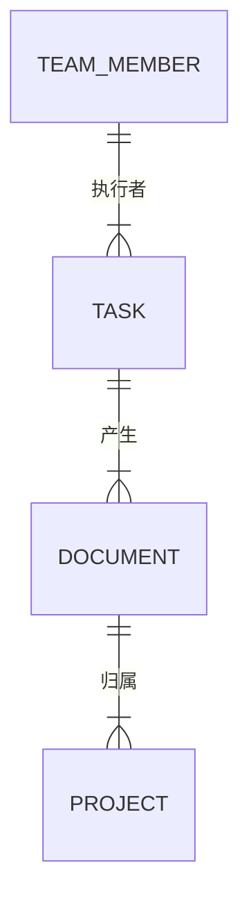

                 

### 第1章：远程工作的背景与挑战

#### 1.1 问题背景

远程工作作为一种工作方式，其起源可以追溯到20世纪末。随着互联网技术的快速发展，企业对工作效率和员工工作环境的需求不断增加，远程工作逐渐成为了一种趋势。首先，远程工作允许员工摆脱地理限制，灵活选择工作地点，这大大提高了员工的工作满意度和生产力。其次，对于企业来说，远程工作可以节省办公场所的租赁成本，提高资源利用效率，并吸引更多的人才。

然而，随着远程工作的普及，也带来了许多新的挑战。首先是沟通问题，由于团队成员分布在不同的地方，面对面的交流变得困难，这可能导致信息传递不畅和误解。其次是时间管理问题，远程工作环境缺乏传统办公环境中的时间约束，容易导致工作效率的降低。最后是工作监督问题，如何确保远程工作的员工能够保持高效和专注，成为企业管理者的一大难题。

#### 1.2 远程工作的发展趋势

近年来，远程工作的发展趋势呈现出以下几个特点：

1. **数字化办公**：随着云计算、大数据和人工智能等技术的成熟，数字化办公成为可能。企业通过在线协作工具、虚拟会议平台和自动化管理系统，实现了高效的远程办公。

2. **远程工作模式的多样化**：传统的全职远程工作模式已经不能满足企业需求，兼职远程工作、远程办公日、弹性工作制等多样化的工作模式不断涌现。

3. **全球团队的协作**：企业不再局限于本地市场，跨国远程工作团队成为常态。这要求团队成员具备跨文化沟通能力和技术协作能力。

#### 1.3 远程工作面临的挑战

尽管远程工作具有诸多优势，但仍然面临一些严峻的挑战：

1. **沟通障碍**：远程工作环境下，沟通的频率和方式受限，容易导致信息不对称和误解。

2. **时间管理问题**：远程工作环境的灵活性使得员工难以有效地管理时间，容易陷入工作与生活平衡的困境。

3. **工作监督与效率**：缺乏面对面的监督和互动，远程工作员工的效率和产出难以保证。

4. **团队协作问题**：远程团队协作的效率往往受到沟通不畅、任务分配不均等因素的影响。

5. **技术基础设施要求**：远程工作需要稳定的高速网络和可靠的IT支持，这增加了企业的运营成本。

### 总结

远程工作作为一种新兴的工作模式，其背景和挑战是多方面的。理解这些背景和挑战，有助于企业和管理者更好地制定远程工作策略，提高远程团队的工作效率和协作效果。在接下来的章节中，我们将深入探讨远程团队管理的核心要素，以及如何利用工具和策略解决远程工作中的问题。

---

### 第2章：团队协作的核心要素

#### 2.1 核心概念

在探讨团队协作的核心要素之前，我们需要明确一些基本概念。远程团队，即团队成员分布在不同的地理位置，通过信息技术进行沟通和协作的团队。团队协作，则是指团队成员共同为实现某个目标或完成某项任务而进行的互动和合作。

#### 2.2 团队协作的关键要素

1. **目标明确**

   目标明确是团队协作的基础。一个明确的团队目标可以统一团队成员的方向和努力，确保团队资源的合理利用。在远程工作中，由于团队成员之间的物理距离较远，更需要通过明确的目标来指导行动，避免迷失方向。

2. **成员协同**

   成员协同是指团队成员之间相互配合、共同工作的过程。远程团队协作的难度在于成员之间的沟通和协调，因此，成员协同是提升团队协作效率的关键。成员之间需要建立信任，分享信息，相互支持，共同克服困难。

3. **信息共享**

   信息共享是远程团队协作的另一个核心要素。远程团队成员通过共享信息和资源，可以更好地了解任务进展、发现潜在问题并及时调整策略。有效的信息共享工具和平台，如协作软件和文档管理系统，对于提高团队协作效率至关重要。

#### 2.3 团队协作的ER模型

在团队协作过程中，实体关系（Entity-Relationship，ER）模型是一种常用的结构化方法。ER模型通过定义实体和关系，为团队协作提供了清晰的框架。

1. **实体**

   实体是团队协作中的基本单元，如团队成员、任务、文档、项目等。每个实体都有其独特的属性，例如，团队成员的属性可能包括姓名、职责、联系方式等。

2. **关系**

   实体之间的关系描述了协作中的互动和依赖关系。例如，团队成员与任务之间的关系可以是“执行者”关系，即每个任务都有相应的执行者。此外，实体之间的关系还可以是多对多的，如团队成员之间可以存在“协作”关系，即一个任务可能由多个团队成员共同完成。

3. **属性**

   属性是实体的特征，用于描述实体的状态和行为。例如，任务的属性可能包括任务名称、截止日期、优先级等。

下面是一个简单的ER模型示例：

在这个ER模型中，`TEAM_MEMBER`（团队成员）与`TASK`（任务）之间存在“执行者”关系，`TASK`与`DOCUMENT`（文档）之间存在“产生”关系，`DOCUMENT`与`PROJECT`（项目）之间存在“归属”关系。

### 总结

团队协作的核心要素包括目标明确、成员协同和信息共享。通过明确的目标指导行动，通过成员协同实现任务完成，通过信息共享保持团队同步。ER模型则为团队协作提供了结构化的框架，有助于理清实体和关系。在远程团队管理中，这些核心要素是确保团队协作高效和有序的基础。在接下来的章节中，我们将进一步探讨远程协作工具的选择与配置，以及如何利用这些工具提高团队协作效率。

---

### 第3章：远程协作工具的选择与配置

#### 3.1 常见远程协作工具介绍

在远程工作中，选择合适的协作工具至关重要。以下是一些常见的远程协作工具：

1. **会议工具**

   - **Zoom**：提供视频会议、在线培训和虚拟会议 room 功能。
   - **Microsoft Teams**：集成了视频会议、聊天、文档协作等功能。
   - **Google Meet**：适用于Google Workspace用户，提供简单易用的视频会议服务。

2. **文档共享工具**

   - **Google Docs**：在线文档编辑和协作工具，支持实时协作。
   - **Microsoft Office 365**：提供Word、Excel、PowerPoint等在线版，支持多人协作编辑。
   - **Notion**：多功能笔记和协作工具，支持创建数据库、看板等。

3. **项目管理工具**

   - **Trello**：基于看板的任务管理工具，直观易用。
   - **Asana**：提供任务分配、进度跟踪和报告生成等功能。
   - **JIRA**：适用于软件开发团队的敏捷项目管理工具。

4. **团队沟通工具**

   - **Slack**：团队沟通和协作平台，支持聊天、通知和集成其他工具。
   - **Discord**：适合游戏和社区团队，提供语音、视频和文本聊天功能。
   - **WhatsApp**：支持多人文本和语音聊天，方便即时沟通。

#### 3.2 工具的配置与集成

选择合适的协作工具后，如何进行配置和集成是确保其有效使用的关键。

1. **工具配置**

   - **账户和权限管理**：为团队成员分配适当的账户和权限，确保每个成员都能访问所需的工具和资源。
   - **环境设置**：根据团队需求配置工具的环境，如视频会议的音频和视频设置、文档共享的访问权限等。
   - **培训和支持**：为新成员提供培训，帮助他们快速掌握工具的使用方法，并确保他们在遇到问题时能够得到及时的帮助。

2. **工具集成**

   - **集成平台**：使用集成平台，如IFTTT（If This Then That），将不同的工具和平台连接起来，实现自动化的任务处理。
   - **API使用**：许多协作工具提供API，允许开发者创建自定义集成，实现更灵活的协作体验。
   - **工作流管理**：利用工作流管理工具，如Workato或zapier，自动化日常任务，提高工作效率。

#### 3.3 工具配置与集成的最佳实践

1. **需求分析**：在配置和集成工具前，进行详细的需求分析，明确团队的具体需求和期望。

2. **选择合适的工具**：根据团队需求，选择最适合的工具，并确保工具之间能够无缝集成。

3. **用户培训**：为团队成员提供必要的培训，确保他们能够有效使用工具。

4. **持续优化**：定期评估工具的使用效果，根据反馈进行调整和优化。

### 总结

远程协作工具的选择与配置是远程团队管理的重要组成部分。通过合理选择和配置工具，可以提高团队协作的效率，减少沟通障碍，确保工作流程的顺畅。在接下来的章节中，我们将探讨如何在虚拟环境中实施有效的沟通策略，以及如何管理和跟踪任务，确保远程团队的高效协作。

---

### 第4章：有效沟通策略

#### 4.1 沟通障碍与解决

在远程工作中，沟通障碍是一个普遍存在的问题。这些障碍可能来自多个方面，包括技术、心理和文化因素。以下是一些常见的沟通障碍及其解决策略：

1. **技术障碍**

   - **网络延迟和中断**：远程沟通依赖于稳定的网络连接。网络延迟和中断可能导致沟通不畅和信息传递不及时。解决方法包括选择可靠的互联网服务提供商，使用高速宽带网络，以及配置备用网络。

   - **设备故障**：音频和视频设备的故障可能导致沟通中断。确保团队成员拥有高质量的音频和视频设备，并定期检查和更新设备。

   - **软件问题**：某些协作工具可能存在兼容性问题或软件故障，影响沟通效果。定期更新软件版本，选择稳定的协作工具，并在出现问题时及时寻求技术支持。

2. **心理障碍**

   - **孤独感**：远程工作可能导致团队成员感到孤独，影响工作效率和团队凝聚力。通过定期的团队活动、虚拟社交活动和团队建设练习，可以缓解孤独感。

   - **信任问题**：远程团队中，团队成员之间的信任可能不如面对面团队容易建立。通过透明的沟通、及时的反馈和共同的目标，可以增强团队成员之间的信任。

   - **沟通疲劳**：远程沟通可能导致团队成员产生疲劳感。合理安排沟通频率和时长，避免过多的在线会议和即时通讯，可以减少沟通疲劳。

3. **文化障碍**

   - **语言差异**：跨文化团队中，语言差异可能成为沟通的障碍。使用简明易懂的语言，明确表达意图，可以减少误解和沟通障碍。

   - **文化习惯差异**：不同的文化背景可能导致沟通风格和期望的差异。尊重不同文化的习惯和价值观，灵活调整沟通方式，可以促进跨文化团队的有效沟通。

#### 4.2 沟通技巧与实践

1. **清晰表达**

   - **明确意图**：在沟通时，确保表达意图清晰，避免模糊和含糊的表述。使用具体的词汇和例证，让对方能够准确理解你的意思。

   - **简洁明了**：避免冗长和复杂的句子，尽量使用简单易懂的语言。简短而明确的沟通可以提高沟通效率，减少误解。

   - **重复关键信息**：在关键信息之后进行重复，确保对方能够理解和记住。例如：“我想要强调的是，我们的目标是……”

2. **有效倾听**

   - **全神贯注**：在对方讲话时，全神贯注地倾听，避免分心。保持眼神交流，点头表示认同，让对方感受到你在认真倾听。

   - **积极反馈**：在对方讲话时，给予积极的反馈，如“我明白了”、“你说的很有道理”等。这可以增强沟通的互动性和双方的信任。

   - **提问和澄清**：在必要时，提出问题进行澄清，确保理解对方的意思。例如：“你说的这个点，我有点不清楚，能否详细解释一下？”

3. **沟通渠道选择**

   - **合适的沟通渠道**：根据沟通的内容和目的，选择合适的沟通渠道。例如，紧急事项可以通过即时通讯工具进行沟通，复杂的讨论可以通过视频会议进行。

   - **多元化沟通**：结合使用多种沟通方式，如即时通讯、电子邮件、视频会议等，以满足不同的沟通需求。

   - **沟通记录**：重要沟通内容应当记录下来，以便后续查阅和参考。例如，会议纪要、邮件备份等。

#### 实践案例

- **案例1**：某远程团队在项目开发过程中，由于沟通不畅导致任务进展缓慢。通过引入项目管理工具和定期团队会议，明确了任务分配和进度，提高了沟通效率。

- **案例2**：一个跨国团队在处理国际项目时，由于语言和文化差异，导致沟通出现误解。通过使用翻译工具和定期文化培训，提高了跨文化沟通能力，项目顺利推进。

### 总结

有效沟通是远程团队成功协作的关键。通过识别和解决沟通障碍，掌握沟通技巧，并选择合适的沟通渠道，可以大大提高远程团队的协作效率和凝聚力。在接下来的章节中，我们将探讨任务管理和跟踪的策略，确保远程团队在虚拟环境中能够高效地完成任务。

---

### 第5章：任务管理与跟踪

#### 5.1 任务分配与跟踪

在远程团队中，任务分配与跟踪是确保项目顺利进行的关键环节。以下是一些策略和方法，可以帮助团队有效地进行任务分配与跟踪：

1. **明确任务目标**

   - **设定清晰的里程碑**：在分配任务时，明确任务的起始点和终点，设定具体的里程碑和截止日期，以确保团队成员了解任务的目标和期望成果。

   - **具体化任务描述**：任务描述应具体、清晰，包括任务的详细说明、所需资源和预期产出。这有助于团队成员理解任务要求，避免误解和重复工作。

2. **合理分配任务**

   - **根据能力分配**：根据团队成员的技能和经验，合理分配任务。确保每个成员都能在其熟悉的领域发挥最大的潜力。

   - **考虑团队成员的工作量**：避免任务过多或过少，确保任务分配均匀，避免个别成员过度劳累。

3. **任务跟踪工具**

   - **使用任务管理工具**：选择合适的任务管理工具，如Trello、Asana、JIRA等，可以帮助团队跟踪任务的进展情况。这些工具通常提供任务列表、优先级设置、截止日期提醒等功能。

   - **实时更新任务状态**：团队成员应定期更新任务的状态，包括进度、遇到的问题和解决方案。这有助于团队及时了解任务进展，协调资源，确保项目按时完成。

#### 5.2 任务优先级与进度管理

1. **设定任务优先级**

   - **关键任务优先**：根据任务的重要性和紧急程度，设定任务优先级。关键任务应优先处理，确保项目目标的实现。

   - **动态调整优先级**：项目进行过程中，根据实际情况和反馈，动态调整任务优先级。例如，遇到突发问题时，应优先解决影响项目进度的问题。

2. **进度管理**

   - **定期检查进度**：定期检查任务进度，确保任务按时完成。可以使用周报、月报等形式，汇总任务进展，发现潜在问题。

   - **预测和风险控制**：根据任务进度，预测项目完成时间，识别和应对潜在风险。提前制定应对策略，确保项目顺利推进。

   - **及时反馈和调整**：鼓励团队成员及时反馈任务进展和遇到的问题，根据反馈调整任务分配和进度计划。

#### 5.3 具体方法与实践

1. **项目看板**

   - **创建项目看板**：使用看板（Kanban）方法，创建可视化项目看板，展示任务状态和进展。团队成员可以在看板上移动任务卡片，实时了解任务状态。

   - **任务状态分类**：将任务分为“待办”、“进行中”、“已完成”等状态，明确任务所处的阶段，便于管理。

2. **里程碑管理**

   - **设定里程碑**：在项目计划中设定关键里程碑，确保每个里程碑都能按时完成。里程碑的达成意味着项目的阶段性成功。

   - **跟踪里程碑进度**：定期检查里程碑进度，确保项目按计划进行。如果发现里程碑无法按时完成，及时调整计划，采取补救措施。

3. **定期回顾**

   - **项目回顾会议**：定期举行项目回顾会议，总结项目经验，识别成功因素和改进空间。这有助于团队不断优化工作流程，提高效率。

   - **反馈机制**：建立反馈机制，鼓励团队成员提出意见和建议。根据反馈，调整任务管理策略，提高团队协作效果。

### 总结

任务管理与跟踪是远程团队高效协作的重要环节。通过明确任务目标、合理分配任务、使用任务跟踪工具和设定任务优先级，团队可以更好地管理任务进度，确保项目按时、高质量完成。在接下来的章节中，我们将探讨远程团队协作中的冲突管理策略，帮助团队解决协作过程中的冲突和问题。

---

### 第6章：团队协作中的冲突管理

#### 6.1 冲突的类型与原因

在远程团队协作过程中，冲突是难以避免的现象。冲突的类型多种多样，原因也复杂多样。以下是远程团队协作中常见的冲突类型及其原因：

1. **任务分配冲突**

   - **原因**：任务分配不均，团队成员工作量过大或过小，职责模糊。
   - **类型**：工作负荷不均导致的抱怨和不满。

2. **沟通冲突**

   - **原因**：信息传递不畅，沟通渠道选择不当，沟通方式不合适。
   - **类型**：误解、信息错误、沟通延迟导致的争议。

3. **目标冲突**

   - **原因**：团队目标不明确，团队成员对目标的理解不一致。
   - **类型**：团队成员各自为政，缺乏协同。

4. **角色冲突**

   - **原因**：团队成员角色不明确，责任和权限不清晰。
   - **类型**：职责重叠、责任推诿。

5. **文化冲突**

   - **原因**：跨文化团队中的文化差异，价值观不同。
   - **类型**：语言障碍、文化习惯差异导致的误解。

6. **个人冲突**

   - **原因**：个人性格、态度和价值观的差异。
   - **类型**：个人情绪、偏见的直接表达。

#### 6.2 冲突解决策略

解决冲突的关键在于识别冲突的类型和原因，并采取适当的策略。以下是一些有效的冲突解决策略：

1. **主动沟通**

   - **策略**：及时、主动地与冲突方进行沟通，了解对方的观点和需求。
   - **实践**：定期举行团队会议，鼓励团队成员开放地表达意见，共同讨论问题。

2. **中立调解**

   - **策略**：引入中立第三方，作为调解者协助解决冲突。
   - **实践**：当冲突双方难以自行解决时，可以寻求上级领导或专业的冲突调解员介入。

3. **妥协与协商**

   - **策略**：双方通过协商，找到双方都能接受的解决方案。
   - **实践**：通过讨论，寻求利益平衡点，达成妥协。

4. **直接面对**

   - **策略**：直接面对冲突，理性分析问题，寻求解决方案。
   - **实践**：安排面对面的讨论，确保双方能够充分表达自己的观点。

5. **建立规则与流程**

   - **策略**：制定明确的团队规则和工作流程，减少冲突发生的可能性。
   - **实践**：制定团队行为准则，明确任务分配和沟通方式，确保团队成员遵循。

#### 案例分析

1. **任务分配冲突的解决**

   - **问题描述**：团队成员A认为自己的任务过多，而团队成员B的任务过少，导致A感到不满。
   - **解决策略**：重新审视任务分配，调整任务量，确保任务分配均衡。同时，制定明确的任务分配标准和流程，避免类似问题再次发生。

2. **沟通冲突的解决**

   - **问题描述**：团队成员C和D在项目讨论中产生了分歧，C认为D的方案不可行，但D坚持自己的观点。
   - **解决策略**：安排双方进行面对面讨论，详细阐述各自的理由和担忧。在充分沟通后，找到了一个双方都能接受的折中方案。

3. **目标冲突的解决**

   - **问题描述**：团队对于项目的目标存在分歧，部分成员认为目标过于理想化，难以实现。
   - **解决策略**：重新讨论并明确项目目标，确保团队成员对目标有共同的理解和认同。通过分解目标，制定可操作性的实施计划。

#### 总结

冲突管理是远程团队协作中不可或缺的一部分。通过识别冲突的类型和原因，采取适当的解决策略，可以有效地减少冲突，提高团队协作的效率和凝聚力。在接下来的章节中，我们将通过案例分析，分享远程团队的实战经验与最佳实践，帮助读者更好地理解远程协作的挑战和机遇。

---

### 第7章：远程团队的实战经验与最佳实践

#### 7.1 案例分析

为了更好地理解远程团队的工作模式和挑战，我们可以通过几个真实的案例来探讨远程团队的成功经验和最佳实践。

**案例1：跨国软件开发团队**

某跨国科技公司组建了一支由全球各地的开发人员组成的团队，负责开发一款跨平台的移动应用。以下是他们的一些成功经验和最佳实践：

- **沟通策略**：团队使用了多种沟通工具，如Slack、Zoom和GitHub，确保团队成员能够方便地交流和协作。每周举行一次团队会议，回顾上周的工作进展，讨论遇到的问题，并设定下周的工作目标。

- **任务管理**：使用JIRA进行任务管理，每个任务都有明确的描述、优先级和截止日期。团队成员可以在JIRA上更新任务状态，确保任务按时完成。

- **文化融合**：团队注重跨文化交流，定期组织团队建设活动，如线上游戏、虚拟旅游等，增强团队成员之间的联系和了解。

**案例2：远程市场营销团队**

一家市场营销公司由于业务扩张，组建了一支远程市场营销团队，负责多个项目的推广和营销活动。他们的成功经验和最佳实践包括：

- **信息共享**：使用Google Drive和Notion来存储和共享项目文档、策略和素材，确保团队成员能够随时访问最新的信息。

- **工作流优化**：通过Workato将不同的工具和平台连接起来，实现自动化任务处理，减少重复性工作，提高工作效率。

- **灵活的工作时间**：团队成员可以根据自己的时区和工作习惯，灵活安排工作时间，确保工作效率不受影响。

**案例3：远程产品设计团队**

某远程产品设计团队负责设计一款智能硬件的产品界面。他们的成功经验和最佳实践包括：

- **原型迭代**：使用Figma进行原型设计，团队成员可以实时协作，对设计进行讨论和修改。每次迭代后，都会进行用户测试，收集反馈，不断优化设计。

- **用户反馈机制**：建立了用户反馈系统，团队成员可以随时收集用户的使用反馈，快速响应并调整设计。

- **技能培训**：定期为团队成员提供技能培训，确保团队成员能够跟上技术发展的步伐，提升设计能力。

#### 7.2 最佳实践分享

通过以上案例，我们可以总结出一些远程团队的实战经验和最佳实践：

1. **多样化的沟通工具**：选择合适的沟通工具，确保团队成员能够方便地进行交流和协作。结合使用多种工具，如即时通讯、视频会议和项目管理工具，可以满足不同沟通需求。

2. **明确的任务管理**：使用任务管理工具进行任务分配和跟踪，确保任务按时完成。明确的任务描述和截止日期有助于团队成员理解任务要求，提高工作效率。

3. **文化融合与团队建设**：通过定期的团队活动和文化融合活动，增强团队成员之间的联系和了解，提升团队的凝聚力。

4. **信息共享与透明沟通**：建立信息共享机制，确保团队成员能够随时访问最新的信息，提高协作效率。

5. **用户反馈与迭代优化**：建立用户反馈机制，不断优化产品和服务，确保满足用户需求。

#### 7.3 小结与启示

通过分析这些案例和最佳实践，我们可以得出以下启示：

1. **灵活性与适应性**：远程团队需要具备灵活性和适应性，能够快速响应变化和解决冲突。

2. **技术工具的支持**：选择合适的远程协作工具，利用技术提升团队协作效率。

3. **团队凝聚力**：通过有效的团队建设和文化融合活动，增强团队的凝聚力。

4. **用户导向**：以用户需求为导向，不断优化产品和服务，确保满足用户期望。

总结起来，远程团队的成功不仅依赖于技术工具的支持，更需要团队成员之间的密切合作和有效沟通。通过借鉴最佳实践，远程团队可以克服挑战，实现高效协作，推动项目的成功。

---

### 第8章：未来远程协作的趋势与展望

#### 8.1 远程协作的未来趋势

随着技术的不断进步，远程协作正朝着更加智能、高效和人性化的方向发展。以下是几个未来远程协作的趋势：

1. **人工智能与自动化**：人工智能（AI）和自动化技术将在远程协作中扮演越来越重要的角色。AI可以用于任务分配、日程安排、文档审核等，提高工作效率，减少重复性劳动。

2. **混合办公模式**：混合办公模式将成为未来远程协作的主流。在这种模式下，远程工作和传统办公相结合，员工可以根据工作性质和需求，灵活选择工作地点和时间。

3. **更全面的协作平台**：未来的远程协作平台将更加全面，集成了沟通、协作、任务管理、文档共享等多种功能，为用户提供一站式解决方案。

4. **虚拟现实（VR）与增强现实（AR）**：VR和AR技术将使远程协作更加沉浸式和互动性。通过虚拟会议室和虚拟办公室，团队成员可以感受到身临其境的协作体验。

#### 8.2 对远程工作的思考

远程工作不仅在技术和经济层面带来了变革，还在组织文化和人力资源管理方面提出了新的挑战和机遇。以下是关于远程工作的一些思考：

1. **组织文化的重塑**：远程工作需要组织文化适应新的工作模式。建立基于信任、透明和自主性的文化，可以帮助团队克服远程工作带来的沟通障碍和信任问题。

2. **技能和能力的提升**：远程工作要求员工具备更高的自我管理能力、技术技能和跨文化沟通能力。组织需要提供相应的培训和支持，帮助员工提升这些关键能力。

3. **绩效评估的变革**：传统的绩效评估方法在远程工作中可能不再适用。组织需要探索新的绩效评估方法，如基于结果和过程的评估，确保评估的公正性和客观性。

4. **领导力的转型**：远程工作对领导力提出了新的要求。领导者需要更加注重团队建设、沟通和激励，以保持团队的凝聚力和工作效率。

#### 总结

远程协作的未来充满了机遇和挑战。通过拥抱新技术、重塑组织文化和提升员工能力，远程团队可以更好地适应未来工作环境，实现高效协作。同时，领导者需要不断学习和适应新的领导模式，为团队的成功奠定基础。展望未来，远程工作将不仅仅是工作的地点变化，更是工作方式、组织结构和人力资源管理的一次全面升级。

---

### 总结与展望

在《打造高效远程团队：虚拟环境下的协作策略》一书中，我们系统地探讨了远程团队管理的关键要素、协作工具的选择与配置、有效沟通策略、任务管理与跟踪、冲突管理以及实战经验和最佳实践。通过这些内容，我们旨在帮助读者理解和掌握远程团队高效协作的核心理念和方法。

随着远程工作的普及，企业和管理者需要不断适应新的工作模式，提升团队协作效率。本书提供了全面的指导和建议，旨在帮助读者构建一个高效、协作、有凝聚力的远程团队。

在未来的发展中，远程协作将继续朝着智能化、个性化和全球化方向演进。为此，我们提出以下展望和建议：

1. **拥抱新技术**：积极引入人工智能、自动化、VR/AR等前沿技术，提升远程协作的效率和质量。

2. **培养团队文化**：建立基于信任、透明和自主性的团队文化，增强团队凝聚力。

3. **持续学习与培训**：为团队成员提供持续的学习和培训机会，提升技能和跨文化沟通能力。

4. **灵活的工作模式**：探索和实践混合办公模式，满足不同员工的需求。

5. **持续改进与反馈**：定期回顾团队协作流程，根据反馈进行优化和改进。

最后，感谢您的阅读。希望本书能为您的远程团队管理提供有益的参考，帮助您在虚拟环境下打造一个高效协作的团队。我们期待与您共同探索远程协作的未来，迎接新的挑战和机遇。

### 作者信息

- **作者：AI天才研究院/AI Genius Institute & 禅与计算机程序设计艺术 /Zen And The Art of Computer Programming**

AI天才研究院致力于推动人工智能领域的研究与应用，通过创新技术和解决方案，助力企业和个人在数字化时代取得成功。同时，我们倡导“禅与计算机程序设计艺术”的理念，将东方哲学与计算机科学相结合，探索智能编程的深层奥秘。在本书中，我们结合多年的实践经验和理论研究，为您提供了一套完整的远程团队管理策略，旨在帮助您在虚拟环境下实现高效协作。希望本书能为您的远程工作带来新的启示和帮助。

