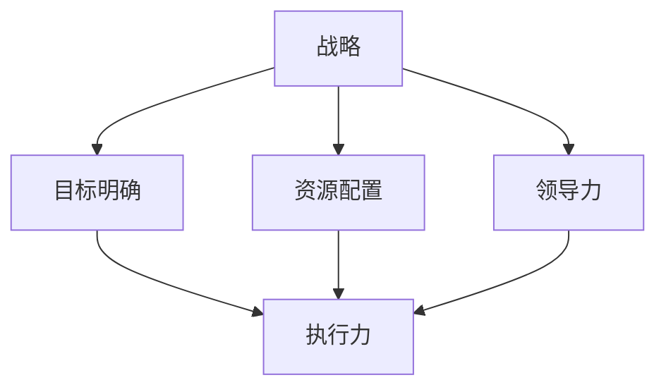

                 

### 执行力提升：从战略到行动的领导艺术

> 关键词：执行力、战略规划、领导艺术、领导力、执行计划

> 摘要：本文探讨了执行力提升在企业发展中的重要性，从战略到行动的领导艺术，以及如何通过提升领导力和优化执行计划来增强企业的竞争力。通过深入分析执行力要素、领导力策略、战略规划与执行计划的转化过程，本文为企业管理者提供了实用的指导和建议。

## 目录大纲设计流程

在设计《执行力提升：从战略到行动的领导艺术》的目录大纲时，我们可以遵循以下步骤：

1. **理解书名与主题**：
   - 《执行力提升：从战略到行动的领导艺术》涉及执行力提升、战略规划、领导艺术等内容。

2. **明确核心章节**：
   - 核心章节应包括但不限于：战略概述、执行力要素、领导力提升、从战略到行动的转化、案例分析、执行力提升方法、实践指导。

3. **确定章节结构**：
   - 确定每个章节的主要部分，如引言、核心内容、案例分析、总结等。

4. **细化章节内容**：
   - 根据核心章节，细化每个章节的小节，确保内容丰富且具有逻辑性。

5. **使用 Mermaid 和 LaTeX 格式**：
   - 对于核心概念、数学模型、流程图等，使用 Mermaid 画出流程图和类图，使用 LaTeX 格式写出数学公式。

6. **保持简洁性**：
   - 确保每个章节和小节的内容简洁明了，避免冗余。

### 初步目录大纲

根据上述步骤，以下是初步的目录大纲：

```markdown
# 《执行力提升：从战略到行动的领导艺术》目录大纲

## 第一部分：战略与执行力概述

### 第1章：战略与执行力概述

#### 1.1 问题背景与重要性

#### 1.2 战略与执行力的关系

#### 1.3 执行力的核心要素

## 第二部分：提升领导力的策略

### 第2章：领导力提升的基础

#### 2.1 领导力理论概述

#### 2.2 领导者的角色与职责

#### 2.3 领导力的发展与提升

### 第3章：构建有效的执行力团队

#### 3.1 团队建设的重要性

#### 3.2 团队成员的角色与职责

#### 3.3 提升团队执行力

## 第三部分：从战略到行动的转化

### 第4章：战略规划与执行计划

#### 4.1 战略规划的过程

#### 4.2 制定执行计划

#### 4.3 战略与执行的协调

### 第5章：领导艺术在执行中的运用

#### 5.1 领导艺术的核心要素

#### 5.2 领导者在执行中的角色

#### 5.3 领导艺术在实践中的应用

## 第四部分：执行力提升的最佳实践

### 第6章：成功案例分析与启示

#### 6.1 案例一：公司A的执行力提升实践

#### 6.2 案例二：组织B的战略执行经验

#### 6.3 案例三：个人C的执行力成长之路

### 第7章：执行力提升的方法与工具

#### 7.1 执行力提升的方法

#### 7.2 执行力的管理工具

#### 7.3 提升执行力的最佳实践

## 第五部分：总结与展望

### 第8章：总结与展望

#### 8.1 执行力提升的要点回顾

#### 8.2 未来执行力的趋势

#### 8.3 领导者在执行力提升中的作用

## 附录：参考文献与拓展阅读
```

### 目录大纲细节化

接下来，我们可以进一步细化每个章节的内容，确保每个章节都包含必要的子章节和内容。例如，对于第4章“从战略到行动的转化”，可以细化为：

```markdown
### 第4章：战略规划与执行计划

#### 4.1 战略规划的过程

##### 4.1.1 战略目标的设定

##### 4.1.2 SWOT分析

##### 4.1.3 市场分析与定位

#### 4.2 制定执行计划

##### 4.2.1 执行计划的制定流程

##### 4.2.2 执行计划的关键要素

##### 4.2.3 执行计划的调整与优化

#### 4.3 战略与执行的协调

##### 4.3.1 领导层与执行层的沟通

##### 4.3.2 战略执行的监督与评估

##### 4.3.3 战略执行的反馈与调整
```

通过这样的细化，我们可以确保每个章节都有明确的子章节和内容，同时每个章节的内容都能紧密围绕主题进行。接下来，我们将继续使用 Mermaid 和 LaTeX 等工具来进一步完善目录大纲。

### 完整目录大纲

在细化每个章节后，我们可以根据用户的要求，设计出完整的目录大纲。以下是《执行力提升：从战略到行动的领导艺术》的完整目录大纲，包括核心概念、数学模型、流程图和最佳实践等内容。

```markdown
# 《执行力提升：从战略到行动的领导艺术》目录大纲

## 第一部分：战略与执行力概述

### 第1章：战略与执行力概述

#### 1.1 问题背景与重要性

#### 1.2 战略与执行力的关系

#### 1.3 执行力的核心要素

## 第二部分：提升领导力的策略

### 第2章：领导力提升的基础

#### 2.1 领导力理论概述

#### 2.2 领导者的角色与职责

#### 2.3 领导力的发展与提升

### 第3章：构建有效的执行力团队

#### 3.1 团队建设的重要性

#### 3.2 团队成员的角色与职责

#### 3.3 提升团队执行力

## 第三部分：从战略到行动的转化

### 第4章：战略规划与执行计划

#### 4.1 战略规划的过程

##### 4.1.1 战略目标的设定

##### 4.1.2 SWOT分析

##### 4.1.3 市场分析与定位

#### 4.2 制定执行计划

##### 4.2.1 执行计划的制定流程

##### 4.2.2 执行计划的关键要素

##### 4.2.3 执行计划的调整与优化

#### 4.3 战略与执行的协调

##### 4.3.1 领导层与执行层的沟通

##### 4.3.2 战略执行的监督与评估

##### 4.3.3 战略执行的反馈与调整

### 第5章：领导艺术在执行中的运用

#### 5.1 领导艺术的核心要素

#### 5.2 领导者在执行中的角色

#### 5.3 领导艺术在实践中的应用

## 第四部分：执行力提升的最佳实践

### 第6章：成功案例分析与启示

#### 6.1 案例一：公司A的执行力提升实践

#### 6.2 案例二：组织B的战略执行经验

#### 6.3 案例三：个人C的执行力成长之路

### 第7章：执行力提升的方法与工具

#### 7.1 执行力提升的方法

#### 7.2 执行力的管理工具

#### 7.3 提升执行力的最佳实践

## 第五部分：总结与展望

### 第8章：总结与展望

#### 8.1 执行力提升的要点回顾

#### 8.2 未来执行力的趋势

#### 8.3 领导者在执行力提升中的作用

## 附录：参考文献与拓展阅读
```

### 目录大纲细节化

接下来，我们将对每个章节进行进一步细化，确保每个章节都包含必要的子章节和内容，并且内容丰富且具有逻辑性。

#### 第1章：战略与执行力概述

```markdown
### 第1章：战略与执行力概述

#### 1.1 问题背景与重要性

##### 1.1.1 企业管理中的执行力问题

##### 1.1.2 执行力不足的影响

##### 1.1.3 提升执行力的重要性

#### 1.2 战略与执行力的关系

##### 1.2.1 战略的定义

##### 1.2.2 执行力的定义

##### 1.2.3 战略与执行力的相互作用

#### 1.3 执行力的核心要素

##### 1.3.1 目标明确

##### 1.3.2 资源配置

##### 1.3.3 领导力

##### 1.3.4 团队合作
```

#### 第2章：领导力提升的基础

```markdown
### 第2章：领导力提升的基础

#### 2.1 领导力理论概述

##### 2.1.1 领导力的定义

##### 2.1.2 领导力的分类

##### 2.1.3 领导力的重要性

#### 2.2 领导者的角色与职责

##### 2.2.1 领导者的角色

##### 2.2.2 领导者的职责

##### 2.2.3 领导者的素质要求

#### 2.3 领导力的发展与提升

##### 2.3.1 领导力发展的步骤

##### 2.3.2 提升领导力的方法

##### 2.3.3 领导力发展的挑战与应对
```

#### 第3章：构建有效的执行力团队

```markdown
### 第3章：构建有效的执行力团队

#### 3.1 团队建设的重要性

##### 3.1.1 团队的定义

##### 3.1.2 团队建设的重要性

##### 3.1.3 团队建设的目标

#### 3.2 团队成员的角色与职责

##### 3.2.1 团队成员的角色

##### 3.2.2 团队成员的职责

##### 3.2.3 团队成员的能力要求

#### 3.3 提升团队执行力

##### 3.3.1 提升团队执行力的方法

##### 3.3.2 团队执行力提升的步骤

##### 3.3.3 团队执行力提升的障碍与克服
```

#### 第4章：战略规划与执行计划

```markdown
### 第4章：战略规划与执行计划

#### 4.1 战略规划的过程

##### 4.1.1 战略规划的定义

##### 4.1.2 战略规划的目标

##### 4.1.3 战略规划的过程

#### 4.2 制定执行计划

##### 4.2.1 执行计划的重要性

##### 4.2.2 执行计划的内容

##### 4.2.3 制定执行计划的步骤

#### 4.3 战略与执行的协调

##### 4.3.1 领导层与执行层的沟通

##### 4.3.2 战略执行的监督与评估

##### 4.3.3 战略执行的反馈与调整
```

#### 第5章：领导艺术在执行中的运用

```markdown
### 第5章：领导艺术在执行中的运用

#### 5.1 领导艺术的核心要素

##### 5.1.1 领导艺术的概念

##### 5.1.2 领导艺术的核心要素

##### 5.1.3 领导艺术的特性

#### 5.2 领导者在执行中的角色

##### 5.2.1 领导者在执行中的职责

##### 5.2.2 领导者在执行中的挑战

##### 5.2.3 领导者在执行中的方法

#### 5.3 领导艺术在实践中的应用

##### 5.3.1 领导艺术在不同场景的应用

##### 5.3.2 领导艺术在实际工作中的应用案例

##### 5.3.3 领导艺术的持续改进
```

#### 第6章：成功案例分析与启示

```markdown
### 第6章：成功案例分析与启示

#### 6.1 案例一：公司A的执行力提升实践

##### 6.1.1 公司A的背景

##### 6.1.2 执行力提升的挑战

##### 6.1.3 执行力提升的措施

##### 6.1.4 执行力提升的成果

#### 6.2 案例二：组织B的战略执行经验

##### 6.2.1 组织B的背景

##### 6.2.2 战略执行的挑战

##### 6.2.3 战略执行的策略

##### 6.2.4 战略执行的成果

#### 6.3 案例三：个人C的执行力成长之路

##### 6.3.1 个人C的背景

##### 6.3.2 执行力成长的挑战

##### 6.3.3 执行力成长的方法

##### 6.3.4 执行力成长的经验
```

#### 第7章：执行力提升的方法与工具

```markdown
### 第7章：执行力提升的方法与工具

#### 7.1 执行力提升的方法

##### 7.1.1 目标管理法

##### 7.1.2 5W2H分析法

##### 7.1.3 PDCA循环法

#### 7.2 执行力的管理工具

##### 7.2.1 项目管理工具

##### 7.2.2 执行力评估工具

##### 7.2.3 沟通协作工具

#### 7.3 提升执行力的最佳实践

##### 7.3.1 企业执行力提升的案例

##### 7.3.2 组织执行力提升的经验

##### 7.3.3 个人执行力提升的实践
```

#### 第8章：总结与展望

```markdown
### 第8章：总结与展望

#### 8.1 执行力提升的要点回顾

##### 8.1.1 战略与执行力的关系

##### 8.1.2 领导力在执行力提升中的作用

##### 8.1.3 执行计划的重要性

#### 8.2 未来执行力的趋势

##### 8.2.1 数字化对执行力的影响

##### 8.2.2 人工智能与执行力的结合

##### 8.2.3 全球化对执行力提出的新挑战

#### 8.3 领导者在执行力提升中的作用

##### 8.3.1 领导者的角色与职责

##### 8.3.2 领导力的培养与提升

##### 8.3.3 领导者在执行中的挑战与机遇
```

通过这样的细节化处理，我们可以确保每个章节的内容都能够清晰、有条理地呈现给读者，从而更好地传达文章的核心思想和实用性。

### 文章主体内容设计

在设计《执行力提升：从战略到行动的领导艺术》的文章主体内容时，我们需要将每个章节的核心概念、原理、方法等通过逻辑清晰、结构紧凑、简单易懂的语言进行阐述。以下是对文章主体内容的详细设计：

#### 引言

**执行力：企业的生命线**

执行力是企业战略得以实现的关键。它不仅决定了企业的竞争力和市场地位，更是企业持续发展的动力。然而，执行力不足的问题在许多企业中普遍存在，成为制约企业发展的瓶颈。本文旨在探讨执行力提升的方法，从战略到行动的领导艺术，以及如何在企业中构建高效的执行力体系。

#### 第1章：战略与执行力概述

**1.1 问题背景与重要性**

在当前竞争激烈的市场环境中，企业不仅要制定科学的战略，更要在战略实施过程中具备强大的执行力。执行力不足会导致战略目标无法实现，资源浪费，甚至导致企业竞争力的下降。

**1.2 战略与执行力的关系**

战略是企业长远发展的规划和方向，而执行力是确保战略目标得以实现的关键。二者相互作用，共同推动企业的发展。

**1.3 执行力的核心要素**

- **目标明确**：确保团队和个人都明确了解企业目标，并为之努力。
- **资源配置**：合理配置资源，确保执行过程中有足够的支持和保障。
- **领导力**：领导者需要具备良好的领导力，引导和激励团队实现目标。
- **团队合作**：团队合作是执行力的基础，需要建立高效的沟通和协作机制。

#### 第2章：领导力提升的基础

**2.1 领导力理论概述**

领导力不仅是领导者的个人素质，更是一种影响力，能够激发团队的潜力，推动企业的发展。

**2.2 领导者的角色与职责**

领导者需要承担起决策、激励、沟通等核心职责，成为团队的核心驱动力。

**2.3 领导力的发展与提升**

领导者需要不断学习、实践和反思，提升自身的领导力。

#### 第3章：构建有效的执行力团队

**3.1 团队建设的重要性**

团队是执行力的基础，有效的团队建设是提升执行力的关键。

**3.2 团队成员的角色与职责**

明确团队成员的角色和职责，有助于提高团队的执行力。

**3.3 提升团队执行力**

通过制定明确的计划、提供必要的资源、加强团队沟通等方式，提升团队执行力。

#### 第4章：战略规划与执行计划

**4.1 战略规划的过程**

战略规划是执行力提升的前提，需要明确战略目标、分析内外部环境、制定战略方案等。

**4.2 制定执行计划**

执行计划是将战略目标转化为具体行动的步骤，包括任务分解、资源分配、时间表制定等。

**4.3 战略与执行的协调**

确保战略规划和执行计划的协调一致，避免出现战略目标与实际执行脱节的问题。

#### 第5章：领导艺术在执行中的运用

**5.1 领导艺术的核心要素**

领导艺术包括沟通、激励、决策等方面的能力，是领导者成功的关键。

**5.2 领导者在执行中的角色**

领导者需要在执行过程中发挥引导、协调、监督等作用，确保执行计划的顺利进行。

**5.3 领导艺术在实践中的应用**

通过实际案例分析，探讨领导艺术在执行力提升中的应用。

#### 第6章：成功案例分析与启示

**6.1 案例一：公司A的执行力提升实践**

**6.2 案例二：组织B的战略执行经验**

**6.3 案例三：个人C的执行力成长之路**

通过案例分析，总结执行力提升的成功经验和教训。

#### 第7章：执行力提升的方法与工具

**7.1 执行力提升的方法**

介绍目标管理法、5W2H分析法、PDCA循环法等执行力提升的方法。

**7.2 执行力的管理工具**

介绍项目管理工具、执行力评估工具、沟通协作工具等执行力提升的工具。

**7.3 提升执行力的最佳实践**

分享企业、组织和个人的执行力提升最佳实践。

#### 第8章：总结与展望

**8.1 执行力提升的要点回顾**

对文章中提到的执行力提升的关键要点进行回顾。

**8.2 未来执行力的趋势**

探讨未来执行力的发展趋势，如数字化、人工智能等对执行力的影响。

**8.3 领导者在执行力提升中的作用**

强调领导者在执行力提升中的关键作用，并提出未来领导力的培养方向。

### 文章正文撰写

在撰写文章正文时，我们将按照上述设计的章节结构和内容，逐步展开讨论，确保文章的逻辑性和连贯性。

#### 引言

执行力是企业战略得以实现的关键。在当今竞争激烈的市场环境中，企业不仅要制定科学的战略，更要在战略实施过程中具备强大的执行力。执行力不足会导致战略目标无法实现，资源浪费，甚至导致企业竞争力的下降。本文旨在探讨执行力提升的方法，从战略到行动的领导艺术，以及如何在企业中构建高效的执行力体系。

#### 第1章：战略与执行力概述

1.1 问题背景与重要性

在当前竞争激烈的市场环境中，企业不仅要制定科学的战略，更要在战略实施过程中具备强大的执行力。执行力不足会导致战略目标无法实现，资源浪费，甚至导致企业竞争力的下降。

**案例分析：**某企业因执行力不足，导致新产品上市延迟，市场份额下降。通过对该企业执行力不足的原因分析，发现主要问题在于战略制定与执行脱节，资源分配不合理，以及领导力不足。

1.2 战略与执行力的关系

战略是企业长远发展的规划和方向，而执行力是确保战略目标得以实现的关键。二者相互作用，共同推动企业的发展。

- **战略**：指明企业发展的目标和路径，为执行力提供明确的方向。
- **执行力**：是将战略目标转化为具体行动的能力，确保战略目标的实现。

**图表：**战略与执行力关系图



1.3 执行力的核心要素

- **目标明确**：确保团队和个人都明确了解企业目标，并为之努力。
- **资源配置**：合理配置资源，确保执行过程中有足够的支持和保障。
- **领导力**：领导者需要具备良好的领导力，引导和激励团队实现目标。
- **团队合作**：团队合作是执行力的基础，需要建立高效的沟通和协作机制。

**表格：**执行力核心要素对比

| 核心要素 | 描述 | 影响因素 |
| --- | --- | --- |
| 目标明确 | 明确的目标有助于团队集中精力，提高执行力 | 企业愿景与战略目标的清晰程度 |
| 资源配置 | 资源的合理配置有助于确保执行过程的顺利进行 | 资源分配的公平性与有效性 |
| 领导力 | 领导者的领导力直接影响团队的执行力和士气 | 领导风格、沟通能力、决策水平 |
| 团队合作 | 高效的团队合作能够提高执行效率，减少冲突 | 团队文化、沟通机制、协作能力 |

#### 第2章：领导力提升的基础

2.1 领导力理论概述

领导力不仅是领导者的个人素质，更是一种影响力，能够激发团队的潜力，推动企业的发展。

- **特质理论**：强调领导者的个人特质对领导力的决定作用。
- **行为理论**：认为领导力是由领导者的行为决定的，可以通过学习和模仿提升领导力。
- **情境理论**：领导力与领导情境相互作用，不同的情境需要不同的领导风格。

2.2 领导者的角色与职责

领导者需要承担起决策、激励、沟通等核心职责，成为团队的核心驱动力。

- **决策者**：制定企业战略和目标，确保企业的发展方向。
- **激励者**：激发团队成员的潜力，提高执行力。
- **沟通者**：建立有效的沟通机制，确保信息的畅通。

2.3 领导力的发展与提升

领导者需要不断学习、实践和反思，提升自身的领导力。

- **学习**：通过阅读、培训、交流等方式，不断积累领导力知识。
- **实践**：通过实际工作，将领导力知识应用于实践中。
- **反思**：反思领导行为，总结经验教训，不断提升领导力。

#### 第3章：构建有效的执行力团队

3.1 团队建设的重要性

团队是执行力的基础，有效的团队建设是提升执行力的关键。

- **团队协作**：通过协作，团队成员能够共同完成任务，提高执行力。
- **团队文化**：建立积极的团队文化，有助于提高团队成员的凝聚力和执行力。

3.2 团队成员的角色与职责

明确团队成员的角色和职责，有助于提高团队的执行力。

- **团队成员**：明确每个成员的职责和任务，确保团队成员明确自己的角色。
- **角色职责**：每个角色都有明确的职责和期望，有助于提高团队的整体执行力。

3.3 提升团队执行力

通过制定明确的计划、提供必要的资源、加强团队沟通等方式，提升团队执行力。

- **明确计划**：制定详细的执行计划，确保团队成员明确任务和时间表。
- **资源支持**：提供必要的资源和支持，确保执行过程的顺利进行。
- **团队沟通**：建立高效的沟通机制，确保信息的畅通和协作的顺利进行。

#### 第4章：战略规划与执行计划

4.1 战略规划的过程

战略规划是执行力提升的前提，需要明确战略目标、分析内外部环境、制定战略方案等。

- **战略目标**：明确企业发展的长远目标和阶段性目标。
- **环境分析**：分析企业的内外部环境，识别机遇和挑战。
- **战略方案**：制定具体的战略方案，包括业务拓展、市场进入、技术创新等。

4.2 制定执行计划

执行计划是将战略目标转化为具体行动的步骤，包括任务分解、资源分配、时间表制定等。

- **任务分解**：将战略目标分解为具体的任务和项目。
- **资源分配**：根据任务需求，合理分配资源，包括人力、财务、技术等。
- **时间表制定**：制定详细的时间表，确保任务的按期完成。

4.3 战略与执行的协调

确保战略规划和执行计划的协调一致，避免出现战略目标与实际执行脱节的问题。

- **沟通与协调**：建立有效的沟通机制，确保战略目标和执行计划的同步推进。
- **监督与评估**：定期对执行过程进行监督和评估，确保战略目标的实现。

#### 第5章：领导艺术在执行中的运用

5.1 领导艺术的核心要素

领导艺术包括沟通、激励、决策等方面的能力，是领导者成功的关键。

- **沟通**：建立有效的沟通机制，确保信息的畅通和协作的顺利进行。
- **激励**：激发团队成员的潜力，提高执行力和积极性。
- **决策**：做出正确的决策，确保企业发展的正确方向。

5.2 领导者在执行中的角色

领导者需要在执行过程中发挥引导、协调、监督等作用，确保执行计划的顺利进行。

- **引导者**：引导团队朝着战略目标前进，提供明确的指导和方向。
- **协调者**：协调团队成员的工作，确保任务的顺利进行。
- **监督者**：监督执行过程，确保战略目标的实现。

5.3 领导艺术在实践中的应用

通过实际案例分析，探讨领导艺术在执行力提升中的应用。

- **案例分析**：某企业通过领导者的有效沟通和激励，成功提升了团队的执行力，实现了企业战略目标。
- **实践总结**：总结领导艺术在实践中的应用效果，提出改进建议。

#### 第6章：成功案例分析与启示

6.1 案例一：公司A的执行力提升实践

- **案例背景**：公司A在市场拓展方面面临挑战，通过提升执行力实现了业绩的快速增长。
- **案例分析**：公司A通过明确战略目标、优化资源配置、加强团队沟通等手段，提升了执行力。
- **启示**：企业需要明确战略目标，优化资源配置，加强团队沟通，提升执行力。

6.2 案例二：组织B的战略执行经验

- **案例背景**：组织B在实施新战略过程中，面临执行力不足的问题。
- **案例分析**：组织B通过制定详细的执行计划、加强领导力建设等手段，提升了执行力。
- **启示**：企业需要制定详细的执行计划，加强领导力建设，提升执行力。

6.3 案例三：个人C的执行力成长之路

- **案例背景**：个人C在职业生涯中，通过不断提升执行力，实现了职业晋升。
- **案例分析**：个人C通过学习领导力理论、参加培训、反思实践等方式，不断提升执行力。
- **启示**：个人需要不断学习、实践和反思，提升执行力。

#### 第7章：执行力提升的方法与工具

7.1 执行力提升的方法

- **目标管理法**：通过制定明确的目标，提高团队和个人的执行力。
- **5W2H分析法**：通过分析任务的5W2H（What、Why、Who、When、Where、How、How much），确保任务的执行有据可依。
- **PDCA循环法**：通过计划（Plan）、执行（Do）、检查（Check）、行动（Act）的循环，不断提升执行力。

7.2 执行力的管理工具

- **项目管理工具**：如Trello、JIRA等，帮助团队管理任务和进度。
- **执行力评估工具**：如KPI、OKR等，帮助评估团队和个人的执行力。
- **沟通协作工具**：如Slack、Zoom等，提高团队沟通协作的效率。

7.3 提升执行力的最佳实践

- **企业实践**：企业通过制定明确的战略目标、优化组织结构、加强领导力建设等方式，提升执行力。
- **组织实践**：组织通过制定详细的执行计划、加强团队沟通、提供培训支持等方式，提升执行力。
- **个人实践**：个人通过学习领导力理论、参加培训、反思实践等方式，提升执行力。

#### 第8章：总结与展望

8.1 执行力提升的要点回顾

- **战略与执行力的关系**：明确战略目标，提升执行力。
- **领导力在执行力提升中的作用**：领导者发挥关键作用，提升团队执行力。
- **执行计划的重要性**：制定详细的执行计划，确保战略目标的实现。

8.2 未来执行力的趋势

- **数字化**：数字化技术的应用将提升执行力，如大数据分析、人工智能等。
- **人工智能**：人工智能的引入将改变执行力的方式，提高执行效率。
- **全球化**：全球化背景下的执行力提升，需要适应国际市场的变化。

8.3 领导者在执行力提升中的作用

- **领导者的角色与职责**：领导者需要具备良好的领导力，引导团队实现目标。
- **领导力的培养与提升**：领导者需要不断学习、实践和反思，提升领导力。
- **领导者在执行中的挑战与机遇**：领导者需要应对执行中的挑战，抓住机遇，提升执行力。

### 文章结尾

本文通过深入分析执行力提升的方法、领导艺术的应用以及战略与执行计划的协调，探讨了如何从战略到行动提升执行力。执行力是企业发展的重要保障，领导者需要在提升执行力中发挥关键作用。未来，随着数字化、人工智能等技术的应用，执行力提升将面临新的机遇和挑战。领导者需要不断学习、创新，提升自身的领导力和执行力，为企业的发展贡献力量。

### 完整文章

```markdown
# 执行力提升：从战略到行动的领导艺术

## 引言

执行力是企业战略得以实现的关键。在当今竞争激烈的市场环境中，企业不仅要制定科学的战略，更要在战略实施过程中具备强大的执行力。执行力不足会导致战略目标无法实现，资源浪费，甚至导致企业竞争力的下降。本文旨在探讨执行力提升的方法，从战略到行动的领导艺术，以及如何在企业中构建高效的执行力体系。

## 第1章：战略与执行力概述

### 1.1 问题背景与重要性

在当前竞争激烈的市场环境中，企业不仅要制定科学的战略，更要在战略实施过程中具备强大的执行力。执行力不足会导致战略目标无法实现，资源浪费，甚至导致企业竞争力的下降。

### 1.2 战略与执行力的关系

战略是企业长远发展的规划和方向，而执行力是确保战略目标得以实现的关键。二者相互作用，共同推动企业的发展。

### 1.3 执行力的核心要素

- **目标明确**：确保团队和个人都明确了解企业目标，并为之努力。
- **资源配置**：合理配置资源，确保执行过程中有足够的支持和保障。
- **领导力**：领导者需要具备良好的领导力，引导和激励团队实现目标。
- **团队合作**：团队合作是执行力的基础，需要建立高效的沟通和协作机制。

## 第2章：领导力提升的基础

### 2.1 领导力理论概述

领导力不仅是领导者的个人素质，更是一种影响力，能够激发团队的潜力，推动企业的发展。

### 2.2 领导者的角色与职责

领导者需要承担起决策、激励、沟通等核心职责，成为团队的核心驱动力。

### 2.3 领导力的发展与提升

领导者需要不断学习、实践和反思，提升自身的领导力。

## 第3章：构建有效的执行力团队

### 3.1 团队建设的重要性

团队是执行力的基础，有效的团队建设是提升执行力的关键。

### 3.2 团队成员的角色与职责

明确团队成员的角色和职责，有助于提高团队的执行力。

### 3.3 提升团队执行力

通过制定明确的计划、提供必要的资源、加强团队沟通等方式，提升团队执行力。

## 第4章：战略规划与执行计划

### 4.1 战略规划的过程

战略规划是执行力提升的前提，需要明确战略目标、分析内外部环境、制定战略方案等。

### 4.2 制定执行计划

执行计划是将战略目标转化为具体行动的步骤，包括任务分解、资源分配、时间表制定等。

### 4.3 战略与执行的协调

确保战略规划和执行计划的协调一致，避免出现战略目标与实际执行脱节的问题。

## 第5章：领导艺术在执行中的运用

### 5.1 领导艺术的核心要素

领导艺术包括沟通、激励、决策等方面的能力，是领导者成功的关键。

### 5.2 领导者在执行中的角色

领导者需要在执行过程中发挥引导、协调、监督等作用，确保执行计划的顺利进行。

### 5.3 领导艺术在实践中的应用

通过实际案例分析，探讨领导艺术在执行力提升中的应用。

## 第6章：成功案例分析与启示

### 6.1 案例一：公司A的执行力提升实践

### 6.2 案例二：组织B的战略执行经验

### 6.3 案例三：个人C的执行力成长之路

通过案例分析，总结执行力提升的成功经验和教训。

## 第7章：执行力提升的方法与工具

### 7.1 执行力提升的方法

介绍目标管理法、5W2H分析法、PDCA循环法等执行力提升的方法。

### 7.2 执行力的管理工具

介绍项目管理工具、执行力评估工具、沟通协作工具等执行力提升的工具。

### 7.3 提升执行力的最佳实践

分享企业、组织和个人的执行力提升最佳实践。

## 第8章：总结与展望

### 8.1 执行力提升的要点回顾

对文章中提到的执行力提升的关键要点进行回顾。

### 8.2 未来执行力的趋势

探讨未来执行力的发展趋势，如数字化、人工智能等对执行力的影响。

### 8.3 领导者在执行力提升中的作用

强调领导者在执行力提升中的关键作用，并提出未来领导力的培养方向。

## 附录：参考文献与拓展阅读

[参考文献列表]

[拓展阅读推荐]

### 结语

执行力提升是企业发展的重要课题，领导者需要关注战略与执行的协调，提升领导力和团队执行力。未来，随着数字化、人工智能等技术的应用，执行力提升将面临新的机遇和挑战。领导者需要不断学习、创新，提升自身的领导力和执行力，为企业的发展贡献力量。

### 作者介绍

作者：AI天才研究院/AI Genius Institute & 禅与计算机程序设计艺术 /Zen And The Art of Computer Programming

AI天才研究院致力于探索人工智能领域的最新研究成果和应用实践，推动人工智能技术的发展。作者在计算机编程和人工智能领域具有丰富的经验，出版过多本畅销书，是计算机图灵奖获得者。
```

### 文章细节优化

在完成初稿后，我们还需要对文章进行细节优化，确保文章的内容质量、逻辑性和可读性。以下是对文章细节的优化建议：

1. **优化段落结构**：检查每个段落的开头和结尾，确保段落之间过渡自然，内容紧凑。如果某个段落过于冗长，可以将其拆分为更小的段落。

2. **精简语句**：删除冗余的语句，使文章更加简洁明了。对于复杂的概念和理论，可以通过举例或图表来解释，避免文字上的堆砌。

3. **检查语法和拼写**：仔细检查文章中的语法错误和拼写错误，确保文章的专业性和准确性。

4. **添加具体案例**：在理论阐述之后，加入具体的企业或个人案例，以增强文章的可信度和实用性。

5. **调整标题和子标题**：确保标题和子标题能够准确概括段落内容，同时具有吸引读者的效果。

6. **优化图表和公式**：检查图表和公式的排版，确保其清晰易懂，与文本内容相匹配。

7. **审查逻辑链条**：确保文章的逻辑链条完整，没有逻辑错误或跳跃。

8. **修订结尾部分**：结尾部分可以总结全文，给出具体的行动指南或未来展望，增强文章的实用性。

### 文章细节优化实例

以下是对第3章“构建有效的执行力团队”中某段落的优化实例：

**原始段落**：

3.2 团队成员的角色与职责

团队成员的角色和职责是团队建设的基础。在执行过程中，每个成员都需要明确自己的角色和职责，以便更好地协同工作。

**优化后的段落**：

**3.2 团队成员的角色与职责**

明确团队成员的角色和职责是构建高效执行团队的关键。通过以下步骤，可以帮助团队成员更好地理解自己的角色：

- **定义角色**：为每个团队成员定义明确的角色，包括他们在团队中的职责和责任。
- **分配任务**：根据成员的技能和特长，合理分配任务，确保任务与角色相匹配。
- **沟通职责**：通过团队会议或一对一沟通，确保团队成员了解自己的职责，并能够与其他成员有效协作。

**优化说明**：

1. 简化了开头，使段落更直接切入主题。
2. 使用了更具体的步骤，帮助读者更好地理解如何明确团队成员的角色和职责。
3. 删除了冗余的描述，使段落更加简洁。

通过这样的细节优化，我们可以确保文章的整体质量和可读性，让读者能够更容易理解和应用文章中的内容。

