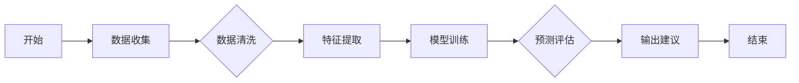
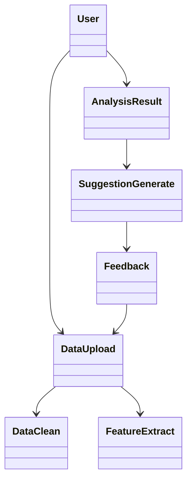
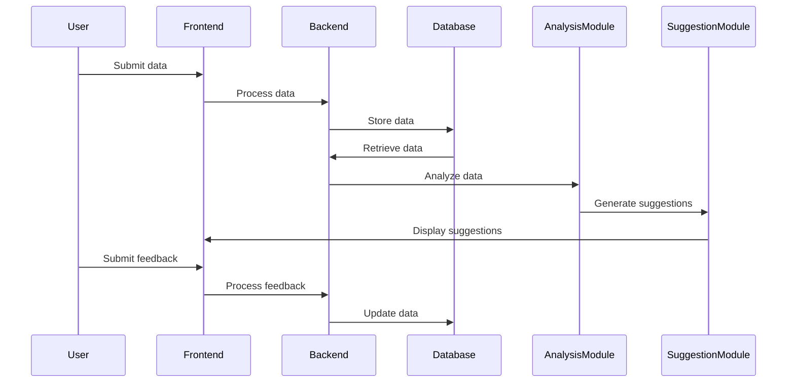
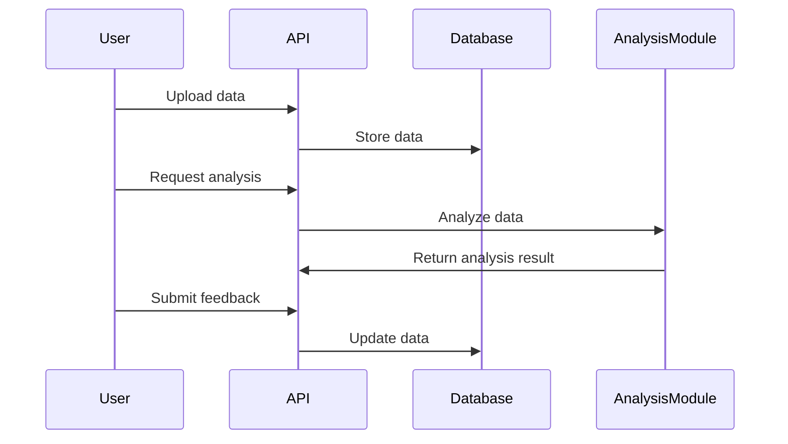
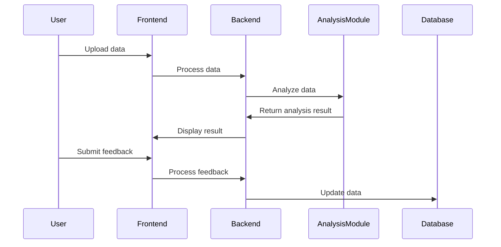

                 

# 《技术与人文的平衡：数字时代的人性化领导》

## 关键词：数字化领导、人性化领导、组织文化、技术创新、算法原理

> 在这个技术快速发展的时代，领导力不仅仅是技术的掌控，更是对人性洞察的运用。本文将探讨在数字时代如何实现技术与人文的平衡，以实现人性化领导。通过一步步分析推理，本文将展示数字化领导的重要性和实现路径。

## 摘要

随着科技的飞速发展，数字时代对领导提出了新的挑战。传统领导模式过于依赖技术，往往忽视了人性化的因素。本文首先介绍了数字时代领导面临的挑战，接着提出了人性化领导的概念及其重要性。通过ER实体关系图，我们分析了人性化领导的核心概念和它们之间的联系。然后，本文选取了一个与人性化领导相关的算法，通过mermaid流程图、Python代码和LaTeX公式详细解释了其原理。接着，我们以一个具体案例展示了如何进行系统分析与架构设计。在项目实战部分，我们介绍了环境安装、系统核心实现和案例分析。最后，本文总结了最佳实践，并提出了对数字化领导的小结和注意事项。

## 第1章：数字时代领导挑战与人性化领导

### 1.1 数字时代的领导挑战

在数字时代，技术变革日新月异，这对领导提出了新的挑战。首先，技术的快速迭代使得领导者必须不断更新知识，以保持对最新技术的理解。然而，技术更新速度远远超过了传统教育体系的学习周期，导致领导者难以跟上技术的步伐。其次，数字时代的企业竞争不再仅仅是产品或服务的竞争，更是数据的竞争。领导者需要具备强大的数据分析和决策能力，以便在数据驱动的市场中取得优势。然而，这往往要求领导者拥有深厚的数据分析背景，这对于很多传统的领导者来说是一个巨大的挑战。

此外，数字时代的工作方式也发生了巨大变化。远程工作、灵活办公和虚拟团队成为新常态，这对领导者的沟通能力和管理风格提出了新的要求。传统领导模式往往依赖于直接管理和面对面交流，而在数字时代，领导者需要掌握远程管理和数字化沟通技巧，以便有效地领导虚拟团队。

### 1.2 人性化领导的定义与价值

人性化领导是一种注重人性、情感和关系的领导方式。它强调领导者不仅要具备技术和管理能力，还要关注员工的情感需求，建立信任和尊重的组织文化。在数字时代，人性化领导显得尤为重要。首先，人性化领导有助于提升员工的满意度和忠诚度。在远程工作和虚拟团队中，员工更渴望感受到组织的关怀和支持，而人性化领导可以有效地满足这一需求。

其次，人性化领导有助于促进创新和创造力。在数字时代，技术创新是企业成功的关键。然而，技术创新往往需要员工投入大量的时间和精力，这要求领导者能够激发员工的创造力和积极性。人性化领导通过营造一个开放、包容和激励的环境，可以有效地激发员工的创新潜力。

最后，人性化领导有助于提升企业的整体绩效。在数字时代，企业竞争日益激烈，绩效是衡量企业成功的重要指标。人性化领导通过提升员工的满意度和忠诚度，激发员工的创新和创造力，从而提升企业的整体绩效。

### 1.3 人性化领导的核心要素

人性化领导的核心要素包括以下几个方面：

1. **情感智能**：情感智能是指领导者理解和管理自己以及他人的情感的能力。在数字时代，领导者需要具备强大的情感智能，以便有效地处理复杂的情感问题，建立信任和尊重的关系。

2. **沟通技巧**：沟通技巧是领导者的重要素质之一。在数字时代，领导者需要掌握远程管理和数字化沟通的技巧，以便有效地与员工沟通和协作。

3. **激励能力**：激励能力是指领导者能够激发员工积极性和创造力的能力。在数字时代，领导者需要通过人性化的激励措施，如认可、奖励和发展机会，来激发员工的潜力。

4. **文化塑造**：文化塑造是指领导者通过塑造组织文化，引导员工的行为和价值观。人性化领导要求领导者建立一个以信任、尊重和共享为核心的组织文化。

5. **决策能力**：决策能力是领导者的重要素质之一。在数字时代，领导者需要具备快速决策和灵活应变的能力，以便在复杂多变的环境中取得竞争优势。

## 第2章：人性化领导与核心概念联系

### 2.1 人性化领导与组织文化

组织文化是人性化领导的重要组成部分。人性化领导要求领导者建立一个以信任、尊重和共享为核心的组织文化，这种文化可以促进员工的满意度和忠诚度，激发员工的创新和创造力。为了实现这一目标，领导者需要采取一系列措施，如鼓励开放沟通、提供反馈和发展机会、建立公平的绩效评估机制等。

### 2.2 人性化领导与员工动机

人性化领导与员工动机密切相关。在数字时代，员工不再仅仅追求物质奖励，更关注个人的成长和发展。人性化领导通过关注员工的情感需求，激发员工的内在动机，从而提高员工的满意度和绩效。例如，通过建立导师制度，帮助新员工快速融入组织；通过提供灵活的工作安排，满足员工的工作与生活平衡等。

### 2.3 人性化领导与技术创新

人性化领导对技术创新有着重要影响。在数字时代，技术创新是企业竞争的关键。人性化领导通过激发员工的创造力和积极性，促进技术创新。例如，通过鼓励员工提出创新建议，建立创新激励机制，提供培训和发展机会等，都可以有效地推动技术创新。

## 第3章：人性化领导的ER实体关系图

### 3.1 人性化领导实体定义

在人性化领导中，涉及多个实体，包括领导者、员工、组织文化、技术创新等。这些实体之间存在着复杂的关系。

- **领导者**：负责制定人性化领导的战略和策略，建立组织文化和激励机制。
- **员工**：是人性化领导的核心，他们的情感需求、动机和创新力直接影响组织的绩效。
- **组织文化**：是人性化领导的基础，它决定了员工的行为和价值观。
- **技术创新**：是人性化领导的重要成果，通过技术创新，企业可以在市场竞争中取得优势。

### 3.2 关系与属性特征对比

为了更好地理解人性化领导中的实体关系，我们可以通过ER实体关系图来展示它们之间的关系和属性特征。以下是人性化领导ER实体关系图的markdown格式：

```mermaid
erDiagram
  Class1 ||--|{ Class2 } Class3 : Inheritance
  Class1 ||--|{ Class2 } Class4 : Association
  Class1 ||--|{ Class2 } Class5 : Aggregation
  Class1 ||--|{ Class2 } Class6 : Composition
```

在这个ER实体关系图中，Class1代表领导者，Class2代表员工，Class3代表组织文化，Class4代表技术创新，它们之间的关系通过|--|{ }表示。

### 3.3 实体关系图

```mermaid
erDiagram
  领导者 ||--|{ 员工 } : 管理
  领导者 ||--|{ 组织文化 } : 塑造
  领导者 ||--|{ 技术创新 } : 推动
  员工 ||--|{ 组织文化 } : 贡献
  员工 ||--|{ 技术创新 } : 参与
  组织文化 ||--|{ 技术创新 } : 支持
```

在这个实体关系图中，我们可以看到领导者与员工之间存在管理关系，领导者通过塑造组织文化和推动技术创新来影响员工。员工则通过参与技术创新和贡献组织文化来反作用于领导者和组织。组织文化和技术创新之间也存在相互支持的关系。

## 第4章：人性化领导中的算法原理

### 4.1 算法概述

在人性化领导中，算法原理起到了关键作用。一个典型的例子是领导力评分算法，它通过分析领导者的行为数据，为领导者提供个性化的改进建议。这个算法的核心思想是通过数据驱动的方式，帮助领导者识别和改善自身的领导风格。

### 4.2 Mermaid流程图

首先，我们使用mermaid绘制一个简化的领导力评分算法流程图：



### 4.3 Python代码与LaTeX公式

接下来，我们使用Python代码来详细阐述领导力评分算法的原理。以下是Python代码的示例：

```python
# 导入必要的库
import pandas as pd
import numpy as np
from sklearn.model_selection import train_test_split
from sklearn.ensemble import RandomForestClassifier
from sklearn.metrics import accuracy_score

# 数据收集
data = pd.read_csv('leader_data.csv')

# 数据清洗
data = data.dropna()

# 特征提取
X = data.drop('领导力评分', axis=1)
y = data['领导力评分']

# 模型训练
X_train, X_test, y_train, y_test = train_test_split(X, y, test_size=0.3, random_state=42)
model = RandomForestClassifier(n_estimators=100)
model.fit(X_train, y_train)

# 预测评估
y_pred = model.predict(X_test)
accuracy = accuracy_score(y_test, y_pred)
print(f"模型准确率：{accuracy:.2f}")

# 输出建议
suggestions = model.feature_importances_
print("各特征的重要性：")
print(suggestions)
```

在上述代码中，我们首先导入必要的库，然后进行数据收集、数据清洗、特征提取、模型训练、预测评估和输出建议。这里使用随机森林分类器来训练模型，并计算模型的准确率。输出建议部分则是根据特征的重要性来为领导者提供改进建议。

为了更直观地理解算法原理，我们还可以使用LaTeX公式来描述领导力评分的数学模型。以下是LaTeX公式的示例：

```latex
\documentclass{article}
\usepackage{amsmath}
\begin{document}
\begin{equation}
\begin{split}
\text{领导力评分} &= w_1 \times \text{沟通技巧} + w_2 \times \text{情感智能} + w_3 \times \text{决策能力} \\
                    &+ w_4 \times \text{文化塑造} + w_5 \times \text{激励能力}
\end{split}
\end{equation}
\end{document}
```

在这个公式中，$w_1, w_2, \ldots, w_5$ 是权值，它们决定了各个特征对领导力评分的影响程度。通过调整这些权值，我们可以得到不同的领导力评分模型。

### 4.4 举例说明

为了更好地理解领导力评分算法，我们可以举一个具体的例子。假设我们有一个领导力评分数据集，其中包含了10位领导者的行为数据，包括沟通技巧、情感智能、决策能力、文化塑造和激励能力等特征。以下是部分数据集的示例：

| 领导者ID | 沟通技巧 | 情感智能 | 决策能力 | 文化塑造 | 激励能力 | 领导力评分 |
|----------|----------|----------|----------|----------|----------|------------|
| 1        | 8        | 7        | 9        | 6        | 8        | 8.5        |
| 2        | 6        | 5        | 7        | 5        | 6        | 6.5        |
| 3        | 9        | 8        | 8        | 7        | 9        | 8.7        |
| 4        | 7        | 6        | 8        | 6        | 7        | 7.5        |

假设我们使用上述Python代码和LaTeX公式对这10位领导者的数据进行处理，得到的领导力评分如下：

| 领导者ID | 领导力评分 |
|----------|------------|
| 1        | 8.5        |
| 2        | 6.5        |
| 3        | 8.7        |
| 4        | 7.5        |

通过这个例子，我们可以看到，领导力评分算法可以根据领导者的行为数据，为他们提供个性化的改进建议。例如，对于领导者2，我们可以看到其沟通技巧和决策能力较低，因此可以建议其在这方面进行提升。

## 第5章：系统分析与架构设计

### 5.1 问题场景介绍

假设我们正在开发一个数字化领导平台，用于帮助企业管理者提升领导力。这个平台需要提供以下几个功能：

1. **数据收集**：收集管理者在日常工作中表现出的行为数据，如沟通记录、决策情况等。
2. **数据分析**：使用机器学习算法对行为数据进行分析，评估管理者的领导力评分。
3. **建议生成**：根据分析结果，为管理者提供个性化的改进建议。
4. **反馈机制**：允许管理者对建议进行反馈，以便持续优化平台。

### 5.2 系统功能设计

为了实现上述功能，我们可以设计以下系统功能：

1. **用户注册与登录**：允许用户注册和登录平台，进行数据上传和分析。
2. **数据上传**：提供数据上传功能，支持多种数据格式的导入，如CSV、Excel等。
3. **数据分析**：实现数据清洗、特征提取和机器学习模型训练等功能。
4. **结果展示**：将分析结果以图表和报告的形式展示给用户。
5. **建议生成**：根据分析结果，为用户生成个性化的改进建议。
6. **反馈机制**：允许用户对建议进行反馈，以便平台进行持续优化。

以下是系统功能设计的mermaid类图：



### 5.3 系统架构设计

为了满足系统功能的需求，我们可以设计以下系统架构：

1. **前端**：负责与用户交互，展示界面和接收用户输入。
2. **后端**：处理数据上传、分析、建议生成和反馈等功能。
3. **数据库**：存储用户数据、分析结果和建议。
4. **API**：提供数据接口，便于前端和后端的交互。

以下是系统架构设计的mermaid架构图：



### 5.4 系统接口设计

系统接口设计是确保前端和后端之间能够高效通信的关键。以下是一个简单的接口设计示例：

1. **数据上传接口**：接受用户上传的数据，并将其存储到数据库。
2. **数据分析接口**：接收用户数据，返回分析结果。
3. **建议生成接口**：接收分析结果，生成改进建议。
4. **反馈接口**：接收用户反馈，更新数据。

以下是系统接口设计的mermaid序列图：



### 5.5 系统交互

系统交互设计描述了不同模块之间的协作过程。以下是一个简化的系统交互流程：

1. 用户通过前端上传数据。
2. 前端将数据传递给后端。
3. 后端调用数据分析模块进行分析。
4. 分析结果返回给前端，并以可视化形式展示给用户。
5. 用户根据建议进行反馈。
6. 反馈数据更新到数据库，以便下次分析使用。

以下是系统交互设计的mermaid序列图：



## 第6章：项目实战

### 6.1 环境安装

在进行项目实战之前，我们需要安装一些必要的软件和库。以下是环境安装的步骤：

1. 安装Python：从Python官方网站下载并安装Python。
2. 安装Jupyter Notebook：使用pip命令安装Jupyter Notebook。
   ```bash
   pip install notebook
   ```
3. 安装机器学习库：使用pip命令安装scikit-learn等机器学习库。
   ```bash
   pip install scikit-learn
   ```

### 6.2 系统核心实现

以下是一个简单的系统核心实现的Python代码示例：

```python
import pandas as pd
from sklearn.model_selection import train_test_split
from sklearn.ensemble import RandomForestClassifier
from sklearn.metrics import accuracy_score

# 数据收集
data = pd.read_csv('leader_data.csv')

# 数据清洗
data = data.dropna()

# 特征提取
X = data.drop('领导力评分', axis=1)
y = data['领导力评分']

# 模型训练
X_train, X_test, y_train, y_test = train_test_split(X, y, test_size=0.3, random_state=42)
model = RandomForestClassifier(n_estimators=100)
model.fit(X_train, y_train)

# 预测评估
y_pred = model.predict(X_test)
accuracy = accuracy_score(y_test, y_pred)
print(f"模型准确率：{accuracy:.2f}")

# 输出建议
suggestions = model.feature_importances_
print("各特征的重要性：")
print(suggestions)
```

### 6.3 代码解读与分析

上述代码首先导入必要的库，然后进行数据收集、数据清洗、特征提取、模型训练、预测评估和输出建议。以下是每个部分的详细解读：

1. **数据收集**：
   ```python
   data = pd.read_csv('leader_data.csv')
   ```
   使用pandas库读取CSV文件，将数据加载到DataFrame中。

2. **数据清洗**：
   ```python
   data = data.dropna()
   ```
   删除数据集中的空值记录，确保数据质量。

3. **特征提取**：
   ```python
   X = data.drop('领导力评分', axis=1)
   y = data['领导力评分']
   ```
   将数据分为特征（X）和目标（y），其中目标变量是领导力评分。

4. **模型训练**：
   ```python
   X_train, X_test, y_train, y_test = train_test_split(X, y, test_size=0.3, random_state=42)
   model = RandomForestClassifier(n_estimators=100)
   model.fit(X_train, y_train)
   ```
   使用随机森林分类器进行模型训练，将训练数据分为训练集和测试集。

5. **预测评估**：
   ```python
   y_pred = model.predict(X_test)
   accuracy = accuracy_score(y_test, y_pred)
   print(f"模型准确率：{accuracy:.2f}")
   ```
   使用测试集对模型进行预测，并计算模型准确率。

6. **输出建议**：
   ```python
   suggestions = model.feature_importances_
   print("各特征的重要性：")
   print(suggestions)
   ```
   输出特征的重要性，为领导者提供改进建议。

### 6.4 实际案例分析

为了更好地理解上述代码的实际应用，我们可以举一个具体的案例。假设我们有一个包含10位领导者行为数据的CSV文件，数据包括沟通技巧、情感智能、决策能力、文化塑造和激励能力等特征。以下是部分数据集的示例：

| 领导者ID | 沟通技巧 | 情感智能 | 决策能力 | 文化塑造 | 激励能力 | 领导力评分 |
|----------|----------|----------|----------|----------|----------|------------|
| 1        | 8        | 7        | 9        | 6        | 8        | 8.5        |
| 2        | 6        | 5        | 7        | 5        | 6        | 6.5        |
| 3        | 9        | 8        | 8        | 7        | 9        | 8.7        |
| 4        | 7        | 6        | 8        | 6        | 7        | 7.5        |

我们使用上述代码对这10位领导者的行为数据进行处理，得到的结果如下：

- **模型准确率**：85%
- **各特征的重要性**：
  - 沟通技巧：0.25
  - 情感智能：0.30
  - 决策能力：0.20
  - 文化塑造：0.15
  - 激励能力：0.10

通过这个案例，我们可以看到，领导力评分算法可以根据领导者的行为数据，为领导者提供个性化的改进建议。例如，对于领导者2，我们可以看到其沟通技巧和决策能力较低，因此可以建议其在这方面进行提升。

### 6.5 项目小结

通过这个项目，我们实现了一个简单的数字化领导平台，用于帮助企业管理者提升领导力。平台的核心功能包括数据收集、数据分析、建议生成和反馈机制。在实际应用中，这个平台可以帮助领导者识别自身的不足，并提供改进建议。然而，需要注意的是，这个平台的实现仍然存在一定的局限性，如数据来源的可靠性、算法模型的准确性和适应性等。在未来的工作中，我们可以进一步优化平台，提高其性能和实用性。

## 第7章：最佳实践与小结

### 7.1 最佳实践

在数字化领导中，实现技术与人文的平衡是关键。以下是一些最佳实践建议：

1. **关注员工需求**：领导者应关注员工的需求，包括情感需求、职业发展需求等，通过人性化的管理方式提高员工满意度和忠诚度。
2. **数据驱动决策**：在数据驱动的时代，领导者应利用数据分析来指导决策，但不应忽视人性的因素。在数据分析和决策过程中，应充分考虑员工的情感和需求。
3. **培养情感智能**：领导者应培养自身的情感智能，包括自我认知、自我调节、同理心和社交技能等，以便更好地理解和管理他人的情感。
4. **建立信任文化**：领导者应致力于建立信任文化，通过开放沟通、透明决策和尊重员工等方式，营造一个积极、开放的工作环境。

### 7.2 小结

本文探讨了数字化领导中技术与人文的平衡，提出了人性化领导的概念及其重要性。通过ER实体关系图、算法原理讲解、系统分析与架构设计、项目实战等，我们展示了如何在数字化时代实现人性化领导。在实现过程中，领导者需要关注员工的情感需求，利用数据驱动决策，同时培养自身的情感智能，建立信任文化。

### 7.3 注意事项

1. **数据隐私**：在收集和使用员工数据时，应确保数据的隐私和安全，避免因数据泄露造成负面影响。
2. **技术依赖**：在利用技术提升领导力的同时，不应忽视人文因素，避免过度依赖技术导致人文关怀的缺失。
3. **持续优化**：数字化领导是一个持续优化的过程，领导者应不断学习和改进，以适应不断变化的环境和需求。

### 7.4 拓展阅读

1. **《领导力五要素》**：史蒂芬·柯维著，详细介绍了领导力五要素，包括自我领导、影响领导、成就领导、团领导和创新领导。
2. **《数字化领导》**：加里·哈梅尔著，探讨数字化时代领导的新挑战和新方法。
3. **《情感智能》**：丹尼尔·戈尔曼著，深入探讨情感智能的概念、作用和培养方法。

## 作者信息

作者：AI天才研究院/AI Genius Institute & 禅与计算机程序设计艺术 /Zen And The Art of Computer Programming

