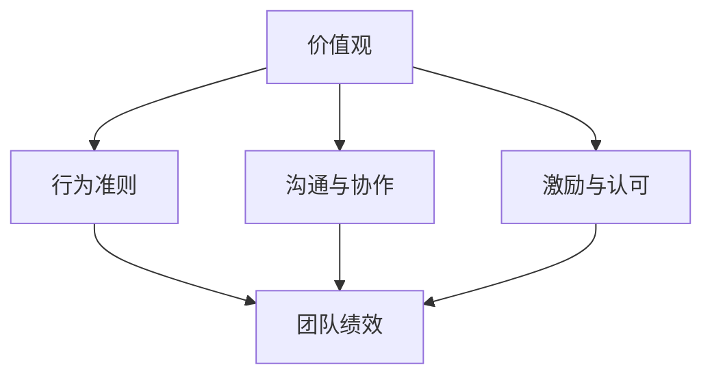
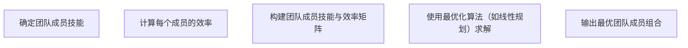
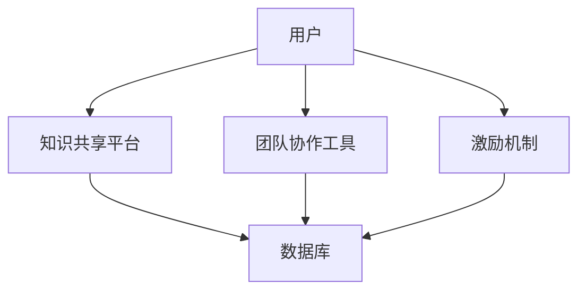
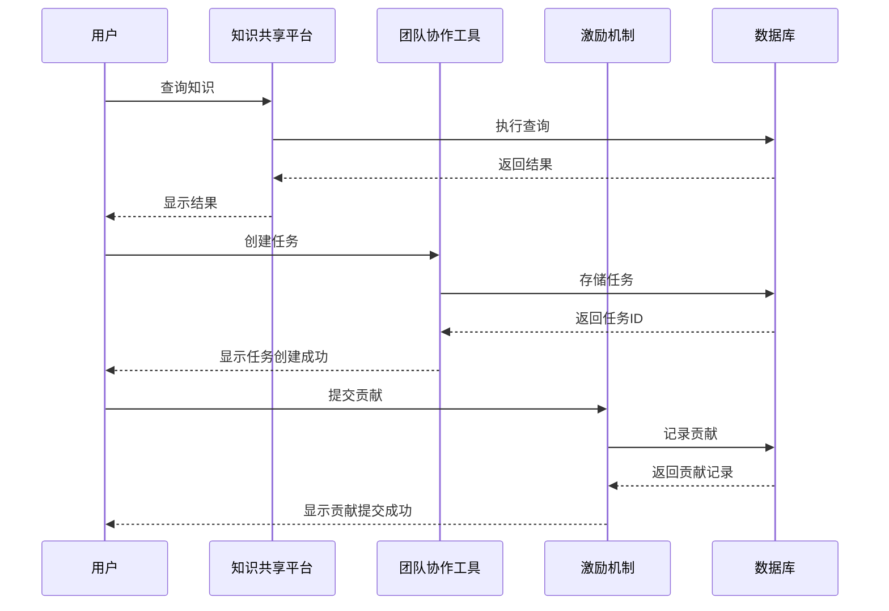

                 

# 技术团队文化建设的关键策略

## 关键词
技术团队、文化建设、策略、管理、沟通、协作

## 摘要
本文深入探讨了技术团队文化建设的重要性及其关键策略。通过分析技术团队的工作模式、面临的挑战以及文化建设的核心要素，本文提出了一系列实用的方法和步骤，以帮助团队领导者构建高效、和谐的工作环境，提升团队整体绩效。

### 引言

技术团队是现代企业中不可或缺的一部分，它们承担着推动业务创新、提升产品竞争力的重要角色。然而，随着团队规模的扩大和项目复杂度的增加，如何管理和发展团队文化成为一个关键问题。团队文化不仅影响成员的工作满意度，还直接关系到团队的生产力和创新能力。

本文旨在探讨技术团队文化建设的关键策略，帮助团队领导者理解和应对团队文化建设过程中的各种挑战，从而打造一个高效、和谐的工作环境。文章将按照以下结构展开：

1. **背景介绍**：阐述技术团队文化建设的背景、定义及其重要性。
2. **核心概念与联系**：介绍技术团队文化建设的核心概念，并展示其相互关系。
3. **算法原理讲解**：探讨技术团队文化建设中可能涉及到的算法原理。
4. **系统分析与架构设计方案**：分析一个典型技术团队文化的系统架构设计方案。
5. **项目实战**：描述一个实际的技术团队文化建设案例。
6. **最佳实践 tips**：总结一些实用的团队文化建设策略和技巧。
7. **小结**：对全文内容进行总结。
8. **注意事项**：提醒读者在实施过程中需要注意的问题。
9. **拓展阅读**：推荐一些相关书籍和资料。

### 背景介绍

#### 技术团队文化建设的定义

技术团队文化建设是指在团队内部建立和维护一种积极、健康、互助的工作氛围，通过明确价值观、规范行为准则、培养团队精神等手段，促进团队成员之间的沟通与协作，提升团队整体绩效。技术团队文化不仅仅是个人价值观的集合，更是团队共同认同的行为规范和理念。

#### 技术团队文化建设的重要性

1. **提升团队凝聚力**：共同的文化价值观能够增强团队成员之间的认同感和归属感，提高团队凝聚力。
2. **提高工作效率**：良好的团队文化能够减少内部摩擦，提高团队成员的协作效率。
3. **促进知识共享**：共享的知识和经验有助于团队创新，提升整体技术能力。
4. **培养人才**：文化建设的团队更注重人才的培养和发展，有助于留住优秀人才。

#### 技术团队文化建设的挑战

1. **多样性管理**：团队成员来自不同的背景和领域，如何有效融合不同的观点和技能是一个挑战。
2. **持续改进**：团队文化需要持续培养和维护，否则容易退化或僵化。
3. **平衡创新与规范**：在鼓励创新的同时，也需要保持一定的规范，确保团队稳定运作。

### 核心概念与联系

#### 核心概念

1. **价值观**：团队共同的信仰和目标，指导团队成员的行为。
2. **行为准则**：规范团队成员的行为，确保团队内部和谐。
3. **沟通与协作**：团队成员之间的有效沟通和协作是团队文化的核心。
4. **激励与认可**：通过激励和认可机制，激发团队成员的积极性和创造力。

#### 概念关系

使用Mermaid流程图展示技术团队文化建设的核心概念及其相互关系：



### 算法原理讲解

在技术团队文化建设中，可能涉及一些算法原理和方法，如团队合作效率优化算法、团队知识共享模型等。以下是一个简单的算法原理讲解：

#### 合作效率优化算法

1. **问题定义**：假设团队有n个成员，每个成员有各自的技能和工作效率。目标是最小化团队完成项目所需的时间。

2. **算法流程图**：



3. **数学模型与公式**：

$$
\text{minimize} \sum_{i=1}^{n} t_i
$$

其中，$t_i$为第i个成员完成项目所需的时间。

4. **举例说明**：

假设有5个成员，他们完成项目的时间分别为2天、3天、4天、5天和6天。通过优化算法，可以确定一个最优的组合，使得整个团队完成项目的时间最短。

### 系统分析与架构设计方案

#### 问题场景介绍

假设我们是一家互联网公司的技术团队，负责开发和维护一个电商平台。为了提高团队的工作效率和创新能力，我们需要设计一套有效的团队文化系统。

#### 系统功能设计

1. **知识共享平台**：用于团队成员之间的知识分享和交流。
2. **团队协作工具**：包括任务管理、进度跟踪、代码评审等功能。
3. **激励机制**：用于奖励和认可团队成员的突出贡献。

#### 系统架构设计

使用Mermaid流程图展示系统架构：



#### 系统接口设计

- **知识共享平台API**：用于提供知识检索、上传和分享等功能。
- **团队协作工具API**：用于任务创建、进度更新、代码评审等功能。
- **激励机制API**：用于记录成员的贡献和发放奖励。

#### 系统交互序列图

使用Mermaid流程图展示系统交互：



### 项目实战

#### 环境安装

在项目实战中，我们选择使用GitLab作为知识共享平台，JIRA作为团队协作工具，以及自建的激励系统。以下是环境安装步骤：

1. **安装GitLab**：在服务器上安装GitLab Runner和GitLab。
2. **安装JIRA**：在服务器上安装JIRA。
3. **安装数据库**：安装MySQL或PostgreSQL。

#### 系统核心实现

以下是系统核心实现的源代码和解读：

```python
# 知识共享平台API示例代码
from flask import Flask, request, jsonify
from models import KnowledgeEntry

app = Flask(__name__)

@app.route('/knowledge', methods=['GET', 'POST'])
def knowledge_api():
    if request.method == 'POST':
        # 创建新的知识条目
        data = request.json
        entry = KnowledgeEntry.create(data)
        return jsonify(entry.to_dict()), 201
    else:
        # 查询知识条目
        query = request.args.get('query')
        entries = KnowledgeEntry.search(query)
        return jsonify([entry.to_dict() for entry in entries]), 200

# 团队协作工具API示例代码
from flask import Flask, request, jsonify
from models import Task

app = Flask(__name__)

@app.route('/tasks', methods=['GET', 'POST'])
def task_api():
    if request.method == 'POST':
        # 创建新的任务
        data = request.json
        task = Task.create(data)
        return jsonify(task.to_dict()), 201
    else:
        # 查询任务
        status = request.args.get('status')
        tasks = Task.search(status)
        return jsonify([task.to_dict() for task in tasks]), 200

# 激励机制API示例代码
from flask import Flask, request, jsonify
from models import Contribution

app = Flask(__name__)

@app.route('/contributions', methods=['POST'])
def contribution_api():
    # 记录成员贡献
    data = request.json
    contribution = Contribution.create(data)
    return jsonify(contribution.to_dict()), 201
```

#### 代码解读与分析

代码解读主要关注API的接口设计和功能实现。知识共享平台API提供了创建和查询知识条目的功能；团队协作工具API提供了创建和查询任务的功能；激励机制API提供了记录成员贡献的功能。

#### 实际案例分析

在实际项目中，我们通过GitLab和JIRA实现了知识共享和团队协作，通过自建的激励系统奖励团队成员的贡献。例如，某个成员提交了一个重要的bug修复，他会在激励系统中获得相应的积分，并在团队月度总结会上得到表彰。

### 最佳实践 tips

1. **定期团队建设活动**：通过团队建设活动增强团队成员之间的沟通和协作。
2. **明确目标和价值观**：确保每个成员都清楚团队的目标和价值观，并以此为指导。
3. **鼓励知识分享**：建立知识分享机制，鼓励团队成员分享经验和知识。
4. **公正的激励机制**：建立公正的激励机制，激励团队成员的积极性和创造力。
5. **持续反馈与改进**：定期收集团队成员的反馈，持续改进团队文化。

### 小结

技术团队文化建设是一个长期而复杂的过程，需要团队领导者持续关注和努力。通过明确价值观、建立行为准则、优化沟通与协作机制，以及公正的激励机制，可以有效提升团队的整体绩效。本文提出了一系列实用的方法和步骤，希望对团队领导者有所启发。

### 注意事项

1. **尊重多样性**：尊重团队成员的多样性，避免文化单一化。
2. **持续关注**：团队文化需要持续关注和维护，避免出现文化退化。
3. **灵活调整**：根据团队的发展和业务需求，灵活调整团队文化建设策略。

### 拓展阅读

1. **《团队协作的艺术》**：一本关于团队协作和团队文化建设的经典书籍。
2. **《激励与绩效管理》**：探讨激励机制在团队管理中的应用。
3. **《敏捷开发实践指南》**：介绍敏捷开发中团队协作的最佳实践。

---

作者：AI天才研究院/AI Genius Institute & 禅与计算机程序设计艺术 /Zen And The Art of Computer Programming

